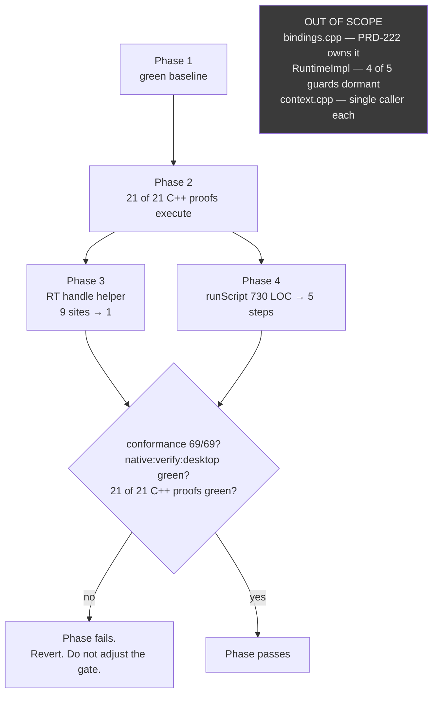

# PRD-223 — runtime-native complexity reduction: repair the net first, then two bounded slices

**Status:** IMPLEMENTED — final cross-platform evidence pending
**Owner:** unassigned
**Package:** `packages/runtime-native`
**Filed:** 2026-08-26

**Complexity: 6 → MEDIUM mode.** Touches 6–10 files (`+2`); one new verification lane from scratch
(`+2`); concurrency/lifetime-sensitive code in the CLI frame loop (`+2`). Automated checkpoint after
every phase; manual checkpoint additionally on Phase 3.

**Supersedes** the first draft of this file. Two independent audits ran (one direct, one via Codex);
this merges them and records where they disagreed and which one the evidence supported.

---

## Hard constraints (owner-stated, binding on every phase)

1. **No behavior may be lost and no regression may be introduced.** Every phase after Phase 1 is a
   **pure move, pure rename, or pure extraction**: symbols relocate, names change, nothing computes
   differently. A phase that needs a logic change is not this PRD.
2. **An area with no *executed* test is not refactorable.** Coverage means a proof a lane actually
   builds and runs — not a proof that exists in the tree.

Constraint 2 is the whole reason Phases 1 and 2 exist, because **the coverage this package appears
to have is largely not executed.**

---

## Verdict

**Yes, refactor — but narrowly, and the first two phases are verification repair, not refactoring.**

Three findings decide the scope:

1. **`packages/runtime-native`'s own test suite is red at HEAD.** Measured, not inferred:
   ```
   $ npx vitest run --config vitest.config.ts      # in packages/runtime-native
   FAIL  tests/webgpu-bindings-contract.test.mjs > all migrated WebGPU registration families use the shared table dispatcher
    Test Files  1 failed | 74 passed (75)
         Tests  1 failed | 542 passed | 34 skipped (577)
   ```
   Nothing should be refactored on top of a red baseline.

2. **15 of the 21 declared C++ test executables are never built and never run by any lane.** They
   are `EXCLUDE_FROM_ALL` in `CMakeLists.txt`, asserted to *exist* by regexes in `tests/*.test.mjs`,
   and executed by nothing. The apparent safety net around the biggest files is mostly fictional.

3. **`src/webgpu/bindings.cpp` — the largest and worst file, 7,312 LOC — is off-limits.** PRD-222's
   in-flight performance work is actively converting the same handler population from
   captured-argument closures to per-class prototype dispatch
   (`docs/bugs/webgpu-binding-table-installed-per-call-2026-08-26.md`), one WebGPU class at a time,
   each step priced. A parallel complexity pass on the same functions would be overwritten or
   invalidated by the next step of that work.

What that leaves is two genuinely bounded slices — a real DRY violation in the raytracing backends,
and a 730-line function in `cli/main.cpp` — behind two phases of net repair that are worth doing
**even if the refactor is never approved.**

---

## Evidence (measured 2026-08-26)

### Size concentration

```
$ find src include -type f \( -name '*.cpp' -o -name '*.h' -o -name '*.mm' \) | xargs wc -l | tail -1
47193 total    (109 files)
```

| File | LOC | Share |
|---|---:|---:|
| `src/webgpu/bindings.cpp` | 7,312 | 15.5% |
| `src/runtime.cpp` | 3,345 | 7.1% |
| `src/js/v8_engine.cpp` | 1,906 | 4.0% |
| `src/cli/main.cpp` | 1,781 | 3.8% |
| `src/webgpu/context.cpp` | 1,567 | 3.3% |
| **Top 5** | **15,911** | **33.7%** |

### Ranked findings

| # | Site | Violation | Evidence | LOC | Executed coverage today | In scope? |
|---|---|---|---|---:|---|---|
| F1 | `src/webgpu/bindings.cpp:1944-6489` — 88 functions `tnWebgpuHandler01`…`89` (15 and 85 absent) | SRP/KISS: numbered, non-semantic names; bodies still carry 12–24 spaces of leftover indentation from the ~1,450-line nested-lambda function they were mechanically extracted from | `tnWebgpuHandler01` (`:6205`) is `HTMLElement.appendChild`; `tnWebgpuHandler89` (`:6209`) is the presentation-cap accessor; `tnWebgpuHandler35` (`:4436`) is 389 lines. Nothing in any name says which JS method it implements. | ~4,500 | Conformance + desktop verify only. The five C++ targets that *look* like coverage — `bindings-creation`, `webgpu-bindings-reentrancy`, `handle-lifetime`, `command-encoder-class-table`, `shader-module-metadata` — are **all in the never-run 15.** | **NO** — PRD-222 owns it |
| F2 | `src/webgpu/bindings.cpp:6230-6489` — `installWebGPUBindingTables` | SRP: one 257-line function installs **91 registration rows across 16 JS surfaces** via 36 `installBindingTable(...)` call sites | `GPUCommandEncoder` 16, `GPURenderPassEncoder` 15, `GPUDevice` 15, `HTMLElement` 9, `HTMLCanvasElement` 9, `GPURenderBundleEncoder` 7, `GPUQueue` 5, `WebGPU` 4, `GPUComputePassEncoder` 4, `GPUBuffer` 4, `GPUCanvasContext` 3, `GPUTexture` 2, `GPUSupportedFeatures` 2, `GPU` 2, `Document` 2, `GPUAdapter` 1 | 257 | Same as F1 | **NO** — PRD-222 owns it |
| F3 | `src/raytracing/vulkan_rt.cpp:911-917`, `dxr_rt.cpp:729-735`, `metal_rt.mm:558-564`, plus the BLAS/TLAS tails (≈9 sites, e.g. `vulkan_rt.cpp:1053`, `dxr_rt.cpp:859`) | **DRY**: identical handle-table bookkeeping repeated per handle type per backend — `uint32_t id = next<X>Id_++; table[id] = std::move(obj); Handle h; h._id = id; h._handle = table[id].get(); return h;` — not required by the Vulkan/DXR/Metal APIs | Read side by side: `vulkan_rt.cpp` `createGeometry` (863–920) vs `dxr_rt.cpp` `createGeometry` (689–738) vs `metal_rt.mm` `createBLAS` (501–570). The buffer calls differ per API (`vkMapMemory` / D3D12 `Map` / `MTLBuffer`); the six-line tail is byte-for-byte identical. | ~54 | **NONE.** `grep -rl "vulkan_rt\|VulkanRTBackend\|dxr_rt\|DXRBackend\|metal_rt\|MetalRTBackend" tests/` returns nothing. `raytracing-contract.test.mjs` covers only `src/raytracing/bindings.cpp` (the JS-facing refusal gate), never the backends. | **YES** — Phase 3, after characterization |
| F4 | `src/cli/main.cpp:997-1727` — `runScript` | SRP: one 730-line function running file validation, headless env setup, banner printing, runtime construction, background-mode config, UI overlay wiring, playtest mailbox bridge, script load, main-loop drive, screenshot/video capture, cleanup — with 8 phase-marking comments already inside it | Phase markers at `:1049` ("Create runtime"), `:1080-1084` (UI layer after runtime, before loop), `:1103-1105` (playtest mailbox bridge), `:1122` ("Load and execute the script") | 730 | **NONE behavioral.** `mystral` builds from `src/cli/main.cpp` + `src/cli/tool_dispatch.cpp` (`CMakeLists.txt:1659`); `mystral-runtime` is the separate library every test target links. **No test executable compiles `main.cpp`.** Five `.test.mjs` files pattern-match isolated source fragments; none characterizes `runScript`'s phase ordering. | **YES** — Phase 4, after characterization |
| F5 | `src/runtime.cpp:166-3332` — `class RuntimeImpl` | SRP: one class, **65 members**, ≥8 responsibilities — lifecycle, six JS host shims, DOM dispatch (`setupDOMEvents` alone is 633 lines at `:2386-3018`, plus 7 `dispatch*Event` members), three timer implementations, animation frames, surface/resize/fullscreen, screenshot/playtest capture, UI bridge. `initialize()` (`:179-390`) inlines a 211-line five-platform switch. | Member list extracted from the class body; platform switch read in full | 3,166 | Indirect only — playtest scenarios and `native:verify:desktop`. No test instantiates the class. The five adjacent C++ targets (`lifecycle-policy`, `timer-delivery`, `timer-engine-first`, `input-restart`, `shutdown-lifetime`) — four of the five are in the never-run 15. | **NO** — deferred, see Non-goals |
| F6 | `src/webgpu/context.cpp:216-1566` | SRP: the wgpu log callback opens a 1,351-line brace region containing unrelated `Context` members; `createSurface` (`:649`) and `createSurfaceWithDisplay` (`:875`) are per-platform branches with one caller each | Measured brace spans | 1,351 | Conformance lane only | **NO** — deferred |
| F7 | `src/js/{v8_engine.cpp:1502-1524, quickjs_engine.cpp:983-992}`, `jsc_engine.mm:1062-1064` — `console` setup | **Examined and ruled out.** Looked like cross-engine DRY because `shim-manifest.json` cites two of the three for the same `console` shim. Each uses its own SDK's object/function-creation API (`v8::Function`, `JS_NewCFunction`, an Objective-C block). No shared logic exists to extract. | Read all three sites | n/a | n/a | **NO** — not a finding |

### Where the two audits disagreed

| Claim | Resolution |
|---|---|
| Codex: the five C++ targets around `bindings.cpp` constitute PARTIAL coverage for F1 | **Wrong.** All five are in the never-run 15 — declared in CMake, asserted-declared by regex, executed by nothing. F1's real coverage is conformance + desktop verify only. |
| Codex: `tests/webgpu-bindings-contract.test.mjs` is 31/32 with a pre-existing failure the bug doc names | **Tally wrong, conclusion right, citation unsupported.** Measured 32 passed / 1 failed of 33. The bug doc does not mention it (`grep assertSurfaceInstallerDelegates` → no hit). Pre-existence verified directly instead: `git diff --stat HEAD -- src/webgpu/bindings.cpp` is empty, and the two markers the assertion reads sit at `:1944` and `:6208` in both HEAD and the working tree. |
| Codex: 87 numbered handlers | 88. `tnWebgpuHandler01`…`89` with 15 and 85 absent. |

---

## The finding that gates everything: 15 of 21 C++ proofs never execute

| Executed today (`pnpm native:verify:desktop`) | Declared but **never built or run** |
|---|---|
| `threenative-audio-decode-ogg-test` | `threenative-audio-graph-test` |
| `threenative-audio-decode-promise-test` | `threenative-bindings-creation-test` |
| `threenative-crash-handler-policy-test` | `threenative-command-encoder-class-table-test` |
| `threenative-lifecycle-policy-test` | `threenative-dom-dispatch-lifetime-test` |
| `threenative-physics-actuation-bindings-test` | `threenative-embedded-bundle-test` |
| `threenative-wgpu-null-handle-test` | `threenative-handle-lifetime-test` |
| | `threenative-input-restart-test` |
| | `threenative-js-engine-contract-test` |
| | `threenative-local-storage-test` |
| | `threenative-shader-module-metadata-test` |
| | `threenative-shutdown-lifetime-test` |
| | `threenative-timer-delivery-test` |
| | `threenative-timer-engine-first-test` |
| | `threenative-video-recorder-state-test` |
| | `threenative-webgpu-bindings-reentrancy-test` |

How the illusion holds — `tests/webgpu-bindings-contract.test.mjs:187` asserts against the **text of
`CMakeLists.txt`**:

```js
/add_executable\(threenative-bindings-creation-test EXCLUDE_FROM_ALL\s*tests\/bindings_creation_test\.cpp\)/u
```

Repo-wide search confirms it: outside `CMakeLists.txt`, the only references to these 15 targets are
regexes asserting their CMake line exists (`tests/runtime-next-contract.test.mjs:288`,
`tests/timer-contract.test.mjs:198`, `tests/webgpu-bindings-contract.test.mjs:959`). `pnpm test` in
this package is `vitest run && pnpm native:physics:parity && publint` — it compiles no C++ at all.

This is the **uncompiled test** and **listed-but-absent test** anti-pattern, in this repository,
today. It is also directly why F5's deferral is not merely a scope choice: four of the five C++
proofs that would have to guard a `RuntimeImpl` split have never run.

---

## Regression nets, before and after Phase 2

| Net | Covers | Command | Status |
|---|---|---|---|
| 6 C++ contract executables | audio decode, crash policy, null handles, lifecycle policy, physics actuation | `pnpm native:verify:desktop` | live |
| 69-row conformance registry | native render output vs browser reference, per scene | `pnpm parity` | live |
| Desktop verify | 300 frames, markers, non-blank screenshot | `pnpm native:verify:desktop` | live |
| `shim-manifest.json` checker | enforced host surface vs `packages/{core,ui,playtest}/src` | `pnpm budgets` | live |
| **15 further C++ executables** | handles, reentrancy, timers, DOM dispatch, JS engine contract, class tables, shader metadata, storage, bundles | Phase 2 lane | **dormant** |
| **RT handle-allocation unit test** | F3's extraction target, host-only, no GPU | Phase 3 | does not exist |
| **`runScript` phase-ordering test** | F4's ordering dependencies | Phase 4 | does not exist |

---

## Behavior Preservation Ledger

The standard Integration Ledger asks "what calls the new code". For a pure-move refactor the
equivalent is **"what would notice if this move changed behavior"**. Filled with real `file:line`
and a real observed red during implementation. A `TBD` at phase end means the phase is incomplete.

| # | Phase | Change | Live caller / wiring (`file:line`, non-test) | Preservation proof | Negative control (must be observed red) |
|---|---|---|---|---|---|
| 1 | 1 | fix `assertSurfaceInstallerDelegates` | `src/webgpu/bindings.cpp:6528` calls the repaired installer block | n/a (repairs a red baseline) | restore the misplaced end marker → red again |
| 2 | 2 | `scripts/verify-native-contracts.mjs` | `package.json:47` chains it from `native:verify:desktop`; `.github/workflows/native-platforms.yml:160` runs that command | n/a (adds coverage) | delete a `PASS` print from any C++ proof → lane red |
| 3 | 2 | 15 dormant targets built + run | `scripts/verify-native-contracts.mjs:191,199` discovers and executes every declared target | n/a | each target run once with an inverted assertion → red |
| 4 | 3 | `allocateRtHandle` in `src/raytracing/rt_common.h` | Vulkan `:911,1047,1210`; DXR `:729,853,998`; Metal `:474,553,647` | `tests/rt_handle_allocation_test.cpp` green before and after | return a stale counter in the handle → RT unit test red |
| 5 | 4 | `runScript` → 5 named steps | `src/cli/main.cpp:1659` dispatches into the five-step path at `:1586-1610` | ordering test green; `native:verify:desktop` 300 frames + screenshot unchanged | reorder overlay attach before runtime construction → ordering test red |

**Rule: the old code is deleted in the same phase that moves it.** Two live copies of a handle-table
tail is how a "refactor" ships a silent behavior fork.

---

## Reachability

- **Entry point (Phase 2 only):** `pnpm --filter @threenative/runtime-native native:verify:desktop`
- **Pre-existing file edited to call it:** `packages/runtime-native/package.json`
- **Registration:** `.github/workflows/native-platforms.yml`
- **User-facing?** No. Internal. Trigger is the native verify lane and CI.
- **Replaces:** Phase 2 replaces the *text-regex* assertions that claim a target exists
  (`tests/webgpu-bindings-contract.test.mjs:187,959`, `tests/runtime-next-contract.test.mjs:288`,
  `tests/timer-contract.test.mjs:198`). Those are **deleted** in Phase 2 — an executed proof makes
  "the CMake line is present" redundant, and keeping both is how the weak one keeps passing after
  the strong one breaks.

---

## Architecture



---

## Execution phases

Each phase is independently shippable and independently revertable. Max 5 files per phase. Every
phase edits at least one pre-existing file.

---

### Phase 1 — green baseline

**Outcome:** `packages/runtime-native`'s vitest suite passes, so every later phase has a real
before/after.

**Files:**
- `packages/runtime-native/src/webgpu/bindings.cpp` — EDIT: **one line.** Move the block-end marker
  `/** Every migrated WebGPU method is a BindingRegistration row in this table unit. */` off the
  closing brace it is fused to at `:6208` and onto its own line where the assertion expects it.
- `packages/runtime-native/tests/webgpu-bindings-contract.test.mjs` — EDIT only if the marker
  cannot be placed without changing the assertion's meaning.

**Root cause:** `assertSurfaceInstallerDelegates` (`tests/webgpu-bindings-contract.test.mjs:765`)
takes `blockBetween(candidate, "static bool installWebGPUBindingSurfaces", "/** Every migrated
WebGPU method … */")`. The start marker is at `bindings.cpp:1944`; the end marker is fused to a
closing brace at `:6208`. The captured "block" is therefore **4,264 lines** of handler bodies, so
`assert.doesNotMatch(surfaceInstaller, /BindingRegistration|\[state|newFunction/u)` cannot pass. The
formatting artifact is a leftover from the mechanical lambda extraction that produced the 88
numbered handlers.

**This phase touches a file PRD-222 owns.** It is a one-line comment move with no code change.
Coordinate before landing, or hand the fix to the PRD-222 lane and depend on it.

**Tests required:**

| Test file | Test name | Assertion | Negative control (observed red) |
|---|---|---|---|
| `tests/webgpu-bindings-contract.test.mjs` | `all migrated WebGPU registration families use the shared table dispatcher` | passes | re-fuse the marker to the brace → red |

**Revert check:** restore the marker to `:6208` → the suite goes red again. Paste both runs.

**Estimate:** 1 hour, plus coordination with the PRD-222 lane.

---

### Phase 2 — the 15 dormant C++ proofs actually run

**Outcome:** `pnpm native:verify:desktop` builds and executes all 21 C++ contract executables, and a
broken contract turns the lane red.

**Files:**
- `packages/runtime-native/scripts/verify-native-contracts.mjs` — NEW: discovers every
  `threenative-*-test` target in `CMakeLists.txt`, builds it, runs it, requires its pass line.
- `packages/runtime-native/package.json` — EDIT: `native:verify:desktop` chain gains the script.
- `packages/runtime-native/tests/webgpu-bindings-contract.test.mjs` — EDIT: delete the
  `add_executable(...)` text regexes at `:187` and `:959`.
- `packages/runtime-native/tests/runtime-next-contract.test.mjs` — EDIT: delete `:288`.
- `packages/runtime-native/tests/timer-contract.test.mjs` — EDIT: delete `:198`.

(`.github/workflows/native-platforms.yml` is edited in a follow-up commit within the same phase —
six files total, split across two commits to respect the five-file rule.)

**Implementation:**
- [x] **Discover targets by parsing `CMakeLists.txt`, never a hardcoded list** — a hardcoded list is
      exactly how the current 15 went dormant.
- [x] **Fail closed:** zero targets discovered is a failure. A target that builds but prints no
      recognized pass line is a failure. An unselected target is reported, never omitted.
- [x] **DRY:** `resolveCmake()`, `buildPreset()` and `run()` already exist in
      `scripts/verify-desktop-audio.mjs:39-70` and are copied in `verify-desktop-stability.mjs` and
      `verify-desktop-physics.mjs`. Extract to `scripts/native-test-lane.mjs` and have all four use
      it — do not write a fourth copy.
- [x] Run each of the 15 once. **Expect failures** — they have never executed and may have rotted.
      Triage each as (a) real defect → its own red-green bugfix commit, or (b) rotted test →
      repaired, shown red first. Never fold a defect fix into a refactor commit.
- [x] Record the triage in `docs/verification/prd-223-phase-2-<date>.md`, naming what ran and what
      did not.

**Wiring:**
- [x] Caller edited: `packages/runtime-native/package.json` → `native:verify:desktop`
- [x] Registration: `.github/workflows/native-platforms.yml`
- [x] Old path: the four text regexes **deleted**, not left alongside
- [x] Ledger rows filled: #2, #3

**Tests required:**

| Test file | Test name | Assertion | Negative control (observed red) |
|---|---|---|---|
| `tests/native-contract-lane.test.mjs` | `should fail when a declared test target is not executed` | discovered-target count equals `add_executable` count in `CMakeLists.txt` | add a target to CMake, do not run it → red |
| `tests/native-contract-lane.test.mjs` | `should fail when discovery finds zero targets` | empty discovery throws | point discovery at an empty file → red |
| lane itself | each of 21 targets | prints its pass line, exits 0 | invert one assertion in `tests/handle_lifetime_test.cpp` → lane red |

**Revert check:** remove the script from the chain → the CI native job stops reporting 21 results and
the count assertion fails.

**Checkpoints:** automated **and** manual — this phase's real output is a triage of 15 never-run
proofs, which needs a human read.

**Estimate:** 1 day for the lane; **budget a second day for triage**, open-ended if defects surface.

---

### Phase 3 — extract the raytracing handle-table helper (F3)

**Outcome:** the six-line handle-table tail exists once instead of nine times.

**Files:**
- `packages/runtime-native/tests/rt_handle_allocation_test.cpp` — NEW: host-only characterization
  test, no GPU, no window, no platform SDK.
- `packages/runtime-native/src/raytracing/rt_common.h` — EDIT: `allocateRtHandle` declaration
  (this file already exists as the shared non-backend raytracing unit, `CMakeLists.txt:1264`).
- `packages/runtime-native/src/raytracing/rt_common.cpp` — EDIT: definition.
- `packages/runtime-native/src/raytracing/vulkan_rt.cpp` — EDIT: 3 tails → 3 calls.
- `packages/runtime-native/CMakeLists.txt` — EDIT: register the new test target.

(`dxr_rt.cpp` and `metal_rt.mm` follow in a second commit within the same phase.)

**Order is mandatory: the characterization test lands and is proven red-green *before* any
backend file is edited.** F3 has zero coverage today; constraint 2 forbids touching it otherwise.

**Implementation:**
- [x] Characterize only the pure bookkeeping the extraction touches — id assignment order, map
      insertion, handle field values — exercised directly, not through `VulkanRTBackend`. The
      backends themselves cannot be characterized end-to-end here (each needs its own GPU and
      platform), and this PRD does not pretend otherwise.
- [x] Red proof: swap `id` for a stale counter value in the returned handle → test fails. Paste it.
- [x] Green proof: today's inline code passes; after extraction, the shared helper passes unchanged.
- [x] **Platform honesty.** Only Vulkan compiles and runs on a Linux host. DXR and Metal are
      compile-checked by symmetry only. Say so in the phase's verification record; claim no result
      that did not execute.

**Revert check:** delete `allocateRtHandle`'s definition → link failure in all three backends.

**Estimate:** 1 day.

---

### Phase 4 — split `runScript` in `cli/main.cpp` (F4)

**Outcome:** `runScript` (`:997-1727`, 730 lines) becomes five named steps under 200 lines each.

**Files:**
- `packages/runtime-native/tests/run-script-ordering.test.mjs` — NEW: characterization test.
- `packages/runtime-native/src/cli/main.cpp` — EDIT: extract `setupHeadlessEnvironment`,
  `createConfiguredRuntime`, `attachUiOverlayIfConfigured`, `wirePlaytestMailboxBridge`,
  `driveMainLoop`, called in the same order from a now-short `runScript`.

**Order is mandatory: the ordering test lands and is proven red-green before the split.**

**Implementation:**
- [x] Pin every ordering dependency the author can find, at minimum: (i) the UI overlay attaches
      after runtime construction and before the loop starts — documented as load-bearing at
      `main.cpp:1080-1084`; (ii) the headless env var is set before runtime construction; (iii)
      whatever else close reading turns up. **A hidden dependency discovered later in a playtest is
      this PRD's regression, not a pre-existing bug.**
- [x] Red proof: reorder two phases in the source → the ordering test fails. Paste it.
- [x] Follow this repo's established style for source-level characterization —
      `tests/wait-latency.test.mjs` and `tests/webgpu-bindings-trace.test.mjs` are the models.
- [x] **Sequencing:** `main.cpp` is modified in the working tree by the in-flight PRD-222 work.
      Phase 4 lands after those changes are committed.

**Gate:** `pnpm native:verify:desktop` — 300 frames, markers, non-blank screenshot whose adapter is
named and is not SwiftShader.

**Negative control:** skip the frame-loop step → verify red on **frame count**, not on the
screenshot alone (a blank screenshot has other causes).

**Revert check:** reorder overlay attach before runtime construction → ordering test red.

**Checkpoints:** automated **and** manual (look at the screenshot).

**Estimate:** 1–2 days.

---

## Non-goals — what this PRD does not touch, and why

| Area | LOC | Reason |
|---|---:|---|
| **`bindings.cpp`'s 88 numbered handlers and both installer functions (F1, F2)** | ~4,500 | **PRD-222 owns this file mid-flight**, converting exactly this handler population from captured-argument closures to per-class prototype dispatch, one class at a time, each step priced (`createCommandEncoder`: 78,835 ns → ~3,820 ns on step 1). A parallel renaming pass would be overwritten or invalidated once the receiver-resolution contract changes — the bug doc's own risk list (receiver identity, paired state, three engines) describes that risk. **Revisit after PRD-222 reaches step 4 and the file's shape settles.** This is the single highest-value complexity target in the package and it is deferred on sequencing, not on merit. |
| **`RuntimeImpl` (F5)** | 3,166 | Two reasons, either sufficient. (a) Four of the five C++ proofs that would guard a split are in the never-run 15 — constraint 2 freezes it until Phase 2 proves them green. (b) `initialize()`'s five-platform switch and `initializeJSAndBindings()`'s subsystem bootstrap have exactly one caller each (`Runtime::create`); splitting them for its own sake is indirection with no second consumer, which the kill-switch rule argues against creating pre-emptively. **Revisit if Phase 2 turns those proofs green *and* a second caller appears** (a headless-only or test-only init path) — not before. |
| **`context.cpp` surface branches (F6)** | 1,351 | Same reasoning as F5(b): single caller, genuine platform bring-up, no measured pain point. |
| **`src/js/{v8,quickjs}_engine.cpp`, `jsc_engine.mm`** | 4,410 | The `console` shim was the most promising cross-engine DRY candidate and it is ruled out (F7): each uses its own SDK's creation API, no shared logic exists. `threenative-js-engine-contract-test` is in the never-run 15; if Phase 2 turns it green it becomes the enabling gate for a future engine-layer audit, filed separately. |
| **`webtransport.cpp` (1,224), `module_resolver.cpp` (965), `canvas2d.cpp` (781), `debug_server.cpp` (739), `gpu_readback_recorder.cpp` (734)** | 4,443 | Zero executed coverage. Constraint 2 freezes all of them. |

Also out of scope per the root AGENTS.md: no custom renderer, no IR, no scene format, no editor, no
preset system, no new abstraction layer without a named caller (Phase 3's `allocateRtHandle` has
nine already-named callers, not a hypothetical one). **No performance change is a goal here** — a
phase that makes something faster has changed behavior and must be split out.

---

## Risks

| # | Risk | Mitigation |
|---|---|---|
| R1 | **Phase 2 finds several of the 15 dormant proofs already failing.** Likely — they have never executed. | Triage is budgeted as part of Phase 2. Each real defect gets its own red-green bugfix commit, never folded into a refactor. |
| R2 | **PRD-222 collision.** `git status` at audit time shows `src/cli/main.cpp`, `src/runtime.cpp`, `src/webgpu/bindings.cpp`, `src/webgpu/registration_table.cpp` and all three `src/js/*_engine.*` modified in the working tree. | Phase 3 touches none of them and lands independently. Phase 4 lands after PRD-222's `main.cpp` changes commit. Phase 1's one-line fix is coordinated with, or handed to, the PRD-222 lane. |
| R3 | **Phase 4 hidden ordering dependency** surfaces only in a playtest. | Phase 4's characterization test must pin every ordering dependency found before the split; the phase is not done until the author has read the full 730 lines. |
| R4 | **Text-regex assertions get widened instead of replaced.** Broadening a regex to cover new files would let a genuinely deleted row pass. | Phase 2 deletes the four `add_executable` regexes outright rather than adjusting them. |
| R5 | **DXR/Metal cannot be executed on this host.** Phase 3's correctness there rests on symmetry with Vulkan's tested path. | State the limitation plainly in the verification record. Claim no platform that did not execute — same standard PRD-222 applied to QuickJS/JSC receiver work. |
| R6 | **Host surface changes silently.** `shim-manifest.json` is enforced by `pnpm budgets` against `packages/{core,ui,playtest}/src`. | `pnpm budgets` runs every phase. Neither Phase 3 nor Phase 4 crosses into JS-facing API — Phase 3's helper is internal to the backends and never reaches `src/raytracing/bindings.cpp`. |
| R7 | **Conformance rows go blocked instead of failing.** The registry reports an unselected row as **blocked**, never passed — but a phase could quietly stop selecting rows. | Assert the *selected* count, not just the pass count. A drop in selected rows fails the phase. |
| R8 | **A concurrent agent lane edits the same files.** Another session works in this tree. | Commit per phase, immediately. Check `git status` and mtimes before attributing any red. Do not start on an uncommitted working tree. |
| R9 | **Device lanes disagree with desktop.** Android emulator and phone have disagreed before; iOS hardware is unproven. | This PRD claims desktop only. Android/iOS re-verification is one pass after Phase 4, reported per platform. |

---

## Acceptance criteria

Written about the consumer, not the artifact.

**Phase 1**
- [x] `npx vitest run --config vitest.config.ts` in `packages/runtime-native` is 0 failed
- [x] Re-fusing the marker turns it red again (pasted)

**Phase 2**
- [x] `pnpm native:verify:desktop` executes 21 C++ contract proofs and prints 21 results
- [x] Inverting an assertion in any one of them turns the lane red (pasted)
- [x] Every previously-dormant proof is green, or has a filed defect naming what it caught
- [x] The four `add_executable(...)` text regexes no longer exist
- [x] `docs/verification/prd-223-phase-2-<date>.md` records what ran and what did not

**Phase 3**
- [x] `tests/rt_handle_allocation_test.cpp` was observed red before the extraction (pasted)
- [x] The nine duplicated tails are gone — `grep` pasted showing no second live copy
- [ ] Vulkan compiles and its test runs on Linux; DXR and Metal are reported **compile-checked only**
      — Vulkan PASS; DXR/Metal UNVERIFIED because their platform SDKs are unavailable on this host

**Phase 4**
- [x] `tests/run-script-ordering.test.mjs` was observed red on a deliberate reorder (pasted)
- [x] `runScript` is under 150 lines and calls five named steps
- [x] `pnpm native:verify:desktop` completes 300 frames with a non-blank screenshot whose adapter is
      named and is not SwiftShader

**Every phase**
- [x] `pnpm parity` reports the same 69 rows with the same **selected** count and the same verdicts
- [ ] `pnpm typecheck && pnpm lint && pnpm test` green
- [x] `pnpm budgets` green
- [x] The phase's negative control was **observed red**, pasted
- [x] Moved code is deleted from its old home — `grep` pasted

**Whole PRD**
- [x] Behavior Preservation Ledger has zero `TBD` cells
- [x] A player of a template game cannot tell any build in this PRD apart from `main` at PRD-223
      start — same frames, same pixels, same frame times within noise
- [ ] Every gate above was observed red at least once; any gate never seen red is reported
      **UNVERIFIED**, not PASS

---

## Estimate

| Phase | Estimate |
|---|---|
| 1 — green baseline | 1 hour + coordination |
| 2 — dormant proofs execute | 1 day + 1 day triage (open-ended if defects surface) |
| 3 — RT handle helper | 1 day |
| 4 — split `runScript` | 1–2 days |
| **Total** | **3–4 working days**, Phase 2 triage excluded |

**Phases 1 and 2 are worth doing even if Phases 3 and 4 are never approved.** They turn a red
baseline green and convert 15 fictional proofs into real ones — which is also the precondition for
ever revisiting `bindings.cpp` (F1/F2) and `RuntimeImpl` (F5), the two largest complexity targets in
the package.
