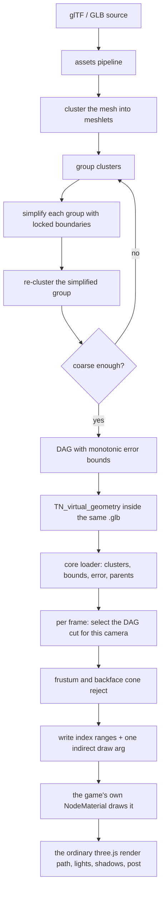

# PRD-279 — geometry the camera cannot resolve is never submitted

**Status: SCOPING — filed 2026-08-30 against `80254bd0`. Nothing in this file has been measured,
and every claim about an upstream repository is second-hand until Phase 0 closes.** The plan below
is a sequence of kill gates, not a commitment to ship a Nanite clone. Phases 0 and 1 are cheap and
answer whether the rest is worth opening.

**Goal: a game imports a mesh far denser than the screen can resolve, and the frame submits only
the clusters that resolve — on web and on native, from the same source, with the game's own
material still doing the shading.** The user-facing surface is one flag on geometry the pipeline
already compiles, not a second renderer and not a second way to author a scene.

**Complexity:** +2 a new subsystem that spans the offline pipeline and the per-frame hot path,
+2 a new on-disk payload, +2 GPU-driven submission inside a frame this repository has already
measured and tuned, +1 four packages (`assets`, `core`, `create-threenative`, `runtime-native`),
+1 a native lane with one binding known to be missing, +1 an integration against three.js's node
material system that the mined references all solve by owning the shading path this framework may
not own = **9 → HIGH mode.**

Sibling context: the [feature-mining batch](./feature-mining/README.md), whose correction about
`GPUParticles3D` — *mechanism is not the look* — is the rule this PRD lives or dies by.

## 1. Why this is proposed at all

The framework's public surface has **194 capability entries**
(`packages/create-threenative/capabilities.json`) and **not one of them is a level of detail, a
cluster, or a per-triangle culler**. The only culling that ships decides per *object*: the render
projection's frustum pass, landed by [PRD-238](./done/PRD-238-the-projection-culls-what-the-camera-cannot-see.md),
removes sub-draws whose whole object is off screen. A single 2-million-triangle asset in view is
therefore submitted whole, every frame, at every distance.

The offline half is equally whole-mesh: `packages/assets/src/passes/model.ts` runs one
`simplify` at one ratio for the entire model (`model.ts:11-12`), a decision taken once, with no
camera, for all viewing distances at once. Its own report already admits when the error tolerance
stopped it short (`packages/assets/src/report.ts:83-87`).

So today a game that wants scanned or sculpted geometry has exactly two options, and both are the
game's problem: author discrete LODs by hand and switch them with `THREE.LOD`, or decimate once in
the pipeline and accept the loss up close.

**What is not known, and is what Phase 0 exists to find out:** none of the above has been priced.
This repository has no measurement of what a dense static asset costs in its own frame, on either
target. The nearest neighbouring facts it does hold are that WebGPU unrolls a `BatchedMesh` into
one `drawIndexed` per sub-draw
(`docs/verification/prd-152-transparent-scene-optimization-2026-08-18.md:110`), and that on the
native Pixel 8 lane the owner's bar is 60 fps and the frame ledger lives in
`docs/verification/runtime-perf-state.md`. A PRD this size does not open on an intuition.

## 2. The charter question, answered before the design

**(a) Could the game write this portably itself?** No. It needs storage buffers, a compute
dispatch, an indirect draw buffer, and a bake step that runs in the asset pipeline. Every one of
those is a seam the framework already owns and the game must not learn.

**(b) Does it decide how anything looks?** It must not — and this is the single constraint that
shapes the entire design. **Every mined reference answers "yes" here.** Nyx, Vulcanite,
nanite-at-home and `nanite-webgpu` all render into a *visibility buffer* and then resolve
materials in a full-screen pass. That pass is the shading path. Adopting it would mean this
framework decides how lighting, tonemapping and material evaluation happen for any virtualized
mesh — a rule-3 veto, and rule 3 outranks rule (a).

**The v1 design therefore drops the visibility buffer**, and keeps the game's own `NodeMaterial`
drawing the selected clusters through three.js's ordinary path. This costs performance relative to
the references and buys the only thing that makes the feature admissible here. It is stated up
front because it is the decision most likely to be argued with later.

The test that must stay answerable *yes* at every phase: **can the game change the appearance
completely without editing framework code?** In v1 it can, because the framework never constructs
a material.

**Where it goes, and no new package.** A package exists only when it carries a dependency the
others must not inherit, and nothing here does: the baker lands in `packages/assets`, which
already depends on `meshoptimizer` (`packages/assets/package.json:43`) and `@gltf-transform`; the
runtime lands in `packages/core` and imports nothing but `three`. **If the runtime ever needs
`meshoptimizer` at run time, that is a signal to stop and re-scope, not a dependency to add.**

**And it is not a scene format.** A scene format is closed with evidence and outranks rule 1. What
this emits is a per-mesh geometry payload written *into the `.glb` the pipeline already produces*,
as a glTF extension — `TN_virtual_geometry` — detected by the same seam that already lazily wires
the meshopt and Draco decoders off `extensionsUsed` (`packages/core/src/assets.ts:196-215`).
Nobody authors it, nobody reads it by hand, and no new file type appears in a game's repository.
If the design cannot stay inside that constraint, that is itself a decline condition.

## 3. What this repository already has — verified against `HEAD`

| Piece | Where | State |
| --- | --- | --- |
| `meshoptimizer` 1.1.1, in the pipeline | `packages/assets/package.json:43`, used at `passes/model.ts:11-12` | **already a dependency** |
| Meshlet construction and cluster bounds | `meshopt_clusterizer.d.ts`: `buildMeshlets`, `buildMeshletsFlex`, `buildMeshletsSpatial`, `computeMeshletBounds`, `computeClusterBounds` | **ships in the installed JS build** |
| Boundary-locked simplification | `meshopt_simplifier.d.ts`: `simplifyWithAttributes(..., vertex_lock, ...)`, `LockBorder` flag | **ships** — this is what the DAG's group-locked simplify needs |
| **Cluster partitioning** | — | **missing from the JS binding.** No `partitionClusters` anywhere in `meshopt_clusterizer.js`; the README's Clusterizer section documents build/extract/bounds only. This is the one algorithm the DAG cannot be built without |
| Indirect draw from three.js | three `0.185.1` (`pnpm-workspace.yaml:4`): `IndirectStorageBufferAttribute` (15 references in `three.webgpu.js`), `geometry.indirect` → `drawIndirect`/`drawIndexedIndirect` | **available, unpatched** |
| Indirect compute dispatch from three.js | `three.webgpu.js:85352` `dispatchWorkgroupsIndirect` | available |
| Indirect draw on native | `bindings_commands.cpp:1255-1261` and `:1522-1527`; frame-stream opcodes 10/11 at `bindings_frame_stream.cpp:107,241`; `GPUBufferUsage.INDIRECT` at `bindings.cpp:2635`; usage attribution at `bindings_resources.cpp:122` | **bound on both native paths** |
| **Indirect compute dispatch on native** | frame-stream opcode table names `compute.setPipeline`, `compute.setBindGroup`, `compute.dispatchWorkgroups`, `compute.end` — and no indirect form (`bindings_frame_stream.cpp:107`) | **missing.** Either a binding to add, or the dispatch count stays CPU-side |
| Multi-draw indirect | — | **does not exist on this stack.** WebGPU unrolls a batch into one `drawIndexed` per sub-draw (`prd-152…:110`). The design must produce *one* indirect draw per material batch, never one per cluster |
| A per-frame compute lifecycle to attach to | `ComputeDrivenRegistry`, `packages/core/src/compute-driven.ts` — warmup, `process` at a declared cadence, release | **exists; nothing new is needed in the loop** |
| Precedent for packing a scene into TSL storage | `packages/core/src/gpu-scene-bvh.ts` | exists |
| The "must beat doing nothing" discipline | `projection-plan.ts` — `MIN_BATCH_MEMBERS`, the kill-switch ratio, and the black-screen incident it was written for | the same gate applies here |

The two rows in bold are the project's real unknowns, and they are what Phase 0 and Phase 1 are
sized around.

## 4. What is mined, from where, and under what licence

**Unverified as of filing.** The repository rule is that a claim about an upstream source is cited
by file and line against a depth-1 clone read on a stated date. None of the rows below have been.
Phase 0 does the cloning and either confirms each row or strikes it.

| Source | Licence | What would be taken |
| --- | --- | --- |
| `zeux/meshoptimizer` | MIT | Already installed. Meshlets, bounds, locked simplification; and the C++ `demo/clusterlod.h` as the **algorithm** for group → simplify → re-cluster, since that header is not in the JS binding |
| `Scthe/nanite-webgpu` | MIT | Closest stack match — TypeScript + WGSL. LOD-selection and cull kernels, and its preprocessed layout, as reference |
| `moonlovelj/Nyx` | MIT | Streaming: fixed-size pages, GPU request feedback, residency/address table, eviction. Phase 5 only |
| `zeux/niagara` | MIT | GPU-driven submission shape: instance cull → cluster cull → depth pyramid |
| `bdwhst/Vulcanite` | MIT | DAG builder and GPU traversal as pseudocode |
| `Firestar99/nanite-at-home` | MIT | The baker/runtime/disk/GPU separation, when fixing what `TN_virtual_geometry` holds |
| `AIFanatic/three-nanite` | MIT | three.js integration details only; its own README calls it a start |
| `Unity-Technologies/com.unity.virtualmesh` | **Unity Companion License** | **Read for architecture. No code, no shader, no constant, no structure copied.** Anyone who opens it says so in the commit message |

Vendored MIT code keeps its copyright header and is listed in the licence manifest; a port that
follows a source closely enough to be a derivative is treated as vendored, not as inspiration.

## 5. The shape of v1

The selection rule is the standard one and is the whole correctness argument: a cluster is drawn
when **its own screen-space error is under the threshold and its parent group's error is not**. If
the error stored through the DAG is monotonic — a parent never claims less error than any child —
then that rule picks a cut with no cracks, for any camera, without any neighbour communication.
That invariant is testable offline, in `vitest`, with no GPU, and it is the first thing to test.

**Out of v1, explicitly:** software rasterization of sub-pixel triangles, the visibility buffer and
its material resolve, impostors, skinned and morphed geometry, alpha-tested foliage, streaming
(Phase 5 at the earliest), and shadow passes driven by their own cut — v1 shadows draw the
coarsest cut resident, or the game keeps its existing shadow proxy.

## 6. Phases, each with the condition that ends the project

**Phase 0 — price the problem and read the sources. No code in `packages/`.**
Extend `examples/engine-load-test` with a dense-static-asset rung, and measure, on browser WebGPU
and on packed Linux desktop native: frame p50, `render.p50`, draw calls and triangles for a
2M-triangle asset at 1080p, against the same scene decimated to 5%. Clone all eight sources at
depth 1 and rewrite §4 with file-and-line citations.
**Decline if** the dense asset costs less than roughly 2 ms over the decimated one at a realistic
view — nothing downstream is worth 9 complexity points for that — **or** if the frame is already
CPU-bound at the submission stage, in which case the honest PRD is a cheaper one about submission.

**Phase 1 — the baker, offline, no renderer.**
Meshlets from `buildMeshletsFlex`, groups, locked simplify, re-cluster, error propagation, written
into `TN_virtual_geometry`. Partitioning must be solved *without* adding a native build step to
the asset pipeline: port the graph partition in TypeScript, or build a WASM of `meshoptimizer`
that exports the partitioner, in that order of preference.
**Decline if** partitioning cannot be solved that way, or if the DAG's error bounds cannot be made
monotonic on real scanned assets — a crack in a cut is a visible hole, and there is no runtime fix
for it.

**Phase 2 — selection on the CPU, one indirect draw.**
Walk the cut on the CPU, write the index ranges, submit one `drawIndexedIndirect` per material
batch through the game's own material. Slower than a compute cut, and that is the point: it is
deterministic, it runs in the node-environment test suite, and it is the oracle Phase 3 is checked
against.
**Decline if** the selected cut cannot beat drawing the source mesh whole on the Phase 0 scene —
the same rule `projection-plan.ts` already enforces on the projection.

**Phase 3 — the cut moves to compute (TSL), and native runs it.**
Same cut, computed in a kernel, dispatched through `ComputeDrivenRegistry`. Parity with the Phase 2
oracle is the acceptance test. The native lane is not optional: `--target desktop` in the same
commit, and the missing `dispatchWorkgroupsIndirect` binding is resolved here or the dispatch count
stays CPU-side and is measured as such.

**Phase 4 — two-pass occlusion with a hierarchical depth buffer.** Only after Phase 3 holds.

**Phase 5 — pages, residency and streaming**, mined from Nyx. Only if a game in this repository or
in the sandbox has an asset that does not fit in memory. Not before.

## 7. The kill switch

Scored with `pnpm tsx scripts/count-loc.ts`, against the honest alternative: a game that hand-authors
three discrete LODs and switches them with `THREE.LOD`.

| | Lines |
| --- | --- |
| Baker in `packages/assets` | to be measured at Phase 1 |
| Runtime in `packages/core` | to be measured at Phase 2 |
| Hand-written equivalent, per game | three authored LODs + a switch, per asset |
| Caller delta, `examples/engine-load-test` | to be measured |

The threshold is stated now so it cannot be moved later: **if the caller does not get shorter and
the frame does not get faster, the whole thing is deleted**, however much of it exists. A feature
of this size that only breaks even is worse than nothing, because every future change pays for it.

## 8. Acceptance criteria

Unchecked, and several are conditional on the phase before them surviving its gate.

- [ ] **AC0 — the problem has a number.** Phase 0's measurement is in `docs/verification/`, naming
      both targets, with the decline threshold evaluated in writing.
- [ ] **AC1 — the sources are read, not cited from memory.** §4 carries file-and-line citations
      against depth-1 clones, dated, and any row that does not survive is struck rather than
      quietly softened.
- [ ] **AC2 — the DAG has no cracks.** A test picks cuts at many error thresholds on a real asset
      and asserts every boundary edge is shared by exactly two selected triangles.
- [ ] **AC3 — red-green, monotonic error.** Removing the parent-error `max` propagation in the
      baker fails AC2's test with a named hole count, and that failure is pasted.
- [ ] **AC4 — red-green, the empty cut.** A camera that resolves nothing produces zero submitted
      clusters and no draw, not a zero-count indirect draw that draws nothing and warns nothing —
      the failure mode `projection-apply.ts:146` already records for `InstancedMesh`.
- [ ] **AC5 — compute matches the CPU oracle.** For a fixed camera set, the Phase 3 kernel selects
      the same cluster set as the Phase 2 walk, exactly.
- [ ] **AC6 — it originates no appearance.** `packages/core/__tests__/constraints.spec.ts` asserts
      the module constructs no material, light or colour and contains no hex literal, on the same
      terms as `tracers.ts` and `instanced-batch.ts`.
- [ ] **AC7 — the game still owns the look.** A test swaps the material on a virtualized mesh and
      asserts the swapped material is what draws; no framework shader participates.
- [ ] **AC8 — a named caller.** `examples/engine-load-test` with the dense rung, and a playtest
      scenario that asserts the frame result, not that the code ran.
- [ ] **AC9 — native.** A `--target desktop` playtest in the same commit as Phase 3, with
      `adapter.info` named. Android and iOS may be `UNVERIFIED`, and must say so.
- [ ] **AC10 — discoverable.** `capabilities.json` regenerated, the new entry findable by the plain
      words a game would use — *"a model too detailed to draw"* — and `check-capability-docs.ts`
      clean.

## 9. Risks, in the order they are likely to bite

1. **No multi-draw indirect.** Every reference implementation submits thousands of clusters in one
   command. This stack cannot, so the win has to come from *not submitting* geometry rather than
   from cheap submission. If per-material indirect draws leave the frame no better, Phase 2's gate
   catches it — that gate is the point.
2. **Dropping the visibility buffer costs most of the published speedups.** Accepted deliberately.
   The alternative is owning the shading path, which is not available here.
3. **The bake is slow.** A full DAG on a large asset is minutes, and the pipeline runs in CI. It
   caches by content hash or it does not ship.
4. **Second-hand claims.** §4 is the weakest part of this file today and is Phase 0's first job.
5. **The pull toward v2.** Streaming, impostors and software raster are the interesting parts, and
   each of them re-opens rule 3. They stay out until a game in this repository needs them.
