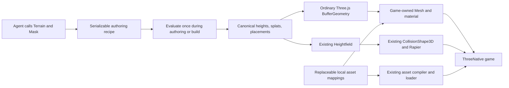

# PRD-466 — Agent-authored Strata terrain through the Three.js contract

**Status:** PARTIAL
**Complexity:** 7 (HIGH); risk override: none
**Owner:** ThreeNative maintainers
**Depends on:** None
**Progress:** 5/9 required boxes verified
**Required companion:** [PRD-467 — live terrain editor](PRD-467-strata-live-terrain-editor.md)
**Required companion:** [PRD-468 — atmosphere, cameras, and asset imports](PRD-468-strata-world-controls-and-asset-imports.md)

## Context

An agent should author useful terrain through code, without Blender or editor
clicks, and use the result through ordinary Three.js objects inside ThreeNative.
Strata already provides the heavy operations: noise, erosion, sculpting, pads,
roads, rivers, material masks, and scatter. The requested integration preserves
those operations and adds replaceable starter art, rendering, and physics wiring.

**Visual goal: Unreal look and feel.** The starter world should read as a realistic,
cinematic landscape: physically scaled PBR surfaces, believable tree/rock shapes,
coherent sun/sky/atmosphere, grounded vegetation, and a realistic coastal ocean.
Procedural shapes are the default; baked Poly Haven textures supply surface detail.
All geometry parameters, textures, lighting, water, and post effects remain editable
game source. The goal names the appearance, not an Unreal runtime dependency.

**Primary output: a self-contained GLB easily usable in any game.** The exported
world includes terrain, trees/rocks/grass, final authored transforms, and embedded
portable PBR textures. ThreeNative powers authoring/preview but is not required
to load the GLB. Export portability is a release criterion, not a later adapter.

The user also requires a terrain editor URL that shows agent changes live, with
individual selection, transform gizmos, GUI polish, and embedded spatial debugging
for map/screenshot reconstruction. That distinct authoring
tool is specified in PRD-467. Both PRDs are required for the complete requested
integration; finishing this runtime/package PRD alone does not finish that goal.

The subsequent execution request authorizes implementation in the shared
PRD-466/467/468 worktree and draft PR #381, with incremental pushes and screenshots of visible milestones attached to
PR #381. npm
publication remains outside this execution request. Complexity is 3 for 11+ implementation files
(mostly recovered supplied modules), 2 for the new authoring module, and 2 for an
independently packed/released optional addon. No marketplace API is required.

### Supplied source and existing integration points

The inputs are `/home/joao/Downloads/AGENT_GUIDE.md` (10,460 bytes, SHA-256
`487453218f870c5e829d58aea3fe9323e74ea93e0aecef8d5c329ecf56972d06`) and
`/home/joao/Downloads/strata-terrain.html` (216,039 bytes, SHA-256
`c0230e6891db829a5196d93ff7c9d714a8f2d964cac4722eb8ce4b2f723d794b`).
The HTML embeds named JS modules, including `src/index.js`, `src/core/*`,
`src/three/adapter.js`, and `src/editor/*`. Recover the supplied modules; do not
rewrite the evaluator or copy the minified HTML into the runtime. The guide names
types but the embedded source inventory does not contain `src/index.d.ts`.
Recover original declarations if available; otherwise type the supported public
surface from the implementation rather than inventing signatures.

Capability search and detail identified existing `Heightfield`, `TerrainTiles`,
`CollisionShape3D`, `rapier`, `compileAssets`, and `WorldCells`. Reuse the terrain,
physics, and asset mechanisms; do not make Strata output masquerade as a `WorldCells` manifest.
Its runtime archive is a different format.

- `packages/core/src/world.ts:94`: `Heightfield` accepts canonical height arrays;
  `toGeometry()` emits Three.js geometry and `toColliderHeights()` transposes to
  Rapier order. `origin` is the field centre, not the southwest corner.
- `packages/physics/src/CollisionShape3D.ts:140`: existing heightfield collider.
- `examples/abyss-framework/src/scenes/TerrainProbe.ts`: existing game-side
  terrain/physics wiring; reference it without replacing that unrelated probe.
- `packages/create-threenative/templates/*/src/render/`: game-owned visual source.
- `pnpm-workspace.yaml`: Three.js is currently 0.185.1; the supplied HTML imports
  0.180.0 from a CDN. The integration uses the consumer's installed Three.js.

## Solution

### Package and ownership

Ship an optional **`@threenative/terrain`** addon in `packages/terrain/`, integrated
with the engine's normal package, asset, and capability paths. Ordinary games do
not import it or load its starter assets unless they use terrain generation.
There is one authoring implementation and one optional package, not a separate
terrain renderer, scene graph, or second engine.

The root export contains the supplied headless `Terrain`, `Mask`, evaluation,
baking, and export operations. A `/three` subpath converts baked mesh arrays to
an ordinary indexed `THREE.BufferGeometry`; it never creates a renderer, scene,
camera, light, material, or render loop. `three` is a peer dependency. Keep physics
integration in game source using the existing engine API; the generator does not
depend on Rapier or install a second physics world.

The current [charter](../architecture/CHARTER.md) excludes recipe systems and
allows a new framework package only for an isolated dependency. Strata authoring
does not automatically satisfy that rule. This plan explicitly proposes a narrow
allowance for the requested optional terrain authoring addon in phase 1. Recipes
remain authoring documents compiled into ordinary runtime data; they never become
an engine scene format. The allowance also covers the five requested editable
terrain starter documents and the terrain-only authoring
companions in PRD-467/PRD-468, including world atmosphere/camera controls and
project asset imports, not a general game editor, genre preset system, or ownership
of appearance. The charter change is part of the integration's review,
not an exception a future implementer may silently infer.

### Consumer flow

Agents use stable operation IDs and `applyPatch()` for revisions. The supported
entry points remain `evaluate()`, `bakeMesh()`, `bakeTerrain()`, and `makeExport()`.
Do not introduce a competing `generate()` API or a CLI vocabulary.

The first game is `examples/strata-terrain-preview/`: a seeded 512-metre map at
257 vertices per side, defaulting to Temperate Forest/Grassland, with an eroded
hill, flat building pad, graded road, procedural trees/rocks/grass, and a river.
A Coastal/Island benchmark supplies the visible realistic ocean. It has a playable character,
not just an orbit screenshot.
The full evaluator runs before play; desktop uses build-baked arrays/assets.
No generation, worker, erosion, or collider rebuild occurs during steady play.
Recover the supplied editor in PRD-467 instead of replacing it with a second
invented editor. The preview owns one ThreeNative renderer and loop. The
terrain generator remains dormant during play; the ocean advances normally.

### Existing capabilities to reuse

These candidates were found with `engine_search_capabilities` and inspected with
`engine_capability_detail`; this is API discovery, not platform execution evidence.

| Area | Installed mechanism/source | Integration and constraints |
| --- | --- | --- |
| Ocean | `SpectralOcean` from `@threenative/core`; `packages/create-threenative/templates/sailing/src/render/ocean.ts` | Reuse GPU cascaded spectra and adapt the existing lit, displaced water source. Supply every wave parameter; largest cascade first. Surface/material/foam remain the game's. CPU samples are stale readbacks, not exact current contacts. |
| Sky and distance | `Atmosphere`, `AtmosphereLuts`, `directionalTransmittance` from `@threenative/core` | Reuse physical atmosphere nodes/LUT lifetime; game supplies coefficients, sky, sun, and haze appearance. Do not add another atmosphere solver or silently assume Earth constants. |
| Procedural props | `createRandom`, `mergeParts`, `InstancedBatch`, `markStatic` from `@threenative/core` | Seed shape variants; merge static parts per material preserving authored UVs/normals; instance shared variants; freeze only genuinely static subtrees. The game supplies every shape and material. `GroundSnap` is only a rendered-model correction, not collider placement. |
| Baked textures/models | `compileAssets`, `texturePass` from `@threenative/assets`; existing cooked-model LOD | Prepare PBR maps offline, then reuse mipmapped KTX2 cooking and `ctx.assets`. Compressed dimensions must be divisible by four. Cooked GLB LOD applies only when eligible and configured; instancing does not imply automatic LOD. |
| Lighting and measurement | Existing game-owned `worldEnvironment.ts`/post source, Three.js GTAO/SSR, `FrameBudget` | Use current template stages where they improve the actual image. AO radii are metres; SSR is screen-space and does not supply offscreen reflections. Record main/shadow/reflection costs and real GPU measurements; absence is not zero. |

PRD-468 makes atmosphere, sky/sun direction, haze/fog, exposure, environment images
and ocean appearance editable live by both the controller and GUI. Reuse
`Atmosphere.setAtmosphere()` and its validated parameter/LUT mechanisms, plus
the game-owned `WorldEnvironment` source and its `TN_RENDER_CHAIN` diagnostics.
`ctx.assets.resolve()` supplies cooked/local paths for installed Three.js
`HDRLoader`/`EXRLoader`; the ordinary texture loader does not decode HDR skies.
These mechanisms are discovered, not proof that every chosen effect runs on a
target. Appearance and full custom replacement remain game-owned.

The realistic ocean is required. Start from the shipped sailing ocean source,
retain its lit material and displacement-derived normals, then tune wave bands,
shore masking/foam, sun highlights, and horizon coverage for this coastline.
Strata's water output identifies authoring extents/levels; it is not the wave
renderer. The preview's game-owned `src/render/ocean.ts` supplies that mapping.
Shore foam is a visual response to terrain/water depth, not a new fluid simulator.
Validate the chosen spectral path on browser and desktop; unsupported execution
fails visibly. `WaveField` is an explicit analytic alternative only if chosen and
reported; do not silently substitute it and claim the spectral path passed.

`RippleField` and `Buoyancy3D` are available for later interactive splashes/boats,
but neither is needed for this landscape scope. `lightmapPass` requires a static
self-contained GLB with a punctual light, so it is not a blanket terrain-lighting
solution. No blanket enabling of costly post stages to satisfy the visual goal.

`loadTerrainSplat` is another inspected terrain-surface capability: it supplies
world-metre texture tiling, optional triplanar cliffs, macro variation, normals,
and linear splat masks. Its public input requires `terrain.layers.table` and
`terrain.layers.splat` in a world-package document, so it cannot directly consume
Strata's eight-channel array. Reuse the compatible installed surface mechanism
where possible; do not invent a second world format merely to call it. Respect
the documented 16 sampled-texture limit, including mask planes and normal maps;
eight diffuse-plus-normal layers with masks do not fit automatically. The portable
GLB path bakes those blends rather than requiring that shader at load.

### Visual acceptance rubric

Capture the actual seeded coastal scene at fixed seed, time, camera, and 1920×1080:
a close ground/vegetation view, a coast/ocean view, and a landscape overview.
Compare browser and desktop results through the existing playtest capture path.
The implementing agent inspects the rendered captures against this rubric and
records concrete remaining defects on AC-5. A nonblank screenshot alone is not
visual acceptance; subjective Unreal-like quality is not certified by unit tests.

Capture the default Temperate world as well as the Coastal benchmark. Qualify
the remaining starter environments with their defining close/overview views;
do not substitute five labels over the same unchanged material/landform set.

| Area | Required visible result |
| --- | --- |
| Ground | Metre-scaled albedo/normal/roughness detail, coherent grass/dirt/rock/sand transitions, and no stretched cliff UVs or dominant repeated texture grid at the benchmark cameras. |
| Trees and rocks | Varied believable silhouettes, textured bark/leaves/stone, coherent scale and ground contact; simple primitives are construction inputs, not unpolished final cone-tree silhouettes. |
| Coast and ocean | Several visible wave scales, changing normals and sun response, shoreline masking/foam, and a continuous believable horizon without water rectangles cutting across land. |
| Lighting and depth | Consistent sun/sky/exposure, readable contact shadows, atmospheric depth, and restrained post effects without halos, blown glare, or visible shadow instability. |

### Five starter environments, in priority order

| Priority | Editable starter document | Terrain and asset coverage |
| --- | --- | --- |
| 1 | Temperate Forest / Grassland | Hills, grass, dirt, rocks, procedural trees, rivers; default reusable baseline. |
| 2 | Mountain / Alpine | Steep slopes, cliffs, valleys, exposed rock and snow; shared rock/tree assets with alpine distribution rules. |
| 3 | Desert / Canyon | Sand, dunes, mesas, ravines and dry rock formations; sparse vegetation rather than a recoloured forest. |
| 4 | Coastal / Island | Beaches, cliffs, coves, ocean edges and replaceable temperate/tropical vegetation; realistic installed ocean. |
| 5 | Snow / Tundra | Snowfields, frozen lake surfaces, rocky outcrops and sparse vegetation; ice is an editable surface, not a fluid simulation. |

Deliver all five as plain editable example recipes plus material/asset mappings
in `packages/terrain/starter/`, selectable by the companion editor. Prioritize
assets and implementation in this order; share textures, geometry variants and
mechanisms. These are authored starting documents, not a hidden runtime genre
system. Changing a biome, swapping all art, or starting blank remains ordinary
recipe/source editing. Default startup uses the first, never a locked showcase.

### Portable full-world GLB export

The supplied `makeExport(..., 'glb')` exports coloured terrain only. Preserve it as
an explicitly terrain-only export and add a full-world export action/API using
the installed Three.js `GLTFExporter`; do not write another GLB encoder. The
proposed public export name/signature must be documented and typed when landed.
Its input is the committed evaluated world plus the game-supplied asset/material
mapping, not an unrelated scene graph reconstructed from placeholder IDs.

Create an export snapshot with terrain, accepted procedural/imported placements,
their final transforms, and ordinary glTF 2.0 PBR materials. Embed every image and
buffer into one `.glb`; no external URLs, JS/TSL, engine plugin, registry lookup,
or unprocessed asset ID is required at load. Preserve metre scale, Y-up, normals,
UVs, winding, alpha cutoff/double-sided foliage choices, and stable object IDs in
optional node extras. Bake terrain splat/triplanar blends into portable UV-mapped
albedo/normal/roughness/AO textures; vertex colours alone do not satisfy the look.

Default export is compatible without engine-specific glTF extensions. Repeated
props can share mesh data through ordinary nodes; do not require
`EXT_mesh_gpu_instancing`, ThreeNative LOD metadata, or a custom shader to see them.
Offer such optimizations only as explicit profiles after the portable path passes.
Collision and editable recipes are optional sidecars; neither is required to draw
the GLB, and collision is not invented as a standard GLB guarantee.
Preserve optional local-origin/north/georeference metadata in root extras or an
authoring sidecar, using the PRD-467 coordinate contract. Debug grids, probes,
landmarks, reference overlays and imported reference images stay out of runtime
geometry/materials; a standard game still loads the GLB without GIS tooling.

GLB captures a static world. Bake shader-driven grass deformation and ocean
displacement/normals at an explicit export snapshot time into ordinary geometry
and PBR data. Obtain a coherent resolved ocean snapshot using existing readback
mechanisms; do not label stale running-simulation samples as the requested current
frame. No live FFT/wind/atmosphere/post-processing code is serialized into GLB.
Report any environment-dependent appearance that a receiving game supplies,
and any excluded procedural effect. Unsupported unbaked materials fail by name
rather than exporting a visually empty or terrain-only success.
Preserve editable environment settings and local HDR sources in the project or
optional sidecar; standard GLB cannot carry the running atmosphere, fog, exposure
or post chain. Named authored cameras may be explicitly exported as ordinary
glTF cameras, while default editor/debug cameras stay excluded. PRD-468 qualifies
on-demand imported models/textures through this same portable export path.

The GUI and agent call this same export path. A plain Three.js consumer loads the
file using `GLTFLoader` and renders it without ThreeNative or access to the source
project. Test from an isolated directory with all source/CDN requests disabled;
verify all five starter exports, representative prop counts, selected/manual
transforms, embedded images, and no external glTF resource references. The goal
is a portable asset, not identical lighting in every receiving engine.

### Replaceable starter assets, including Fab

Ship editable, seeded procedural tree, rock, and grass builders as starter render
source, producing ordinary Three.js geometry and materials. Recover useful pieces
of Strata's supplied `defaultAssets()` instead of rewriting them, but improve their
silhouettes/UVs/texturing to meet the rubric. Keep builder parameters in game source;
do not bake a fixed artistic style into the addon evaluator. Generate a bounded
variant set once, then reuse it through existing instancing. Imported models remain
optional replacements, not prerequisites for the default world.

Use baked/prepared Poly Haven PBR maps for surface detail. The ThreeNative asset
MCP's `polyhaven_search_assets`, `polyhaven_get_asset`, and `polyhaven_list_files`
were queried on 2026-09-30. The following shortlist returned explicit **CC0**
metadata; it is license/file-metadata qualification, not downloaded/visually graded
art or an implemented starter pack.

| Role | Qualified candidates | Authors / use |
| --- | --- | --- |
| Grass and soil | [Leafy Grass](https://polyhaven.com/a/leafy_grass), [Forest Ground 04](https://polyhaven.com/a/forest_ground_04) | Charlotte Baglioni; Rob Tuytel/Rico Cilliers. Baked ground PBR maps. |
| Stone | [Coast Sand Rocks 02](https://polyhaven.com/a/coast_sand_rocks_02), [Rock Moss Set 02](https://polyhaven.com/a/rock_moss_set_02) | Rob Tuytel; Kless Gyzen. Coastal texture plus optional replacement rock meshes. |
| Beach | [Sand 01](https://polyhaven.com/a/sand_01) | Rob Tuytel. Sand PBR maps. |
| Trees | [Bark Brown 02](https://polyhaven.com/a/bark_brown_02), [Jacaranda Tree](https://polyhaven.com/a/jacaranda_tree) | Rob Tuytel; Rico Cilliers/Rob Tuytel. Bark and individually available leaf/alpha maps for procedural foliage; full tree is an optional custom replacement. |

Additional CC0 candidates returned by the same asset MCP are
[Snow 02](https://polyhaven.com/a/snow_02) and
[Snow 01](https://polyhaven.com/a/snow_01) for Alpine/Tundra, and
[Sandstone Cracks](https://polyhaven.com/a/sandstone_cracks) for dry rock/Desert.
All list Rob Tuytel as author. Qualify prepared snow/ice and dry-rock materials
for the relevant starters before claiming all five environments are ready.

File inspection found direct 1K texture downloads, including OpenGL normal maps,
and glTF dependencies. Rock Moss Set 02's 1K glTF plus all listed dependencies totals
1,942,240 bytes. Jacaranda's geometry binary alone is 208,307,808 bytes despite the
1K texture selection: use individual leaf/alpha atlas files for procedural trees,
not that raw mesh as a starter dependency. Measure cooked geometry and bounds before
accepting any optional replacement; catalog dimensions have no confirmed metre
unit here. Do not guess scale or treat a small texture resolution as a small model.

Actual selected file URLs, authors, licenses, content hashes, metre scale, and
preprocessing belong in `packages/terrain/starter-assets/credits.json` during
implementation. Nothing was downloaded or imported by this planning task.

**Fab assets are supported.** Users can load their licensed Fab models/textures
through the same normal asset loader and supply the same mappings. Engine/tool
choice is not the restriction. The distinction is shipping licensed art inside
a game versus redistributing reusable asset source files in an engine package:
[Fab's Standard License summary](https://www.fab.com/eula) permits compatible
tools and incorporated projects but prohibits standalone redistribution.
An asset listed on Fab with a different license or explicit redistribution
permission can be bundled when those terms permit it. No marketplace-wide ban.
[Poly Haven's asset license](https://polyhaven.com/license) is CC0 and explicitly
permits redistribution. Keep provenance even when attribution is not mandatory.
Use local prepared assets at runtime; no credentials, scraping, marketplace
client, or live network dependency is introduced.

The game has editable `src/render/terrain.ts` and `src/world/terrainAssets.ts`:
material construction and texture choices stay in the former; placement asset IDs
map to ordinary loaded `Object3D` models in the latter. The starter sources can be
copied into a game and edited directly. Supplying a custom `THREE.Material` and
custom asset mappings replaces the complete starter look without modifying
package code. Keep Strata's eight material channels as numerical authoring data;
games choose what each channel means visually. Unknown referenced asset IDs fail
with their rule/asset name rather than silently showing placeholder trees.

Prepared textures/imported replacements go through `compileAssets` and `ctx.assets`;
procedural geometry uses the same game-owned materials and `InstancedBatch`.
PRD-468 adds GUI file import and agent registration of local asset MCP outputs:
custom GLB models, PBR images and HDR environments are not limited to these starter
IDs. They are copied/registered under project-owned assets and use the same
compiler/loader, placement mappings and full-world export. Fab import/download
tools already exist in the asset MCP; use their returned local GLBs under the
applicable asset terms instead of adding a second marketplace client.
Never carry over the supplied viewer's renderer. Cap the cooked starter set at 25 MiB, use at most
2K source textures, and expose ordinary file replacement/removal. Every custom
configuration must avoid loading the replaced starter files. This is a bounded
example art set, not a universal art or asset marketplace system.
The 25 MiB cooked budget applies to each selected starter's required content;
do not eagerly load all five environments' textures at startup. Full GLB size is
measured separately, including geometry and baked material atlases.
Choose maps/channels deliberately: albedo is colour data; normals, roughness, AO,
height, and splat weights are linear data. Retain a reproducible packing/baking
step when combining channels or preparing leaf alpha; do not flatten all detail
into diffuse colour or bake one fixed sun into every material.

### Data correctness and failure handling

World units are metres, Y is up, the map is centred on zero, and input heights are
row-major Z then X. Construct `Heightfield` from the final arrays directly with
`rows = columns = resolution`, `width = depth = size`, and centre `{x: 0, z: 0}`.
Do not resample or erode again during collision creation. The baked collision
archive's corner origin must not be passed as a `Heightfield` centre.

Matching samples alone do not prove matching surfaces. The supplied sampler and
`Heightfield.heightAt()` are bilinear, whereas meshes/collision consist of
triangles. Test asymmetric nonplanar cells at interior points on both sides of
the diagonal, edges, and corners. Grounding/placement in the consumer must follow
the actual rendered/collidable triangles; do not claim bilinear queries are exact
triangle contacts. Prefer correcting consumer wiring through existing mesh or
physics queries; if a shared engine defect is demonstrated, fix it in its owning
layer with regression proof rather than patching every game.

Preserve recipe validation, atomic edits/rollback, bounded operations, diagnostics,
and deterministic seeds at the same resolution. Invalid recipes and nonfinite or
wrong-length arrays fail before replacing valid data. No evaluated array edits
pretend to update the recipe. Different export resolutions require fresh inspection;
cross-resolution equivalence is not promised. Splat textures are linear data and
their sampled weights are normalized by game-owned material source. Asset models
are caller-owned; disposing the generated geometry does not dispose shared art.

## Scope limits

The live editor and GUI extension belong to required PRD-467; world controls and
on-demand imports belong to required PRD-468. No new marketplace client, caves,
navigation generation, volumetric fluid simulation,
infinite-world generation, or seamless mixed-LOD claim. The existing spectral
ocean surface is in scope. Defer
`TerrainTiles` integration until a game needs streaming; first prove one finite
terrain using the installed `Heightfield`. Browser WebGPU and Linux native desktop
are required; Android/iOS support is not claimed by these results. Publishing to
npm is separate from locally packing and verifying installable tarballs.

## Acceptance Criteria

The eight phase boxes are required capability criteria AC-1 through AC-7 and AC-9.
AC-8 below proves the portable GLB consumer. Keep evidence on those boxes; do not duplicate
results here. The ninth box adds the explicitly requested ocean behavior rather
than hiding it in a terrain-contact claim. All nine criteria
are `local`, performed by the implementing agent. A Linux native host executable
was present at planning time; this is availability, not runtime proof.

- [ ] AC-8 [local, actor: implementing agent]: Each of the five starter worlds exports as a complete self-contained GLB usable by an ordinary game. proof: planned `pnpm --filter strata-terrain-preview test:consumer` — Evidence: PARTIAL 2026-10-02 (box stays open). `pnpm --filter strata-terrain-preview test:consumer` ran green in ~12 s: tarballs of `@threenative/terrain` and `three` installed into a directory outside the workspace (no other `@threenative` package present, zero terrain dependencies), each of the five worlds `bake.mjs` exports (alpine, coastal, desert, forest, tundra) re-authored there through the public `Terrain.fromJSON(...).evaluate()` and its 66,049 heights hash-identical to the arrays the game plays, `bakeMesh` + `encodeGLB` per world (3,687,412 bytes, 25-39 ms; evaluate 1.1-1.3 s), each GLB parsed by the consumer's own vanilla `GLTFLoader` with 131,072 triangles, a bounding box equal to the 512 m world and the state's min/max height, no external URI and no required extension. That is the **terrain-only** GLB, which this criterion says cannot satisfy it. The full-world GLB (terrain, 100 placements with final transforms, embedded PBR maps, baked river) is proven for the forest alone by `test:terrain:export`, run green the same day: 17,506,256 bytes in 1,991 ms, 202 meshes, 404 PBR maps, river 4,360 triangles, 0 rejected requests in an isolated vanilla Three.js project installed from a packed `three`. Update 2026-10-02: `test:consumer` now also exports every world `bake.mjs` exports as a full-world GLB in a plain browser page from the packed install and reports `placements`, `water` and `complete` per world (alpine 0 placements, no water; coastal 0, ocean; desert 0, none; forest 0, lake and river; tundra 0, none), failing on any terrain, external-URI or camera defect; a world is counted `complete` only when it places something, so none is yet, and a world that gains a scatter layer is checked for its placements the day it does. The box stays open on exactly that. Still pending: the full-world export of all five worlds. The bake recipes carry no scatter layer, so only `terrain/world.json` (forest) has placements to export; coastal, alpine, desert and tundra have none until their scenes and scatter exist. Original plan: author through packed public imports, export all five, then load/render in isolated vanilla Three.js with `GLTFLoader`, verify terrain/prop content, final transforms, portable embedded PBR maps and zero external-resource/engine dependencies; record export bytes and time. The supplied terrain-only GLB cannot satisfy this criterion.

## Integration Ledger

| Capability | Reachable consumer/trigger | Replaces / disposition | Evidence |
| --- | --- | --- | --- |
| Agent terrain authoring | Preview build → public `@threenative/terrain` imports → final baked arrays | Supplied HTML's embedded modules become the maintained source; authoring remains headless | AC-1, AC-8 |
| Three.js interoperability | Consumer → `/three` conversion → game-owned `Mesh` in the existing scene | Do not import `ThreeTerrainView` or its renderer/default scene | AC-2 |
| Playable terrain | Preview scene → existing `Heightfield` and physics context | No separate collision resampling or Strata physics backend | AC-3, AC-4 |
| Starter/custom art | Game render source and asset mapping → compiler → `ctx.assets` | Supplied viewer placeholder assets are replaced; custom mappings bypass starter loads | AC-5, AC-6 |
| Realistic ocean | Game-owned ocean source → installed `SpectralOcean` → lit water mesh | Strata water metadata supplies level/extents; it does not become a wave renderer | AC-9, AC-5 |
| Agent discovery | Capability lookup and shipped addon guide → public imports | No HTML inspection or UI-click requirement | AC-7, AC-8 |
| Portable world export | Committed document → evaluated scene/material bake → GLTFExporter → vanilla GLTFLoader | Supplied terrain-only GLB remains explicitly labelled; new world action includes assets | AC-8; PRD-467 AC-8 |

Paths for the new package/preview are proposed. Record actual non-test entry-point
locations when each phase is implemented; no future line numbers are asserted.

## Decisions

- 2026-09-30 (João, execution steering): Attach rendered screenshots to PR #381 at visible milestones. Newly scaffolded create-threenative projects must ship instructions for the optional terrain editor: installation, controller activation/live URL, shared recipe edits, and baked game/portable GLB handoff. Document executable imports/commands only, and keep ordinary game runtime dependencies optional. Verify the instructions in a fresh scaffold under AC-7 and PRD-467 AC-7.

- 2026-09-30 (implementation): The charter forbids editors/recipe systems and admits packages only for isolated dependencies. The explicitly requested narrow terrain-authoring allowance is now written into the charter; runtime recipes and package-owned appearance remain excluded.

- 2026-09-30 (João): I own the supplied Strata code; use MIT. This explicitly authorizes recovering and distributing the supplied modules under the repository's MIT license; retain source hashes and this ownership grant in the addon provenance notice.

- 2026-09-30 (João): Terrain generation is integrated into ThreeNative and still
  consumed through the Three.js contract; abstractions do the authoring heavy work.
- 2026-09-30 (João): Starter art is wanted and must be fully replaceable with custom
  assets, including assets from Fab.
- 2026-09-30 (planning choice): One optional addon, game-owned appearance, build-time
  generation, and finite terrain first. Narrow charter/package allowance is
  proposed explicitly; no independent terrain editor product is being built.
- 2026-09-30 (planning choice): Fab is supported; bundled redistribution is assessed
  per asset license using the source terms cited above.
- 2026-09-30 (João): Default starter geometry is procedural trees/rocks/etc with
  baked Poly Haven textures; reuse realistic installed ocean mechanisms and aim
  for Unreal look and feel while retaining complete customizability.
- 2026-09-30 (João): A live terrain editor URL and individual object gizmos/GUI
  polish are required. PRD-467 replaces the previous editor-rebuild exclusion.
- 2026-09-30 (João): Deliver the five environment starters in the stated priority
  order, with Temperate Forest/Grassland first; final output is a portable GLB.
- 2026-09-30 (João): Embed spatial inspection/reference alignment and measurable
  terrain-surface feedback in PRD-467 to support reconstruction from maps/screenshots.
- 2026-09-30 (João): Include editable atmosphere/environment, controller camera
  CRUD/focus and arbitrary supported GLB/image imports; required PRD-468 owns
  these additional consumer paths while preserving the standard Three.js contract.
- 2026-09-30 (planning choice): Vegetation search surfaced reusable `mergeParts`,
  `InstancedBatch`, `createRandom`, and static/culling mechanisms, not a dedicated
  installed grass/tree generator. Recover the supplied procedural builders and
  keep appearance source editable. Do not misuse `SoftBody3D` cloth simulation
  as a solver per grass blade. Preserve candidate identity for editor overrides.

## Execution Phases

### Phase 1: Independent authoring library and Three.js output

**Status:** VERIFIED

**Files:** `packages/terrain/package.json`, `src/index.ts`, recovered `src/core/*`,
`src/three.ts`, public declarations, `AGENT_GUIDE.md`, and
`__tests__/terrain-consumer.spec.ts`; `docs/architecture/CHARTER.md` for the narrow
authoring/package allowance. New paths are proposed; recover rather than redesign.

**Implementation:** Port the supplied public evaluator with its validation and
transactions intact; export one small Three.js geometry adapter. Keep appearance
code, DOM, workers, CDN imports, and the editor out of runtime imports. Add the
addon to the normal build/release configuration without making core depend on it.
Document the generator's source ownership and retain any original license notice;
the supplied HTML alone is not proof of a third-party code license.

- [x] AC-1 [local, actor: implementing agent]: A public-import Node consumer evaluates the seeded recipe with stable-ID replacement and atomic validation failures. proof: `pnpm exec vitest run packages/terrain/__tests__/terrain-consumer.spec.ts` — Evidence: public-consumer suite passes 7 tests; deterministic arrays, stable-ID replacement, failed-patch rollback and headless imports verified. A SHA-256 regression preserves supplied noise/hydraulic/thermal output. The initial integration baseline directly compared supplied Alpine/Coastal/Desert at resolution 33, matching every layer height/splat buffer and final placements/biomes. PRD-467 subsequently fixes the supplied scatter identity/RNG defect: placement keys and distributions intentionally change; the supplied noise/erosion SHA-256 regression still passes.
- [x] AC-2 [local, actor: implementing agent]: Generated terrain is ordinary indexed geometry compatible with the consumer's Three.js identity. proof: `pnpm exec vitest run packages/terrain/__tests__/terrain-consumer.spec.ts` — Evidence: the same 7 tests pass with the consumer's `BufferGeometry`, custom magenta material and downward raycaster; upward winding, finite indexed attributes, collision arrays and caller disposal verified. Empty/nonfinite/wrongly typed GLB input fails; explicit palettes are optional and no material is selected by the addon.

### Phase 2: ThreeNative rendering and matching collision

**Status:** VERIFIED

**Files:** `examples/strata-terrain-preview/package.json`, existing-template-derived
build config, `src/game.ts`, `src/world/terrain.ts`, `src/render/terrain.ts`,
`src/render/ocean.ts`, and
`playtests/terrain.playtest.json`. Extend relevant existing engine tests only if
the asymmetric fixture demonstrates a shared engine defect.

**Implementation:** Bake the representative recipe before game startup; render its
mesh in the normal game scene and register collision through the owning physics
context. Match coordinates and triangle surfaces. Exercise an asymmetric height
fixture as well as the hill/road, with a grounded moving character. Reuse the
existing asset/build/playtest paths for both targets. Expose measured contact error
and travel distance through the existing playtest bridge; never hardcode success.
Adapt the existing sailing ocean source; use game-owned atmosphere/lighting and
material source. Ocean compute advances every frame without reevaluating terrain.

- [x] AC-3 [local, actor: implementing agent]: Browser WebGPU play exercises the generated hill/road with matching rendered and physical ground. proof: `pnpm --filter strata-terrain-preview test:terrain:web` — Evidence: PASS 2026-09-30 — existing runner with `--browser-recipe webgpu --headed`, NVIDIA/turing RTX 2080, 903 scenario ticks; the resource wait observes at least 50 m of walking (62.94 m in the isolated walk), grounded character, 371 coastal contact samples and maximum error 0.000043 m (isolated walk 609 samples, 0.000057 m). The 17×17 asymmetric fixture includes both cell interiors/diagonal sides and exact edge/corner probes, with measured bilinear-vs-triangle difference 1.5 m. No console, runtime or asset errors; inspected nonblank screenshots are attached on the PR. Walking probes compare identical oblique rays through the rendered and physical surfaces; this is not a claim that Rapier’s near-boundary vertical ray miss is fixed.
- [x] AC-4 [local, actor: implementing agent]: The same baked terrain scenario runs in the Linux native desktop host. proof: `pnpm --filter strata-terrain-preview test:terrain:desktop` — Evidence: PASS 2026-09-30 — existing native bundler plus `--target desktop --executable ../../packages/runtime-native/build/tn-linux/mystral` and `run dist/strata-terrain-native.js`; 903 scenario ticks, observed 50 m travel wait, grounded character, 371 final ground samples and maximum mesh/physics error 0.000043 m. NVIDIA RTX 2080 host, inspected nonblank terrain/coastal captures, no runtime/console errors. A separate host run completes 300 render frames in 7,655 ms and captures nonblank terrain (226 presentations; not a steady-state FPS result). Ocean compute/readback and actual displaced/lit water captures pass; mobile results are not claimed.
- [x] AC-9 [local, actor: implementing agent]: The coastal ocean mesh visibly consumes the installed spectral simulation in the game scene. proof: AC-3 and AC-4 scenario runs — Evidence: PASS 2026-10-01 — both target scripts pass the shared scenario and the installed PNG inspection check. Camera-matched early/later water captures change 71.2% of qualified water pixels; after moving the actual directional light, 54.2% change. Directly inspected browser/native captures show displaced wave shading, depth-colour transition and foam/masking from the baked coast. The lit standard node material consumes both spectral cascade buffers and central-difference normals. CPU sample slopes are reported separately as stale readback, not a numerical rendered-normal measurement. Both targets observe compute/readback activity; no runtime/asset errors. Final starter art/atmosphere quality remains AC-5.

Phase 2 verified: the preview bakes seeded 512 m / 257-vertex forest and
coastal worlds before startup and consumes only baked arrays in its game graph.
Headed browser capture names NVIDIA/turing; headless Chromium selected SwiftShader
and lost its WebGPU instance. Browser/native artifacts have separate directories.
The first native ocean failure was game clock wiring: deterministic ticks do not
run beforeRender. Ocean.advance now runs in Scene.update before compute dispatch.
The scenario observes 361 spectral steps and 360 samples. Two recorded ocean times
and an actual sunlight change qualify visible displaced/normal-lit water on both
targets; the game-owned shader samples canonical baked heights for depth colour,
shore foam and opacity. CPU slope variation remains a stale readback proxy.
The separate native host run renders 300 frames and captures the terrain; its
226 presentations and wall time are not a steady-state frame-rate claim.

Raw Rapier reproduces a vertical-ray miss at z=159.99998474121094 near a
heightfield grid boundary. Walking probes compare identical oblique rays in mesh
and physics; asymmetric fixtures retain exact vertical edge/corner checks. This
does not claim the dependency's near-boundary vertical miss is fixed.

### Phase 3: Replaceable starter assets and cold-agent workflow

**Status:** PARTIAL

**Files:** `packages/terrain/starter-assets/`, editable starter source under
`packages/terrain/starter/`, preview `src/world/terrainAssets.ts` and
`src/render/terrain.ts`, `packages/terrain/__tests__/starter-assets.spec.ts`,
`packages/create-threenative/capabilities.json` through its generator, and addon
agent documentation. Update the relevant template guidance and regenerate its
`CLAUDE.md` mirror only when the guidance changes.

**Implementation:** Prepare the bounded texture set and source/license metadata;
copy editable procedural builders, material, ocean, lighting, and mapping source
into the preview. Reuse seeded randomness, geometry merging, cooking, loading,
and instancing. Extend `test:terrain:web` / `test:terrain:desktop` with the fixed
visual benchmark cameras and inspect their actual captures against the rubric.
Use `FrameBudget` to record main/shadow/reflection cost at the representative prop
count; choose existing AO/SSR stages by measured benefit, not a blanket preset.
Add all five editable starter documents/mappings and the portable full-world
GLTFExporter path, including material/deformation baking and ordinary node
instances. Keep full-world export semantics distinct from the supplied legacy
terrain-only GLB. Extend the packed/vanilla consumer for all five files.
Custom assets, including licensed Fab assets, are supplied
as normal local models/textures; no special import format or vendor account is
needed. The automated replacement test uses attributable custom test art, not
private paid files. Make public terrain authoring discoverable in the installed
capability workflow without claiming optional imports exist before installation.

**Vegetation lane (owner: "trees are not ok, leaves look like crap; why insist on procedural
trees?").** The Temperate forest now draws the owner's licensed **Landscape Pro 2.0** pack
(Fab listing `1ac647da-b1bc-4e72-a56d-60aaeb6918e1`) instead of procedural trees:
`scripts/prep-landscape-pro.mjs` copies nine species plus three's Basis transcoder from the owner's
Fab import into the gitignored `local-assets/landscape-pro/` (1.4 MB of meshopt-compressed meshes,
11.4 MB with the pack's shared UASTC images; `--raw` reads the uncooked import instead), and
`src/render/pack.ts` loads them as ordinary prop variants — no new package, no new mechanism.
Measured by `pnpm --filter strata-terrain-preview test:terrain:web` on the RTX 2080 at 1920x1080:
prop draws 20 -> **24** (the scenario's ceiling, unchanged — the CC0 rocks' second LOD level paid for
the canopy's), prop triangles 1.92 M -> **2.20 M**, prop instances 6,672 -> 7,361, and the two judged
framings' p50 frame cost measured **3.9-7.4 ms at the meadow and 3.2-5.7 ms at the overview across
four runs** — a spread wider than the change, on a host whose load average was 15-26 from other
agents' browser benchmarks, and the engine's own scene warning names `objectsConsidered` rather than
triangles as the dominant term. Wildwood's per-section gains (`[3.9, 3.4, 2.7]` bark,
`[3.3, 3.6, 2.8]` leaf) render paper-white under this sky's 3.2-intensity sun and AgX curve and were
cut to about a third with a mip-compensated cutoff, which is what the captures show. The draw ceiling
was **not** raised. With the folder absent the world grows the procedural spruce, boulder, fern, grass
and poppy as before; that fallback run is recorded with this note. AC-5 stays open: one environment's
vegetation is not five.

#### Temperate forest replacement (2026-10-02), Evidence: partial visual increment

The game cooks the owner's Project Nature spruce/grass/ground/flower/fern art and Epic
Kite photoscanned boulders, river rock, scree and cliff into gitignored
`local-assets/temperate/` via `scripts/prep-fab-temperate.mjs`. Source atlas bindings,
opacity channels and aligned GLB views are repaired before the installed meshopt/UASTC
cook; duplicate sections are joined. The chosen 27 source models comprise three full,
two half and three small spruces, four grasses, four flowers (including red), three ground
clumps, two ferns, five rocks and one cliff. Five reduced adult-tree distance models are
included. The output is **111,163,436 bytes (111.16 MB)**, below the 120 MB limit.
Licensed bytes remain local; no licensed asset is tracked.

The former 140-tree ceiling becomes **3,200 noise-masked spruce placements** at a
3.4 m minimum spacing, with clearings, **4,144 saplings** at stand edges and **6,320
ferns**. Grass follows the rendered meadow slope/elevation mask instead of the obsolete
baked colour palette. Coarse cover spans meadows; 28 cm sampling fills nearby meadow
and river eyes. **139,460 grass placements** combine photographed stalks with low,
olive generated basal blades; **41,785 ground clumps** fill intervening ground.
**1,317 photographed flowers** replace cartoon poppies when the pack is present.
Stone placements are **795 boulders, 54 river rocks, 55 scree and 3 cliffs**.
Total placements: **197,133**.

Appearance remains game-owned: whole-model scaling aligns tree sections, soft canopy
volume normals brighten crowns, leaf-only grading preserves bark, photographed stones
retain diffuse/normal maps, and alpha-to-coverage on the observed 4x-MSAA WebGPU renderer
uses a distance-graded cutoff without dither. Existing `InstancedBatch` groups species,
variants and distance levels. Adult spruces use two mesh levels, with reduced adult shapes
at 60 m; this increment does not add impostors. Small cover and rocks have distance culling;
small cover casts no shadows. Canonical poses and compact slot IDs preserve editor changes
through refills. Moving a culled prop into view invalidates assignments even with a stationary
camera, and refills refresh bounds. The runnable scatter/edit check reproduces these cases.

Final current-code WebGPU repeats, `artifacts/playtest/final-1/` and `final-2/`:

| Run | Meadow frame p50 | Overview frame p50 | Allocated prop batches | Meadow / overview submitted triangles |
| --- | --- | --- | --- | --- |
| final-1 | 2.2 ms | 1.4 ms | 58 | 59,308,158 / 14,170,902 |
| final-2 | 2.3 ms | 1.5 ms | 58 | 59,308,158 / 14,170,902 |

These are logged frame-cost measurements and submitted triangles across passes, not GPU FPS.
`propDraws` counts allocated batches; the ceiling rises from 24 to **60** for the requested
species, tree levels and basal cover, supported by both measured runs below 8 ms.
Both runs pass every behavioural assertion and fail only the pre-existing destroyed
`ShadowDepthTexture used in a submit` console diagnostic (378/382 console errors;
zero network errors or runtime diagnostic entries). Coastal captures are excluded as instructed.
The entire `local-assets` folder was moved away once: `artifacts/playtest/fallback/`
visibly renders procedural trees, cover and flowers; every behavioural assertion passes,
with **40 batches and 1.6/1.6 ms**, only the same shadow diagnostic. The folder is restored.

Example typecheck, repository lint (pre-existing warnings), the runnable
`node --import tsx examples/strata-terrain-preview/scripts/check-temperate.mts`,
document links and agent mirror checks pass. Native and the full implementation suite were
not run. Three checkpoint commits preceded the final evidence commit; one checkpoint gap
was 32 minutes rather than the requested maximum 30 minutes.

Fresh visual review of final captures: grass continuity, photographed rocks and forest density
are substantially improved. Grass still reads pale/card-like, crowns remain noisy and drooping,
and the meadow lacks the reference's rich olive shading and strong red flower drifts.
**AC-5 remains open**: this is a working Temperate increment, below the Gaia/Unreal target.

#### Terrain relief pass (2026-10-02), Evidence: measured, plus four engine bugs

Owner feedback on the round-4 captures: *"everything too plane and thin. No erosion, cliffs, etc.
Looks unrealistic and synthetic."* Three of the four causes were engine defects, not recipe taste.

**Engine.** `hydraulic()` defaulted to a flat 5000 droplets at any resolution, so a 257-vertex world
got one droplet per 13 cells. The default is now grid-scaled (`n²` droplets, `maxSteps` that can cross
the world). Raising the count alone was not the fix: with the old 0.25 per-step bite, one droplet per
cell carved **746** single-cell dimples standing a metre proud of their neighbours, and incision
*fell* past ~0.5 n² because every extra droplet re-dug the same lines. A shallow 0.03 bite over the
same budget incises the same drainage (0.8 % of cells) with 14 spikes. Both are red-green in
`packages/terrain/__tests__/erosion-defaults.spec.ts`, including the spike assertion, which fails
against the 0.25 bite.

Two further engine bugs surfaced while measuring, both silent:
- `brushWeights` fell back to `mask ?? new Float32Array(len)` for a layer with no `at`/`points`.
  A fresh `Float32Array` is all **zeros**, so a brushless layer covered *nothing*: `smooth` was a
  no-op and `sculpt` added nothing. Now filled with ones
  (`terrain-consumer.spec.ts`: "applies a brush operation over the whole world when no brush is given").
- The bake cache's skip called `process.exit(0)`, which killed `measure-spikes.mjs` — it reported
  zero spikes without ever counting any. The skip is now entry-point only.

**Recipes** (`scripts/bake.mjs`, all five worlds). Billow folds for the shoulders and troughs the
carve then drains; one settle pass, not two; a thermal talus per world (40° scree on the alpine,
38° coastal cliff, 36° forest); terrace on the mesa walls; every hardcoded 1200-5000 droplet count
dropped for the grid default. The forest stream is re-traced — the old points ran off the east edge
under the new landform — and the lake reseeded onto the basin it actually ends in.

Measured by `scripts/measure-terrain.mjs` (D8 flow accumulation, prominence > 1 m as a spike):

| world | relief | % >30° | % >45° | channels % | spikes | bake ms |
| --- | --- | --- | --- | --- | --- | --- |
| forest | 76 → **91 m** | 3.8 → **22.4** | 0.7 → **3.0** | 7.4 → 4.9 | 1 → **3** | 2595 |
| coastal | 118 → **124 m** | 9.5 → **30.9** | 1.7 → **6.3** | 10.9 → 6.6 | 1 → **5** | 1554 |
| alpine | 150 → **181 m** | 21.3 → **35.6** | 11.8 → **15.7** | 7.4 → 6.6 | 104 → **28** | 1903 |
| desert | 74 → **70 m** | 11.3 → 11.3 | 8.5 → **6.5** | 5.9 → 4.4 | 93 → **10** | 1604 |
| tundra | 14 → **46 m** | 0.6 → **22.4** | 0.0 → 1.2 | 5.3 → 4.7 | 10 → **0** | 1787 |

Alpine and desert spikes fell from 104/93 to 28/10; the mesa stamp's own fbm skin at `roughness:
0.25` was standing a metre proud over a tenth of the desert, now 0.06. Bake is authoring-time only and
`pnpm dev` now skips an unchanged bake (19 s → 0.07 s), which the 15 s dev-server readiness budget
required. Gates: `pnpm --filter @threenative/terrain build` clean, `vitest run packages/terrain` 59/59,
`--filter strata-terrain-preview typecheck` clean, `pnpm lint` shows no diagnostic in any file this
change touches (its 10 errors are pre-existing on `develop`). Captures inspected directly:
`overview.png` shows dendritic drainage with rock in the channels, `forest-walk.png` a cut bank and a
worn dirt scatter, `river.png` the lake sitting in the basin the traced stream feeds. **AC-5 stays
open** — this fixes terrain only; the five environments' art, atmosphere and the coastal/alpine/
desert/tundra *defining views* are not yet captured and judged.

### AC-5 ground round 2 — 2026-10-02 (continuation)

First increment preserves the retained rock height blend and mountain layering, then reduces
the grass warp (the stronger warp drew swirls), blends rotated texture scales with the same
mask in colour and normals, retains distant stone detail, and refines the horizon mesh.
Rock is brown-grey and restricted to scarps; distant scenery has forest, rock and high snow
bands. Directly inspected captures: `examples/strata-terrain-preview/artifacts/playtest/round2-material/`
(`meadow-close.png`, `overview.png`, `forest-walk.png`, `river.png`). Full-frame display-space
Y p05/p50/p95: meadow **0.236/0.431/0.738**, overview **0.217/0.402/0.484**,
walk **0.078/0.385/0.495**, river **0.012/0.415/0.815**; these are image statistics, not
linear-light luminance or a visual-quality score. Existing WebGPU scenario, NVIDIA/Turing,
passes every resource assertion (595 contact samples, max error **0.000004 m**); only
`diagnostics` fails, with the known destroyed `ShadowDepthTexture` errors after the coastal
switch. Meadow/overview engine frame p50: **3.9/3.3 ms**, excluding presented-frame gaps.
Example typecheck and root lint pass (lint warnings remain); terrain tests **60/60** pass.
An interrupted capture was invalidated by a measurement rebaking JSON during Vite play;
the recorded retry ran with no file writes. Decisions: reuse existing maps and daylight,
keep appearance in game source, leave the collider and other lanes untouched. Gullies,
water and contact AO remain the next increments; the mountains still need stronger relief.
**AC-5 remains open; this is an improvement, not an Unreal-level verdict.**

Second increment: forest hydraulic inertia/load/bite are reduced, with a 34° talus and
16 settling iterations. `node scripts/measure-spikes.mjs`: **1 spike, worst 1.7 m** (was 3).
The stream's existing curved route still ends in the same basin: measured rendered stream
end **10.55 m**, lake bed **10.26 m**, level **12.4 m**; its 4,540 m² connected flooded
component reaches no world edge. No engine package changed. A game bug was reproduced:
the bake stores lake centres as `[x,z]`, while the renderer read `[x,y,z]`, drawing at
z=0 or returning no lake. Both consumers now read the actual centre; shore tracing stays
inside the resident heightfield and stops at the first bank. The existing playtest now
fails on missing/misplaced lake geometry (`lakePlacementError`, observed **0 m**).
Wet banks share the curvature texture's second channel, with lower roughness and darker
soil. The stream uses the lake's existing radiance composite without a second PBR glint;
foam and shallow-edge opacity are reduced. Inspected `artifacts/playtest/round2-water/`
captures now show a reflective lake in its basin; **the small upstream white strip remains**,
so this does not claim the stream defect finished. Meadow/overview frame p50 **3.2/4.0 ms**;
full-frame display Y p05/p50/p95: meadow **0.225/0.434/0.738**, overview
**0.209/0.402/0.483**, walk **0.070/0.386/0.493**, river **0.181/0.411/0.822**.
All resource assertions pass; only known coastal shadow-texture `diagnostics` fails.
Example typecheck, root lint (warnings only) and terrain tests **60/60** pass.

Third increment: the walked-view dark trench was traced by the actual chase-camera ray to
`[-141,153]`, on the building pad's cut, rather than the hydraulic drainage. Widening that
pad's existing falloff from 0.35 to 0.75 reduces its sampled wall maximum from **53.44° to
42.80°**; the inspected walk now shows a graded bank. Spike check remains **1 / 1.7 m**.
The distant ground normal no longer carries subpixel grass grain; the horizon has denser
radial sampling, stronger ridges, a lower high-snow band and slightly thicker aerial haze.
Installed GTAO plus denoise runs at half resolution with eight samples through the existing
`ambientOcclusion` RenderChain stage, automatically dropping below medium tier. It uses the
template's normal MRT: the first depth-derived-normal attempt failed on multisampled depth
and was discarded. Both stage-presence and actual graph-contribution assertions now pass.
The per-view geometry floor now measures peak submitted triangles within each pass window:
AO nests the world pass alongside single-triangle full-screen passes, whose median alone
incorrectly reported two triangles. Full scenario passes all resources and AO assertions;
only **391 shadow-texture diagnostics errors** fail (three occur at startup; the coastal switch dominates the rest). WebGPU only; no native
claim. Engine frame p50 meadow/overview **1.8/2.2 ms**, excluding presentation gaps. Previous
complete-window GPU medians with/without AO were **9.65/9.28 ms**, not an isolated AO benchmark.
Inspected `artifacts/playtest/round2-ao/`: display Y p05/p50/p95 meadow
**0.239/0.446/0.737**, overview **0.254/0.414/0.491**, walk **0.142/0.391/0.500**,
river **0.204/0.413/0.821**. Example typecheck, root lint (warnings only), terrain tests
**60/60** pass. Stream glints now fade with footprint, but its distant white reach remains
unfinished; mountain faces remain more procedural than the reference. AC-5 stays open.

Fourth increment: a refraction ablation leaves the white upstream strip unchanged,
locating its source in low-angle sky reflection. The stream now blends the average wooded
bank into sky over a broad angle, retaining green bank radiance instead of the earlier black
facets. The sampled stream patch's display Y median falls **0.580 → 0.321**; the inspected
reach is green-blue, with the existing shallow-depth edge and wet terrain margin. Refraction
was restored; no debug colour or constant-bed substitution remains. Rounded ridge cusps
remove regular silhouette teeth, secondary ridges vary the outline, and the existing rock
normal map is reused at **30.4 m** scale on distant rock faces. High snow, rock faces and
forest-dark lower slopes remain separate from the resident ground. A trial raising the hill
stamp roughness to 0.25 added a spike without a clear drainage improvement; it was rejected.
Final recipe remains **1 spike / 1.7 m**, with the same basin and curved stream route. Basin
measurement after the retained pad edit: **4,540 m²**, no world-edge flood, bed **10.26 m**,
level **12.4 m**, rendered stream end **10.55 m**. The pad edit is far from this basin.

Delivery WebGPU scenario: **23/24 assertions pass**; only diagnostics fails (**390** counted
console errors, all destroyed `ShadowDepthTexture`; console artifact contains 391 entries).
Stage presence and graph contribution pass. AO introduces three startup errors of this
same class before the larger known coastal failure; this renderer issue is unresolved.
Contacts: **595**, maximum measured error **0.000004 m**, lake placement error **0 m**.
Meadow/overview engine frame p50: **1.2/1.6 ms**, excluding presentation gaps; forest-only
GPU median across **49 window p50s: 22.81 ms**. Presented-window median is **100 ms** in
this stepped capture run: neither the CPU metric nor the GPU statistic claims player FPS.
Example typecheck, root lint (1,054 warnings, no errors), terrain tests **60/60**, and diff
whitespace check pass on this delivery source. No push and no native verification.

Final captures and runner provenance: `examples/strata-terrain-preview/artifacts/playtest/round2-final/`
(`meadow-close.png`, `overview.png`, `forest-walk.png`, `river.png`, `capture.json`, `console.json`).
Full-frame linear-light luminance p05/p50/p95, decoded from captured sRGB:
meadow **0.048/0.168/0.494**, overview **0.054/0.147/0.210**,
walk **0.017/0.128/0.209**, river **0.030/0.135/0.617**.
Display-space Y for comparison with earlier increments: meadow **0.239/0.444/0.729**,
overview **0.254/0.416/0.494**, walk **0.138/0.389/0.492**, river **0.188/0.399/0.806**.

Verdict per defect: rock/grass tiling materially improved; the walked-view pad trench is
softened, but some radial drainage fans remain; distant layering and detail are improved,
but mountain form still reads more procedural than Gaia; the white stream reach is repaired
and the lake now occupies its actual basin; installed AO is visibly active within the observed
median GPU budget, with the startup shadow issue disclosed above. **Below the Unreal-level
target: AC-5 remains open.** Decisions: use installed maps/RenderChain, reuse the existing
wet/curvature binding, repair the game lake coordinate bug in both consumers, reject the
extra-spike recipe, and leave engine packages and other lanes untouched.

Fifth/final increment: the remaining drainage fans receive a bounded increase in the existing
valley domain warp, **25 → 40 m**. A 55 m trial curved the drainage but let the connected
flood component reach the world edge, so it was rejected. The retained 40 m overview has
more curved drainage; the pad's graded bank remains intact. Actual final spike check:
**2 spikes, worst 1.5 m** (the incoming control had 3; the previous increment had 1 / 1.7 m).
Tradeoff accepted for more curved form and a lower worst excursion. The basin remains at
the same authored centre and level: **1.20 m** depth, **4,796 m²** connected flood, **no
world edge**. Rechecked existing stream route against this field: end surface **11.49 m**
enters the **12.4 m** lake, **zero uphill steps**, minimum interior station depth **0.88 m**.
The connected basin did not move, so the existing curved control points are retained.

This capture supersedes the fourth increment's final statistics and files above. All
resource and AO assertions pass (**23/24** total); diagnostics alone fails with **392**
counted destroyed-shadow-texture errors (393 console-artifact entries of that same class).
The disclosed three startup errors remain. Contacts **595**, max error **0.000004 m**,
lake placement error **0 m**. Meadow/overview engine frame p50 **1.4/2.2 ms**; forest-only
GPU median across **49 window p50s: 19.09 ms**. Presented-window median **100 ms** during
stepped capture; no player-FPS claim. Example typecheck, root lint (warnings only), terrain
**60/60**, and diff whitespace check pass. The final recipe and results are committed; captures remain local, with generated
JSON/local licensed art kept out of the index.

`artifacts/playtest/round2-final/` now holds the retained 40 m captures and runner provenance;
`round2-before-warp/` preserves the previous pictures. Final full-frame linear-light
luminance p05/p50/p95: meadow **0.054/0.168/0.494**, overview **0.055/0.147/0.209**,
walk **0.019/0.130/0.219**, river **0.026/0.118/0.617**. Display Y:
meadow **0.256/0.444/0.729**, overview **0.258/0.417/0.492**,
walk **0.146/0.392/0.503**, river **0.173/0.376/0.806**.
Final verdict remains **improved, below the Unreal/Gaia target**: broad fan forms and soft
mountain silhouettes still need work. AC-5 stays open. No push; native unverified.

### AC-5 Alpine / Desert / Tundra execution (2026-10-02)

The shared preview now renders all five worlds. Keys 1–5 and `?world=` select the scene;
Alpine/Desert/Tundra JSON is lazy-loaded. Ground palette, sun, sky, haze and horizon landform
live in `src/render/biomes.ts`; terrain hooks remain optional and preserve forest/coast defaults.

- Alpine: broader summit snowfield and side ridge, relaxed scree aprons, snow normal relief,
  lower spruce treeline and Kite boulders/scree. Freestanding cliff blocks are excluded.
- Desert: sand/sandstone palette, dry gravel, mesa continuation, smoother foreground and a
  closer defining camera. All boulder slots use the two shipped CC0 scans where available.
- Tundra: broad low plain (median slope 4.3°, previously 17.5°), cold sky, lichen/gravel,
  broken snow and stunted saplings. Its frozen-lake surface remains pending.
- Scene transitions previously carried the outgoing camera name. Entry now resets to player;
  the scenario asserts the three entries, defining views and overviews, plus world/material
  identity, fresh render-frame counts and five-metre walks. Original coastal captures precede
  the new visits, preserving their wave/foam timing; the final return retains coastal gates.

Final normal-asset browser run passes **35/35**, exit 0 (`/tmp/worlds-final3.log`).
NVIDIA Turing WebGPU, 1920×1080; console/network/runtime errors **0/0/0**. Engine frame-window
p50: meadow **2.2 ms**, overview **2.0 ms**, alpine ridge **2.2 ms**, desert mesa **1.0 ms**,
tundra plain **1.2 ms**. These are engine frame measurements, not presented-FPS claims.
`verify-ocean.mjs` passes wave change, sun change and sheltered-water checks (blue ratio 1.0).
Example typecheck, root Biome error checks and diff whitespace checks pass.
Captures: `examples/strata-terrain-preview/artifacts/playtest/web/{alpine-ridge,alpine-overview,
desert-mesa,desert-overview,tundra-plain,tundra-overview}.png`, inspected at native resolution.

Decisions: use existing cooked spruces/saplings and Kite stone, with procedural/CC0 fallbacks;
no palms. Fab reports inspected: conifer saplings, Kite, ground foliage, meadow flowers,
ferns, grasses, spruce and palms. No suitable desert pack was found. No licensed files are
committed. A full license-absent scenario passes **35/35**, exit 0, with console/network/runtime
errors **0/0/0** (`/tmp/worlds-cc0.log`); all existing local served asset roots were hidden for
the run and restored by the exit trap. Captures are in `artifacts/playtest/worlds-cc0/`.
Fallback frame-window p50: meadow **1.7 ms**, overview **1.8 ms**, alpine **1.5 ms**, desert
**1.0 ms**, tundra **1.2 ms**. Its ocean visual checks also pass. Direct `?world=alpine` startup
passes **6/6** with zero errors (`/tmp/worlds-url.log`, captures in `artifacts/playtest/worlds-url/`).
The final example build passes and emits three separate lazy world chunks; the existing main
chunk is 13.7 MB and each new world chunk is 4.7–4.9 MB before gzip, so lazy loading does not
mean a small initial bundle. Documentation link checks and six document/CI-contract test files
pass (**180 tests**).

Honest visual verdict: **improved, below Unreal/Gaia**. Alpine has the ridge/snow/treeline
composition but still lacks Gaia's irregular exposed bedrock and bright snow fans; desert
mesa walls need stronger geological detail; tundra's vegetation remains coarse and its ice lake
is absent. AC-5 stays open, including final art/atmosphere and the per-starter cooked budget.
Native is unverified. The 1.5 GiB worktree is retained for unpushed commits, local licensed art and browser captures.

### AC-5 round 9 — coastal, sky and distance (2026-10-02)

Complexity 1 → LOW; existing factory wiring is unchanged. Capability search/detail
covered SpectralOcean, WaterSurface3D, WaveField and Daylight before material work.
Retained sea: calmer spectral swell, fragment noise-gradient normals ported from the
existing river approach, PBR sky radiance/Fresnel and real directional sun glitter.
The shared sun is now 35° and northerly so its reflection enters the coastal framing.
A baked distance/deep-water connection mask confines surf to a thin exposed shore;
dry sand bars stop propagation into lagoons. Crest ellipses are removed. The dense
inner sea grid stretches out to 4.1 km with wave/detail fading, removing the short,
striped horizon. Alpha dissolves across the shoreline; existing terrain wetness is
retained. The soft noise cloud deck uses optical thickness and sunward density samples.
Distant geometry gets secondary crags and sharper ridges. Three's installed
distance/height fog nodes add valley haze below 115 m without a render pass, with
the previous fog restored on scene cleanup. Lake reflection resolution
is 0.5 → 1 with the existing two-frame cadence, filtered taps and stronger subtle
ripples; cooler silt/scatter and red absorption remove the muddy water-body tint.

Final frozen-source WebGPU run: **24/24 assertions PASS, 0 console errors**, NVIDIA
Turing, 1920×1080. Meadow/overview engine frame p50 **2.3/2.3 ms** (CPU/frame metric,
not presented FPS). Existing ocean wave/sun checks PASS: **66.1% / 53.7%** changed
qualified water pixels. Added sheltered-water check rejects the actual round-8
capture (**0/63000** blue lagoon pixels) and passes the retained capture (**100%**).
Example typecheck, root Biome error gate and diff whitespace check PASS. Captures:
`examples/strata-terrain-preview/artifacts/playtest/web/` — `coastal-ocean.png`,
`coastal-horizon-sea.png`, `coastal-sun-alt.png`, `river.png`, `forest-walk.png`.
Inspected at full resolution. An in-progress fifth capture timed out after a
type-only Vite reload; browser doctor checks passed and the frozen-source rerun
completed cleanly. Licensed bytes and other lane files are untouched;
procedural/CC0 paths receive the same materials. Native and a new no-pack run are
unverified for this round. **Below the Unreal/Gaia target; AC-5 stays open.**

Other-lane handoff: the rectangular slab comes from `scatter.ts`'s >43° `cliff`
placement and the pack's 18 m variant, not a coastal render placement. The dark
mountain stripe is consistent with `terrain.ts`'s unbounded clamped wet-bank sample:
the actual south boundary has **11 wet cells, x=-88…-68, z=-256**, which extend as a
strip outside the bake. Fade `wetBank` to zero outside the resident extent. That same
file owns the distant rock/snow colour override; it currently replaces mapped albedo
with procedural grey, so textured mountain layering needs the terrain lane. These
files were not edited. Rejected straight and warped analytic short-wave trials both
showed corduroy; retained the existing river's noise-gradient detail instead.

### AC-5 forest round 9 — 2026-10-02

Game-owned materials now reduce needle specular/glow, apply radial crown AO, prefer full
spruces (9/11 selections), shorten half-crown variants, and repair the all-zero normals in
`spruce_full_03_low` at load and preparation. Cooked KTX2 inspection finds sRGB albedo
(DFD transfer 2) and linear normals (transfer 1); no second colour conversion was added.
Rock burial increases to 32% with noisy base/up-facing moss. Flowers are approximately
one-third shorter, with a green lift confined to dark stem/seed texels. Cover scatters to
62 m around benchmark eyes and thins deterministically over 28–112 m. Ground gains
smaller macro patches and slope/curvature soil/rock; curvature's dark striping is reduced.
The cutout scalar now reaches the shadow override, so crown shadows discard empty atlas
texels. Shadow softness/clip selection remain in the separately owned sky rig.

Browser `terrain.playtest.json` on port 5187: **24/24 PASS, 0 console errors**;
meadow/overview engine frame p50 **2.4/2.7 ms**, both below 8 ms. Full 1920×1080
captures: `examples/strata-terrain-preview/artifacts/playtest/round9-backfaces/`.
Example typecheck, root Biome error gate, existing `scripts/check-temperate.mts`,
prep-script syntax and diff whitespace checks pass. Initial baseline 504 optimize-dep
errors cleared on the next run. **AC-5 stays open**: cyan underside highlights, broad
far-ground fill and the shadow clip boundary need another pass. Parallel overview ribs
remain baked geometry (`scripts/bake.mjs` mountain/billow/erosion), outside this lane.
No licensed bytes staged; no push; native and full asset recook unverified.

Second working increment keeps the crowns lit, removes canopy specular completely,
warms/darkens only opaque branches, and grades needles greener. Diffuse-only and
fog-disabled diagnostics did not resolve the cyan interiors and were discarded.
Metre-scale continuous grass colour now survives distant texture mips; a stronger
thresholded experiment produced camouflage and was discarded. `round9-cover` passes
**24/24, 0 console errors**, meadow/overview p50 **2.4/2.5 ms**. Typecheck and the
root Biome error gate pass. Full 1920×1080 captures live in
`examples/strata-terrain-preview/artifacts/playtest/round9-cover/`.
Independent visual review finds improved canopy colour, rock contact and flower scale,
but cyan-grey crown interiors and yellow-olive hilltops still miss the reference.

Final lane increment reduces the dry ground's red multiplier from 1.35 to 1.05,
strengthens continuous moss at rock contacts, adds patchy growth on upward faces,
and caps crown sky AO at 0.12–0.58 (interior–exterior). The shaded crown is darker,
but this does **not** resolve its cyan-grey response. Albedo replaced by fixed green
on masked leaves and then every tree section, followed by fully opaque leaf cards,
retains the blue shaded faces. This rules out needle albedo and background gaps as
sole causes; the lighting source remains unresolved. Upward-bent normals worsen the
white sheen and were discarded. Every diagnostic material override is removed.

The parallel overview gullies survive constant ground albedo, geometric normals and
material AO disabled: `artifacts/playtest/round9-geometry-diagnostic/overview.png`.
They are geometry in the baked heightfield; this lane leaves the bake recipe alone.
The scalar alpha-test fix reaches crown shadow overrides, but the sheared shadow's
softness/clip selection is not claimed fixed: the player chase camera changes its
framing between runs. The separately owned sky rig retains bias/normalBias and clip
selection; no engine or sky code changed.

Final `round9-crown-ao` run: **24/24 PASS, 0 console errors, no diagnostics**;
meadow/overview engine frame p50 **2.6/3.2 ms**, both below 8 ms. Full 1920×1080
captures: `examples/strata-terrain-preview/artifacts/playtest/round9-crown-ao/`.
Example typecheck and root Biome error gate pass. Existing temperate procedural
geometry/placement checks pass; preparation syntax and the targeted zero-normal
repair exercise pass (51,594 repaired normals, none zero). The whole licensed
library recook and native runtime remain unverified. No licensed bytes committed;
no push. Verdict: improved forest material/cover/contact/flower scale, **below the
Unreal/Gaia target; AC-5 remains open**. This active PR checkout is retained for the
other lane and later acceptance work.

- [ ] AC-5 [local, actor: implementing agent]: The five editable starter environments satisfy their defining terrain/art coverage and Unreal-like visual rubric. proof: planned `pnpm exec vitest run packages/terrain/__tests__/starter-assets.spec.ts` plus AC-3/AC-4 benchmark captures — Evidence: partial (terrain half; see the relief pass above). Terrain relief, drainage, talus and mesa benches are measured. All four non-temperate defining browser views now render, with world/material/frame/camera observations for Alpine, Desert and Tundra; see the 2026-10-02 execution above. Still pending: final art and atmosphere meeting the Unreal/Gaia rubric, the tundra ice lake, and the 25 MiB cooked budget per starter with no runtime fetches. Asset tests or nonblank captures alone cannot tick this visual criterion.

### AC-5 forest round 10 — 2026-10-02 (bounded round complete)

Bounded continuation in the existing forest checkout (100 minutes; no push): first
ablate needle-only indirect fill and hemisphere colours, then retain an evidence-led
foliage light fix; fade the wet-bank mask at its resident boundary; reuse existing
PBR layers for continuation ridges; exclude unembeddable coastal cliffs; vary the
forest bake's drainage only if the lake/river remain in their basin. Appearance stays
in the example. The global sky rig and other biome recipe definitions stay intact.
Proof: shared 1920×1080 browser scenario (all diagnostics, p50 below 8 ms), example
typecheck and root Biome per working commit; terrain tests and spike check after bake.
First working increment: `buildCurvature` fades wetBank over the last two resident
cells, reaching zero at/outside the bake boundary; `triplanarAlbedo` supplies existing
grass/rock/snow maps at 12/6/8× tile scales on continuation ridges. No sampler is added.
Cliffs require an inland bare scarp across the scaled footprint; coastal placement is
excluded. `check-temperate.mts` passes (3,200 spruces, 1 qualifying inland cliff,
0 cliffs in the coastal placement control). Example typecheck and root Biome error
gate pass. Browser visual/assertion qualification is pending: the other lane holds
the shared capture lease; no successful full-scenario run is claimed yet.
Second working increment: review found a rotated cliff corner crossing grass. The
filter now checks a conservative 3×3 yaw envelope of the pack stone's normalized
maximum dimension. The placement check passes with 0 forest/coastal cliffs and a
positive continuous-scarp fixture; the demonstrated rotated-corner placement is
rejected. A fresh read-only review finds no remaining concrete guard defect.
The forest-only `drainage-breakup` warped noise precedes hydraulic erosion. Bake
and spike scripts pass (2 spikes, worst 1.5 m); all 69 terrain tests pass. Lake
centre stays below water (11.2015 → 11.2158 m versus 12.4 m); wet cells inside its
radius change 994 → 987 and the river remains downhill. Coastal baked data is
byte-equivalent. The basin did not require retracing. Local overview relief varies
more, but the distant parallel ribs still need work; this is partial visual progress.
The full candidate (including the pending crown material) passes 24/24 assertions,
0 console errors, meadow/overview frame p50 2.2/2.4 ms at 1920×1080. Captures:
`examples/strata-terrain-preview/artifacts/playtest/round10-candidate/`.
Crown visuals are still being qualified before their commit. Example typecheck,
root Biome error gate and document checks pass. The first root Biome invocation
had an import-order error in an uncommitted probe; it was corrected and rerun
successfully before this increment. No native or Unreal-level visual claim.
Third working increment: needle-only fill ablations retain substantial grey; fill
colour alone is not the whole cause. `lightNeedles` supplies green scattered
ambient multiplied by the crown's AO, and albedo-coloured backlight using
`pow(saturate(dot(-viewDir,sunDir)),3)` with an exterior/AO gate. It wraps Three's
existing direct-light model, whose incoming sun colour is already shadowed; no
extra light list, shadow sampler or global sky appearance change remains. Both
licensed cutouts and procedural/CC0/fallback needles use the shared helper.
An early raw-shadow read in emissive whitened the forest→coast handoff despite
passing behavioural assertions. A cold coastal control was green; replacing
that read with visibility 1 restored the handoff. The retained direct-light
implementation preserves the stock shadow path and green coastal crowns.
Final callback run `round10-crown`: PASS 24/24 assertions, 0 console errors;
meadow/overview frame p50 2.7/2.9 ms, hardware WebGPU, original 1920×1080 captures.
Paths: `examples/strata-terrain-preview/artifacts/playtest/round10-crown/`.
Typecheck and root Biome pass after correcting the installed direct callback's
two-argument signature and narrowing its generic Node values to vec3; the final
narrowing changes types only. Read-only review passes the shadow/lighting strategy.
Verdict: the dominant forest cyan is reduced; pale inner branch patches and
repetitive distant ribs still prevent an Unreal-level acceptance claim.
Fourth working increment: the remaining distant comb also came from straight
extrusion of baked perimeter heights through the horizon's 480 m transition.
Forest continuation now fades fine perimeter detail over 45 m into a cached,
triangularly averaged edge profile, then into the existing massif. The exact
collider seam and coastal continuation are preserved. A first domain-warped
continuation introduced an exposed strip and was rejected; the retained filtered
version removes the conspicuous parallel ribs without that strip. The existing
temperate check now verifies the exact inner seam and finite horizon coordinates.
Read-only review of original 1920×1080 overview/river captures passes this bounded
relief improvement; it does not certify Unreal-level art.
Fallback qualification: a temporary Vite transform disabled licensed pack models,
prepared prop models and vegetation textures at their loaders, leaving source and
local assets untouched. The same scenario passes 24/24 assertions with 0 console
errors and meadow/overview frame p50 1.6/1.8 ms. Captures:
`examples/strata-terrain-preview/artifacts/playtest/round10-fallback/`.
The untextured fallback remains functional, with visibly pale, angular foliage;
its art is not equivalent to the licensed arm.
The first filtered licensed run has 0 console errors and 2.3/2.5 ms p50, but only
22/24 assertions: automatic quality selected low and excluded the AO stage,
failing render-chain stage/contribution diagnostics. A fresh forced-capture-lease
run `round10-final-green` passes 24/24 assertions including both AO diagnostics,
with 0 console/network errors, no runtime diagnostics, hardware WebGPU and
meadow/overview frame p50 2.2/2.8 ms. The sky/AO configuration is unchanged;
contention is a possible explanation of the earlier tier drop, not a proven cause.
Final 1920×1080 captures:
`examples/strata-terrain-preview/artifacts/playtest/round10-final-green/`
(`river.png`, `overview.png`, `coastal-ocean.png`). Typecheck, root Biome error
gate, temperate geometry/placement check, document checks and six prescribed
document suites pass. No licensed assets are committed and no push is performed.
Verdict: the five reported defects have bounded improvements, including removal
of the wet-bank boundary smear and placed coastal cliff slab. Pale inner crown
cards, overly vivid foliage patches and soft distant material detail still fall
below the Unreal/Gaia target. Forest→coast colours survive the handoff; the lake
and downhill river remain in the basin. Native rendering is unverified this round.
AC-5 remains open pending visual acceptance of all five environments.

- [ ] AC-5 [local, actor: implementing agent]: The five editable starter environments satisfy their defining terrain/art coverage and Unreal-like visual rubric. proof: planned `pnpm exec vitest run packages/terrain/__tests__/starter-assets.spec.ts` plus AC-3/AC-4 benchmark captures — Evidence: partial (terrain half; see the relief pass above). Terrain relief, drainage, talus and mesa benches are measured and the temperate captures inspected; still pending: the four non-temperate defining views, final art and atmosphere, and the 25 MiB cooked budget per starter with no runtime fetches. Asset tests or nonblank captures alone cannot tick this visual criterion.
- [x] AC-6 [local, actor: implementing agent]: A consumer completely replaces starter materials and placement models without generator edits. proof: `pnpm --filter strata-terrain-preview test:terrain:custom` — Evidence: PASS 2026-10-02 — one script runs the shared `playtests/terrain.playtest.json` twice over the same generator, the same render modules and the same baked arrays, differing only in `src/world/terrainAssets.ts`: the committed bytes, then a consumer's table naming five 8×8 procedural PNGs and one hand-written 12-triangle GLB the script writes into a temporary directory. Every scenario assertion, `diagnostics` included, passes in both arms (0 console errors each). The replacement reached the renderer — the 12-triangle fixture is among the drawn props and no stock node has that triangle count; the custom arm resolved 5 files, all 5 from its own `/__custom-art/` root and 0 of the 27 starter files the stock arm resolved, so the two arms are distinguishable. The generator is untouched: `world`, `contactSamples`, `maxContactError` (3.12e-05 m), `bilinearDifference` (1.5 m) and `sampleSlopeRange` are identical across arms. `propInstances` is deliberately recorded rather than compared (2130 stock, 1990 custom): the placement set is the generator's and identical, but the consumer's own variants replace the starter's four prepared files, so a different instance count is the correct answer. A third arm whose needle atlas names a file nobody wrote makes the same checker both arms went through throw, and the throw names `absent-needle-atlas.png`. The committed table is restored and byte-compared in the run's `finally`, so no arm can leave the repository pointing at temporary fixtures. The first custom run failed `diagnostics` on 26 console errors, both fixture faults and both now fixed in the fixture: the marker GLB had no UVs, and the consumer table gave all six ground layers a normal map, which is 18 samplers against WebGPU's 16 per stage (the starter spends the 16 with normals on four layers) — a truthful constraint on custom ground art, recorded in the script.
- [x] AC-7 [local, actor: implementing agent]: Installed capability lookup leads an agent to the actual public terrain authoring API. proof: `pnpm build` plus `pnpm capabilities:check` and packed-consumer capability lookup in `test:consumer` — Evidence: PASS 2026-10-02 — `pnpm build` exit 0 (53 s), `pnpm capabilities:check` fresh (400 entries, 393 of 393 package-backed entries resolvable), `pnpm exec vitest run packages/engine-mcp/__tests__/terrain-discovery.spec.ts` green, and `pnpm --filter strata-terrain-preview test:consumer` green (~12 s) from tarballs installed outside the workspace. Through the packed `threenative-engine-mcp` and the packed manifest, four queries resolve at rank 0 to the public import: a request-scope island prompt and "procedural heightmap landscape" to `Terrain` in `@threenative/terrain`, "export the terrain as a glb for another three.js project" to `exportWorldGLB` in `@threenative/terrain/export`, "open the terrain brush and layer GUI" to `mountTerrainEditor` in `@threenative/terrain/editor`. `Terrain`'s constraints now state metres with Y up and the 1 to 100000 size, the seven allowed resolutions (17 to 1025), the 0 to 4294967295 seed and that one document and seed give the same arrays (the consumer re-evaluates all five worlds and matches the game's baked heights hash-for-hash), the synchronous `evaluate()`, and that materials, models and texture paths belong to the game; a negative control that asserts a wrong unit fails by name. All eleven packed templates and a fresh `createProject` scaffold carry the terrain pointer in both AGENTS.md and CLAUDE.md, list no authoring dependency, and `terrain-authoring.md` names the install, the editor server entry, `exportWorldGLB` and the shipped `AGENT_GUIDE.md`; the packed editor entry exports `mountTerrainEditor` and `TerrainEditorController`. Not covered: the `capability-examples` spec fails on `@threenative/metahuman`, `raw-unreal`, `ueformat` and `ui` modules that are not built in this checkout (no terrain entry in its list). Fresh create-threenative output includes the optional terrain/editor install and workflow instructions, linked to the shipped addon guide; verify the generated AGENTS/CLAUDE mirrors and packed editor entry without adding authoring dependencies to ordinary game runtime.

## Verification and delivery

Phase 1 implementation: `packages/terrain/src/index.ts` is headless, and
`packages/terrain/src/three.ts` is the geometry-only consumer entry. The optional
package is discovered by the existing workspace/release scans; no core dependency
or custom release list was added. `pnpm --filter @threenative/terrain test` passes
7 consumer tests and both ordinary/strict publint. The approximately 3,700 typed
source lines recover the supplied evaluator/codecs rather than duplicate an
installed system; the geometry adapter is 25 lines and chooses no appearance.
The kill-switch review retained the supplied algorithms and reused the ordinary
Three.js geometry classes and package build/release discovery.

Repository integration: `pnpm typecheck`, `pnpm build`, `pnpm lint`,
`pnpm capabilities:check`, `pnpm budgets` and `pnpm check:docs` pass. The
`pnpm test` package phase passes after native contract prerequisites were built;
`pnpm gate:resume` reruns the failed unit phase successfully: 520 files, 6,468
tests pass; 3 files/12 tests are existing skips. Six prescribed docs suites pass
180 tests; the changed mirror/CI suites pass 149 tests. The full suite also
identified the required README package row, generated release comment, scoped
package test selector and a reasoned waiver for the exact supplied noise
coefficient; those integration fixes pass 15 targeted tests and retain compatibility. Those full-repository results used the original `0625f0f26` develop baseline.
The PR branch subsequently received develop commit `7d8367a58`; the terrain
consumer suite (7 tests), package integration suites (15 tests), strict publint
and capability regeneration pass again on the preserved merged baseline. Full
repository checks will be refreshed with the next behavior phase. The subsequently rerun browser/native scenarios verify rendering/contact and
coastal wave/lighting behavior. Editor, starter-art and full-world export remain open.

Commands naming the new package, example, tests, and `test:terrain:*` /
`test:consumer` scripts are **implementation targets**, not shipped commands today.
Each wrapper must invoke the existing harness; do not create another runner. Run
`pnpm prd:progress` before execution and after each phase. Tick only verified work.

Behavior work uses genuine red/green against public consumer paths. Final affected
repository gates include `pnpm typecheck`, `pnpm lint`, `pnpm test`, `pnpm build`,
`pnpm budgets`, and the selected existing CI/native gates. Document changes receive
the existing docs checks and necessary mirror regeneration. Keep results on the
owning boxes/PR, not separate verification reports.

One implementation PR targets `develop`, opened as a draft before phase 1 starts.
Use an owning-repository worktree, update its progress label, and archive this PRD
only after all nine boxes have current evidence. Overall requested integration
also requires PRD-467; do not describe a runtime-only delivery as editor completion.
It also requires PRD-468; live atmosphere/cameras/imports are part of the request.
Publishing requires its own
explicit authorization; packing tarballs and exercising a local install do not.

Scaffold instruction progress (2026-09-30): all ten template AGENTS files link to
`node_modules/create-threenative/agent-docs/references/terrain-authoring.md`;
their generated CLAUDE mirrors include the same guidance. The shipped guide
covers the optional authoring dependency, existing public Terrain/Mask/bake
imports, stable recipe edits, caller-owned materials, triangle/collision units,
and keeping evaluation out of the game loop. Template/mirror suites pass 48
checks (including all ten pristine scaffold typechecks), documentation links pass,
and the six prescribed documentation suites pass 180 checks. Live editor
installation/controller instructions and packed editor/scaffold proof remain
pending; AC-7 stays open until those APIs land.

The updated scaffold-tree snapshot passes all 60 scaffold checks after the
intentional AGENTS/CLAUDE instruction change. Root typecheck, lint and budgets
pass; the generated bake is ignored by Biome rather than increasing its input
size limit. Full refresh on the integrated develop baseline passes 520 unit files / 6,476
tests (3 files / 12 existing skips), plus workspace builds and package checks.
The subsequent game clock wiring is covered by the rerun example typecheck and
shared runtime scenario; no new full-suite verdict is claimed for that edit.

Phase 2 visual refresh (2026-10-01): both target scripts include the runnable
`verify-ocean.mjs` check, reusing the native conformance PNG inspector. Browser
and native shoreline/wave/sun captures are inspected and attached to PR #381.
The shoreline refresh passes root typecheck, lint, budgets and doc links; six
documentation suites pass 180 tests. Root `pnpm test` completes workspace/package
checks and 6,475 unit tests, with one source-hygiene failure because a removed
tracked palette file had not yet been staged. Staging that deletion fixes the
index-based scan; its one test then passes. This reports the actual full-command
failure and targeted repair, not a cached or invented full-command success.

Static-world export milestone (2026-10-01): `@threenative/terrain/export`
uses the installed GLTFExporter for ordinary shared-mesh nodes and embedded byte
PBR images. The caller supplies canonical terrain, actual static models and final
grounded placement matrices. Six public guards reject unresolved models/matrices,
noncanonical geometry, nonpositive/sheared poses, invisible models, unbaked
shader/displacement surfaces, missing/wrong-role PBR maps, malformed RGBA data,
object-space/anisotropic normals and missing/stale/incoherent water. DOM-free
imports remain separate from browser FileReader/canvas encoding. Frozen geometry,
images and materials prevent source edits from mixing the asynchronous snapshot.

The real renderer exports 100 actual final placement matrices, including saved
position `[12,100,-4]`, 90-degree yaw, nonuniform scale `[2,.5,1.5]` and grounding
false. The 1,218,368-byte GLB encodes in 301 ms in the observed run. A temporary
consumer installs only the packed installed Three.js, loads through GLTFLoader
and compares every component of all 100 matrices. Four embedded PNG PBR bindings,
101 meshes, shared model mesh data, no external image/buffer URIs, no required
instancing extension and no cameras/animations are verified. The vanilla capture
uses WebGLRenderer on Mesa llvmpipe; producer WebGPU provenance must not be used
to claim consumer WebGPU or hardware FPS. An ordinary ThreeNative Linux game
with no terrain authoring imports loads that same GLB through `ctx.assets.model`;
its actual scene/resource observations and inspected screenshot pass. Eleven
static decoded-content assertions declare their held-invariant reasons; the frame
counter must change during the scenario.

This is a bounded interchange proof with 16-pixel test maps, not final starter
art. The producer first refuses its unresolved river without changing the saved
revision, then explicitly removes it from the temporary fixture for successful
static-world proof. Chosen-resolution evaluation/material/deformation baking,
coherent ocean/river export, the default GUI action, all five realistic starter
exports and packed-scaffold handoff remain open. The generated API/capability
snapshots and shipped addon guide now name the explicit `/export` contract.
Actual vanilla/native/reassignment screenshots are tracked under
`docs/verification/visuals/strata/` and will be attached to PR #381.

### AC-5 Alpine / Desert / Tundra round 2 (2026-10-02)

Complexity: 2 → LOW; risk override: none. Bounded example appearance changes using
installed Terrain operations and shared prop/water rendering. AC-5 remains open.

1. Replace rounded landforms with arêtes/cirques, mesa caprock/benches and moraine/kettle drainage.
2. Break rock repetition, place snow by slope/exposure and dress optional props per biome.
3. Capture defining views at 1920×1080, compare forest luminance and measure frame-window p50.

Proof: bake, spike measurement, terrain Vitest; example typecheck and root Biome per commit;
shared terrain scenario with zero console errors. Decisions: ridged noise already ships;
thaw-season liquid tundra pools; licensed local art remains optional with procedural/CC0
fallbacks. Forest/coast recipes stay untouched. No push or native claim.

First round-2 increment: shared scenario **36/36 PASS**, zero diagnostics/console errors
(`/tmp/worlds-r2-pass3.log`, `artifacts/playtest/worlds-r2-pass3/`), NVIDIA Turing WebGPU
at 1920×1080. Frame-window p50 meadow/overview/alpine/desert/tundra: **2.2/2.4/1.3/1.1/2.0 ms**.
The scenario now observes two drawn kettle-pond material groups and waits for actual water triangles.
Terrain Vitest: **69/69 PASS**. Example typecheck and root Biome error gate pass.
Spike counts alpine/desert/tundra: **30/11/0**, worst **2.7/2.3/0 m**. Forest meadow display
luminance p5/p50/p95: baseline **15.5078/77.0686/176.5044**, increment
**15.4356/77.0658/176.5044**, all differences below 0.5. Forest/coast recipes are unchanged.

The initial steep alpine experiment produced 151 spikes and vertical pillars; lower hydraulic
capacity/bite and low-rate thermal settling reduced them (the first increment still masked talus;
the second removes that mask). Multi-lake rendering previously
threw at tundra entry (pass1); it now merges ordinary geometry with one material group per pond,
advancing and disposing each existing water surface. Desert optional Kite variant 0 is no longer
overwritten by its CC0 fallback. Colour and normal projections share rotations and tile scales.

Read-only review confirmed these fixes but found remaining water-footprint/prop-exclusion and
river-width mismatches for the new tundra channels. Inspected captures remain below Gaia/Unreal:
alpine still reads too broad and grey with weak snow/cirques; desert strata/dunes are regular;
tundra needs clearer patterned ground and less regular cover. AC-5 stays open; a visual follow-up
within this round is next. A run interrupted by edits timed out during a screenshot (pass2); it is
not evidence. No licensed bytes committed, no push, native unverified.

Second working increment: pass6 **36/36 PASS**, zero diagnostics/console errors before the
braid correction; frame p50 meadow/overview/alpine/desert/tundra **2.4/2.8/1.3/1.0/1.9 ms**
(`/tmp/worlds-r2-pass6.log`, `artifacts/playtest/worlds-r2-pass6/`). Broader arêtes and
fracture noise remove the most conspicuous alpine needles; sandstone front light, rotated
rock sampling, patterned tundra ground and bounded/faded ponds improve definition. The
caps are still uneven and the water/rock appearance remains below the reference.

Read-only review exposed a real shared ribbon bug: the second river's local wet array was
indexed with global vertex indices, dropping all its quads. Synthetic two-channel proof
failed **144 versus expected 288 indices**, then passes **144/288** after subtracting the
base. A flooded tundra scatter fixture failed with **1,659 submerged plants**, then passes
with **0** after excluding the interpolated stream footprint. The persistent scenario now
waits for two non-empty river index groups. This latest browser rerun and licensed-absent
fallback are pending; no unrun acceptance is checked. Terrain Vitest remains **69/69 PASS**;
example typecheck and root Biome error checks pass for this increment. Forest pass5
luminance **15.4986/76.9828/176.5004** remains within 0.5 of baseline. AC-5 stays open.

Third working increment: pass7 **36/36 PASS**, zero diagnostics/console errors; both
river index groups now contain triangles. Frame p50 meadow/overview/alpine/desert/tundra:
**2.2/2.2/1.3/1.1/1.8 ms**. Tundra streams now reuse the kettle ponds' existing mirrors,
blended by elevation; no new reflection pass. Pack-free run with this shader passed all
assertions, zero diagnostics/console errors, p50 **2.4/2.3/1.3/1.0/2.1 ms**; licensed data
was restored. Its oversized procedural saplings motivated measured fallback heights of
2 m alpine / 1.4 m tundra, leaving licensed and temperate paths unchanged. The updated
pack-free rerun and final licensed captures both pass, as recorded below.

`pnpm exec tsx scripts/check-water.mjs` preserves the real two-channel, flooded-cover
and small-fallback-sapling checks; all pass. Example typecheck, Biome error gate and
example build pass. Terrain tests **69/69 PASS**. Higher alpine crag noise brought back
an isolated needle and raised spike count from 37 to 75; retain the previous broader
recipe (**37/9/0** spikes, worst **3.1/2.1/0 m**). Narrower rock fissure shading replaces
camouflage patches; sandstone colour bands follow the 8 m benches more subtly.

Broader checks: normal-state root lint passes. Root typecheck fails on unresolved
`@threenative/assets` and missing `.mjs` fixture declarations in untouched package
files; full suite reaches native tests but fails **21** assertions with absent host/test
binaries (**1,502 passed**, **70 skipped** in that lane). No native claim. A fallback
capture stopped during coastal while package-building tests ran; doctor passes, and a
quiet rerun passes. The suite's generated Abyss build report was restored; no unrelated
changes retained. AC-5 remains open: terrain/props still fall short of Gaia/Unreal.

Final round-2 proof: `artifacts/playtest/worlds-r2-final/` has **36/36 PASS**, zero
diagnostics/console errors. Frame p50 meadow/overview/alpine/desert/tundra is
**2.1/2.2/1.2/1.1/2.2 ms**. The updated procedural fallback also passes **36/36**, zero
errors, p50 **1.7/2.2/1.2/1.0/2.2 ms**, in `artifacts/playtest/worlds-r2-fallback/`;
licensed assets are restored and none committed. Forest meadow luminance p5/p50/p95
is **15.5102/77.0328/176.5686**, delta **+0.0024/-0.0358/+0.0642**, within 0.5.
Normal-state Biome passes after restoring local assets; the temporary renamed-asset
scan had formatting errors in licensed manifests, without source errors or edits.

Full-resolution fresh review rates alpine **6/10**, desert **5/10**, tundra **5/10**
against the requested target. Alpine still lacks layered cliff detail and continuous
snowfields; desert walls remain rounded; tundra cover and bright water lack reference
fidelity. Functional fallback is verified, visual parity is not. Reject the final
desert cliff-band experiment: spikes rose 9 to 14 (worst 2.1 to 4.1 m) with angular
notches; restore the already-green recipe. AC-5 stays open; Unreal quality is unmet.
Decisions: reuse existing ridged noise and pond mirrors; spring-thaw tundra water;
desert atmospheric haze without heat-shimmer distortion; retain stable broad landforms.
Worktree retained (3.2 GiB): active PR, unpushed increments and licensed local data.

#### 2026-10-02 V7 judge (merged forest r10 + worlds r2, bdb719570)

Full scenario green on the merge (exit 0, no console/network errors). Fresh judge subagent, full
resolution against the Gaia references: forest 3.5, coastal 4.5, alpine 3.5, desert 2.5, tundra 3.0,
**overall 3.6/10**. Top defects: foliage alpha fringe (white/blue specks on spruce and grass cards),
un-eroded smooth landforms with no cliff faces, blotchy dark AO/shadow patches, flat macro ground
tiling, tundra sky blow-out. The judge's "posterisation" claim on `river.png` did not reproduce at 1:1
(smooth gradients; the defect there is a featureless horizon mountain). Captures:
`docs/verification/visuals/strata/v7-*.jpg` (v6 removed). AC-5 stays open.

### AC-5 Worlds round 3 — mesh-led rock faces (2026-10-02)

Complexity: 2 → LOW; risk override: none. Game-owned appearance and build recipes;
reuse installed asset cook, InstancedBatch, GroundSnap, Heightfield and Terrain.
Local lanes below. No push/merge; licensed source and cooked bytes remain ignored.

1. Import optional mountain/volcanic/reveal scans and RockFace003; embed overlapping,
   slope-oriented crags, and retain missing-file fallback.
2. Author narrow mesa walls/caps/talus, alpine gullies/slope snow, clustered tundra
   cover and bounded sky radiance. Diagnose plain stripes and pale plant bases.
3. Judge six fresh 1920×1080 views; preserve forest/coast luminance quantiles within
   0.5 and frame-window p50 ≤4 ms at each defining/overview view.

Proof: example tsc, root example Biome, terrain Vitest, full terrain scenario with
licensed assets and without them. Results and honest visual grades follow here;
AC-5 stays open until the requested visual bar is actually met.

Working increment: 69/69 terrain Vitest, example tsc and root example Biome pass.
`check-water.mjs` passes: both braids draw, zero flooded dry cover, bounded fallback saplings.
Pass1 scenario 36/36 PASS, zero errors/diagnostics, p50 forest meadow/overview and
alpine/desert/tundra defining views: 2.4/3.4/2.0/1.3/2.5 ms
(`artifacts/playtest/worlds-r3-pass1/`). Full-resolution review exposed `.glb.glb`
new scan requests (procedural shapes drew); fixed before pass2. Pass1 is not licensed
crag evidence. Narrow mesa walls and bounded tundra halo draw; broad foliage mats
shimmer and read too dark, so width/specular and ground irradiance were retuned.

Baseline scenario 36/36 PASS, zero diagnostics, before source edits:
`artifacts/playtest/worlds-r3-baseline/`. Early forest/coast quantile differences in
pass1 exceed the 0.5 target at meadow-close and coastal-ocean; preservation is not
claimed yet. Original forest/coast recipes and render choices remain untouched.
Six view p50 ceilings and actual crag-draw observations are now in the shared scenario;
the enhanced scenario and final licensed/fallback lanes remain pending.

The initial 2K rock cook measured 159.8 MiB and failed the 120 MB cap. New rock textures
only were reduced to 1K; fresh output measures 122.7 MiB (128.7 MB). The unavoidable
output selection raises the decimal cap by 10 MB to 130 MB. Prior generated output is
retained in ignored `.temperate-r3-first-cook/`; no licensed bytes are staged.

Pass2 enhanced full scenario: 40/40 PASS, zero errors/diagnostics; six p50s
alpine 2.1/1.9, desert 1.2/1.1, tundra 2.4/2.3 ms. Licensed crags
actually draw (alpine 414 placements, 2 parts; desert 113 volcanic placements,
6 parts). Full-resolution review rejects pasted-on rocks and pale foliage outlines.
Pass3 short iteration: 16/16 PASS; deeper burial/front lighting improve scan readability.
Preservation diagnosis: all-species recook added previously absent spruce/2,
spruce/2-far and sapling/2; forest triangles changed with identical placement/light.
Restore those missing aliases; bounded `--worlds` cook preserves existing species.
Quantile verification is pending. RockFace003 binding succeeds; pale tundra cards
are not a missing-map failure. Latest example tsc and source Biome pass.

Working increment 3: bounded cook verified with installed compiler: 8 new models,
121.6 MiB (127.5 MB), beneath 130 MB. Compiler replaces its output directory;
`--worlds` now cooks separately and merges, preserving old optional assets.
An overlapping cook invalidated pass4; that run also lost its renderer before
tundra. Doctor finds Node/Chromium/Xvfb available. Stable short pass5/pass6 and
flat probe pass 16/16; material-ready probes confirm ground and foliage bind.
White blades persist without photographic cards and without specular/received
shadow changes: those initial hypotheses are rejected. Final root occlusion is
applied after lighting/fog; the final capture must prove it. Alpine stripes
persist under constant albedo and fixed normal probes; radial horizon relief
is simplified/densified for the final candidate, with cause still unconfirmed.
Closed mountain faces avoid loose scan fringes; desert scans follow fall lines,
cap heights match the stamps, erosion is confined to the floor, and visible
strata use a 10.6 m broad band. Latest example tsc/Biome and 69 terrain tests
pass; final licensed/fallback and preservation measurements are pending.

Final licensed candidate (40/40 PASS, zero diagnostics; NVIDIA Turing WebGPU,
1920×1080): `artifacts/playtest/worlds-r3-final/`. Frame-window p50 ms:
alpine ridge/overview 2.2/2.5; desert mesa/overview 1.6/1.5; tundra plain/overview
2.4/2.0. All six full-resolution captures were inspected. Honest grades:
alpine 5/10 (continuous scans, but chunky repeats and smooth exposed base);
desert 4.5/10 (vertical walls/caps, but painted regular strata and sparse dressing);
tundra 3.5/10 (bounded sun halo, but pale bases and inadequate moss/low-cover fidelity).
AAA/Gaia is NOT achieved; AC-5 remains open.

Confirmed alpine stripe source: distant half-resolution, 8-sample screen-space AO.
Albedo/normal/shadow ablations retained banding; fading AO from 30 to 100 m removes
it in the final full-resolution ridge. Forest/coast keep their original AO recipe.
Tundra white bases remain unresolved: atlas, normal/specular, fog and root-output
experiments did not establish a sufficient fix; do not claim their root cause fixed.
The tundra-specific sky reduces the blown-out halo; ponds/braids still draw.

Preservation fails overall. Linear RGB-weighted luminance quantile differences
(p5/p50/p95, 0–255): forest meadow +0.439/-0.315/+0.136; overview
-0.362/-0.137/-0.138; startup -0.160/-0.626/-1.052; river
+0.016/-0.305/+0.928. Coastal ocean -0.783/-0.801/+0.154;
horizon +0.002/+0.053/0 and alternate sun 0/-0.289/0. Existing tree copies
reduced the recook drift but did not recover the original optional model identity.
Forest/coast render code and bake recipes are unchanged; asset preservation is unmet.

Requested example tsc, Biome and 69/69 terrain units PASS. Extra root lint exits 0
with existing warnings; root typecheck fails on missing declarations for unchanged
terrain `.mjs` fixtures. Extra root test attempt stopped at the worktree HEAD guard
because an increment was committed during its build; no root test pass is claimed.
Root builds also invalidated one capture; the final licensed run had no overlapping
build. Licensed/fallback directories are restored automatically after the final
fallback run, whose result is pending here until the runner completes.
### AC-5 forest/coast round 11 — 2026-10-02 (verified iteration; AC-5 open)

Bounded existing-source appearance work: forest/coastal only; no `biomes.ts`,
other-biome bake recipes or new rendering system. Reused material layers, seeded
scatter, GroundSnap, InstancedBatch, horizon noise and SpectralOcean. Licensed
source library stayed read-only; cooked bytes remain ignored. AC-5 stays open.

- [x] Inspect reference and isolate crown contamination; proof: full-resolution
  baseline, cooked mips and direct-MRT/raw-AO/alpha-preserved controls.
- [x] Repair confirmed causes and grade the final licensed views; proof: 38/38
  scenario assertions and original-resolution captures reviewed below.
- [x] Finish fallback and ocean/protected-biome checks; proof: both final scenarios
  38/38 PASS, both ocean verifiers PASS and protected quantile deltas ≤0.0678.

**Confirmed crown root cause:** the game-authored AO composition multiplied RGBA
by occlusion, lowering canvas alpha and leaking the pale backdrop through dark
crowns. Same-camera fresh MRT controls: direct colour clears the panels; raw AO
retains them; multiplying by `vec4(vec3(occlusion), 1)` clears them with AO/denoise
still installed. Left-crown cyan pixel share falls 31.99% → 5.83% (remaining sky
gaps); luminance median falls 54.60 → 18.13. Atlas white bleed is ruled out:
cooked 2048² spruce RGBA has 12 mips; visible white fraction at mips 0–5 is
3.1e-6/0/0/0/0/0. No atlas cook, normal-map or transmission changes retained.
Other worlds retain their original composition; original AO stage assertions pass.

Ground lawn appearance came from saturated uniform material blends and sparse
mid-distance cover. Temperate materials now use existing macro noise for dirt/moss,
roughness and muted colour; grass cell spacing is 1.2 m. Tree scale spans 0.6–1.4
in clustered age classes, with seeded lean and denser stand-edge saplings. Thin
bare trunks and mid/far cover still need visual judgment, not a completion claim.

Hillside smudges persist without AO, received shadows and normal relief: dark
shaded rock faces, not cloud shadows. Weathered rock colour and appearance bounce
soften them. Horizon mountain crests get existing noise-driven notches and erosion,
with grey rock instead of brown. Coastal foam coverage and wet-sand bands broaden;
coastal stones use existing scatter/props. Stone grounding now samples the scaled
footprint and sinks the base, avoiding the centre-only support that left overhangs.
Protected other-biome branches remain unchanged.

Final licensed shared scenario `artifacts/playtest/forest-r11-final/`: **PASS**,
zero failed assertions. Forest CPU frame p50 meadow/overview/river/player aggregate
is **2.5/2.5/3.4/3.7 ms**, all ≤4 ms. This measures CPU frame windows, not GPU
frame time. Six protected alpine/desert/tundra captures have luminance p05/p50/p95
absolute deltas **≤0.0678**, within 0.5 of supplied round-11 controls.

Example `pnpm exec tsc --noEmit`, root example Biome error gate, terrain tests
**69/69**, and temperate age/lean placement checks **PASS** on final source.
Earlier document checks: 2,386 links and six document test files (180 tests) PASS.
Licensed ocean visual check **PASS**: waves changed 63.82%, sun changed 53.40%,
sheltered-water blue fraction 100%. Baseline absent-licensed scenario **36/36 PASS**.
Final absent-licensed scenario `artifacts/playtest/forest-r11-final/fallback/`
**38/38 PASS**, zero diagnostics. Forest CPU p50 meadow/overview/river/player
aggregate **2.0/2.4/2.4/2.6 ms**, all ≤4 ms. Fallback ocean verifier **PASS**:
waves changed 66.61%, sun changed 53.61%, sheltered blue fraction 100%.

All six fallback protected-world capture luminance p05/p50/p95 absolute deltas
are **≤0.0650** against a separate absent-licensed `bdb719570` full-scenario
baseline. Alpine/desert/tundra therefore remain unchanged within the requested
0.5 tolerance in both asset modes. The local packs were moved reversibly to an
ignored folder outside asset lookup, then restored; final source was restored
before the candidate run. No licensed bytes, `biomes.ts` or bake recipes committed.
Coastal CPU window medians at ocean/horizon captures are **2.3/2.5 ms** licensed,
**1.7/1.6 ms** fallback; these are capture-window observations, not forest budgets.

Final view grades against Gaia/Unreal; both asset modes inspected at 1920×1080:

| View | Licensed | Fallback | Remaining visual limitation |
| --- | --- | --- | --- |
| meadow-close | 7/10 | 4.5/10 | Dark crowns repaired; sparse flower cover and visibly built horizon slopes. |
| forest-walk | 5.5/10 | 4/10 | Muted ground still reads lawn-like at distance; exposed trunks and hill smudges remain. |
| overview | 6/10 | 4.5/10 | Age variation reads; canopy clumps and smooth distant ground still look procedural. |
| river | 7/10 | 4.5/10 | Clear crowns/reflections; uniform far slopes and partly bare bank cover. |
| coastal-ocean | 6.5/10 | 6/10 | Water/foam work; rounded shore relief and dark slope patches remain. |
| coastal-horizon-sea | 7/10 | 7/10 | Sheltered water preserved; shore still needs finer sediment and wet-band definition. |

The lower-crown/trunk concealment and hillside shading repairs are partial. The
forest-walk foreground stone is better embedded but retains a visible shelf on
its downhill side. The requested Unreal-level visual acceptance is **not met**;
AC-5 remains open. Fallback proves function, not licensed visual parity.

Delivery: final captures remain local in the requested directory; four implementation/
diagnosis commits plus this final notes commit are local, with no push or merge.
The worktree remains in use by the unfinished PRD/PR and retains licensed local data.

### AC-5 Worlds round 4 — alpine/desert/tundra composition (2026-10-02)

Complexity: 2 → LOW; risk override: none. Existing game appearance and three bake
recipes only. Integration unchanged: Digit3/4/5 → shared scene → biome surfaces,
licensed optional models or procedural fallback. Forest/coast code, recipes and
licensed asset bytes are protected; no push/merge or purchases.

1. Embed fewer 30–80 m elongated alpine crags, measure their lower vertex ring
   against drawn terrain, share RockFace003 tint/projection with terrain, align
   upward-face snow, darken existing licensed spruce/sapling art, dress talus feet.
2. Replace candy stripes with thin warped low-contrast sediment beds and varnish;
   move desert rocks to wall feet/cap rims, add wash-side scrub and dune ripples.
   Diagnose tundra AO alpha contamination before retaining a fix; cluster cover
   into mats/sedge/shrubs with connected bare gravel.
3. Run example tsc, example Biome error gate, terrain Vitest, full licensed and
   fallback scenarios on port 5297. Judge six full-resolution captures; per-view
   CPU p50 ≤4 ms, protected forest/coast luminance p05/p50/p95 delta ≤0.5.

Final licensed and absent-licensed results below. Final captures:
`artifacts/playtest/worlds-r4-final/`.

Baseline licensed and absent-licensed full scenarios PASS (42/42 each), terrain
Vitest 69/69 PASS. No models recooked; forest/coast capture identity is now pinned
in `artifacts/playtest/worlds-r4-baseline/` and its `fallback/` directory.
Tundra cause confirmed by changing only the other-biome AO multiplier from scalar
RGBA multiplication to `vec4(vec3(occlusion), 1)`: the full-resolution alpha-only
capture loses the white/blue grass bases while all grass material/root settings
remain identical. `worlds-r4-tundra-alpha/` scenario 4/4 PASS, zero diagnostics.
The previously retained root-output darkening read black and was removed.

Composition pass1: enhanced full licensed scenario 44/44 PASS, zero diagnostics;
example tsc and example Biome error gate PASS. Alpine ridge/overview CPU p50
2.3/2.0 ms, desert 1.3/1.2 ms, tundra 2.0/2.3 ms. Actual alpine lower-ring
ray probes pass the burial and nonempty-observation assertions. The rock layer
and scanned ribs now sample the same RockFace003 world projection and tint;
scans are normalized to 24 m after elongation, then placed at 30–80 m.
Licensed spruce/sapling models are retained, with a darker other-biome tint.
Full-resolution pass1 review rejects completion: alpine ribs are better embedded
but still isolated; desert thin beds are too faint and ripple normals form eddies;
tundra cover mask leaves the defining foreground bare. Further composition tuning
is required. AO-only blue cover pixels in the fixed ROI fell 5,856 → 0.

Composition passes2/3: bounded three-world scenarios 12/12 PASS each. Rejected
rotated desert texture projection, thin photo grass/flattened saplings in tundra,
and a narrow alpine bake experiment that produced an artificial spiked wall.
The original alpine heightfield recipe is retained; appearance comes from
elongated, overlapping scans and their shared world-space RockFace003 material.
The revised grounding probes the lowest peripheral vertex in each angular sector,
so a buried narrow scan stem cannot qualify a floating wide collar. Final licensed
alpine: 128 crag instances, 2,048 terrain-contact probes, maximum lower-ring
clearance −0.5 m; initial burial is 82% of transformed height, with additional
sinking where the measured downhill ring requires it. Talus fans now widen at
crag feet. Licensed spruce/sapling tint and needle emission are subdued.

Final licensed full scenario on port5297: **44/44 PASS**, zero diagnostics;
example `pnpm exec tsc --noEmit` PASS, root example Biome error gate PASS (71 files),
terrain Vitest **69/69 PASS**. CPU frame-window p50: alpine ridge/overview
2.0/2.0 ms, desert mesa/overview 1.3/1.4 ms, tundra plain/overview 2.1/1.9 ms.
All ten scenario CPU p50 assertions pass, including protected forest walking views.
All nine protected forest/coast captures pass RGB-weighted luminance p05/p50/p95
comparison against the untouched merged baseline: maximum absolute delta **0.2864**
on the 0–255 scale (limit0.5). No licensed assets were recooked or modified.

Full-resolution licensed review (1920×1080): alpine **5.5/10**, desert **6/10**,
tundra **5.5/10**. Alpine now has embedded fall-line ribs and contiguous lower
faces with upward-facing textured snow, but broad heightfield slopes remain smooth
and scan silhouettes remain identifiable. Desert has subdued irregular thin beds,
wall varnish, foot/rim rocks, dry clustered cover, dune ripples and a dry tributary;
distant sand tiling and rounded mesa outlines remain. Tundra has connected bare
gravel between sedge/lichen/shrub patches and no white/blue blade bases; dark
broadleaf cutouts and sparse distant cover remain. These are improvements, not
AAA acceptance; AC-5 stays open.

Final absent-licensed full scenario: **44/44 PASS**, zero diagnostics. CPU p50:
alpine ridge/overview 1.5/1.4 ms, desert mesa/overview 1.2/1.2 ms, tundra
plain/overview 1.9/1.8 ms. All ten per-view CPU assertions are ≤4 ms; fallback
crag contact also reports 128 instances, 2,048 probes, maximum clearance −0.5 m.
The nine protected absent-licensed forest/coast captures pass all three luminance
quantiles, maximum absolute delta **0.0532** (limit0.5). Both final runs use
hardware NVIDIA Turing WebGPU and 1920×1080 captures. Full-resolution fallback
grades: alpine 3/10 (faceted light-grey ribs), desert 5/10 (orange faceted talus,
dark procedural grass), tundra 5/10 (black faceted stones, clustered sedge without
white roots). Fallback qualifies function; it does not qualify licensed art parity.

Delivery: captures and harness console output remain local at
`artifacts/playtest/worlds-r4-final/` and `fallback/`; licensed packs restored with
no hidden leftovers, no purchases or asset-byte changes. Implementation commits
`ca278ae0e`, `658b8a0ba`, `b3c158951` plus the final notes commit are local only;
no push/merge. Worktree retained for the unmerged branch and unfinished AC-5.
