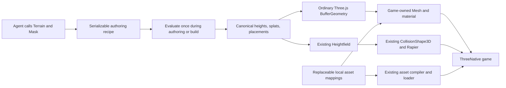

# PRD-466 — Agent-authored Strata terrain through the Three.js contract

**Status:** NOT STARTED
**Complexity:** 7 (HIGH); risk override: none
**Owner:** ThreeNative maintainers
**Depends on:** None
**Progress:** 0/8 required boxes verified

## Context

An agent should author useful terrain through code, without Blender or editor
clicks, and use the result through ordinary Three.js objects inside ThreeNative.
Strata already provides the heavy operations: noise, erosion, sculpting, pads,
roads, rivers, material masks, and scatter. The requested integration preserves
those operations and adds replaceable starter art, rendering, and physics wiring.

This request authorizes this PRD, not implementation or npm publication. All
implementation evidence is pending. Complexity is 3 for 11+ implementation files
(mostly recovered supplied modules), 2 for the new authoring module, and 2 for an
independently packed/released optional addon. No marketplace API is required.

### Supplied source and existing integration points

The inputs are `/home/joao/Downloads/AGENT_GUIDE.md` (10,460 bytes, SHA-256
`487453218f870c5e829d58aea3fe9323e74ea93e0aecef8d5c329ecf56972d06`) and
`/home/joao/Downloads/strata-terrain.html` (216,039 bytes, SHA-256
`c0230e6891db829a5196d93ff7c9d714a8f2d964cac4722eb8ce4b2f723d794b`).
The HTML embeds named JS modules, including `src/index.js`, `src/core/*`,
`src/three/adapter.js`, and `src/editor/*`. Recover the supplied modules; do not
rewrite the evaluator or copy the minified HTML into the runtime. The guide names
types but the embedded source inventory does not contain `src/index.d.ts`.
Recover original declarations if available; otherwise type the supported public
surface from the implementation rather than inventing signatures.

Capability search and detail identified existing `Heightfield`, `TerrainTiles`,
`CollisionShape3D`, `rapier`, `compileAssets`, and `WorldCells`. Reuse the first
five where needed; do not make Strata output masquerade as a `WorldCells` manifest.
Its runtime archive is a different format.

- `packages/core/src/world.ts:94`: `Heightfield` accepts canonical height arrays;
  `toGeometry()` emits Three.js geometry and `toColliderHeights()` transposes to
  Rapier order. `origin` is the field centre, not the southwest corner.
- `packages/physics/src/CollisionShape3D.ts:140`: existing heightfield collider.
- `examples/abyss-framework/src/scenes/TerrainProbe.ts`: existing game-side
  terrain/physics wiring; reference it without replacing that unrelated probe.
- `packages/create-threenative/templates/*/src/render/`: game-owned visual source.
- `pnpm-workspace.yaml`: Three.js is currently 0.185.1; the supplied HTML imports
  0.180.0 from a CDN. The integration uses the consumer's installed Three.js.

## Solution

### Package and ownership

Ship an optional **`@threenative/terrain`** addon in `packages/terrain/`, integrated
with the engine's normal package, asset, and capability paths. Ordinary games do
not import it or load its starter assets unless they use terrain generation.
There is one authoring implementation and one optional package, not a separate
terrain renderer, scene graph, or second engine.

The root export contains the supplied headless `Terrain`, `Mask`, evaluation,
baking, and export operations. A `/three` subpath converts baked mesh arrays to
an ordinary indexed `THREE.BufferGeometry`; it never creates a renderer, scene,
camera, light, material, or render loop. `three` is a peer dependency. Keep physics
integration in game source using the existing engine API; the generator does not
depend on Rapier or install a second physics world.

The current [charter](../architecture/CHARTER.md) excludes recipe systems and
allows a new framework package only for an isolated dependency. Strata authoring
does not automatically satisfy that rule. This plan explicitly proposes a narrow
allowance for the requested optional terrain authoring addon in phase 1. Recipes
remain authoring documents compiled into ordinary runtime data; they never become
an engine scene format. No general editor, genre preset system, or ownership of
appearance is admitted. The charter change is part of the integration's review,
not an exception a future implementer may silently infer.

### Consumer flow

Agents use stable operation IDs and `applyPatch()` for revisions. The supported
entry points remain `evaluate()`, `bakeMesh()`, `bakeTerrain()`, and `makeExport()`.
Do not introduce a competing `generate()` API or a CLI vocabulary.

The first game is `examples/strata-terrain-preview/`: a seeded 512-metre map at
257 vertices per side with an eroded hill, flat building pad, graded road, and
scattered assets. It has a playable character, not just an orbit screenshot.
The full evaluator runs before play; desktop uses build-baked arrays/assets.
No generation, worker, erosion, or collider rebuild occurs during steady play.
Keep the supplied editor as a preserved source/reference; replacing its UI is
outside this integration. The preview owns one ThreeNative renderer and loop.

### Replaceable starter assets, including Fab

Ship a small initial set: grass/dirt/rock/sand PBR surfaces, a tree, a rock, and a
grass clump. Use Poly Haven or equivalent redistributable sources for the bundled
set. Actual item URLs, authors, licenses, content hashes, metre scale, and any
preprocessing belong in `packages/terrain/starter-assets/credits.json`.
Choose specific items during implementation; no item has been selected or
downloaded by this planning task.

**Fab assets are supported.** Users can load their licensed Fab models/textures
through the same normal asset loader and supply the same mappings. Engine/tool
choice is not the restriction. The distinction is shipping licensed art inside
a game versus redistributing reusable asset source files in an engine package:
[Fab's Standard License summary](https://www.fab.com/eula) permits compatible
tools and incorporated projects but prohibits standalone redistribution.
An asset listed on Fab with a different license or explicit redistribution
permission can be bundled when those terms permit it. No marketplace-wide ban.
[Poly Haven's asset license](https://polyhaven.com/license) is CC0 and explicitly
permits redistribution. Keep provenance even when attribution is not mandatory.
Use local prepared assets at runtime; no credentials, scraping, marketplace
client, or live network dependency is introduced.

The game has editable `src/render/terrain.ts` and `src/world/terrainAssets.ts`:
material construction and texture choices stay in the former; placement asset IDs
map to ordinary loaded `Object3D` models in the latter. The starter sources can be
copied into a game and edited directly. Supplying a custom `THREE.Material` and
custom asset mappings replaces the complete starter look without modifying
package code. Keep Strata's eight material channels as numerical authoring data;
games choose what each channel means visually. Unknown referenced asset IDs fail
with their rule/asset name rather than silently showing placeholder trees.

Starter sources go through `compileAssets` and `ctx.assets`; use existing model
instancing for placements rather than carrying over the supplied viewer's renderer
and generated default models. Cap the cooked starter set at 25 MiB, use at most
2K source textures, and expose ordinary file replacement/removal. Every custom
configuration must avoid loading the replaced starter files. This is a bounded
example art set, not a universal art or asset marketplace system.

### Data correctness and failure handling

World units are metres, Y is up, the map is centred on zero, and input heights are
row-major Z then X. Construct `Heightfield` from the final arrays directly with
`rows = columns = resolution`, `width = depth = size`, and centre `{x: 0, z: 0}`.
Do not resample or erode again during collision creation. The baked collision
archive's corner origin must not be passed as a `Heightfield` centre.

Matching samples alone do not prove matching surfaces. The supplied sampler and
`Heightfield.heightAt()` are bilinear, whereas meshes/collision consist of
triangles. Test asymmetric nonplanar cells at interior points on both sides of
the diagonal, edges, and corners. Grounding/placement in the consumer must follow
the actual rendered/collidable triangles; do not claim bilinear queries are exact
triangle contacts. Prefer correcting consumer wiring through existing mesh or
physics queries; if a shared engine defect is demonstrated, fix it in its owning
layer with regression proof rather than patching every game.

Preserve recipe validation, atomic edits/rollback, bounded operations, diagnostics,
and deterministic seeds at the same resolution. Invalid recipes and nonfinite or
wrong-length arrays fail before replacing valid data. No evaluated array edits
pretend to update the recipe. Different export resolutions require fresh inspection;
cross-resolution equivalence is not promised. Splat textures are linear data and
their sampled weights are normalized by game-owned material source. Asset models
are caller-owned; disposing the generated geometry does not dispose shared art.

## Scope limits

No editor rebuild, marketplace integration, caves, navigation generation, true
water simulation, infinite-world generation, or seamless mixed-LOD claim. Defer
`TerrainTiles` integration until a game needs streaming; first prove one finite
terrain using the installed `Heightfield`. Browser WebGPU and Linux native desktop
are required; Android/iOS support is not claimed by these results. Publishing to
npm is separate from locally packing and verifying installable tarballs.

## Acceptance Criteria

The seven phase boxes are required capability criteria AC-1 through AC-7. Keep
their evidence on those boxes; do not duplicate results here. All eight criteria
are `local`, performed by the implementing agent. A Linux native host executable
was present at planning time; this is availability, not runtime proof.

- [ ] AC-8 [local, actor: implementing agent]: A fresh consumer outside the workspace follows the addon guide to author and revise the representative recipe through public imports without Blender or editor clicks. proof: `pnpm --filter strata-terrain-preview test:consumer` — Evidence: pending; planned script must install packed engine/addon tarballs, verify named operations changed the resulting arrays, and build the game without workspace source imports.

## Integration Ledger

| Capability | Reachable consumer/trigger | Replaces / disposition | Evidence |
| --- | --- | --- | --- |
| Agent terrain authoring | Preview build → public `@threenative/terrain` imports → final baked arrays | Supplied HTML's embedded modules become the maintained source; authoring remains headless | AC-1, AC-8 |
| Three.js interoperability | Consumer → `/three` conversion → game-owned `Mesh` in the existing scene | Do not import `ThreeTerrainView` or its renderer/default scene | AC-2 |
| Playable terrain | Preview scene → existing `Heightfield` and physics context | No separate collision resampling or Strata physics backend | AC-3, AC-4 |
| Starter/custom art | Game render source and asset mapping → compiler → `ctx.assets` | Supplied viewer placeholder assets are replaced; custom mappings bypass starter loads | AC-5, AC-6 |
| Agent discovery | Capability lookup and shipped addon guide → public imports | No HTML inspection or UI-click requirement | AC-7, AC-8 |

Paths for the new package/preview are proposed. Record actual non-test entry-point
locations when each phase is implemented; no future line numbers are asserted.

## Decisions

- 2026-09-30 (João): Terrain generation is integrated into ThreeNative and still
  consumed through the Three.js contract; abstractions do the authoring heavy work.
- 2026-09-30 (João): Starter art is wanted and must be fully replaceable with custom
  assets, including assets from Fab.
- 2026-09-30 (planning choice): One optional addon, game-owned appearance, build-time
  generation, and finite terrain first. Narrow charter/package allowance is
  proposed explicitly; no independent terrain editor product is being built.
- 2026-09-30 (planning choice): Fab is supported; bundled redistribution is assessed
  per asset license using the source terms cited above.

## Execution Phases

## Execution Phases

### Phase 1: Independent authoring library and Three.js output

**Status:** NOT STARTED

**Files:** `packages/terrain/package.json`, `src/index.ts`, recovered `src/core/*`,
`src/three.ts`, public declarations, `AGENT_GUIDE.md`, and
`__tests__/terrain-consumer.spec.ts`; `docs/architecture/CHARTER.md` for the narrow
authoring/package allowance. New paths are proposed; recover rather than redesign.

**Implementation:** Port the supplied public evaluator with its validation and
transactions intact; export one small Three.js geometry adapter. Keep appearance
code, DOM, workers, CDN imports, and the editor out of runtime imports. Add the
addon to the normal build/release configuration without making core depend on it.
Document the generator's source ownership and retain any original license notice;
the supplied HTML alone is not proof of a third-party code license.

- [ ] AC-1 [local, actor: implementing agent]: A public-import Node consumer evaluates the seeded recipe with stable-ID replacement and atomic validation failures. proof: `pnpm exec vitest run packages/terrain/__tests__/terrain-consumer.spec.ts` — Evidence: pending; test public exports, deterministic same-resolution arrays, preserved prior recipe after invalid patches, and execution without DOM globals.
- [ ] AC-2 [local, actor: implementing agent]: Generated terrain is ordinary indexed geometry compatible with the consumer's Three.js identity. proof: `pnpm exec vitest run packages/terrain/__tests__/terrain-consumer.spec.ts` — Evidence: pending; use the consumer's `THREE.BufferGeometry`, `Mesh`, custom material, and raycaster on actual generated output; check positions, winding, finite attributes, and disposal ownership.

### Phase 2: ThreeNative rendering and matching collision

**Status:** NOT STARTED

**Files:** `examples/strata-terrain-preview/package.json`, existing-template-derived
build config, `src/game.ts`, `src/world/terrain.ts`, `src/render/terrain.ts`, and
`playtests/terrain.playtest.json`. Extend relevant existing engine tests only if
the asymmetric fixture demonstrates a shared engine defect.

**Implementation:** Bake the representative recipe before game startup; render its
mesh in the normal game scene and register collision through the owning physics
context. Match coordinates and triangle surfaces. Exercise an asymmetric height
fixture as well as the hill/road, with a grounded moving character. Reuse the
existing asset/build/playtest paths for both targets. Expose measured contact error
and travel distance through the existing playtest bridge; never hardcode success.

- [ ] AC-3 [local, actor: implementing agent]: Browser WebGPU play exercises the generated hill/road with matching rendered and physical ground. proof: `pnpm --filter strata-terrain-preview test:terrain:web` — Evidence: pending; planned script invokes the existing playtest runner with `--browser-recipe webgpu`, names the adapter, verifies at least 50 m of character travel and maximum vertical mesh/physics contact error of 0.02 m across asymmetric cell interiors, with no missing observations or failed asset loads.
- [ ] AC-4 [local, actor: implementing agent]: The same baked terrain scenario runs in the Linux native desktop host. proof: `pnpm --filter strata-terrain-preview test:terrain:desktop` — Evidence: pending; planned script builds/packages through existing native tooling and invokes the runner with `--target desktop --executable ...` and required host args; require the same contact/travel observations, at least 300 frames, a nonblank terrain screenshot, and zero runtime errors. This does not claim an FPS or mobile result.

### Phase 3: Replaceable starter assets and cold-agent workflow

**Status:** NOT STARTED

**Files:** `packages/terrain/starter-assets/`, editable starter source under
`packages/terrain/starter/`, preview `src/world/terrainAssets.ts` and
`src/render/terrain.ts`, `packages/terrain/__tests__/starter-assets.spec.ts`,
`packages/create-threenative/capabilities.json` through its generator, and addon
agent documentation. Update the relevant template guidance and regenerate its
`CLAUDE.md` mirror only when the guidance changes.

**Implementation:** Prepare the bounded starter set and source/license metadata;
copy starter material/mapping source into the preview. Reuse existing cooking,
loading, and instancing. Custom assets, including licensed Fab assets, are supplied
as normal local models/textures; no special import format or vendor account is
needed. The automated replacement test uses attributable custom test art, not
private paid files. Make public terrain authoring discoverable in the installed
capability workflow without claiming optional imports exist before installation.

- [ ] AC-5 [local, actor: implementing agent]: The distributable starter set is loaded from cooked local assets through the preview's asset loader. proof: `pnpm exec vitest run packages/terrain/__tests__/starter-assets.spec.ts` plus AC-3 — Evidence: pending; metadata covers every redistributed file, each included license permits its distribution, cooked bytes stay within 25 MiB, and the game does not fetch CDN or marketplace files.
- [ ] AC-6 [local, actor: implementing agent]: A consumer completely replaces starter materials and placement models without generator edits. proof: `pnpm --filter strata-terrain-preview test:terrain:custom` — Evidence: pending; planned script runs the existing scenario with custom local material/model mappings, verifies the new model/material identities, zero starter asset requests, and unchanged terrain/collision arrays; a missing referenced asset fails by name.
- [ ] AC-7 [local, actor: implementing agent]: Installed capability lookup leads an agent to the actual public terrain authoring API. proof: `pnpm build` plus `pnpm capabilities:check` and packed-consumer capability lookup in `test:consumer` — Evidence: pending; request/individual-mechanic queries resolve installed imports and truthful constraints, including units, seed, resolution, synchronous evaluation, and custom art ownership.

## Verification and delivery

Commands naming the new package, example, tests, and `test:terrain:*` /
`test:consumer` scripts are **implementation targets**, not shipped commands today.
Each wrapper must invoke the existing harness; do not create another runner. Run
`pnpm prd:progress` before execution and after each phase. Tick only verified work.

Behavior work uses genuine red/green against public consumer paths. Final affected
repository gates include `pnpm typecheck`, `pnpm lint`, `pnpm test`, `pnpm build`,
`pnpm budgets`, and the selected existing CI/native gates. Document changes receive
the existing docs checks and necessary mirror regeneration. Keep results on the
owning boxes/PR, not separate verification reports.

One implementation PR targets `develop`, opened as a draft before phase 1 starts.
Use an owning-repository worktree, update its progress label, and archive this PRD
only after all eight boxes have current evidence. Publishing requires its own
explicit authorization; packing tarballs and exercising a local install do not.
