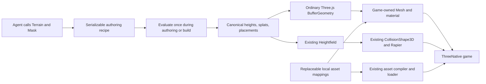

# PRD-466 — Agent-authored Strata terrain through the Three.js contract

**Status:** NOT STARTED
**Complexity:** 7 (HIGH); risk override: none
**Owner:** ThreeNative maintainers
**Depends on:** None
**Progress:** 0/9 required boxes verified
**Required companion:** [PRD-467 — live terrain editor](PRD-467-strata-live-terrain-editor.md)

## Context

An agent should author useful terrain through code, without Blender or editor
clicks, and use the result through ordinary Three.js objects inside ThreeNative.
Strata already provides the heavy operations: noise, erosion, sculpting, pads,
roads, rivers, material masks, and scatter. The requested integration preserves
those operations and adds replaceable starter art, rendering, and physics wiring.

**Visual goal: Unreal look and feel.** The starter world should read as a realistic,
cinematic landscape: physically scaled PBR surfaces, believable tree/rock shapes,
coherent sun/sky/atmosphere, grounded vegetation, and a realistic coastal ocean.
Procedural shapes are the default; baked Poly Haven textures supply surface detail.
All geometry parameters, textures, lighting, water, and post effects remain editable
game source. The goal names the appearance, not an Unreal runtime dependency.

**Primary output: a self-contained GLB easily usable in any game.** The exported
world includes terrain, trees/rocks/grass, final authored transforms, and embedded
portable PBR textures. ThreeNative powers authoring/preview but is not required
to load the GLB. Export portability is a release criterion, not a later adapter.

The user also requires a terrain editor URL that shows agent changes live, with
individual selection, transform gizmos, and GUI polish. That distinct authoring
tool is specified in PRD-467. Both PRDs are required for the complete requested
integration; finishing this runtime/package PRD alone does not finish that goal.

This request authorizes this PRD, not implementation or npm publication. All
implementation evidence is pending. Complexity is 3 for 11+ implementation files
(mostly recovered supplied modules), 2 for the new authoring module, and 2 for an
independently packed/released optional addon. No marketplace API is required.

### Supplied source and existing integration points

The inputs are `/home/joao/Downloads/AGENT_GUIDE.md` (10,460 bytes, SHA-256
`487453218f870c5e829d58aea3fe9323e74ea93e0aecef8d5c329ecf56972d06`) and
`/home/joao/Downloads/strata-terrain.html` (216,039 bytes, SHA-256
`c0230e6891db829a5196d93ff7c9d714a8f2d964cac4722eb8ce4b2f723d794b`).
The HTML embeds named JS modules, including `src/index.js`, `src/core/*`,
`src/three/adapter.js`, and `src/editor/*`. Recover the supplied modules; do not
rewrite the evaluator or copy the minified HTML into the runtime. The guide names
types but the embedded source inventory does not contain `src/index.d.ts`.
Recover original declarations if available; otherwise type the supported public
surface from the implementation rather than inventing signatures.

Capability search and detail identified existing `Heightfield`, `TerrainTiles`,
`CollisionShape3D`, `rapier`, `compileAssets`, and `WorldCells`. Reuse the terrain,
physics, and asset mechanisms; do not make Strata output masquerade as a `WorldCells` manifest.
Its runtime archive is a different format.

- `packages/core/src/world.ts:94`: `Heightfield` accepts canonical height arrays;
  `toGeometry()` emits Three.js geometry and `toColliderHeights()` transposes to
  Rapier order. `origin` is the field centre, not the southwest corner.
- `packages/physics/src/CollisionShape3D.ts:140`: existing heightfield collider.
- `examples/abyss-framework/src/scenes/TerrainProbe.ts`: existing game-side
  terrain/physics wiring; reference it without replacing that unrelated probe.
- `packages/create-threenative/templates/*/src/render/`: game-owned visual source.
- `pnpm-workspace.yaml`: Three.js is currently 0.185.1; the supplied HTML imports
  0.180.0 from a CDN. The integration uses the consumer's installed Three.js.

## Solution

### Package and ownership

Ship an optional **`@threenative/terrain`** addon in `packages/terrain/`, integrated
with the engine's normal package, asset, and capability paths. Ordinary games do
not import it or load its starter assets unless they use terrain generation.
There is one authoring implementation and one optional package, not a separate
terrain renderer, scene graph, or second engine.

The root export contains the supplied headless `Terrain`, `Mask`, evaluation,
baking, and export operations. A `/three` subpath converts baked mesh arrays to
an ordinary indexed `THREE.BufferGeometry`; it never creates a renderer, scene,
camera, light, material, or render loop. `three` is a peer dependency. Keep physics
integration in game source using the existing engine API; the generator does not
depend on Rapier or install a second physics world.

The current [charter](../architecture/CHARTER.md) excludes recipe systems and
allows a new framework package only for an isolated dependency. Strata authoring
does not automatically satisfy that rule. This plan explicitly proposes a narrow
allowance for the requested optional terrain authoring addon in phase 1. Recipes
remain authoring documents compiled into ordinary runtime data; they never become
an engine scene format. The allowance also covers the five requested editable
terrain starter documents and the terrain-only authoring
companion in PRD-467, not a general game editor, genre preset system, or ownership
of appearance. The charter change is part of the integration's review,
not an exception a future implementer may silently infer.

### Consumer flow

Agents use stable operation IDs and `applyPatch()` for revisions. The supported
entry points remain `evaluate()`, `bakeMesh()`, `bakeTerrain()`, and `makeExport()`.
Do not introduce a competing `generate()` API or a CLI vocabulary.

The first game is `examples/strata-terrain-preview/`: a seeded 512-metre map at
257 vertices per side, defaulting to Temperate Forest/Grassland, with an eroded
hill, flat building pad, graded road, procedural trees/rocks/grass, and a river.
A Coastal/Island benchmark supplies the visible realistic ocean. It has a playable character,
not just an orbit screenshot.
The full evaluator runs before play; desktop uses build-baked arrays/assets.
No generation, worker, erosion, or collider rebuild occurs during steady play.
Recover the supplied editor in PRD-467 instead of replacing it with a second
invented editor. The preview owns one ThreeNative renderer and loop. The
terrain generator remains dormant during play; the ocean advances normally.

### Existing capabilities to reuse

These candidates were found with `engine_search_capabilities` and inspected with
`engine_capability_detail`; this is API discovery, not platform execution evidence.

| Area | Installed mechanism/source | Integration and constraints |
| --- | --- | --- |
| Ocean | `SpectralOcean` from `@threenative/core`; `packages/create-threenative/templates/sailing/src/render/ocean.ts` | Reuse GPU cascaded spectra and adapt the existing lit, displaced water source. Supply every wave parameter; largest cascade first. Surface/material/foam remain the game's. CPU samples are stale readbacks, not exact current contacts. |
| Sky and distance | `Atmosphere`, `AtmosphereLuts`, `directionalTransmittance` from `@threenative/core` | Reuse physical atmosphere nodes/LUT lifetime; game supplies coefficients, sky, sun, and haze appearance. Do not add another atmosphere solver or silently assume Earth constants. |
| Procedural props | `createRandom`, `mergeParts`, `InstancedBatch`, `markStatic` from `@threenative/core` | Seed shape variants; merge static parts per material preserving authored UVs/normals; instance shared variants; freeze only genuinely static subtrees. The game supplies every shape and material. `GroundSnap` is only a rendered-model correction, not collider placement. |
| Baked textures/models | `compileAssets`, `texturePass` from `@threenative/assets`; existing cooked-model LOD | Prepare PBR maps offline, then reuse mipmapped KTX2 cooking and `ctx.assets`. Compressed dimensions must be divisible by four. Cooked GLB LOD applies only when eligible and configured; instancing does not imply automatic LOD. |
| Lighting and measurement | Existing game-owned `worldEnvironment.ts`/post source, Three.js GTAO/SSR, `FrameBudget` | Use current template stages where they improve the actual image. AO radii are metres; SSR is screen-space and does not supply offscreen reflections. Record main/shadow/reflection costs and real GPU measurements; absence is not zero. |

The realistic ocean is required. Start from the shipped sailing ocean source,
retain its lit material and displacement-derived normals, then tune wave bands,
shore masking/foam, sun highlights, and horizon coverage for this coastline.
Strata's water output identifies authoring extents/levels; it is not the wave
renderer. The preview's game-owned `src/render/ocean.ts` supplies that mapping.
Shore foam is a visual response to terrain/water depth, not a new fluid simulator.
Validate the chosen spectral path on browser and desktop; unsupported execution
fails visibly. `WaveField` is an explicit analytic alternative only if chosen and
reported; do not silently substitute it and claim the spectral path passed.

`RippleField` and `Buoyancy3D` are available for later interactive splashes/boats,
but neither is needed for this landscape scope. `lightmapPass` requires a static
self-contained GLB with a punctual light, so it is not a blanket terrain-lighting
solution. No blanket enabling of costly post stages to satisfy the visual goal.

`loadTerrainSplat` is another inspected terrain-surface capability: it supplies
world-metre texture tiling, optional triplanar cliffs, macro variation, normals,
and linear splat masks. Its public input requires `terrain.layers.table` and
`terrain.layers.splat` in a world-package document, so it cannot directly consume
Strata's eight-channel array. Reuse the compatible installed surface mechanism
where possible; do not invent a second world format merely to call it. Respect
the documented 16 sampled-texture limit, including mask planes and normal maps;
eight diffuse-plus-normal layers with masks do not fit automatically. The portable
GLB path bakes those blends rather than requiring that shader at load.

### Visual acceptance rubric

Capture the actual seeded coastal scene at fixed seed, time, camera, and 1920×1080:
a close ground/vegetation view, a coast/ocean view, and a landscape overview.
Compare browser and desktop results through the existing playtest capture path.
The implementing agent inspects the rendered captures against this rubric and
records concrete remaining defects on AC-5. A nonblank screenshot alone is not
visual acceptance; subjective Unreal-like quality is not certified by unit tests.

Capture the default Temperate world as well as the Coastal benchmark. Qualify
the remaining starter environments with their defining close/overview views;
do not substitute five labels over the same unchanged material/landform set.

| Area | Required visible result |
| --- | --- |
| Ground | Metre-scaled albedo/normal/roughness detail, coherent grass/dirt/rock/sand transitions, and no stretched cliff UVs or dominant repeated texture grid at the benchmark cameras. |
| Trees and rocks | Varied believable silhouettes, textured bark/leaves/stone, coherent scale and ground contact; simple primitives are construction inputs, not unpolished final cone-tree silhouettes. |
| Coast and ocean | Several visible wave scales, changing normals and sun response, shoreline masking/foam, and a continuous believable horizon without water rectangles cutting across land. |
| Lighting and depth | Consistent sun/sky/exposure, readable contact shadows, atmospheric depth, and restrained post effects without halos, blown glare, or visible shadow instability. |

### Five starter environments, in priority order

| Priority | Editable starter document | Terrain and asset coverage |
| --- | --- | --- |
| 1 | Temperate Forest / Grassland | Hills, grass, dirt, rocks, procedural trees, rivers; default reusable baseline. |
| 2 | Mountain / Alpine | Steep slopes, cliffs, valleys, exposed rock and snow; shared rock/tree assets with alpine distribution rules. |
| 3 | Desert / Canyon | Sand, dunes, mesas, ravines and dry rock formations; sparse vegetation rather than a recoloured forest. |
| 4 | Coastal / Island | Beaches, cliffs, coves, ocean edges and replaceable temperate/tropical vegetation; realistic installed ocean. |
| 5 | Snow / Tundra | Snowfields, frozen lake surfaces, rocky outcrops and sparse vegetation; ice is an editable surface, not a fluid simulation. |

Deliver all five as plain editable example recipes plus material/asset mappings
in `packages/terrain/starter/`, selectable by the companion editor. Prioritize
assets and implementation in this order; share textures, geometry variants and
mechanisms. These are authored starting documents, not a hidden runtime genre
system. Changing a biome, swapping all art, or starting blank remains ordinary
recipe/source editing. Default startup uses the first, never a locked showcase.

### Portable full-world GLB export

The supplied `makeExport(..., 'glb')` exports coloured terrain only. Preserve it as
an explicitly terrain-only export and add a full-world export action/API using
the installed Three.js `GLTFExporter`; do not write another GLB encoder. The
proposed public export name/signature must be documented and typed when landed.
Its input is the committed evaluated world plus the game-supplied asset/material
mapping, not an unrelated scene graph reconstructed from placeholder IDs.

Create an export snapshot with terrain, accepted procedural/imported placements,
their final transforms, and ordinary glTF 2.0 PBR materials. Embed every image and
buffer into one `.glb`; no external URLs, JS/TSL, engine plugin, registry lookup,
or unprocessed asset ID is required at load. Preserve metre scale, Y-up, normals,
UVs, winding, alpha cutoff/double-sided foliage choices, and stable object IDs in
optional node extras. Bake terrain splat/triplanar blends into portable UV-mapped
albedo/normal/roughness/AO textures; vertex colours alone do not satisfy the look.

Default export is compatible without engine-specific glTF extensions. Repeated
props can share mesh data through ordinary nodes; do not require
`EXT_mesh_gpu_instancing`, ThreeNative LOD metadata, or a custom shader to see them.
Offer such optimizations only as explicit profiles after the portable path passes.
Collision and editable recipes are optional sidecars; neither is required to draw
the GLB, and collision is not invented as a standard GLB guarantee.

GLB captures a static world. Bake shader-driven grass deformation and ocean
displacement/normals at an explicit export snapshot time into ordinary geometry
and PBR data. Obtain a coherent resolved ocean snapshot using existing readback
mechanisms; do not label stale running-simulation samples as the requested current
frame. No live FFT/wind/atmosphere/post-processing code is serialized into GLB.
Report any environment-dependent appearance that a receiving game supplies,
and any excluded procedural effect. Unsupported unbaked materials fail by name
rather than exporting a visually empty or terrain-only success.

The GUI and agent call this same export path. A plain Three.js consumer loads the
file using `GLTFLoader` and renders it without ThreeNative or access to the source
project. Test from an isolated directory with all source/CDN requests disabled;
verify all five starter exports, representative prop counts, selected/manual
transforms, embedded images, and no external glTF resource references. The goal
is a portable asset, not identical lighting in every receiving engine.

### Replaceable starter assets, including Fab

Ship editable, seeded procedural tree, rock, and grass builders as starter render
source, producing ordinary Three.js geometry and materials. Recover useful pieces
of Strata's supplied `defaultAssets()` instead of rewriting them, but improve their
silhouettes/UVs/texturing to meet the rubric. Keep builder parameters in game source;
do not bake a fixed artistic style into the addon evaluator. Generate a bounded
variant set once, then reuse it through existing instancing. Imported models remain
optional replacements, not prerequisites for the default world.

Use baked/prepared Poly Haven PBR maps for surface detail. The ThreeNative asset
MCP's `polyhaven_search_assets`, `polyhaven_get_asset`, and `polyhaven_list_files`
were queried on 2026-09-30. The following shortlist returned explicit **CC0**
metadata; it is license/file-metadata qualification, not downloaded/visually graded
art or an implemented starter pack.

| Role | Qualified candidates | Authors / use |
| --- | --- | --- |
| Grass and soil | [Leafy Grass](https://polyhaven.com/a/leafy_grass), [Forest Ground 04](https://polyhaven.com/a/forest_ground_04) | Charlotte Baglioni; Rob Tuytel/Rico Cilliers. Baked ground PBR maps. |
| Stone | [Coast Sand Rocks 02](https://polyhaven.com/a/coast_sand_rocks_02), [Rock Moss Set 02](https://polyhaven.com/a/rock_moss_set_02) | Rob Tuytel; Kless Gyzen. Coastal texture plus optional replacement rock meshes. |
| Beach | [Sand 01](https://polyhaven.com/a/sand_01) | Rob Tuytel. Sand PBR maps. |
| Trees | [Bark Brown 02](https://polyhaven.com/a/bark_brown_02), [Jacaranda Tree](https://polyhaven.com/a/jacaranda_tree) | Rob Tuytel; Rico Cilliers/Rob Tuytel. Bark and individually available leaf/alpha maps for procedural foliage; full tree is an optional custom replacement. |

Additional CC0 candidates returned by the same asset MCP are
[Snow 02](https://polyhaven.com/a/snow_02) and
[Snow 01](https://polyhaven.com/a/snow_01) for Alpine/Tundra, and
[Sandstone Cracks](https://polyhaven.com/a/sandstone_cracks) for dry rock/Desert.
All list Rob Tuytel as author. Qualify prepared snow/ice and dry-rock materials
for the relevant starters before claiming all five environments are ready.

File inspection found direct 1K texture downloads, including OpenGL normal maps,
and glTF dependencies. Rock Moss Set 02's 1K glTF plus all listed dependencies totals
1,942,240 bytes. Jacaranda's geometry binary alone is 208,307,808 bytes despite the
1K texture selection: use individual leaf/alpha atlas files for procedural trees,
not that raw mesh as a starter dependency. Measure cooked geometry and bounds before
accepting any optional replacement; catalog dimensions have no confirmed metre
unit here. Do not guess scale or treat a small texture resolution as a small model.

Actual selected file URLs, authors, licenses, content hashes, metre scale, and
preprocessing belong in `packages/terrain/starter-assets/credits.json` during
implementation. Nothing was downloaded or imported by this planning task.

**Fab assets are supported.** Users can load their licensed Fab models/textures
through the same normal asset loader and supply the same mappings. Engine/tool
choice is not the restriction. The distinction is shipping licensed art inside
a game versus redistributing reusable asset source files in an engine package:
[Fab's Standard License summary](https://www.fab.com/eula) permits compatible
tools and incorporated projects but prohibits standalone redistribution.
An asset listed on Fab with a different license or explicit redistribution
permission can be bundled when those terms permit it. No marketplace-wide ban.
[Poly Haven's asset license](https://polyhaven.com/license) is CC0 and explicitly
permits redistribution. Keep provenance even when attribution is not mandatory.
Use local prepared assets at runtime; no credentials, scraping, marketplace
client, or live network dependency is introduced.

The game has editable `src/render/terrain.ts` and `src/world/terrainAssets.ts`:
material construction and texture choices stay in the former; placement asset IDs
map to ordinary loaded `Object3D` models in the latter. The starter sources can be
copied into a game and edited directly. Supplying a custom `THREE.Material` and
custom asset mappings replaces the complete starter look without modifying
package code. Keep Strata's eight material channels as numerical authoring data;
games choose what each channel means visually. Unknown referenced asset IDs fail
with their rule/asset name rather than silently showing placeholder trees.

Prepared textures/imported replacements go through `compileAssets` and `ctx.assets`;
procedural geometry uses the same game-owned materials and `InstancedBatch`.
Never carry over the supplied viewer's renderer. Cap the cooked starter set at 25 MiB, use at most
2K source textures, and expose ordinary file replacement/removal. Every custom
configuration must avoid loading the replaced starter files. This is a bounded
example art set, not a universal art or asset marketplace system.
The 25 MiB cooked budget applies to each selected starter's required content;
do not eagerly load all five environments' textures at startup. Full GLB size is
measured separately, including geometry and baked material atlases.
Choose maps/channels deliberately: albedo is colour data; normals, roughness, AO,
height, and splat weights are linear data. Retain a reproducible packing/baking
step when combining channels or preparing leaf alpha; do not flatten all detail
into diffuse colour or bake one fixed sun into every material.

### Data correctness and failure handling

World units are metres, Y is up, the map is centred on zero, and input heights are
row-major Z then X. Construct `Heightfield` from the final arrays directly with
`rows = columns = resolution`, `width = depth = size`, and centre `{x: 0, z: 0}`.
Do not resample or erode again during collision creation. The baked collision
archive's corner origin must not be passed as a `Heightfield` centre.

Matching samples alone do not prove matching surfaces. The supplied sampler and
`Heightfield.heightAt()` are bilinear, whereas meshes/collision consist of
triangles. Test asymmetric nonplanar cells at interior points on both sides of
the diagonal, edges, and corners. Grounding/placement in the consumer must follow
the actual rendered/collidable triangles; do not claim bilinear queries are exact
triangle contacts. Prefer correcting consumer wiring through existing mesh or
physics queries; if a shared engine defect is demonstrated, fix it in its owning
layer with regression proof rather than patching every game.

Preserve recipe validation, atomic edits/rollback, bounded operations, diagnostics,
and deterministic seeds at the same resolution. Invalid recipes and nonfinite or
wrong-length arrays fail before replacing valid data. No evaluated array edits
pretend to update the recipe. Different export resolutions require fresh inspection;
cross-resolution equivalence is not promised. Splat textures are linear data and
their sampled weights are normalized by game-owned material source. Asset models
are caller-owned; disposing the generated geometry does not dispose shared art.

## Scope limits

The live editor and GUI extension belong to required PRD-467. No marketplace
integration, caves, navigation generation, volumetric fluid simulation,
infinite-world generation, or seamless mixed-LOD claim. The existing spectral
ocean surface is in scope. Defer
`TerrainTiles` integration until a game needs streaming; first prove one finite
terrain using the installed `Heightfield`. Browser WebGPU and Linux native desktop
are required; Android/iOS support is not claimed by these results. Publishing to
npm is separate from locally packing and verifying installable tarballs.

## Acceptance Criteria

The eight phase boxes are required capability criteria AC-1 through AC-7 and AC-9.
AC-8 below proves the portable GLB consumer. Keep evidence on those boxes; do not duplicate
results here. The ninth box adds the explicitly requested ocean behavior rather
than hiding it in a terrain-contact claim. All nine criteria
are `local`, performed by the implementing agent. A Linux native host executable
was present at planning time; this is availability, not runtime proof.

- [ ] AC-8 [local, actor: implementing agent]: Each of the five starter worlds exports as a complete self-contained GLB usable by an ordinary game. proof: planned `pnpm --filter strata-terrain-preview test:consumer` — Evidence: pending; author through packed public imports, export all five, then load/render in isolated vanilla Three.js with `GLTFLoader`, verify terrain/prop content, final transforms, portable embedded PBR maps and zero external-resource/engine dependencies; record export bytes and time. The supplied terrain-only GLB cannot satisfy this criterion.

## Integration Ledger

| Capability | Reachable consumer/trigger | Replaces / disposition | Evidence |
| --- | --- | --- | --- |
| Agent terrain authoring | Preview build → public `@threenative/terrain` imports → final baked arrays | Supplied HTML's embedded modules become the maintained source; authoring remains headless | AC-1, AC-8 |
| Three.js interoperability | Consumer → `/three` conversion → game-owned `Mesh` in the existing scene | Do not import `ThreeTerrainView` or its renderer/default scene | AC-2 |
| Playable terrain | Preview scene → existing `Heightfield` and physics context | No separate collision resampling or Strata physics backend | AC-3, AC-4 |
| Starter/custom art | Game render source and asset mapping → compiler → `ctx.assets` | Supplied viewer placeholder assets are replaced; custom mappings bypass starter loads | AC-5, AC-6 |
| Realistic ocean | Game-owned ocean source → installed `SpectralOcean` → lit water mesh | Strata water metadata supplies level/extents; it does not become a wave renderer | AC-9, AC-5 |
| Agent discovery | Capability lookup and shipped addon guide → public imports | No HTML inspection or UI-click requirement | AC-7, AC-8 |
| Portable world export | Committed document → evaluated scene/material bake → GLTFExporter → vanilla GLTFLoader | Supplied terrain-only GLB remains explicitly labelled; new world action includes assets | AC-8; PRD-467 AC-8 |

Paths for the new package/preview are proposed. Record actual non-test entry-point
locations when each phase is implemented; no future line numbers are asserted.

## Decisions

- 2026-09-30 (João): Terrain generation is integrated into ThreeNative and still
  consumed through the Three.js contract; abstractions do the authoring heavy work.
- 2026-09-30 (João): Starter art is wanted and must be fully replaceable with custom
  assets, including assets from Fab.
- 2026-09-30 (planning choice): One optional addon, game-owned appearance, build-time
  generation, and finite terrain first. Narrow charter/package allowance is
  proposed explicitly; no independent terrain editor product is being built.
- 2026-09-30 (planning choice): Fab is supported; bundled redistribution is assessed
  per asset license using the source terms cited above.
- 2026-09-30 (João): Default starter geometry is procedural trees/rocks/etc with
  baked Poly Haven textures; reuse realistic installed ocean mechanisms and aim
  for Unreal look and feel while retaining complete customizability.
- 2026-09-30 (João): A live terrain editor URL and individual object gizmos/GUI
  polish are required. PRD-467 replaces the previous editor-rebuild exclusion.
- 2026-09-30 (João): Deliver the five environment starters in the stated priority
  order, with Temperate Forest/Grassland first; final output is a portable GLB.
- 2026-09-30 (planning choice): Vegetation search surfaced reusable `mergeParts`,
  `InstancedBatch`, `createRandom`, and static/culling mechanisms, not a dedicated
  installed grass/tree generator. Recover the supplied procedural builders and
  keep appearance source editable. Do not misuse `SoftBody3D` cloth simulation
  as a solver per grass blade. Preserve candidate identity for editor overrides.

## Execution Phases

### Phase 1: Independent authoring library and Three.js output

**Status:** NOT STARTED

**Files:** `packages/terrain/package.json`, `src/index.ts`, recovered `src/core/*`,
`src/three.ts`, public declarations, `AGENT_GUIDE.md`, and
`__tests__/terrain-consumer.spec.ts`; `docs/architecture/CHARTER.md` for the narrow
authoring/package allowance. New paths are proposed; recover rather than redesign.

**Implementation:** Port the supplied public evaluator with its validation and
transactions intact; export one small Three.js geometry adapter. Keep appearance
code, DOM, workers, CDN imports, and the editor out of runtime imports. Add the
addon to the normal build/release configuration without making core depend on it.
Document the generator's source ownership and retain any original license notice;
the supplied HTML alone is not proof of a third-party code license.

- [ ] AC-1 [local, actor: implementing agent]: A public-import Node consumer evaluates the seeded recipe with stable-ID replacement and atomic validation failures. proof: `pnpm exec vitest run packages/terrain/__tests__/terrain-consumer.spec.ts` — Evidence: pending; test public exports, deterministic same-resolution arrays, preserved prior recipe after invalid patches, and execution without DOM globals.
- [ ] AC-2 [local, actor: implementing agent]: Generated terrain is ordinary indexed geometry compatible with the consumer's Three.js identity. proof: `pnpm exec vitest run packages/terrain/__tests__/terrain-consumer.spec.ts` — Evidence: pending; use the consumer's `THREE.BufferGeometry`, `Mesh`, custom material, and raycaster on actual generated output; check positions, winding, finite attributes, and disposal ownership.

### Phase 2: ThreeNative rendering and matching collision

**Status:** NOT STARTED

**Files:** `examples/strata-terrain-preview/package.json`, existing-template-derived
build config, `src/game.ts`, `src/world/terrain.ts`, `src/render/terrain.ts`,
`src/render/ocean.ts`, and
`playtests/terrain.playtest.json`. Extend relevant existing engine tests only if
the asymmetric fixture demonstrates a shared engine defect.

**Implementation:** Bake the representative recipe before game startup; render its
mesh in the normal game scene and register collision through the owning physics
context. Match coordinates and triangle surfaces. Exercise an asymmetric height
fixture as well as the hill/road, with a grounded moving character. Reuse the
existing asset/build/playtest paths for both targets. Expose measured contact error
and travel distance through the existing playtest bridge; never hardcode success.
Adapt the existing sailing ocean source; use game-owned atmosphere/lighting and
material source. Ocean compute advances every frame without reevaluating terrain.

- [ ] AC-3 [local, actor: implementing agent]: Browser WebGPU play exercises the generated hill/road with matching rendered and physical ground. proof: `pnpm --filter strata-terrain-preview test:terrain:web` — Evidence: pending; planned script invokes the existing playtest runner with `--browser-recipe webgpu`, names the adapter, verifies at least 50 m of character travel and maximum vertical mesh/physics contact error of 0.02 m across asymmetric cell interiors, with no missing observations or failed asset loads.
- [ ] AC-4 [local, actor: implementing agent]: The same baked terrain scenario runs in the Linux native desktop host. proof: `pnpm --filter strata-terrain-preview test:terrain:desktop` — Evidence: pending; planned script builds/packages through existing native tooling and invokes the runner with `--target desktop --executable ...` and required host args; require the same contact/travel observations, at least 300 frames, a nonblank terrain screenshot, and zero runtime errors. This does not claim an FPS or mobile result.
- [ ] AC-9 [local, actor: implementing agent]: The coastal ocean mesh visibly consumes the installed spectral simulation in the game scene. proof: AC-3 and AC-4 scenario runs — Evidence: pending; observe changing wave displacement and normals across recorded times, lit material response, and coast masking on browser and desktop, with no silent substitute or missing compute observations.

### Phase 3: Replaceable starter assets and cold-agent workflow

**Status:** NOT STARTED

**Files:** `packages/terrain/starter-assets/`, editable starter source under
`packages/terrain/starter/`, preview `src/world/terrainAssets.ts` and
`src/render/terrain.ts`, `packages/terrain/__tests__/starter-assets.spec.ts`,
`packages/create-threenative/capabilities.json` through its generator, and addon
agent documentation. Update the relevant template guidance and regenerate its
`CLAUDE.md` mirror only when the guidance changes.

**Implementation:** Prepare the bounded texture set and source/license metadata;
copy editable procedural builders, material, ocean, lighting, and mapping source
into the preview. Reuse seeded randomness, geometry merging, cooking, loading,
and instancing. Extend `test:terrain:web` / `test:terrain:desktop` with the fixed
visual benchmark cameras and inspect their actual captures against the rubric.
Use `FrameBudget` to record main/shadow/reflection cost at the representative prop
count; choose existing AO/SSR stages by measured benefit, not a blanket preset.
Add all five editable starter documents/mappings and the portable full-world
GLTFExporter path, including material/deformation baking and ordinary node
instances. Keep full-world export semantics distinct from the supplied legacy
terrain-only GLB. Extend the packed/vanilla consumer for all five files.
Custom assets, including licensed Fab assets, are supplied
as normal local models/textures; no special import format or vendor account is
needed. The automated replacement test uses attributable custom test art, not
private paid files. Make public terrain authoring discoverable in the installed
capability workflow without claiming optional imports exist before installation.

- [ ] AC-5 [local, actor: implementing agent]: The five editable starter environments satisfy their defining terrain/art coverage and Unreal-like visual rubric. proof: planned `pnpm exec vitest run packages/terrain/__tests__/starter-assets.spec.ts` plus AC-3/AC-4 benchmark captures — Evidence: pending; inspect actual defining views of all five with Temperate first, including coast/ocean; qualify licenses/provenance and each selected starter's 25 MiB cooked budget, with no CDN/marketplace runtime fetches. Asset tests or nonblank captures alone cannot tick this visual criterion.
- [ ] AC-6 [local, actor: implementing agent]: A consumer completely replaces starter materials and placement models without generator edits. proof: `pnpm --filter strata-terrain-preview test:terrain:custom` — Evidence: pending; planned script runs the existing scenario with custom local material/model mappings, verifies the new model/material identities, zero starter asset requests, and unchanged terrain/collision arrays; a missing referenced asset fails by name.
- [ ] AC-7 [local, actor: implementing agent]: Installed capability lookup leads an agent to the actual public terrain authoring API. proof: `pnpm build` plus `pnpm capabilities:check` and packed-consumer capability lookup in `test:consumer` — Evidence: pending; request/individual-mechanic queries resolve installed imports and truthful constraints, including units, seed, resolution, synchronous evaluation, and custom art ownership.

## Verification and delivery

Commands naming the new package, example, tests, and `test:terrain:*` /
`test:consumer` scripts are **implementation targets**, not shipped commands today.
Each wrapper must invoke the existing harness; do not create another runner. Run
`pnpm prd:progress` before execution and after each phase. Tick only verified work.

Behavior work uses genuine red/green against public consumer paths. Final affected
repository gates include `pnpm typecheck`, `pnpm lint`, `pnpm test`, `pnpm build`,
`pnpm budgets`, and the selected existing CI/native gates. Document changes receive
the existing docs checks and necessary mirror regeneration. Keep results on the
owning boxes/PR, not separate verification reports.

One implementation PR targets `develop`, opened as a draft before phase 1 starts.
Use an owning-repository worktree, update its progress label, and archive this PRD
only after all nine boxes have current evidence. Overall requested integration
also requires PRD-467; do not describe a runtime-only delivery as editor completion.
Publishing requires its own
explicit authorization; packing tarballs and exercising a local install do not.
