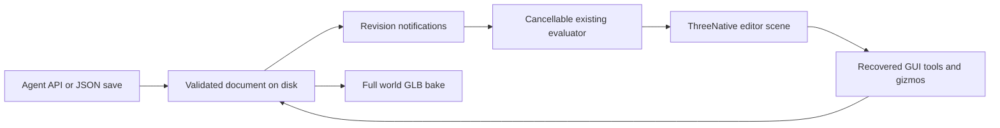

# PRD-467 — Live terrain editor, shape editing, and spatial surface diagnostics

**Status:** NOT STARTED
**Complexity:** 9 (HIGH); risk override: none
**Owner:** ThreeNative maintainers
**Depends on:** PRD-466 phases 1–2 public authoring/rendering contract
**Progress:** 0/9 required boxes verified
**Required companion:** [PRD-468 — atmosphere, cameras, and asset imports](PRD-468-strata-world-controls-and-asset-imports.md)

## Context

João wants to open the terrain editor URL, watch the agent build the world live,
click individual shapes, move/rotate/scale them, and use the existing GUI tools
to polish the result. Agent-first generation and full customization remain the
primary goal. The final output is a self-contained GLB usable in other games.

Embedded spatial debugging must also help an agent/human reconstruct a location
from maps/screenshots: inspect the actual terrain surface, register reference
imagery and landmarks, and receive measurable mismatch feedback. These tools are
part of the editor and headless inspection path, not a separate verification app.

This is a required companion to [PRD-466](PRD-466-strata-terrain-threejs-integration.md),
not an optional later feature. Both plans must be verified before claiming the
whole requested integration is delivered, including PRD-468's world controls and
on-demand imports. This request authorizes planning only.
Complexity: 3 for 11+ implementation files (mostly recovered editor modules),
2 for the authoring tool, 2 for worker/revision concurrency, and 2 for the
addon/consumer build boundary.

### The starting editor already exists

Use `/home/joao/Downloads/strata-terrain.html` and
`/home/joao/Downloads/AGENT_GUIDE.md`; PRD-466 records their input hashes.
Recover the named embedded sources, rather than inventing another editor.
The supplied editor already has brushes, layer selection/reordering, an inspector,
undo/redo, import/export, cancellable evaluation in a worker, and local restore.
Preserve these working features and the documented authoring operations/limits.

Observed gaps: `src/three/adapter.js` picks only terrain triangles; it does not
select individual props or expose transform gizmos. `src/editor/app.js` uses
localStorage, which a filesystem agent cannot share. Worker progress is not an
intermediate rendered snapshot. Scatter IDs are `${rule.id}:${acceptedIndex}`,
which can identify a different tree after masks change acceptance order.

Capability search/detail found `ScenePicker`, `InstancedBatch`, `mergeParts`, and
`markStatic`. `packages/core/src/picking.ts` returns normal Three.js intersections
and supports instanced meshes through Three.js's existing raycast path. Installed
`three/addons/controls/TransformControls.js` supplies the gizmo; it attaches to an
`Object3D`, so one instanced prop needs a selection proxy, not a new gizmo system.

## Solution

### One document shared by the agent and GUI

Serve the recovered editor at **`/terrain-editor/`** through the existing preview
Vite dev server and print the complete URL at startup. Starting or reusing the
terrain editor also returns a structured `editorUrl`, project/session identity,
and current revision; the controller presents that URL as a clickable live-editor
link to the user. Wait until the route is ready and use the actually bound port,
never a guessed port or `0.0.0.0` as a viewer address. Reuse an existing configured
port-forward/viewer URL when running remotely; report missing forwarding or startup
failure explicitly instead of offering an unreachable link. This does not request
public deployment. Repeated activation opens the same project and latest document.
The agent authors through
the API/JSON operations; driving the editor UI is never required.
`examples/strata-terrain-preview/terrain/` owns the saved authoring document:
Strata recipe, procedural shape parameters, and explicit placement overrides.
It is terrain authoring data, not a new engine scene format or executable JS.
Reference registrations, control/check points, north/origin metadata, and named
inspection probes are saved with that document; they are authoring annotations.
PRD-468 extends the same document with named cameras, environment settings, and
project-local asset references; it does not introduce another document authority.

Minimal Node/Vite middleware watches complete file saves and broadcasts revision
notifications via SSE. Agents can atomically save JSON or submit documented
`applyPatch()` command shapes through a local endpoint. The GUI commits the same
validated semantic transactions. Use existing Vite HMR for changes to editable
render source. No database, hosted service, second localStorage authority, or
new websocket library. Existing browser-only saves can be explicitly imported.

One content-hashed revision is one synchronous semantic transaction. Serialize
writes to the document and reject stale base revisions with an explicit conflict;
never overwrite newer human/agent work. Save atomically and retain the previous
valid document/scene on validation or disk failure. Invalid external saves show
diagnostics; do not accept or silently erase them.

Bind writes to loopback and the configured project document. Validate host/origin,
bounded JSON bodies, patches, and transforms. No client-selected paths, filesystem
browser, arbitrary-code execution, or public unauthenticated write service.

### Watch construction without refreshing

Opening the URL loads the latest document without resetting to a demo. Each
committed hill, pad, road, or population edit produces a visible new revision.
Retain the last valid geometry while building, show requested/rendered revisions
and progress, discard stale worker results, and preserve selection by stable ID.
Coalesce pending previews; terminate the worker for real cancellation of a long
synchronous erosion pass. The supplied operation-progress callback alone does
not prove the world is changing on screen.

For a 512-metre, 129-vertex grid with 100 props, simple non-erosion commits appear
within 2 seconds after server acceptance on the measured machine. Verify three
successive agent edits while the page remains open. Longer erosion must show
progress/cancellation and leave the GUI responsive; maximum-resolution evaluation
is not promised to be real-time. Mark preview/export resolution explicitly and
reevaluate exports from committed data at the chosen resolution.

Use PRD-466's editable realistic terrain/ocean/lighting source in the editor, not
a separate reduced renderer. The five starter documents appear in the user-requested
order: Temperate Forest/Grassland, Mountain/Alpine, Desert/Canyon, Coastal/Island,
Snow/Tundra. They are editable examples, not locked artistic presets.
Atmosphere/lighting and camera changes from PRD-468 update the running scene
without dispatching terrain evaluation or resetting the current view.

### Select and gizmo one object

Click a tree/rock/grass instance to select that placement, with visible selection
and inspector state; do not select its whole batch. Map picker `instanceId` to a
durable authoring key. The object list also selects overlapping/occluded objects.
Use one TransformControls proxy for full translate/rotate/nonuniform scale; update
that instance immediately during drag and suspend camera orbit while dragging.
Commit one transaction on drag end; Escape cancels and undo reverts the whole drag.
Numeric position/rotation/scale inputs provide precise, keyboard-accessible edits.

Fix scatter identity using deterministic candidate keys, independent of rejection
and acceptance order; random draws for one candidate must not depend on earlier
candidates being accepted. Never persist a mesh-array index as identity.
Manual overrides contain the stable key, position, quaternion, positive scale, and
named grounding choice. Rebuild, reload, API edits, runtime bake, and GLB export
all consume them. Removed candidates retain unmatched overrides and a visible
diagnostic with explicit remove/reassign actions; never silently retarget edits.

Grounding defaults on: moving X/Z regrounds using the actual model bounds. Lifting
records an explicit grounding override and retains measured clearance. Validate
finite coordinates/rotations and positive scales. UI angle conversion is explicit:
terrain operation rotations use degrees; supplied scatter yaw uses radians.

Terrain landforms select the stable recipe layer with a footprint/handle, not a
fictional independent mesh buried in an eroded heightfield. Translate/rotate/scale
supported stamp/heightmap/paste parameters through the recipe. Support vertical
offset/scale with the smallest explicit operation contract where needed. Disable
axes that a heightfield cannot represent, such as overhanging landform rotations,
with a reason; free-standing props retain ordinary full 3D transforms.

### Preserve GUI polish and portable export

| Tool group | Required recovered behavior |
| --- | --- |
| Landforms | Sculpt, smooth, flatten, ramp, stamps, erosion, and supplied heightmap/copy/paste. |
| Surface/population | Material/biome paint, scatter/clear, individual selection, and editable shape parameters. |
| Paths/water | Road/river controls, carving and water placement, using PRD-466's realistic ocean rendering. |
| Document | Layer enable/reorder/inspect, undo/redo, import, existing data exports, and the new full-world GLB action. |
| Spatial inspection | Reference overlay, scale/north grid, terrain probes, contours/heatmaps, profiles, and landmark mismatch feedback through the same saved document. |

The new default world export contains terrain, generated/placed props, manual
transforms, and portable baked PBR textures. It must not call the supplied
terrain-only `makeExport(..., 'glb')` and present that as a complete world.
Shader-driven effects are frozen/baked as specified in PRD-466; live water/wind
simulation does not travel inside standard GLB. Keep the editable source document
separately. Export errors preserve it and the previous valid export.

### Embedded geospatial awareness and reconstruction feedback

Reuse supplied `src/editor/topographic.js` height/slope/material modes and contour
projection, `Terrain.inspect()`, `sampleHeight`, `gradientAt`, and `slopeAtIndex`.
Existing `Heightfield` queries and `ScenePicker` provide the canonical/rendered
surface observations. These are discovered mechanisms, not a shipped full GIS
or automatic map-to-terrain reconstruction system. Extend them in the terrain
tooling; do not build another scene picker, heightfield, or GIS platform.

| Embedded tool | Feedback useful to both the agent and GUI |
| --- | --- |
| Coordinates and reference | Local metre grid, north arrow, origin and extent; top-down map overlay with opacity and saved scale/rotation/translation; labelled control/check points. |
| Surface probe | X/Z, elevation and datum status, triangle normal/slope/aspect, material/splat weights, biome, and water membership/level where known; distinguish ground from a prop hit. |
| Surface views | Contours, elevation/slope/material/biome heatmaps with legends, units and range; grid spacing/preview resolution and stale-revision indicator. |
| Cross-section and region | Draw a transect to inspect distance/elevation/grade; bound a region to inspect min/max/mean elevation and slope, using the actual evaluated surface. |
| Reconstruction mismatch | Compare named reference landmarks/profiles with the measured world; return horizontal/elevation residuals, maximum/RMS error where defined, tolerances and missing/uncalibrated observations. |

**Coordinate contract.** World geometry remains local metres with Y up. Record
which local X/Z direction is north (default -Z, explicitly overridable). Preserve
an optional projected CRS identifier, geospatial origin, source units, and vertical
datum as metadata; do not put million-metre eastings directly into float32 meshes.
Unknown datum/scale is unknown, not zero. Do not mix latitude/longitude degrees
with metres or silently guess a projection. Full CRS reprojection, map services,
and global geodesy are outside this first local reconstruction tool.

**Calibrate reference imagery.** Import a bounded local image and persist its
content hash/source metadata. A top-down map can use the smallest 2D similarity
registration: two distinct known control pairs determine scale/rotation/translation;
a third independent checkpoint is needed before claiming measured alignment.
Known map scale/extent/north can supply those constraints directly, but report
which values are supplied versus inferred. Do not silently mirror the image.
Residuals at fitted controls alone do not prove accurate reconstruction.

Perspective screenshots remain annotated view references unless explicit camera
calibration/ground-plane information makes a metric mapping valid. An arbitrary
screenshot or decorative map has no trustworthy elevation/scale by itself.
Allow unknown/inferred landmarks so the agent can iterate, but do not present
their inferred measurements as geospatial truth. No automatic reconstruction,
world-location lookup, or elevation invention from pixels is promised.

**Measure the surface being used.** A probe identifies document hash/revision,
evaluation resolution, coordinate frame, units and sample source. At a mesh hit,
report the actual triangle elevation/normal; when also reporting a bilinear
heightfield estimate, label it separately and expose the difference. Both supplied
samplers are bilinear, which can differ inside a nonplanar cell. Aspect is undefined
on flat ground, and a query outside the terrain fails explicitly rather than
clamping to an edge and pretending a measurement exists. Water readbacks retain
their measured time/staleness. Never query newly requested data and label it as
the older visible scene, or vice versa.

Contours/profiles derive useful default intervals and sample spacing from map
extent, grid spacing and elevation range, with visible manual overrides. Bound
query region sizes/profile sample counts. Define each statistic's sampling method
and distinguish horizontal distance from surface distance; do not promise exact
continuous-area statistics from a finite grid.

**Agent feedback without UI clicks.** Expose the same read-only point, transect,
region, and landmark-comparison queries through a documented authoring inspection
API/local endpoint returning structured JSON. Reuse the headless evaluated arrays
for queries; a browser is needed only for rendered observations. Return numerical
values, tolerances, residuals, provenance/unknown flags, diagnostics, and revision
identity rather than only screenshots or a generic PASS. A saved query can be
rerun after each semantic patch so the agent can tell whether a ridge, road grade,
pad elevation, coastline, or landmark fit improved. Invalid/missing observations
cannot count as zero error. This is feedback for authoring, not a new automatic
terrain optimizer or evidence-report subsystem.

References, grids, gizmos, heatmaps and debug probes are editor-only and excluded
from world GLB geometry/textures. Keep optional local-origin/north/georeference
metadata in namespaced root extras or an authoring sidecar without making a GIS
plugin necessary for GLTFLoader. Exporting retains metre-scale local geometry and
the same edited placement transforms; reference images are not embedded by default.

### World controls and asset injection

[PRD-468](PRD-468-strata-world-controls-and-asset-imports.md) owns the controller's
camera CRUD/focus operations, editable atmosphere/sky/sun/fog/ocean settings, and
GLB/PBR-image/HDR-environment import through both agent and GUI paths. These are
required parts of this terrain editor. Reuse this PRD's validated revisions,
selection IDs, history and live scene; do not create another renderer, upload
service, scene format or editor. Asset MCP outputs register as project-local
assets and become available for placement, scatter and material/environment use.

## Scope and ownership

Browser/dev-server/editor entries under `packages/terrain/editor/` are optional
tooling excluded from runtime/headless imports. No generic game editor, Studio
integration, realtime multiplayer authoring, cloud persistence, remote map service,
automatic photogrammetry, or full GIS/reprojection stack. PRD-466 carries
the explicit narrow charter allowance for this terrain-only tool. No appearance
defaults move into core; the editor consumes ordinary Three.js objects and the
same game-owned render source as the runtime.

## Acceptance Criteria

AC-1 through AC-7 and AC-9 are phase boxes. AC-8 below proves the saved consumer
handoff. The ninth box covers the newly requested embedded spatial feedback path
without hiding it in the existing GUI tool claim.
All are `local`, actor: implementing agent. New scripts/tests are implementation
targets, not commands that currently exist.

- [ ] AC-8 [local, actor: implementing agent]: A GUI-polished world survives reload and exports as the same portable GLB content. proof: planned `pnpm --filter strata-terrain-preview test:consumer` with the editor-authored fixture — Evidence: pending; compare terrain samples and stable placement transforms after refresh, JSON round trip, and vanilla GLTFLoader import without editor globals/localStorage.

## Integration Ledger

| Capability | Real consumer path | Replaces / disposition | Evidence |
| --- | --- | --- | --- |
| Live authoring | Agent/API/file save → revision → editor worker → scene | localStorage-only authority and final-only preview | AC-1, AC-2 |
| Individual polish | Picker hit → stable key → gizmo proxy → saved override | terrain-only picking and transient instance-index edits | AC-3, AC-4 |
| Existing GUI | Recovered controls → shared semantic transactions | a separate GUI recipe copy | AC-5, AC-6 |
| Portable handoff | Saved document → PRD-466 full-world exporter → ordinary game | visual-only edits and terrain-only world exports | AC-7, AC-8 |
| Spatial feedback | Registered reference/query → evaluated or rendered surface → structured inspector and visible overlay/profile | global min/max only and uncalibrated visual guesses | AC-9 |
| World controls/import | Shared document → PRD-468 camera/environment/asset operations → same live scene | manual camera-only access and a closed starter asset list | PRD-468 AC-1 through AC-7 |

New locations are proposed. Record actual non-test entry points when implemented;
do not invent future line numbers.

## Decisions

- 2026-09-30 (João): Live editor URL, individual gizmos, existing GUI tools, and
  saved customization are required; agent-first generation remains primary.
- 2026-09-30 (João): Prioritize the five named environments and output a GLB
  easily usable in any game.
- 2026-09-30 (planning choice): Preserve and extend the supplied editor; keep this
  independently testable tool in a linked PRD with three phases/about eight boxes.
  Both PRDs remain required for the full outcome; no requirement is deferred away.
- 2026-09-30 (João): Embed geospatial awareness/debug tools so map/screenshot-based
  reconstruction gets actual terrain-surface feedback. Calibration uncertainty
  and numerical residuals must be visible to both the agent and user.
- 2026-09-30 (João): Activating the terrain editor must offer a usable live-view link.
- 2026-09-30 (João): Controller camera CRUD/focus, on-demand GLB/image imports, and
  editable atmosphere/environment are required. Split their separable consumer
  paths into required PRD-468 to keep this editor checklist bounded; no deferral.

## Execution Phases

### Phase 1: Shared document and live editor URL

**Status:** NOT STARTED
**Files:** recovered `packages/terrain/editor/app.*`/worker, `editor/server.ts`,
preview Vite config/editor entry/document, `__tests__/editor-document.spec.ts`.
**Implementation:** Recover UI/worker; attach to the shared document and preview.
Reuse middleware, file watching, SSE, atomic validation and revision ownership.

- [ ] AC-1 [local, actor: implementing agent]: The activation-returned live link opens the current project and renders successive agent revisions without refresh. proof: planned `pnpm --filter strata-terrain-preview test:terrain:editor` — Evidence: pending; follow the returned `editorUrl` rather than constructing a test URL, verify bound-port/readiness and same-project reuse, observe three distinct geometry revisions, and measure simple-edit latency within 2 seconds on the named fixture. Startup/forwarding failures must not advertise a ready unreachable URL.
- [ ] AC-2 [local, actor: implementing agent]: Malformed/stale writes cannot replace the valid document. proof: planned `pnpm exec vitest run packages/terrain/__tests__/editor-document.spec.ts` through real middleware — Evidence: pending; conflict/error response, unchanged disk data, path/origin restrictions, valid subsequent recovery, and canceled/stale job rejection.

### Phase 2: Individual selection and persistent gizmos

**Status:** NOT STARTED
**Files:** `editor/selection.ts`, `editor/transforms.ts`, authoring validation and
stable-key evaluation, `__tests__/placement-overrides.spec.ts`, editor scenario.
**Implementation:** Reuse picker/gizmo, preserve instance identity, persist one
transaction per drag, and consume overrides in bake/export. Preserve recipe
intent for landforms. Invalidate only affected static/instance data during drag.

- [ ] AC-3 [local, actor: implementing agent]: One selected instance is translated/rotated/scaled through actual gizmo interactions. proof: planned `pnpm --filter strata-terrain-preview test:terrain:editor` — Evidence: pending; chosen stable key/matrix changes, sibling matrices unchanged, numeric inputs select the same object, and unsupported landform axes are explicit.
- [ ] AC-4 [local, actor: implementing agent]: Manual overrides retain identity after re-evaluation. proof: planned `pnpm exec vitest run packages/terrain/__tests__/placement-overrides.spec.ts` — Evidence: pending; change rejection order, assert no retargeting, retained unmatched diagnostics, round-trip transforms, and invalid-input rejection.

### Phase 3: GUI polish and GLB handoff

**Status:** NOT STARTED
**Files:** recovered tools/inspectors, shared history/export integration, addon
agent guide, `editor/referenceOverlay.ts`, `editor/spatialInspector.ts`,
`__tests__/spatial-inspection.spec.ts`, `playtests/terrain-editor.playtest.json`,
runner-backed editor script. New paths are proposed.
**Implementation:** Wire every supplied tool to the shared document, keep save,
undo/export coherent across consumers, and exercise real public entry points.
Add saved reference registration and readonly spatial queries using the existing
sampling/topographic mechanisms. Keep GUI and agent results on the same revision;
measure actual surface errors and calibration residuals rather than visual guesses.
Use the existing harness; no new E2E framework or verification-report file.

- [ ] AC-5 [local, actor: implementing agent]: GUI tool groups edit the shared authoring recipe. proof: planned `pnpm --filter strata-terrain-preview test:terrain:editor` — Evidence: pending; use controls from each tool group, inspect saved semantic changes, and retain remaining supplied tools wired through the same validated transaction path.
- [ ] AC-6 [local, actor: implementing agent]: Drag/cancel/undo operate as single edits without losing agent revisions. proof: planned `pnpm --filter strata-terrain-preview test:terrain:editor` — Evidence: pending; actual interaction, conflict handling, selection retention, and saved revision/file consistency.
- [ ] AC-7 [local, actor: implementing agent]: Packaged editor tooling stays optional to headless/runtime consumers. proof: planned `pnpm --filter strata-terrain-preview test:consumer` — Evidence: pending; root and `/three` imports exclude DOM/server modules, the editor loads through its tooling entry, and the edited document reaches the full-world GLB export.
- [ ] AC-9 [local, actor: implementing agent]: Embedded spatial inspection gives calibrated, revision-bound terrain feedback usable for reconstruction. proof: planned `pnpm exec vitest run packages/terrain/__tests__/spatial-inspection.spec.ts` through public inspection/middleware plus `test:terrain:editor` — Evidence: pending; use a known asymmetric terrain and synthetic map with two fit controls plus an independent checkpoint, recover point height within 0.01 m and slope within 0.1 degree, report a deliberately displaced checkpoint's actual residual, and compare GUI/headless profile results. Reject degenerate/out-of-bounds queries, label unscaled/perspective references and unknown datum, distinguish bilinear/triangle values, preserve registration after reload, and keep debug overlays out of the GLB.

## Verification and delivery

Gizmo proof drives visible interactions, not only an internal matrix helper.
Live proof observes rendered revisions, not only notifications/progress labels.
Browser WebGPU proves the authoring UI; changes to baked output rerun the affected
PRD-466 browser/desktop consumer scenarios. Use real red/green for behavior and
required type/lint/test/build/budget/selected-CI gates after nearest checks.

Run `pnpm prd:progress` before execution and after phases. Keep results on these
boxes or the PR; mirrors are regenerated only for changed agent guidance.
One draft implementation PR targets `develop` from an owning-repository worktree.
Archive only after all nine boxes pass. Planning does not authorize deployment
or npm publication, and does not claim implemented editor behavior. The overall
integration also requires PRD-468's camera/environment/import criteria.
