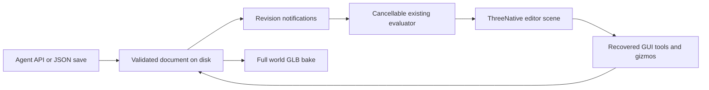

# PRD-467 — Live terrain editor with persistent individual shape editing

**Status:** NOT STARTED
**Complexity:** 9 (HIGH); risk override: none
**Owner:** ThreeNative maintainers
**Depends on:** PRD-466 phases 1–2 public authoring/rendering contract
**Progress:** 0/8 required boxes verified

## Context

João wants to open the terrain editor URL, watch the agent build the world live,
click individual shapes, move/rotate/scale them, and use the existing GUI tools
to polish the result. Agent-first generation and full customization remain the
primary goal. The final output is a self-contained GLB usable in other games.

This is a required companion to [PRD-466](PRD-466-strata-terrain-threejs-integration.md),
not an optional later feature. Both plans must be verified before claiming the
whole requested integration is delivered. This request authorizes planning only.
Complexity: 3 for 11+ implementation files (mostly recovered editor modules),
2 for the authoring tool, 2 for worker/revision concurrency, and 2 for the
addon/consumer build boundary.

### The starting editor already exists

Use `/home/joao/Downloads/strata-terrain.html` and
`/home/joao/Downloads/AGENT_GUIDE.md`; PRD-466 records their input hashes.
Recover the named embedded sources, rather than inventing another editor.
The supplied editor already has brushes, layer selection/reordering, an inspector,
undo/redo, import/export, cancellable evaluation in a worker, and local restore.
Preserve these working features and the documented authoring operations/limits.

Observed gaps: `src/three/adapter.js` picks only terrain triangles; it does not
select individual props or expose transform gizmos. `src/editor/app.js` uses
localStorage, which a filesystem agent cannot share. Worker progress is not an
intermediate rendered snapshot. Scatter IDs are `${rule.id}:${acceptedIndex}`,
which can identify a different tree after masks change acceptance order.

Capability search/detail found `ScenePicker`, `InstancedBatch`, `mergeParts`, and
`markStatic`. `packages/core/src/picking.ts` returns normal Three.js intersections
and supports instanced meshes through Three.js's existing raycast path. Installed
`three/addons/controls/TransformControls.js` supplies the gizmo; it attaches to an
`Object3D`, so one instanced prop needs a selection proxy, not a new gizmo system.

## Solution

### One document shared by the agent and GUI

Serve the recovered editor at **`/terrain-editor/`** through the existing preview
Vite dev server and print the complete URL at startup. The agent authors through
the API/JSON operations; driving the editor UI is never required.
`examples/strata-terrain-preview/terrain/` owns the saved authoring document:
Strata recipe, procedural shape parameters, and explicit placement overrides.
It is terrain authoring data, not a new engine scene format or executable JS.

Minimal Node/Vite middleware watches complete file saves and broadcasts revision
notifications via SSE. Agents can atomically save JSON or submit documented
`applyPatch()` command shapes through a local endpoint. The GUI commits the same
validated semantic transactions. Use existing Vite HMR for changes to editable
render source. No database, hosted service, second localStorage authority, or
new websocket library. Existing browser-only saves can be explicitly imported.

One content-hashed revision is one synchronous semantic transaction. Serialize
writes to the document and reject stale base revisions with an explicit conflict;
never overwrite newer human/agent work. Save atomically and retain the previous
valid document/scene on validation or disk failure. Invalid external saves show
diagnostics; do not accept or silently erase them.

Bind writes to loopback and the configured project document. Validate host/origin,
bounded JSON bodies, patches, and transforms. No client-selected paths, filesystem
browser, arbitrary-code execution, or public unauthenticated write service.

### Watch construction without refreshing

Opening the URL loads the latest document without resetting to a demo. Each
committed hill, pad, road, or population edit produces a visible new revision.
Retain the last valid geometry while building, show requested/rendered revisions
and progress, discard stale worker results, and preserve selection by stable ID.
Coalesce pending previews; terminate the worker for real cancellation of a long
synchronous erosion pass. The supplied operation-progress callback alone does
not prove the world is changing on screen.

For a 512-metre, 129-vertex grid with 100 props, simple non-erosion commits appear
within 2 seconds after server acceptance on the measured machine. Verify three
successive agent edits while the page remains open. Longer erosion must show
progress/cancellation and leave the GUI responsive; maximum-resolution evaluation
is not promised to be real-time. Mark preview/export resolution explicitly and
reevaluate exports from committed data at the chosen resolution.

Use PRD-466's editable realistic terrain/ocean/lighting source in the editor, not
a separate reduced renderer. The five starter documents appear in the user-requested
order: Temperate Forest/Grassland, Mountain/Alpine, Desert/Canyon, Coastal/Island,
Snow/Tundra. They are editable examples, not locked artistic presets.

### Select and gizmo one object

Click a tree/rock/grass instance to select that placement, with visible selection
and inspector state; do not select its whole batch. Map picker `instanceId` to a
durable authoring key. The object list also selects overlapping/occluded objects.
Use one TransformControls proxy for full translate/rotate/nonuniform scale; update
that instance immediately during drag and suspend camera orbit while dragging.
Commit one transaction on drag end; Escape cancels and undo reverts the whole drag.
Numeric position/rotation/scale inputs provide precise, keyboard-accessible edits.

Fix scatter identity using deterministic candidate keys, independent of rejection
and acceptance order; random draws for one candidate must not depend on earlier
candidates being accepted. Never persist a mesh-array index as identity.
Manual overrides contain the stable key, position, quaternion, positive scale, and
named grounding choice. Rebuild, reload, API edits, runtime bake, and GLB export
all consume them. Removed candidates retain unmatched overrides and a visible
diagnostic with explicit remove/reassign actions; never silently retarget edits.

Grounding defaults on: moving X/Z regrounds using the actual model bounds. Lifting
records an explicit grounding override and retains measured clearance. Validate
finite coordinates/rotations and positive scales. UI angle conversion is explicit:
terrain operation rotations use degrees; supplied scatter yaw uses radians.

Terrain landforms select the stable recipe layer with a footprint/handle, not a
fictional independent mesh buried in an eroded heightfield. Translate/rotate/scale
supported stamp/heightmap/paste parameters through the recipe. Support vertical
offset/scale with the smallest explicit operation contract where needed. Disable
axes that a heightfield cannot represent, such as overhanging landform rotations,
with a reason; free-standing props retain ordinary full 3D transforms.

### Preserve GUI polish and portable export

| Tool group | Required recovered behavior |
| --- | --- |
| Landforms | Sculpt, smooth, flatten, ramp, stamps, erosion, and supplied heightmap/copy/paste. |
| Surface/population | Material/biome paint, scatter/clear, individual selection, and editable shape parameters. |
| Paths/water | Road/river controls, carving and water placement, using PRD-466's realistic ocean rendering. |
| Document | Layer enable/reorder/inspect, undo/redo, import, existing data exports, and the new full-world GLB action. |

The new default world export contains terrain, generated/placed props, manual
transforms, and portable baked PBR textures. It must not call the supplied
terrain-only `makeExport(..., 'glb')` and present that as a complete world.
Shader-driven effects are frozen/baked as specified in PRD-466; live water/wind
simulation does not travel inside standard GLB. Keep the editable source document
separately. Export errors preserve it and the previous valid export.

## Scope and ownership

Browser/dev-server/editor entries under `packages/terrain/editor/` are optional
tooling excluded from runtime/headless imports. No generic game editor, Studio
integration, realtime multiplayer authoring, or cloud persistence. PRD-466 carries
the explicit narrow charter allowance for this terrain-only tool. No appearance
defaults move into core; the editor consumes ordinary Three.js objects and the
same game-owned render source as the runtime.

## Acceptance Criteria

AC-1 through AC-7 are phase boxes. AC-8 below proves the saved consumer handoff.
All are `local`, actor: implementing agent. New scripts/tests are implementation
targets, not commands that currently exist.

- [ ] AC-8 [local, actor: implementing agent]: A GUI-polished world survives reload and exports as the same portable GLB content. proof: planned `pnpm --filter strata-terrain-preview test:consumer` with the editor-authored fixture — Evidence: pending; compare terrain samples and stable placement transforms after refresh, JSON round trip, and vanilla GLTFLoader import without editor globals/localStorage.

## Integration Ledger

| Capability | Real consumer path | Replaces / disposition | Evidence |
| --- | --- | --- | --- |
| Live authoring | Agent/API/file save → revision → editor worker → scene | localStorage-only authority and final-only preview | AC-1, AC-2 |
| Individual polish | Picker hit → stable key → gizmo proxy → saved override | terrain-only picking and transient instance-index edits | AC-3, AC-4 |
| Existing GUI | Recovered controls → shared semantic transactions | a separate GUI recipe copy | AC-5, AC-6 |
| Portable handoff | Saved document → PRD-466 full-world exporter → ordinary game | visual-only edits and terrain-only world exports | AC-7, AC-8 |

New locations are proposed. Record actual non-test entry points when implemented;
do not invent future line numbers.

## Decisions

- 2026-09-30 (João): Live editor URL, individual gizmos, existing GUI tools, and
  saved customization are required; agent-first generation remains primary.
- 2026-09-30 (João): Prioritize the five named environments and output a GLB
  easily usable in any game.
- 2026-09-30 (planning choice): Preserve and extend the supplied editor; keep this
  independently testable tool in a linked PRD with three phases/eight boxes.
  Both PRDs remain required for the full outcome; no requirement is deferred away.

## Execution Phases

### Phase 1: Shared document and live editor URL

**Status:** NOT STARTED
**Files:** recovered `packages/terrain/editor/app.*`/worker, `editor/server.ts`,
preview Vite config/editor entry/document, `__tests__/editor-document.spec.ts`.
**Implementation:** Recover UI/worker; attach to the shared document and preview.
Reuse middleware, file watching, SSE, atomic validation and revision ownership.

- [ ] AC-1 [local, actor: implementing agent]: The open editor renders successive agent revisions without refresh. proof: planned `pnpm --filter strata-terrain-preview test:terrain:editor` — Evidence: pending; actual dev URL, three distinct observed geometry revisions, and simple-edit latency within 2 seconds on the named fixture.
- [ ] AC-2 [local, actor: implementing agent]: Malformed/stale writes cannot replace the valid document. proof: planned `pnpm exec vitest run packages/terrain/__tests__/editor-document.spec.ts` through real middleware — Evidence: pending; conflict/error response, unchanged disk data, path/origin restrictions, valid subsequent recovery, and canceled/stale job rejection.

### Phase 2: Individual selection and persistent gizmos

**Status:** NOT STARTED
**Files:** `editor/selection.ts`, `editor/transforms.ts`, authoring validation and
stable-key evaluation, `__tests__/placement-overrides.spec.ts`, editor scenario.
**Implementation:** Reuse picker/gizmo, preserve instance identity, persist one
transaction per drag, and consume overrides in bake/export. Preserve recipe
intent for landforms. Invalidate only affected static/instance data during drag.

- [ ] AC-3 [local, actor: implementing agent]: One selected instance is translated/rotated/scaled through actual gizmo interactions. proof: planned `pnpm --filter strata-terrain-preview test:terrain:editor` — Evidence: pending; chosen stable key/matrix changes, sibling matrices unchanged, numeric inputs select the same object, and unsupported landform axes are explicit.
- [ ] AC-4 [local, actor: implementing agent]: Manual overrides retain identity after re-evaluation. proof: planned `pnpm exec vitest run packages/terrain/__tests__/placement-overrides.spec.ts` — Evidence: pending; change rejection order, assert no retargeting, retained unmatched diagnostics, round-trip transforms, and invalid-input rejection.

### Phase 3: GUI polish and GLB handoff

**Status:** NOT STARTED
**Files:** recovered tools/inspectors, shared history/export integration, addon
agent guide, `playtests/terrain-editor.playtest.json`, runner-backed editor script.
**Implementation:** Wire every supplied tool to the shared document, keep save,
undo/export coherent across consumers, and exercise real public entry points.
Use the existing harness; no new E2E framework or verification-report file.

- [ ] AC-5 [local, actor: implementing agent]: GUI tool groups edit the shared authoring recipe. proof: planned `pnpm --filter strata-terrain-preview test:terrain:editor` — Evidence: pending; use controls from each tool group, inspect saved semantic changes, and retain remaining supplied tools wired through the same validated transaction path.
- [ ] AC-6 [local, actor: implementing agent]: Drag/cancel/undo operate as single edits without losing agent revisions. proof: planned `pnpm --filter strata-terrain-preview test:terrain:editor` — Evidence: pending; actual interaction, conflict handling, selection retention, and saved revision/file consistency.
- [ ] AC-7 [local, actor: implementing agent]: Packaged editor tooling stays optional to headless/runtime consumers. proof: planned `pnpm --filter strata-terrain-preview test:consumer` — Evidence: pending; root and `/three` imports exclude DOM/server modules, the editor loads through its tooling entry, and the edited document reaches the full-world GLB export.

## Verification and delivery

Gizmo proof drives visible interactions, not only an internal matrix helper.
Live proof observes rendered revisions, not only notifications/progress labels.
Browser WebGPU proves the authoring UI; changes to baked output rerun the affected
PRD-466 browser/desktop consumer scenarios. Use real red/green for behavior and
required type/lint/test/build/budget/selected-CI gates after nearest checks.

Run `pnpm prd:progress` before execution and after phases. Keep results on these
boxes or the PR; mirrors are regenerated only for changed agent guidance.
One draft implementation PR targets `develop` from an owning-repository worktree.
Archive only after all eight boxes pass. Planning does not authorize deployment
or npm publication, and does not claim implemented editor behavior.
