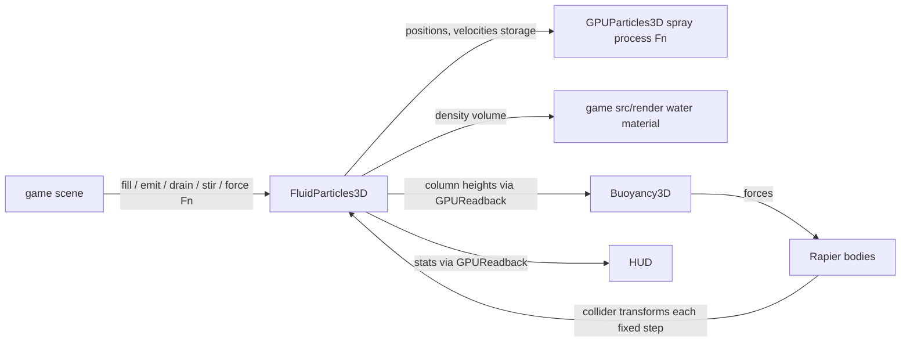

# PRD-476 — Fluid Lab: particle water on the GPU at 60 fps

**Status:** IN PROGRESS
**Complexity:** 9 (HIGH); risk override: none.
**Owner:** Engine implementation agent
**Depends on:** None
**Progress:** 6/8 required boxes verified (the two frame-time boxes are open; see Blocked on)

## Context

Absorb `/home/joao/Downloads/fluid-lab-v2.html` ("Fluid Lab 02", 238,714 bytes, SHA-256
`e389fe7f5198c3ce4365b343281c1e34317c55082514741815e9217ad14f4ef7`) as engine capabilities, remove
the frame-rate wall that holds it near 30 fps, and rebuild it as a sandbox game on those
capabilities. Phases 1-3 are implemented on PR #389; the two frame-time boxes stay open until a valid presentation lane exists.

The file is a raw Three.js 0.180 (WebGL2) + Rapier 0.19 lab with eight experiments: dam break,
splash tank, buoyancy, waterfall, fountain, whirlpool, viscosity, and ocean & rain. Its readable
source is embedded as a JSON map at `fluid-lab-v2.html:69` (`window.FLUID_LAB_SOURCES`); lines
70–1280 are the bundled module. The Downloads file is an input, never a runtime dependency.

### What the source does, and where it goes

| Source (`FLUID_LAB_SOURCES` path) | Behaviour | Destination |
| --- | --- | --- |
| `src/physics/fluid.js` | CPU Position Based Fluids: uniform-grid neighbours, density constraints, XSPH viscosity, cohesion, vorticity confinement, box/sphere collider projection, emit/drain/stir | **New** `FluidParticles3D` in `packages/core`, on GPU compute |
| `src/render/surface.js` | CPU density lattice + surface nets mesh, gradient normals, per frame | **New** density volume on `FluidParticles3D` (data); the surface look is game `src/render/` |
| `src/physics/coupling.js` | Rapier bodies, sampled Archimedes lift and drag, particle→body reaction impulses | Existing `Buoyancy3D` (`@threenative/physics`) on the fluid's height source; colliders feed the solver |
| `src/physics/waves.js` | Damped heightfield wave equation, rain/pointer impulses | Existing `RippleField` (+ `WaveField` swell) — no new engine code |
| `src/physics/secondary.js` | Spray droplets, crown sheets, advected foam, bubbles | Existing `GPUParticles3D` with a game process function; foam and crown shading in game `src/render/` |
| `src/render/shaders.js`, `water-renderer.js`, `stage.js` | Refraction, absorption, Fresnel, exit-depth pass, debug views | Game `src/render/` (rule (b): it decides the look) |
| `src/simulation.js`, `presets.js`, `ui.js`, `main.js` | Eight scenes, actions, inspector, fixed-step loop | Sandbox game scenes, HUD, and the engine's fixed-step dispatch |

### Why it runs at ~30 fps (measured)

`src/physics/fluid.js` and `src/render/surface.js` are dependency-free, so they were timed directly
in Node 20.19.6 on this machine (splash-tank fill, 60 steps after a 30-step warm-up):

| Quality | Particles | `FluidSolver.step` | `FluidSurface.update` |
| --- | --- | --- | --- |
| Light | 760 | 14.3 ms | 4.2 ms |
| Balanced (default) | 1,625 | 29.9 ms | 6.6 ms |
| High | 2,175 | 40.9 ms | 9.6 ms |

At the default quality the CPU solver alone is 1.8× the 16.7 ms frame, before the surface rebuild
and four scene renders per frame (`water-renderer.js:118–123`: scene target, back faces, composite,
quad). `main.js` runs up to three 1/60 s steps per frame and caps the accumulator at three steps,
so when a step outruns the frame the display drops to the 30 fps vsync bucket and the simulation
falls into slow motion. Light quality still misses the budget once rendering is added. Making the
CPU code a few times faster would not leave room for rendering on a phone; the neighbour search
and constraint passes are data-parallel work that belongs on the GPU.

### Existing mechanisms reused

Capability search and detail were run for the full request and for each mechanic.

- `FluidField2D` (`packages/core/src/fluid-field.ts`, 748 lines; PRD-249): the precedent shape —
  TSL compute passes, `IComputeDriven`, `ctx.add` lifetime, numeric samplers, game-owned look,
  conformance case `77-fluid-field`, example `examples/prd249-fluid-field` with web and desktop
  playtests. `FluidParticles3D` copies this shape; it does not replace the 2D field.
- `ComputeDrivenRegistry` / `IComputeDriven` (`packages/core/src/compute-driven.ts`): pass order,
  warm-up, release.
- `GPUReadback`: throttled GPU→CPU copy with `staleFrames`, for stats and the height source.
- `Buoyancy3D` (`packages/physics/src/Buoyancy3D.ts`): hull points, density, drag, any height
  source. Covers the lab's buoyancy and splash-slowdown.
- `RippleField`, `WaveField`: the ocean scene, unchanged.
- `GPUParticles3D`: spray and bubbles. A search for "splash spray droplets with lifetime and
  gravity" returned verdict `none`; this is a manifest recall gap, fixed in Phase 3.
- `WaterSurface3D` is a level-plane refraction/reflection helper; it does not fit a free-form
  particle surface and is not used here.

No 3D particle fluid, SPH/PBF solver, or isosurface extraction exists in `packages/`.

Complexity: 2 for 6–10 implementation files, 2 for a new system, 2 for GPU pass ordering and
cross-frame readback state, 2 for crossing the native host and the sandbox tarball boundary,
1 for none of the rest → 9.

## Solution

**`FluidParticles3D`** (`packages/core/src/fluid-particles.ts`, exported from the core index with
`@situation` tags) is a GPU Position Based Fluids solver that draws nothing:

- Options: `capacity`, `spacing`, `bounds`, `iterations`, `viscosity`, `cohesion`, `vorticity`,
  `gravity`, plus an optional game TSL `force` function (the whirlpool's tangential drive). Every
  option has a default measured from the source's balanced preset; invalid values throw.
- Per fixed step, as ordered compute passes: predict, grid hash + counting sort, density/λ,
  position delta (repeat `iterations`), collider projection, velocity update with XSPH viscosity,
  cohesion and vorticity confinement.
- Game API: `fill(min, max, velocity)`, `emit(position, velocity)`, `drain(region)`,
  `stir(point, strength, radius)`, `setColliders([...])` (spheres and oriented boxes, updated each
  step from Rapier transforms; static and dynamic).
- Data out: `positions` / `velocities` storage nodes; a `density` 3D texture splatted each step;
  `heightAt(x, z)` from a column-height grid copied through `GPUReadback` (reports `staleFrames`);
  `stats` (`count`, `meanCompression`, `maxSpeed`) through the same throttled readback.
- Fails closed: on a renderer without compute (WebGL2 backend) `attachRenderer` throws with a
  named error rather than drawing nothing (the constructor has no renderer to ask).

**The look stays in the game.** The sandbox game's `src/render/` raymarches the density volume
(refraction, absorption, Fresnel, debug views ported from `shaders.js`) and owns spray, foam and
crown shading. A game can replace all of it without touching `packages/`.

**The sandbox game** `../sandbox/fluid-lab/` is scaffolded and installed from tarballs like a
user's, with all eight experiments as scenes, the lab's actions and keyboard, a HUD with the four
metrics, and a `FRICTION.md` logged as it is built.

**Risks.** 3D storage textures and atomics in TSL on the native Dawn host (proved by the
conformance case before the sandbox depends on them); readback lag making floating bodies bob
(`Buoyancy3D` already runs on fixed steps; `staleFrames` is reported, not hidden); particle
tunnelling at the lab's 18 m/s velocity clamp (keep the clamp as an option).

## Acceptance Criteria

Phase boxes below are the acceptance criteria; each names its proof.

## Integration Ledger

| Capability | Reachable consumer/trigger | Replaces / disposition | Evidence |
| --- | --- | --- | --- |
| GPU particle fluid | `ctx.add(new FluidParticles3D(...))` in `examples/prd476-fluid-particles/src/game.ts` and the sandbox scenes | New; the lab's CPU `FluidSolver` is not ported | Phase 1 boxes |
| Fluid → body buoyancy | `new Buoyancy3D({ surface: fluid, ... })` in sandbox buoyancy/splash scenes | Replaces `coupling.js` sampling and reaction impulses | Phase 2 box 1 |
| Native host | Conformance registry case on the desktop host | New case beside `77-fluid-field` | Phase 2 box 2 |
| Discovery | `engine_search_capabilities` → manifest built by `pnpm build` | Adds `@situation` tags; no hand-edited JSON | Phase 3 box 1 |

## Blocked on

- A valid presentation lane for the two frame-time boxes: on this machine the private Xvfb presents a trivial WebGPU page at 17–20 fps, headless Chromium falls to SwiftShader, and the real display is off limits for captures by owner directive. Unblocks: the owner allows one window on the desktop for a 60 s run, or a GPU-accelerated virtual display exists. A quiet host (other agents idle) is also needed: the runs above shared it at load average 14–50.

## Decisions

- 2026-10-01 (planning agent, proposed; owner may overturn): GPU compute, not an optimised CPU
  port. Measured 29.9 ms per balanced step on a desktop CPU; even a 3× gain leaves no frame budget
  on a phone, and the charter makes a backend the game cannot write portably the engine's job.
- 2026-10-01 (planning agent, proposed): a density volume the game raymarches, not GPU surface
  nets. Surface nets need stream compaction and indirect draws on both hosts; the volume is data,
  which keeps the look in `src/render/` like `FluidField2D`'s dye.
- 2026-10-01 (planning agent, proposed): no particle→body reaction impulses. `Buoyancy3D` lift
  and drag already slow and float bodies; add impulses when a scene shows a body passing through
  water without slowing.
- 2026-10-01 (planning agent, proposed): name `FluidParticles3D`, pairing `FluidField2D` and
  `GPUParticles3D`; Godot has no fluid node to borrow.
- 2026-10-01 (implementation agent): floating bodies carry one centre hull point (heave only).
  Four to eight points fed splash noise into torque and tumbled the box (ejected to 27 m) because
  Rapier angular damping is not on the body options; `sample` box-filters open columns for the
  same reason.
- 2026-10-01 (implementation agent): the lab's HUD is a DOM readout, not scene-drawn; spray is a
  `GPUParticles3D` that borrows fast fluid particles' state; the volume raymarch is game source.
- Out of scope: Android/iOS frame-rate claims (no result here claims a platform it did not run
  on); a follow-up PRD takes the Pixel 8 measurement once Phase 3 lands.

## Execution Phases

#### Phase 1: `FluidParticles3D` runs a dam break on the GPU at 60 fps

**Status:** PARTIAL (2 of 3 boxes; the third needs a presentation lane)
**Files:** `packages/core/src/fluid-particles.ts` (new), `packages/core/src/index.ts` (export +
JSDoc tags), `packages/core/__tests__/fluid-particles.spec.ts` (new),
`examples/prd476-fluid-particles/` (new, copied from the `prd249-fluid-field` layout: `game.ts`,
`main.ts`, `render/`, `conformance.js`, `playtests/`).
**Implementation:** Port the `fluid.js` algorithm pass for pass into TSL compute behind
`IComputeDriven`; keep the source's kernel constants and parameter defaults so behaviour can be
compared. The example renders particles as points from `positions` (debug look only) and exposes
`GameState` with `stats`, `steps`, and a front-position probe.

- [x] Option validation fails closed, passes dispatch in the documented order, `fill`/`emit`/ `drain` respect capacity, and scene removal releases buffers. proof: `pnpm exec vitest run packages/core/__tests__/fluid-particles.spec.ts` — 9/9 pass
- [x] A released dam-break column runs across the tank and settles with mean compression ≤ 0.05 and every particle inside `bounds` (GameState resource assertions). proof: `node packages/playtest/dist/runner/cli.js examples/prd476-fluid-particles/playtests/fluid-particles.playtest.json --url http://127.0.0.1:5173 --server-command "pnpm --filter prd476-fluid-particles dev --host 127.0.0.1" --browser-recipe webgpu --headed` — pass on `nvidia/turing`: 1,638 particles, peak front x 2.9 m, final mean compression 0.0012, max speed 0.047 m/s, inBounds 1, 0 console errors (headless Chromium reports no adapter here, so `--headed` on the private Xvfb is required)
- [ ] With 6,000 particles (the source's High capacity) the splash tank holds steady-state frame p95 ≤ 16.7 ms on the Linux desktop browser with a hardware WebGPU adapter (`adapter.info` recorded, not SwiftShader). proof: `measure-steady-state-fps` skill lane against the example
  Partial, not ticked: the solver step costs 2.5–3.4 ms to GPU completion at 6,000 particles (`?bench=1&stress=1`, 5×200 steps, `nvidia/turing`, host load average ~50) and uncapped frame deltas over 6,213 frames are p50 1.2 / p95 7.4 / p99 15 ms. The skill's presentation-lane control fails here, though: a trivial WebGPU page presents at 17–20 fps under the private Xvfb and headless falls to SwiftShader, so presented p95 is unmeasured.

**Verification:** run the three proofs above; record particle count, p95 frame time and adapter
beside the third box.

#### Phase 2: bodies splash and float, and the native host runs the solver

**Status:** DONE (2 of 2 boxes)
**Files:** `packages/core/src/fluid-particles.ts` (colliders, column heights, `heightAt`),
`examples/prd476-fluid-particles/src/game.ts` (a sphere and two boxes),
`packages/runtime-native/conformance/registry.json` (new case),
`examples/prd476-fluid-particles/playtests/fluid-particles-desktop.playtest.json` (new).
**Implementation:** `setColliders` uploads sphere/box transforms from Rapier each fixed step and
projects particles out of them; the column-height grid feeds `heightAt` through `GPUReadback`;
`Buoyancy3D` consumes it unchanged. Register a conformance case next to `77-fluid-field` with
`desktopGate: true`, using the example's `conformance.js`.

- [x] A 1,900 kg/m³ sphere dropped into the tank displaces the surface and comes to rest on the floor, while a 550 kg/m³ box ends floating with its centre within 0.2 m of `heightAt` after 5 s (GameState assertions). proof: the Phase 1 playtest command with the coupling scenario — pass x2 (`fluid-particles-coupling.playtest.json --url http://127.0.0.1:5173/?scene=coupling --headed`): sphere rests at y 0.299 m with speed 0, the 550 kg/m³ box ends 0.04 m from `heightAt` (limit 0.2), surface disturbance seen, 0 console errors. Hull is one centre point (heave only): off-centre points fed splash noise into torque and tumbled the box.
- [x] The desktop host runs the solver and matches the web capture within the case tolerance. proof: `pnpm parity` (case `fluid-particles`) and the `fluid-particles-desktop` playtest — `run-conformance.mjs --target web` then `--target desktop --only-tests fluid-particles` against `build/tn-linux/mystral`: pass, pixelMismatchRatio 0, perceptualDeltaE 0 (tolerance 0.08 / 6.0), 0 GPU validation errors; `--target desktop` playtest passes (peak front 2.9 m, final max speed 0.09 m/s, stats readback works natively); web capture on `nvidia/turing`

**Verification:** both proofs; regenerate the census in the same commit as the registry change
(`pnpm census`).

#### Phase 3: agents find it, and the sandbox Fluid Lab runs all eight experiments at 60 fps

**Status:** PARTIAL (2 of 3 boxes)
**Files:** `packages/core/src/index.ts` (`@situation` tags for `FluidParticles3D`; spray/droplet
situations on `GPUParticles3D`), `packages/create-threenative/templates/sailing/AGENTS.md` or the
capability reference the scaffold reads (one line, inside the template caps),
`../sandbox/fluid-lab/` (new game: scenes, `src/render/`, HUD, playtests, `FRICTION.md`).
**Implementation:** `pnpm build` regenerates both capability manifests. Pack core and physics to
a private staging directory with content-hashed tarball names (never `pnpm sandbox`, which wipes
the shared `.packages`), scaffold `fluid-lab`, port the eight experiments onto
`FluidParticles3D`, `Buoyancy3D`, `RippleField`/`WaveField` and `GPUParticles3D`, and the optics
from `shaders.js` into `src/render/`. Commit and push the game to the sandbox remote as soon as it
runs, per the sandbox `AGENTS.md`.

- [x] `engine_search_capabilities` returns `FluidParticles3D` first for "pour water into a tank and drop a ball in it" and `GPUParticles3D` for "splash spray droplets with lifetime and gravity"; template caps still pass. proof: `pnpm build && pnpm test`, then both searches — `searchCapabilities` over the regenerated `packages/core/capabilities.json`: "pour water into a tank and drop a ball in it" → FluidParticles3D (0.70) first; "splash spray droplets with lifetime and gravity" → GPUParticles3D (3.60) first. `pnpm build` ok; `pnpm test` (create-threenative + scripts + the new spec, 2,457 tests) 2,456 pass; the one red (`quality-json.spec`, 3 unwaived suppressions in `fluid-particles.ts`) was fixed and rerun green; `pnpm typecheck`, `pnpm lint` (0 errors) and `pnpm budgets` exit 0
- [x] A playtest cycles all eight scenes through keys 1–8 and asserts each is non-blank, changes over time, and reports a non-zero particle or wave state. proof: `node packages/playtest/dist/runner/cli.js ../sandbox/fluid-lab/playtests/experiments.playtest.json --url <preview url> --browser-recipe webgpu --headed` — pass on `nvidia/turing` (`../sandbox/fluid-lab`, pushed as ThreeNativeHQ/examples 0cdeb86): per scene `experiment`, `alive` (particles or wave energy) and `moved` (speed over 0.2 m/s or wave energy) hold at every step; the eight per-scene screenshots are 5-11 % non-background pixels (ocean 90 %); 0 console errors
- [ ] The sandbox Splash Tank at the High preset holds steady-state frame p95 ≤ 16.7 ms on the Linux desktop browser with a hardware WebGPU adapter — the case the source drops to 30 fps. proof: `measure-steady-state-fps` skill lane against the sandbox build + preview
  Open: the High preset (4,896 particles) steps in 2.8–5.8 ms to GPU completion and uncapped frame intervals read p95 8.5–13.4 ms over ~5,000–6,500 frames, but the host was shared with other agents (load average 14–50) and a control scene with no fluid already showed p99 14–16 ms, so the run is not clean enough to tick; no presented-frame lane exists (see Blocked on).

**Verification:** the three proofs; `score-build-experience` on the finished sandbox build goes
in the PR body, not a box.
