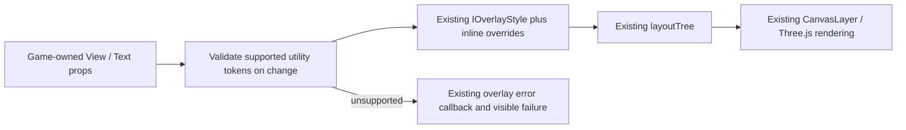

# PRD — Bounded Tailwind-style utilities for native overlays

**Status:** NOT STARTED — design proposal; no runtime feature is implemented by this PR.
**Date:** 2026-10-01 (America/Vancouver).
**Scope:** Optional utility authoring for the existing native React HUD, not Tailwind CSS compatibility.
**Audit baseline:** `develop` at `49ba2c49d6867ce075a9ebe42b994e3464ec0283`.
**Delivery:** One draft PR targeting `develop`; retain this active PRD until its implementation and acceptance work are verified.

## Intent and fit

Let a game author or coding agent use familiar utility strings for a small native HUD without a
WebView, while keeping ThreeNative's existing renderer, optional React dependency boundary and
inline-style escape hatch. The request is to assess the codebase and propose a fit, not to
replace its UI architecture or automatically migrate existing games.

**Qualified yes:** add a bounded adapter to `@threenative/core/react`. **No:** introduce a Rust
proc-macro UI stack, Taffy, Dioxus/Blitz, a general CSS compiler, or a second GPU renderer for this
purpose. The current native renderer is TypeScript over Three.js; a Rust styling subsystem would
add a language/toolchain boundary without removing the existing rendering limitations.

This is deliberately smaller than the earlier generic native-Tailwind suggestion. It does not
promise 80–90% utility coverage, browser-equivalent layout, improved FPS, lower process memory,
or unchanged rendering of a DOM/Tailwind HUD. Those claims have not been measured.

## Codebase evidence and ownership

The following files were inspected at the audit baseline. Links below resolve within the repo;
the baseline above identifies the reviewed versions.

| Existing source | Observed contract | Consequence |
| --- | --- | --- |
| [React entry](../../packages/core/src/react.ts) | `View` and `Text` expose `style` and `children`; React stays on an optional subpath. | Extend these components, not DOM tags or the core main entry. |
| [React host](../../packages/core/src/react-host.ts) | A custom reconciler creates CanvasLayer quads and bitmap glyphs; commits invalidate drawing. | Resolve utilities at host creation/update; reuse rendering and error reporting. |
| [Native layout](../../packages/core/src/react-layout.ts) | Exactly 20 style fields, uniform padding, fixed/shrink-wrapped boxes and simple row/column flow. | Translate only to existing fields; do not implement Flexbox or CSS implicitly. |
| [Core package](../../packages/core/package.json) | `./react` is exported; React and the reconciler are optional peers. | No new runtime dependency or eager React import. |
| [UI contract](../../packages/ui/AGENTS.md) | The default web UI has its own native realm; game code owns state, UI only presents it. | Preserve `ui.renderer: "web"`, state/intent boundaries and the portable-entry DOM guard. |
| [Charter](../architecture/CHARTER.md) and [completed PRD-217](done/PRD-217-webview-ui-layer.md) | Web-standard UI is the default; native quads are an opt-in with reduced capabilities. | Do not reopen the completed WebView work or call native output CSS parity. |

The governing rule in plain words: the framework owns portable mechanisms, the game owns the
look, and the native host runs Three.js rather than replacing it. This proposal introduces no
scene format, public style IR, platform-specific HUD implementation or general compiler.

The native host is C++ with existing native dependencies; this proposal neither removes existing
Rust code nor introduces another Rust subsystem. For actual Tailwind/CSS/SVG and richer UI,
continue using the existing web renderer. Tailwind's upstream
[source scanning documentation](https://tailwindcss.com/docs/detecting-classes-in-source-files)
describes CSS generation; recognizing similar tokens here does not execute Tailwind.

## Alternatives

| Approach | Benefit | Cost / decision |
| --- | --- | --- |
| Keep native inline styles only | No additional API or parser; already functional. | Remains a valid fallback if utility authoring fails the acceptance test. |
| Bounded utility adapter on the existing native renderer | Familiar spacing/size/color syntax without another layout or paint system. | Recommended, opt-in and explicitly limited. |
| Full CSS/native renderer or new Rust UI stack | Potentially much richer styling. | Separate architectural project; not justified by this request and not admitted here. |

## Proposed authoring contract

The following API is **proposed, not currently shipped**:

```tsx
import { Text, View } from "@threenative/core/react";

<View
  className="left-6 top-6 w-64 p-4 gap-2 bg-[#18181b]"
  style={{ direction: "column" }}
>
  <Text className="text-[#fff] text-[24px]">SCORE 10</Text>
</View>
```

Add `className?: string` to `IViewProps` and `ITextProps` and forward it to the existing host.
An internal `react-utilities.ts` returns ordinary `IOverlayStyle`; do not add a public compiler,
registry, provider, theme configuration or `tw()` API. A game continues to choose
`ui: { renderer: "native" }` and mount its overlay through the existing API. Selecting that
configuration alone does not convert a DOM HUD or mount this example.

### Initial supported vocabulary

| Utilities | Native mapping |
| --- | --- |
| `p-N`, `gap-N` | Uniform `padding`, `gap`. |
| `w-N`, `h-N` | Fixed `width`, `height`. |
| `left-N`, `right-N`, `top-N`, `bottom-N` | Existing parent-content-box offsets. |
| `p-[Npx]`, `gap-[Npx]`, `w-[Npx]`, `h-[Npx]`, and offset equivalents | Literal values in existing CanvasLayer screen units. |
| `bg-[#rgb]`, `bg-[#rrggbb]` | `background` on `View`. |
| `text-[#rgb]`, `text-[#rrggbb]` | Glyph `color` on `Text`. |
| `text-[Npx]` | Existing `fontSize`, the bitmap glyph-cell height, on either component. |
| `text-left`, `text-center`, `text-right` | `textAlign` on `Text`; alignment needs an explicit wider text box to have a visible effect. |
| `z-N`, `-z-N` | Integer sibling `zIndex`, preserving existing subtree ordering. |

`N` for spacing is a nonnegative integer or integer plus `.5`; one spacing step is **4 existing
CanvasLayer screen units**. Thus `p-4` resolves to `padding: 16`. Literal pixel values accept
nonnegative finite decimal numbers; font size must be positive. Negative values are accepted only
for offset literals and the prefixed negative offset form, such as `-left-2`. Z-index accepts
integers only. All other numeric forms, units and non-finite results are rejected. Zero dimensions
retain existing native behavior; no minimum size is invented.

These are native units, not a new CSS/rem/DPR conversion. The adapter must not change the
CanvasLayer resize/camera contract. Colors accept hex only, normalize to six-digit lowercase hex,
and do not carry alpha. There is no built-in palette or theme: the game supplies its colors.
Text color remains non-inherited exactly as in the existing renderer; font size retains its
existing inheritance. Background utilities on `Text` and text-color/alignment utilities on
`View` must fail rather than accepting a mapping that does not paint.

`direction`, `align`, `centerX`, `centerY`, `opacity` and `letterSpacing` remain available through
`style`. In particular, native row/column flow is **not Flexbox**; native opacity is **not CSS group
opacity**. Offsets remain subject to existing layout rules: flow parents position children and
`left`/`top` take precedence over `right`/`bottom`. The guide must state these rules beside the
vocabulary, rather than imply browser equivalence.

### Resolution and errors

Resolve class-derived fields first, then overlay the explicitly supplied `style` object's own
keys. An explicit `undefined` therefore clears that class-derived field, matching object-spread
semantics. Always validate the entire utility string, even when inline styles override it.
Existing inline-only callers and their validation behavior remain unchanged.

Accept ordinary whitespace separators, an empty string and an absent `className`. Reject other
runtime types. Exact duplicate assignments may deduplicate; two distinct values targeting the
same field fail with `TN_REACT_UTILITY_CONFLICT`. Token order must not select the winner. An
explicit inline override is the supported way to override a class-derived field.

Unknown tokens, unsupported variants and malformed values fail with
`TN_REACT_UNKNOWN_UTILITY` or `TN_REACT_BAD_UTILITY`, naming the element and offending token.
Forward failures through the existing overlay `onError`/visible failure path; do not swallow them,
partially paint a guessed HUD or fall back to a WebView. Limit input to 4,096 UTF-16 code units
and 128 tokens; reject excess rather than silently truncating. No `eval` or executable expressions.

A host node retains only its last class string and resolved class style. Parse on creation and
on class-string changes, not on every React commit or `refresh()`. Inline style changes still
apply independently. Clearing/removing classes removes their fields; disposal releases retained
references. Do not introduce an unbounded global cache or persist generated style artifacts.
Validate a replacement before assigning the node's new props/style so a failed parse cannot
partially update its native style.

## Explicit non-goals

No `flex`, `grid`, grow/shrink/wrap, margins, `px-*`/`py-*`, percentage sizing, rem/vw/vh, arbitrary
CSS, `calc()`, CSS variables, themes, plugins, palette names, `!important`, responsive/media
variants, hover/focus/active variants, transforms, rounded corners, borders, shadows, gradients,
alpha-color modifiers or opacity utilities. Reject them rather than claim they work approximately.

No new font renderer, text wrapping/shaping, SVG, DOM elements, buttons, hit testing, form controls,
keyboard focus, accessibility tree, React Native dependency or automatic HTML migration. Existing
bitmap-glyph restrictions stay explicit. This work cannot make native overlays a replacement for
accessible, text-heavy application UI. No change to WebView packaging or platform support policy;
no iOS readiness claim.

## Integration and verification design



Implementation touches `packages/core/src/react.ts` and `react-host.ts`, adds the internal resolver
and focused tests, and updates the native API comments/discovery metadata. Keep `react-layout.ts`
and its 20-field rendering contract unchanged except documentation if necessary. Do not export
utility code from the main core entry or add CSS imports, a WebView dependency, WASM or a build
transform. Search the installed capability manifest before adding source, as the root rules require.

Use a **new isolated native-utility HUD fixture**, not the default starter's existing DOM HUD.
Run the same View/Text source through the existing overlay on browser WebGPU, native desktop and
Android emulator. Reference output is the equivalent existing inline-style native HUD, not DOM
Tailwind. Drive a game-state counter/color change, resize and class removal, and observe both
reported state and nonblank pixels. Demonstrate malformed input through the real error path.
Use the existing playtest runner and conformance/package harnesses; do not build another runner.

Record `objectCount`, changed/unchanged-commit behavior and `lastCommitMs` where meaningful.
Instrument resolver calls in tests: unchanged classes must cause zero additional parses over
1,000 refreshes; changing inline style must not reuse a stale merged style. The same rendered HUD
must retain the same object count. Record matched timing data without asserting a speedup or using
an arbitrary FPS threshold. Root-import dependency checks must show no additional React or utility
reach for games that do not import the native React subpath.

All new test names below are **planned**, not existing green tests. Native proof must exercise this
fixture: an unrelated 300-frame native smoke run cannot establish utility-HUD correctness.

## Execution phases

### Phase 1 — A bounded, deterministic resolver

- [ ] Supported utility strings resolve to the specified native fields. proof: planned `pnpm exec vitest run packages/core/__tests__/react-utilities.spec.ts` with table-driven unit, element-kind, duplicate, order and numeric-boundary cases.
- [ ] Unsupported or malformed utility strings fail by name. proof: planned rejection cases in `packages/core/__tests__/react-utilities.spec.ts`, including conflicts, variants, wrong runtime types, oversized input and non-finite numbers.

### Phase 2 — Existing React host integration

- [ ] `View`/`Text` class updates preserve the defined native style lifecycle. proof: planned `pnpm exec vitest run packages/core/__tests__/react-utility-overlay.spec.tsx` covering inline overrides, removals, memoization, unchanged refreshes, disposal and the existing visible error path.
- [ ] The published optional React subpath exposes the feature without adding it to ordinary core consumers. proof: packed public-import/dependency-graph checks plus `pnpm build`, `pnpm typecheck`, `pnpm lint`, `pnpm test` and the regenerated capability/template-documentation checks; include the supported and refused vocabulary in native authoring guidance.

### Phase 3 — Prove the actual HUD

- [ ] The new utility HUD matches its inline-native reference on browser WebGPU. proof: the existing playtest runner executing the planned `native-ui-utilities.playtest.json` fixture on the browser, including counter/color change, resize, class removal and captures.
- [ ] The same utility HUD runs without a WebView on native desktop. proof: the same planned fixture through the existing runner with `--target desktop`, with an observed native renderer path and nonblank captured HUD.

## Acceptance criteria

- [ ] The same utility HUD passes on an Android emulator without a WebView. proof: the same planned fixture through the existing runner with `--target android`; missing execution is not a pass and proves nothing about physical-phone performance.
- [ ] Utility authoring reduces repeated native HUD style code without increasing the rendered HUD's object count. proof: compare complete inline and utility versions of the same fixture, counting all required imports/setup and retaining the measured object counts; if it does not simplify the caller, retain inline styles rather than grow the renderer to justify the adapter.

## Blocked on

No external dependency is required to review this document. Implementation and all runtime proof
are unrun. The implementing lane needs the repo dependencies and a working browser/native desktop/
Android-emulator runner; any unavailable target must be reported here with its actual attempted
command and the prerequisite that unblocks it, not claimed as verified. Physical-device results
and iOS are outside this PRD's claims.

## Decisions, rollout and rollback

The approach above is the recommendation made by this proposal on 2026-10-01, not a claim that the
owner approved a renderer replacement. Existing `style` callers and `ui.renderer: "web"` remain
unchanged. New utility usage is explicit and opt-in; no default starter conversion or dependency
upgrade is required. A game can mechanically replace each supported class with its documented
native style fields; removing the adapter does not require a scene, asset or save-data migration.

Keep the PR in draft at `prd:0%` until implementation work is verified. Tick boxes with actual
results in the implementation commits and mirror them in the PR body. Do not archive this proposal
as completed merely because the design document exists.

## Verification of this documentation change

This PR changes only this Markdown file. Source inspection is pinned to the audit commit.
Documentation structure/progress checks are separate from runtime verification; their actual
results belong in the PR body. No parser, host integration, browser/native execution, performance
improvement or full repository test pass is claimed by this proposal.
