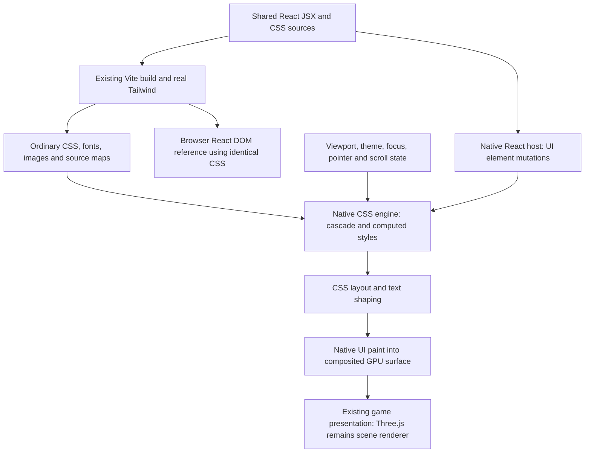

# PRD — Standard Tailwind and CSS, rendered as native UI

**Status:** PARTIAL — Phase 1 landed and verified on Linux desktop only (Blitz CPU backend, one acceptance fixture); Phases 2 and 3 are open. No Android, iOS, macOS or Windows claim.
**Date:** 2026-10-01 (America/Vancouver).
**Audit baseline:** `develop` at `49ba2c49d6867ce075a9ebe42b994e3464ec0283`.
**Delivery:** Replace the unimplemented proposal in draft PR #388; target `develop`.
**Scope:** An opt-in, native CSS-capable HUD backend with a tested compatibility profile.
**Product requirement:** Use the same Tailwind and CSS authoring interface, but output native UI.

## Decision and correction

**Agree with the product goal; revise the proposed implementation.** Run the real Tailwind build
pipeline, retain ordinary CSS as the styling contract, and render a React element tree through a
native CSS/layout/text/paint backend. Do not invent Tailwind-looking utilities, require conversion
to `IOverlayStyle`, or replace CSS with a public ThreeNative style language.

Native means an in-process, GPU-composited UI surface, without a WebView, Chromium/CEF, a browser
renderer process, or an HTML screenshot service. It does not mean platform-default widgets:
authored CSS still determines the appearance. A native stylesheet engine and an internal
DOM-like element tree are allowed. They are necessary implementation machinery, not a browser
JavaScript DOM exposed to game code.

The previous requirements for no CSS at runtime, mandatory static style IDs, and a Tailwind-to-
proprietary-style compiler are withdrawn. Parse CSS when loaded or changed; compute styles when
state changes. Build-time optimization is welcome only when it preserves the cascade, variables,
responsive rules, dynamic classes and interaction behavior. No parsing on every game frame.

This PRD delivers the **Core HUD profile** below, not all CSS or arbitrary web applications.
Additional profiles require their own PRDs and native proof; implementing this profile must not be
marketed as complete Tailwind/browser compatibility. There are no speculative coverage percentages.

## Existing architecture and fit

These sources were inspected at the audit baseline; observations describe current code, not this
proposal's future API.

| Source | Observed behavior | Design consequence |
| --- | --- | --- |
| [Workspace catalog](../../pnpm-workspace.yaml) | Tailwind and its Vite plugin are both pinned to `4.3.3`. | Use these actual packages and lockfile versions, not a hand-maintained utility table. |
| [React entry](../../packages/core/src/react.ts) | Optional React subpath; `View`/`Text` accept native `style` objects. | Keep existing callers working; standard JSX needs a separate host adapter. |
| [React host](../../packages/core/src/react-host.ts) | Custom reconciler, CanvasLayer quads and bitmap glyphs; other element types fail. | Reuse lifecycle patterns, not the limited drawing model as a CSS target. |
| [Layout](../../packages/core/src/react-layout.ts) | Fixed/shrink-wrapped boxes, simple row/column placement, no CSS parser; mobile WASM is explicitly refused. | A utility parser cannot supply Flexbox, CSS paint or font semantics. Native dependencies must not require mobile WASM. |
| [UI contract](../../packages/ui/AGENTS.md) | Shared UI reads published game state and emits intents; the game owns gameplay. | Keep the state/intent boundary and portable-entry isolation. |
| [Charter](../architecture/CHARTER.md) | Web-standard UI defaults to a platform WebView; native quads are a limited opt-in; public IRs and a second scene renderer are excluded. | Add a bounded UI-only architectural exception explicitly; do not claim this is already permitted/shipped. |

The framework owns the portable mechanism; the game owns every appearance choice. Three.js keeps
ownership of the 3D scene, camera and game rendering. Neither React nor the CSS backend takes over
the scene graph or game loop.

### Required architectural amendment

The implementation must amend the Charter and affected native-overlay documentation before the
new backend is presented as supported. The proposed exception is: an optional, third-party native
HTML/CSS UI engine may maintain a UI-only element tree and paint an offscreen HUD surface; it may
not render the 3D game, expose a game/scene IR, replace Three.js, or impose a framework-owned look.
This document proposes that exception; it does not silently amend the binding Charter.

Keep existing `ui.renderer: "web"` and `"native"` semantics unchanged. Add a proposed
`ui.renderer: "native-css"` opt-in rather than silently changing the existing bitmap-native path.
No default switch, completed-PRD rewrite, or mandatory dependency cost for other applications.

## User-facing contract

The example below is a **required future acceptance fixture**, not a currently available API.
The component and stylesheet are identical in browser and native-CSS builds; only the renderer
selection/bootstrap differs. Do not make users replace `div` with `View` or rewrite styles per target.

```tsx
import "./hud.css";

export function Inventory({ onClose }: { onClose: () => void }) {
  return (
    <section className="inventory fixed bottom-6 left-6 w-80 max-w-[calc(100vw-3rem)] rounded-2xl border border-zinc-700 bg-zinc-900/90 p-6 text-white shadow-xl">
      <h2 className="text-2xl font-bold">Inventory</h2>
      <p className="mt-1 text-sm text-zinc-400">12 items</p>
      <div className="mt-4 grid grid-cols-2 gap-3 md:grid-cols-3">
        <div className="rounded-lg bg-zinc-800 p-3">Medkit</div>
        <div className="rounded-lg bg-zinc-800 p-3">Battery</div>
      </div>
      <button
        className="mt-4 rounded-lg bg-brand px-4 py-2 transition-colors hover:bg-brand/80 focus-visible:outline-2 focus-visible:outline-white disabled:opacity-50"
        onClick={onClose}
      >
        Close
      </button>
    </section>
  );
}
```

```css
@import "tailwindcss";

@font-face {
  font-family: "HudSans";
  src: url("./fonts/hud-sans.ttf") format("truetype");
  font-weight: 100 900;
}

@theme {
  --font-sans: "HudSans", sans-serif;
  --color-brand: #2563eb;
}

.inventory {
  font-family: var(--font-sans);
  --inventory-border: var(--color-zinc-700);
  border-color: var(--inventory-border);
}

.inventory > h2 {
  letter-spacing: -0.02em;
}
```

The fixture must supply a licensed variable TTF supporting the declared weight range; the example
path is an asset requirement, not a claim that this font exists in the repository.

Required interfaces are ordinary JSX intrinsics, `className`, `id`, `data-*`, appropriate `aria-*`
attributes, CSS imports and the React CSS-style object convention, including unitless properties
and custom properties. `style={{ width: "50%" }}` must retain percentage semantics. The native
host implements the supported React property/event contract; it does not load `react-dom` against
the game's compatibility `document` stub.

Custom CSS must work without Tailwind. Tailwind's `@theme`, `@utility`, `@apply`, `@source` and
`@custom-variant` remain upstream build-time features; ordinary CSS is their output. Supported
plugins are those whose emitted CSS stays within the declared native profile. Do not promise
arbitrary plugin or DOM-dependent component-library compatibility.

## Selected approach and alternatives

| Approach | Assessment |
| --- | --- |
| Existing WebView path | Preserves the broad web contract, but does not meet the requested no-WebView output. Retain it for existing users. |
| Utility parser plus the current quad renderer | Cannot preserve CSS layout, cascade, typography or interaction. Rejected for this goal. |
| Taffy plus a new hand-built style/paint system | Layout is only one subsystem; leaves ThreeNative owning most of a CSS engine. Not the default plan. |
| Reuse a modular native HTML/CSS engine behind the existing UI boundary | Recommended: retain real CSS and concentrate new work on React, native-host integration and conformance. |

**First candidate: Blitz's modular core, not a switch from React to Dioxus.** Its upstream design
combines Stylo for CSS, Taffy for box layout and Parley for text, with a separate renderer. Its
README still describes a beta, missing features and no ready-made JavaScript bindings. The HTML
preview wrapper is not an interactive React backend. Its texture example is evidence of an
integration direction, not proof of compatibility with ThreeNative's GPU device or input system.
See the [upstream architecture and status](https://github.com/DioxusLabs/blitz).

[Taffy](https://github.com/DioxusLabs/taffy) is a useful layout dependency, not a replacement for
CSS resolution, text, paint and events. A maintained native engine is preferred over assembling
those subsystems from scratch. Backend selection is provisional until the first runnable slice
passes below; a failing candidate does not authorize silently shrinking the product requirement.

## Technical design



### Build and stylesheet ownership

Use the workspace Tailwind/Vite pipeline and preserve the resulting CSS, source order and assets.
Do not call private Tailwind candidate APIs as the public integration, hardcode spacing/palettes,
or transpile utility strings into proprietary style objects. CSS Modules may use the existing
bundler transformation; their final class names still enter the same stylesheet engine.

Bundle fonts/images offline through existing asset plumbing. CSS imports in a native build become
registered stylesheet assets, not `document.head` calls. Development stylesheet updates replace a
sheet atomically, invalidate affected styles, and preserve component state. Production loads the
same styling artifact without invoking the Tailwind compiler. Pin the Tailwind version and engine
revision used by each conformance run.

Follow upstream [class detection](https://tailwindcss.com/docs/detecting-classes-in-source-files):
conditional complete strings work; arbitrary `bg-${color}-500` interpolation does not gain new
runtime CSS generation. Users register extra candidates through ordinary Tailwind sources.
A class with no matching rule is legal CSS and must not automatically throw: it may be a custom
selector hook. Report missing generated candidates diagnostically without inventing utilities.

### Native host and composition

Keep a UI-only retained element tree with tag, attributes, ordered children, text, interaction
state and inline declarations. Batch React mutations at commit boundaries. Preserve keyed-node
identity, selector-relevant ancestry and sibling order. Runtime style resolution remains necessary;
a single static style ID cannot replace context-dependent computed styles.

Use a coarse, versioned native binding with bounded message buffers and explicit ownership for
create/update/remove, stylesheet loading, input, resize and disposal. This is an internal ABI, not
a new public scene/style format. Callbacks return to JavaScript after native work, avoiding
re-entrant mutation. Rust, where selected, compiles to a native library behind the C++ host; no
mobile WASM, additional game-language requirement, or Dioxus authoring requirement.

The first slice must demonstrate the actual UI texture/surface path with the host's active GPU
backend. A Rust `wgpu` texture and a Dawn texture are not interchangeable handles. Validate device
ownership, native-handle interoperability, synchronization, formats, premultiplied alpha, color
space, resize and device-loss teardown. An explicit GPU-side copy may be acceptable if measured;
a per-frame GPU readback and CPU re-upload is not the production solution. Do not force an
unrelated 3D-renderer migration to make the UI backend fit.

Retain the state/intent contract: UI presents game-owned state; user actions become intents.
Theme changes, scrolling, transitions and hover must update without rerendering the game scene or
reconciling every React component each frame. Reuse current publication semantics; do not impose
a new fixed 10 Hz bridge on the strength of older Charter examples.

### CSS semantics are the contract

Preserve cascade layers, selector specificity, inheritance, source order, inline declarations and
`!important`, including reversed layer precedence for important declarations. Class-string order
is not a generic last-token-wins rule. Normal inline styles do not beat important stylesheet rules.
Shorthands/longhands must resolve like CSS, not object-spread order.

Include the real Preflight output and an appropriate supported-element default style sheet.
Reset/default display, box sizing and text metrics are observable behavior. Do not disable
Preflight or swap fonts to make a visual test pass. See [Preflight](https://tailwindcss.com/docs/preflight)
and [theme variables](https://tailwindcss.com/docs/theme).

Resolve `var()` with inheritance, fallbacks and invalid/cyclic-value behavior; support the
registered custom-property behavior required by emitted Tailwind `@property` rules. Retain
`calc()`, `min()`, `max()` and `clamp()` when values depend on layout or runtime variables. Modern
color functions and alpha modifiers must retain authored semantics; theme values are not all hex.
Tailwind's [compatibility documentation](https://tailwindcss.com/docs/compatibility) makes these
CSS dependencies part of the integration, not optional decoration.

Measure layout in CSS pixels, not framebuffer pixels or Three.js world units. Map DPR once at
rasterization/input conversion. `rem`, `em`, percentages and viewport units retain their respective
reference contexts. Responsive media-query units follow CSS rules, not a hardcoded spacing scale.
Viewport resize, root/element font changes and inherited custom-property changes invalidate the
right descendants. Test non-default root font sizes and DPR 1/2/3.

## Core HUD compatibility profile

All rows marked **Core** are requirements, not statements of existing backend support. Each must
have browser-reference fixtures. The implementation publishes the exact tested property/value/
selector matrix, including restrictions, instead of claiming entire utility families blindly.

| Area | Core requirement | Separate future profile |
| --- | --- | --- |
| Elements | `div`, `section`, `aside`, headings, `p`, `span`, `button`, `img`, ordinary text and fragments; inherited text styles and mixed inline runs. | Forms, editable inputs/IME, native select/dialog behavior, links/navigation, general HTML. |
| Selectors/cascade | Type, class, ID, attributes, descendant/child/sibling combinators; `:is`, `:where`, `:not`, first/last/nth-child; layers, variables, inline styles and importance. | `:has`, complex generated content and unsupported selector constructs. |
| Box layout | Block/inline flow, box sizing, per-edge margins/padding/borders, auto/min/max/intrinsic sizing, percentages, aspect ratio; static/relative/absolute/fixed positioning. | Floats, multicolumn, tables, sticky positioning and alternate writing modes. |
| Flexbox | Row/column, wrapping, gaps, basis/grow/shrink, order, auto margins and cross/main alignment, with intrinsic-size interactions. | Any value/edge case not yet demonstrated must remain visibly unsupported, not approximated. |
| Grid | Explicit/repeated tracks, `fr`, `minmax`, basic auto-placement, spans and row/column gaps. | Subgrid, masonry and dense-placement claims beyond tested cases. |
| Paint | Solid colors including OKLCH/alpha, per-edge borders, per-corner radii, outlines/rings, layered shadows, linear gradients, raster images/object-fit, clipping and stacking contexts. | Filters, backdrop blur, masks, blend modes, arbitrary SVG and 3D CSS transforms. |
| Typography | Bundled fonts and weights, shaping, fallback, baseline, line height, wrapping, whitespace, letter spacing, alignment and ellipsis. | Rich text editing, browser text selection and complete script/font feature coverage. |
| State/environment | Hover/active/focus/focus-visible/disabled, data/ARIA selectors, group/peer variants through normal selectors, viewport breakpoints, dark mode and reduced motion. | Container queries and additional device/environment features. |
| Motion | CSS transitions for colors, opacity and 2D transforms; real timing/delay/interruption, origin and hit-test transforms. | General keyframe animations and layout-property animation. |
| Interaction | Button activation, tab navigation, visible focus, pointer/touch/wheel handling, nested scrolling, clipping-aware hit tests and pointer-events. | Drag/drop, portals, browser event/DOM API completeness and web-component libraries. |

Group opacity composites the subtree; it is not copied independently to every child's paint.
Rounded clipping applies to descendants and hit testing. Hover observes input capabilities rather
than simulating sticky mouse hover on touch-only devices. Disabled buttons cannot emit activation;
keyboard focus must not also trigger game controls. Preserve existing intentional HUD click-through
and interactive-region conventions.

Supported interactive nodes carry accessible names, roles, disabled state and focus through the
backend's accessibility interface. Platform accessibility support is reported per tested target;
an untested bridge is not an accessibility pass. Absence of a platform bridge blocks production
accessibility claims, not documentation work. No claim of a general accessible forms toolkit.

The Core profile is deliberately narrower than the complete product ambition. Advanced effects,
forms/IME, extensive SVG, additional platforms and DOM-dependent UI libraries get separate PRDs,
not hidden subtasks here. Grid, typography, custom CSS and interaction are not optional shortcuts
for completing this Core profile.

### Unsupported features and failures

Emit a source-mapped compatibility report for properties, values, at-rules, selectors and element
APIs outside the profile. CSS parsing must retain normal recovery and legal unknown-class behavior.
Do not reinterpret syntactically invalid CSS as a new native language.

Production native-CSS builds fail for unsupported active author rules unless the rule is behind an
explicit, correctly evaluated `@supports` branch with an authored supported fallback. Compute
feature queries from real capability, not parser recognition alone. Treat inactive vendor-specific
Preflight rules and unsupported element defaults through a documented baseline audit; blindly
rejecting every rule in upstream Preflight would make a normal Tailwind import impossible.

Runtime-only failures name the source/element/property through the existing visible error path.
Development HMR may retain the last good stylesheet while visibly reporting failure. Never
silently drop paint, silently substitute a font, or automatically attach a WebView. Failed bundles
must not be reported as native-compatible just because their JavaScript compiled.

## Browser-reference verification

The oracle is **the same JSX and emitted CSS rendered by a pinned browser**, not the old
inline-native overlay. Capture the exact component source, CSS hash, font/image hashes, viewport,
DPR, platform, graphics backend and tool versions. Wait for fonts/assets and freeze time/randomness.
The browser reference may use browser rendering; native acceptance may not.

Use the existing playtest and native-conformance infrastructure. Planned fixtures should cover:

| Fixture family | Required observations |
| --- | --- |
| Tailwind plus custom CSS | Example above, custom theme, `@apply`/custom utility, stylesheet import/HMR and a plain-CSS-only arm. |
| Cascade and selectors | Reverse class-string order; layers and important overrides; inherited/cyclic variables, structural/group/peer/data rules. |
| Layout | Flex shrinking/wrapping and long text; grid tracks; relative/absolute/fixed boxes; root-font, viewport and DPR changes. |
| Paint and fonts | Rounded clipping, shadows/rings, gradients, subtree opacity, image fitting; weights, multiline text, Portuguese and mixed-direction sample text. |
| Input and motion | Mouse and touch states, focus traversal, disabled activation, nested scrolling, transformed hit tests, interrupted transitions, reduced motion and no game-input leakage. |
| Lifecycle and rejection | Class/style removal, theme updates, keyed reordering, mount/dispose, asset reload, unsupported CSS and device-loss recovery. |

Proposed correctness thresholds: every measured box edge and text baseline within **1 CSS pixel**
of the reference; identical line breaks, visible strings, state outcomes and focus order. Compare
the full UI crop at a fixed time, targeting **SSIM >= 0.99**. Any text-rasterization tolerance must
be fixed in advance and accompanied by text metrics; do not mask missing glyphs, wrong wrapping,
missing shadows or interactive regions. A high image score cannot override semantic failures.
These are acceptance targets, not measured results; disclose any necessary tolerance amendment.

Run a native desktop lane and Android-emulator lane separately. Require nonblank actual captures,
correct interaction output, and instrumentation showing the selected native-CSS backend with no
WebView creation/load. Test stubs and offscreen HTML screenshots are not native proof. Report the
specific desktop OS; one desktop run proves nothing about other desktop platforms or iOS.

### Performance and resource boundaries

Benchmark a deterministic 1,000-node HUD, 120 warm-up frames followed by 1,000 measured frames:
unchanged, 10% changed at 10 Hz, and an active transition/scroll case. Record UI CPU work, GPU time,
upload/copy cost, total game-frame p50/p95/p99, input-to-present latency, heap/RSS and GPU resources.
Compare enabled native-CSS to UI-off and the existing web backend on the same hardware. Measure
startup and binary/package size separately. An emulator is functional evidence, not phone-speed proof.

An unchanged UI performs no repeated stylesheet parse, full-tree style/layout pass, text shaping
or React reconciliation. Cache reuse is observable; dirty updates invalidate only affected work
where semantics permit. Rendering/composition may still occur each game frame. Bound caches and
release per-root resources on unmount; repeated mount/dispose must not grow retained resources.

Opted-out applications initialize no new engine and import no new UI dependencies. Packaging must
avoid mandatory native-CSS binaries for builds that do not select the feature. No claim that this
backend is faster, smaller or lower-power than WebView is made in advance. Freeze any numerical
release budget against named reference hardware before declaring performance readiness; report
actual data rather than selecting a flattering FPS threshold afterward.

## Integration boundaries

Use `packages/ui` for shared authoring/state/intent plumbing, `packages/runtime-native` for the
optional native binding/surface, and `packages/playtest` for proofs. Discover actual build-loader
entry points through the capability manifest before writing source. Package placement is subject
to the existing dependency-isolation rule; this proposal does not invent a shipped
`@threenative/tailwind` package. The existing Tailwind dependency already owns that interface.

Do not expand `IOverlayStyle` into a second CSS dialect or redirect existing `View`/`Text` callers.
Keep the game portable entry free from `react-dom`, CSS-injection DOM calls and new browser shims.
The native UI host and browser React DOM host consume the same authored component tree through
separate bootstrap adapters. Cross-target state-store identity and subscription behavior must be
preserved. Public authoring documentation changes only when the corresponding API ships.

Backend admission must demonstrate the unchanged acceptance component, native surface integration,
a native Android build, input dispatch and usable license/dependency boundaries before extending
the profile. Inspect upstream and transitive licenses, including font redistribution; do not
assert that the top-level renderer license covers every dependency. Failure triggers a documented
backend decision or upstream fix, not an unrequested return to the utility-only proposal.

## Execution phases

All test paths and fixture names below are **planned**; none are claimed to exist or pass today.
These three phases implement only the Core HUD profile. Larger follow-on profiles require separate
PRDs/PRs rather than extending this checklist indefinitely.

### Phase 1 — Standard CSS pipeline and native admission slice

- [x] The acceptance fixture's Tailwind/CSS styling artifact is byte-identical for the browser and native builds. proof: `pnpm exec vitest run packages/create-threenative/__tests__/build.spec.ts packages/create-threenative/__tests__/config.spec.ts` (129 tests, all passing) plus `examples/native-css-hud`: the web build emits `assets/index-DeVq0E9q.css` and the native package stages `ui/index-DeVq0E9q.css` — same content hash, from the workspace's pinned Tailwind 4.3.3 via the project's own Vite config (`extractUiStylesheets` copies only `*.css`; no page, no JS).
- [ ] Plain-CSS-only arm, assets (fonts/images), source maps and opted-out dependency isolation are proven for the native-css build. proof: planned `packages/create-threenative/__tests__/native-css-build.spec.ts`.
  Not done: only the Tailwind + custom CSS arm is covered; `@font-face`/image assets, source maps and a plain-CSS fixture are not built. Opt-out cost is covered so far only by the default-OFF host lane (`threenative-css-ui-overlay-test` refusal contract passes) and by `react-css` being a subpath no main entry imports.
- [x] The unchanged acceptance component mounts on an actual native CSS backend. proof: `TN_ENABLE_CSS_UI=1 pnpm native:build` then `pnpm --filter threenative-native-css-hud verify:desktop` — exit 0 on Linux desktop (NVIDIA RTX 2080, Vulkan, private Xvfb): `examples/native-css-hud/playtests/native-css-hud.playtest.json` passes (`GameState.closeClicks` 0 -> 1 after a real pointer click on the native-painted Close button, `frames` >= 100, diagnostics clean), and the host log carries `ui overlay: native-css backend=blitz-dom 0.3.0-beta.2 ... (CPU rasteriser, no WebView, no Chromium)` and `TN_UI_OVERLAY:{"attached":true,"renderer":"native-css"}`. `Inventory.tsx` is the one file both the react-dom and native entries mount. Charter amended (bounded UI-only exception); `packages/ui/AGENTS.md` and `docs/guides/native-runtime.md` describe the opt-in. Screenshots: `examples/native-css-hud/reference/native-css-hud-{before,after-click}.png` beside the Chrome reference.

### Phase 2 — Core HUD semantics

- [ ] Core cascade and layout match the browser oracle. proof: planned `native-css-layout.playtest.json` plus focused selector/cascade unit cases covering the Core matrix, geometry, text wrapping and viewport/font changes.
- [ ] Core paint and typography match the browser oracle. proof: planned `native-css-paint.playtest.json` with the documented image/metric thresholds, real bundled fonts, alpha/clip/shadow/gradient cases and asset hashes.
  Measured so far (acceptance fixture, 1280x720, HUD crop vs headless Chrome): fixed-size boxes and the button's top/bottom/left edges are pixel-identical; the one text-dependent edge (button right edge) is 3 px wider because Blitz and Chrome resolved different system sans fonts. That misses the 1 px threshold, so this stays open until a bundled `@font-face` fixture exists; SSIM was not computed.
- [ ] Core interaction behavior matches the browser oracle. proof: planned `native-css-input.playtest.json` covering focus, disabled controls, mouse/touch/wheel, scroll, transition interruption and game-input isolation.

### Phase 3 — Cross-target proof

- [ ] The complete Core HUD corpus passes on a named native desktop platform. proof: the planned Core scenarios through the existing playtest runner with `--target desktop`, actual captures and backend identity; record OS and GPU backend.
- [ ] The complete Core HUD corpus passes on an Android emulator without a WebView. proof: the same planned scenarios through the existing runner with `--target android`; record emulator/API/graphics configuration and actual interactions.

## Acceptance criteria

- [ ] Native-CSS lifecycle and invalidation meet the resource contract. proof: planned `native-css-lifecycle.playtest.json`, instrumented unchanged/dirty/mount-dispose tests and the matched resource/performance run described above; document measured costs without claiming unrun platform speedups.

Core delivery additionally requires the documented strict compatibility diagnostics and public
support matrix: each feature claim points to a passing fixture. Checklist completion cannot waive
the normative source-parity, no-WebView, dependency-isolation or supported-profile requirements.

## Blocked on

No external dependency blocks reviewing or editing this PRD. No implementation has been attempted.
Backend selection/interop, the bounded Charter amendment and the Core engine gaps are work inside
this proposal, not facts already established by a dependency README.

Physical-device performance and platform accessibility readiness require the corresponding
hardware/OS test lane; the implementing agent must try the available lane and name the actual
missing prerequisite before reporting it blocked. iOS and other untested desktop platforms have
no readiness claim from the desktop/Android-emulator checks in this PRD.

## Decisions and rollout

On 2026-10-01 the owner clarified: the same Tailwind and CSS interface must output native UI.
That requirement supersedes the previous bounded utility-parser design. Its eight unchecked
items are replaced by this Core HUD plan because they proved the wrong contract; no completed
work or evidence is removed. The existing filename is retained to preserve PR #388 links.

This proposal recommends a reused standards-oriented native UI engine, with CSS allowed at
runtime and no public proprietary style IR. The candidate library and UI-only Charter exception
remain design proposals pending their stated implementation evidence; the owner did not select
a specific Rust library or authorize a silent default-renderer change.

Ship as experimental opt-in after the native proofs. Preserve the web and lightweight-native
backends and their existing tests. Rollback changes renderer selection/bootstrap, not authored
JSX/CSS. Rollback must be explicit: no hidden WebView fallback. Default promotion, advanced CSS
profiles, forms/IME and additional platform certification are separate decisions and PRDs.

## Verification

Phase 1 evidence is in the boxes above. Gates run on the delivering branch: `pnpm typecheck`, `pnpm lint`
(exit 0), `cargo test --release` in `packages/runtime-native/native/css-ui` (26 tests), the `react-css`
(12) and ui-bridge (3, red-green) specs, the packaging specs, and the two host contract lanes
(`threenative-css-ui-overlay-test` with the backend on and off). Not run: Android emulator, iOS,
macOS, Windows, any performance budget, and the Phase 2 browser-oracle corpus.
