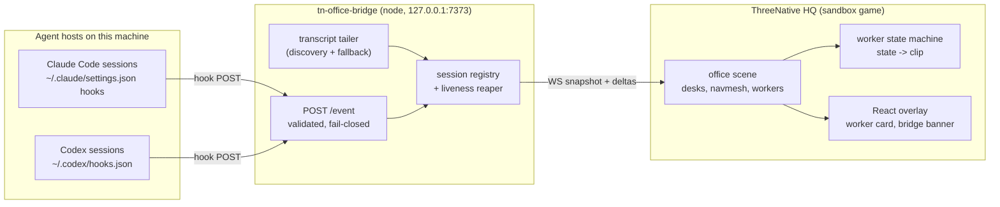
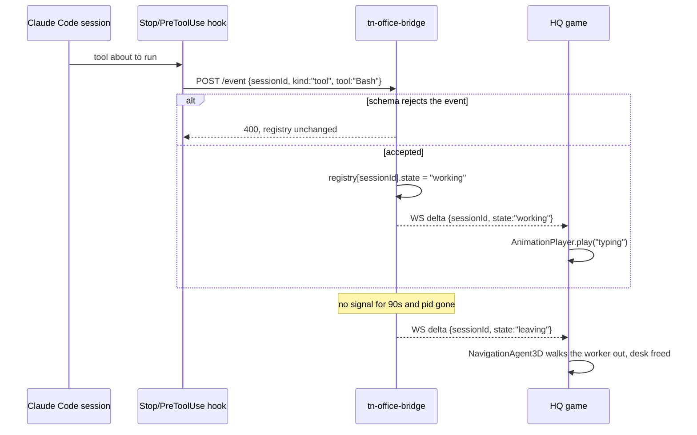

# PRD-313 — ThreeNative HQ: the office population *is* this machine's agent load

**Status:** PHASES 0–5 COMPLETE, 2026-08-31, in `sandbox/threenative-hq` (`dc84ec8`, pushed to
`ThreeNativeHQ/examples`). Three proof lanes green in one `pnpm test`. Evidence:
[docs/verification/prd313-threenative-hq-2026-08-31.md](../../verification/prd313-threenative-hq-2026-08-31.md).
Two engine bugs the game found are fixed in `d114c509`. Open: inbound messaging and the native
target, both listed as out of scope below.

**Outcome:** a sandbox game at `/home/joao/projects/threenative/sandbox/threenative-hq` that renders
an office in which **every worker at a desk is a live Claude Code or Codex session on this machine**.
A session starts, a worker walks in and sits down. The model is generating, the worker types. The
session is waiting on a permission prompt, the worker stands up and waves. The session ends, the
worker leaves and the desk frees. Clicking a worker shows what that session is doing, in that
session's own words.

It is a game, not a dashboard: it is built in a clean sandbox, installed from tarballs like a user's
machine, and every friction it hits against the framework is logged as engine work.

**Depends on:** nothing. Deliberately **not** on `PRD-295` (Fab → ThreeNative assets) — see §2.3.

**Complexity: 8 → HIGH mode.** +3 (10+ files), +2 (new system from scratch: the bridge daemon),
+2 (concurrent session state, liveness, reconnection), +1 (external integration: two agent hosts'
hook systems).

---

## 1. Context

**Problem:** several agent sessions run on this machine at once — three Codex processes and two
Claude Code processes were live while this PRD was written — and the only view of them is a pile of
terminal tabs. Nothing shows how many are running, which are stuck waiting on a human, and which
have gone quiet. Meanwhile the framework's own thesis is that *agents build the games*; it has no
artifact that makes that visible.

**Files and sources analysed:**

| What | Where | What it told us |
| --- | --- | --- |
| Capability manifest | `packages/create-threenative/capabilities.json` (214 entries) | `AnimationPlayer`, `attachToBone`, `skeletonBones`, `GroundSnap`, `normaliseToMetres`, `createAssetLoader`, `NavigationAgent3D`, `NavigationRegion3D`, `recast`, `PointerEvents3D`, `Scheduler`, `Billboard3D`, `InstancedBatch`, `ClusteredMesh`, `createReactOverlay` + `Text`/`View`, `GameCanvas`/`UiLayer`/`useGameState` all already exist |
| Fab importer | `threenative-asset-mcp` `src/unreal/importer.ts:927,944` | Exports **`StaticMesh` only**; skeletal packages are filtered out before export |
| Fab listing `ce136033…` | asset MCP `get_asset` | *Office Pack Vol.1*, CC-BY, 47 meshes, `allowsAiUse: true`, updated 2025-11-13 |
| Fab listing `b6377a19…` | asset MCP `get_asset` | *Office Worker 2 - Animated*, CC-BY, made in Ready Player Me and, in the seller's words, "rigged and animated in Mixamo" |
| Claude Code transcripts | `~/.claude/projects/<slugged-cwd>/<uuid>.jsonl` | Per-session JSONL; carries `sessionId`, `mode`, `permission-mode`, hook records |
| Codex transcripts | `~/.codex/sessions/YYYY/MM/DD/rollout-<ts>-<uuid>.jsonl` | First record is `session_meta` with `session_id`, `cwd`, `cli_version`, `originator`, `model_provider` |
| Claude Code hooks | `~/.claude/settings.json` | Already has a `Stop` hook running `count_tokens.js` — **must be merged, never replaced** |
| Codex hooks | `~/.codex/config.toml` `[hooks.state]`, `~/.codex/hooks.json` | Live events: `session_start`, `user_prompt_submit`, `post_tool_use`, `stop`, `permission_request` |
| tmux | `tmux ls` | Installed, **no server running** — an inbound "type into the session's pane" route does not exist by default on this machine |
| Prior Fab proof | `sandbox/fab-import-proof/assets/fab/soul-cave/` | The Fab → GLB path already produced usable static meshes in a sandbox game |

**Current behaviour:**

- Session state is visible only in the terminal that owns it.
- The asset MCP can turn a Fab environment pack into GLBs; it cannot turn a Fab character into an
  animated GLB.
- Nothing in the framework or the sandbox reads agent-session state; there is no incumbent to
  replace. This is genuinely new behaviour.

---

## 2. Solution

### 2.1 Approach

- A **bridge daemon** (`tools/office-bridge/`, inside the game, Node) is the only thing that touches
  the filesystem and the hosts. It owns one truth: the set of live sessions and each one's state.
- Sessions reach it **two ways, and the cheap one is authoritative**: host hooks `POST` events to
  `http://127.0.0.1:7373/event` (fast, semantic), and a second lane discovers the sessions that
  never installed a hook.

  **Corrected during implementation:** that second lane was specified as a transcript tailer over
  `~/.claude/projects/**/*.jsonl` and `~/.codex/sessions/**/*.jsonl`, keyed on modification time.
  On the machine this was built for that reported **606 live sessions** — 4,413 transcripts, May's
  included, had been touched inside one minute. Liveness now comes from the **process table**: a
  live session is a live process, `/proc/<pid>/cwd` names the repository, and CPU time between two
  scans says whether it is doing anything. The transcript lane remains as the fallback for a host
  without a readable `/proc`, and every session says which lane produced it.
- The game connects over **WebSocket** (`ws://127.0.0.1:7373/office`), receives one full snapshot on
  connect and deltas after. WebSocket over polling because arrival/departure should look immediate,
  and over an in-browser file watcher because a browser cannot read `~/.claude` and a native build
  never could.
- Each live session gets **one desk and one worker**. The worker's animation clip is a pure function
  of the session's state; nothing in the render layer decides state and nothing in the state layer
  decides looks.
- v1 is **read-only**. Talking back to a session is named in §7 and deferred to its own PRD, because
  it needs a per-host inbound adapter and this machine has no tmux server to send keys to.

### 2.2 Architecture

### 2.3 Key decisions

- [ ] **The character is rebuilt, not imported.** The Fab importer is `StaticMesh`-only, and the Fab
      character is itself a Ready Player Me avatar with Mixamo clips. The game uses an RPM avatar GLB
      plus Mixamo clips on the same `mixamorig:` skeleton — free, no Fab entitlement, no engine
      change, and identical in the ways that matter. Adding skeletal export to the importer is real
      engine value and is filed separately (§7); this PRD does not block on it.
- [ ] **Office props: Fab first, procedural fallback always present.** `Office Pack Vol.1` imports
      through the existing path. The sandbox repo is **public**, so the raw Fab GLBs are
      `.gitignore`d until the CC-BY redistribution terms are checked, and the scene falls back to
      procedurally built desks so the committed game runs for anyone who clones it. A `CREDITS.md`
      carries the CC-BY attribution either way.
- [ ] **The bridge is game-owned, not engine-owned.** It reads `~/.claude` and spawns nothing; it is
      a dev-machine daemon, not framework plumbing. It moves into `packages/` only if a second game
      needs it (sandbox `AGENTS.md` rule 3).
- [ ] **Fail closed everywhere.** Unknown event kind → `400`, registry unchanged. Malformed
      transcript line → skipped and counted, never guessed. A session with no signal for 90 s **and**
      no live pid → the worker leaves. A worker that types forever because the bridge went quiet is
      exactly the false green this repository exists to prevent.
- [ ] **No new vocabulary.** Godot names for the nodes (`NavigationAgent3D`, `AnimationPlayer`),
      Three.js for rendering, camelCase throughout.

**Data changes:** none in the engine. One new wire schema, `SessionEvent` / `OfficeSnapshot`, owned
by the game at `tools/office-bridge/protocol.ts` and imported by both the daemon and the game so the
two sides cannot drift.

### 2.4 Session state → worker behaviour

| Host signal | Session state | Worker | Clip |
| --- | --- | --- | --- |
| `SessionStart` / `session_start`, or a transcript file appearing | `arriving` | walks from the lift to a free desk, sits | `walk` → `sit-idle` |
| `UserPromptSubmit`, assistant text streaming | `thinking` | leans toward the monitor | `typing-slow` |
| `PreToolUse` / `post_tool_use` | `working` | types | `typing` |
| `Notification` / `permission_request` | `blocked` | stands, waves toward the camera | `wave` |
| `Stop` / `stop`, then quiet | `idle` | leans back, coffee | `coffee` |
| `SessionEnd`, or reaped by liveness | `leaving` | walks to the exit, desk frees | `walk` |

### 2.5 Sequence

---

## 3. Integration Ledger

| # | New thing | Live caller (`file:line`, non-test) | Replaces | Old path removed? | Negative control |
|---|---|---|---|---|---|
| 1 | `tools/office-bridge/server.ts` | `tools/office-bridge/bin.mjs` (the `pnpm office` script) | nothing — new behaviour | n/a | port occupied → exits non-zero with the port named, never silently binds elsewhere |
| 2 | `OfficeSnapshot` / `SessionEvent` schema | imported by `server.ts` **and** `src/office/bridge-client.ts` | nothing | n/a | a field renamed on one side fails the shared-schema test |
| 3 | `src/office/bridge-client.ts` (WS client) | `src/game.ts` (scene setup) | nothing | n/a | daemon killed → banner reads `bridge offline`, worker count drops to 0 |
| 4 | `src/office/worker.ts` (state → clip) | `src/scenes/office.ts` per-session spawn | nothing | n/a | forcing every state to `idle` makes the clip assertion red |
| 5 | `src/office/desks.ts` (desk allocation) | `src/scenes/office.ts` | nothing | n/a | two sessions assigned one desk fails the overlap assertion |
| 6 | Claude hook script `tools/hooks/office-event.mjs` | `~/.claude/settings.json` `PreToolUse`/`Stop`/`SessionStart` entries (merged beside the existing `count_tokens.js`) | nothing | n/a | hook removed → the session only appears via the slower tailer, and the latency gate goes red |
| 7 | Codex hook entry | `~/.codex/hooks.json` | nothing | n/a | same |
| 8 | `playtests/office.playtest.json` | `pnpm test:playtest` in the game | nothing | n/a | fixture with zero sessions must fail the "a worker is at a desk" assertion |

**Reachability**

- Entry point: `pnpm office` (daemon) + the game's dev server; in the game, the frame loop and the
  WS message handler.
- Pre-existing files edited: the scaffolded `src/game.ts`, `src/main.ts`, `src/scenes/*`,
  `package.json`, and `~/.claude/settings.json`.
- User-facing: yes — the React overlay (worker card, bridge banner, session count).
- Full flow: a session runs a tool → its hook POSTs → the bridge updates the registry → the WS delta
  reaches the game → that worker's `AnimationPlayer` switches clip → visible on screen and in the
  playtest capture.
- Replaces: nothing. No prior code on this machine reads agent-session state.

---

## 4. Execution phases

Each phase ends with a `prd-work-reviewer` checkpoint carrying the integration audit. Phases 1–5 are
visual, so each also carries a manual checkpoint: a screenshot pasted into the verification record.

#### Phase 0: Sandbox and assets — a rigged worker moves on screen

**Files (max 5):**

- `sandbox/threenative-hq/` — NEW: scaffolded via `pnpm sandbox` (tarball install, no workspace link)
- `src/game.ts` — EDIT (scaffolded): loads the avatar GLB through `ctx.assets`
- `src/scenes/office.ts` — NEW: one desk, one worker, `GroundSnap` + `normaliseToMetres`
- `public/assets/worker/*.glb`, `CREDITS.md` — NEW: RPM avatar + Mixamo clips, attribution
- `playtests/worker-clip.playtest.json` — NEW

**Proof subject:** the **full clip set** (`typing`, `sit-idle`, `wave`, `coffee`, `walk`) on the RPM
rig, not one clip. A single-clip proof would hide exactly the failure this phase exists to find —
Mixamo bind-pose and scale mismatch on a Ready Player Me skeleton.

**Wiring:** `src/game.ts` constructs the office scene; `skeletonBones` output is pasted into the
record so the `mixamorig:` naming is evidence, not assumption.

**Tests:** `worker-clip.playtest.json` asserts the worker's bone hierarchy is non-empty, the named
clip is playing, and the capture is not blank (`assertCaptureNotBlank`).
**Negative control:** rename the clip in the manifest → the playtest goes red rather than silently
playing the rest pose.

**User verification:** open the dev server; the worker sits at the desk and types. Screenshot.

---

#### Phase 1: The bridge sees this machine's real sessions

**Files:** `tools/office-bridge/protocol.ts`, `server.ts`, `tailer.ts` (NEW), `package.json` (EDIT:
`pnpm office`), `tools/office-bridge/__tests__/tailer.spec.ts` (NEW)

**Implementation:** tail both transcript roots; parse Codex `session_meta` for `session_id`/`cwd`;
derive Claude sessions from the file path plus `sessionId` records; liveness by mtime **and** pid;
serve `GET /sessions`.

**Wiring:** `pnpm office` runs the daemon. **Negative control:** point the tailer at an empty
directory → `/sessions` returns `[]` and the phase's own gate fails, proving the gate reads real
data.

**Tests:** parser fixtures for both hosts (including a truncated final line — transcripts are
appended to live); a malformed line is counted and skipped, never guessed.

**User verification:** `pnpm office` then `curl -s localhost:7373/sessions | jq length` while several
sessions run; the number matches `ps` and is pasted into the record.

---

#### Phase 2: The office is populated by real sessions

**Files:** `src/office/bridge-client.ts` (NEW), `src/office/desks.ts` (NEW), `src/scenes/office.ts`
(EDIT), `src/ui/office-hud.tsx` (NEW), `playtests/office.playtest.json` (NEW)

**Implementation:** WS snapshot + deltas; one desk per session; `bridge offline` banner when the
socket is down; reconnect with backoff.

**Tests:** playtest against a **fixture bridge** (deterministic): 3 sessions in → 3 workers at 3
distinct desks; 1 session out → 2 workers, desk freed.
**Negative control:** kill the daemon mid-scenario → banner appears and the "worker at desk"
assertion goes red; a zero-session fixture must fail the same assertion.

**User verification:** open the game with real sessions running; the worker count equals
`/sessions`. Screenshot with the count visible.

---

#### Phase 3: State changes are legible without reading text

**Files:** `src/office/worker.ts` (NEW), `src/scenes/office.ts` (EDIT), `src/office/bridge-client.ts`
(EDIT), `playtests/worker-states.playtest.json` (NEW), `src/office/__tests__/worker.spec.ts` (NEW)

**Implementation:** the §2.4 table as a pure function; `AnimationPlayer` cross-fades; `Scheduler`
owns the idle timer.

**Tests:** every row of §2.4 asserted from a fixture-driven state change to the named clip.
**Negative control:** collapse the mapping to a constant → the table test goes red on five of six
rows. **Revert check:** delete `worker.ts` and the office scene fails to build — the clip choice has
no second home.

**User verification:** trigger a permission prompt in a live session; that worker stands and waves.

---

#### Phase 4: Arrivals and departures are walked, not teleported

**Files:** `src/scenes/office.ts` (EDIT), `src/office/desks.ts` (EDIT), `threenative.config.ts`
(EDIT: `recast`), `playtests/arrival.playtest.json` (NEW), `public/assets/office/*` (Fab props or
procedural fallback)

**Implementation:** `NavigationRegion3D` bakes the office floor; `NavigationAgent3D` walks a worker
from the lift to its desk and back out; `GroundSnap` keeps feet on the floor across both.

**Tests:** a new session in the fixture makes a worker traverse >2 m before sitting; a removed
session makes it reach the exit and free the desk.
**Negative control:** remove the navmesh bake → the agent cannot path and the arrival assertion goes
red (not a worker sliding through a wall).

**User verification:** start a new Claude session; a worker walks in.

---

#### Phase 5: Clicking a worker says what that session is doing

**Files:** `src/ui/worker-card.tsx` (NEW), `src/office/bridge-client.ts` (EDIT: last prompt/tool),
`tools/office-bridge/server.ts` (EDIT: redaction), `src/scenes/office.ts` (EDIT: `PointerEvents3D`),
`playtests/inspect.playtest.json` (NEW)

**Implementation:** `PointerEvents3D` picks the worker; the card shows host, model, cwd, state, last
tool, and how long it has been in that state. **The bridge redacts prompt bodies by default** —
session transcripts are the user's private working material, and the office is a wall display.

**Tests:** clicking the worker opens the card with that session's id; the redaction test asserts no
prompt text crosses the wire unless `OFFICE_SHOW_PROMPTS=1`.
**Negative control:** set the flag and assert the text does appear — proving the redaction path is
the thing being exercised, not an empty field.

**User verification:** click a worker; the card names the repo that session is in.

---

## 5. Verification strategy

**The gate is the fixture-driven playtest; the evidence is the live machine.** Both are required and
neither substitutes for the other:

1. `pnpm test:playtest` in the game — deterministic, fixture bridge, runs in CI-shaped conditions.
2. A live run with real sessions, worker count compared against `curl /sessions | jq length` and
   `ps`, screenshot committed to `docs/verification/`.

Traps this repository has already paid for, and how this PRD avoids them:

- **The runner must provision its own Xvfb** — never call `xvfb-run`.
- **A WebGPU run that does not name its adapter may be SwiftShader** — `--browser-recipe webgpu`,
  and `adapter.info` pasted.
- **Long `holdTicks` steps starve GPU readback** — arrival/walk scenarios are split into short steps
  plus a settle tail.
- **Sandbox tarballs install by constant filename** — every reinstall renames the tarball with a
  content hash and the installed bytes are verified before any regression is believed.
- **A green gate that never went red is UNVERIFIED**, not PASS. Every row above names its red.

---

## 6. Acceptance criteria

Consumer-scoped, all of them:

- [ ] With three agent sessions running on this machine, the office shows **three** workers at three
      distinct desks, and the count matches `ps` in the same minute.
- [ ] Starting a fourth session makes a fourth worker **walk in and sit down** without a reload.
- [ ] Ending a session makes its worker walk out and frees the desk within 5 s.
- [ ] A session waiting on a permission prompt is distinguishable **from across the room** — the
      worker is standing and waving while the others sit.
- [ ] Killing the bridge daemon leaves the game up with an explicit `bridge offline` banner, and no
      worker still typing.
- [ ] A malformed event is rejected with `400` and changes no worker on screen.
- [ ] Clicking any worker names the repository that session is working in.
- [ ] The committed repo runs for someone who has neither the Fab pack nor a Fab account (procedural
      fallback), with `CREDITS.md` carrying attribution for whatever is present.
- [ ] Every friction hit while building this is in the game's `FRICTION.md` with an evidence path.

**Integration gates:** ledger has zero `TBD`; every new symbol has a non-test caller; deleting
`worker.ts` or `bridge-client.ts` breaks the office scene build; every gate has an observed red.

---

## 7. Explicitly out of scope (each becomes its own PRD)

1. **Talking back to a session.** Outbound is solved; inbound is not. There is no supported external
   API for injecting a message into a live Claude Code or Codex session, and `tmux ls` on this
   machine reports **no server running**, so the send-keys route does not exist by default. The
   candidate mechanism is a mailbox file plus a `Stop`/`UserPromptSubmit` hook that injects pending
   text back into the session, proven end-to-end against a live session before anything is claimed.
2. **Skeletal mesh and animation export in the Fab importer** (`importer.ts:927,944`). This is the
   change that would let the actual *Office Worker 2 - Animated* listing — and every other rigged Fab
   character — reach a ThreeNative game.
3. **Native target.** v1 is browser-only against `127.0.0.1`. A feature that works on web only is
   unfinished; a native HQ build is a follow-up with a `--target desktop` playtest.
4. **Lifting the bridge into `packages/`.** Only once a second game needs it.
5. **Subagents as extra workers** at the same pod, and cloud sessions as remote workers on a screen.
