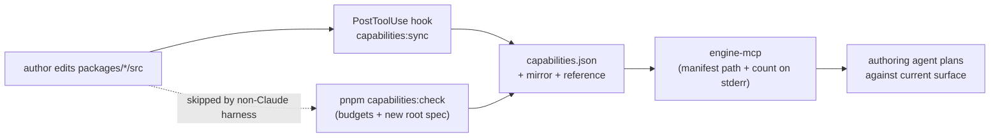

# PRD-324 — The capability manifest cannot forget an export between two `budgets` runs

**Status:** PROPOSED (scoping complete, measured on `HEAD` 2026-09-01)
**Complexity:** 3 (10+ files) + 2 (multi-package) + 2 (new module: the session hook) = **7 → HIGH mode**
**Owner:** unassigned
**Predecessors:** PRD-187 (built the search mechanism; proved prose lists fail at authoring time);
[ORIGIN-authoring-discoverability-2026-08-31](../authoring/ORIGIN-authoring-discoverability-2026-08-31.md)
and PRD-297/298/299/300/301 (recall quality — see §1f for the division of labour)

---

## 1. Findings first — what the investigation established

The question that opened this PRD was *"besides adding an instruction, how do we make agents
discover capabilities during planning?"*. The investigation found the **consumption side is
already fully layered** and the real defect is on the **authoring side**: an export added to
`packages/` can be absent from `capabilities.json` — and nothing the author runs in the normal
loop will tell them.

### 1a. The discovery stack already ships (no new instructions needed)

| Layer | Where | Evidence |
| --- | --- | --- |
| MCP server instructions at `initialize` | `packages/engine-mcp/src/index.ts:90-91,377` | the `AUTHORING_INSTRUCTIONS` block every connected host injects |
| Tool descriptions on both tools | `packages/engine-mcp/src/index.ts:283-284,303-304` | decompose-then-search guidance is on the tool itself |
| Template rule #1, "Critical planning gate" | all 8 templates (`templates/starter/AGENTS.md:13-15` and seven siblings) | invoke `threenative-capabilities` before `prd-creator` |
| Skills shipped into every generated project (dual adapter) | `packages/create-threenative/agent-files/.claude/skills/threenative-capabilities/SKILL.md` + `.agents/` mirror | copied verbatim by the scaffolder (`create-threenative/src/index.ts:333-340`) |
| MCP-free fallback reference | `agent-docs/capability-reference.md` in every generated project | named by the skill for the "MCP unavailable" path |
| `.mcp.json` written by core's postinstall | `packages/core/mcp/install.mjs`, `MCP_HOSTS` list | freshness of the host list is budgeted (`scripts/sync-mcp-configs.ts --check` in `pnpm budgets`) |
| Root charter | `/AGENTS.md` "How you work" rule 1 | ask the manifest before writing a system |

Per PRD-187's own measurement, more prose on top of this changes nothing. **This PRD adds no new
instruction text.**

### 1b. The manifest is already generated — the "auto sync" exists and is incomplete

`scripts/build-capability-manifest.ts` AST-walks every public package's export map, reads JSDoc
`@situation` / `@example` / `@constraint` / `@override` / `@supersedes` tags off each exported
class or function, and writes the manifest (254 entries) to
`packages/create-threenative/capabilities.json` plus a mirror in `packages/core/capabilities.json`
(`build-capability-manifest.ts:563-571`). A targeted regen exists: `pnpm capabilities:sync`.

Freshness against the real tree is checked by `checkCapabilityManifest` — but look at where it
runs:

- `pnpm budgets` → `pnpm capabilities:check` + `check-capability-docs --census` +
  `sync-mcp-configs --check` — **budgets only**.
- `pnpm typecheck && pnpm lint && pnpm test` — the loop the root charter mandates before calling
  a change done — runs **none** of them. The suite's manifest tests
  (`scripts/__tests__/capability-manifest.spec.ts`) exercise the mechanism on synthetic fixture
  roots, not this checkout.

So the staleness gate lives in a lane the authoring loop does not walk. An export added, tested,
and committed in a session that runs the mandated three gates lands with a stale manifest, and the
first thing that notices is CI — or nothing, until an authoring agent plans against a manifest
that predates the export.

### 1c. Two export shapes are invisible to *both* scanners, silently

`classifyDeclaration` (`build-capability-manifest.ts:298-311`) only admits exported classes and
functions (arrow or function-expression initializers). The census scanner filters to
"class/function" the same way. Consequences, measured on this checkout:

1. **Exported const objects are dropped with no decision recorded.** Six live instances, none in
   `INTERNAL_ALLOWLIST` (which holds exactly one entry) and none in the manifest (grep counts, all
   0): `UI_BRIDGE_GLOBALS` (`packages/core/src/ui-bridge.ts:79`), `RENDER_CHAIN_TIERS`
   (`packages/core/src/render/chain.ts:69`), `PLAYTEST_PROTOCOL_LIMITS`
   (`packages/playtest/src/protocol.ts:33`), `PLAYTEST_FLAGS`
   (`packages/playtest/src/runner/config.ts:58`), `CAPTURE_GUARD_LIMITS`
   (`packages/playtest/src/capture.ts:3`), `RESOLUTION_SCALER`
   (`packages/core/src/resolution-scaler.ts:20`).
2. **`export * as ns from …` is dropped silently** (falls through the
   `!ts.isNamedExports` guard at `build-capability-manifest.ts:350`). Zero instances exist today —
   latent, not live — but nothing would stop the first one from landing unnoticed.

This contradicts the tree's own charter: the manifest file's header says every exported class and
function is a discoverable capability, and `check-capability-docs.ts:50-52` says a public package
"cannot disappear from the manifest without a reason". An export *shape* has no such rule today.

### 1d. A live MCP server never re-reads the manifest

`runServer` loads the manifest once before accepting requests
(`packages/engine-mcp/src/index.ts:396-399`) — correct fail-closed design, but it means even a
regenerated manifest does not reach a session that is already running, and nothing on startup says
*which* manifest file was loaded. When a stale-manifest symptom is being diagnosed, nobody can ask
the running server what it is serving.

### 1e. Census baseline (pasted)

```text
$ npx tsx scripts/check-capability-docs.ts --census
capability package census: 7 walked, 3 allowlisted, 9 public packages with code exports
capability docs: 228 public class/function exports carry complete doc tags
```

```text
$ time npx tsx scripts/build-capability-manifest.ts --check
capability manifest fresh: 254 entries at .../packages/create-threenative/capabilities.json
        1.58s total
```

The check costs ~1.6 s on this checkout — cheap enough for `pnpm test`.

### 1f. Prior art — the authoring batch owns recall quality; this PRD owns currency

The [ORIGIN note](../authoring/ORIGIN-authoring-discoverability-2026-08-31.md) and PRD-297
(recall is a measured number), PRD-298 (search fails closed), PRD-299 (decomposition index),
PRD-300 (vocabulary expansion) and PRD-301 (manifest covers every shipped package) attack a
different half of the problem: when an agent *does* search, the results are right. Their measured
baseline (11/46 mechanics return zero) is a search-quality record; none of those PRDs changes
*when* or *whether* the manifest is regenerated. PRD-324 is complementary and ordered after them
in outcome, independent of them in code: a recall number measured against a stale manifest is
still a number for the wrong engine. One proof the currency gap is live: the ORIGIN baseline
records "`@threenative/assets` has zero manifest entries"; today's manifest carries 11 entries for
that package — the investigation docs themselves drift when nothing regenerates them. PRD-301's
coverage intent is executed here for the shapes both scanners skip (Phase 2), and its
package-level census is already enforced by `check-capability-docs.ts --census`.

Two sweep findings recorded for the next lane, not this one: no PRD covers the launch-directory
trap (a session started in a parent of the game directory never registers the MCP servers, and
`doctor` checks file contents, not whether the running session loaded them); and no hook or
SessionStart automation exists anywhere in the templates or core — confirming Phase 3 lands the
first one.

---

## 2. Approach

Four small, independently shippable phases. No new prose instructions; every mechanism is code
that fails loudly.

1. **Move freshness into the mandated loop** — a root-suite spec proves the committed manifest
   byte-matches a fresh generation *of this repository*, and the failure names the changed
   entries, not just "stale".
2. **Make every named export shape a decision** — the census extends to exported const objects
   (and the latent `export * as` shape gets a fixture test); each of the six live symbols ends in
   a manifest entry or an allowlist reason, never silence.
3. **The authoring session syncs the manifest itself** — a Claude Code `PostToolUse` hook in this
   repository regenerates the manifest (and the derived reference pages) after edits under
   `packages/*/src/`, and reports a generation failure back into the conversation. Other harnesses
   keep the existing prose rule; the hook is additive.
4. **A running session can name what it serves** — the engine MCP server prints its resolved
   manifest path and entry count on stderr at startup.



**Key decisions:**

- Freshness in `pnpm test`, not a new gate script — the root suite is the loop every agent already
  runs; 1.6 s is noise.
- The hook **writes** (auto-sync, as asked) and only speaks on failure — a silent success is the
  default; exit code 2 surfaces the generator's `@situation` demand at the moment of authoring.
- Const objects are *decided*, not defaulted: the PRD does not presume which of the six are
  game-authoring capabilities; it only outlaws "absent and unexplained".
- Error-handling strategy: fail closed, unchanged from the house rule — the generator already
  throws on missing tags; the new spec and hook only shorten the path from throw to author.

**Data changes:** none. Generated artifacts (`capabilities.json`, mirror, reference) are outputs,
already committed.

---

## 3. Integration Ledger

| # | New thing | Live caller (`file:line`, filled at implementation) | Replaces | Old path removed? | Negative control |
|---|-----------|-----------------------------------------------------|----------|-------------------|------------------|
| 1 | `describeManifestStaleness(root)` in `build-capability-manifest.ts` | the new freshness spec, and `checkCapabilityManifest`'s error path | the bare "stale; run pnpm build" message | superseded in place | hand-edit one entry in `capabilities.json` → `pnpm test` red naming that entry |
| 2 | freshness spec in `scripts/__tests__/` | root vitest suite (auto-collected) | nothing — closes a budget-only gap | n/a | revert the spec → stale manifest again passes `pnpm test` |
| 3 | census const-object coverage in `check-capability-docs.ts` | `pnpm budgets` census step | the class/function-only filter (shared blind spot) | narrowed, not removed | fixture exporting `export const X = {}` without tags/allowlist → census red |
| 4 | `.claude/hooks/capability-sync.mjs` + `.claude/settings.json` PostToolUse entry | Claude Code harness after every Edit/Write under `packages/*/src/` | nothing — additive to prose rule | prose rule stays for other harnesses | add an export without `@situation` → hook exit 2, message in-session |
| 5 | startup stderr line in `packages/engine-mcp/src/index.ts` | `runServer` at every server launch | nothing | n/a | point `THREENATIVE_CAPABILITIES_MANIFEST` at a bad file → line names it before exit 1 |

---

## 4. Reachability

**How is this reached?**
- Entry points: every `pnpm test` run (spec #1); every `pnpm budgets` run (census, already live);
  every Claude Code session in this repository (hook, #4); every MCP session start (stderr, #5).
- Pre-existing files edited: `scripts/build-capability-manifest.ts` (P1), `scripts/check-capability-docs.ts` + `scripts/check-capability-docs.spec.ts` (P2), `/AGENTS.md` via `pnpm sync:agents` (P3), `packages/engine-mcp/src/index.ts` (P4).

**Is this user-facing?** Internal — the "user" is every agent or human that authors engine
exports; the observable is red gates and an in-session hook message, not UI.

**Full flow:** agent adds `export function foo()` in `packages/core/src` → PostToolUse hook runs
`pnpm capabilities:sync` → manifest regenerated (or generation throws on the missing `@situation`
and the agent sees it mid-session) → the *next* authoring session in any game plans against the
export. If the hook never ran (other harness, hook disabled), `pnpm test` is red instead of CI.

**What does this replace?** Nothing — every existing path (budgets checks, prose rules) stays.

---

## 5. Phases

#### Phase 1: `pnpm test` goes red when the manifest is stale

**Files (max 5):**
- `scripts/build-capability-manifest.ts` — EDIT: export `describeManifestStaleness(root)` that returns the added/removed/changed entries between a fresh build and the committed file; `checkCapabilityManifest` reuses it in its error message
- `scripts/__tests__/capability-manifest-fresh.spec.ts` — NEW: runs the real-tree check (root = repo root), asserts byte-freshness, and asserts `describeManifestStaleness` names a planted difference on a temp fixture

**Tests Required:**

| Test File | Test Name | Assertion | Negative control (observed red) |
|-----------|-----------|-----------|---------------------------------|
| `capability-manifest-fresh.spec.ts` | `should fail when the committed manifest predates the tree` | temp fixture: build → commit → add export → expect mismatch with named symbol | the fixture's committed manifest passes until the new export exists |
| same | `should pass when the manifest is fresh` | real-root check returns empty staleness | hand-edit `capabilities.json` → red |

**Revert check:** delete the spec → a hand-staled manifest again passes `typecheck && lint && test` (verify once by staling a fixture commit on a throwaway worktree).

**User verification:** edit `capabilities.json` by one character; `pnpm test` fails naming the edit; `pnpm capabilities:sync` repairs it; `pnpm test` green.

#### Phase 2: An exported const object cannot be silent

**Files (max 5):**
- `scripts/check-capability-docs.ts` — EDIT: census walk admits named exported `const` object declarations; gaps reported unless covered by `INTERNAL_ALLOWLIST`
- `scripts/check-capability-docs.spec.ts` — EDIT: fixture proves the new shape
- the six source files from §1c — EDIT: per-symbol verdict (doc tags on the ones games consume, allowlist entries with reasons on the plumbing)

**Decision table (owner call, defaults proposed):**

| Symbol | Proposed verdict |
|---|---|
| `RENDER_CHAIN_TIERS` | capability — tier vocabulary games read (PRD-322 adjacent) |
| `RESOLUTION_SCALER` | capability — games tune it |
| `UI_BRIDGE_GLOBALS` | allowlist — internal global names |
| `PLAYTEST_PROTOCOL_LIMITS` | allowlist — harness internals |
| `PLAYTEST_FLAGS` | capability — CI authors consume it |
| `CAPTURE_GUARD_LIMITS` | allowlist — harness internals |

**Tests Required:** census fixture with an undocumented `export const X = {}` → red; the six symbols all covered after the verdicts → green.

**Negative control:** before the fix, the fixture shape produces no census output (paste it); after, red.

#### Phase 3: The session that adds the export syncs the manifest itself

**Files (max 5):**
- `.claude/hooks/capability-sync.mjs` — NEW: reads hook stdin JSON, filters to `packages/*/src/**` edits, runs `pnpm capabilities:sync` (the pre-existing script is the caller); exit 0 silent on success, exit 2 with the generator's message on failure
- `.claude/settings.json` — NEW: `PostToolUse` matcher `Edit|Write|MultiEdit` → the hook
- `/AGENTS.md` — EDIT: one line in Verification naming the hook and its off-switch; then `pnpm sync:agents`

**Wiring:** the hook's only engine-facing action is invoking the pre-existing `capabilities:sync` script — no second implementation of regeneration.

**Tests Required:** the hook script's filter and exit-code logic as a unit spec (`scripts/__tests__/capability-sync-hook.spec.ts`) with a synthetic stdin payload; paste the measured hook latency (target < the `capabilities:sync` chain's own ~2 s).

**Negative control:** temporarily add a tag-less export, write a scratch edit under `packages/core/src/`, observe exit 2 text in-session; restore. Also confirm `git status` is clean after a doc-only edit (hook must not run).

**Revert check:** remove the hook → phase 1's spec still catches staleness at test time; nothing pre-existing breaks.

#### Phase 4: A running session can name the manifest it serves

**Files (max 5):**
- `packages/engine-mcp/src/index.ts` — EDIT: `runServer` writes one stderr line: resolved manifest path + entry count, before the loop starts
- `packages/engine-mcp/__tests__/*.spec.ts` — EDIT: assert the line content on a fixture manifest

**Negative control:** bad `THREENATIVE_CAPABILITIES_MANIFEST` → the line names the file, then the existing fail-closed exit 1.

---

## 6. Verification (whole PRD)

- [ ] `pnpm typecheck && pnpm lint && pnpm test` green with all four phases landed (paste output)
- [ ] `pnpm budgets` green (paste output)
- [ ] Negative controls from every phase observed red and pasted (§5 per-phase)
- [ ] Staleness red observed through `pnpm test` alone, with budgets not run (paste)
- [ ] Hook latency measured and pasted; hook silent on non-package edits (paste)
- [ ] The six const symbols each have either a manifest entry or an allowlist reason (paste census output post-change)
- [ ] No `AGENTS.md`/`CLAUDE.md` instruction text added except the single Verification-section line (instruction-budget gate green)

**Out of scope, named:** behavioral measurement of discovery rate — that is PRD-297's instrument
(plus the self-improvement loop's sealed-brief arms); this PRD only guarantees the list being
planned against is current. Recall quality (situations that return zero, vocabulary, decomposition)
belongs to PRD-298/299/300. The launch-directory MCP trap gets its own PRD. `pnpm test` timing
must stay within noise; if the freshness spec measures slower than ~3 s, move it behind the same
suite but document the cost.
