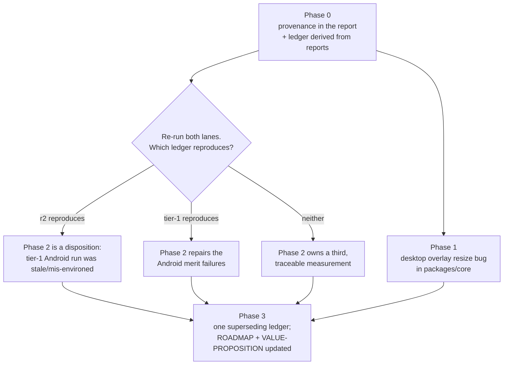

# PRD-076 — Tier 1 aggregate: reconcile two ledgers that cannot both be true, then hold one green run

**Status: PROPOSED, 2026-08-11. Nothing here is executed.** §1 and §2 are a read of two
tracked verification files and of `run-conformance.mjs` at the commit each was written
against. No new run has been performed for this document. No mobile-readiness claim, no iOS
claim, and no physical-hardware claim is made anywhere.

**The subject is not a failing test. It is two evidence files that disagree about the same
device on the same day, and a roadmap that cites both.** Beta rows 4 and 5 hinge on which
one is real, and today the project cannot say.

| Target | [`parity-2026-08-10-r2.md`](../../verification/parity-2026-08-10-r2.md) | [`tier-1-2026-08-10.md`](../../verification/tier-1-2026-08-10.md) |
|---|---|---|
| Browser | `67 / 0 / 0`, exit `0` | `67 / 0 / 0`, exit `0` |
| Desktop Linux | `66 / 0 / 1`, exit **`0`** | `65 / 1 / 1`, exit `1` |
| Android emulator (`emulator-5554`) | `67 / 0 / 0`, exit `0` | `27 / 40 / 0`, exit `1` |
| `25-camera-parented-overlay` on desktop | **passed** | **failed** — GPU validation, mismatched depth and colour attachment sizes after resize |

**One number in that table is impossible, and it is checkable without running anything.**
`reportExitCode` in `packages/runtime-native/conformance/run-conformance.mjs:1258` returns
`2` whenever `summary.blocked > 0`. It did so at `65a8836`, the commit that landed the r2
ledger. A desktop report of `66 / 0 / 1` therefore exits `2`, never `0`. The r2 desktop exit
column records a value the runner at that commit could not emit.

That single cell is why this PRD leads with provenance rather than with the Android gap. A
ledger whose numbers are transcribed by hand is not an instrument; it is a summary of one,
and a summary can drift from its source without anything going red. The repository's stated
worst failure is a check that reports green while asserting nothing. **A ledger that cannot
be traced back to the report it came from is that failure wearing a document's costume.**

**This PRD does not assume which ledger is right.** Phase 0 exists to determine it by
re-execution, not by preferring the later commit — and the later-committed file
(`c30783a`, 2026-08-11) is the *worse* result, so recency does not settle it either.

**Complexity: 8 → HIGH mode.** A report schema that does not carry enough provenance to
adjudicate between two runs; a hand-transcription step between report and ledger that no
gate checks; a desktop GPU-validation failure in the renderer's resize path; and an Android
result whose two measurements differ by 40 rows with no recorded cause.

**Blast radius (candidate, phase-gated).**
Phase 0: `packages/runtime-native/conformance/run-conformance.mjs`,
`packages/runtime-native/conformance/registry.json`,
`packages/runtime-native/tests/`, `scripts/` (one new ledger checker),
`docs/verification/`.
Phase 1: `packages/core/src/renderer.ts`, `packages/core/src/viewport.ts`.
Phase 2: named by Phase 0's Android finding and by nothing else.
Phase 3: `docs/verification/`, `docs/strategy/ROADMAP.md`,
`docs/strategy/VALUE-PROPOSITION.md`.
**No phase after 0 is authorised by this document alone.** Each needs a Phase 0 number first.

**Depends on:** [PRD-077](PRD-077-desktop-multitouch-injector.md) for the desktop
`90-multitouch-input` exclusion, which is the only remaining registry exclusion that keeps
the desktop lane from being an unqualified aggregate. This PRD can reach green *with* that
exclusion standing; it cannot reach an unqualified beta row 4 without PRD-077.
**Unblocks:** beta bar rows 4 and 5, and the Tier 1 licence sentence in `ROADMAP.md`.

---

## 1. Why this exists

The roadmap's beta row 4 reads *"Web/native parity is checkable, not asserted."* It is
currently neither. It is asserted twice, in two directions.

Three facts follow from the table above, and they set the phase order.

1. **The contradiction is not resolvable by reading.** Both files record the same host, the
   same emulator serial, and the same day. Neither records the tree commit it ran against,
   the reference-artifact hash it compared to, or the environment that differed. The r2
   Android command sets `ANDROID_SDK_ROOT` and `ANDROID_HOME` explicitly; the tier-1 Android
   command does not. That is a *candidate* cause and this PRD treats it as untested.
2. **The report does not carry its own provenance.** `writeReport`
   (`run-conformance.mjs:1253`) emits `schemaVersion`, `registrySchemaVersion`,
   `threeVersion`, `mode`, `target`, `summary` and `results`. It does not emit the commit,
   the runtime binary's hash, the reference-capture set's hash, or the environment keys the
   run depended on. Two reports can therefore disagree and nothing in either says which was
   stale.
3. **Nothing checks that a ledger matches a report.** The ledgers are markdown written by
   hand next to the runs. `packages/runtime-native/tests/tier-1-ledger.test.mjs` checks the
   tier-1 ledger's *schema*, which is why the impossible exit code in a *different* ledger
   passed every gate in the repository.

**Phase 0 is therefore the instrument, not the fix.** No repair in this document is
authorised until a run can be traced to a report, and a report to a tree.

## 2. What the code says, before any run

Read at commit `8c5fc40`. These are code facts, not measurements.

- `reportExitCode` (`run-conformance.mjs:1258`): `fail > 0` → `1`; `blocked > 0` → `2`;
  otherwise `0`. Verified identical at `65a8836` via `git show`.
- The desktop `90-multitouch-input` row is excluded by registry entry
  `desktop-multitouch-input`, owner `PRD-064`, reason *"the desktop lane has no native
  multitouch injector"* (`registry.json:42-51`). An excluded row is reported `blocked`, so a
  desktop run that is otherwise perfect exits `2` by construction. **That is the runner being
  right**, and it is why the desktop lane cannot show an unqualified exit `0` until PRD-077
  lands or the row is dispositioned.
- `validateReport` (`run-conformance.mjs:141`) already rejects a report that claims a pass on
  an excluded row (`:163-167`). PRD-064's `phase-2-excluded-pass` control observed that red.
  The validator is sound; the gap is upstream of it.
- `25-camera-parented-overlay` (`registry.json:315`) is `required: true`, `desktopGate: true`,
  tolerance `pixelMismatchRatio 0.015` / `perceptualDeltaE 4.0`. The tier-1 failure was **not**
  a tolerance breach — it was GPU validation on mismatched depth and colour attachment sizes
  after the renderer resize, which is an engine bug in the resize path, not a capture drift.

## 3. Solution

Four bullets, in phase order.

- **Make the report self-describing**, so any two reports can be ordered and adjudicated:
  commit, runtime-binary hash, reference-capture-set hash, and the environment keys the run
  read.
- **Make the ledger derived, not transcribed.** A markdown ledger is generated from named
  report files; a checker fails closed when a ledger's numbers do not match the reports it
  names. This is what makes the r2 exit-code cell impossible to write again.
- **Fix the desktop overlay resize bug** — an engine bug in `packages/core`, fixed in
  `packages/core`, never annotated around in the scene.
- **Attack the Android delta only after Phase 0 says it exists.** If the reconciliation shows
  `27/40` was a stale or mis-environed run, Phase 2 is a one-line disposition, not 40 repairs.



**Key decisions:**

- [ ] Provenance lives in the **report**, not in the ledger. A ledger is a view.
- [ ] The ledger checker is a repository script (`scripts/`), reachable from `pnpm budgets`'s
      neighbour set, not a one-off.
- [ ] The overlay fix is an **engine bug**: the renderer sizes its depth attachment, so the
      renderer fixes it. A scene-side workaround is rejected on sight.
- [ ] No ledger is deleted. The superseding ledger names both predecessors and says which
      cell was wrong.

**Data changes:** the conformance report gains a `provenance` object.
`REPORT_SCHEMA_VERSION` increments; `validateReport` requires the new object.

## 4. Integration Ledger

| # | New thing | Live caller (`file:line`, non-test) | Replaces | Old path removed? | Negative control |
|---|---|---|---|---|---|
| 1 | `provenance` block in the conformance report | `run-conformance.mjs` `buildReport` (~`:1165`) populates it; `writeReport` (`:1253`) emits it | untraceable reports | n/a — additive to a schema that had no answer | a report without `provenance` is rejected by `validateReport` |
| 2 | `validateReport` provenance requirement | `run-conformance.mjs:141`, already called on every run and by the `--validate` path (`:1330`) | TBD | n/a | delete `provenance.commit` from a real report → validator exits non-zero |
| 3 | `scripts/check-parity-ledger.ts` | `package.json` script `parity:ledger`; invoked by the Phase 3 run and by CI's `build → budgets` branch | hand-transcribed ledger numbers | the transcription step is deleted, not kept alongside | edit one digit in a ledger table → checker goes red naming the cell |
| 4 | Desktop overlay resize fix | `packages/core/src/renderer.ts` resize path, reached every frame after a viewport change | the current mismatched-attachment resize | replaced in-place | force a mid-run resize with the fix reverted → `25-camera-parented-overlay` fails GPU validation again |
| 5 | Superseding Tier 1 ledger | `docs/strategy/ROADMAP.md` beta rows 4–5 and Tier 1 table link it; `VALUE-PROPOSITION.md` axis 4 cites it | `tier-1-2026-08-10.md` **and** `parity-2026-08-10-r2.md` as the current record | both retained, both marked superseded with the wrong cell named | TBD |

**A test is not a caller.** Row 3's caller is the `pnpm parity:ledger` script entry and the
Phase 3 run that uses it, not `check-parity-ledger.spec.ts`.

### Reachability

**How is this reached?** `pnpm parity` (root `package.json:24`) on every conformance run,
and `pnpm parity:ledger` when an evidence file is written.
**Pre-existing files edited:** `run-conformance.mjs`, `registry.json`, root `package.json`,
`packages/core/src/renderer.ts`, `ROADMAP.md`, `VALUE-PROPOSITION.md`.
**User-facing?** No. Internal evidence integrity. The trigger is any parity run.
**What does it replace?** The hand-transcription step between a report and a ledger, and
the current renderer resize path.

## 5. Execution phases

### Phase 0 — Provenance, and the adjudication it makes possible

**Outcome:** a person can point at any parity number in `docs/verification/` and name the
report, the commit, and the reference set it came from — and the two 2026-08-10 ledgers are
resolved by re-execution.

**Files (max 5):**

- `packages/runtime-native/conformance/run-conformance.mjs` — EDIT: emit and require
  `provenance`; bump `REPORT_SCHEMA_VERSION`
- `scripts/check-parity-ledger.ts` — NEW: parse a ledger's target table, read the reports it
  names, fail closed on any mismatch or missing report
- `package.json` — EDIT: add `parity:ledger`
- `packages/runtime-native/tests/conformance-report.test.mjs` — EDIT: provenance contract
- `docs/verification/parity-reconciliation-2026-08-11.md` — NEW: the adjudication record

**Implementation:**

- [ ] `provenance`: `commit` (`git rev-parse HEAD` plus a dirty flag), `runtimeSha256` of the
      `TN_RUNTIME` binary when one is used, `referenceSetSha256` over the `--reference`
      capture set, `device` when one is passed, and the sorted environment **keys** the run
      read (`ANDROID_SDK_ROOT`, `ANDROID_HOME`, `TN_RUNTIME`, …) with their values hashed,
      never printed.
- [ ] `validateReport` rejects a report missing any provenance field. Fail closed: an
      unrecognised extra field is an error, not an ignore.
- [ ] `check-parity-ledger.ts` reads a ledger's `| Target | Command | Pass | Fail | Blocked |
      Exit |` table, resolves each row's `--out` report, and asserts pass/fail/blocked/exit
      all match — **including recomputing `exit` from `reportExitCode`'s rule** rather than
      trusting the report's own record. This is the check that catches the r2 cell.
- [ ] Re-execute all three lanes at `HEAD`, with and without the `ANDROID_SDK_ROOT` /
      `ANDROID_HOME` difference, and record every run's provenance.

**Wiring:**

- [ ] Caller edited: `run-conformance.mjs` `buildReport` and `writeReport`
- [ ] Registration: `parity:ledger` in root `package.json`
- [ ] Old path: the hand-transcription step is deleted — Phase 3's ledger is generated
- [ ] Ledger rows filled: #1, #2, #3

**Tests required:**

| Test file | Test name | Assertion | Negative control (must be observed red) |
|---|---|---|---|
| `packages/runtime-native/tests/conformance-report.test.mjs` | `should reject a report with no provenance commit` | `validateReport` returns a non-empty error list | delete the requirement → the test passes on a provenance-free report, proving the requirement is what holds it |
| `packages/runtime-native/tests/conformance-report.test.mjs` | `should recompute exit from summary rather than trust the recorded value` | a report claiming `exit 0` with `blocked: 1` is rejected | **feed it the exact r2 desktop row (`66/0/1`, exit `0`) and watch it go red** |
| `scripts/__tests__/check-parity-ledger.spec.ts` | `should fail when a ledger cell disagrees with its report` | exit non-zero, message names the cell | change one digit in a fixture ledger |
| `scripts/__tests__/check-parity-ledger.spec.ts` | `should fail when a ledger names a report that does not exist` | exit non-zero | point a fixture ledger at a deleted `--out` path |

**Revert check:** remove `provenance` from `buildReport` → every conformance test that
validates a real report fails, and `parity:ledger` cannot resolve a run.

**Phase 0 must publish a number before any later phase runs:**

- Which of the two ledgers reproduces at `HEAD`, per lane, with provenance recorded.
- Whether `ANDROID_SDK_ROOT` / `ANDROID_HOME` accounts for any part of the 40-row delta.
- The reference-set hash each 2026-08-10 run compared against, if recoverable; if not
  recoverable, that is the finding and it is recorded as such.

**A Phase 0 that cannot reproduce either ledger is a valid Phase 0 result.** It is recorded,
and Phase 2 then owns a third measurement rather than a repair.

### Phase 1 — The desktop overlay is an engine bug in the resize path

**Outcome:** `25-camera-parented-overlay` passes on desktop after a mid-run viewport resize,
with no scene-side annotation.

**Files (max 5):**

- `packages/core/src/renderer.ts` — EDIT: depth attachment resized with the colour target
- `packages/core/src/viewport.ts` — EDIT: single owner for the resize sequence
- `packages/core/__tests__/renderer.spec.ts` — EDIT: attachment-size invariant
- `packages/runtime-native/conformance/scenes/shared/camera-parented-overlay.js` — READ ONLY,
  and this phase fails if it is edited
- `docs/verification/parity-reconciliation-2026-08-11.md` — EDIT: the desktop result

**Wiring:** the resize path is already called by the frame loop on every viewport change;
this phase changes what it does, so the caller is pre-existing and named in the ledger row.

**Negative control:** revert the attachment fix, force a resize during the overlay capture,
and observe the GPU validation error return with the same mismatched-size message.

**The one rule this phase cannot break:** if the fix ends up in the scene file, it is a game
bug fix for an engine bug, and every other game keeps the defect. Reject and re-do.

### Phase 2 — Android, authorised only by a Phase 0 number

**Outcome:** the Android emulator lane's true result is known and, if it is a merit failure,
the failing rows are repaired or dispositioned by name.

**Files:** named by Phase 0. This PRD deliberately does not guess them.

**Three admissible shapes, decided by Phase 0 and not before:**

| Phase 0 finding | Phase 2 |
|---|---|
| r2 reproduces; the `27/40` run was stale or mis-environed | A disposition: the cause is named with provenance, `tier-1-2026-08-10.md` is marked superseded on that lane, and **the runner is changed so the mis-environed run fails closed instead of producing 40 quiet failures** |
| tier-1 reproduces | Repair, grouped by failure class, each class carrying its own observed-red control. No row is dispositioned as excluded without a registry entry, an owner and a reason |
| Neither reproduces | A third traceable run becomes the record; both predecessors are superseded, and the reason neither reproduced is stated |

**Whatever the finding: no row moves to `blocked` without a `registry.json` exclusion
carrying an id, a reason, an owner and a target.** That contract already exists and already
has an observed-red control (`phase-2-excluded-pass`).

### Phase 3 — One ledger, generated, and the two documents that cite it

**Outcome:** `ROADMAP.md` beta rows 4–5 and `VALUE-PROPOSITION.md` axis 4 cite one
generated, checked ledger, and the superseded files say which cell was wrong.

**Files (max 5):**

- `docs/verification/tier-1-<date>.md` — NEW: generated, `parity:ledger`-checked
- `docs/verification/tier-1-2026-08-10.md` — EDIT: superseded banner
- `docs/verification/parity-2026-08-10-r2.md` — EDIT: superseded banner naming the
  impossible desktop exit cell
- `docs/strategy/ROADMAP.md` — EDIT: rows 4–5 and the Tier 1 table
- `docs/strategy/VALUE-PROPOSITION.md` — EDIT: axis 4 and the "what would change the
  answer" row 5

**This phase does not decide the Tier 1 verdict.** It records whichever verdict Phases 0–2
produced. If Tier 1 is still not reached, this phase says so and the roadmap keeps its ⚠️.

## 6. Verification strategy

**Integration proof (not satisfied by any test above):**

```sh
# 1. Caller census — provenance is emitted by the real runner, not only by tests
grep -rn "provenance" packages/runtime-native/conformance/run-conformance.mjs | grep -v "^.*tests/"
# Expected: hits in buildReport and validateReport, not only in a fixture

# 2. Revert check — a report without provenance must not validate
node -e '…strip provenance from a real report, call validateReport…'
# Expected: non-empty error list, exit non-zero

# 3. The r2 cell, replayed
pnpm parity:ledger docs/verification/parity-2026-08-10-r2.md
# Expected: red, naming the desktop exit cell as unproducible from summary 66/0/1

# 4. Incumbent check — no hand-transcribed ledger remains as the current record
grep -rn "tier-1-2026-08-10.md\|parity-2026-08-10-r2.md" docs/strategy/
# Expected: only superseded references
```

**Evidence required:**

- [ ] `pnpm typecheck && pnpm lint && pnpm test` green
- [ ] `pnpm budgets` green; native LOC trigger reported, never silenced
- [ ] Every gate above has an observed negative control, recorded red with its command
- [ ] All three lanes re-executed at one commit with provenance recorded
- [ ] `pnpm parity:ledger` run against the new ledger, output pasted

## 7. Acceptance criteria

Consumer-scoped. Each is checked by running something.

- [ ] **A reader of any parity ledger can name the commit, runtime binary and reference set
      behind every cell**, without asking the person who ran it.
- [ ] **A ledger whose numbers do not match its reports goes red** — demonstrated on the r2
      desktop cell, which is red today.
- [ ] **The camera-parented overlay renders correctly on desktop after a viewport resize**,
      with the conformance capture inside tolerance and zero GPU validation errors, and with
      the scene file unchanged.
- [ ] **The Android emulator lane has one result, not two**, and its number is reproducible
      by re-running the recorded command at the recorded commit.
- [ ] **`ROADMAP.md` beta row 4 states the aggregate that was actually measured** — green,
      or non-green with the failing rows named. Either is acceptable; ambiguity is not.
- [ ] Every `Replaces` row is deleted or delegating; no ledger number is hand-written.
- [ ] No criterion here is closed by a rerun that was not traceable.

**What this PRD may not claim, at any point:** mobile readiness, physical-device evidence,
or any iOS result. The Android target here is an emulator and stays labelled one.
