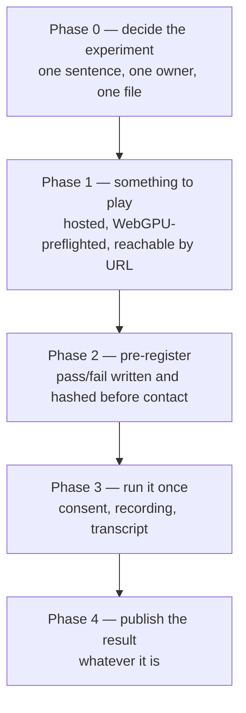

# PRD-080 — The five-minute stranger test: the project's decisive experiment, specified twice, never run

**Status: PHASE 0 EXECUTED, 2026-08-15. Phases 1–4 not started. No session has been run, no
person has been contacted, and nothing here reports a result.** No mobile-readiness claim is made.

**Phase 0's decision: the five-minute stranger test is the *player* test.**
[`docs/product/STRANGER-TEST-PROTOCOL.md`](../../product/STRANGER-TEST-PROTOCOL.md) is now the
single definition, and it fixes subject, stranger, clock, script, recording and consent.

Decided this way because the project's own documents already do. `METRICS.md` is the document that
defines the criterion and warns what happens if it stays unrun, and it says *played*.
`CHARTER.md`'s acceptance item — *"One game is played by a stranger for five minutes, with a
transcript"* — agrees, and the charter binds. The `ROADMAP.md` Tier 2 trigger's *adopting
developer* was the outlier, and it is now labelled as the separate experiment it always was rather
than a restatement of this one; it needs its own PRD before it can be claimed.

Restatements were replaced with links in `METRICS.md`, `ROADMAP.md` (both places),
`docs/product/ASSET-PIPELINE.md` and `docs/PRDs/asset-pipeline/README.md`. The charter keeps its
own wording, which agrees with the protocol and is not a competing definition.

**One consequence worth stating plainly: this test is not blocked on PRD-119.** A stranger opens a
URL; nothing installs. It is the *adopting-developer* successor that needs a registry that does
not 404. The batch README's claim that PRD-080 is blocked on lane A was true only of the
experiment this PRD just decided not to run first.

**Phase 1's stated premise does not hold, and that is a finding rather than a blocker.** Rows 2
and 3 of the Integration Ledger, and Phase 1's revert check, all describe a WebGPU-less browser
showing *"a silent blank canvas"* / *"a black canvas"*. It does not:
`packages/core/src/renderer.ts:159-176` prefers WebGPU and **falls back to a `WebGLRenderer`**
when `navigator.gpu` is absent or `WebGPURenderer` construction throws. A browser without WebGPU
gets a rendered game on WebGL2, not a black rectangle.

So the preflight Phase 1 asks for is not repairing a blank screen. It may still be worth building
— a stranger on WebGL2 is having a different experience than the one being measured, and the
session record should say which they got — but that is a **different justification**, and the
phase should be rewritten around it before it is executed rather than shipping a fix for a
symptom nobody has reproduced. The negative control as written ("break the preflight → a black
canvas returns") cannot be observed red, because the black canvas was never the behaviour.

Nothing about the fallback is claimed to be *good*: WebGL2 output has not been compared against
WebGPU output for this subject, and PRD-080 is not the PRD to do it in.

**Phase 1 is where it stops today.** It needs a public deploy — an outward-facing action — and
Phases 3 and 4 need a human stranger, which is not agent work.

§1 below is a read of tracked strategy documents and of the repository tree at commit `8c5fc40`.

**Four tracked documents call this the project's decisive test. None of them agrees with the
others about what it is.**

| Document | What it says the test is |
|---|---|
| [`METRICS.md`](../../strategy/METRICS.md) | *"one game **played** by a stranger for five minutes, with a transcript"* |
| [`ROADMAP.md`](../../strategy/ROADMAP.md) Tier 2 trigger | *"a stranger has played a ThreeNative game for five minutes — concretely, the first external user who **installs the framework and asks for a device build**"* |
| [`ROADMAP.md`](../../strategy/ROADMAP.md) "Not on the roadmap" | gates a hosted Studio or Cloud tier on it |
| [`VALUE-PROPOSITION.md`](../../strategy/VALUE-PROPOSITION.md) | ranks it **#1** of six changes that would move the headline claim; blocked on *"an afternoon and one external person"* |

The first two are **different experiments with different subjects**. One needs a *player*.
The other needs a *developer who adopts the framework*. A player finishing five minutes tells
you nothing about whether anyone would build with it; a developer asking for a device build
tells you nothing about whether the result is fun. Both are worth knowing. Neither is the
other.

And `METRICS.md` says exactly what happens next if this is not settled:

> v1 spent seven weeks unable to answer whether it was working, because its decisive
> experiment was **specified three times and never run**. This criterion costs an afternoon
> and is still open.

**It has now been specified twice more, in two mutually inconsistent forms, and it is still
not run.** Nine days have passed since `METRICS.md` was written; the afternoon has not been
spent. That is the finding this PRD exists to stop repeating.

**And there is nowhere for a stranger to play.** The repository contains no deploy
configuration of any kind — no Vercel, Netlify, GitHub Pages or equivalent. `examples/` holds
`abyss-framework`, `abyss-vanilla` and `native-smoke`; `templates/` holds `minimal`,
`platformer` and `starter`. Every one requires cloning a monorepo and running a dev server.
**Zero of them are reachable by a person who is not already inside this repository.**

**Complexity: 4 → MEDIUM mode.** Little code, and the code there is is easy. The difficulty is
entirely in specifying an experiment that can fail, hosting something a stranger can actually
open, and reporting the result honestly when it is bad.

**Blast radius: ~7 repository paths.**
`docs/product/STRANGER-TEST-PROTOCOL.md` (new),
`docs/verification/stranger-test-<date>.md` (new),
`examples/abyss-framework/` or the chosen subject,
one deploy configuration,
`docs/strategy/METRICS.md`, `docs/strategy/ROADMAP.md`,
`docs/strategy/VALUE-PROPOSITION.md`.

**Depends on:** nothing. **Unblocks:** the Tier 2 review trigger in
[`docs/PRDs/BLOCKED/README.md`](../BLOCKED/README.md), every adoption claim in
`VALUE-PROPOSITION.md`, and the Studio/Cloud question the roadmap parks behind it.

---

## 1. Why this exists

### 1.1 The test is the project's own idea, and it is the cheapest open item

`VALUE-PROPOSITION.md`'s "What would change the answer" table ranks six changes by how much
they move the headline claim. Five are blocked on hardware, credentials, CI minutes or a
rerun. **The one ranked first is blocked on an afternoon.** It is also the only one that
moves *every* adoption claim rather than one axis.

`METRICS.md`'s closing line is unambiguous: *"Until it is closed, every metric above is a
plan to measure something instead of measuring it."*

### 1.2 The ambiguity is the risk, not the effort

An experiment specified two ways gets run zero times, because whoever picks it up must first
make a product decision they were not authorised to make. That is exactly how v1's decisive
experiment stayed unrun through three specifications.

**So Phase 0 is a decision, not a study.** One sentence, owner-signed, in one place, with the
other documents pointing at it rather than restating it — the same discipline
`VALUE-PROPOSITION.md` applied when it took the score away from `ROADMAP.md` because *"two
copies of a score is two scores."*

### 1.3 The honest-reporting hazard is specific and it is severe

This is a study with n=1 and a human subject, run by the people who built the thing. Four
ways it can produce a green result that means nothing, and each has a countermeasure that
must be fixed **before** anyone is contacted:

| Failure mode | Countermeasure |
|---|---|
| Running it repeatedly until someone lasts five minutes | The **first** session is the result. A second session is a second data point published beside the first, never a replacement. |
| Coaching, hinting, or fixing a bug mid-session | The operator does not speak except to read the script. Everything the stranger struggles with is data. |
| Deciding after the fact what "success" meant | Pass and fail are written down, hashed, and committed **before** the session — the same sealed-brief discipline the paired benchmark already uses. |
| Picking a friendly stranger | "Stranger" is defined in Phase 0 and the relationship to the project is disclosed in the record. |

**A stranger who quits at ninety seconds is a completed run of this experiment and a valid
result.** The PRD is done when the number is recorded, not when the number is five.

### 1.4 The technical precondition nobody has checked

ThreeNative's browser target is WebGPU. A stranger's browser either has it or does not, and
if it does not, the session measures browser support rather than the game. This host's own
notes record that headless Chromium renders WebGPU as a blank canvas without `xvfb` — a
different problem, same family: **the thing renders or it silently does not, and a blank
canvas looks like a bad game.**

A preflight that detects missing WebGPU and says so plainly is therefore part of the subject,
not a nicety. Without it, the most likely outcome of the whole experiment is five minutes of a
stranger looking at a black rectangle and the project concluding something false about its
gameplay.

## 2. Solution



- **Settle the definition first.** The two candidate experiments are named, one is chosen for
  *this* PRD, and the other is filed as its own future PRD rather than left to drift.
- **Deploy something a stranger can open.** A URL, on a phone or a laptop, with no clone, no
  install, no dev server.
- **Pre-register the outcome.** Written, hashed, committed before contact.
- **Run once. Publish whatever happens.**

**Key decisions:**

- [ ] **This PRD runs the *player* experiment** — `METRICS.md`'s wording, which is the older
      and more specific of the two, and the one that costs an afternoon. The *adopting
      developer* experiment is real, more valuable, and considerably more expensive; it is
      filed as a successor and **not** silently folded in here.
- [ ] The subject is a **web build**, not a device build. A device build needs a signed
      artifact the project does not have (`PRD-060`, parked). Making the web build the subject
      is what keeps this to an afternoon.
- [ ] The recording is **consented, anonymised, and stored outside the repository**; the
      committed artifact is a transcript with identifying detail removed.
- [ ] No telemetry is added to the game. A stopwatch and a recording answer the question, and
      instrumenting a stranger without a clear reason is not something to do casually.

**Data changes:** none in code. Two new documents: a protocol and a result.

## 3. Integration Ledger

| # | New thing | Live caller (`file:line`, non-test) | Replaces | Old path removed? | Negative control |
|---|---|---|---|---|---|
| 1 | `docs/product/STRANGER-TEST-PROTOCOL.md` — the one definition | `METRICS.md`, `ROADMAP.md` Tier 2 trigger, `ROADMAP.md` "Not on the roadmap", `blocked/README.md` unlock table — all four edited to **link** it | four inconsistent restatements | all four restatements deleted and replaced by links | grep for a second definition anywhere in `docs/` → must return nothing |
| 2 | Hosted playable build at a public URL | the deploy configuration, triggered on push or on demand | nothing — no build is reachable today | n/a | open the URL on a browser with WebGPU disabled → the preflight message appears, not a black canvas |
| 3 | WebGPU preflight in the hosted subject | the subject's entry, before the renderer initialises | a silent blank canvas | replaced | disable WebGPU in `chrome://flags` → the preflight fires; **this control is run on a real browser, not stubbed** |
| 4 | Pre-registered pass/fail, hashed | committed before the session; its hash quoted in the result document | post-hoc interpretation | n/a | change the criteria after the session → the hash in the result no longer matches, and that is visible to any reader |
| 5 | `docs/verification/stranger-test-<date>.md` | `METRICS.md` north-star row, `VALUE-PROPOSITION.md` "what would change the answer" row 1, `blocked/README.md` Tier 2 unlock row | *"no stranger has ever played a ThreeNative game for five minutes"* in three files | those sentences are replaced with the measured outcome, whatever it is | TBD |

### Reachability

**How is this reached?** A person opens a URL on their own device and plays. That is the
entry point, and today it does not exist.
**Pre-existing files edited:** `docs/strategy/METRICS.md`, `docs/strategy/ROADMAP.md`,
`docs/strategy/VALUE-PROPOSITION.md`, `docs/PRDs/BLOCKED/README.md`, and the chosen
subject's entry.
**User-facing?** Maximally. The user is a stranger and the interface is the whole product.
**What does it replace?** Four inconsistent specifications of one experiment, and the claim
that no such session has occurred.

## 4. Execution phases

### Phase 0 — Decide what the experiment is

**Outcome:** one file states the experiment in one sentence, and every other document points
at it.

**This phase requires an owner decision and does not proceed without one.**

**Files (max 5):**

- `docs/product/STRANGER-TEST-PROTOCOL.md` — NEW
- `docs/strategy/METRICS.md` — EDIT: link, delete the restatement
- `docs/strategy/ROADMAP.md` — EDIT: both restatements become links
- `docs/PRDs/BLOCKED/README.md` — EDIT: the Tier 2 unlock row links it

**The protocol must fix, in writing:**

- [ ] **Subject:** which build, at which URL, on which device class.
- [ ] **Stranger:** who qualifies. Proposed — *has not seen this project, is not a member of
      the household or the immediate professional circle, and did not know what they would be
      shown before arriving.* Relationship is disclosed in the record either way.
- [ ] **Five minutes:** measured from first rendered frame to the moment they stop, by
      stopwatch, recorded to the second. **Not** to the moment they are asked to stop.
- [ ] **The operator's script**, verbatim, including what to say when asked for help:
      nothing.
- [ ] **What is recorded:** screen, audio, the transcript, and the stopwatch.
- [ ] **Consent**, obtained before recording, and what the person is told about where the
      recording goes.
- [ ] **The successor experiment named:** the adopting-developer test, filed as its own PRD so
      the Tier 2 trigger's wording has an owner rather than a contradiction.

**Negative control for this phase:** `grep -rn "five minutes" docs/` returns links plus one
definition. Any second definition fails the phase.

### Phase 1 — Something a stranger can open

**Outcome:** a URL that renders a playable ThreeNative game on a stranger's own laptop or
phone, with no clone and no install.

**Files (max 5):**

- one deploy configuration
- the chosen subject's entry — EDIT: WebGPU preflight
- `packages/create-threenative/templates/*/src/` — EDIT **only** if the preflight belongs in
  generated source rather than in the example
- `docs/product/STRANGER-TEST-PROTOCOL.md` — EDIT: the URL

**Where the preflight belongs is a real boundary question and it is decided here, not
assumed.** A message a user sees is something a screenshot shows, which means it ships as
generated source in `src/render/`, not as package code — **unless** what ships is only the
*detection* (`navigator.gpu` absent → a documented error the game may render however it
likes), in which case the detection is plumbing and the message is the user's. Take the second
reading unless the code says otherwise.

**Tests required:**

| Gate | Assertion | Negative control (must be observed red) |
|---|---|---|
| Deployed URL responds | HTTP 200, the bundle loads | — |
| Playtest against the deployed URL | the existing scenario passes against the public URL, not just localhost | point it at a URL with no game → `TN_PLAYTEST_BRIDGE_MISSING`, exit `2` |
| WebGPU preflight | a browser with WebGPU disabled shows the message | enable WebGPU → the message is absent and the game renders. **Run both on a real browser** |
| Mobile browser | the subject renders on a phone browser at a sensible size | — |

**Revert check:** break the preflight → a WebGPU-less browser shows a black canvas again,
which is the pre-existing behaviour this phase removes.

### Phase 2 — Pre-register the outcome

**Outcome:** what counts as pass and fail is committed, and hashed, before any person is
contacted.

**Files (max 2):**

- `docs/product/STRANGER-TEST-PROTOCOL.md` — EDIT: the criteria and their SHA-256
- `docs/verification/stranger-test-<date>.md` — NEW: stub carrying the hash only

**Proposed criteria, for the owner to fix in Phase 0 or amend here.** The primary measure is
**a number, not a verdict**: elapsed seconds from first rendered frame to voluntary stop.
Around it, recorded and not scored:

- What they thought the goal was, in their words, within the first minute.
- Every point at which they were stuck, with a timestamp.
- Whether they asked to play again, unprompted.
- Anything that broke.

**There is deliberately no pass threshold on the primary number.** "Five minutes" is the
experiment's name, not its bar. Declaring a threshold after four failed rounds of paired
benchmarking would invite exactly the outcome-shopping this repository fails builds over. The
number is published; the interpretation is the owner's, in the open.

**Negative control:** the result document quotes the criteria hash. Edit the criteria after
the session and the hashes diverge visibly.

### Phase 3 — Run it. Once.

**Outcome:** one session, recorded, transcribed, timed.

**Files:** none in the repository during the session. Recording and notes live outside it
until Phase 4 anonymises them.

**Implementation:**

- [ ] Consent, verbally and in writing, before recording starts.
- [ ] Read the script. Then stop talking.
- [ ] Stopwatch from first rendered frame.
- [ ] Do not fix anything. Do not explain anything. Write it down.
- [ ] Afterwards, five minutes of unstructured questions, recorded separately from the timed
      run so it cannot contaminate the number.

**If the game fails to launch on their device, that is the result of this experiment** and it
is published as such. It is not a technical setback to be retried before the real attempt.

### Phase 4 — Publish it, whatever it says

**Outcome:** the result is in `docs/verification/`, and the three strategy documents that
currently assert no stranger has played are corrected.

**Files (max 5):**

- `docs/verification/stranger-test-<date>.md` — EDIT: the number, the transcript, the
  criteria hash
- `docs/strategy/METRICS.md` — EDIT: the north-star row and the closing paragraph
- `docs/strategy/VALUE-PROPOSITION.md` — EDIT: "what would change the answer" row 1, and the
  *"no stranger has ever played"* row in the not-earned table
- `docs/strategy/ROADMAP.md` — EDIT: the Tier 2 reopen trigger's state
- `docs/PRDs/BLOCKED/README.md` — EDIT: the unlock row

**The Tier 2 question is raised, not answered.** The trigger's wording names *the first
external user who installs the framework and asks for a device build* — the successor
experiment, not this one. A player session **does not** by itself satisfy that clause, and
this PRD does not stretch it to. Phase 4 records that the player half is closed and the
adopter half is not.

**Anonymisation is a gate, not a courtesy.** No name, no face, no voice, no employer, no
identifying detail in anything committed. If the transcript cannot be anonymised, the
transcript is not committed and the result document says so.

## 5. Verification strategy

**Integration proof:**

```sh
# 1. One definition, not four
grep -rn "five minutes\|five-minute" docs/ | grep -v STRANGER-TEST-PROTOCOL
# Expected: only links to the protocol; no second definition

# 2. The subject is reachable by someone outside this machine
curl -sfI "$STRANGER_TEST_URL" | head -1
# Expected: HTTP 200

# 3. The deployed build is the real game, asserted rather than eyeballed
node packages/playtest/dist/runner/cli.js <scenario> --url "$STRANGER_TEST_URL" --browser-recipe webgpu
# Expected: exit 0. Exit 2 means the bridge is absent and the URL is not the subject.

# 4. Pre-registration held
sha256sum docs/product/STRANGER-TEST-PROTOCOL.md
# Expected: matches the hash quoted in the result document

# 5. No PII
grep -rniE "<the participant's name>|<employer>" docs/
# Expected: no output
```

**Evidence required:**

- [ ] The deployed URL, and a playtest run against it, pasted
- [ ] The WebGPU preflight observed both red and green on a real browser
- [ ] The criteria hash, committed before the session's date
- [ ] The elapsed-seconds number, to the second
- [ ] The anonymised transcript, or a statement that it could not be anonymised

## 6. Acceptance criteria

Consumer-scoped, and the consumer here is a person who has never heard of this project.

- [ ] **A stranger opened a URL on their own device and a ThreeNative game rendered** —
      or it did not, and that is the recorded result.
- [ ] **The elapsed time is a measured number**, from first rendered frame to voluntary stop,
      published to the second.
- [ ] **The pass/fail criteria were committed and hashed before the person was contacted**,
      and the hash in the result matches.
- [ ] **One definition of this experiment exists in the repository**, and `METRICS.md`,
      `ROADMAP.md` (both places) and `BLOCKED/README.md` link it instead of restating it.
- [ ] **A browser without WebGPU shows a message, not a black rectangle** — proved on a real
      browser, both ways.
- [ ] **The three documents asserting that no stranger has played are corrected**, with the
      measured outcome rather than a softened version of it.
- [ ] **The adopting-developer experiment is filed as its own PRD** with the Tier 2 trigger's
      wording assigned to it, so the two experiments stop being one sentence.

**This PRD is complete when the number is published.** It is not complete when the number is
good, and a bad number does not authorise a second session inside this PRD.

**What this PRD may not claim:** that Tier 2 is reopened, that anyone adopted the framework,
that a device build was requested, or anything at all about retention, enjoyment or product
market fit from n=1. One person is one person, and the value of running it is that the
project stops saying *"nobody has ever tried this"* — not that it starts saying the opposite.
