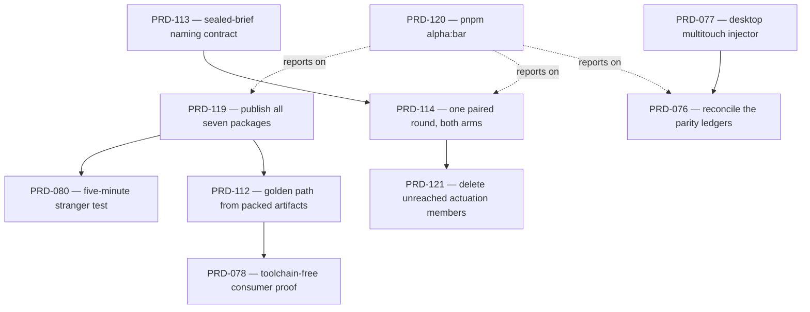

# Batch — alpha readiness, 2026-08-15

**Status: ASSEMBLED, 2026-08-15. Nothing in this folder has been executed as a batch.** Eight of
the ten PRDs here already existed and were moved from `docs/PRDs/` and
`docs/PRDs/production-readiness-26-08-14/`; their own status lines are unchanged and still govern
what has and has not run. Two are new and unexecuted: PRD-119 and PRD-120. No mobile-readiness,
physical-device or iOS claim is made anywhere in this folder.

## What alpha means here, and how it differs from the beta bar

`docs/strategy/ROADMAP.md:30-36` defines a **beta** bar: production-ready, a stranger can install,
build a game, and ship it. This folder defines the step before it.

> **Alpha:** an outsider can install the framework from a public registry, build and ship a small
> game on the platforms the project claims, and every claim they can check is one this repository
> measured rather than asserted.

The distinction that matters: **beta is about being good; alpha is about being reachable and
honest.** A framework can be alpha with rough edges, missing genres, and an open performance
question. It cannot be alpha while its install command 404s, while two of its own ledgers disagree
about the same device on the same day, or while its headline verification claim has never survived
contact with a game somebody else wrote.

**Today's honest answer is: alpha in substance, not in reach.** The gates hold on every landed
change, three templates scaffold and pass their playtests, desktop native and the iOS simulator
execute — and nobody outside this machine can install any of it.

## The alpha bar

Seven rows. Each names the PRD that owns it and the one sentence that is not true yet.

| # | Alpha requirement | Owning PRD(s) | Not true yet, because |
|---|---|---|---|
| A1 | A stranger can install it from the public registry | [PRD-119](PRD-119-the-alpha-release-train.md) | `create-threenative`, `@threenative/studio` and `@threenative/runtime-native` are **404**; the four packages that exist were published 2026-08-09, 83 commits and 649 changed files ago |
| A2 | The golden path completes from published artifacts — create → dev → test → build web → build native → package | [PRD-112](PRD-112-golden-path-from-packed-artifacts.md), [PRD-078](PRD-078-toolchain-free-consumer-proof.md) | the packed seven-template gate is red on action-rpg; 10 release tags produced **0 published releases** |
| A3 | Verification cannot report green while asserting nothing | [PRD-113](PRD-113-sealed-brief-naming-contract.md) | the sealed consumer proof reads 1/6 positive direct rows |
| A4 | The value claim rests on one measured paired round, not an estimate | [PRD-114](PRD-114-paired-round-on-the-repaired-instrument.md), then [PRD-121](PRD-121-delete-unreached-actuation-members.md) | round 7 is **VOID**; `pnpm round:next` says *"Stop condition recorded: void"* |
| A5 | Every platform claim is checkable and the ledgers agree | [PRD-077](PRD-077-desktop-multitouch-injector.md) → [PRD-076](PRD-076-tier-1-parity-reconciliation.md) | `parity-2026-08-10-r2` and `tier-1-2026-08-10` disagree on the same device on the same day; the desktop lane cannot exit `0` because the harness has no multitouch injector |
| A6 | One stranger has actually used it | [PRD-080](PRD-080-five-minute-stranger-test.md) | run zero times, and specified two mutually inconsistent ways |
| A7 | The bar is runnable, not transcribed | [PRD-120](PRD-120-the-alpha-bar-is-runnable.md) | this table is typed by hand, which means it cannot go red |

A7 exists because of the other six. A hand-maintained status table is the same failure mode as a
harness that drops malformed assertions: it reports with the confidence of a measurement and is
not one. When PRD-120 lands, this table is generated and a hand edit to it is reverted on the next
run.

## Dependency order

**Start at PRD-119.** Every other row improves something an outsider still cannot reach. It is also
the only irreversible step in the folder — a published version cannot be recalled — so it lands
behind its own preflight and an owner's approval of the exact version numbers.

## Lanes

Four agent lanes with no file overlap, plus one that is not agent work.

| Lane | PRDs | Owns these paths | Notes |
|---|---|---|---|
| **A — distribution** | PRD-119, PRD-112, PRD-078 | `.github/workflows/`, `scripts/verify-*`, `packages/*/package.json` versions | One agent. All three touch the release and clean-room lanes and will collide if split |
| **B — evidence** | PRD-113 → PRD-114 → PRD-121 | `docs/benchmark/genres/`, `docs/verification/`, `scripts/round-*` | Strictly serial. **PRD-114 runs alone** — a round that measures a moving tree is void, which is how rounds 3–5 died |
| **C — platform ledgers** | PRD-077 → PRD-076 | `packages/playtest/`, `packages/runtime-native/` harness | Independent of A and B |
| **D — instrument** | PRD-120 | `scripts/alpha-bar.ts`, `scripts/round-next.ts`, this README | Small, unblocked, and makes the other lanes' progress visible. Start it first for that reason |
| **E — owner** | PRD-080 | none | Not agent work. Blocked on lane A: a stranger cannot install a 404 |

## Related, and deliberately not in this folder

| PRD / batch | Why it stays out |
|---|---|
| [PRD-064](../PRD-064-tier-1-native-reliability.md), [PRD-065](../PRD-065-ios-evidence-lane.md) | Tier 1 is the *shipping* bar and Tier 2 needs physical hardware. Alpha needs the claims to be honest, not the matrix to be green |
| [PRD-079](../PRD-079-phase-2-exit-criteria.md) | Rewrites the **beta** exit gate. Its harness half was overtaken by the instrument repairs; reopening the beta gate is not an alpha blocker |
| [PRD-073](../PRD-073-performance-by-default.md), [PRD-117](../PRD-117-engine-load-test-godot.md), [PRD-118](../PRD-118-android-js-engine.md) | Performance work. A slow alpha is an alpha |
| [`asset-pipeline/`](../asset-pipeline/), [`starter-kits/`](../starter-kits/), [`studio-hosting/`](../studio-hosting/) | Product surface. None of it changes whether an outsider can install and ship |
| [`production-readiness-26-08-14/`](../production-readiness-26-08-14/README.md) | The night that produced four of these. Kept as that night's record, including the two superseded repair lanes in its `repairs/` |

## Two bookkeeping facts about this folder

**PRD-117 was renumbered to PRD-121 on the move.** Two PRDs held 117: the actuation deletion and
`docs/PRDs/PRD-117-engine-load-test-godot.md`, which is executed and owns the Godot load-test
instrument. Verification records written before 2026-08-15 —
`docs/verification/round-7-2026-08-15.md` and `score-physics-puzzle-round-7-2026-08-15.md` — call
it **PRD-117** and are left as written, because they are the evidence record and evidence is not
edited to match a later filename.

**`pnpm round:next` cannot see PRDs in this folder.** `scripts/round-next.ts:78` reads
`docs/PRDs/` with a non-recursive `readdirSync`, so a PRD in any batch folder reads as *not open* —
already true for every other batch folder here. PRD-120 Phase 3 fixes it with a spec case observed
red first. Until then, do not read a `round:next` result as evidence that a PRD in this folder is
closed.

## Stop rules

These are the repository's rules, restated because this batch is where they are easiest to break.

- **Never claim a gate you did not run.** Paste the failure. "Unverified" is an acceptable result.
- **A negative control that was not observed red does not count.** Every PRD here names its
  controls; a phase whose control was skipped is not done.
- **Phase 0 is reproduction, not repair** — in PRD-119, PRD-120 and PRD-114. No reproduction, no
  fix phase.
- **PRD-119 Phase 2 is irreversible.** A published version can only be deprecated, never recalled.
  It does not run without a green preflight and an owner's approval of the version numbers.
- **Never print the registry `.npmrc`.** Pass it explicitly with `--userconfig`; it stays
  untracked.
- **Name the layer before the fix.** Engine bug → `packages/`. Game bug → the example or the
  template.
- **WebGPU on this host needs `xvfb-run -a -s '-screen 0 1600x900x24'`.** A run that never reached
  its assertions exits `2` and is recorded as **unmeasured** — never a pass, never a red.
- **Validate locally, not by pushing to CI.** CI minutes are scarce on this plan; the clean-room
  install gate runs on tag pushes only.

## Done means

For each PRD: `pnpm typecheck && pnpm lint && pnpm test` green, the phase's gate green, every
negative control observed red with its command pasted, a dated file in `docs/verification/`, and
the PRD's status line updated with what executed and what did not. Each finished PRD gets
`git mv`'d to `docs/PRDs/done/` in the commit that finishes it. The folder is archived with
`git mv docs/PRDs/alpha-readiness/ docs/PRDs/done/alpha-readiness/` only once every PRD in it is
complete — and the sentence it licenses is *"a stranger can install ThreeNative and ship a small
game"*, nothing larger.
