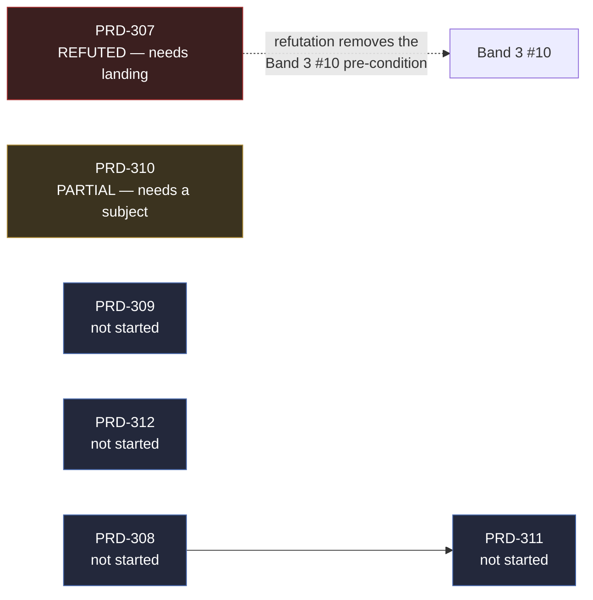

# Follow-up — architecture board, 2026-09-01

What is left on `docs/PRDs/architecture` after the 2026-09-01 session, where every piece physically
lives, and what is safe to delete. Written so the next session can pick up any row without
re-deriving it.

**Read the status words literally.** *Measured* means output was pasted from a run in this session.
*Unverified* means nobody ran it. Nothing here is ticked on the board — the board is
[README.md](README.md), and a row there moves only when the PRD is archived to `docs/PRDs/done/`
with a `docs/verification/` record beside it.

---

## Board at a glance

| Doc task | PRD | State after this session |
| --- | --- | --- |
| 1 — `quality.ts` in all 8 templates | PRD-304 | ✅ done (earlier in session) |
| 2 — `gpuMs` on Android | PRD-305 | ✅ done (earlier in session) |
| 3 — delete-test as a gate | PRD-306 | ✅ done (earlier in session) |
| 4 — bake prefiltered reflections | **PRD-307** | **Refuted, evidence in hand. Lane built, uncommitted, not landed.** |
| 5 — GPU time per pass, on the phone | PRD-308 | Not started |
| 6 — Android conformance every commit | PRD-309 | Not started |
| 7 — projection covers what moves | PRD-310 | PARTIAL — instrument **did** land; measurement blocked. New unblock lead below. |
| 8 — per-pass cost in `diagnostics` | PRD-311 | Not started; depends on PRD-308 |
| 9 — timeboxed `shermes` spike | PRD-312 | Not started |



---

## Is any of this pending in another worktree?

**Committed work: no. Uncommitted work: yes, in exactly two places, and one of them is a stale
duplicate that must be discarded rather than landed.** Verified 2026-09-01 against 29 checked-out
worktrees and every local branch.

### What was checked, and what it showed

| Check | Result |
| --- | --- |
| Any branch containing `prd307-environment-cost` or `env-cost*` | **None.** The fixture and its scripts are committed nowhere. |
| Any branch with `docs/PRDs/done/PRD-3{07..12}` | **None.** No architecture PRD past 306 is archived anywhere. |
| Architecture PRD files on the five active integration branches — `codex/prd315-20260901`, `codex/pr39-integration-home`, `linchpin/vfx-gallery-316-20260901`, `ci/all-green-and-sync`, `tn-pr39-advisory` | **Byte-identical to `origin/main`** on all five. No divergent PRD state, no duplicated effort. |
| Unlanded commits touching PRD-307…312 | Only merge commits (`Merge branch 'main' into …`) and stale integration tips carrying the files through. **No substantive edits.** |

The long list of branches that *appear* to differ under `docs/PRDs/` is stale-branch drift — those
tips are hundreds of commits behind `origin/main`, so a raw diff reports the whole tree. Ignore it.

### Where the PRD-307 work actually is

```mermaid
flowchart TB
  om["origin/main @ 49f4770b"]
  L307["`.worktrees/prd-307-refuted-20260901`<br/>branch docs/prd-307-refuted-20260901<br/>ahead 0 · behind 1 · dirty 5<br/><b>THE GOOD COPY — land this</b>"]:::good
  L310["`.worktrees/prd-310-measure-20260901`<br/>branch docs/mobile-look-three-templates-20260901<br/>2 commits, both already landed · dirty 3<br/><b>SPENT — stale duplicate, discard</b>"]:::dead
  om --> L307
  om -.older base.-> L310
  classDef good fill:#1f3b26,stroke:#3a3,color:#fff
  classDef dead fill:#3b1f1f,stroke:#a33,color:#fff
```

**Lane A — `.worktrees/prd-307-refuted-20260901`** (branch `docs/prd-307-refuted-20260901`, cut from
`origin/main` at `49f4770b`, 0 ahead / 1 behind). Five uncommitted paths, all of them the real work:

| Path | State |
| --- | --- |
| `examples/prd307-environment-cost/` | five-arm fixture, `tsc --noEmit` clean (untracked) |
| `scripts/env-cost-report.ts` | the arithmetic; fails closed on an unmeasured arm (untracked) |
| `scripts/__tests__/env-cost-report.spec.ts` | **15 tests — red pasted, then green pasted** (untracked) |
| `scripts/env-cost-probe.ts` | driver, rewired onto the tested module (untracked) |
| `pnpm-lock.yaml` | modified — the new example is a workspace package |

**Lane B — `.worktrees/prd-310-measure-20260901`** (branch
`docs/mobile-look-three-templates-20260901`). This lane is **spent**:

- Its 2 commits (`0271af66` eager surface-node gate, `09d92424` mobile-look record) **landed by
  content** — all three files they touched are byte-identical to `origin/main`, and the patch-id
  probe from the worktree-pr skill returns a leading `-`. The branch only *looks* unmerged because
  `origin/main` took them through a squash (PR #42).
- Its 3 dirty paths are a **stale duplicate** of the PRD-307 work: the same fixture source
  (byte-identical), a modified `pnpm-lock.yaml`, and `scripts/env-cost-probe.local.ts` — the
  **pre-refactor** probe with no fail-closed behaviour and no noise-floor gate.

**Do not land Lane B's copy.** It is the version that would silently report an unmeasured arm as a
zero difference — precisely the failure the refactor removed. Everything worth keeping was already
copied into Lane A. Lane B is safe to `git worktree remove` once Lane A lands.

Both fixture copies also carry a 12 MB `node_modules/`; neither is tracked, and
`examples/*/node_modules` is ignored, so nothing needs cleaning before committing.

---

## PRD-307 — refuted, and the refutation is the deliverable

### The finding

Baking the environment prefilter **cannot** win the ≈6.3 ms the direction document attributes to
`scene.environment`. Three independent lines, all reproducible:

1. **The subject never re-prefilters.** In Bayview
   (`../../../sandbox/prd259-bayview-current-20260830`, the sandbox game the 6.3 ms came from),
   `needsPMREMUpdate` appears nowhere, `ProbeVolume`/`CubeCamera` appear nowhere, and
   `PMREMGenerator` appears only inside a comment. `scene.environment` is assigned exactly once, at
   `src/render/sky.ts:75`. The prefilter is a one-time load cost in that game.
2. **The 6.3 ms is a steady-state per-frame number.** `docs/verification/runtime-perf-state.md:782`
   measures it as `gpuDrain p50` with the environment nulled versus set. A one-time load-time cost
   cannot appear in a per-frame p50, so the 6.3 ms is entirely per-fragment sampling — the row
   baking cannot touch. Bayview's own source says the same in the comment above the line:
   *"PMREM sampling runs inside every PBR fragment."*
3. **A desktop control shows a set-once environment is not silently re-prefiltered.** If three.js
   re-prefiltered every frame regardless, `static` would equal `dirty/1`. It does not.

### Measured — nvidia/turing, adapter named, 60 s per arm, vsync disabled

| Arm | `gpuMs` median | p10–p90 |
| --- | ---: | --- |
| `static` — environment set once | 2.18 | 2.10–4.07 |
| `none` — no environment | 2.55 | 0.41–5.64 |
| `dirty/8` — prefilter every 8th frame | 2.41 | 2.28–9.87 |
| `dirty/2` — prefilter every 2nd frame | 2.23 | 0.51–4.57 |
| `dirty/1` — prefilter every frame | 3.79 | 3.65–6.48 |

- `dirty/1 − static` = **+1.61 ms** — what a per-frame re-prefilter costs. Bayview never pays it.
- `static − none` = **below the noise floor.** `none` does strictly less work than `static`, so
  `none ≤ static` must hold; it read 0.37 ms *higher*, in two independent runs. That inversion **is**
  the noise floor, and no difference smaller than it may be claimed from this lane.

Two dead ends worth not repeating: one `MeshStandardMaterial` per sphere compiles one pipeline per
mesh and crashed the tab at 480 spheres (fixed — ten shared materials); and at 60 fps vsync the GPU
idles ~85 % of the frame and downclocks, which widened every arm past the differences being
measured (fixed — `--disable-gpu-vsync --disable-frame-rate-limit`).

### Also measured, and not usable

Launch-time arms on the Pixel 8 (`TN_NO_IBL` gate, Bayview, 3 paired cold launches) came out
**thermally confounded** and are not reportable: battery temperature rose 33.3 → 36.3 °C
monotonically across the sequence, the IBL arm's own spread (17.3–21.5 s) exceeded the 2.4 s
between-arm difference, and one of three paired comparisons flipped sign. If the launch-time prize
matters, re-run on a cooled phone with ≥8 pairs and drop the first pair as warmup. **The refutation
does not depend on this number** — it is only the size of the consolation prize.

### What is left, in order

1. Re-run `sh scripts/xvfb.sh pnpm tsx scripts/env-cost-probe.ts <port> 60` in Lane A and confirm
   the refactored script reproduces the table above. **Not yet done** — the numbers above come from
   the pre-refactor driver. Either re-run, or state plainly in the record that the landed script was
   not re-executed. Lane A needs `pnpm install` + `pnpm build` first; both were run and were green.
2. Write `docs/verification/environment-cost-attribution-2026-09-01.md` with the table, the noise
   floor, the source evidence, and the confounded device arms marked as such.
3. Set PRD-307 status to REFUTED with the number that refuted it; move it to `docs/PRDs/done/`.
4. Tick the row in **both** [README.md](README.md) and
   `docs/architecture/FUTURE-ARCHITECTURE-DIRECTION.md`, and note that the document's falsification
   test *"baked reflections land and the phone frame does not move ≥ 2 ms"* **fired**.
5. Add the number to the lever graveyard in `docs/verification/runtime-perf-state.md`.
6. Gates: `pnpm typecheck && pnpm lint && pnpm test`. Then PR, green CI, squash.

### What this changes downstream

- Band 3 task #10 was forbidden from shipping without task #4. #4 is refuted, so that gate needs
  restating rather than silently satisfying — say so on the board row.
- The record already names the lever that targets the row which actually costs 6.3 ms: a
  single-fetch IBL approximation via `material.envNode` (`runtime-perf-state.md`, "the designed path
  to 60"). That is per-fragment sampling work, not a build-time bake. If the ~6 ms is still wanted,
  **that** is the next PRD, and it is not this one.

---

## PRD-310 — PARTIAL, with a new unblock lead

**Phase 1's instrument did land on `origin/main`** — confirmed, not assumed:
`packages/core/src/projection-marker.ts`, `packages/playtest/src/runner/perf.ts`, and both specs are
present there. `TN_PROJECTION` prints the exact lane by reason on every frame-budget window and
`perf` ranks the reasons. The PARTIAL status is accurate: what is missing is the **measurement**,
and the reason is a missing **subject**.

The PRD's own words: *"no subject reachable from this repository exercises the projection with
characters in it."* `abyss-framework` declines at `belowMeshFloor`, `engine-load-test` has no
characters, and Bayview was recorded as unreachable — *"a sandbox checkout whose engine symlinks are
broken and whose tree holds another session's uncommitted work."*

**The lead:** that Bayview blocker was not re-checked this session, but adjacent facts moved.
`com.threenative.bayview` is installed on the Pixel 8 and cold-launches fine (first frame ≈14.8 s
when cool, measured), its source tree reads cleanly, and it is the ~315-draw subject the 780 → 315
figure came from. Whether its *build* still works is the open question, and it is one command away.

Next action, cheapest first:

1. `pnpm install` in `../sandbox/prd259-bayview-current-20260830` — do the engine symlinks still
   resolve? If yes, the recorded blocker is stale.
2. If it builds, package it against a runtime carrying `TN_PROJECTION` and read
   `perf --logcat <serial>` for the per-reason table.
3. That table is Phase 1's deliverable. **Phase 2 stays unstarted until it exists** — the PRD is
   explicit that choosing a reason to fold without it is choosing by intuition.

Check `git status` in that sandbox tree before touching it; it was recorded as holding another
session's uncommitted work.

---

## PRD-308, 309, 311, 312 — not started

| PRD | Complexity | Shape | Prerequisite |
| --- | --- | --- | --- |
| **308** — GPU time per pass on the phone | 7, HIGH | new measurement subsystem spanning JS and the native host | PRD-305 ✅ (satisfied — `gpuMs 0.19` from a Pixel 8) |
| **309** — Android conformance every commit | 6, MEDIUM | CI surface plus a device/emulator lane | none |
| **311** — per-pass cost in `doctor --url` | 4, MEDIUM | `playtest` + core; reuses 308's decomposition | **PRD-308** |
| **312** — timeboxed `shermes` AOT spike | 5, MEDIUM | new toolchain integration, external dep | none |

Suggested order if picking up cold: **309** and **312** are independent and unblocked; **308** is
the largest and gates **311**. PRD-309 has a usable device lane right now — adb over wifi is
authorised and the phone is cool.

---

## Cross-cutting, not owned by any PRD

1. **Local `main` has diverged hard.** It is **+77 / −11** against `origin/main` and it moved
   *during* this session — a sibling agent is committing directly to the primary checkout's `main`.
   `git merge --ff-only` will refuse. This is the user's call, not an agent's; do not reset, rebase,
   or force anything over it. Its only dirty file is this follow-up document.
2. **Worktree census: 29 checked out.** Dirty ones, and whose they are:

   | Worktree | Branch | Dirty | Note |
   | --- | --- | ---: | --- |
   | `threenative-engine` (primary) | `main` | 1 | this document, untracked |
   | `.worktrees/prd-307-refuted-20260901` | `docs/prd-307-refuted-20260901` | 5 | **the PRD-307 lane — land it** |
   | `.worktrees/prd-310-measure-20260901` | `docs/mobile-look-three-templates-20260901` | 3 | spent; stale duplicate; removable |
   | `.worktrees/vfx-gallery-316-20260901` | `linchpin/vfx-gallery-316-20260901` | 21 | **another agent's — do not touch** |
   | `.worktrees/useful-defaults-291-device-input-20260831` | `linchpin/useful-defaults-291-…` | 6 | **another agent's — do not touch** |
   | `~/tn-tip` | detached | 1 | outside the repo tree |

   Linchpin-owned lanes must be left to `linchpin prune`; never rename or delete one it still
   considers open.
3. **PRD-304's fix is untested on four templates.** `defense`, `platformer`, `racing` and
   `action-rpg` were never re-run after the lazy surface-node fix — the run timed out under load.
   That fix is the one that turned a black mobile look back into a rendered frame on seven
   templates, so the untested four are worth a `pnpm test:templates` pass.
4. **Device state is clean.** Bayview's gate file `files/mystral/storage/default.json` was restored
   to `{}` and the app relaunched; the as-shipped look is back. Any future ablation arm must
   announce the gate flip first and end with restore **and** a cold relaunch — the running process
   keeps the launch-time gate, so restoring the file alone leaves the wrong look on screen.
5. **Do not trust `none ≤ static` style controls to hold silently.** The env-cost probe now encodes
   its own negative control and refuses to report a difference under the measured floor. That
   pattern is worth copying into PRD-308's per-pass decomposition, where the same failure —
   reporting a difference smaller than the instrument can resolve — is the obvious trap.
