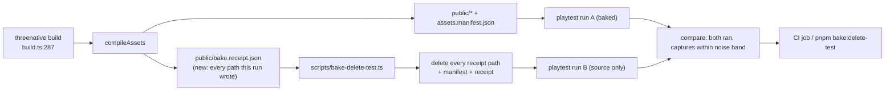
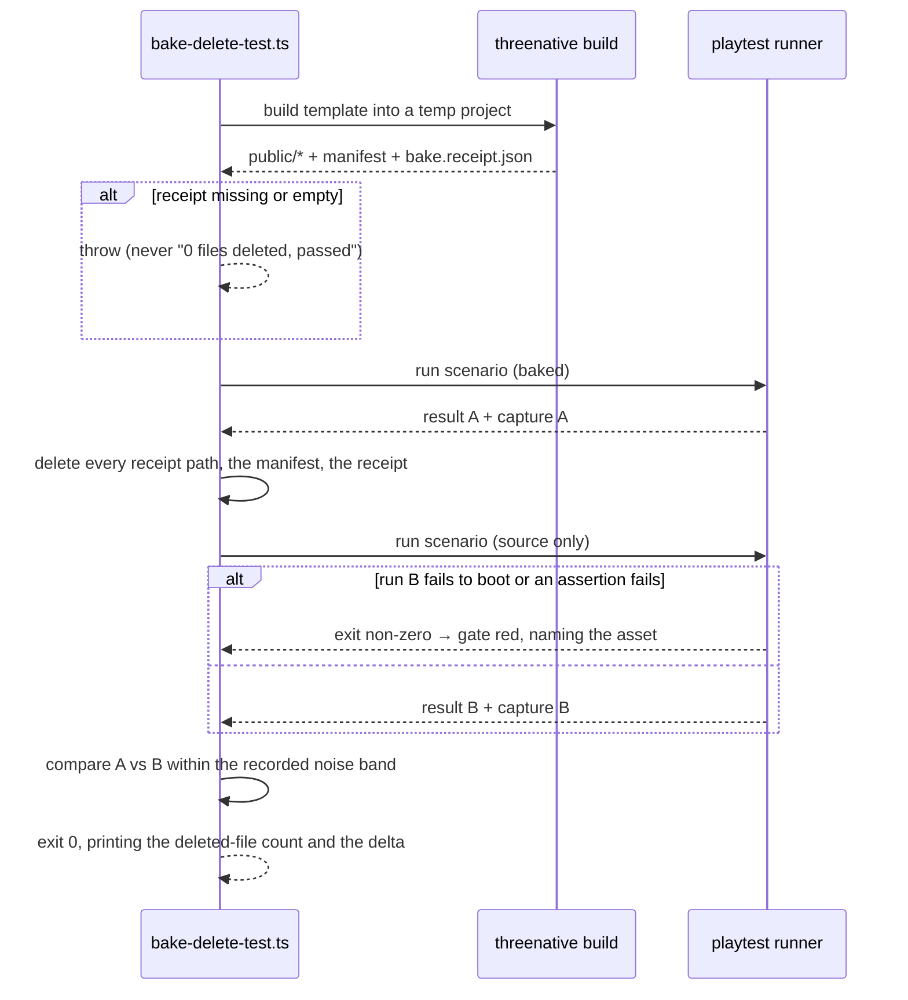

# PRD-306 — Delete every baked file and the game still runs: the delete-test becomes a gate

**Status:** OPEN, filed 2026-08-31 against `2e014460`. Planning only. Every file:line is a read of
this tree on that date.

**Outcome:** `pnpm bake:delete-test` builds a template, deletes every artifact the asset compile
step produced, runs the same playtest scenario against the same source, and **fails when the game
does not still run** — or when the two runs are not the same picture. The rule that separates a
baking pass from v1's IR stops being a paragraph in an architecture document and becomes a command
that goes red.

**Depends on:** nothing. Best landed with, and immediately before,
[PRD-307](PRD-307-reflections-are-prefiltered-before-the-game-ships.md) — the gate is cheap to
write now and expensive to retrofit once a second baking pass exists to get it wrong.

**Task 3 of Band 1.** See [README](README.md) for the tick-back rule.

**Complexity: 6 → MEDIUM mode.** +2 (6–10 files), +2 (new gate module driving a real build and two
playtest runs), +1 (multi-package: `assets`, `create-threenative`, `playtest`, `scripts`), +1 (a
capture comparison whose noise band must be stated, not assumed).

---

## 1. Context

**Problem:** the framework's stated test for every baking pass — *delete the entire baked output and
the game runs identically, just slower* — is enforced by nobody. `@threenative/assets` already bakes
lightmaps and compresses textures, and nothing proves a game whose `public/` was wiped still boots,
let alone still looks the same.

**Files analysed:**

- `packages/assets/src/compile.ts:198-211` — `MANIFEST_NAME = "assets.manifest.json"`,
  `DEFAULT_OUTPUT = "public"`, `BASIS_DIRECTORY`, `PIPELINE_VERSION = 7`
- `packages/assets/src/compile.ts:52-70` — `IAssetPassOutput`, `IAssetAuxiliaryOutput` (how a pass
  declares the extra files it writes)
- `packages/assets/src/passes/lightmap.ts:253-277` — the lightmap auxiliary output
  (`.ktx2`, `manifestField: "lightmaps"`)
- `packages/core/src/assets.ts:7-13, 130-157, 335` — the manifest read, and the documented
  fallback: *a manifest that is absent — 404 or unfetchable — falls back to the source path*
- `packages/create-threenative/src/build.ts:133-134, 287, 431` — where `threenative build` calls
  `compileAssets` and where the manifest lands
- `packages/playtest/src/runner/` — the scenario runner and its capture path
- `scripts/verify-template-playtests.ts` — the existing template scenario driver

**Current behaviour:**

- `core/src/assets.ts` already implements the fallback the delete-test depends on, deliberately and
  with the reasoning in a comment. It is exercised by unit tests with a stubbed fetch, and by no
  end-to-end run.
- Nothing enumerates "everything the bake produced". The manifest lists entries; auxiliary outputs
  are recorded in manifest fields; and `public/` also contains files no pass wrote.
- No gate compares a baked run against an unbaked one, so "identical, just slower" is unmeasured in
  both halves.

---

## 2. Solution

**Approach:**

- The compile step already knows exactly what it wrote. Phase 1 makes it **say so**: a
  `bake.receipt.json` beside the manifest listing every output path the run produced, source and
  auxiliary alike, keyed by the pass that produced it. Nothing guesses from a directory listing —
  a delete-test driven by a glob would either miss a file or delete a source asset, and both
  failures look like a pass.
- Phase 2 is the gate: build → run scenario A → delete every path in the receipt (plus the receipt
  and the manifest) → run scenario B against the same source → compare. **The game must run**, and
  the captures must match within a stated same-code noise band established by two identical runs,
  not assumed to be zero.
- The gate is per-template and runs one template per CI invocation by default, with `--all` for the
  full sweep, because the existing templates gate already aborts at the first failing template.
- Fail closed: an empty receipt, a receipt naming a path that does not exist, or a scenario with no
  assertions is a **failure**, not a skip.

**Architecture:**



**Key decisions:**

- [ ] The receipt is written by the compile step, not reconstructed by the gate. The producer owns
      the list; a consumer-side glob is the version of this gate that passes while missing a file.
- [ ] The receipt is **not** a shipped runtime input. Nothing in `packages/core` reads it, and
      deleting it is part of the test.
- [ ] The comparison is captures plus "the run completed its assertions", not byte-equality of
      frames — playtest captures are not bit-deterministic. The noise band is established by two
      identical baked runs in the same job and recorded.
- [ ] `PIPELINE_VERSION` is bumped, because the compile step now writes an additional output.

**Data changes:** one new generated file per built game, `public/bake.receipt.json`. No schema
migration; absent receipt is the pre-PRD case and the gate says so rather than passing.

---

## 3. Sequence flow



---

## 4. Integration Ledger

| # | New thing | Live caller (`file:line`, non-test) | Replaces | Old path removed? | Negative control |
|---|---|---|---|---|---|
| 1 | `bake.receipt.json` writer | `packages/assets/src/compile.ts` end of `compileAssets` — TBD | nothing | n/a, new output | make one pass forget to declare an output → the gate deletes less and run B still finds the baked file; the receipt-completeness check must go red |
| 2 | `scripts/bake-delete-test.ts` | `package.json` `bake:delete-test` + the CI templates job — TBD | nothing | n/a | point it at a game whose loader has no source fallback → red |
| 3 | `bake:delete-test` npm script | `package.json` scripts — TBD | nothing | n/a | run with an emptied receipt → must exit non-zero, not report "0 deleted, identical" |
| 4 | CI step | `.github/workflows/ci.yml` templates/scaffold job — TBD | nothing | n/a | break the fallback at `core/src/assets.ts:335` → CI red |
| 5 | Receipt-completeness assertion | inside row 2 | nothing | n/a | add a file to `public/` that no pass declared → red naming it |

### Reachability

**How is this reached?** Build step and CI. `compileAssets` already runs on every
`threenative build` (`build.ts:287` and `:431`); the receipt is written there. The gate is a CLI
command wired into the workflow that already builds templates.

**Pre-existing files edited:** `packages/assets/src/compile.ts`, `package.json`,
`.github/workflows/ci.yml`, and `packages/assets/README.md` / `AGENTS.md` for the convention.

**Is this user-facing?** Indirectly: a game author gets a receipt listing what the bake produced,
which is the first time that list exists anywhere. The gate itself is internal.

**Full flow:** CI builds a template → `compileAssets` writes outputs and the receipt → the gate runs
the scenario → deletes every listed path → re-runs → a game that cannot run without its baked files
fails the job and names the file it could not do without.

**What does this replace?** Nothing is deleted. It gives an existing, deliberate fallback
(`core/src/assets.ts:130-157`) its first end-to-end proof.

---

## 5. Execution phases

#### Phase 1: The bake says what it wrote

**Files (5):**

- `packages/assets/src/compile.ts` — EDIT: collect every written path, write `bake.receipt.json`,
  bump `PIPELINE_VERSION`
- `packages/assets/src/report.ts` — EDIT: the receipt type and its formatter
- `packages/assets/src/index.ts` — EDIT: export the receipt type
- `packages/assets/__tests__/bake-receipt.spec.ts` — NEW
- `packages/assets/AGENTS.md` — EDIT: the delete-test rule and the receipt's role

**Implementation:**

- [ ] The receipt records `{ pipelineVersion, generatedAt: <content-derived>, outputs: [{ path,
      pass, source, bytes }] }`. Every auxiliary output (`IAssetAuxiliaryOutput`, e.g. the lightmap
      `.ktx2` at `lightmap.ts:253-277`) is listed with the pass that produced it.
- [ ] A pass that writes a file without declaring it is a **defect the gate must be able to catch**:
      the receipt writer compares its list against the files the compile step actually created under
      the output root during the run and throws on a mismatch.
- [ ] The receipt is deterministic given the same inputs — no wall-clock timestamp, because a
      timestamp makes every downstream diff dirty and this repository proves neutrality by diffing
      emitted output.

**Wiring:**

- [ ] Caller edited: `compileAssets` writes the receipt on every build
- [ ] Registration: none needed; `build.ts:287` already calls it
- [ ] Old path: n/a
- [ ] Ledger rows filled: #1

**Tests required:**

| Test file | Test name | Assertion | Negative control (must be observed red) |
|---|---|---|---|
| `packages/assets/__tests__/bake-receipt.spec.ts` | `should list every auxiliary output a pass produced` | lightmap `.ktx2` present | drop the auxiliary collection → red |
| same | `should throw when a file appears under the output root that no pass declared` | throws naming the file | write a stray file in the fixture → observed red before the guard exists |
| same | `should produce an identical receipt for identical inputs` | two runs byte-equal | add a wall-clock field → red |
| same | `should throw rather than write an empty receipt when no pass ran` | throws | feed an empty source dir → red, never a green empty list |

**Revert check:** delete the receipt writer → `bake-receipt.spec.ts` fails, and Phase 2's gate
throws on the missing receipt rather than passing.

**User verification:**

- Action: `pnpm --filter @threenative/assets build`, build a template, `cat public/bake.receipt.json`
- Expected: every compiled texture, model and lightmap listed with its pass.

---

#### Phase 2: The gate — delete it all, run it again

**Files (5):**

- `scripts/bake-delete-test.ts` — NEW: build, run A, delete, run B, compare, report
- `package.json` — EDIT: `bake:delete-test` script
- `scripts/__tests__/bake-delete-test.spec.ts` — NEW: unit tests over the deletion plan and the
  comparison, with the runner stubbed
- `.github/workflows/ci.yml` — EDIT: one step in the job that already builds templates
- `docs/verification/bake-delete-test-<date>.md` — NEW: the first run, with the noise band

**Implementation:**

- [ ] Establish the same-code noise band first: two identical **baked** runs, their capture delta
      recorded. The A-vs-B threshold is that band, stated in the record. A delta of "0" is not
      assumed.
- [ ] Delete every receipt path, then the manifest, then the receipt. Never `rm` a path built from a
      shell variable and never a path outside the resolved output root — resolve, assert the prefix,
      then unlink.
- [ ] Run B failing to boot is the headline failure, and the message names the first asset the game
      requested that no longer exists.
- [ ] `--template <name>` selects; `--all` sweeps. Default is one template so a red here does not
      hide behind the templates gate's abort-at-first-failure behaviour.
- [ ] Fail closed: empty receipt, missing capture, or a scenario whose assertion set is empty is a
      failure.

**Wiring:**

- [ ] Caller edited: `package.json`, `.github/workflows/ci.yml`
- [ ] Registration: a CI step in the existing templates job
- [ ] Old path: n/a
- [ ] Ledger rows filled: #2, #3, #4, #5

**Tests required:**

| Test file | Test name | Assertion | Negative control (must be observed red) |
|---|---|---|---|
| `scripts/__tests__/bake-delete-test.spec.ts` | `should throw when the receipt is empty` | throws | observed red before the guard |
| same | `should refuse to delete a path outside the output root` | throws naming the path | craft a `../` entry → red |
| same | `should fail when the second run does not complete its assertions` | exit 1 naming the asset | stub run B to fail → red; stub it to pass → green |
| same | `should fail when the two captures differ beyond the recorded band` | exit 1 with the delta | feed two identical captures → green, proving the threshold is not always-red |
| same | `should fail when a scenario asserts nothing` | throws | empty assertion fixture → red |

**Revert check:** revert the fallback at `packages/core/src/assets.ts:335` so a missing manifest
throws instead of falling back, then run the gate → it must go red, and that red is the proof the
gate measures the property it claims. Paste it, then restore.

**User verification:**

- Action: `pnpm bake:delete-test --template starter`
- Expected: a printed count of deleted files (non-zero), both runs completing, and a delta inside
  the recorded band. Then delete a source asset instead and confirm the gate fails differently.

---

## 6. Verification plan

1. **Unit:** the two spec files above, vitest node env, runner and filesystem stubbed where the real
   thing would need a GPU.
2. **End-to-end (the gate):** `pnpm bake:delete-test --template starter` on this machine, and
   `--all` once before the PRD closes. Use a private Xvfb via the runner's own provisioning; never
   call `xvfb-run`.
3. **Integration proof:**

```sh
# 1. The receipt is written by the producer, on the ordinary build path
grep -n "bake.receipt.json" packages/assets/src/compile.ts packages/create-threenative/src/build.ts
# Expected: a hit inside compileAssets, none that reconstruct the list by globbing

# 2. Nothing in the shipped runtime reads the receipt
grep -rn "bake.receipt" packages/core/src packages/create-threenative/templates
# Expected: no output

# 3. The gate is wired into CI, not only into package.json
grep -n "bake:delete-test" .github/workflows/ci.yml package.json
# Expected: both
```

4. **Negative controls, each with its observed red:** empty receipt; escaping path; failing run B;
   over-band delta; empty assertion set; stray undeclared file; **and the reverted core fallback**,
   which is the one that proves the gate is not self-satisfying.

---

## 7. Acceptance criteria

- [ ] A template game whose entire `public/` bake output has been deleted **boots and completes its
      scenario**, and the two captures are within a band this PRD recorded from two identical runs.
- [ ] Breaking the source-path fallback in `packages/core/src/assets.ts` turns the gate red — pasted.
- [ ] The gate names the first missing asset when run B fails, so a future baking pass that quietly
      became load-bearing is diagnosable from CI output alone.
- [ ] A pass that writes an output it did not declare fails the build, so the delete-test cannot
      silently under-delete.
- [ ] The receipt is byte-identical across two builds of the same inputs.
- [ ] `pnpm bake:delete-test --all` is green across all 8 templates, with the shooter template's
      known capture-lane behaviour named rather than absorbed.

**Integration gates:**

- [ ] Integration Ledger has zero `TBD` cells
- [ ] Caller census pasted: the receipt writer runs inside `compileAssets`; the gate runs in CI
- [ ] Revert check pasted: the reverted core fallback makes the gate red
- [ ] Every gate has an observed red, pasted
- [ ] Proved on the real subject: a template with compiled textures **and** a baked lightmap, not on
      a fixture with no bake output
