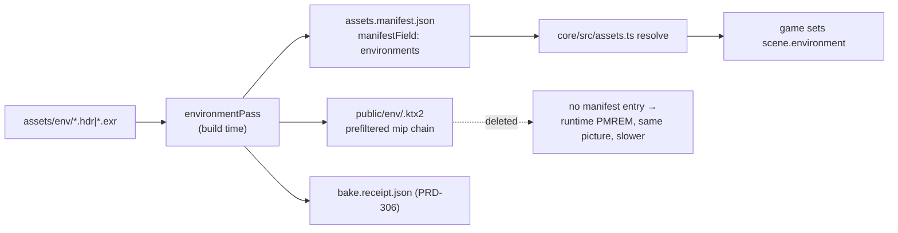
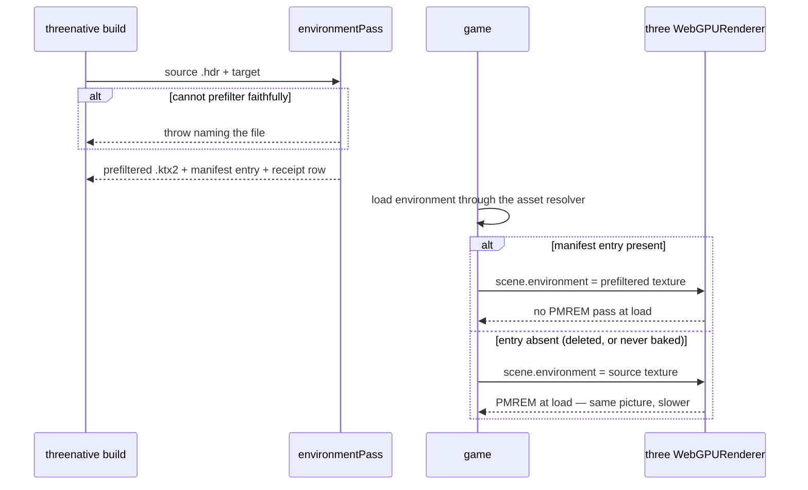

# PRD-307 — Reflections are prefiltered before the game ships, and the 6.3 ms is attributed before anything is baked

**Status:** OPEN, filed 2026-08-31 against `2e014460`. Planning only.

**Outcome:** the environment lighting a game ships with is **prefiltered at build time** by
`@threenative/assets` and loaded ready to sample, so the launch does not spend a device's GPU
producing something a build machine could have handed it — and the phone frame moves by a measured
amount, or this PRD closes as refuted with the number that refuted it.

**Depends on:** nothing to start. Lands with
[PRD-306](../done/PRD-306-the-delete-test-is-a-gate.md), which must gate this pass the day it exists: the
one rule separating a baking pass from v1's IR is that deleting the baked output leaves the game
running, just slower.

**Task 4 of Band 2, and the largest single measured win the direction document lists.** See
[README](README.md) for the tick-back rule.

---

## A correction that changes this PRD's shape, stated before the plan

The direction document attributes **≈ 6.3 ms of an 18–19 ms Pixel 8 GPU frame** to
`scene.environment` and proposes baking the prefilter to recover it. Those are two different costs
and only one of them is per-frame:

| Cost | When it is paid | Does baking remove it? |
| --- | --- | --- |
| PMREM prefilter of the environment texture | once at load — **unless something marks it dirty again** | **yes** |
| every material sampling the prefiltered map, every fragment, every frame | every frame | **no** |

An ablation that removes `scene.environment` removes **both**. So the 6.3 ms is an upper bound on
what baking can win, not an estimate of it, and it could be almost entirely the second row — in
which case baking wins launch time and close to zero frame time, and the direction document's
falsification test (*"baked reflections land and the phone frame does not move ≥ 2 ms"*) fires.

There is a specific reason to check rather than assume: `packages/core/src/render/probe-volume.ts:937`
sets `needsPMREMUpdate = true` at the end of every completed cube-face sweep. A game driving a
`ProbeVolume` — or any `CubeCamera` environment — re-prefilters **during the frame loop**, and for
that game the first row is per-frame and large. Which of these Bayview does is unrecorded.

**Therefore Phase 1 is attribution, and the baking phases are conditional on its answer.** This is
not caution for its own sake: this repository's model of what is slow has been wrong twice, and
five levers have already died against the ≥ 2 ms threshold.

**Complexity: 8 → HIGH mode.** +2 (6–10 files), +2 (new build-time pass producing a new binary
artifact), +2 (multi-package: `assets`, `core`, templates), +1 (external format: KTX2 cubemap
mips), +1 (device measurement gating the design).

---

## 1. Context

**Problem:** three.js computes at runtime what an engine computes at build time. The environment
prefilter is the clearest instance: every launch, on the player's device, the same deterministic
transform of the same bytes.

**Files analysed:**

- `packages/core/src/render/probe-volume.ts:265, 720, 937` — `CubeCamera`, the cube render target,
  and the `needsPMREMUpdate` write at the end of each face sweep
- `packages/core/src/renderProjection.ts:201` — `mirrorScene.environmentIntensity`, i.e. the mirror
  already carries environment state
- `packages/assets/src/compile.ts:52-70, 198-211` — pass output contract, output root,
  `PIPELINE_VERSION`
- `packages/assets/src/passes/texture.ts` (196 lines), `passes/lightmap.ts:253-277` — the shape a
  pass takes, and how a pass declares an auxiliary output with a `manifestField`
- `packages/core/src/assets.ts:62, 130-157, 335` — the manifest read and the documented
  no-manifest fallback the delete-test depends on
- `packages/create-threenative/templates/*/src/render/sky.ts` — every template sets
  `scene.background`, **none** sets `scene.environment`; the 6.3 ms comes from a sandbox game
- `docs/verification/runtime-perf-state.md` — the Bayview ablation table

**Current behaviour:**

- No environment prefilter exists as a build step. `@threenative/assets` bakes lightmaps and
  compresses textures; the manifest has no environment field.
- The templates do not ship an IBL environment at all, so nothing in this repository currently
  exercises the path the win is claimed for. **The subject for this PRD is a real game with an
  environment map, not a template** — proving it on the starter would be the toy proof this
  repository's own rules forbid.

---

## 2. Solution

**Approach:**

- **Phase 1 — attribute.** On the phone, with the meter from
  [PRD-305](../done/PRD-305-the-gpu-meter-reports-on-android.md), separate the one-time prefilter from the
  per-frame sampling: (a) baked-vs-runtime is not yet buildable, so instead measure the frame with
  the environment set and static, (b) the frame with `needsPMREMUpdate` forced every frame, and
  (c) the frame with `scene.environment = null`. The gap between (a) and (c) is the sampling cost
  that baking **cannot** touch; the gap between (b) and (a) is what a per-frame re-prefilter costs.
- **Phase 2 — bake, if Phase 1 leaves a win.** An `environmentPass` in `@threenative/assets` takes
  an equirectangular or cube source and writes the prefiltered mip chain as a KTX2 cubemap, plus a
  manifest field. Build-time only; no runtime code decides anything about the look.
- **Phase 3 — load it, and prove deleting it still works.** `@threenative/core`'s asset resolution
  gains an environment entry; when the baked artifact is absent the game builds the environment the
  way it does today — slower, identical.
- If Phase 1 shows the win is under the standing 2 ms threshold, **this PRD closes as refuted**,
  its number goes into `runtime-perf-state.md` and the lever graveyard, and the direction document
  row is ticked as *refuted, with the measurement*. That is a successful outcome for a PRD whose own
  document lists it under "what would prove this wrong".

**Architecture:**



**Key decisions:**

- [ ] The pass decides **nothing** about the look: same input, same output the runtime would have
      produced, moved earlier in time. Roughness mapping, mip count and format are matched to what
      three's PMREM produces for that source, and the proof is a pixel comparison, not an argument.
- [ ] No new runtime API a game must call. A game keeps writing `scene.environment = texture`; what
      changes is where the texture came from.
- [ ] Fail closed: an environment source the pass cannot prefilter faithfully is a **build error**
      naming the file, never a silent pass-through that ships an unprefiltered map.
- [ ] KTX2, consistent with the existing texture and lightmap outputs — and subject to the same
      native constraint the build already enforces (`build.ts:161`, mobile native has no Basis
      transcoder), so the pass must respect the configured target the same way.
- [ ] The BC7 block rule applies: every source dimension divisible by 4, checked by the pass, since
      the pipeline has previously reported 0 failures on textures WebGPU then rejected at draw time.

**Data changes:** one new manifest field (`environments`), one new output kind. Absent field is the
pre-PRD case and resolves to the runtime path.

---

## 3. Sequence flow



---

## 4. Integration Ledger

| # | New thing | Live caller (`file:line`, non-test) | Replaces | Old path removed? | Negative control |
|---|---|---|---|---|---|
| 1 | attribution record `docs/verification/environment-cost-<date>.md` | read by Phases 2–3 and by `runtime-perf-state.md` | the doc's unsplit 6.3 ms | the 6.3 ms stays as the ablation total, relabelled as an upper bound | a record with no per-frame/one-time split fails checkpoint |
| 2 | `environmentPass` | `packages/assets/src/compile.ts` pass list — TBD | nothing | n/a | remove the pass from the list → the environment output disappears from the receipt and the load-time gate goes red |
| 3 | `environments` manifest field | written by row 2; read by `packages/core/src/assets.ts` — TBD | nothing | n/a | hand-edit the field to a missing path → the loader must fall back, not throw at draw time |
| 4 | environment resolution in `core/src/assets.ts` | the game's environment load — TBD | nothing; the source path stays as fallback | fallback kept **by design** | delete the baked file → PRD-306's gate must still pass |
| 5 | prefilter-parity capture | `scripts/` visuals comparison — TBD | nothing | n/a | prefilter with a wrong roughness mapping → the parity capture must go red |

### Reachability

**How is this reached?** Build step then load path. `compileAssets` runs on every
`threenative build` (`build.ts:287`); the manifest it writes is already read by
`core/src/assets.ts:335` at game start.

**Pre-existing files edited:** `packages/assets/src/compile.ts` (pass registration),
`packages/assets/src/index.ts`, `packages/core/src/assets.ts`, `packages/assets/AGENTS.md`.

**Is this user-facing?** Yes, in the only way that matters here: the game looks the same and starts
faster. No new API, no annotation, no type to learn — the rule the whole direction document obeys.

**Full flow:** author drops an `.hdr` in `assets/` → build prefilters it → manifest names it → the
game's existing environment load resolves to the baked cubemap → no PMREM pass at launch → deleting
`public/` restores the runtime path with the same picture.

**What does this replace?** Nothing is removed. three's runtime PMREM remains the fallback and the
correctness reference; it is the thing the parity capture compares against.

---

## 5. Execution phases

#### Phase 1: Attribute the 6.3 ms — one-time prefilter versus per-frame sampling

**Files (3):**

- `docs/verification/environment-cost-<date>.md` — NEW: the three-way measurement
- `docs/verification/runtime-perf-state.md` — EDIT: the ablation row relabelled with the split
- `docs/architecture/FUTURE-ARCHITECTURE-DIRECTION.md` — EDIT: the 6.3 ms row states which part is
  addressable by baking (this is the tick-back rule applying mid-PRD, because the number moved)

**Implementation:**

- [ ] Subject: a real game with an IBL environment — the same one the 6.3 ms came from. Not a
      template; none of them sets `scene.environment`.
- [ ] Three readings on a cooled Pixel 8 with `gpuMs` live (PRD-305): environment static;
      environment with `needsPMREMUpdate` forced every frame; environment null.
- [ ] Record whether the subject drives a `ProbeVolume` or `CubeCamera`; if it does, the per-frame
      prefilter is real and this PRD's win is large. If it does not, the win is launch time and the
      frame-time claim is retired in the same edit.
- [ ] State the decision explicitly: **proceed to Phase 2**, or **close as refuted** with the number.

**Wiring:** none — a measurement phase. Its output is what the next phase is allowed to assume.

**Revert check:** n/a. Checkpoint rejects a record without the three pasted readings.

**User verification:** read the record; it must answer "how much of the 6.3 ms can a build machine
take" in milliseconds, on a phone.

---

#### Phase 2: `environmentPass` — the prefilter runs on the build machine

*(Conditional on Phase 1. If Phase 1 refutes, skip to the closing edit.)*

**Files (5):**

- `packages/assets/src/passes/environment.ts` — NEW: prefilter, mip chain, KTX2 encode
- `packages/assets/src/compile.ts` — EDIT: register the pass, extend config validation,
  bump `PIPELINE_VERSION`
- `packages/assets/src/index.ts` — EDIT: export the pass and its options type
- `packages/assets/__tests__/environment-pass.spec.ts` — NEW
- `packages/assets/AGENTS.md` — EDIT: the pass, its delete-test obligation, the BC7 block rule

**Implementation:**

- [ ] Match three's PMREM output for the same source: mip count, roughness per mip, layout. The test
      of "faithful" is a rendered comparison in Phase 3, not a format argument here.
- [ ] Refuse, with the filename, any source whose dimensions break the 4-divisibility block rule, or
      whose format the configured target cannot decode — the mobile-native KTX2 refusal at
      `build.ts:161` is the precedent and this pass must not route around it.
- [ ] Declare the output as an auxiliary output with `manifestField: "environments"`, so PRD-306's
      receipt lists it and the delete-test deletes it.
- [ ] Deterministic: same source bytes, same output bytes.

**Wiring:**

- [ ] Caller edited: the compile step's pass list
- [ ] Registration: pass registered **and** invoked — a registered pass nothing runs is the
      registered-but-unspawned failure this repository names explicitly
- [ ] Ledger rows filled: #2, #3

**Tests required:**

| Test file | Test name | Assertion | Negative control (must be observed red) |
|---|---|---|---|
| `packages/assets/__tests__/environment-pass.spec.ts` | `should write a prefiltered cubemap and a manifest entry` | entry + file | remove the auxiliary declaration → red |
| same | `should throw when a source dimension is not divisible by four` | throws naming the file | 1023-px fixture → observed red before the guard |
| same | `should throw when the target cannot decode the encoded format` | throws | mobile-native target fixture → red |
| same | `should produce identical bytes for identical sources` | two runs equal | inject a timestamp → red |
| same | `should list the environment output in the bake receipt` | receipt row | skip the declaration → red (this is the PRD-306 seam) |

**Revert check:** unregister the pass → the receipt loses its environment row and
`environment-pass.spec.ts` fails.

**User verification:** build the subject game; `cat public/bake.receipt.json` shows the environment
output; the build log names the prefilter.

---

#### Phase 3: The game loads it, the picture is unchanged, and deleting it still works

**Files (5):**

- `packages/core/src/assets.ts` — EDIT: resolve an environment entry; absent entry falls back
- `packages/core/__tests__/assets.spec.ts` — EDIT: resolution and fallback cases
- `scripts/` visuals comparison — EDIT: a prefilter-parity capture (baked vs runtime PMREM)
- `docs/verification/environment-cost-<date>.md` — EDIT: the after-measurement on the phone
- `packages/create-threenative/templates/*/AGENTS.md` — EDIT: how a game ships an environment, since
  a convention absent from the templates' AGENTS.md does not exist

**Implementation:**

- [ ] The loader prefers the baked entry and falls back to the source **without a warning that
      reads like an error** — the fallback is a correct slow path, not a failure.
- [ ] Parity capture: the same scene rendered from the baked environment and from runtime PMREM,
      compared within the same-code noise band PRD-306 records. A visible difference means the
      prefilter is not faithful and the pass is wrong — not that the baseline needs updating.
- [ ] Re-measure on the phone and record the delta against the standing ≥ 2 ms threshold, plus the
      launch-time delta, which may be the real win.
- [ ] Run PRD-306's delete-test against the subject with the environment baked.

**Wiring:**

- [ ] Caller edited: `packages/core/src/assets.ts` resolution path
- [ ] Old path: kept deliberately as the fallback; documented as such
- [ ] Ledger rows filled: #4, #5

**Tests required:**

| Test file | Test name | Assertion | Negative control (must be observed red) |
|---|---|---|---|
| `packages/core/__tests__/assets.spec.ts` | `should resolve the baked environment when the manifest names one` | resolved path | drop the branch → red |
| same | `should fall back to the source environment when the entry is absent` | source path | make absence throw → red |
| same | `should fall back when the manifest names a file that 404s` | source path | make it throw → red |
| visuals | `baked environment matches runtime PMREM within the noise band` | delta ≤ band | perturb the roughness mapping by one mip → red |

**Revert check:** delete the baked environment file and re-run the subject's playtest → it must
still run and still look the same. That is the delete-test, and it is the acceptance criterion this
whole PRD exists under.

**User verification:**

- Action: build the subject, run on the Pixel 8, then delete `public/env/` and run again
- Expected: both run; the captures match; the baked run's launch is faster by the recorded amount,
  and its `gpuMs` differs by the recorded amount — whatever that amount turns out to be.

---

## 6. Verification plan

1. **Device measurement:** three readings in Phase 1, two in Phase 3, all on a cooled Pixel 8 with
   `gpuMs` live. Battery floor bites after a handful of rungs — plan the arms, do not improvise them.
2. **Unit:** the two spec files above.
3. **Visual parity:** `pnpm visuals` / `visuals:ab` for baked vs runtime PMREM.
4. **Delete-test:** PRD-306's gate, run against the subject.
5. **Integration proof:**

```sh
# 1. The pass is registered AND invoked
grep -n "environmentPass" packages/assets/src/compile.ts packages/assets/src/index.ts
# Expected: registration and a call site, not registration alone

# 2. The loader has a non-test consumer of the new field
grep -rn "environments" packages/core/src/assets.ts
# Expected: a resolution branch

# 3. The fallback survives deletion
pnpm bake:delete-test --template <subject>
# Expected: green
```

6. **Negative controls, each with its observed red:** unregistered pass; non-divisible dimensions;
   undecodable target; absent manifest entry; 404 entry; perturbed roughness mapping.

---

## 7. Acceptance criteria

Consumer-scoped, and deliberately written so a build that a player could not tell apart from the
previous one cannot check them green.

- [ ] The subject game **launches measurably sooner** on a Pixel 8 with the environment baked, with
      both launches timed and pasted.
- [ ] The baked and runtime-PMREM renders are indistinguishable within the recorded noise band —
      capture pasted, not asserted.
- [ ] Deleting `public/env/` leaves the game running and looking the same, proved by PRD-306's gate.
- [ ] The phone's `gpuMs` moves by the amount Phase 1 predicted, **or** this PRD closes as refuted
      and the direction document's 6.3 ms row is corrected with the split measurement in the same
      commit.
- [ ] No game code changed to get this: the subject's source is byte-identical across the two arms
      except for where its environment texture comes from.
- [ ] An environment source the pass cannot prefilter faithfully fails the build by name.

**Integration gates:**

- [ ] Integration Ledger has zero `TBD` cells
- [ ] Caller census pasted for the pass and the loader branch
- [ ] Revert check pasted: unregistering the pass breaks the receipt and a spec
- [ ] The runtime PMREM path is **kept, not removed** — and that is recorded as intentional, since
      it is the fallback the delete-test requires
- [ ] Every gate has an observed red, pasted
- [ ] Proved on the real subject: the game the 6.3 ms was measured on, not a template that ships no
      environment at all
