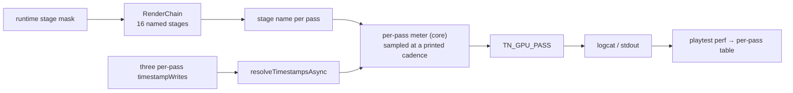
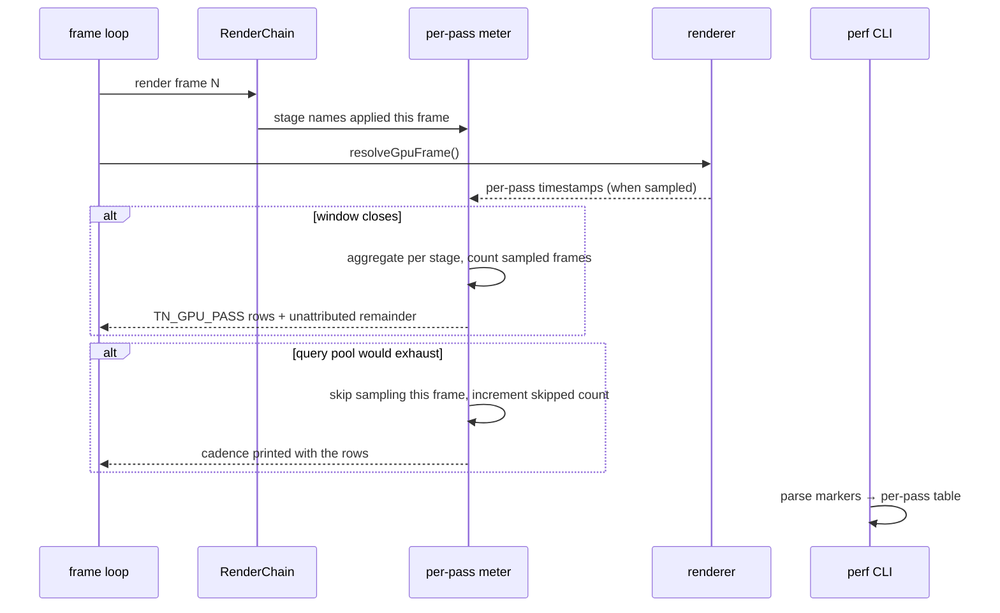

# PRD-308 — GPU time is attributed per pass, on the phone, from one build

**Status:** OPEN, filed 2026-08-31 against `2e014460`. Planning only.

**Outcome:** one run on one build prints, per render pass, what that pass cost the GPU this frame —
`TN_GPU_PASS ssr 6.31ms` — so answering "what is expensive" stops costing a rebuild-and-reinstall
per hypothesis. Three separate sessions have worked GPU cost out by rebuilding the app once per
experiment and pushing a settings file through `run-as`; the town pass (9–11 ms) is still the
biggest single cost in the frame ledger and is **still unattributed**.

**Depends on:** [PRD-305](PRD-305-the-gpu-meter-reports-on-android.md). If the Pixel 8 does not
grant `timestamp-query`, this PRD is retargeted rather than started — that is exactly what PRD-305
exists to find out.

**Unblocks:** [PRD-311](PRD-311-per-pass-gpu-cost-without-owning-a-phone.md), and the direction
document's Band 3 tasks 10 and 11 — both of which it **stop-gates**: if the numbers in *Where we
actually are* do not reproduce, the plan stops and is re-planned before LOD work starts.

**Task 5 of Band 2.** See [README](README.md) for the tick-back rule.

**Complexity: 7 → HIGH mode.** +2 (6–10 files), +2 (new measurement subsystem spanning JS and the
native host), +2 (multi-package: `core`, `playtest`, `runtime-native`), +1 (concurrency: async
timestamp resolution against a bounded query pool).

---

## 1. Context

**Problem:** the frame's GPU total is measurable (`gpuMs`) and its composition is not. Attribution
today is ablation: change the build, reinstall, run, difference. That is days per question, it
cannot see a pass that only exists in some frames, and it produced a table whose largest row —
the town, 9–11 ms — nobody can decompose.

**Files analysed:**

- `packages/core/src/render/chain.ts:9-31` — `RENDER_CHAIN_MARKER`, `RENDER_CHAIN_STAGE_ORDER` (16
  named stages), `RenderChainStageName`
- `packages/core/src/render/chain.ts:124-162` — `IRenderChainStage`, `IRenderChainApplied`,
  the applied/dropped report already emitted per run
- `packages/core/src/renderer.ts:143-152, 206, 253-261` — `gpuFrameMs()`,
  `resolveTimestampsAsync?(type?: string)`, `resolveGpuFrame()`
- `packages/core/src/game.ts:1010-1023` — the per-frame resolve and the comment recording the
  2048-query pool exhaustion (**2048 / (2 × 27 passes) = 38 frames**) that once silently zeroed the
  meter
- `packages/core/src/frame-budget.ts:163-168, 443-463` — window emission
- `packages/playtest/src/runner/perf.ts:24-25, 119-196, 344-393` — `TN_FRAME_BUDGET` /
  `TN_HOST_GAP` markers, the parser, and the report table
- `packages/runtime-native/src/webgpu/bindings_frame_stream.cpp:187-192, 273, 364-367` — render- and
  compute-pass `timestampWrites`, and `resolveQuerySet` (opcode 34)
- `packages/runtime-native/src/webgpu/bindings_commands.cpp:199-232` — `createQuerySet`, its 1–4096
  count bound, and its refusal without the grant

**Current behaviour:**

- three writes timestamps per render pass already — that is why the pool exhausts at 27 passes ×
  2 queries — and the engine reads only the **aggregate** back out.
- The chain knows every stage's name and whether it applied. Nothing joins those names to time.
- On device, the only delivery channel is logcat, and the only per-experiment control is a settings
  file pushed with `run-as`.

---

## 2. Solution

**Approach:**

- Join two things that already exist: the per-pass timestamps three already writes, and the stage
  names the render chain already reports. The meter reads back per-pass values and emits
  `TN_GPU_PASS <stage> <ms> <frames>` per budget window, in the same place `TN_FRAME_BUDGET` is
  emitted, so the existing logcat path carries it with no new transport.
- **Budget the query pool explicitly.** The pool holds 2048; a chain of 27 passes at 2 queries each
  exhausts it in 38 frames. Per-pass attribution must therefore sample — a stated cadence with the
  cadence printed — rather than instrument every frame and silently stop reporting, which is the
  exact failure this repository already paid for once.
- **One build answers many questions.** A runtime stage mask, read from the same source the chain's
  tier already uses, lets a device run turn individual stages off between windows and print the
  before/after in one log. No rebuild per hypothesis.
- Passes that are not chain stages — the world pass, shadows, the overlay — get reserved names in
  the same vocabulary (`world`, `shadow`, `overlay`) so the printed rows sum to the frame rather
  than leaving an unnamed remainder. A remainder is printed as `unattributed`, never hidden.
- `perf` parses the new marker and prints a per-pass table beside the window table, on all four
  targets, from a log file, an executable run, or `--logcat <serial>`.

**Architecture:**



**Key decisions:**

- [ ] No diagnostic-only build and no second renderer path. The same code measures in Chrome and on
      the phone, which is what makes a browser number comparable to a device number.
- [ ] Sampling cadence is **printed with the numbers**. A number whose sample rate is unstated is
      the wall-clock algebra this instrument exists to replace.
- [ ] Fail closed: a stage name with no matching pass, or a pass with no name, is reported as an
      error row, not dropped. A silently dropped row is how a 9–11 ms cost stays unattributed.
- [ ] The mask turns stages **off for measurement**; it never changes what a shipped game does by
      default. Turning a stage off does not turn its measurement off — the row still prints, at zero,
      with `off`.

**Data changes:** one new log marker. No manifest, no shipped artifact.

---

## 3. Sequence flow



---

## 4. Integration Ledger

| # | New thing | Live caller (`file:line`, non-test) | Replaces | Old path removed? | Negative control |
|---|---|---|---|---|---|
| 1 | per-pass meter | `packages/core/src/game.ts:~1023` beside `resolveGpuFrame()` — TBD | nothing | n/a | zero one stage's accumulator → its row must go to 0 and `unattributed` must rise by the same amount |
| 2 | `TN_GPU_PASS` marker | emitted from `frame-budget.ts` window close — TBD | the ablation method (kept as a cross-check, not deleted) | n/a | delete the emission → the perf table loses the section and a spec fails |
| 3 | `perf` per-pass table | `packages/playtest/src/runner/perf.ts` — TBD | nothing | n/a | feed a log with no `TN_GPU_PASS` → prints "not reported", never an empty green table |
| 4 | runtime stage mask | `RenderChain` request path — TBD | nothing | n/a | mask a stage → `TN_RENDER_CHAIN` must show it dropped **and** its `TN_GPU_PASS` row must read `off` |
| 5 | `docs/verification/gpu-pass-attribution-<date>.md` | read by PRD-311 and by the Band 3 stop-gate | the unattributed 9–11 ms town row | that row is replaced by its decomposition | a record that does not sum to the frame within its stated remainder fails checkpoint |

### Reachability

**How is this reached?** Frame path, then logcat. `game.ts` already resolves timestamps every frame
and `frame-budget.ts` already emits a window marker; both are edited, nothing new is registered.

**Pre-existing files edited:** `packages/core/src/game.ts`, `packages/core/src/frame-budget.ts`,
`packages/core/src/render/chain.ts`, `packages/playtest/src/runner/perf.ts`.

**Is this user-facing?** No — an instrument. Its consumer is an agent or an operator holding a log.

**Full flow:** run a scenario on device → each sampled frame records per-pass timings → the window
close prints one row per stage plus a remainder → `perf --logcat <serial>` renders the table →
the biggest row is the next thing to fix, and it has a name.

**What does this replace?** Ablation-based attribution as the *primary* method. Ablation stays as
the cross-check, and Phase 3 uses it to validate the instrument — an instrument agreeing with the
method it replaces is the only reason to trust it.

---

## 5. Execution phases

#### Phase 1: Per-pass timings exist in the browser, with a printed cadence

**Files (5):**

- `packages/core/src/render/gpu-pass-meter.ts` — NEW: accumulation, cadence, remainder
- `packages/core/src/game.ts` — EDIT: feed the meter beside `resolveGpuFrame()`
- `packages/core/src/frame-budget.ts` — EDIT: emit `TN_GPU_PASS` at window close
- `packages/core/src/render/chain.ts` — EDIT: expose the per-frame applied stage list to the meter
- `packages/core/__tests__/gpu-pass-meter.spec.ts` — NEW

**Implementation:**

- [ ] Cadence: sample every Nth frame such that queries in flight stay well under the 2048 pool for
      a 27-pass chain. N is computed from the observed pass count, printed, and never assumed.
- [ ] Rows sum to the frame: `Σ stages + world + shadow + overlay + unattributed = gpuMs`. The
      remainder is a printed row.
- [ ] A stage that applied but produced no timing prints `no-sample`, distinct from `0.00ms`.
- [ ] Fail closed: an unknown pass name throws in tests and prints an error row at runtime.

**Wiring:**

- [ ] Caller edited: `game.ts` frame path; `frame-budget.ts` window emission
- [ ] Registration: none — both paths already run every frame
- [ ] Ledger rows filled: #1, #2

**Tests required:**

| Test file | Test name | Assertion | Negative control (must be observed red) |
|---|---|---|---|
| `packages/core/__tests__/gpu-pass-meter.spec.ts` | `should attribute a pass's time to its stage name` | row present with the value | rename the stage → red |
| same | `should print the remainder when rows do not sum to the frame` | `unattributed` row | force rows to sum exactly → row must be 0, not absent |
| same | `should distinguish a stage that produced no sample from one that cost zero` | `no-sample` ≠ `0.00` | collapse the two → red |
| same | `should keep queries in flight below the pool bound` | computed cadence | set the chain to 27 passes and assert the cadence moves → red if fixed |
| same | `should report an error row for a pass with no known name` | error row | feed an unnamed pass → observed red before the guard |

**Revert check:** delete the meter feed in `game.ts` → `gpu-pass-meter.spec.ts` and one
`frame-budget` case fail. Paste both.

**User verification:** run a template scenario in Chrome with `--browser-recipe webgpu`; the log
shows one `TN_GPU_PASS` row per applied stage, a remainder, and the cadence.

---

#### Phase 2: `perf` renders it, and a device run prints it

**Files (5):**

- `packages/playtest/src/runner/perf.ts` — EDIT: parse and table the new marker
- `packages/playtest/__tests__/perf.spec.ts` — EDIT: parser and formatter cases
- `packages/playtest/AGENTS.md` — EDIT: the new table and how to read it
- `docs/verification/gpu-pass-attribution-<date>.md` — NEW: the first device run
- `docs/verification/runtime-perf-state.md` — EDIT: the town row replaced by its decomposition

**Implementation:**

- [ ] The table prints stages in `RENDER_CHAIN_STAGE_ORDER`, then the reserved names, then the
      remainder. Sorted output would hide which stage is which between runs.
- [ ] `perf --logcat <serial>` must work with no other change to the device lane.
- [ ] Device run on a cooled Pixel 8; record thermal state and battery at start, since the lane's
      floor bites after a handful of rungs.

**Wiring:**

- [ ] Caller edited: the perf report path
- [ ] Ledger rows filled: #3, #5

**Tests required:**

| Test file | Test name | Assertion | Negative control |
|---|---|---|---|
| `packages/playtest/__tests__/perf.spec.ts` | `should parse a TN_GPU_PASS row` | row parsed | malform the row → parser must report, not skip |
| same | `should print "not reported" when no per-pass rows are present` | explicit text | empty section → must not print an empty green table |
| same | `should keep the canonical stage order` | order preserved | sort the rows → red |

**Revert check:** remove the parser branch → two pre-existing perf cases fail.

**User verification:** `perf --logcat <serial>` on a real run; paste the table.

---

#### Phase 3: One build, many answers — the stage mask, and agreement with ablation

**Files (4):**

- `packages/core/src/render/chain.ts` — EDIT: the measurement stage mask
- `packages/core/__tests__/render-chain.spec.ts` — EDIT
- `docs/verification/gpu-pass-attribution-<date>.md` — EDIT: instrument-vs-ablation agreement
- `docs/architecture/FUTURE-ARCHITECTURE-DIRECTION.md` — EDIT: *Where we actually are* updated, or
  confirmed reproduced, per the stop-gate rule

**Implementation:**

- [ ] The mask is a measurement control: masking a stage prints its row as `off` and leaves every
      other row comparable. It does not alter defaults for a shipped game.
- [ ] **Agreement check:** for two stages, compare the instrument's number against an ablation of
      the same stage. Disagreement beyond the noise band means the instrument is wrong and Phase 1
      is not done — not that ablation was wrong.
- [ ] Apply the stop-gate: if the direction document's GPU numbers do not reproduce, say so in that
      document and stop before any Band 3 work is planned against them.

**Wiring:**

- [ ] Caller edited: `chain.ts` request path
- [ ] Ledger rows filled: #4

**Tests required:**

| Test file | Test name | Assertion | Negative control |
|---|---|---|---|
| `packages/core/__tests__/render-chain.spec.ts` | `should drop a masked stage and still report its row` | dropped + row `off` | suppress the row when masked → red |
| same | `should leave the default chain unchanged when nothing is masked` | applied set identical | change a default → red |

**Revert check:** mask a stage and confirm both `TN_RENDER_CHAIN` and `TN_GPU_PASS` change together;
suppress one and a spec fails.

**User verification:**

- Action: one device run that masks SSR for the second half
- Expected: one log containing both arms, and a difference matching the ablation within the band.

---

## 6. Verification plan

1. **Browser:** a template scenario under `--browser-recipe webgpu`, adapter named in the log so the
   run is not SwiftShader.
2. **Device:** cooled Pixel 8, `perf --logcat`, table pasted.
3. **Agreement:** two stages measured both ways, deltas pasted.
4. **Unit:** the three spec files above.
5. **Integration proof:**

```sh
# 1. The meter is fed from the frame path
grep -n "gpu-pass-meter\|TN_GPU_PASS" packages/core/src/game.ts packages/core/src/frame-budget.ts
# Expected: hits in both, not only in the meter module

# 2. perf consumes the marker
grep -n "TN_GPU_PASS" packages/playtest/src/runner/perf.ts
# Expected: a parser branch and a formatter branch

# 3. Rows sum to the frame in a real capture
grep -A20 "TN_GPU_PASS" docs/verification/gpu-pass-attribution-*.md
# Expected: a remainder row, and a stated cadence
```

6. **Negative controls, each with its observed red:** renamed stage; forced-exact sum; collapsed
   no-sample/zero; fixed cadence; unnamed pass; malformed row; sorted rows; suppressed masked row.

---

## 7. Acceptance criteria

- [ ] A single run on a Pixel 8 names the cost of every applied render stage, and the rows plus the
      remainder sum to the frame's `gpuMs`.
- [ ] The 9–11 ms town cost is **decomposed into named rows**, or the record states exactly which
      passes it is spread across and why the remainder is what it is.
- [ ] Two hypotheses can be answered from **one** build and one install, with the log showing both
      arms.
- [ ] The instrument agrees with ablation on two stages, within the recorded noise band, deltas
      pasted.
- [ ] The measurement never silently stops: exhausting the query pool changes the printed cadence,
      it does not empty the table.
- [ ] The direction document's GPU numbers are confirmed reproduced, or corrected, in the same
      commit — and if they do not reproduce, Band 3 planning stops, in writing.

**Integration gates:**

- [ ] Integration Ledger has zero `TBD` cells
- [ ] Caller census pasted for the meter, the marker and the parser
- [ ] Revert check pasted for the frame-path feed
- [ ] Every gate has an observed red, pasted
- [ ] Proved on the real subject: a full post chain on a phone, not a two-pass template in a browser
