# PRD-309 — Android conformance runs on every commit, or CI says out loud that it did not

**Status:** OPEN, filed 2026-08-31 against `2e014460`. Planning only.

**Outcome:** the Android conformance lane executes its rows on every commit and its result is
visible on the run, instead of a lane that stopped before Gradle on a stale dependency pin and
reported nothing. Every "runs everywhere" claim this project makes currently rests on a lane whose
last execution covered **0 rows**.

**Depends on:** nothing to start. Overlaps
[PRD-295](../native/PRD-295-the-native-platform-lane-has-never-been-green.md) (which made the lane
advisory and is fixing its desktop legs) and
[PRD-303](../CI/PRD-303.md) (which pays for added CI coverage from measured minutes). **This PRD
owns the Android leg only**; it does not promote the lane to required — that is PRD-295's call —
and it must not duplicate PRD-303's nightly-schedule work.

**Task 6 of Band 2.** See [README](README.md) for the tick-back rule.

**Complexity: 6 → MEDIUM mode.** +2 (6–10 files), +2 (CI surface plus a device/emulator lane),
+1 (external toolchain: Gradle, NDK, emulator image), +1 (wall-clock budget that must not regress).

---

## 1. Context

**Problem:** `native-platforms` runs only on `main` and behind `needs: test`, so for months it was
skipped entirely; when it finally ran, the Android leg did not reach the conformance rows at all.
A gate behind a permanently red gate is not a gate, and a lane that aborts before its first row is
not evidence.

**Files analysed:**

- `.github/workflows/native-platforms.yml:35-171` — the `android-emulator-parity` job: JDK, Python,
  `setup-android`, browser reference capture, KVM enable, `reactivecircus/android-emulator-runner`,
  the ledger verification step
- `.github/workflows/ci.yml:380-381` — the comment recording what this lane covers versus what the
  release claims
- `packages/runtime-native/conformance/registry.json` — 97 entries: **91 implemented**, 5 excluded,
  1 planned; by target, 13 android / 14 desktop / 13 ios / 13 web
- `packages/runtime-native/conformance/run-conformance.mjs:159-170` (usage),
  `:1954-1961` (`TN_PARITY_ANDROID_EMULATOR_REQUIRED` — `--target android` is the emulator lane and
  refuses a physical serial), `:2208` (per-target invocation), `:2266-2273` (target validation)
- `packages/runtime-native/conformance/check-lane-blocks.mjs:1-30` — the rule that any failure is
  fatal and any blocked row not explained by a software adapter or an unimplemented entry is fatal
- `packages/runtime-native/AGENTS.md` — the native contract and the device lanes
- `.github/workflows/native-release.yml:176-242` — the Android build steps that already work,
  including `THREENATIVE_GRADLE_ARGS` handling and the ABI staging

**Current behaviour:**

- The emulator job exists, is wired, and has never produced a row-level result on a commit.
- `check-lane-blocks.mjs` already encodes exactly the honesty this PRD needs: failures fatal,
  unexplained blocks fatal, software-adapter blocks allowed. Nothing consumes it on a per-commit
  basis for Android.
- `--target android` deliberately refuses a physical serial, so the CI lane and the local physical
  lane are different targets and must be reported separately.

---

## 2. Solution

**Approach:**

- **Fix the abort first, prove it locally.** The emulator lane is runnable on this machine (adb is
  on disk, off `PATH`), so the stale pin that stopped the job before Gradle is reproducible without
  burning CI minutes. Reproduce it, fix it, and paste the local run that reaches row 1.
- **Make "0 rows executed" impossible to report as anything but red.** A lane that produces a report
  with zero executed rows currently looks like a lane with nothing to say. Add an explicit
  row-count floor to the lane check: fewer rows executed than the registry declares for that target
  is a **failure**, named. This is the fail-closed rule this repository already states — an empty
  assertion set is a failure — applied to the conformance lane.
- **Run it on every commit, within a budget.** The Android leg moves from `main`-only to
  every-commit, and it stops depending on the full `test` job so a red elsewhere cannot silence it.
  Cost is contained by caching the emulator snapshot and the Gradle build, and the added wall clock
  is measured and recorded against PRD-303's budget rather than assumed to be free.
- **Report per-row, not per-job.** The job uploads the row-level report as an artifact and prints a
  one-line summary naming executed / passed / blocked / failed, so the next person does not have to
  open an artifact to learn the lane ran.

**Architecture:**

```mermaid
flowchart LR
  commit["push / PR"] --> job["android-emulator-parity"]
  job --> build["Gradle assemble (cached)"]
  build --> emu["emulator (snapshot cached)"]
  emu --> run["run-conformance.mjs --target android"]
  run --> report["report.json (13 android rows)"]
  report --> floor["row-count floor:<br/>executed >= declared"]
  floor --> lanes["check-lane-blocks.mjs"]
  lanes --> summary["one-line summary + artifact"]
```



**Key decisions:**

- [ ] No new conformance harness. `run-conformance.mjs` and `check-lane-blocks.mjs` already exist and
      already fail closed; this PRD makes them run and adds the one check they lack.
- [ ] The emulator lane and the physical-hardware lane stay separate targets, as
      `run-conformance.mjs:1954` already enforces. CI claims the emulator only.
- [ ] The lane stays advisory-or-required per PRD-295's decision. This PRD does not change the
      required-check set; it changes whether the lane produces evidence.
- [ ] Any minute added is paid for or recorded. PRD-303 owns the budget; this PRD reports its cost
      into it.

**Data changes:** none. One new artifact per run; no schema change to the registry.

---

## 3. Sequence flow

```mermaid
sequenceDiagram
    participant CI
    participant G as Gradle
    participant E as emulator
    participant R as run-conformance
    participant K as check-lane-blocks
    CI->>G: assemble (cache hit or build)
    alt build fails
        G-->>CI: red, naming the pin/target
    end
    CI->>E: boot with cached snapshot
    E-->>CI: ready
    CI->>R: --target android --out <dir>
    R-->>CI: report.json
    alt executed rows < declared android rows
        CI-->>CI: red — "the lane did not run", not "nothing to report"
    end
    CI->>K: check-lane-blocks report.json android
    K-->>CI: any failure fatal; unexplained block fatal
    CI-->>CI: one-line summary + artifact upload
```

---

## 4. Integration Ledger

| # | New thing | Live caller (`file:line`, non-test) | Replaces | Old path removed? | Negative control |
|---|---|---|---|---|---|
| 1 | row-count floor check | `packages/runtime-native/conformance/check-lane-blocks.mjs` — TBD | nothing | n/a | feed a report with 0 executed rows → must exit non-zero; feed a full report → must pass |
| 2 | every-commit Android trigger | `.github/workflows/native-platforms.yml` triggers — TBD | `main`-only + `needs: test` for this leg | the old gating is removed for this job only | break the Gradle pin on a branch → the PR goes red |
| 3 | emulator + Gradle caching | the job steps — TBD | uncached cold build | replaced in place | cold-cache run recorded once, so the saving is a number not a claim |
| 4 | one-line lane summary | the job's final step — TBD | reading an artifact | artifact still uploaded | a run with 13/13 rows must print 13, and a run with 0 must print 0 and be red |
| 5 | `docs/verification/android-conformance-<date>.md` | the evidence record | the absent record | n/a | a record claiming rows without a pasted report fails checkpoint |

### Reachability

**How is this reached?** CI trigger on push and pull request, and `pnpm parity --target android`
locally. Both call the same `run-conformance.mjs` entry point that exists today.

**Pre-existing files edited:** `.github/workflows/native-platforms.yml`,
`packages/runtime-native/conformance/check-lane-blocks.mjs`,
`packages/runtime-native/AGENTS.md`.

**Is this user-facing?** No — a CI lane. Its consumer is anyone who believes the "runs everywhere"
claim.

**Full flow:** a commit changes the runtime → the Android job builds and boots the emulator → 13
conformance rows execute → the floor check confirms 13 were executed → `check-lane-blocks` judges
them → the summary line says so on the run page.

**What does this replace?** The `main`-only, `needs: test`-gated trigger **for this job**. It is
removed, not left beside the new one — two triggers for one job is how a lane ends up skipped
without anyone noticing.

---

## 5. Execution phases

#### Phase 1: Reproduce the abort locally and reach row 1

**Files (3):**

- `packages/runtime-native/android/` build config — EDIT: the stale pin (exact file named once
  reproduced; likely a dependency or SDK version)
- `docs/verification/android-conformance-<date>.md` — NEW: the local run that reaches the rows
- `packages/runtime-native/AGENTS.md` — EDIT: the pin and how the lane is run locally

**Implementation:**

- [ ] Reproduce with the local emulator lane before touching CI. `adb` is present on this machine
      but off `PATH`; the blocked-reason folders in `docs/PRDs/BLOCKED/` have outlived their
      conditions before, so attempt the step and record what actually happened.
- [ ] JDK 17 for Gradle — a newer JDK fails with a bare version string and looks like an unrelated
      error.
- [ ] `pnpm parity --target android` and paste the first row-level output the lane has produced.

**Wiring:** the fix is to an existing build path; no new code is called.

**Tests required:** none new in this phase — the gate is the pasted local run reaching row 1.

**Revert check:** restore the pin → the lane aborts again at the same point, pasted. That paired
red/green is what proves the pin was the cause rather than a coincidence.

**User verification:** `pnpm parity --target android` locally; rows execute.

---

#### Phase 2: Zero executed rows becomes a failure

**Files (3):**

- `packages/runtime-native/conformance/check-lane-blocks.mjs` — EDIT: row-count floor per target,
  read from the registry
- `packages/runtime-native/__tests__/check-lane-blocks.spec.ts` — NEW or EDIT
- `packages/runtime-native/conformance/README.md` — EDIT: the floor and its rationale

**Implementation:**

- [ ] The floor is derived from `registry.json` for the target, so adding a row raises the floor
      automatically. A hardcoded 13 would drift the first time a row is added.
- [ ] Excluded rows do not count toward the floor; `planned` rows are named in the message rather
      than silently reducing it.
- [ ] Message names the shortfall: `executed 0 of 13 android rows`.

**Wiring:**

- [ ] Caller edited: the existing lane check, already invoked by the workflow
- [ ] Ledger rows filled: #1

**Tests required:**

| Test file | Test name | Assertion | Negative control (must be observed red) |
|---|---|---|---|
| `check-lane-blocks.spec.ts` | `should fail when the report executed no rows` | exit non-zero, message names 0 of 13 | full report → passes, proving it is not always-red |
| same | `should raise the floor when the registry gains a row` | floor moves | hardcode the count → red |
| same | `should not count excluded rows toward the floor` | floor excludes them | count them → red |
| same | `should still fail on an unexplained blocked row` | pre-existing behaviour intact | remove the allowance logic → red |

**Revert check:** revert the floor and feed a zero-row report → the check passes, which is the bug.
Paste that pass, then the fix, then the red.

**User verification:** run the check against the Phase 1 report and against a truncated copy.

---

#### Phase 3: Every commit, with the cost recorded

**Files (4):**

- `.github/workflows/native-platforms.yml` — EDIT: trigger, `needs:`, caching, summary step
- `.github/workflows/ci.yml` — EDIT: the comment at `:380-381` updated to say what now runs
- `docs/verification/android-conformance-<date>.md` — EDIT: the first CI run, with wall clock
- `docs/PRDs/CI/PRD-303.md` — EDIT: the minutes this leg adds, recorded against its budget

**Implementation:**

- [ ] The Android job's `needs:` drops the dependency that made it skippable; a red elsewhere must
      not silence it.
- [ ] Cache the emulator snapshot and the Gradle build; record cold and warm wall clock separately.
      A caching claim with one measurement is not a measurement.
- [ ] The summary step prints `android conformance: executed N/13, passed P, blocked B, failed F`
      to the job summary, always — including on failure.
- [ ] Do not add a schedule here. PRD-303 owns the nightly lane; two schedules for one concern is
      the duplication that PRD warns about.

**Wiring:**

- [ ] Caller edited: the workflow
- [ ] Old path: the `main`-only trigger for this job is deleted
- [ ] Ledger rows filled: #2, #3, #4, #5

**Tests required:** the workflow is proved by execution, not by unit test. The evidence is two CI
runs: one green with N = 13, one deliberately red.

**Revert check:** push a branch that breaks the Android build → the PR is red and the summary names
the failure. Paste the run URL and the summary line.

**User verification:** open a PR; the Android conformance summary appears on it.

---

## 6. Verification plan

1. **Local:** `pnpm parity --target android`, rows executed, pasted.
2. **Unit:** `check-lane-blocks.spec.ts`, four cases above.
3. **CI:** one green run and one deliberately red run, both linked and both with their summary line
   pasted.
4. **Integration proof:**

```sh
# 1. The floor is derived, not hardcoded
grep -n "registry" packages/runtime-native/conformance/check-lane-blocks.mjs
# Expected: the target's row count read from the registry

# 2. The job no longer hides behind another job
grep -n "needs:" .github/workflows/native-platforms.yml
# Expected: the android job's needs no longer includes the gate that skipped it

# 3. Evidence exists at row level
grep -c '"status"' docs/verification/android-conformance-*.md
# Expected: non-zero
```

5. **Negative controls, each with its observed red:** zero-row report; hardcoded floor; excluded
   rows counted; removed block allowance; broken Android build on a branch.

---

## 7. Acceptance criteria

- [ ] A pull request that breaks the Android runtime is **red on that pull request**, not on a
      `main` run days later.
- [ ] A run that executes no rows is red and says `executed 0 of 13`, rather than producing a report
      nobody reads as a failure.
- [ ] The row-level result is visible from the run page without downloading an artifact.
- [ ] Adding a row to the Android registry raises the floor without anyone editing the check.
- [ ] The added wall clock is a recorded number in both cold and warm cache states, filed against
      PRD-303's budget.
- [ ] `docs/verification/` holds the first Android conformance record this repository has ever had
      at row level.

**Integration gates:**

- [ ] Integration Ledger has zero `TBD` cells
- [ ] Caller census pasted: the floor runs inside the lane check the workflow already calls
- [ ] Revert check pasted: reverting the floor lets a zero-row report pass
- [ ] The old `main`-only trigger for this job is deleted, not left beside the new one
- [ ] Every gate has an observed red, pasted, including a deliberately red CI run
- [ ] Proved on the real subject: the emulator lane executing the Android registry rows, not a
      dry-run or a desktop target standing in for it
