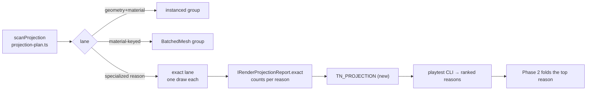

# PRD-310 — The projection covers what moves, and the exact lane is measured before it is extended

**Status:** OPEN, filed 2026-08-31 against `2e014460`. Planning only.

**Outcome:** the draws a real game leaves on the projection's exact lane are **counted by reason**
first, and then the largest reason is folded — so the lever already worth **780 → 315 draws**
(34.6 → 53 fps, 0 of 921,600 pixels changed) reaches the population that actually costs the frame,
without the game changing a line.

**Depends on:** nothing.

**Task 7 of Band 2.** See [README](README.md) for the tick-back rule.

---

## A correction that decides this PRD's first phase

The direction document says the projection *"today only covers meshes that never move"*. Read
against the code, that is not what it does:

- `packages/core/src/projection-apply.ts:586-593` and `:802-809` — reconciliation compares each
  member's `matrixWorld` against its stored copy and writes `setMatrixAt` when it changed. **A moved
  member is a matrix write, not an eviction.** The class comment at `renderProjection.ts:31-34` says
  so explicitly, and that affordability is the design's premise.
- What actually leaves the batched lanes is a **kind** of object, not a moving one:
  `projection-plan.ts:87-96` routes sprites, points/lines, already-instanced or batched meshes,
  skinned meshes, multi-material meshes and custom-depth meshes to the exact lane, one draw each.
  `LOD` subtrees are mirrored whole (`projection-plan.ts:833-840` comment).

In a real game the moving things are mostly **skinned characters** — and the ablation table's
"sky and soldiers ≈ 6.9 ms" is exactly that population. So "make it cover things that move" almost
certainly means "fold the skinned lane", which is a different and much harder change than relaxing a
staticness test that does not exist.

**Phase 1 therefore measures the exact lane by reason before anything is built.** The instrument
already exists: `IRenderProjectionReport` carries
`exact: Partial<Record<ProjectionExactReason, number>>` (`renderProjection.ts:88-93, 301-302`) and
nothing reads it in a device run. This is a day of work that decides whether the rest is weeks of
the right work or weeks of the wrong work.

**Complexity: 7 → HIGH mode.** +2 (6–10 files), +2 (complex state: an optimizer that must stay
correct frame-to-frame or produce wrong pictures rather than slow ones), +2 (new mechanism in
`packages/core`), +1 (a measurement gating the design).

---

## 1. Context

**Problem:** the projection folds a large population into few draws and gives the rest one draw
each. Nobody has measured what the rest **is** in a game that runs out of GPU, so the next extension
would be chosen by intuition — and this repository's intuition about what is slow has been wrong
twice.

**Files analysed:**

- `packages/core/src/renderProjection.ts:12-40` — the ownership inversion: correct rendering
  unconditional, optimization opportunistic
- `:44-70` — `ProjectionReasonCode`, `ProjectionExactReason` (`instanced`, `skinned`, `morph`,
  `multiMaterial`, `drawRange`, `indirect`, `customDepthMaterial`, `lod`, …)
- `:88-93, 301-302` — the report's per-lane and per-reason counts
- `:110, 127, 296-298` — `onReport`, and the note that deoptimization is visible through a live
  report
- `packages/core/src/projection-plan.ts:64-96` — `isRenderable`, `specializedLaneReason`
- `:493-534` — `addToBatchGroup` (geometry × material × flags)
- `:587-617` — `addToMaterialGroup`, and `streamedGeometries`: a geometry caught changing under a
  built batch is **barred for good**
- `:763-812` — grouping, `MIN_BATCH_MEMBERS`, `predictDraws`, and the note that a `BatchedMesh`
  still executes one sub-draw per visible member on WebGPU
- `:833-880` — the worthwhile ratio and the decline paths
- `packages/core/src/projection-apply.ts:361-386` — the negative-determinant refusal
- `packages/core/src/game.ts:1001-1007` — `reconcile()` / `commit()` around the render

**Current behaviour:**

- Two folding lanes: instanced (same geometry + material + flags) and material-keyed `BatchedMesh`
  (distinct geometries, shared surface).
- Everything else draws once, by an enumerated reason, and the reasons are counted but not
  surfaced in any run this repository has recorded.
- Moved members reconcile by matrix write; changed geometry evicts and bars.

---

## 2. Solution

**Approach:**

- **Phase 1 — count the exact lane by reason, in a real game, on a device.** Emit the existing
  report as a marker (`TN_PROJECTION`) and read it with the playtest CLI. Output is a ranked list:
  *this many draws for this reason.*
- **Phase 2 — fold the largest reason.** The candidate this PRD expects is `skinned`, and the shape
  is already scoped elsewhere: `PRD-258` (many actors share one animation texture) sits in
  `BLOCKED/requires-runnable-many-soldier-consumer/` waiting for exactly the consumer Phase 1
  produces. If Phase 1 names a different reason, Phase 2 targets that one instead and says so.
- Whatever is folded obeys the existing contract without exception: the authored scene is untouched,
  a mirror that cannot reproduce something faithfully is abandoned for that frame, and the fallback
  is a correct slow path rather than an error.
- **Correctness gates come before draw-count gates.** A projection defect is a wrong picture, not a
  slow one; this repository has already shipped a pass that "reported success" while dropping
  instances.

**Architecture:**



**Key decisions:**

- [ ] No new game-facing API, no annotation, no opt-in. The projection is invisible by construction
      and stays so; a change that needs the game to mark meshes is refused.
- [ ] The report marker prints even when the projection **declines** — a declined frame with its
      reason is the most useful line in the log, and suppressing it is how "it did nothing" gets
      mistaken for "it had nothing to do".
- [ ] Draw counts are read from the renderer, not predicted. `predictDraws` is a plan; the gate
      compares plan against what the backend was actually handed, because a `BatchedMesh` issues one
      sub-draw per visible member on WebGPU and a report that says "1 draw" there would be a lie.
- [ ] Fail closed: an unknown reason code throws.

**Data changes:** one new log marker. No shipped artifact.

---

## 3. Sequence flow

```mermaid
sequenceDiagram
    participant L as frame loop
    participant P as RenderProjection
    participant M as mirror
    participant R as renderer
    L->>P: reconcile()
    P->>P: scan → plan (fold | decline + reason)
    alt cannot reproduce faithfully
        P-->>L: abandon mirror this frame; render authored scene
    end
    P->>M: apply plan (matrix writes for moved members)
    L->>R: render(mirror root)
    L->>P: commit()
    P-->>L: TN_PROJECTION { batched, exact-by-reason, declined, drawsPlanned, drawsActual }
```

---

## 4. Integration Ledger

| # | New thing | Live caller (`file:line`, non-test) | Replaces | Old path removed? | Negative control |
|---|---|---|---|---|---|
| 1 | `TN_PROJECTION` marker | emitted from the projection commit path, `packages/core/src/game.ts:~1006` — TBD | nothing; `onReport` stays the programmatic seam | n/a | force a decline → the marker must print the decline reason, not vanish |
| 2 | playtest parse + ranked table | `packages/playtest/src/runner/perf.ts` — TBD | nothing | n/a | log with no marker → "not reported", never an empty green table |
| 3 | the folding change for the top reason | `projection-plan.ts` lane routing — TBD | that reason's exact-lane path | the exact lane stays as the fallback **by design** | disable the new lane → draw count returns to the Phase 1 number, and the picture must be identical in both |
| 4 | `docs/verification/projection-exact-lane-<date>.md` | read by Phase 2 and by PRD-258 | the doc's "meshes that never move" phrasing | that phrasing is corrected in the same commit | a record without per-reason counts fails checkpoint |
| 5 | pixel-parity gate for the new lane | `pnpm visuals` comparison — TBD | nothing | n/a | perturb one member's matrix by a pixel → the gate must go red |

### Reachability

**How is this reached?** Frame path. `game.ts:1001-1007` already calls `reconcile()` before the
render and `commit()` after it; both edits land on lines that execute every frame of every game.

**Pre-existing files edited:** `packages/core/src/renderProjection.ts`,
`packages/core/src/projection-plan.ts`, `packages/core/src/game.ts`,
`packages/playtest/src/runner/perf.ts`.

**Is this user-facing?** Yes in effect, no in interface: frame rate changes, the game's source does
not. That is the rule the whole direction document obeys.

**Full flow:** a game runs → the projection reports its lanes each window → the log ranks the exact
lane by reason → the top reason is folded → the same scenario draws fewer times, at the same pixels.

**What does this replace?** For the folded reason, the one-draw-each path — which remains as the
correctness fallback and is documented as such, not as dead code.

---

## 5. Execution phases

#### Phase 1: Rank the exact lane by reason, in a real game

**Files (5):**

- `packages/core/src/renderProjection.ts` — EDIT: assemble the marker payload (draws planned and
  actual, per-reason counts, decline reason)
- `packages/core/src/game.ts` — EDIT: emit it at the window boundary beside the existing markers
- `packages/playtest/src/runner/perf.ts` — EDIT: parse and rank
- `packages/core/__tests__/render-projection.spec.ts` — EDIT: marker cases
- `docs/verification/projection-exact-lane-<date>.md` — NEW: the ranked result for a real game

**Implementation:**

- [ ] Subject is a game that runs out of GPU with characters in it — not a template whose scene is
      small enough to fall below the mesh floor and decline.
- [ ] Report both `drawsPlanned` and `drawsActual`; a divergence is itself a finding, given the
      per-member sub-draw behaviour of `BatchedMesh` on WebGPU.
- [ ] Print on decline, with the reason code.
- [ ] Cross-check the top reason against the frame ledger: if `skinned` dominates the exact lane and
      the soldiers cost ~6.9 ms, PRD-258 becomes the Phase 2 shape and is unblocked by this record.

**Wiring:**

- [ ] Caller edited: the commit path in `game.ts`
- [ ] Registration: none — the projection already runs every frame
- [ ] Ledger rows filled: #1, #2, #4

**Tests required:**

| Test file | Test name | Assertion | Negative control (must be observed red) |
|---|---|---|---|
| `render-projection.spec.ts` | `should report a per-reason count for every exact-lane object` | counts match the fixture | route one mesh to a different reason → red |
| same | `should emit the marker with its reason when the projection declines` | decline reason present | suppress on decline → red |
| same | `should report actual draws separately from planned draws` | two distinct fields | alias them → red |
| `perf.spec.ts` | `should rank reasons by draw count` | order | shuffle → red |

**Revert check:** delete the marker emission → two pre-existing projection cases and one perf case
fail.

**User verification:** run the subject; read the ranked table; the largest reason has a name and a
number.

---

#### Phase 2: Fold the largest reason — correctness first

**Files (5):**

- `packages/core/src/projection-plan.ts` — EDIT: admit the target population to a folding lane
- `packages/core/src/projection-apply.ts` — EDIT: apply and reconcile it, including the abandon path
- `packages/core/src/renderProjection.ts` — EDIT: the reason bookkeeping for the new lane
- `packages/core/__tests__/render-projection.spec.ts` — EDIT: correctness cases first
- `docs/verification/projection-exact-lane-<date>.md` — EDIT: before/after draws and pixels

**Implementation:**

- [ ] Correctness cases land **before** the fold: a member that changes geometry mid-run, a member
      hidden mid-run, a negatively-scaled member (`projection-apply.ts:361-386` already refuses
      these for `setMatrixAt`), a member removed from the scene, and a raycast that must still hit
      the authored object.
- [ ] The fold must abandon to the exact lane on any condition it cannot reproduce, per frame, with
      the reason recorded — the same contract the existing lanes obey.
- [ ] Draw-count improvement is the second gate; pixel equality is the first.
- [ ] If the top reason is `skinned`, follow PRD-258's shape rather than inventing a second one, and
      say in that PRD's file that its blocking consumer now exists.

**Wiring:**

- [ ] Caller edited: the lane routing in `projection-plan.ts`
- [ ] Old path: the exact lane remains as the documented fallback
- [ ] Ledger rows filled: #3, #5

**Tests required:**

| Test file | Test name | Assertion | Negative control (must be observed red) |
|---|---|---|---|
| `render-projection.spec.ts` | `should render identical pixels with the new lane enabled and disabled` | capture equality within the band | perturb one matrix → red |
| same | `should abandon the new lane when a member cannot be reproduced` | falls back, reason recorded | remove the abandon path → red, with a wrong picture rather than a slow one |
| same | `should keep raycasts hitting the authored object` | hit is the authored mesh | mirror the raycast target → red |
| same | `should reduce actual draws for the target population` | drawsActual falls | disable the lane → returns to the Phase 1 number |
| same | `should evict a member whose geometry changes under a built batch` | eviction + bar | drop the stream watch → red |

**Revert check:** disable the new lane behind its internal fallback → the draw count returns to
Phase 1's number and the captures stay identical. Both halves pasted.

**User verification:**

- Action: run the subject before and after, on the device
- Expected: fewer draws, the same picture, and a frame-time delta recorded against the standing
  ≥ 2 ms threshold.

---

## 6. Verification plan

1. **Unit:** `packages/core/__tests__/render-projection.spec.ts` — correctness cases first, count
   cases second.
2. **Playtest:** the subject game, before/after, with captures diffed within the recorded noise band.
3. **Device:** frame-time delta on a cooled Pixel 8; desktop A/Bs read `render.p50`, never fps,
   because a private Xvfb throttles presents.
4. **Integration proof:**

```sh
# 1. The marker is emitted from the frame path, not only from a test
grep -n "TN_PROJECTION" packages/core/src/game.ts packages/core/src/renderProjection.ts
# Expected: an emission on the commit path

# 2. The new lane has a live route, not just a definition
grep -n "specializedLaneReason" packages/core/src/projection-plan.ts
# Expected: the target reason no longer returns unconditionally

# 3. The fallback still exists
grep -n "abandon\|exactLane" packages/core/src/projection-apply.ts | head
# Expected: the exact lane remains reachable
```

5. **Negative controls, each with its observed red:** re-routed reason; suppressed decline marker;
   aliased draw fields; shuffled ranking; perturbed matrix; removed abandon path; mirrored raycast;
   disabled lane; dropped stream watch.

---

## 7. Acceptance criteria

- [ ] For a real game that runs out of GPU, the exact lane's composition is a **ranked list of
      reasons with counts**, recorded in `docs/verification/`.
- [ ] The largest reason is folded, and the same scenario draws measurably fewer times.
- [ ] The picture is unchanged: captures before and after are within the recorded same-code noise
      band, pasted — the 780 → 315 precedent moved zero of 921,600 pixels and this must meet the same
      bar.
- [ ] A member the new lane cannot reproduce falls back per frame with its reason recorded, and no
      game code changed to make that safe.
- [ ] Raycasting, traversal, names and parents in the authored scene are untouched, proved by test.
- [ ] The direction document's "meshes that never move" phrasing is corrected to what the code does,
      in the same commit as Phase 1.

**Integration gates:**

- [ ] Integration Ledger has zero `TBD` cells
- [ ] Caller census pasted for the marker and the lane route
- [ ] Revert check pasted: disabling the lane restores the old draw count with identical pixels
- [ ] The exact-lane fallback is kept deliberately and documented as the correctness path
- [ ] Every gate has an observed red, pasted
- [ ] Proved on the real subject: a GPU-bound game with characters, not a template that declines
      below the mesh floor
