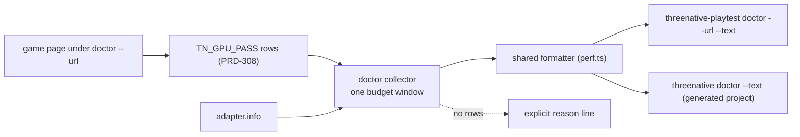
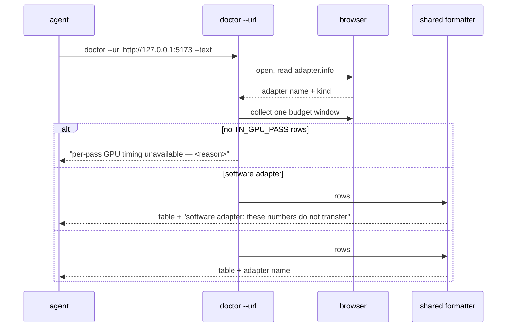

# PRD-311 — An agent sees the per-pass GPU cost without owning a phone

**Status:** OPEN, filed 2026-08-31 against `2e014460`. Planning only.

**Outcome:** `doctor --url <url>` prints, for the scene it just looked at, what each render pass
costs the GPU — and names the adapter it measured on, so a browser number is never mistaken for a
device number. An agent building a game on a laptop can see that its post chain is 12.5 ms of a
14.7 ms frame, without a Pixel 8 and without reading a native log.

**Depends on:** [PRD-308](PRD-308-gpu-time-is-attributed-per-pass-on-the-phone.md), which produces
the `TN_GPU_PASS` rows this PRD surfaces. Filing it now fixes the consumer's shape while PRD-308 is
being built; **it must not be started before PRD-308's rows exist**, or it will read a marker nobody
emits and report an empty table as health.

**Task 8 of Band 2.** See [README](README.md) for the tick-back rule.

**Complexity: 4 → MEDIUM mode.** +1 (1–5 files), +2 (multi-package: `playtest` and
`create-threenative`), +1 (a report surface that must fail closed on absent data).

---

## 1. Context

**Problem:** the numbers PRD-308 produces land in a log an operator reads on a device lane. The
people who most need them — agents writing games, on machines with no phone attached — have no path
to them. A measurement only one person can reach is a measurement that does not change what gets
built.

**Files analysed:**

- `packages/playtest/src/runner/cli.ts:133-135` — the three doctor modes: *can this machine run a
  playtest*, `--url` adds *and here is the scene at a glance*, `--device` adds *is the phone cool
  enough to measure on*
- `packages/playtest/src/runner/cli.ts:150-184` — `doctorCommand`, its fail-closed argument parsing,
  and `doctorBrowserArgs`
- `packages/playtest/src/runner/doctor.ts:39, 164` — `diagnoseHarness`, `diagnoseDevice`,
  `readDeviceProbe`, `formatDoctorReport`, and the adb discovery note
- `packages/playtest/src/diagnostics.ts:1-34` — `PlaytestDiagnosticCode`,
  `IPlaytestProtocolDiagnostic`, `playtestDiagnostic`
- `packages/playtest/src/runner/perf.ts:344-393` — `formatPerfReport`, the existing table this one
  sits beside
- `packages/create-threenative/src/doctor.ts:22` and `src/threenative.ts:8-10` — the generated
  project's own `threenative doctor`
- `packages/core/src/render/chain.ts:9-31` — the stage vocabulary the rows are keyed by

**Current behaviour:**

- `doctor --url` already opens the scene and reports what it sees; it reports no GPU timing.
- `perf` prints frame-budget windows and, after PRD-308, per-pass rows — but only from a log the
  caller already has.
- `threenative doctor` inside a generated project checks build assumptions and says nothing about
  performance.

---

## 2. Solution

**Approach:**

- Extend the existing `doctor --url` path: after its scene look, collect one budget window's worth
  of `TN_GPU_PASS` rows from the page's own log stream and print them through the same formatter
  `perf` uses. One vocabulary, two entry points, no second implementation of the table.
- **Name the adapter beside the numbers, always.** A WebGPU run that does not name its adapter may
  be SwiftShader, and a SwiftShader per-pass table is worse than no table because it looks
  authoritative. If the adapter is software, the rows print with an explicit banner saying the
  numbers do not transfer.
- **Fail closed:** no rows collected prints *"per-pass GPU timing unavailable — <reason>"*, never an
  empty table and never a green line. The reasons are the same three PRD-305 established: adapter
  has no `timestamp-query`, feature not granted, nothing sampled in the window.
- Surface the same section from `threenative doctor --text` in a generated project, so the agent
  building a game reaches it without knowing this repository exists.

**Architecture:**



**Key decisions:**

- [ ] One formatter, shared with `perf`. Two tables that could disagree is the twin-constant failure
      this repository names; the table is defined once and imported.
- [ ] `doctor` stays a diagnostic, not a benchmark: one window, clearly labelled, with the adapter
      named. It never prints an fps verdict — desktop presents are throttled under a private Xvfb
      and an fps number from this surface would be wrong by construction.
- [ ] No new marker, no new transport, no engine change. This PRD is entirely a consumer.

**Data changes:** none.

---

## 3. Sequence flow



---

## 4. Integration Ledger

| # | New thing | Live caller (`file:line`, non-test) | Replaces | Old path removed? | Negative control |
|---|---|---|---|---|---|
| 1 | per-pass section in the doctor report | `packages/playtest/src/runner/doctor.ts` `formatDoctorReport` — TBD | nothing | n/a | run against a page with no rows → prints a reason, never an empty table |
| 2 | shared row formatter | extracted from `perf.ts:344-393`, imported by both — TBD | the perf-local formatter | perf now imports it — one definition | change the shared format → **both** outputs change in the same test run |
| 3 | adapter banner | the doctor report — TBD | nothing | n/a | force a software adapter → banner must appear and the table must be labelled |
| 4 | section in `threenative doctor --text` | `packages/create-threenative/src/doctor.ts` — TBD | nothing | n/a | generated project with no running page → explicit reason, not silence |

### Reachability

**How is this reached?** CLI. `threenative-playtest doctor --url` is documented in the root
`AGENTS.md` as the first thing to run when a gate fails for a reason that is not the game, and
`threenative doctor --text` ships inside every generated project.

**Pre-existing files edited:** `packages/playtest/src/runner/doctor.ts`,
`packages/playtest/src/runner/perf.ts` (formatter extraction),
`packages/create-threenative/src/doctor.ts`.

**Is this user-facing?** Yes — the user is an agent building a game, and this is the surface it
already reaches for.

**Full flow:** an agent's game feels slow → it runs `doctor --url` → the report names the adapter
and prints the per-pass table → the largest row is the thing to change, and it is a stage name the
agent can find in its own `src/render/quality.ts` (PRD-304).

**What does this replace?** The perf-local formatter, which becomes an import. Nothing is duplicated.

---

## 5. Execution phases

#### Phase 1: One formatter, two callers

**Files (4):**

- `packages/playtest/src/runner/gpu-pass-table.ts` — NEW: the shared formatter
- `packages/playtest/src/runner/perf.ts` — EDIT: import it, delete the local version
- `packages/playtest/src/runner/doctor.ts` — EDIT: collect rows, print the section, name the adapter
- `packages/playtest/__tests__/doctor.spec.ts` — EDIT: the new section's cases

**Implementation:**

- [ ] Extract first, then consume. `perf`'s output must be byte-identical before and after the
      extraction — prove it with a golden fixture, so the refactor cannot quietly change the
      instrument that PRD-308's record was written against.
- [ ] Collect exactly one budget window and say so in the heading.
- [ ] Read `adapter.info` and print it on the same line as the heading. A run that cannot name its
      adapter prints `adapter: unknown` and the banner.
- [ ] Fail closed on absent rows with one of the three named reasons.

**Wiring:**

- [ ] Caller edited: `doctor.ts` report path, `perf.ts` import
- [ ] Old path: the perf-local formatter is deleted, not left beside the shared one
- [ ] Ledger rows filled: #1, #2, #3

**Tests required:**

| Test file | Test name | Assertion | Negative control (must be observed red) |
|---|---|---|---|
| `packages/playtest/__tests__/perf.spec.ts` | `should format per-pass rows identically to the pre-extraction golden` | byte-equal | change one column → red |
| `packages/playtest/__tests__/doctor.spec.ts` | `should print the per-pass table with the adapter named` | adapter in the heading | strip the adapter read → red |
| same | `should print an explicit reason when no rows were collected` | reason text | print an empty table → red |
| same | `should label a software adapter's numbers as non-transferable` | banner present | run with a hardware fixture → banner absent, proving it is conditional |

**Revert check:** delete the shared formatter → both `perf` and `doctor` fail to compile, and the
golden test fails. Paste it.

**User verification:**

- Action: `node packages/playtest/dist/runner/cli.js doctor --url http://127.0.0.1:5173 --text`
- Expected: the scene summary, the adapter name, and one row per applied render stage.

---

#### Phase 2: The generated project's own doctor says it too

**Files (3):**

- `packages/create-threenative/src/doctor.ts` — EDIT: the section, reusing the same formatter
- `packages/create-threenative/__tests__/doctor.spec.ts` — EDIT
- `packages/create-threenative/templates/*/AGENTS.md` — EDIT: one line telling an agent to run it,
  because a convention absent from the templates' AGENTS.md does not exist

**Implementation:**

- [ ] The generated project's doctor must not require a running dev server to succeed; without one
      it prints the reason and stays green on the checks it can do. A performance section that turns
      `threenative doctor` red on a project with nothing running would be a false gate.
- [ ] Same vocabulary as `src/render/quality.ts` (PRD-304), so the stage the table names is the
      stage the agent can switch off.

**Wiring:**

- [ ] Caller edited: the generated project's doctor report
- [ ] Ledger rows filled: #4

**Tests required:**

| Test file | Test name | Assertion | Negative control |
|---|---|---|---|
| `packages/create-threenative/__tests__/doctor.spec.ts` | `should print the per-pass section when a page is reachable` | section present | unreachable page → reason line |
| same | `should not fail the project doctor when no page is running` | exit 0 with a reason | make it fatal → red |

**Revert check:** remove the section → a doctor spec fails.

**User verification:** scaffold a template, `pnpm dev`, `npx threenative doctor --text` — the table
appears, keyed by the same stage names as `src/render/quality.ts`.

---

## 6. Verification plan

1. **Unit:** `perf.spec.ts` golden equality, `doctor.spec.ts` sections, `create-threenative`
   doctor cases.
2. **End-to-end:** `doctor --url` against a running template with `--browser-recipe webgpu`, adapter
   named in the output; and once against a deliberately software adapter to see the banner.
3. **Integration proof:**

```sh
# 1. One formatter, two consumers
grep -rn "gpu-pass-table" packages/playtest/src packages/create-threenative/src
# Expected: one definition, at least two importers

# 2. The perf-local formatter is gone
grep -n "function formatGpuPass" packages/playtest/src/runner/perf.ts
# Expected: no output

# 3. The doctor section is reachable from the shipped CLI
grep -n "per-pass" packages/playtest/src/runner/doctor.ts packages/create-threenative/src/doctor.ts
# Expected: hits in both
```

4. **Negative controls, each with its observed red:** changed column; stripped adapter read; empty
   table printed; hardware fixture showing no banner; unreachable page made fatal.

---

## 7. Acceptance criteria

- [ ] An agent with no phone runs one command and learns which render pass costs the most in its own
      game, by name.
- [ ] Every printed table names the adapter it measured on, and a software adapter's numbers carry
      an explicit non-transferable banner.
- [ ] No rows collected prints a reason from the three named causes — never an empty table and never
      a green line implying health.
- [ ] The `perf` output is byte-identical to its pre-extraction golden, so PRD-308's record stays
      readable against the same format.
- [ ] The stage names in the table match the switch names in `src/render/quality.ts`, so seeing the
      cost and changing it are the same vocabulary.
- [ ] `threenative doctor` on a project with nothing running stays green and says why the section is
      absent.

**Integration gates:**

- [ ] Integration Ledger has zero `TBD` cells
- [ ] Caller census pasted: one formatter, two importers
- [ ] Revert check pasted: deleting the formatter breaks both consumers
- [ ] The perf-local formatter is deleted, not duplicated
- [ ] Every gate has an observed red, pasted
- [ ] Proved on the real subject: a game with a full post chain, on a hardware adapter, plus one
      deliberate software-adapter run to prove the banner fires
