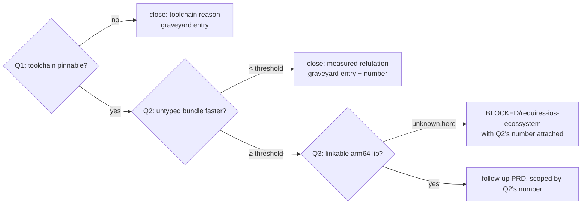
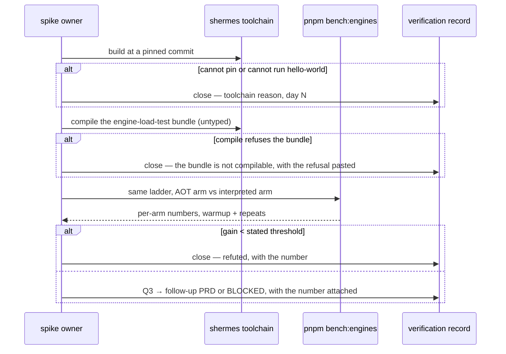

# PRD-312 — The `shermes` AOT spike is timeboxed, answered, and closed either way

**Status:** PARTIAL — compatibility screening executed 2026-09-16 in PR #274. Static Hermes
compiles the unchanged bundle; Porffor alpha-6 fails. Rendering performance is unmeasured.
Originally filed 2026-08-31 against `2e014460`.

**Outcome:** the one idea that could stop iOS's no-JIT rule being permanent stops being an
unowned sentence in two architecture documents. Within a **fixed five-day timebox**, this repository
holds a number for *"does untyped Three.js game code gain anything from ahead-of-time compilation"*,
and the branch is closed — pursued with a PRD, or graveyarded with the measurement that killed it.

**Depends on:** nothing.

**Task 9 of Band 2.** See [README](README.md) for the tick-back rule.

**Complexity: 5 → MEDIUM mode.** +2 (new toolchain integration from scratch), +1 (external
toolchain with no pinned release), +1 (multi-package: `runtime-native` and the bench harness),
+1 (an answer that may be "no", which must land as firmly as a "yes").

---

## Executed screening — 2026-09-16 (America/Vancouver), PR #274

**Reached:** Q1's source build and semantic smoke controls; Q2's compilation prerequisite.
**Not reached:** Q2's matched rendering/performance comparison or Q3's ARM64/iOS embedding.
The PRD remains **PARTIAL**, not accepted or graveyarded for Static Hermes. This is a
compatibility result, not an FPS result. The original plan below is retained with unrun items open.

[PR and posted results](https://github.com/ThreeNativeHQ/threenative/pull/274).
[Static Hermes run](https://github.com/ThreeNativeHQ/threenative/actions/runs/35192075779)
and [authoritative Porffor rerun](https://github.com/ThreeNativeHQ/threenative/actions/runs/35192841200).
Both used GitHub-hosted Ubuntu 24.04 x86-64 runners, not the project's device runners.
The local shell could not resolve `github.com`; the remote executions, rather than that local
limitation, supply the results. No runtime, game, dependency manifest or benchmark arm changed.

### Pins and actual input

| Input | Identity |
| --- | --- |
| ThreeNative / `develop` | `d292da4225186e6ec395be551d49c7a26a1770be` |
| Static Hermes / `static_h` | `4947871513667919bf2fe225134af3e3a1a3772c` |
| Porffor | `alpha-6`, `038f415e08efc5f87a6bfcb05a18824caa3a14f6` |
| Porffor Linux x64 release archive SHA-256 | `eb0ea557fc9fbcbaf16d81d9090b6fcf5010ede444dc151b94f7c528e1328b82` |
| Build tools | Node 22.22.0, pnpm 10.25.0, Clang 18.1.3 |
| Unmodified native benchmark bundle | 2,607,872 bytes; SHA-256 `2d338290b792489c42ea8d95056f5b28929f50d5ab3eacda7985ce303a0d1005` |

The actual build is `examples/engine-load-test/vite.config.ts`'s native mode, not a replacement
microbenchmark or the consumer bundler. Its compile-time settings were `frames=600`, `warmup=120`,
`repeats=3`, `ladder=256,1024,4096,16384`, `modes=L1,L2`. These configure the bundle; **the frame
ladder did not execute**. Every compiler run's bundle hash matches. Node's syntax check passes.

### Observed results

| Probe | Static Hermes | Porffor alpha-6 |
| --- | --- | --- |
| Toolchain | Source build succeeds; configure 13 s, build 471 s with two build workers | SHA-256-verified prebuilt binary runs and reports the pinned version |
| `Float32Array([1,2,3])` sum control | Compile 0, run 0; `AOT_CONTROL_OK:6` | Compile 0, run 0; same marker |
| Proxy `get` trap returns 42 over target value 1 | Compile 0, run 0; `PROXY_GET_TRAP_OK:42` | Compile 0, run **1**; `PROXY_GET_TRAP_BROKEN:1` |
| Unmodified native game bundle | Compile **0**, 88 s; produces x86-64 ELF | Compile **1**; generated C collides with glibc `uint` and `select` declarations |
| Game execution without ThreeNative host APIs | `ENGINE_LOAD_TEST_FAILED Error: TN_BENCH_NO_CANVAS` | Not reached; no game executable |

Times above are compiler/build wall time, **not frame time**. Static Hermes and interpreted Hermes
both reach the missing-canvas marker. Local Node 22.16.0 does too. These processes exit 0 despite
that marker: a zero exit is not successful rendering. No frame was rendered by an AOT arm.

The Hermes game executable is **9,452,776 bytes**, unstripped, dynamically linked to
`libshermes_console.so` and `libhermesvm.so`. That excludes those libraries and ThreeNative's host;
it is not a total deployment/APK size. Executable SHA-256:
`bb262ade6a568f31dc711e2b3eab2a93106b9cca1584278f73fdbb81f677c142`.
Compiler warnings name host globals including GPU usage constants, timers and `performance`;
compilation succeeds, but those globals still need the real host integration.

**Porffor's failures are independently reproducible.** The real bundle uses Proxy at lines 28195,
28265 and 28452. A three-line reproducer using `var uint = { value: 42 };`,
`var select = { value: 7 };`, and `console.log(uint.value, select.value);` produces the same C-name
collisions, while Node prints `42 7`. The Proxy control and this reproducer are pasted on the PR.
An earlier arrow-function-only naming probe did not reproduce the collision; it is not counted
as evidence of the failure.

**Harness correction:** this release's bundled help requires `porf native input.js -o output`.
The website's positional-output forms did not retain the requested path in our executions.
The first run's `*-compile` labels included transient execution and its subsequent missing-file
exit 127 was a harness invocation issue, not a compiler defect. The final rerun explicitly uses
`-o`, checks the executable exists and separates compile from run; only that rerun supplies the
Porffor table above. Its green workflow means diagnostics were collected, not all probes passed.

### Reproduction and evidence retention

The exact scripts remain in commit history even after the temporary workflow is removed:

```sh
# Run these in a disposable checkout/scratch directory, not the shipped runtime tree.
git show d2c8c69521b4db12507c743c935d5cda46461804:.github/workflows/prd-312-aot-spike.yml
git show dfa7d834e69ab24f2c0752d3698a5d419cdbb319:.github/workflows/prd-312-aot-spike.yml
```

The first defines the pinned source build and `shermes -O game.js -o game-shermes`; the second
contains the corrected Porffor invocation, semantic controls, exact native bundle build and
input hashes. Their compile/run timeouts bound experiments and are not performance gates.
Raw artifact ZIPs were downloaded and independently hash-checked:

| Artifact | ID | ZIP SHA-256 |
| --- | --- | --- |
| `prd-312-shermes` | `10484183972` | `83c2ac06ef05bc5284068439d2c500911c251bce963d41f7ac021f3936226aa5` |
| `prd-312-porffor-native-output` | `10484597517` | `b3159624de754040b21fe9b192e752d6abf5afe573a1abe0da962f2860acad01` |

Actions artifacts have seven-day retention; the findings and reproduction commands above and
on the PR are the durable record. No compiler binary, generated game or experimental workflow
belongs in the final diff. Routine results are kept here and on the PR under the current
`docs/PRDs/AGENTS.md` evidence rule, not in a new standalone performance report.

### Decision and remaining gate

**Porffor alpha-6: do not integrate.** Fixing generated-C names alone does not fix the independently
failing Proxy semantics. Re-screen a newer upstream pin after both issues are corrected.
**Static Hermes: retain as a candidate, do not ship.** Compiling the full unchanged bundle and
passing two semantic controls is useful evidence, but not full Three.js compatibility or a speedup.

The next meaningful experiment needs an isolated `mystral::js::Engine` adapter, real
canvas/WebGPU/timer/microtask bindings and a compiled-unit entry path, then the existing
`pnpm bench:engines` ladder against a matched baseline. No fake AOT arm or mock-renderer timing
was added. The >=2 ms/frame or clear throughput-win threshold is unchanged. Real rendering,
V8/JSC frame comparisons, peak memory, startup-to-first-frame and ARM64/iOS remain unmeasured.
Standalone ES-module loading was not tested by the classic-script smoke controls.

---

## What a spike PRD may and may not claim

A spike's deliverable is a **decision backed by a measurement**, not shipped runtime code. This PRD
therefore states up front what it is *not* allowed to do, because a research branch that quietly
becomes a product branch is how a framework acquires a second JavaScript engine nobody chose:

- It does **not** add a fourth engine to `engine_factory.cpp`.
- It does **not** change what any shipped build runs.
- It does **not** leave a half-integrated toolchain in `packages/runtime-native/`. Everything it
  builds either lands behind an explicit follow-up PRD or is deleted in the closing commit.
- It **does** land one durable artifact regardless of outcome: a verification record and a
  graveyard-or-plan entry, both of which existing documents will point at instead of pointing at a
  sentence.

---

## 1. Context

**Problem:** iOS embedded JavaScriptCore is interpreter-only — Apple grants the JIT entitlement to
`WKWebView`, not to embedded JSC, and no third-party engine gets it. AOT compilation is the only
known sidestep, because compiled machine code needs no entitlement. It has been filed twice as
*"a spike, not a plan"*, owned by nobody, for long enough that it functions as a permanent
maybe.

**Files and documents analysed:**

- `docs/PRDs/done/PRD-068-android-javascript-engine.md:288-329, 367` — §4.3a: the three unchecked
  "ifs" (does untyped JS gain; can the toolchain be pinned; can it emit a linkable arm64 library),
  and the explicit note that no Apple hardware was available to check the third
- `docs/architecture/NATIVE-PERF-BOTTLENECKS.md:86` — the ⛔ row: *"Unfixable. The one sidestep is
  AOT … A spike, not a plan"*
- `docs/architecture/NATIVE-RENDER-TRANSPORT.md:53` — the same idea, restated
- `packages/runtime-native/src/js/` — `engine_factory.cpp`, `v8_engine.cpp`,
  `quickjs_engine.cpp`, `jsc_engine.mm`, `module_system.cpp`, `ts_transpiler.cpp`
- `scripts/engine-load-test/cli.ts:1, 183` — `pnpm bench:engines`, its arms
  (`tn-web`, `tn-desktop`, `tn-android`, …), `--frames/--warmup/--repeats/--ladder/--modes`,
  and `--compare`
- `examples/engine-load-test/` — the harness scene and its playtests

**Current behaviour:**

- Three engines ship: V8 (Android default), QuickJS, JSC (iOS). No AOT path exists.
- `pnpm bench:engines` already produces comparable per-arm numbers with warmup, repeats and a
  ladder — which is precisely the instrument this spike needs, and using anything else would make
  the result incomparable with everything already recorded.

---

## 2. Solution

**Approach — three questions, in the order that kills the branch fastest:**

1. **Can the toolchain be pinned and driven at all?** Build `shermes` at a specific commit, compile
   a trivial module, run it. Failing here at day two closes the branch with a toolchain reason.
2. **Does untyped code gain anything?** This is the question that decides everything and it is
   answerable **on Linux**, with no Apple hardware. Compile the existing engine-load-test bundle —
   untyped, ordinary Three.js game code — with `shermes`, and run the same ladder the bench harness
   already runs against the interpreted path. Static Hermes' headline numbers come from typed code;
   the game code this framework runs is not typed.
3. **Only if 2 shows a gain:** can it emit a linkable arm64 library, and does the iOS embedding rule
   survive contact with it? This is the question the local machine cannot answer, and it is the one
   allowed to end in `BLOCKED/` — after the first two are answered, not before.

**The timebox is five working days and it is the acceptance criterion, not a suggestion.** At day
five the branch closes in whatever state it is in, and the record says which of the three questions
was reached. A spike that runs long has become a project without anyone deciding to start one.

**Architecture:**



**Key decisions:**

- [ ] Measure with `pnpm bench:engines`, not a bespoke timer. A new harness would produce a number
      incomparable with every engine number already recorded, and comparability is the entire point.
- [x] The subject is the **existing untyped game bundle**, not a typed microbenchmark. A typed
      benchmark would answer a question this framework does not have — the toy proof this
      repository's rules forbid.
- [x] The threshold is stated **before** the measurement: the standing bar is ≥ 2 ms of frame time,
      or an unambiguous throughput win on the ladder. Five levers have already died against that
      bar; this one gets the same bar, chosen in advance.
- [ ] Everything built during the spike lives in a worktree or a scratch path and is deleted or
      promoted in the closing commit. No dead toolchain in `packages/`.

**Data changes:** none.

---

## 3. Sequence flow



---

## 4. Integration Ledger

| # | New thing | Live caller (`file:line`, non-test) | Replaces | Old path removed? | Negative control |
|---|---|---|---|---|---|
| 1 | `docs/verification/shermes-spike-<date>.md` | cited by rows 2 and 3; read by `pnpm round:next` | the unowned "a spike, not a plan" sentence | that sentence is edited in both documents | a record that does not name which of the three questions was reached fails checkpoint |
| 2 | edit to `NATIVE-PERF-BOTTLENECKS.md:86` | the document itself, which agents read | the ⛔ row's speculative wording | replaced in place | leaving the old wording beside a closed branch fails review |
| 3 | edit to `NATIVE-RENDER-TRANSPORT.md:53` | same | same | replaced in place | same |
| 4 | a `shermes` bench arm **or** its deletion | `scripts/engine-load-test/cli.ts` arm list — TBD, **only if Q2 is reached and positive** | nothing | the arm is deleted in the closing commit if the branch closes | an arm left in the CLI for a branch that closed is dead code and fails the census |
| 5 | graveyard entry or follow-up PRD | `docs/verification/runtime-perf-state.md` lever graveyard, or a new PRD file | nothing | n/a | closing with neither leaves the branch unowned again — the exact failure this PRD exists to end |

### Reachability

**How is this reached?** A person or agent runs `pnpm bench:engines` with the spike arm during the
timebox, and afterwards, reads the record. The durable consumer is documentation that other agents
already read: the two architecture documents lose a speculative row and gain a decided one.

**Pre-existing files edited:** `docs/architecture/NATIVE-PERF-BOTTLENECKS.md`,
`docs/architecture/NATIVE-RENDER-TRANSPORT.md`, and — only on a positive Q2 —
`scripts/engine-load-test/cli.ts`.

**Is this user-facing?** No. It decides whether iOS gets a performance story at all, which is
upstream of everything user-facing on that platform.

**Full flow:** owner starts the timebox → pins the toolchain → compiles the untyped bundle → runs
the ladder → the number goes in the record → both architecture documents are edited to say what was
decided → the branch is either a PRD or a graveyard row, and in neither case is it still a maybe.

**What does this replace?** The two speculative sentences. They are edited, not left standing
beside the answer.

---

## 5. Execution phases

#### Phase 1 (days 1–2): Q1 — pin the toolchain and run something

**Files (2):**

- `docs/verification/shermes-spike-<date>.md` — NEW: the pinned commit, the build command, and
  either a running hello-world or the failure
- `packages/runtime-native/AGENTS.md` — EDIT **only if** the toolchain is pinned: one line naming
  where the spike's toolchain lives and that it is not part of any build

**Implementation:**

- [x] Build `shermes` at an explicit commit. Record the commit, the host toolchain, and the build
      time. "Latest" is not a pin.
- [ ] Compile and run a trivial ES module. Paste the output.
- [x] Never symlink anything into `packages/runtime-native/third_party/` — the dependency downloader
      creates that path and a symlink there has previously endangered the real dependency cache.
- [ ] Day-2 stop: if the toolchain cannot be pinned or cannot run a hello-world, close and write the
      record. That is a complete, successful outcome for this PRD.

**Tests required:** none — the gate is the pasted build and run.

**Revert check:** n/a for a spike phase; the checkpoint rejects a record without pasted commands and
output.

**User verification:** read the record — it names a commit and pastes a run, or names the failure.

---

#### Phase 2 (days 3–4): Q2 — does the untyped game bundle gain anything

**Files (3):**

- `scripts/engine-load-test/cli.ts` — EDIT: a spike arm, clearly marked and deletable
- `docs/verification/shermes-spike-<date>.md` — EDIT: the ladder results, both arms
- `docs/verification/runtime-perf-state.md` — EDIT: the number, in the frame ledger or the lever
  graveyard depending on the outcome

**Implementation:**

- [x] Subject: the **existing** engine-load-test bundle — untyped ordinary Three.js game code. Not a
      typed microbenchmark, not a hand-written hot loop.
- [ ] Same `--frames`, `--warmup`, `--repeats`, `--ladder` and `--modes` as the interpreted arm.
      Different settings between arms makes the comparison meaningless.
- [ ] If the compiler refuses the bundle, that refusal **is** the answer to Q2 for this codebase:
      paste it and close.
- [ ] Compare against the threshold stated in §2, which was chosen before the run.

**Wiring:**

- [ ] Caller edited: the bench CLI's arm list, if and only if Q1 passed
- [ ] Ledger rows filled: #4 (and its deletion is part of the closing commit if the branch closes)

**Tests required:**

| Test file | Test name | Assertion | Negative control (must be observed red) |
|---|---|---|---|
| `scripts/__tests__/engine-load-test.spec.ts` | `should reject an unknown arm name` | throws | add the spike arm and confirm it is accepted only when registered → red before registration |
| same | `should refuse mismatched ladder settings between compared arms` | throws | compare two arms with different frame counts → observed red |

**Revert check:** remove the spike arm → the comparison command fails with an unknown-arm error,
proving the arm was actually wired and not a name in a document.

**User verification:** `pnpm bench:engines --compare --left tn-desktop --right tn-desktop-shermes` —
two comparable numbers, or a pasted refusal.

---

#### Phase 3 (day 5): Close it, in one direction, in writing

**Files (4):**

- `docs/architecture/NATIVE-PERF-BOTTLENECKS.md` — EDIT: line 86 replaced with the decision
- `docs/architecture/NATIVE-RENDER-TRANSPORT.md` — EDIT: line 53 replaced with the decision
- `docs/architecture/FUTURE-ARCHITECTURE-DIRECTION.md` — EDIT: task 9 ticked with the outcome
- either a new follow-up PRD, or the graveyard row in
  `docs/verification/runtime-perf-state.md`, plus deletion of the spike arm

**Implementation:**

- [ ] Write the decision as a plain clause, not a cross-reference: an agent reading either document
      must learn the answer without opening a third file.
- [ ] If Q3 is the only open question, file under `docs/PRDs/BLOCKED/requires-ios-ecossystem/` with
      Q2's number attached — and attempt the blocked step once before believing the reason, since
      several folders there have outlived their conditions.
- [ ] Delete everything the spike built that is not promoted. A pinned toolchain left in the tree
      for a closed branch is dead weight the kill switch will find later at higher cost.

**Wiring:**

- [ ] Ledger rows filled: #1, #2, #3, #5

**Revert check:** grep both architecture documents for the old speculative wording — no hits.

**User verification:** read either architecture document; the AOT row states a decision and cites
the record.

---

## 6. Verification plan

1. **Toolchain:** pinned commit, build log, hello-world output — pasted.
2. **Benchmark:** `pnpm bench:engines` both arms, identical settings, `--compare` output pasted.
3. **Unit:** the two bench-CLI guard cases above.
4. **Integration proof:**

```sh
# 1. The speculative wording is gone from both documents
grep -rn "a spike, not a plan" docs/architecture/
# Expected: no output

# 2. Nothing half-integrated is left behind
grep -rn "shermes" packages/runtime-native/src scripts/
# Expected: either a registered, working arm (branch pursued) or no output (branch closed)

# 3. The record exists and names which question was reached
grep -n "Q1\|Q2\|Q3" docs/verification/shermes-spike-*.md
# Expected: an explicit "reached Q<n>" line
```

5. **Negative controls:** unregistered arm rejected; mismatched ladder settings rejected; the
   pre-edit documents still containing the old wording (observed, then fixed).

---

## 7. Acceptance criteria

- [ ] Five working days after it starts, the branch is closed in one direction — no fourth outcome,
      no extension. The record names the day it closed.
- [ ] `docs/verification/` holds a number for *"does untyped Three.js game code gain from AOT"*, or
      a pasted refusal explaining why the question could not be reached.
- [ ] Both architecture documents state the decision as a plain clause and cite the record; neither
      still says "a spike, not a plan".
- [ ] The tree contains **either** a working, registered bench arm and a follow-up PRD, **or** no
      trace of the spike beyond its record and a graveyard row. Not a half-integrated toolchain.
- [ ] If the branch survives to Q3, it is filed under a blocked reason that was **attempted once**
      and found genuinely blocking, with Q2's number attached so a future owner does not re-measure.
- [ ] Task 9 in the direction document is ticked with its outcome, whichever way it went.

**Integration gates:**

- [ ] Integration Ledger has zero `TBD` cells
- [ ] Caller census pasted for the bench arm, or its absence proved by grep
- [ ] Revert check pasted: removing the arm breaks the comparison command
- [ ] The old speculative wording is deleted from both documents, not left beside the decision
- [ ] Every gate has an observed red, pasted
- [ ] Measured on the real subject: the existing untyped game bundle, not a typed microbenchmark
