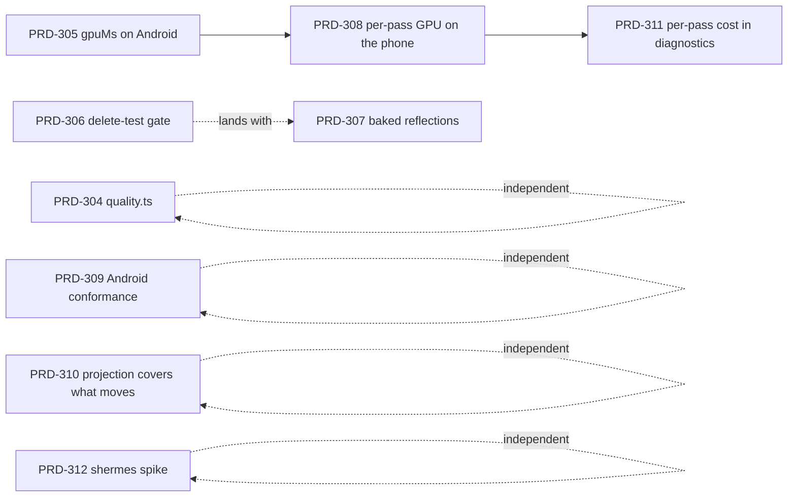

# docs/PRDs/architecture

Read `/AGENTS.md` and `docs/PRDs/AGENTS.md` first. This folder holds the PRDs sliced from
[`docs/architecture/FUTURE-ARCHITECTURE-DIRECTION.md`](../../architecture/FUTURE-ARCHITECTURE-DIRECTION.md)
— its Band 1 and Band 2 tasks, one PRD per numbered task.

## Keep the source document in sync — it is the board, not a snapshot

`FUTURE-ARCHITECTURE-DIRECTION.md` is a proposal with an unchecked task board. **When a PRD in this
folder is finished — archived to `docs/PRDs/done/` with its acceptance criteria checked and its
evidence in `docs/verification/` — edit that document in the same commit** and mark the row done:

- Put a **✅** at the front of the task's **Task** cell, and append `— done, PRD-NNN, <verification file>`.
- If the measurement it produced contradicts a number in *Where we actually are* or in *The three
  moves*, **update the number and say which run replaced it**. That document's whole value is that
  its numbers are read from this tree; a stale number there is worse than no number.
- If the task's outcome triggers one of the five entries in *What would prove this wrong*, say so on
  the row rather than quietly proceeding. Two of them stop-gate later work.

A row still unticked after its PRD reached `done/` means the board lies about what is left, which is
the failure mode the document exists to prevent. A row ticked without an archived PRD and a
verification file is worse — that is a claimed gate nobody ran.

## The board

| Doc task | PRD | Band |
| --- | --- | --- |
| 1 — `quality.ts` in all 8 templates | [PRD-304](PRD-304-every-template-ships-a-quality-switch.md) | 1 |
| 2 — confirm `gpuMs` reports on Android | ✅ [PRD-305](../done/PRD-305-the-gpu-meter-reports-on-android.md) — **done**, `gpuMs 0.19` from a Pixel 8 ([record](../../verification/gpu-meter-on-android-2026-09-01.md)) | 1 |
| 3 — CI deletes every baked file and proves the game is identical | ✅ [PRD-306](../done/PRD-306-the-delete-test-is-a-gate.md) — **done**, green in `pnpm test:templates` ([record](../../verification/delete-test-passes-2026-09-01.md)) | 1 |
| 4 — bake prefiltered reflections into `@threenative/assets` | [PRD-307](PRD-307-reflections-are-prefiltered-before-the-game-ships.md) | 2 |
| 5 — GPU time per pass, on the phone | [PRD-308](PRD-308-gpu-time-is-attributed-per-pass-on-the-phone.md) | 2 |
| 6 — Android conformance on every commit | [PRD-309](PRD-309-android-conformance-runs-on-every-commit.md) | 2 |
| 7 — scene projection that covers objects that move | [PRD-310](PRD-310-the-projection-covers-what-moves.md) | 2 |
| 8 — per-pass GPU cost in `diagnostics` | [PRD-311](PRD-311-per-pass-gpu-cost-without-owning-a-phone.md) | 2 |
| 9 — timeboxed `shermes` AOT spike | [PRD-312](PRD-312-the-shermes-spike-is-timeboxed-and-closed.md) | 2 |

**Band 3 (tasks 10–13) is deliberately not filed.** The document stop-gates #11 on #5 and forbids
shipping #10 without #4; #13 has no schedule. File them when PRD-307 and PRD-308 have landed and
their numbers reproduce — filing them now would be planning against a model that has been wrong
twice.

## Dependency order

