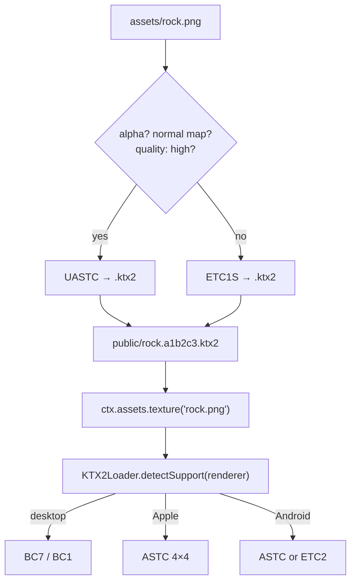

# PRD-095 — Textures reach the GPU compressed: KTX2/Basis in, `KTX2Loader` auto-wired out

**Status: PROPOSAL, 2026-08-12.** Nothing has run. No platform readiness is claimed.
**Parent:** [the series README](./README.md).
**Depends on:** [PRD-094](./PRD-094-asset-compile-step.md) — the compile stage and the manifest.
**Blocks:** [PRD-097](./PRD-097-native-decode-path.md),
[PRD-099](./PRD-099-vector-textures.md).

**Complexity: 6 → MEDIUM mode.** One new pass, one runtime wiring change, one capability
detection path that behaves differently on four targets.

---

## 1. Context

**Problem:** every ThreeNative texture is uploaded to the GPU as decoded RGBA. A 2048×2048 PNG
is roughly 1.5 MB on the wire and **16 MB in VRAM**. The GPU has had a native compressed format
for this since 2010 and the framework does not use it.

**Files analysed:**

- `packages/core/src/assets.ts` — `texture()` uses `TextureLoader`, or `createImageBitmap` when
  `Image` is undefined. No `KTX2Loader` anywhere in the repo.
- `packages/core/src/renderer.ts` — where the renderer instance lives; `detectSupport()` needs it
- `packages/assets/src/compile.ts` — the pass registry from PRD-094

**Current behaviour:**

- `.png` and `.jpg` decode on the CPU and upload uncompressed.
- A `.ktx2` file placed in `public/` today **cannot be loaded at all** — nothing configures a
  transcoder.
- A `.glb` using `KHR_texture_basisu` fails for the same reason.

---

## 2. Solution

Compile textures to KTX2 with Basis supercompression at build time; auto-configure `KTX2Loader`
at runtime so the game never sees it.

- **UASTC** for anything with an alpha channel, a normal map, or flagged `quality: "high"` —
  transcodes to BC7 / ASTC 4×4.
- **ETC1S** for everything else — far smaller, transcodes to BC1/BC3 / ETC2.
- The choice is a **declared property of the asset**, not a guess. Heuristics pick the default;
  `assets.textures` config overrides per glob. A wrong automatic choice on a normal map is a
  visible artifact, so the override must exist from day one.
- `KTX2Loader.detectSupport(renderer)` runs once, with the real renderer, for both
  `WebGPURenderer` and `WebGLRenderer`.
- **A target that cannot transcode throws at construction.** No silent fallback to an
  uncompressed copy — a backend that cannot honour the format says so.



**Key decisions:**

- [x] Encoder: the Basis Universal encoder via its npm distribution, invoked in-process from
      `@threenative/assets`. No shelling out to a `toktx` the user must install.
- [x] Transcoder: the one already inside `three` (`three/examples/jsm/libs/basis/`). Copied to
      the output directory by the compile step, so `setTranscoderPath` points at a real path with
      no user configuration.
- [x] The logical path stays `rock.png`. The manifest maps it to `.ktx2`. Game source never
      mentions a container format, and switching a texture back to PNG is a config change.
- [x] Mipmaps generated at encode time, always. Uploading a compressed texture without mips is
      the classic way to make it look worse than the PNG it replaced.

**Data changes:** manifest entries gain `format`, `transcodeTargets`, `bytesBefore`,
`bytesAfter`.

---

## 3. Integration Ledger

| # | New thing | Live caller (`file:line`, non-test) | Replaces | Old path removed? | Negative control |
|---|---|---|---|---|---|
| 1 | `texturePass` in `packages/assets/src/passes/texture.ts` | `assets/src/compile.ts:TBD` pass registry | the PRD-094 identity pass for textures | identity pass deleted for the `texture` kind in Phase 1 | force ETC1S on a normal map → the visual gate must go red |
| 2 | `createKtx2Loader()` in `core/src/assets.ts` | `core/src/assets.ts` `texture()` branch, reached from `game.ts:399` | the `TextureLoader` branch for compiled textures | `TextureLoader` retained only for the no-manifest fallback | stub `detectSupport` to report nothing → construction throws |
| 3 | transcoder asset copy | `assets/src/compile.ts:TBD` | nothing | n/a | delete the copied transcoder from `public/` → texture load fails loudly |
| 4 | `assets.textures` config block | `create-threenative/src/config.ts:TBD` | nothing | n/a | an unknown codec name throws at config load |

### Reachability

**How is this reached?** `ctx.assets.texture()` — already the only texture entry point in every
template. No new API.

**Full flow:** user's PNG → compile pass → `.ktx2` in `public/` → manifest → `texture()` sees a
`.ktx2` output → `KTX2Loader` with a detected support set → compressed upload → same
`THREE.Texture` the game already had.

**What does this replace?** The `TextureLoader` path, for any texture the manifest lists.
`TextureLoader` survives only as the documented no-manifest fallback — one live implementation
per case, never two.

---

## 4. Execution phases

#### Phase 1: One real texture compiles to KTX2 and renders — the platformer's ground texture, in the browser

**Proof subject:** the platformer's largest texture, the one already on screen in the shipped
playtest. Not a generated test pattern.

**Files (max 5):**

- `packages/assets/src/passes/texture.ts` - NEW: encode, mip, write, record bytes
- `packages/assets/src/compile.ts` - EDIT: register the pass for `kind: "texture"`, drop identity
- `packages/core/src/assets.ts` - EDIT: `KTX2Loader` branch when the output is `.ktx2`
- `packages/core/src/game.ts` - EDIT: hand the renderer to the loader for `detectSupport`
- `packages/create-threenative/src/config.ts` - EDIT: `assets.textures` block

**Implementation:**

- [ ] Choose UASTC vs ETC1S from alpha presence, a `*_normal.*`/`*_nrm.*` filename convention,
      and the config override — override always wins
- [ ] Generate the full mip chain at encode time
- [ ] Copy the `three` Basis transcoder into the output directory once per build
- [ ] `detectSupport(renderer)` once per loader, memoised; **throw** when no compressed format is
      supported, naming the renderer and the platform
- [ ] Record `bytesBefore`/`bytesAfter` in the manifest

**Wiring:**

- [ ] Caller edited: `compile.ts` registry and the `texture()` branch in `assets.ts`
- [ ] Old path: identity pass removed for textures in this phase
- [ ] Ledger rows filled: #1, #2, #3, #4

**Tests required:**

| Test file | Test name | Assertion | Negative control (observed red) |
|---|---|---|---|
| `packages/assets/__tests__/texture-pass.spec.ts` | `should encode to UASTC when the source has an alpha channel` | manifest `format === "uastc"` | strip alpha → falls to ETC1S, assertion red |
| `packages/assets/__tests__/texture-pass.spec.ts` | `should honour a config override over the heuristic` | override wins on an alpha source | remove the override → red |
| `packages/assets/__tests__/texture-pass.spec.ts` | `should emit a full mip chain` | mip level count > 1 | disable mip generation → red |
| `packages/core/__tests__/assets.spec.ts` | `should throw when no compressed format is supported` | rejects naming the platform | report BC7 support → red |
| `packages/core/__tests__/assets.spec.ts` | `should call detectSupport exactly once for repeated loads` | spy count is 1 | drop the memo → red |

**Revert check:** revert the `texture()` branch → the `.ktx2` output cannot load at all and the
Phase 2 playtest fails, because the PNG is no longer in `public/`.

---

#### Phase 2: The compressed texture is proved on screen and in VRAM, not just in a manifest

**Files (max 5):**

- `templates/platformer/playtests/textures.playtest.json` - NEW
- `packages/assets/src/report.ts` - NEW: the size report printed by the compile step
- `packages/assets/src/compile.ts` - EDIT: print the report
- `scripts/budgets.ts` - EDIT: surface texture bytes in the budget report

**Implementation:**

- [ ] The playtest takes a screenshot and asserts a `visual` comparison against the pre-KTX2
      baseline within threshold — a texture that compressed to mush must fail
- [ ] The compile step prints one line per texture and a total, before/after

**Tests required:**

| Test file | Test name | Assertion | Negative control |
|---|---|---|---|
| `playtests/textures.playtest.json` | ground texture matches the PNG baseline within threshold | `visual` assertion | encode at the lowest quality setting → red |
| `playtests/textures.playtest.json` | no console error during texture load | console assertion | delete the transcoder from `public/` → red |
| `packages/assets/__tests__/report.spec.ts` | `should report a smaller total after compression` | `bytesAfter < bytesBefore` | swap in the identity pass → red |

**Revert check:** disable the texture pass → the visual playtest still passes (same PNG), but the
report test fails and the manifest loses its `format` field. **This is the weak revert in the
series** and is why the visual gate is paired with the byte gate.

**User verification:** run the build, read the printed report, open the game, compare the ground
texture against a screenshot from before.

---

#### Phase 3: `KHR_texture_basisu` inside glTF, so models carry compressed textures too

**Files (max 5):**

- `packages/assets/src/passes/texture.ts` - EDIT: expose the encoder to the model pass
- `packages/assets/src/passes/model.ts` - NEW/EDIT: rewrite embedded textures to KTX2 via
  gltf-transform, declaring `KHR_texture_basisu`
- `packages/core/src/assets.ts` - EDIT: `model()` sets the KTX2 loader on `GLTFLoader`

**Implementation:**

- [ ] Textures embedded in a `.glb` are extracted, encoded, and re-referenced through the
      extension — never left as raw PNG next to compressed siblings
- [ ] `GLTFLoader.setKTX2Loader()` uses the same memoised loader instance as `texture()`

**Tests required:**

| Test file | Test name | Assertion | Negative control |
|---|---|---|---|
| `packages/assets/__tests__/model-textures.spec.ts` | `should declare KHR_texture_basisu when a model's textures are compressed` | `extensionsUsed` contains it | skip the pass → red |
| `packages/core/__tests__/assets.spec.ts` | `should share one KTX2 loader between model and texture loads` | same instance | construct a second → red |
| `playtests/textures.playtest.json` | the model's own texture is visible | `visibility` + `visual` | leave the extension undeclared → load throws, exit 1 |

**Revert check:** revert the `setKTX2Loader` call → the compiled `.glb` fails to load, breaking
the pre-existing platformer playtest from PRD-094 Phase 3.

---

## 5. Verification strategy

```bash
# 1. Caller census
grep -rn "KTX2Loader\|texturePass" packages --include='*.ts' | grep -v __tests__ | grep -v node_modules
# Expected: hits in core/src/assets.ts and assets/src/compile.ts

# 2. Baseline control — the gate must fail at the previous commit
git stash && pnpm --filter @threenative/assets test; git stash pop
# Expected: the texture-pass specs do not exist / fail. A pass here means the gate measures nothing.

# 3. Real-implementation control — prove the encoder ran, not a mock
node -e "const m=require('./templates/platformer/public/assets.manifest.json');console.log(m.entries)"
# Expected: format uastc|etc1s and bytesAfter < bytesBefore for every texture entry

# 4. Stale-artifact control
rm templates/platformer/public/*.ktx2 && pnpm --filter platformer build
# Expected: regenerated, not served from cache
```

Gates:

```sh
pnpm typecheck && pnpm lint && pnpm test
xvfb-run -a -s '-screen 0 1600x900x24' pnpm test:templates
```

---

## 6. Acceptance criteria

- [ ] The platformer's ground looks the same as it did before compression, judged by the visual
      playtest against the pre-KTX2 baseline
- [ ] The build prints a total texture size that is smaller than the sources, and the number is
      in the round ledger
- [ ] A `.glb` whose textures were compressed loads and renders in the browser
- [ ] Running on a target with no compressed-texture support fails at construction with a message
      naming the platform — it never silently ships a 16 MB upload
- [ ] Setting `assets.textures` to `"none"` produces a game identical to today's

**Integration gates:**

- [ ] Ledger has zero `TBD` cells
- [ ] Caller census pasted
- [ ] Revert check passed on Phase 3 (a pre-existing playtest breaks)
- [ ] `TextureLoader` is live only in the no-manifest fallback branch
- [ ] Every gate observed red once
- [ ] Proved on the platformer's real textures, not a generated pattern

## 7. Risks

| Risk | Mitigation |
|---|---|
| ETC1S mangles normal maps | Filename convention plus a mandatory config override; the visual gate is run on a scene containing a normal-mapped surface |
| Encode time makes `dev` unusable | PRD-094's content-addressed cache means a texture encodes once; watch mode recompiles only what changed |
| The `three` transcoder path moves between versions | The copy step resolves it through `require.resolve`, so a move is a build-time failure, not a runtime 404 |
| Android/iOS transcode support is asserted, not observed | Native is explicitly **out of scope here** and is PRD-097's whole subject; nothing in this PRD may claim a device |
