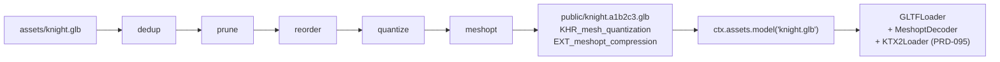

# PRD-096 — Models ship quantized and Meshopt-compressed, and the decoder wires itself

**Status: PROPOSAL, 2026-08-12.** Nothing has run. No platform readiness is claimed.
**Parent:** [the series README](./README.md).
**Depends on:** [PRD-094](./PRD-094-asset-compile-step.md).
**Blocks:** [PRD-097](./PRD-097-native-decode-path.md),
[PRD-098](./PRD-098-lod-and-instancing.md).

**Complexity: 6 → MEDIUM mode.** One new pass with several sub-passes, one runtime decoder
wiring, and a correctness surface — quantization is where a pipeline visibly breaks a model.

---

## 1. Context

**Problem:** every `.glb` ThreeNative loads carries float32 positions, float32 normals,
unindexed-or-badly-indexed triangles, and duplicate materials. `ctx.assets.model()` constructs a
stock `GLTFLoader` with no decoder configured, so a compressed `.glb` cannot even be opened.

**Files analysed:**

- `packages/core/src/assets.ts` — `model()` dynamically imports `GLTFLoader`, calls no
  `setMeshoptDecoder` and no `setDRACOLoader`
- `packages/runtime-native/src/gltf/gltf_loader.cpp` — cgltf, which does **not** decode
  `EXT_meshopt_compression` on its own
- `packages/assets/src/compile.ts` — the pass registry

**Current behaviour:**

- A `.glb` produced by `gltfpack` today fails to load on web (no decoder) and on native (cgltf
  parses the file and returns garbage buffers).
- No vertex-cache ordering, no quantization, no deduplication, no node pruning.

---

## 2. Solution

A model pass built on `gltf-transform` with `meshoptimizer` as the engine, plus the one-line
runtime wiring that makes the output loadable.

Passes, in order, each individually switchable in config:

| Pass | What it does | Why it is not the game's job |
|---|---|---|
| `dedup` | merge identical meshes, materials, textures, accessors | exporters emit duplicates; no game should diff its own accessors |
| `prune` | drop unreferenced nodes, cameras, empty materials | leftovers from DCC tools |
| `reorder` | vertex-cache and vertex-fetch optimisation | pure GPU concern, invisible in source |
| `quantize` | positions/normals/UVs to integers, `KHR_mesh_quantization` | a correctness minefield; wrong bounds warp the model |
| `meshopt` | `EXT_meshopt_compression` on vertex and index buffers | a codec |

Runtime: `GLTFLoader.setMeshoptDecoder(MeshoptDecoder)`, from `three`'s own bundled decoder.
Draco stays a supported **input** — `setDRACOLoader` is wired so a user's existing Draco `.glb`
still loads — and is never an output.



**Key decisions:**

- [x] **Meshopt is the default; Draco is input-only.** Meshopt keeps GPU-ready layouts and
      decodes at multiple GB/s; Draco optimises for the smallest file and pays for it at decode.
      Supporting both as outputs would give one behaviour two live implementations.
- [x] Quantization is **on by default at conservative precision** (16-bit position, 8-bit normal,
      12-bit UV) and every precision is config-exposed. A skinned mesh's joint weights are never
      quantized below what the exporter declared.
- [x] The pass **verifies its own output**: after compression it re-reads the file, compares
      triangle count, vertex count and bounding box against the source, and throws on drift
      beyond a declared tolerance. A pipeline that silently loses a mesh is worse than no
      pipeline.
- [x] Animation channels are compressed but never resampled by default — resampling changes
      timing, which is gameplay.

**Data changes:** manifest entries gain `triangles`, `vertices`, `bytesBefore`, `bytesAfter`,
`extensions`.

---

## 3. Integration Ledger

| # | New thing | Live caller (`file:line`, non-test) | Replaces | Old path removed? | Negative control |
|---|---|---|---|---|---|
| 1 | `modelPass` in `packages/assets/src/passes/model.ts` | `assets/src/compile.ts:TBD` registry | the PRD-094 identity pass for models | identity removed for `kind: "model"` in Phase 1 | quantize to 4-bit positions → the self-verify bounding-box check throws |
| 2 | `setMeshoptDecoder` wiring in `core/src/assets.ts` | `core/src/assets.ts` `model()`, reached from `game.ts:399` | nothing — no decoder was configured | n/a | remove the wiring → the compiled `.glb` fails to load, playtest exit 1 |
| 3 | `setDRACOLoader` wiring | same | nothing | n/a | load a Draco `.glb` with the wiring removed → throws |
| 4 | `assets.models` config block | `create-threenative/src/config.ts:TBD` | nothing | n/a | unknown pass name throws at config load |

### Reachability

`ctx.assets.model()` is the only model entry point in every template and example. No new API.

**Full flow:** user's `.glb` in `assets/` → the five passes → compressed `.glb` in `public/` →
manifest → `model()` → `GLTFLoader` with Meshopt + KTX2 configured → the same `gltf.scene` the
game already adds to the scene graph.

**What does this replace?** Nothing user-visible. The decoder wiring is new capability, not a
replacement — which is precisely why the revert check in Phase 2 matters more here than usual.

---

## 4. Execution phases

#### Phase 1: The hardest real model compiles and still measures the same — the platformer's rigged character, not a cube

**Proof subject:** the most-featured `.glb` in the repo — skinned, animated, multi-material,
with textures. Named at implementation time from `templates/platformer/` and
`examples/abyss-framework/`.

**Requirements a cube would NOT exercise:** skinning weights, animation channels, multiple
primitives per mesh, normal maps, non-uniform node transforms. If the chosen subject lacks any
of these, the phase declares which and names the phase that closes it.

**Files (max 5):**

- `packages/assets/src/passes/model.ts` - NEW: the five passes plus self-verification
- `packages/assets/src/compile.ts` - EDIT: register for `kind: "model"`, drop identity
- `packages/core/src/assets.ts` - EDIT: `setMeshoptDecoder` + `setDRACOLoader`
- `packages/create-threenative/src/config.ts` - EDIT: `assets.models` block
- `packages/assets/__tests__/model-pass.spec.ts` - NEW

**Implementation:**

- [ ] Run passes in the fixed order above; each is skippable by config, none is reorderable
- [ ] Self-verify: reopen the output, compare triangles, vertices, joint count, and bounding box
      against the source; throw naming the drift when it exceeds tolerance
- [ ] Never quantize joint indices or weights below the source declaration
- [ ] Record counts and bytes in the manifest

**Wiring:**

- [ ] Caller edited: `compile.ts` and `assets.ts`
- [ ] Old path: identity pass removed for models
- [ ] Ledger rows filled: #1, #2, #3, #4

**Tests required:**

| Test file | Test name | Assertion | Negative control (observed red) |
|---|---|---|---|
| `model-pass.spec.ts` | `should preserve triangle count through the full pass chain` | equal counts | drop a primitive in `prune` → throws |
| `model-pass.spec.ts` | `should preserve the bounding box within tolerance` | box within 0.1% | quantize positions to 4 bits → throws |
| `model-pass.spec.ts` | `should declare EXT_meshopt_compression and KHR_mesh_quantization` | both in `extensionsUsed` | disable `meshopt` → red |
| `model-pass.spec.ts` | `should keep joint weights at source precision on a skinned mesh` | weight accessor type unchanged | force 8-bit weights → red |
| `core/__tests__/assets.spec.ts` | `should configure the meshopt decoder before loading a model` | spy on `setMeshoptDecoder` | remove the wiring → red |

**Revert check:** remove the `setMeshoptDecoder` line → the compiled `.glb` throws on load and
the pre-existing platformer asset playtest from PRD-094 fails.

---

#### Phase 2: The compressed model renders and animates in a browser, and the byte count is recorded

**Files (max 5):**

- `templates/platformer/playtests/models.playtest.json` - NEW
- `packages/assets/src/report.ts` - EDIT: model rows in the size report
- `docs/verification/asset-pipeline-<date>.md` - NEW: the evidence record

**Implementation:**

- [ ] The playtest asserts the character is **visible** and that its animation **advances** —
      a quantized skeleton that collapsed to a point is visible and wrong
- [ ] A `visual` assertion against the pre-compression baseline within threshold

**Tests required:**

| Test file | Test name | Assertion | Negative control |
|---|---|---|---|
| `models.playtest.json` | the character is visible after compression | `visibility` | corrupt the meshopt buffer → exit 1 |
| `models.playtest.json` | the character's animation advances over 60 frames | `movement` assertion on a bone-driven node | freeze the animation → red |
| `models.playtest.json` | silhouette matches the uncompressed baseline | `visual` | quantize positions to 8 bits → red |
| `report.spec.ts` | `should report fewer bytes after the model pass` | `bytesAfter < bytesBefore` | identity pass → red |

**Revert check:** disable the model pass → the movement and visual assertions still pass on the
raw model, but the report test and the extension declaration test fail. The load-path revert in
Phase 1 is the strong one.

**User verification:** run the build, watch the character animate, read the printed byte
reduction.

---

#### Phase 3: Draco input keeps working, so nobody's existing assets break

**Files (max 5):**

- `packages/assets/src/passes/model.ts` - EDIT: accept a Draco-compressed input, decode, re-emit
  as Meshopt
- `packages/core/src/assets.ts` - EDIT: Draco decoder is lazy — configured only when a manifest
  entry or an uncompiled path declares Draco, so no game pays for a decoder it never uses
- `packages/assets/__tests__/draco-input.spec.ts` - NEW

**Tests required:**

| Test file | Test name | Assertion | Negative control |
|---|---|---|---|
| `draco-input.spec.ts` | `should re-emit a Draco input as a Meshopt output` | output declares Meshopt, not Draco | skip the transform → red |
| `core/__tests__/assets.spec.ts` | `should not load the Draco decoder for a Meshopt-only project` | decoder module never imported | wire it eagerly → red |

**Revert check:** remove the Draco branch → the Draco-input spec fails on a real Draco fixture.

---

## 5. Verification strategy

```bash
# 1. Caller census
grep -rn "setMeshoptDecoder\|modelPass" packages --include='*.ts' | grep -v __tests__ | grep -v node_modules
# Expected: core/src/assets.ts and assets/src/compile.ts

# 2. Baseline control
git stash && sh scripts/xvfb.sh pnpm test:templates; git stash pop
# Expected: models.playtest.json does not exist. If a version of it passes at baseline, it measures nothing.

# 3. Self-verification is real, not a literal
#    Temporarily set quantize precision to 4 bits and rebuild:
# Expected: the pass THROWS naming the bounding-box drift. A green build here means the
#           self-verify compares an artifact against itself.

# 4. The decoder actually ran
#    Load the compiled .glb with a stock GLTFLoader and no decoder in a scratch script.
# Expected: it fails. If it loads, the meshopt pass did not compress anything.
```

Gates:

```sh
pnpm typecheck && pnpm lint && pnpm test
sh scripts/xvfb.sh pnpm test:templates && pnpm test:playtest
```

---

## 6. Acceptance criteria

- [ ] The platformer's character renders and animates identically after compression, judged by
      a visual and a movement assertion against the pre-compression baseline
- [ ] The build prints a smaller total model size and the number lands in the round ledger
- [ ] A model that loses geometry in compression **fails the build**, naming the drift — it never
      ships a warped mesh
- [ ] A user's existing Draco `.glb` dropped into `assets/` still loads and renders
- [ ] Setting `assets.models` to `"none"` produces a game identical to today's

**Integration gates:**

- [ ] Ledger has zero `TBD` cells
- [ ] Caller census pasted
- [ ] Revert check passed: removing the decoder wiring breaks a pre-existing playtest
- [ ] No second model-compression output format is live
- [ ] Every gate observed red once
- [ ] Proved on a skinned, animated, multi-material model — the exercised/unexercised list is
      written into the phase

## 7. Risks

| Risk | Mitigation |
|---|---|
| Quantization warps skinned meshes | Joint data never quantized below source; self-verify on bounding box; a movement assertion on a bone-driven node |
| `meshoptimizer` and the `three` decoder version-skew | Both pinned through the workspace catalog; a mismatch surfaces as a load failure in the Phase 1 revert test, not silently |
| cgltf on native cannot read the output | Explicitly true today, and it is PRD-097's entire subject. **This PRD must not claim any native target.** |
| Compression time on a large project | Content-addressed cache from PRD-094; the pass runs once per changed model |
