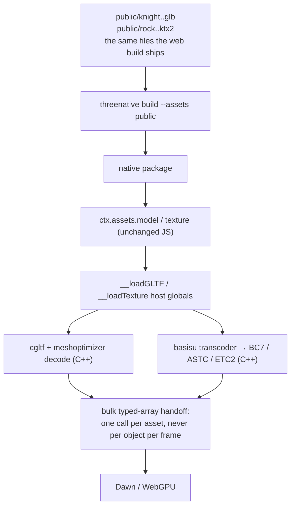

# PRD-097 — Native decodes the same files in C++, because Android has no WASM

**Status: PROPOSAL, 2026-08-12.** Nothing has run. No platform readiness is claimed.
**Parent:** [the series README](./README.md).
**Depends on:** [PRD-095](./PRD-095-texture-compression.md),
[PRD-096](./PRD-096-mesh-optimization.md).

**Complexity: 8 → HIGH mode.** C++ host change, third-party native dependencies, a
cross-platform ABI, and the half of the codebase where a feature is usually declared finished
one platform early.

**This is the PRD that makes the series honest.** PRD-095 and PRD-096 are web-only features
until this one lands, and a feature that works on web only is an unfinished feature.

---

## 1. Context

**Problem:** the compiled assets from PRD-095 and PRD-096 are **unloadable on native**.

- `packages/runtime-native/src/gltf/gltf_loader.cpp` uses cgltf, which parses the JSON of a
  `.glb` carrying `EXT_meshopt_compression` but does not decode its buffer views. It returns
  structurally valid, numerically meaningless geometry.
- Nothing in `runtime-native` reads `.ktx2` at all.
- The browser answer — `KTX2Loader` and `MeshoptDecoder` running WASM in a worker — **cannot be
  the native answer**: Android runs QuickJS and there is no WASM on native by construction.

**Files analysed:**

- `packages/runtime-native/src/gltf/gltf_loader.cpp` — `loadGLTF`, `loadGLTFFromMemory`
- `packages/runtime-native/src/runtime.cpp:2785` — the `__loadGLTF` global exposed to JS
- `packages/runtime-native/src/webgpu/bindings.cpp` — texture upload
- `packages/create-threenative/src/build.ts:162` — `--assets <cwd>/public` into the package
- `packages/core/src/assets.ts` — the `createImageBitmap` branch used when `Image` is undefined

**Current behaviour:** native loads uncompressed `.glb` and PNG, through the same JS path as the
browser, with cgltf underneath for models.

---

## 2. Solution

Compile `meshoptimizer` and the Basis transcoder into `runtime-native`, decode there, and hand
the JS side finished GPU resources. The shim answers the same JS calls; only what happens
underneath changes.



**Key decisions:**

- [x] `meshoptimizer` (MIT) and `basis_universal` (Apache-2.0) enter through the existing
      `third_party/` fetch. Both stay untracked, consistent with the repo's native dependency rule.
- [x] **The ABI is coarse.** One call decodes an asset and returns bulk typed arrays. Nothing in
      this PRD adds a per-object or per-frame crossing.
- [x] **Transcode target is chosen by the host, from the real device.** Desktop → BC7/BC1,
      iOS → ASTC, Android → ASTC where present, ETC2 otherwise. A device supporting none makes
      `__loadTexture` **throw** — a backend that cannot honour the format says so at construction.
- [x] **No second file format.** Native reads byte-identical files to web. The differential gate
      in Phase 3 asserts exactly that, comparing artifact hashes, not two copies of one path.
- [x] Native compilation stays opt-in. The default repo gate must not require CMake or an NDK,
      so every gate here lives behind `native:*` scripts.

---

## 3. Integration Ledger

| # | New thing | Live caller (`file:line`, non-test) | Replaces | Old path removed? | Negative control |
|---|---|---|---|---|---|
| 1 | meshopt decode in `runtime-native/src/gltf/gltf_loader.cpp` | `runtime.cpp:2800` (`loadGLTF`) and `:2817` (`loadGLTFFromMemory`) | the silent-garbage path for compressed buffer views | the un-decoded branch now throws instead of returning junk | feed a compressed `.glb` with decode disabled → must throw, never render |
| 2 | `runtime-native/src/texture/ktx2_loader.cpp` | new `__loadTexture` global registered in `runtime.cpp:TBD` | the JS `createImageBitmap` branch for `.ktx2` inputs | JS branch retained for PNG only | ask for a `.ktx2` with the global unregistered → throws naming the file |
| 3 | `threenative-native` condition in `core/src/assets.ts` | `core/src/assets.ts` `texture()` | the `createImageBitmap` fallback for compressed textures | scoped to `.ktx2` in the same phase | run the native bundle with the condition unresolved → the smoke test's import-free assertion fails |
| 4 | `native:verify:assets` script | `package.json` scripts; CI native workflow | nothing | n/a | point it at an uncompressed asset → must report that it proved nothing (exit 2) |

### Reachability

**How is this reached?** `ctx.assets.model()` / `ctx.assets.texture()` in `src/game.ts`, the
portable entry, running under the native host. No game code changes.

**Full flow:** `threenative build --target desktop` packages `public/` → the host boots
`src/game.ts` → `ctx.assets.model("knight.glb")` → the `threenative-native` condition routes to
`__loadGLTF` → cgltf parses, meshoptimizer decodes → bulk arrays → Dawn → the knight is on
screen in the 300-frame desktop verification screenshot.

**What does this replace?** The compressed-asset branch of the JS decode path, on native only.
The PNG and uncompressed-`.glb` paths are untouched, so nothing regresses for a project that
opts out of the pipeline.

---

## 4. Execution phases

#### Phase 1: Desktop decodes a compressed model — the platformer's character appears in the 300-frame desktop screenshot

**Proof subject:** the same skinned, animated, multi-material model PRD-096 proved on web.
Starting on a cube would prove nothing that matters.

**Files (max 5):**

- `packages/runtime-native/CMakeLists.txt` - EDIT: fetch and link `meshoptimizer`
- `packages/runtime-native/src/gltf/gltf_loader.cpp` - EDIT: decode `EXT_meshopt_compression`
  buffer views; throw on an undecodable view
- `packages/runtime-native/src/runtime.cpp` - EDIT: surface decode failures as a JS throw
- `packages/runtime-native/__tests__/gltf-meshopt.spec.ts` - NEW: host-level fixture test
- `scripts/native-verify-assets.ts` - NEW: the desktop asset verification

**Implementation:**

- [ ] Decode vertex and index buffers through `meshopt_decodeVertexBuffer` /
      `meshopt_decodeIndexBuffer` before cgltf accessor reads
- [ ] Honour `KHR_mesh_quantization` dequantization, including the normalized-integer cases
- [ ] **Throw, never degrade.** An unsupported extension is a named error, not a silent skip —
      the failure mode this codebase exists to avoid is a green run that asserted nothing
- [ ] `native:verify:assets` exits `2` when it never reached an assertion, `1` on failure

**Wiring:**

- [ ] Caller edited: `runtime.cpp` at the existing `__loadGLTF` registration
- [ ] Old path: the un-decoded branch is replaced by a throw in this phase
- [ ] Ledger rows filled: #1, #4

**Tests required:**

| Test file | Test name | Assertion | Negative control (observed red) |
|---|---|---|---|
| `gltf-meshopt.spec.ts` | `should decode a meshopt-compressed model to the same vertex count as the source` | equal counts | disable the decode call → red |
| `gltf-meshopt.spec.ts` | `should throw when a compressed buffer view cannot be decoded` | named error | return zeros instead → red |
| `gltf-meshopt.spec.ts` | `should dequantize KHR_mesh_quantization positions into the source bounding box` | box within tolerance | skip dequantization → red |
| `scripts/native-verify-assets.ts` | non-blank desktop screenshot containing the character | pixel-variance threshold | render an empty scene → exit 1 |

**Revert check:** revert the decode → `native:verify:assets` produces a blank or scrambled
screenshot and the existing `native:verify:desktop` non-blank assertion fails.

---

#### Phase 2: Desktop decodes a compressed texture, and the surface is textured rather than merely present

**Files (max 5):**

- `packages/runtime-native/CMakeLists.txt` - EDIT: fetch and link the Basis transcoder
- `packages/runtime-native/src/texture/ktx2_loader.cpp` - NEW: parse KTX2, pick a target from
  device features, transcode, return bulk bytes
- `packages/runtime-native/src/runtime.cpp` - EDIT: register `__loadTexture`
- `packages/core/src/assets.ts` - EDIT: route `.ktx2` through the native condition
- `packages/runtime-native/__tests__/ktx2.spec.ts` - NEW

**Implementation:**

- [ ] Query the Dawn adapter for BC/ASTC/ETC2 feature support; choose once per process
- [ ] Upload every mip level; a texture that loses its chain looks worse than the PNG it replaced
- [ ] No supported format → throw naming the device and the formats tried

**Tests required:**

| Test file | Test name | Assertion | Negative control |
|---|---|---|---|
| `ktx2.spec.ts` | `should transcode a UASTC texture to BC7 on a desktop adapter` | reported format | mask BC7 support → falls to the next target, assertion red |
| `ktx2.spec.ts` | `should upload every mip level` | level count matches the file | upload level 0 only → red |
| `ktx2.spec.ts` | `should throw when no compressed format is supported` | named error | grant BC7 → red |
| `scripts/native-verify-assets.ts` | the textured surface differs from an untextured render | screenshot comparison against a flat-material control | skip the texture bind → red |

**Revert check:** unregister `__loadTexture` → `ctx.assets.texture()` on a `.ktx2` throws, and
the Phase 1 desktop verification fails at load.

---

#### Phase 3: The differential gate — native and web consume byte-identical files

**Files (max 5):**

- `scripts/asset-parity.ts` - NEW: hash the assets in the web build and the native package,
  assert equality, and **log both resolved paths and both hashes**
- `examples/native-smoke/` - EDIT: assert the bundle stays one import-free ESM file with the
  decoders present
- `.github/workflows/native.yml` - EDIT: run the parity gate

**Implementation:**

- [ ] The gate prints the two artifact paths and their hashes before comparing. A gate whose two
      sides resolve to the same file is the exact self-comparison failure this repo has already
      shipped once
- [ ] Empty input set → exit `2`, never `0`

**Tests required:**

| Test file | Test name | Assertion | Negative control |
|---|---|---|---|
| `scripts/__tests__/asset-parity.spec.ts` | `should fail when one side's asset differs by a byte` | non-zero exit | patch one byte → must go red; if green, the gate compares a file with itself |
| `scripts/__tests__/asset-parity.spec.ts` | `should exit 2 when no assets were compared` | exit code 2 | point at a populated directory → red |
| `examples/native-smoke` | the native bundle has no dynamic import | existing assertion | add a dynamic import for a decoder → red |

**Revert check:** make the compile step emit a native-specific variant → the parity gate fails,
which is the point.

---

#### Phase 4: Android and iOS, claimed only as far as they were executed

**Files (max 5):**

- `packages/runtime-native/CMakeLists.txt` - EDIT: ASTC/ETC2 target selection per ABI
- `scripts/native-verify-assets.ts` - EDIT: `--target android|ios`
- `docs/verification/asset-pipeline-native-<date>.md` - NEW: the evidence record

**Implementation:**

- [ ] Run on the local Android emulator, not by pushing to CI — CI minutes are scarce here
- [ ] iOS-simulator evidence via the hosted `macos-15` runner
- [ ] The record states plainly which of desktop / iOS simulator / Android emulator / physical
      hardware were executed. **Nothing in this PRD may say mobile-ready.**

**Tests required:**

| Test file | Test name | Assertion | Negative control |
|---|---|---|---|
| `native-verify-assets --target android` | textured compressed model renders on the emulator | non-blank screenshot with texture variance | mask ASTC and ETC2 → throws, exit 1 |
| `native-verify-assets --target ios` | same on the simulator | same | same |

**Revert check:** revert the ABI target selection → the Android run throws with no supported
format, which is the correct failure and is asserted.

---

## 5. Verification strategy

```bash
# 1. Caller census — the new host globals are actually registered and reached
grep -n "__loadTexture\|meshopt_decode" packages/runtime-native/src/runtime.cpp packages/runtime-native/src/gltf/gltf_loader.cpp

# 2. Self-comparison control on the parity gate
pnpm tsx scripts/asset-parity.ts --print-resolved
# Expected: two DIFFERENT paths with EQUAL hashes. Two identical paths means the gate is vacuous.

# 3. Real-implementation control — prove C++ decoded it, not JS
#    Run the native target with the JS decoder path deliberately removed from the bundle.
# Expected: the model still renders. If it does not, JS was doing the work all along.

# 4. Uncollected-test control
pnpm --filter @threenative/runtime-native test -- --reporter=verbose
# Expected: gltf-meshopt.spec.ts and ktx2.spec.ts appear in the file list and the test count rises
```

Gates:

```sh
pnpm typecheck && pnpm lint && pnpm test        # must stay green with no CMake installed
pnpm native:build && pnpm native:verify:desktop
pnpm tsx scripts/native-verify-assets.ts
pnpm tsx scripts/asset-parity.ts
```

---

## 6. Acceptance criteria

- [ ] The platformer's compressed character renders, textured, in the 300-frame desktop
      verification screenshot
- [ ] The native package and the web build ship byte-identical asset files, proved by a gate that
      prints two distinct paths and equal hashes
- [ ] A device with no supported compressed format fails at load with a message naming the device
      — it never silently renders untextured
- [ ] `pnpm test` still passes on a machine with no CMake, NDK or Xcode
- [ ] The verification record states exactly which targets executed, and does not claim mobile
      readiness

**Integration gates:**

- [ ] Ledger has zero `TBD` cells
- [ ] Caller census pasted
- [ ] Revert check passed: removing the C++ decode breaks the pre-existing desktop non-blank gate
- [ ] The un-decoded cgltf branch is gone, not left as a fallback that renders garbage
- [ ] Every gate observed red once, including the parity gate's byte patch
- [ ] Proved on the same skinned, animated, textured model PRD-096 used on web

## 7. Risks

| Risk | Mitigation |
|---|---|
| Native LOC pushes an already-exceeded trigger further | The 50,000-line native trigger is **already at 68,647 as of 2026-08-12** and carries its own justification in PRD-062. Both libraries here land in `third_party/`, untracked and uncounted; the added host code is a few hundred lines. The new number goes in this PRD with a kill-switch pass over what was added — never silenced |
| The parity gate self-compares and passes vacuously | It prints both resolved paths and hashes, and its own spec asserts a one-byte patch turns it red |
| Android emulator support for ASTC differs from hardware | The record says emulator; physical-device qualification stays open and is not claimed |
| Basis transcoder build cost on Android | Transcoder only — the encoder never compiles into the runtime |
