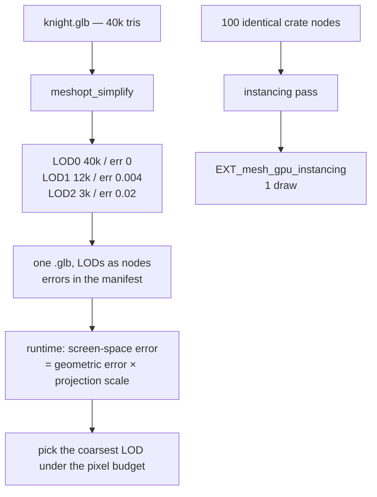

# PRD-098 — Distant and repeated objects stop costing full price

**Status: PROPOSAL, 2026-08-12. OPTIONAL.** Nothing has run. No platform readiness is claimed.
**Parent:** [the series README](./README.md).
**Depends on:** [PRD-096](./PRD-096-mesh-optimization.md),
[PRD-097](./PRD-097-native-decode-path.md).

**Complexity: 7 → HIGH mode.** Build-time generation plus a runtime selection policy, and a
performance claim that is only worth making if it is measured.

**Decline condition, stated up front:** if no shipped template or example is triangle-bound, this
PRD is speculative optimisation and should not be built. **Phase 0 exists to answer that, and a
"no" is an acceptable and complete outcome.**

---

## 1. Context

**Problem:** a mesh 200 metres away costs the same triangles as one filling the screen, and a
hundred copies of a crate are a hundred draw calls. The framework provides no LOD and no
instancing pass.

**Files analysed:**

- `packages/assets/src/passes/model.ts` — PRD-096's pass chain; `meshoptimizer` is already linked
- `packages/core/src/scene.ts` — where a per-frame selection hook would live
- `packages/core/src/collapse.ts` — the existing scene-collapse machinery, the nearest incumbent
- `scripts/budgets.ts`, the per-draw-cost work from PRD-069 — the existing cost measurements

**Current behaviour:** no LOD, no automatic instancing. `THREE.LOD` and `THREE.InstancedMesh`
exist in Three.js and a game may use them by hand today; nothing generates the inputs.

---

## 2. Solution

Generate LODs at build time with `meshopt_simplify`, carry the **geometric error it returns**
into the manifest, and select at runtime from screen-space error. Detect repeated nodes and emit
`EXT_mesh_gpu_instancing`.

The error metric is the whole point. A pipeline that emits "LOD1 at 50 metres" is a guess that
breaks at a different FOV or resolution; `meshopt_simplify` returns a real geometric error, and
screen-space error derived from it is resolution- and camera-correct.



**Key decisions:**

- [x] Discrete LODs only. **Meshlets and continuous cluster LOD are explicitly out of scope** —
      they are a renderer rewrite, not an asset pass, and are named here only as a possible
      successor once this is measured.
- [x] LOD selection uses `THREE.LOD` where possible. If the framework must own the selection, it
      owns only the error-to-distance computation and lets Three.js do the swapping.
- [x] Instancing is emitted only for nodes sharing mesh **and** material, with per-instance data
      limited to transform. Anything richer is the game's job.
- [x] The pass declines rather than guesses: a mesh whose simplification exceeds the error budget
      at the first step emits **no LOD** and says so in the report.
- [x] The 20-line rule applies to the runtime half. If the selection policy is under 20 lines, it
      ships in the template's `src/render/`, not in a package. **Phase 2 measures this before
      choosing a home.**

---

## 3. Integration Ledger

| # | New thing | Live caller (`file:line`, non-test) | Replaces | Old path removed? | Negative control |
|---|---|---|---|---|---|
| 1 | `lodPass` in `packages/assets/src/passes/lod.ts` | `assets/src/compile.ts:TBD` registry | nothing | n/a | set the error budget to 0 → no LODs emitted, and the report says so |
| 2 | LOD selection (home decided in Phase 2) | a template's `src/render/` **or** `core/src/scene.ts` — whichever the measurement justifies | manual `THREE.LOD` setup in game code | n/a — nothing does this today | force LOD0 always → the triangle-count gate goes red |
| 3 | `instancingPass` | `assets/src/compile.ts:TBD` | nothing | n/a | disable → draw-call gate red |
| 4 | LOD/instancing rows in the size and cost report | `assets/src/report.ts:TBD` | nothing | n/a | report a literal instead of a measurement → the report spec asserts the number moves with the scene |

### Reachability

**How is this reached?** The frame loop. A scene containing a LOD-annotated model selects a level
every frame from the camera; an instanced node issues one draw instead of N.

**Full flow:** user's model → LOD pass → LODs plus errors in the output → the game adds the model
as it always did → the selection hook picks a level per frame → the measured triangle count
drops when the camera pulls back.

**What does this replace?** Nothing automatic. It replaces hand-written `THREE.LOD` setup, which
no shipped template currently has — so the revert check leans entirely on the performance gates
in Phase 3, and that weakness is stated rather than hidden.

---

## 4. Execution phases

#### Phase 0: Prove there is a problem — and stop here if there is not

**Files (max 5):**

- `scripts/asset-cost-census.ts` - NEW: triangle counts, draw calls, and duplicate-node counts
  across every shipped template and example
- `docs/verification/asset-cost-census-<date>.md` - NEW

**Implementation:**

- [ ] Report per scene: total triangles, triangles at the shipped camera framing, draw calls,
      duplicate mesh+material node groups
- [ ] Reuse the PRD-069 per-draw-cost measurement rather than inventing a second one

**Exit:** if no scene shows a meaningful triangle or draw-call reduction available, **write the
census, close this PRD as declined, and build nothing.** That is a complete outcome.

**Tests required:**

| Test file | Test name | Assertion | Negative control |
|---|---|---|---|
| `scripts/__tests__/cost-census.spec.ts` | `should report a nonzero triangle count for a scene with geometry` | count > 0 | run against an empty scene → 0, and the census must say "nothing to gain" rather than pass silently |

---

#### Phase 1: LODs generated for the census's worst offender, with real error metrics

**Proof subject:** the highest-triangle model the census named. Not a sphere.

**Files (max 5):**

- `packages/assets/src/passes/lod.ts` - NEW
- `packages/assets/src/compile.ts` - EDIT: register the pass
- `packages/assets/src/report.ts` - EDIT: LOD rows
- `packages/create-threenative/src/config.ts` - EDIT: `assets.lod` block
- `packages/assets/__tests__/lod-pass.spec.ts` - NEW

**Implementation:**

- [ ] `meshopt_simplify` per level; record the returned error, never a hand-written distance
- [ ] Preserve UV seams and material boundaries; a simplifier that welds across a seam produces
      visible texture tearing
- [ ] Skinned meshes are **excluded by default** — simplifying a rigged mesh without re-binding
      weights is how a character melts

**Tests required:**

| Test file | Test name | Assertion | Negative control (observed red) |
|---|---|---|---|
| `lod-pass.spec.ts` | `should emit levels with monotonically increasing geometric error` | strictly increasing | emit a constant error → red |
| `lod-pass.spec.ts` | `should not simplify across a material boundary` | material count preserved | disable the boundary constraint → red |
| `lod-pass.spec.ts` | `should skip skinned meshes by default` | no LOD nodes emitted | enable them → red |
| `lod-pass.spec.ts` | `should emit no LOD when the first step exceeds the error budget` | zero levels, report line present | raise the budget → red |

---

#### Phase 2: Selection runs in the frame loop and the triangle count actually drops

**Files (max 5):**

- the selection implementation, **home decided by line count** — template `src/render/` under 20
  lines, `core/src/scene.ts` over
- `packages/core/src/scene.ts` - EDIT (only if the measurement justifies it)
- `templates/<kit>/playtests/lod.playtest.json` - NEW
- `scripts/asset-cost-census.ts` - EDIT: re-run as a gate

**Implementation:**

- [ ] Screen-space error = geometric error × projection scale at the node's distance
- [ ] Selection is deterministic and hysteretic — a level that flips every frame at a boundary is
      a visible pop
- [ ] Write the line count into the PRD and let it pick the home. **Do not decide first.**

**Tests required:**

| Test file | Test name | Assertion | Negative control |
|---|---|---|---|
| `lod.playtest.json` | triangle count drops when the camera pulls back | `diagnostics` assertion, before/after | pin LOD0 → red |
| `lod.playtest.json` | the silhouette at the shipped framing matches the LOD0 baseline | `visual` | select LOD2 at close range → red |
| `lod.playtest.json` | no level flip during a slow dolly | level-change count bounded | remove hysteresis → red |

**Revert check:** pin the selection to LOD0 → the triangle-count assertion fails. This is the
only real revert this PRD has, which is why it is a gate and not a note.

---

#### Phase 3: Instancing, and the whole thing measured against the census

**Files (max 5):**

- `packages/assets/src/passes/instancing.ts` - NEW
- `packages/assets/src/compile.ts` - EDIT
- `templates/<kit>/playtests/lod.playtest.json` - EDIT: draw-call assertion
- `docs/verification/asset-pipeline-cost-<date>.md` - NEW

**Tests required:**

| Test file | Test name | Assertion | Negative control |
|---|---|---|---|
| `instancing-pass.spec.ts` | `should emit EXT_mesh_gpu_instancing for nodes sharing mesh and material` | extension declared, node count collapsed | vary one material → no instancing, assertion red |
| `lod.playtest.json` | draw calls drop for the repeated-object scene | `diagnostics` before/after | disable the pass → red |
| `native-verify-assets --target desktop` | native renders the instanced scene identically | screenshot comparison | native ignoring the extension → red |

**Revert check:** disable instancing → the draw-call assertion fails on both web and desktop.

---

## 5. Verification strategy

```bash
# 1. The census is a measurement, not a literal
pnpm tsx scripts/asset-cost-census.ts --json | jq '.scenes[].triangles'
# Expected: numbers that change when a model is removed from the scene

# 2. Baseline control — the triangle-drop gate must fail before the change
git stash && sh scripts/xvfb.sh pnpm test:templates; git stash pop
# Expected: lod.playtest.json absent or failing

# 3. Caller census
grep -rn "lodPass\|instancingPass\|selectLod" packages examples --include='*.ts' | grep -v __tests__
# Expected: a frame-loop consumer, not only the compile registry

# 4. Frame-loop control — the harness must not call the selection function directly
grep -n "selectLod" templates/*/playtests/*.json packages/playtest/src -r
# Expected: no hits. The playtest observes triangle counts; it never invokes selection itself.
```

---

## 6. Acceptance criteria

- [ ] The census names at least one shipped scene with a real reduction available — **or this PRD
      is declined and nothing is built**
- [ ] Pulling the camera back in a shipped template measurably lowers the triangle count, with the
      silhouette unchanged at the shipped framing
- [ ] A scene with repeated props issues fewer draw calls, on web and on desktop native
- [ ] A rigged character is never silently simplified
- [ ] The LOD selection code's home was chosen by its measured line count against the 20-line
      rule, and the count is recorded here

**Integration gates:**

- [ ] Ledger has zero `TBD` cells
- [ ] Caller census shows a frame-loop consumer, not just the pass registry
- [ ] Revert check passed: pinning LOD0 fails a gate
- [ ] Every gate observed red once
- [ ] Proved on the census's worst real model

## 7. Risks

| Risk | Mitigation |
|---|---|
| Speculative optimisation nobody needs | Phase 0 can decline the whole PRD; that is a designed exit, not a failure |
| LOD popping looks worse than the cost it saves | Hysteresis plus a visual assertion at the shipped framing; a visible pop fails the gate |
| Simplification tears UV seams | Boundary constraints in the pass and a visual gate on a textured model |
| The selection lands in a package that a game could write in 20 lines | The home is chosen by measured line count, after the code exists |
| Scope creep into meshlets and cluster LOD | Explicitly out of scope; a successor PRD, not an extension of this one |
