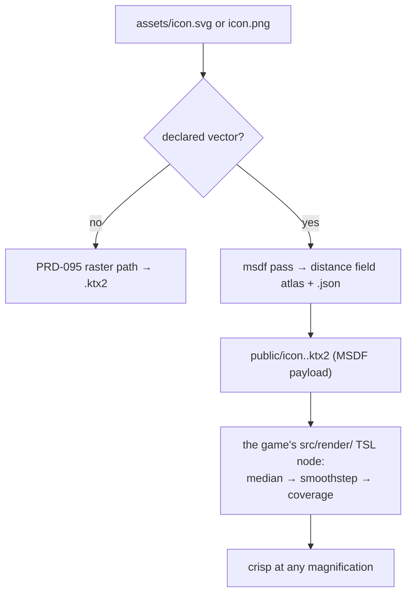

# PRD-099 — Vector textures: the open answer to the problem Rixels solves

**Status: PROPOSAL, 2026-08-12. OPTIONAL, and the most speculative PRD in the series.**
Nothing has run. No platform readiness is claimed.
**Parent:** [the series README](./README.md).
**Depends on:** [PRD-095](./PRD-095-texture-compression.md).

**Complexity: 6 → MEDIUM mode.**

**Decline condition, stated up front:** if no shipped template or example has flat-colour,
icon-like or hard-edged art that KTX2 handles badly, this is a solution without a problem.
**Phase 0 answers that, and declining is a complete outcome.**

---

## 1. Why this exists, and what it is not

4J Studios' Rixels encode texture information as a small vocabulary of vector primitives decoded
on the GPU, reportedly taking a 512×512 texture from ~4 MB to ~72 KB while staying crisp under
magnification. It is **not open source**: it is part of a proprietary engine, a patent
application is pending, and no public implementation exists.

**This PRD does not clone Rixels, and no phase in it reads or reimplements their technique.**

It builds the MSDF path instead — multi-channel signed distance fields, published in 2015, MIT
licensed via `msdfgen`, used by every game engine that renders sharp text. It reaches a similar
destination by a route with no claim over it:

| | Rixels | MSDF |
|---|---|---|
| Stored | vector shape indices | signed distances, 3 channels |
| Decoded | GPU, proprietary | GPU, `median(r,g,b)` then `smoothstep` |
| Crisp under magnification | yes | yes |
| Available to us | no | yes, today |

MSDF is worse than Rixels for photographic content — it is not a general texture codec and this
PRD never claims otherwise. It is better than KTX2 for exactly the art KTX2 is worst at: hard
edges, flat fills, icons, decals, stylized 2D, UI symbols in world space.

---

## 2. Context

**Files analysed:**

- `packages/assets/src/passes/texture.ts` — PRD-095's texture pass and its heuristic
- `packages/create-threenative/templates/*/src/render/` — where anything a screenshot shows lives
- `packages/core/src/index.ts` — the surface a shader helper would have to avoid joining

**Current behaviour:** every texture goes through the raster path. An icon or a decal
supercompressed as ETC1S shows ringing at its edges and blurs when magnified.

---

## 3. Solution

A second texture representation, chosen per asset, **never guessed**.



**Key decisions:**

- [x] **Declared, not detected.** PRD-095's raster heuristic guesses a codec, and a wrong guess
      costs quality. Here a wrong guess would silently replace an artist's texture with a
      two-tone mask. Vector treatment is opt-in per glob, always.
- [x] **The shader ships in the template's `src/render/`, as generated user source.** The decode
      is `median(r,g,b)` then `smoothstep` — about four lines of TSL. Putting it in a package
      would both break the 20-line rule and hand the framework ownership of something a
      screenshot shows, which it never takes.
- [x] `msdf-atlas-gen` / `msdfgen` (MIT) at build time. Vector inputs (`.svg`) go straight in;
      raster inputs are traced first and **the trace is reported, never silent** — a traced PNG
      that lost detail must be visible in the report.
- [x] The MSDF payload rides inside a normal `.ktx2`, so PRD-097's native path decodes it with no
      new C++ and no new format.
- [x] Vocabulary is borrowed: `MSDF`, `distance field`, `atlas`, `smoothstep` — all existing
      terms from Three.js and the MSDF literature. Nothing new is named.

---

## 4. Integration Ledger

| # | New thing | Live caller (`file:line`, non-test) | Replaces | Old path removed? | Negative control |
|---|---|---|---|---|---|
| 1 | `msdfPass` in `packages/assets/src/passes/msdf.ts` | `assets/src/compile.ts:TBD` registry | nothing | n/a | mark a photo as vector → the quality gate must go red, not pass |
| 2 | MSDF TSL node in `templates/<kit>/src/render/msdf.ts` | the template's material construction, `src/render/` | the raster material for the declared assets | the raster copy is removed for those assets in the same phase | replace `median` with a single channel → visible corner rounding, visual gate red |
| 3 | `assets.vector` config block | `create-threenative/src/config.ts:TBD` | nothing | n/a | an undeclared glob must **not** get MSDF treatment |
| 4 | magnification quality gate | `scripts/asset-quality.ts:TBD` | nothing | n/a | compare a texture against itself → the gate must report that it proved nothing |

### Reachability

**How is this reached?** The template's own material code samples the MSDF texture through the
`src/render/` node. There is no framework API — by design.

**Full flow:** user declares `assets.vector: ["icons/*.svg"]` → the pass emits a distance-field
atlas → the manifest marks it `msdf` → the template's render layer builds a material using the
MSDF node → the icon is crisp at 8× magnification where the KTX2 version is blurred.

**What does this replace?** The raster path for the declared assets only. Both must not be live
for the same asset, and Phase 2 deletes the raster output for anything declared vector.

---

## 5. Execution phases

#### Phase 0: Find the art that needs this, or decline

**Files (max 3):**

- `scripts/asset-quality.ts` - NEW: render each shipped texture at 1×, 4× and 8× magnification
  through both paths and score edge sharpness
- `docs/verification/vector-texture-census-<date>.md` - NEW

**Exit:** if no shipped asset scores meaningfully worse under KTX2 than under MSDF, **write the
census and decline the PRD.** Building an MSDF pipeline for art nobody has is the kind of
speculative abstraction this repo deletes.

**Tests required:**

| Test file | Test name | Assertion | Negative control |
|---|---|---|---|
| `scripts/__tests__/asset-quality.spec.ts` | `should score a hard-edged synthetic worse than a photograph under ETC1S` | ordering holds | swap the inputs → red |
| `scripts/__tests__/asset-quality.spec.ts` | `should report that it proved nothing when both sides are the same file` | exit 2 | pass two different files → red |

---

#### Phase 1: One declared asset becomes an MSDF and survives 8× magnification

**Proof subject:** the worst-scoring real asset from Phase 0. Not a generated checkerboard.

**Files (max 5):**

- `packages/assets/src/passes/msdf.ts` - NEW
- `packages/assets/src/compile.ts` - EDIT: register, gated on the `vector` declaration
- `packages/create-threenative/src/config.ts` - EDIT: `assets.vector`
- `packages/assets/__tests__/msdf-pass.spec.ts` - NEW

**Implementation:**

- [ ] `.svg` in directly; raster inputs traced, with the trace loss reported per asset
- [ ] Emit the atlas plus its layout JSON; wrap the payload in a `.ktx2`
- [ ] An asset that is **not** declared vector must never reach this pass — assert it

**Tests required:**

| Test file | Test name | Assertion | Negative control (observed red) |
|---|---|---|---|
| `msdf-pass.spec.ts` | `should emit a three-channel distance field for a declared vector asset` | channel count 3 | emit single-channel SDF → red |
| `msdf-pass.spec.ts` | `should not process an undeclared asset` | pass never invoked | declare it → red |
| `msdf-pass.spec.ts` | `should report trace loss for a raster input` | report line present with a nonzero figure | feed an `.svg` → no line, assertion red |
| `asset-quality.ts` | the MSDF output beats KTX2 at 8× on the chosen asset | sharpness score | run the comparison on the raster output twice → exit 2 |

---

#### Phase 2: It is on screen, in a template, and the raster copy is gone

**Files (max 5):**

- `templates/<kit>/src/render/msdf.ts` - NEW: the TSL node, generated user source
- `templates/<kit>/src/render/` - EDIT: the material that uses it
- `templates/<kit>/assets/` - EDIT: the declared asset
- `templates/<kit>/playtests/vector.playtest.json` - NEW
- `templates/<kit>/threenative.config.*` - EDIT: `assets.vector`

**Implementation:**

- [ ] The node is `median(r,g,b)` then `smoothstep` with a screen-derivative width — nothing more
- [ ] Record its line count. If it exceeds 20, that is a signal the representation is wrong, not
      a reason to move it into a package
- [ ] Delete the raster output for the declared asset — no asset gets two live representations

**Tests required:**

| Test file | Test name | Assertion | Negative control |
|---|---|---|---|
| `vector.playtest.json` | the icon is visible at the shipped framing | `visibility` | remove the material binding → red |
| `vector.playtest.json` | the icon stays sharp when the camera closes to 8× | `visual` against a sharp reference | swap in the KTX2 version → red |
| `vector.playtest.json` | no console error | console assertion | ship a mismatched atlas JSON → red |

**Revert check:** delete `src/render/msdf.ts` → the template fails to build and the playtest
fails, because the raster copy of that asset no longer exists.

---

#### Phase 3: Native renders it too, with no new C++

**Files (max 3):**

- `scripts/native-verify-assets.ts` - EDIT: the vector scene
- `docs/verification/vector-texture-native-<date>.md` - NEW

**Implementation:**

- [ ] The MSDF payload is an ordinary `.ktx2`; PRD-097's decoder handles it unchanged
- [ ] **If any new native code is required, the payload design is wrong** — fix the payload

**Tests required:**

| Test file | Test name | Assertion | Negative control |
|---|---|---|---|
| `native-verify-assets --target desktop` | the vector asset renders sharp on desktop | screenshot comparison against the web capture | force a bilinear raster sample → red |
| `asset-parity.ts` | the MSDF `.ktx2` is byte-identical across web and native packages | hash equality, both paths printed | patch a byte → red |

**Revert check:** none needed beyond Phase 2 — if this phase needs a code change to pass, that is
itself the finding.

---

## 6. Verification strategy

```bash
# 1. Caller census — the pass and the shader both have real consumers
grep -rn "msdfPass" packages --include='*.ts' | grep -v __tests__
grep -rn "msdf" packages/create-threenative/templates/*/src/render/

# 2. No package owns the look
grep -rn "msdf\|smoothstep\|median" packages/core/src packages/ui/src
# Expected: ZERO hits. Anything a screenshot shows lives in the user's src/render/.

# 3. Self-comparison control on the quality gate
pnpm tsx scripts/asset-quality.ts --print-resolved
# Expected: two different artifact paths. Identical paths means the gate proves nothing.

# 4. Baseline control
git stash && pnpm tsx scripts/asset-quality.ts; git stash pop
# Expected: the gate fails or reports nothing to compare
```

---

## 7. Acceptance criteria

- [ ] The census names at least one shipped asset that KTX2 handles measurably worse — **or this
      PRD is declined and nothing is built**
- [ ] That asset stays sharp at 8× magnification in a running template, where the KTX2 version
      is visibly blurred, judged by a visual playtest
- [ ] The MSDF decode shader lives in the template's `src/render/` as generated user source, and
      `grep` over `packages/core/src` and `packages/ui/src` returns zero MSDF hits
- [ ] The same file renders sharp on desktop native with **no new C++**
- [ ] Nothing is treated as vector unless the user declared it

**Integration gates:**

- [ ] Ledger has zero `TBD` cells
- [ ] Caller census pasted, including the zero-hit package check
- [ ] Revert check passed: deleting the render node breaks the template
- [ ] The raster copy of every declared vector asset is deleted, not kept alongside
- [ ] Every gate observed red once, including the self-comparison control
- [ ] Proved on the census's worst real asset

## 8. Risks

| Risk | Mitigation |
|---|---|
| A solution looking for a problem | Phase 0 declines the PRD outright; that is a designed exit |
| MSDF applied to art it ruins | Opt-in per glob only, never a heuristic |
| The shader creeps into a package | An explicit zero-hit grep over `core` and `ui` is an acceptance gate |
| Patent exposure from the Rixels claims | No phase reads or reimplements their technique; MSDF is prior art from 2015 with an MIT implementation. This is a design constraint, not legal advice — if the patent publishes and looks relevant, read the claims before continuing |
| Scope creep toward a general vector texture codec | The scope is a distance field for declared assets. A general codec is a different, much larger PRD that this one does not authorise |
