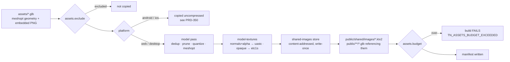

# PRD-349 — The cook is on by default

**Status:** IN PROGRESS — execution evidence: `docs/verification/PRD-349-the-cook.md`; assumptions: `docs/verification/PRD-349-assumption-spike.md`
**Complexity:** 3 (10+ files) + 2 (new gate/field) + 2 (multi-package) = **7 → HIGH mode**
**Batch:** `docs/PRDs/assets/`
**Siblings:** PRD-350 (platform gate per pass), PRD-351 (quality floor), PRD-352 (first-party ingest)

---

## 1. Context

**Problem:** ThreeNative's compile step is a cook step — block compression, mips, dedupe, container
compression — and in every scaffolded game it is switched off, so a game ships its editor-source
bytes to players.

**The one-sentence fix:** keep the `.uasset`→`.glb` converter exactly as it is, and turn the cook on.

### Ingest and cook are different questions

```
   Unreal pack                 your repo                     the player
        │                          │                              │
        │  ① INGEST                │  ② COOK                      │
        │  (once, your machine)    │  (every build, ships)        │
        ▼                          ▼                              ▼
   .uasset  ─────────────────►  assets/  ──────────────────►   public/
             converter                      compile step
```

`.uasset`→`.glb` conversion and direct `.uasset` loading are answers to ①. Compression, dedupe and
mips are ②. **All of the 289 MB lives in ②.** ① is working and this PRD does not touch it
(see PRD-352 for making ① first-party).

**Files analyzed**

| Path | What it told us |
|---|---|
| `packages/assets/src/compile.ts:945, 654-658` · `apply-worker.ts:41` | `sharedImages` honoured only on `=== true` |
| `packages/assets/src/passes/shared-images.ts:8-17` | the dedupe store — built, tested, off; its doc comment describes wildwood exactly |
| `packages/assets/src/passes/model-textures.ts:479-487` | `encodeToKTX2` called **without** `needSupercompression` |
| `ktx2-encoder@0.6.0/src/utils.ts`, `applyInputOptions.ts` | `needSupercompression` defaults **true** in executable code; the original false assumption was incorrect |
| `packages/assets/src/passes/model-textures.ts:357-360` | `chooseCodec`: normals→`uastc`, alpha→`uastc`, else `etc1s` — already quality-aware |
| `packages/assets/src/compile.ts:210-224` | **the platform matrix is already solved** — `platform` drops undecodable passes per target |
| `packages/create-threenative/templates/starter/threenative.config.ts:54` | ships `models: "none", textures: "none"` |
| `packages/create-threenative/templates/sailing/threenative.config.ts:38` | same |
| `packages/assets/src/passes/glob.ts` | `globMatch` exists — `assets.exclude` needs no dependency |
| `packages/assets/src/report.ts:397` | `formatSkippedCompression` — wired, prints, never fatal |

### The templates' `"none"` is a fossil

`compile.ts:216-222` already says so, in the engine's own words:

> *"This is the whole reason `assets.textures: "none"` used to be pinned in the scaffolded config:
> the author was asked to choose one constant for four targets, and every game that wanted Android
> shipped its web build uncompressed too. **The build knows its target; it decides.**"*

The per-target gate landed. The templates were never updated. wildwood inherited the fossil —
comment and all — and shipped 289 MB.

**This also means flipping the default carries no mobile risk:** `compile.ts:905` drops the
compressing passes for `android` and `ios` regardless of config. Web and desktop decode both.

---

## 2. Measured evidence (wildwood, 2026-09-04)

Load set = the 56 `SM_*` models `src/scenes/Valley.ts` names, plus animals, audio and HDRI,
resolved through `entries[path].output`.

| Quantity | Bytes |
|---|---|
| **Runtime load, one scene** | **289 MB** |
| — embedded PNG in the 56 flora GLBs | 259 MB |
| — of which **distinct** (39 images, 33.3 MP) | 52.7 MB |
| — **pure duplication** | **206 MB** |
| — geometry + animation, all 56 models | **5.7 MB** |
| — animals (6 rigged) / audio / HDRI | 15.8 / 0.7 / 10.4 MB |
| Manifest output total | 1,910 MB |

Two models, opened:

```
SM_BoughGroup01.glb  11 MB   geometry 0.05 MB (0.5%)   5 PNG = 10.0 MB
SM_pine04.glb       8.8 MB   geometry 0.30 MB (3.4%)   4 PNG =  8.7 MB
ext: ['EXT_meshopt_compression','KHR_mesh_quantization']  generator: glTF-Transform v4.5.0
```

The three largest textures are embedded **11 times each**. Every manifest entry reads `"passes": []`.

### Spike: the cook, run for real on 6 of these pines (2026-09-04)

Before any code. Installed `@threenative/assets@0.3.0`, `{ models: { sharedImages: true } }`,
textures left absent so the defaults apply. Full record:
`docs/verification/PRD-349-assumption-spike.md`.

| | |
|---|---|
| input | 6 GLBs, **55.2 MB** (`SM_pine01..05`, `SM_pine-small01`) |
| output | **4.97 MB — 90.6% smaller**, in 25 s |
| `shared/images/` | **4 files, 3.68 MB** — written once, not 6× (would have been 22.1 MB) |
| resized | **0** — both sides 1024², no pixel discarded |
| structure | `KHR_texture_basisu` in `extensionsRequired`; images carry `uri: shared/images/<hash>.uastc.ktx2`; `basis_transcoder.js`+`.wasm` copied to the output root automatically |

Quality, decoded back through the shipped transcoder at `cTFRGBA32` and compared per pixel:

| Texture | SSIM | mean abs err | p99 | PNG → KTX2 |
|---|---|---|---|---|
| `T_pine_bark_diffuse` | 0.9857 | 2.21/255 | 9 | 3.55 → 1.29 MB |
| `T_pine_bark_normal` | 0.9689 | 4.08/255 | 15 | 2.82 → 1.29 MB |
| `T_leafs_diffuse` | 0.9837 | 1.30/255 | 14 | 1.08 → 0.51 MB |
| `T_leafs_normal` | 0.9903 | 2.32/255 | 21 | 1.22 → 0.60 MB |

The model pass also accepted input that was **already** meshopt-compressed — all 6 inputs carry
`EXT_meshopt_compression` and all 6 recompiled without error.

**Still open, and Phase 4 must close it:** a browser has not yet rendered a cooked GLB end to end.
The structure is right and the textures decode standalone, but the headed-capture harness failed on
module resolution, not on the assets. `quarry` must prove this with a real render, never a
structural assertion.

### Why `.uasset` is not the answer, stated correctly

An earlier draft argued this from loader capability. The bytes:

| Form | wildwood's load set |
|---|---|
| **uncooked** `.uasset` (56 meshes + 51 textures) | **754 MB** (53.3 mesh + 700.7 texture) |
| `.glb` as imported today | 289 MB |
| after this PRD | ~35-45 MB |

Uncooked `.uasset` is Unreal's **editor source** — the `.psd`, not the delivery format. It holds
4096² masters, import settings and LOD source. `T_pine_bark_normal` is 38.6 MB for that reason.
Confirmed uncooked: the tree contains zero `.pak`, `.utoc`, `.ucas`, `.uexp` or `.ubulk`.

Unreal ships **cooked** assets and they are very compact. This PRD is that cook:

| Unreal's cook | This compile step |
|---|---|
| BC1-7 / ASTC block compression | KTX2 Basis (UASTC / ETC1S) |
| generated mips | generated mips |
| IoStore shared chunks | `shared/images/` content-addressed store |
| Oodle container compression | Zstd supercompression |

The one thing we deliberately do differently: Unreal cooks **per platform** (BC7 desktop, ASTC
mobile — two payloads). ThreeNative ships one build to web, desktop, Android and iOS, so it needs a
**transcodable** file. KTX2/Basis is exactly that: one file becomes BC7 on desktop and ASTC/ETC on
mobile. Oodle is licensed and not browser-decodable; zstd is the open equivalent and KTX2 carries
it natively.

---

## 3. Solution

**Two switches, one new field, one gate.** Nothing here is lossy beyond the codec policy that
already exists, and no pixel is discarded: **output resolution is unchanged by this PRD.**

- **Switch 1 — `sharedImages` defaults `true`.** 206 MB, bit-exact, provable by sha256.
- ~~**Switch 2 — `needSupercompression: true`**~~ — **REFUTED by the spike: 0.0% on all four
  textures.** Both arms already used Zstd: the dependency defaults omission to true. The flag
  stays unset and that default is preserved; RDO is lossy and belongs to PRD-351.
- **Switch 2 — the templates stop saying `"none"`.** The per-target gate already protects mobile.
- **New `assets.exclude`** — glob list on the existing `globMatch`, so 677 MB nothing loads stops
  being copied.
- **New `assets.budget`** — **a ceiling on _uncooked_ bytes, not on total bytes.** DECIDED: an
  absolute size cap is the wrong gate. Games legitimately differ by 100×, so any cap loose enough
  not to break them is too loose to catch the next wildwood. The defect is not "large"; it is
  "large **and uncooked**". `{ uncooked?: number | "none", total?: number | "none" }`, default
  `uncooked: 64_000_000`, `total: "none"`. It counts only bytes that shipped uncompressed **on a
  target that could have compressed them**, so a legitimately large cooked game never trips it and
  wildwood's 1,910 MB trips it immediately.



**Key decisions**

- [ ] **No new dependency.** `globMatch` and `createSharedImageStore` already exist.
- [ ] **Reporting already exists.** The spike found `manifest.entries[*].sharedImages[]` already
      carries `codec`, `key`, `bytes` and `output` per shared image — the byte accounting this PRD
      needs is plumbed.
- [ ] **No resolution change.** `maxSize` default stays `null`. Downscaling is the one lever that
      genuinely nerfs an asset, and it belongs to PRD-351 where it can be judged on its own.
- [ ] **No geometry change.** Geometry is 0.5-3.4% of the bytes and already meshopt+quantized.
- [ ] Default flips at the **parse** site so the worker protocol keeps carrying explicit booleans.
- [ ] Charter: mechanism only — no geometry, material, colour, curve or timing is decided here.
      Rule 7 ("a default that is right with no option passed") is the entire PRD.

**Data changes:** `IThreeNativeConfig.assets` gains `exclude?: readonly string[]` and
`budget?: { uncooked?: number | "none"; total?: number | "none" } | "none"`.
`models.sharedImages`'s documented default changes false → true.

**Projection**

| Stage | Load set | Quality cost |
|---|---|---|
| today | 289 MB | — |
| + dedupe + exclude | **~83 MB** | **zero — bit-identical pixels** |
| + KTX2 with zstd (existing codec policy) | **~35-45 MB** | codec loss only, at unchanged resolution |

HDRI is 10.4 MB of the final figure and is out of scope.

---

## Integration Ledger

| # | New thing | Live caller (`file:line`, non-test) | Replaces | Old path removed? | Negative control |
|---|---|---|---|---|---|
| 1 | `sharedImages` default `true` | `packages/assets/src/compile.ts:~658` → `:945`, `apply-worker.ts:41` | the `=== true` opt-in | the `=== true` literals deleted | `sharedImages:false` → duplicate images reappear; byte count rises |
| 2 | ~~`needSupercompression`~~ | **CUT — spike measured 0.0% gain** | — | — | — |
| 3 | starter/sailing defaults | `templates/starter/threenative.config.ts:54`, `templates/sailing/…:38` | `models:"none", textures:"none"` | both lines deleted | re-adding `"none"` restores uncompressed size |
| 4 | `assets.exclude` | `packages/core/src/config.ts:~175` → `packages/assets/src/compile.ts:<glob site>` | nothing — new | `exclude:[]` ships the file again |
| 5 | `TN_ASSETS_BUDGET_EXCEEDED` (uncooked bytes) | `packages/assets/src/compile.ts:~1817` | the informational-only warning | warning kept, throw added | raising `budget.uncooked` past the total makes the same build pass; a fully-cooked build of the same size does **not** trip it |
| 6 | `quarry` POC game | `sandbox/quarry/` — its own `pnpm build` per target | nothing — new proof lane | deleting its config's defaults restores the duplicated output |

**Reachability**

- Entry point: `threenative build --target <t>` → `compileAssets()`; dev watcher `watchAssets()`.
- Pre-existing files EDITED: `packages/assets/src/compile.ts`, `apply-worker.ts`,
  `passes/model-textures.ts`, `packages/core/src/config.ts`, both template configs.
- Registration: none — these are defaults inside an already-running pass chain.
- User-facing? **No UI.** Observable in the compile's printed report, in
  `public/assets.manifest.json`, and in load time.

**Full flow:** dev runs `pnpm build --target web` → `compileAssets` reads `config.assets` → the
model pass runs with `sharedImages: true` → distinct images encode once into
`public/shared/images/` → the manifest records the smaller outputs → the budget gate passes or
throws.

**What does this replace?** The opt-in `sharedImages` gate and the two templates' `"none"`.
Both deleted in the phase that supersedes them, so no behaviour has two live implementations.

---

## 4. Execution phases

### The proof subject: a POC game first, wildwood last

The capability is proved on **`sandbox/quarry`** — a new, small, *real* game built for this PRD —
and only then confirmed on wildwood.

This is deliberate and it is not a toy exemption. wildwood is a 40-minute compile, an 8.3 GB tree
and a scene with animals, water and post — it cannot tell you *which* switch moved a number.
`quarry` is built to reproduce the exact failing shape at a size that iterates in seconds:

**`quarry`'s brief:** a walkable stone quarry floor with **6 props drawn from the real Landscape Pro
pack** — 3 rocks and 3 cliff pieces — chosen because **they share 2 texture sets between them**.
That is the duplication shape, at 6 models instead of 56.

**Requirements `quarry` does NOT exercise, and where they close:**

| Not exercised by `quarry` | Closed in |
|---|---|
| skeletal meshes with embedded textures (the animal pack) | Phase 5 (wildwood) |
| 39 distinct images across 7 material families | Phase 5 |
| a 677 MB unreferenced artifact | Phase 4 exercises `exclude` on a planted 200 MB file; Phase 5 on the real one |
| audio, water, post-processing interaction | Phase 5 |

**`quarry` is committed and pushed as soon as it runs**, per the sandbox standing instruction — it
is a game in the examples repo, not scratch.

---

#### Phase 1 — `sharedImages` is on when nobody asked

*Outcome:* compiling two models that embed the same image writes that image once, with no config.

**Files (max 5)**

- `packages/assets/src/compile.ts` — EDIT: `parseModelsConfig` defaults `sharedImages` to `true`;
  `=== true` reads at ~945/954 become plain booleans.
- `packages/assets/src/apply-worker.ts` — EDIT: line 41-42 reads the boolean.
- `packages/core/src/config.ts` — EDIT: line ~72 doc "Default false" → "Default true", and say what
  `false` costs.
- `packages/assets/__tests__/shared-images.spec.ts` — EDIT: the no-config case.
- `packages/assets/README.md` — EDIT: the defaults table.

**Wiring**

- [ ] Caller edited: `compile.ts` parse site, reached from `compileAssets`
- [ ] Old path: the `=== true` literals **deleted**, not left beside the new read
- [ ] Ledger rows filled: #1

**Tests required**

| Test file | Test name | Assertion | Negative control (observed red) |
|---|---|---|---|
| `__tests__/shared-images.spec.ts` | `should write one image when two models embed the same bytes and no config is given` | exactly 1 file under `shared/images/` | set `sharedImages:false` → 2 embedded copies, fails |
| `__tests__/shared-images.spec.ts` | `should keep the opt-out honoured when sharedImages is false` | 2 models, 0 shared files | flip the default back → still passes, proving it measures the override not the default |
| `__tests__/model-pass.spec.ts` | `should not grow a 150-byte source image` | output ≤ source | pass a large image → fails, proving the comparison is live |

**Revert check:** restore `=== true` at `compile.ts:945` → test 1 goes red.

```bash
cd packages/assets && pnpm test shared-images
grep -rn "sharedImages === true" packages/assets/src/   # expected: no hits
```

---

#### ~~Phase 2 — UASTC supercompression~~ — CUT, refuted by the spike

`needSupercompression: true` was measured against `needSupercompression` absent on all four of the
pack's textures: **0.0% difference, every time.**

```
T_pine_bark_diffuse  1024x1024   source PNG 3.55 MB
   uastc             1.287 MB
   uastc+zstd        1.287 MB      <-- 0.0% smaller
```

Execution correction: `ktx2-encoder@0.6.0` merges `DefaultOptions.needSupercompression: true`
before applying options. This comparison used Zstd on both sides, not raw UASTC versus Zstd.
The flag stays unset and its existing default stays true. **PRD-351 owns RDO**, behind the
quality floor that makes it safe to turn on.

A second spike finding shapes PRD-351: `chooseCodec` selected `uastc` for **all four** textures,
including `T_pine_bark_diffuse`, because this pack stores cutout alpha in the diffuse map. ETC1S —
the cheap codec — never fired on this pack at all. So the remaining headroom here is RDO, not codec
selection.

---

#### Phase 3 — the templates stop opting out

*Outcome:* a game scaffolded today cooks its assets without anyone editing a config.

**Files**

- `packages/create-threenative/templates/starter/threenative.config.ts` — EDIT: delete both keys
  and the fossil comment.
- `packages/create-threenative/templates/sailing/threenative.config.ts` — EDIT: same (line 38).
- `packages/create-threenative/__tests__/template-assets-compile.spec.ts` — EDIT: assert no
  template carries `"none"`.
- `packages/create-threenative/__tests__/scaffold.spec.ts` — EDIT: **re-pin the PRD-201 scaffold
  hash in this same commit** — a template edit moves it, and a stale pin fails every other lane.
- `packages/create-threenative/templates/*/AGENTS.md` — EDIT: state the defaults and the overrides.

**Implementation**

- [ ] Delete the keys entirely rather than setting `{}` — absent is the documented "run with
      defaults", and it is what the next template author will copy.
- [ ] Sweep the other 8 templates for the same keys.
- [ ] Keep the starter's 150-byte proof asset; Phase 1's regression covers it.

**Wiring**

- [ ] Caller edited: the scaffolder already reads these files
- [ ] Old path: the `"none"` values **deleted**
- [ ] Ledger rows filled: #3

**Tests required**

| Test file | Test name | Assertion | Negative control |
|---|---|---|---|
| `__tests__/template-assets-compile.spec.ts` | `should compile every template with compression on by default` | no template config contains `"none"` for models/textures | re-add to starter → fails |
| `__tests__/scaffold.spec.ts` | existing PRD-201 hash | re-pinned hash matches | leave the old pin → fails, proving the pin is live |

---

#### Phase 4 — `quarry`: the flow, proved on all four targets

*Outcome:* a new sandbox game imports real Unreal props, ships them cooked, and **builds green for
web, desktop, Android and iOS.**

**Files**

- `sandbox/quarry/` — NEW: the game (scaffolded from `crate-vault`, per the sandbox note that it is
  the one to clone).
- `sandbox/quarry/threenative.config.ts` — NEW: **no `assets` block at all** — that absence is the
  thing under test.
- `sandbox/quarry/playtests/quarry.playtest.json` — NEW: walk past all 6 props.
- `packages/assets/src/compile.ts` — EDIT: `assets.exclude`, filtered through `globMatch`.
- `packages/core/src/config.ts` — EDIT: `exclude?: readonly string[]`.

**Implementation**

- [ ] Import 6 props (3 rocks, 3 cliffs) from the Landscape Pro pack, chosen so 2 texture sets are
      shared across them.
- [ ] Plant one 200 MB unreferenced artifact in `assets/` and exclude it by glob.
- [ ] Build every target and record what each shipped.

**Wiring**

- [ ] Caller edited: `compile.ts` source-enumeration site
- [ ] Registration: `exclude` validated alongside the existing `TARGET_KEYS` check
- [ ] Ledger rows filled: #4, #6

**The platform matrix — recorded, not assumed**

| `--target` | KTX2 | meshopt | dedupe | expected result |
|---|---|---|---|---|
| `web` | ✅ | ✅ | ✅ | cooked, smallest |
| `desktop` | ✅ | ✅ | ✅ | cooked |
| `android` | ❌ no WASM | ❌ | *dropped today* | builds green; **records the mobile byte count** |
| `ios` | ❌ | ❌ | *dropped today* | builds green |

> Android and iOS drop the whole model pass at `compile.ts:905`, so they get **no dedupe either**
> — a pass that needs no decoder. That is a real gap, it is measured here, and **PRD-350 fixes it.**
> This PRD's job is to record the number, not to leave it unmeasured.

**Tests required**

| Test file | Test name | Assertion | Negative control |
|---|---|---|---|
| `packages/assets/__tests__/compile.spec.ts` | `should omit an excluded model from the manifest` | entry undefined | `exclude:[]` → present |
| `packages/assets/__tests__/compile.spec.ts` | `should report the bytes an exclusion saved` | line names the total | exclude nothing → reports 0, not absent |
| `packages/assets/__tests__/compile.spec.ts` | `should reject a non-array exclude` | throws `TN_ASSETS_CONFIG_INVALID` | valid array → no throw |
| `sandbox/quarry/playtests/` | `quarry.playtest.json` | all 6 props present and textured | — |

**Revert check:** remove the `globMatch` call → the first test goes red.

**User verification (MANUAL — visual)**

- Action: `bash tools/capture-lock.sh node tools/look.mjs` before and after the cook.
- Expected: indistinguishable frames. **Look at them.** Every automated gate here passes on grey
  boxes.

**Evidence to record**

```
quarry, per target:
  web      manifest ___ MB   shared/images ___ files   ktx2 ___ / png ___
  desktop  manifest ___ MB
  android  manifest ___ MB   (no cook — the PRD-350 number)
  ios      manifest ___ MB
excluded:  ___ MB
frames:    screenshots/quarry-before.png  screenshots/quarry-after.png
```

---

#### Phase 5 — the budget gate, then wildwood

*Outcome:* a build over its byte budget fails; and wildwood's valley loads in ≤ 45 MB looking the
same.

**Files**

- `packages/core/src/config.ts` — EDIT: `budget?: { uncooked?: number | "none"; total?: number | "none" } | "none"`.
- `packages/assets/src/compile.ts` — EDIT: throw `TN_ASSETS_BUDGET_EXCEEDED` at ~1817, beside
  `formatSkippedCompression`.
- `packages/assets/src/report.ts` — EDIT: `formatBudget` — total, ceiling, top 5 by bytes.
- `sandbox/wildwood/threenative.config.ts` — EDIT: delete `models:"none", textures:"none"`; add
  `exclude` for the unreferenced material library.
- `docs/verification/PRD-349-the-cook.md` — NEW: the evidence record.

**Implementation**

- [ ] **`uncooked` default 64 MB.** Rationale in §3: the gate is on the defect, not the size. The
      starter's proof asset is 150 bytes; no template or sandbox game approaches 64 MB of
      *uncooked* output, and wildwood's 1,910 MB clears it by 30×.
- [ ] **It counts only where cooking was possible.** A target that cannot decode compression
      (android/ios today) contributes nothing to the uncooked total — otherwise the gate would fail
      every mobile build for a platform limitation. PRD-350 shrinks that exemption.
- [ ] `total` defaults to `"none"` — an absolute ceiling exists for games with a real byte target,
      but it is opt-in and never a default.
- [ ] `"none"` on either disables that gate and **still prints its number** — turning a convention
      off does not turn its measurement off.
- [ ] The error names the top 5 uncooked entries and points at `assets.exclude`, `assets.budget`
      and the pass that was skipped.
- [ ] Capture wildwood's baseline **before** the change: the 289 MB load set and a `look.mjs` frame.
- [ ] Re-run `wildwood/playtests/` against that baseline.

**Wiring**

- [ ] Caller edited: `compile.ts:~1817`, `sandbox/wildwood/threenative.config.ts`
- [ ] Old path: `formatSkippedCompression` **kept** — it reports a named override and stays
      informational; the budget is the gate
- [ ] Ledger rows filled: #5

**Tests required**

| Test file | Test name | Assertion | Negative control |
|---|---|---|---|
| `__tests__/compile.spec.ts` | `should fail the build when manifest output exceeds the budget` | throws, names the largest entry | raise `budget` → no throw |
| `__tests__/compile.spec.ts` | `should print the total when budget is "none"` | line present | delete the print → fails |
| `__tests__/compile.spec.ts` | `should pass every template under the default budget` | all templates compile clean | lower the default to 1 byte → every template fails, proving the gate is reached |
| `__tests__/compile.spec.ts` | `should not fail a large but fully cooked build` | 200 MB of ktx2 output passes | count cooked bytes too → fails, proving the gate is on uncooked bytes |
| wildwood `playtests/` | existing scenarios | unchanged outcomes | — |

**Revert check:** delete the throw → test 1 goes red. Restore wildwood's `"none"` → the load-set
measurement returns to 289 MB.

**User verification (MANUAL)**

- Action: on the uncooked baseline with the material library included, set
  `budget: { uncooked: 1_000_000 }` in wildwood and run `node tools/compile-assets.mjs`.
- Expected: fails, naming `UnrealMaterialLibrary.glb` first.
- Action: open wildwood's before/after frames side by side.
- Expected: indistinguishable — bark normals and foliage alpha edges included.

---

## 5. Verification strategy

### Detection methods this PRD commits to

1. **Caller census** for every new symbol (`formatBudget`, the exclude filter) — a non-test consumer
   pasted, not summarized.
2. **Baseline run** — every byte assertion is run against the untouched starting state and must
   fail there.
3. **Read the manifest, not the verdict** — count `shared/images/` files and sum
   `entries[*].output` sizes directly. Never a hand-picked URL: resolve through the manifest, or the
   measurement can verify a sibling copy.
4. **Build all four targets**, not just web. Web-only is unfinished.
5. **Look at the frame.** All the automated gates pass on grey boxes.

### Silent-pass mechanisms specifically guarded

| Mechanism | Control |
|---|---|
| Default flipped but the worker still reads `=== true` | `grep "sharedImages === true"` returns nothing |
| Supercompression flag set but the encoder ignores it | assert the KTX2 header's supercompression scheme, not just a smaller file |
| Template test asserts a config the scaffolder does not use | scaffold hash re-pinned and observed failing before the re-pin |
| Dedupe "works" because the fixture has one image | `quarry` shares 2 texture sets across 6 models; the assertion is on the *count* of shared files |
| Budget gate never reached | Phase 5's third test lowers the ceiling to 1 byte and requires every template to fail |
| Size win measured on a sibling copy | resolve through `entries[path].output` |
| Mobile silently regressed | Phase 4 records the android/ios byte count explicitly |

---

## 6. Acceptance criteria

Consumer-scoped. Each is false for a build a user could not tell apart from today's.

- [ ] **`quarry`, with no `assets` block in its config at all, ships its 6 Unreal props with each
      shared texture written once** — and builds green for web, desktop, Android and iOS.
- [ ] **wildwood's valley loads in ≤ 45 MB** (today: 289 MB) **at unchanged texture resolution.**
- [ ] **The valley rendered from cooked assets is indistinguishable from the baseline capture** —
      bark normals and foliage alpha edges included, judged by opening both frames.
- [ ] **Deleting `assets.exclude` from wildwood's config puts 677 MB back into `public/`**, and the
      build says so in bytes.
- [ ] **A build that would have shipped wildwood's 1,910 MB manifest exits non-zero**, naming
      `UnrealMaterialLibrary.glb` as the largest uncooked entry — while **a cooked build of the same
      byte size passes**, proving the gate measures the defect and not the size.
- [ ] **Every existing sandbox game still compiles and its playtests still pass**, or its config
      records an explicit, reasoned override.
- [ ] **`sharedImages:false`, `models:"none"`, `textures:"none"` and `budget:"none"` all still
      work**, and each still reports what it gave up.
- [ ] **The Android and iOS byte counts are recorded** in `docs/verification/PRD-349-the-cook.md`,
      whatever they are, as PRD-350's baseline.

### Integration gates

- [ ] Integration Ledger has zero `TBD` cells; every live caller is a real non-test `file:line`
- [ ] Caller census pasted for every new exported symbol
- [ ] Revert check passed in every phase
- [ ] `sharedImages === true` literals deleted — no behaviour has two live implementations
- [ ] Every gate has a negative control that was **observed failing**
- [ ] Proved on `quarry` across four targets, then confirmed on wildwood

### Binary done checks

- [ ] All 5 phases complete
- [ ] `pnpm typecheck && pnpm lint && pnpm test` pass in the engine
- [ ] `pnpm tsx scripts/count-loc.ts` recorded
- [ ] `prd-work-reviewer` reported PASS at each phase checkpoint
- [ ] No UI required — internal build-step defaults, explicitly marked
- [ ] Template `AGENTS.md` documents every new field
- [ ] `sandbox/quarry` committed **and pushed** to `ThreeNativeHQ/examples`, screenshots included
- [ ] `docs/verification/PRD-349-the-cook.md` written, with per-target numbers and both frames
- [ ] `git mv` to `docs/PRDs/done/` in the commit that finishes it

---

## 7. Explicitly out of scope

| Deferred to | What |
|---|---|
| **PRD-350** | Android/iOS get the decoder-free passes (dedupe, exclude, prune). The gap this PRD measures. |
| **PRD-351** | A perceptual quality floor with automatic codec escalation, and the 1024²→2048² resolution decision. |
| **PRD-352** | `raw-unreal` as the compile step's front end, dropping the external converter. |
| — | Runtime streaming / LOD / virtual texturing. `models.virtual` already exists. |
| — | The 5.4 GB of `dist/` + `assets/` duplication on disk. Local cost, zero shipped bytes. |
| — | `threenative-asset-mcp`. Separate repo; its PNG output is a correct lossless intermediate. |

## 8. Risks

| Risk | Mitigation |
|---|---|
| Zstd-supercompressed UASTC fails to transcode on some target | Phase 2 requires it observed on web and desktop before landing, not assumed |
| KTX2 makes tiny template assets larger | Phase 1's 150-byte regression; `chooseCodec` already returns `none` where compression does not pay |
| A game changes appearance under ETC1S | Phases 4 and 5 are manual visual checkpoints; PRD-351 adds the measured floor |
| The 256 MB default budget breaks an existing sandbox game | Phase 5's third test compiles every template; run every sandbox game before landing |
| Flipping `sharedImages` invalidates cache keys and forces a full re-encode | Expected once; the store is content-addressed and the second build is a cache hit |
| Concurrent lanes in this shared tree | Stage only these paths; attribute gate failures before owning them |

---

*Evidence gathered 2026-09-04 against `sandbox/wildwood` at `d535f51` and `threenative-engine` at
`main`.*
