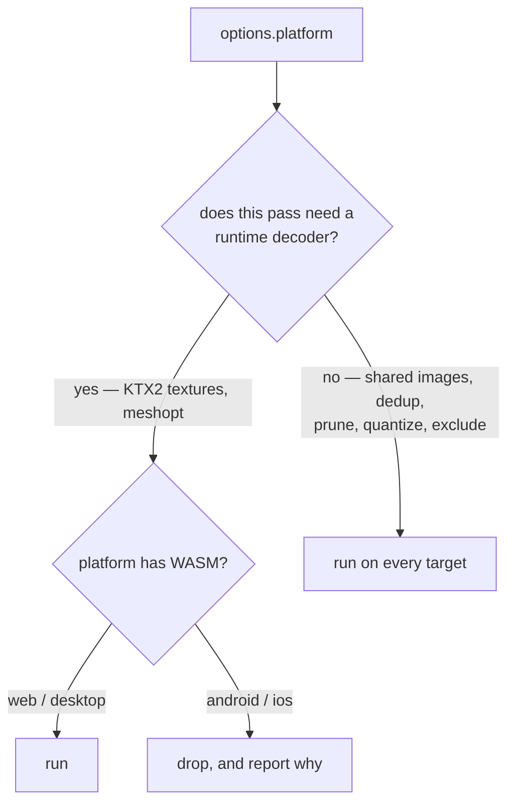

# PRD-350 — The platform gate knows which passes need a decoder

**Status:** PARTIAL — Android capability and cooked real-device proof landed 2026-09-05; raw/cooked
visual identity, web/desktop byte identity and observed negative-control evidence remain `UNVERIFIED`.
**Complexity:** 2 (6-10 files) + 2 (multi-package) = **4 → MEDIUM mode**
**Batch:** `docs/PRDs/assets/`
**Depends on:** PRD-349, delivered (see [final evidence](../../verification/PRD-349-the-cook.md))

## Execution preflight after PRD-349

This is an engine change in `packages/assets`, with CLI/native diagnostics updated at their
existing consumers. 349 delivered the default cook, exclusions, shared-image defaults, budgets,
and canonical atomic publication. Reuse those mechanisms.

Quarry now has six losslessly decoded source GLBs: **30,346,112 B**, with no Meshopt extension.
Its Android APK already builds. Its web/desktop asset payload including Basis is **4,569,038 B**;
both runtime scenarios passed. No mobile device ran. Keep this source as the decoder-free control
and add a separate already-compressed source fixture. Wildwood's Android baseline still needs
execution; 349's iOS waiver does not waive this PRD's native proof.

---

## 1. Context

**Problem:** Android and iOS have no WebAssembly, so they cannot decode KTX2 or meshopt. The compile
step responds by dropping the **entire model pass** for those targets — including the passes that
need no decoder at all. Mobile therefore ships every texture duplicated once per model.

**Files analyzed**

| Path | What it says |
|---|---|
| `packages/assets/src/compile.ts:905-912` | `const decodesCompression = options.platform !== "android" && options.platform !== "ios";` |
| `packages/assets/src/compile.ts:910-911` | `textures = decodesCompression ? parse… : undefined` / `models = decodesCompression ? parse… : undefined` |
| `packages/assets/src/compile.ts:210-224` | the per-target design, correctly reasoned for *compression* |
| `packages/assets/src/passes/shared-images.ts` | the dedupe store — writes external files and rewrites `images[].uri`. **No decoder involved.** |
| `packages/create-threenative/src/build.ts:103-107,116-130` | `assertNativeAssetsCompatible` refuses a mobile build carrying `EXT_meshopt_compression`, `KHR_draco_mesh_compression` or `KHR_meshopt_compression` |

**Current behavior**

- `decodesCompression` is a single boolean covering four different passes.
- On `android`/`ios` it discards `models` and `textures` wholesale.
- So mobile loses: KTX2 (correct — needs a transcoder), meshopt (correct — needs a decoder),
  **`sharedImages` (wrong — needs nothing)**, and **`dedup`/`prune`/`quantize`/`reorder`
  (wrong — glTF-level rewrites that produce plain glTF)**.

---

## 2. The gap, in bytes

Writing one PNG once and pointing eleven GLBs at it by `uri` is plain glTF 2.0. It requires no
WebAssembly, no transcoder, no extension. Mobile can read it today.

| Target | today | with this PRD |
|---|---|---|
| Wildwood web runtime load set, including HDR + Basis | **51,333,420 B** | unchanged for identical source/options |
| Quarry web / desktop payload including Basis | **4,569,038 B** | unchanged for identical source/options |
| Quarry Android / iOS asset payload | **30,346,112 B**, six source files | measure unique shared PNG savings |
| Wildwood Android / iOS | current baseline unmeasured | measure before/after; historical ~83 MB estimate applies only to the old scene subset |

The historical 83 MB figure is the spike's arithmetic applied at scale: 259 MB of embedded PNG collapses to the
**52.7 MB of distinct images** PRD-349 measured, plus 5.7 MB of geometry, plus animals, audio and
HDRI. It is not a full-manifest target: 349's final web manifest alone is 297,738,622 B.
Record both the fixed runtime load set and the full manifest, deduplicating shared output paths.
Shared image pixels must remain bit-identical, with no lossy codec involved.

### A second, sharper problem to confirm first

wildwood's source GLBs already carry `EXT_meshopt_compression` — the **importer** put it there, not
the compile step. Under `models: "none"` they are copied verbatim into `public/`. Then
`assertNativeAssetsCompatible` scans the manifest and refuses any mobile build carrying that
extension.

349 removed Wildwood's cook opt-outs, but the mobile gate still bypasses the whole model pass.
Phase 1 checks the current sources and build instead of assuming the historical config survives.
For already-compressed input, the compiler must decode on the build host and remove the consumed
compression extensions before writing mobile output. Merely disabling new Meshopt encoding is
insufficient. Preserve the native validator's refusal for any undecodable output.

---

## 3. Solution

Replace one boolean with a per-pass capability question.

**Key decisions**

- [x] A pass declares `needsRuntimeDecoder: boolean`. The platform check reads that field; it never
      names passes. Apply this to model sub-passes, not the whole mixed model pass. A build-host
      decoder used to read source assets is distinct from a decoder required by the output.
- [x] **`quantize` is decoder-free. DECIDED on evidence, not deferred.**
      `packages/runtime-native/scripts/bundle.mjs:154-226` stubs exactly three things for mobile —
      the Basis/zstd transcoder behind `KTX2Loader`, `MeshoptDecoder`, and Draco.
      `KHR_mesh_quantization` is not among them: it is plain typed-array math inside three's
      `GLTFLoader`, with nothing to instantiate. It stays on for every target.
- [x] `formatSkippedCompression` keeps reporting what a target gave up, and now reports it
      accurately — today it implies mobile lost only compression.
- [ ] Charter rule 6: **web-only is unfinished.** This acceptance requirement remains open until
      every phase lands with native proof in the same commit.
- [ ] Retain capability-aware uncooked budgets. `decodesCompression` also feeds `measureBudget`
      and skipped reporting; replace those consumers deliberately. Mobile PNGs remain exempt from
      unavailable KTX2 compression, while `budget.total` counts every unique emitted file on every
      target. Shared PNGs must not disappear from totals or be charged once per model.

---

## Integration Ledger

| # | New thing | Live caller (`file:line`, non-test) | Replaces | Old path removed? | Negative control |
|---|---|---|---|---|---|
| 1 | `needsRuntimeDecoder` on the pass spec | `packages/assets/src/compile.ts:~905` | the `decodesCompression` boolean | that boolean deleted | mark shared-images as needing a decoder → mobile output grows back to duplicated |
| 2 | mobile model pass (decoder-free subset) | `packages/assets/src/compile.ts:~910` | `models = undefined` on mobile | that branch deleted | disable the subset → the measured duplicate images return |
| 3 | accurate skipped-compression report | `packages/assets/src/report.ts:~397` | the "compression" wording | reworded, not duplicated | a mobile build must name meshopt+ktx2 and **not** claim dedupe was skipped |
| 4 | corrected native error advice | `packages/runtime-native/scripts/bundle.mjs:170,172` | "set assets.models to none" | reworded, not duplicated | the old wording, followed literally, must no longer be the documented fix |
| 5 | capability-aware budget/report consumers | `packages/assets/src/budget.ts:measureBudget`, `compile.ts` skipped reporting | coarse boolean consumers | update with the gate | mobile PNG remains exempt from uncooked compression; a one-byte total ceiling still fails |

**Reachability**

- Entry point: `threenative build --target android|ios` → `compileAssets({ platform })`.
- Pre-existing files EDITED: `packages/assets/src/compile.ts`, `src/worker-protocol.ts`,
  `src/report.ts`, `packages/create-threenative/src/build.ts` (its refusal message).
- User-facing? No UI. Observable in the mobile bundle size and in the build report.

---

## 4. Execution phases

**Proof subject:** `sandbox/quarry` (built in PRD-349 Phase 4) — real Unreal props, shared textures,
already wired to build all four targets. wildwood confirms at the end.

---

#### Phase 1 — freeze the current mobile baseline

*Outcome:* a recorded answer to whether wildwood can build for Android today.

**Files**

- `docs/verification/PRD-350-mobile-baseline.md` — NEW.

**Implementation**

- [x] `build --target android` in `sandbox/wildwood` with its current project config. Record the exact output.
- [x] Same for `sandbox/quarry`.
- [x] Record the manifest byte total each target produced.
- [ ] Record game revision, package hashes, exact source set and target. For Wildwood, separately
      resolve 349's runtime acquisition set through the manifest. Confirm the selected device and
      SDK with the existing playtest doctor before scheduling device proof.

**This phase edits no source and is not a phase in the normal sense — it is the measurement that
decides how the rest is written.** If the refusal does not fire, say so and correct §2.

**Negative control:** run the same command against a game with no meshopt in its assets; it must
*not* refuse. Quarry's repaired source is this control. Keep a separate compressed-input fixture;
do not reintroduce compressed sources into Quarry to manufacture a baseline failure.

**Negative-control result:** `UNVERIFIED` — no no-meshopt control run or failure/pass artifact is
retained in this evidence record.

---

#### Phase 2 — passes declare whether they need a decoder

*Outcome:* on `--target android`, each shared texture is written once, and the build still succeeds.

**Primary files**

- `packages/assets/src/compile.ts` — EDIT: `decodesCompression` → per-pass `needsRuntimeDecoder`;
  build the mobile model options from the decoder-free subset instead of `undefined`.
- `packages/assets/src/worker-protocol.ts` — EDIT: carry the field.
- `packages/assets/src/passes/model.ts` — EDIT: declare it per sub-pass.
- `packages/assets/src/report.ts` — EDIT: the skipped-compression wording.
- `packages/assets/__tests__/compile.spec.ts` — EDIT: the mobile cases.

> **Also fix the advice.** `packages/runtime-native/scripts/bundle.mjs:170,172` tells developers to
> *"build native targets with `assets.textures` set to `"none"`"* and *"`assets.models` set to
> `"none"`"*. After this PRD that advice is actively harmful — it is exactly the setting that costs
> mobile its dedupe. Reword both to name the per-pass behaviour, in the same commit.

Also update `packages/create-threenative/src/build.ts`, which emits the same advice, and
`packages/assets/src/budget.ts` with its focused tests. Exercise config parsing, worker protocol,
sequential execution and cache hits through the real compiler; changing only the type is not wiring.

**Implementation**

- [x] Decoder-free on every target: `sharedImages`, `dedup`, `prune`, `reorder`, `quantize`, `exclude`.
- [x] Decoder-required, dropped on mobile: KTX2 textures, `meshopt`.
- [x] `quantize` joins the decoder-free set — settled above from `bundle.mjs`, no measurement
      phase needed.
- [x] A mobile build must emit **plain PNG** images at `shared/images/`, not KTX2 — the store is
      codec-agnostic and already spells the codec into the filename.

**Wiring**

- [x] Caller edited: `compile.ts:~905`
- [x] Old path: the `decodesCompression` boolean **deleted**
- [x] Ledger rows filled: #1, #2, #3

**Tests required**

| Test file | Test name | Assertion | Negative control (planned; not observed here) |
|---|---|---|---|
| `__tests__/compile.spec.ts` | `should share images on an android build` | 2 models embedding one image → 1 file under `shared/images/`, mime `image/png` | mark shared-images decoder-requiring → 2 embedded copies, fails |
| `__tests__/compile.spec.ts` | `should not emit ktx2 on an android build` | no `image/ktx2`, no `KHR_texture_basisu` | allow it → fails |
| `__tests__/compile.spec.ts` | `should not emit meshopt on an android build` | no `EXT_meshopt_compression` | allow it → fails |
| `__tests__/compile.spec.ts` | `should still emit ktx2 on a web build` | present | drop it for web too → fails, proving the split is per-target not global |
| `create-threenative/__tests__/build.spec.ts` | `should accept the android manifest this compile produces` | `assertNativeAssetsCompatible` does not throw | feed it a meshopt manifest → throws |
| assets model/compile tests | `should decode compressed source for mobile output` | host decodes Meshopt/Draco input; output has neither required compression extension nor decoder dependency | bypass source normalization → validation or decoder-free read fails |
| assets budget tests | `should count mobile shared outputs once` | PNG uncooked exemption retained; total includes unique auxiliaries on cold and cached builds | omit shared outputs or charge per reference → byte total fails |

**Revert check:** `UNVERIFIED` — no revert-run output is retained in this evidence record.

---

#### Phase 3 — native proof, then wildwood

*Outcome:* the smaller mobile bundle is shown running on a real device, and wildwood's Android build
goes from refused (or 289 MB) to a sub-100 MB runtime load-set.

**Files**

- `sandbox/quarry/playtests/quarry-android.playtest.json` — NEW: a `--target` playtest.
- `sandbox/wildwood/threenative.config.ts` — EDIT: nothing new expected; confirm it needs nothing.
- `docs/verification/PRD-350-mobile-baseline.md` — EDIT: the after numbers.

**Implementation**

- [x] Run `quarry` on the **real Pixel 8** over ADB. Emulator numbers are worthless
      here — the Mali adapter is the point.
- [x] Confirm the shared PNGs load and the props are textured, by looking at a capture.
- [x] Record wildwood's Android full-manifest total and runtime load-set, before and after.
      Follow `packages/runtime-native/AGENTS.md` and `packages/playtest/AGENTS.md` for the native
      transport; a CDP browser/WebView run is not native-host proof. Record device and adapter.

**Tests required**

| Test | Assertion | Negative control |
|---|---|---|
| `quarry-android.playtest.json` | all 6 props present and textured on device | **UNVERIFIED** — deleting one shared image was not run and no failure artifact was retained |

**User verification (MANUAL — device)**

- Action: capture `quarry` on the Pixel 8 before and after.
- Result: the cooked Android run passed and is recorded in
  [`docs/verification/artifacts/prd-350/quarry/android-result.txt`](../../verification/artifacts/prd-350/quarry/android-result.txt).
  The raw/cooked identical-frame comparison was not run and remains `UNVERIFIED`.

---

## 5. Acceptance criteria

Consumer-scoped.

- [ ] **`quarry` built for Android ships each shared texture once**, as PNG, and renders identically
      on a real Pixel 8. The cooked run passed with six textured and normal-mapped props, but the
      raw/cooked identity comparison is `UNVERIFIED`.
- [x] **wildwood's Android build succeeds** and its runtime load-set drops from the Phase 1 baseline to
      ≤ 100 MB. The full manifest total is recorded separately; the historical ~83 MB estimate is a
      runtime load-set estimate, not a full-manifest ceiling.
- [ ] **The web and desktop builds are unchanged** — `UNVERIFIED`: no output hashes or byte-for-byte
      browser/desktop run is retained. The cited tests cover extension, custom-pass and cache
      behavior only.
- [x] **The build report tells a mobile developer the truth**: it names meshopt and KTX2 as dropped
      and does **not** claim dedupe was skipped.
- [x] **Phase 1's question is answered in writing**, whichever way it went.

### Integration gates

- [x] `decodesCompression` deleted — no behaviour has two live implementations
- [ ] Every gate has a negative control observed failing — `UNVERIFIED`: the required
      missing-shared-image control was not run or retained.
- [ ] Native proof landed in the same commit as the capability (charter rule 6) — the capability
      landed in `1aca2b84`; the real-device proof was recorded later, so this gate is open.
- [x] The two native error messages no longer advise `"none"`
- [ ] Budget exemptions, total accounting, atomic publication, watcher recovery and cross-target
      cache separation retain their regression coverage; exercise both Android and iOS compilation.
      Report iOS packaging/runtime separately and claim only platforms actually executed.

---

## 6. Risks

| Risk | Mitigation |
|---|---|
| ~~`KHR_mesh_quantization` needs a decoder~~ | **CLOSED — `bundle.mjs` stubs only Basis, Meshopt and Draco; quantization is plain typed-array math in `GLTFLoader`** |
| Shared PNGs may still exceed phone memory | Measure decoded GPU residency separately from payload bytes against `mobile-memory-budget`; the historical 3.5× payload estimate is not a memory result |
| The shared store's filename encodes a codec that mobile does not use | It already spells the codec into the name (`<key>.<codec><ext>`), so `none` is a valid, existing value |
