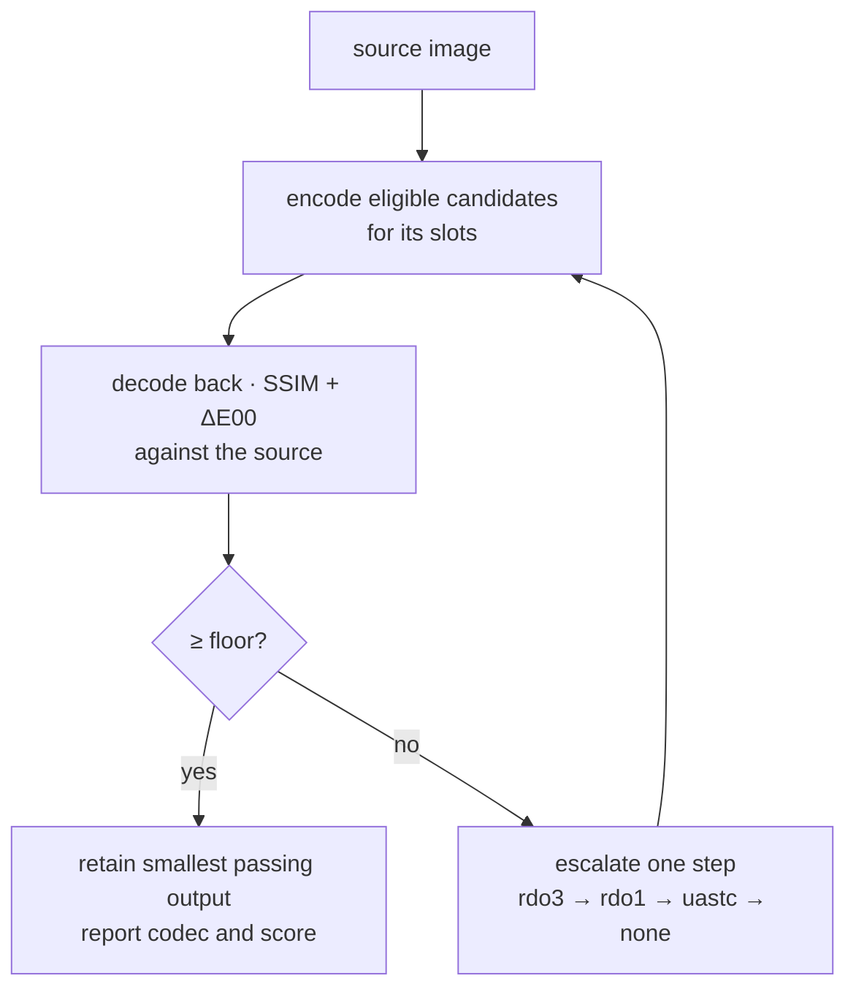

# PRD-351 — Compression never looks worse than a floor

**Status:** READY FOR EXECUTION
**Complexity:** 2 (6-10 files) + 2 (new system) + 1 = **5 → MEDIUM mode**
**Batch:** `docs/PRDs/assets/`
**Depends on:** PRD-349 (the cook must be on before a floor means anything)

## Execution preflight after PRD-349

349 is delivered. Use its [final evidence](../../verification/PRD-349-the-cook.md): Wildwood's
accepted runtime payload is **51,333,420 B** including HDR and Basis; Quarry's is **4,569,038 B**
including Basis. These are unchanged-resolution measurements, not 4096² master baselines.
Freeze game revision, source hashes, package hashes, camera and runtime acquisition set before
comparing the ladder. Re-measure a control on the same sources whenever import resolution changes.

The encoder is now `packages/assets/src/ktx2-encoder.ts` with vendored Basis v2.5, a 16 Mi-texel
limit and default Zstd. 349 proved 4096² encoding and restored default-path byte parity. Its
wrapper currently exposes no RDO options: Phase 2 must extend and test that seam, not patch the
removed npm dependency. The historical RDO crash must be reproduced against the current encoder.

Preflight the locally available Landscape Pro masters and importer before Phase 3. If sources
are unavailable, record the exact missing input; never substitute upscaled 1024 images as masters.
349's animal fixture repair was loader-equivalent, not a reimport or proof of master availability.

---

## 1. Context

**Problem:** The compile step picks a codec from a fixed rule and never looks at the result. It can
therefore be too timid (shipping bytes it did not need to) or too aggressive (shipping an image that
looks wrong) and in neither case does anyone find out.

**What PRD-349's spike established, and why it forces this PRD**

| Finding | Consequence |
|---|---|
| `chooseCodec` picked `uastc` for **all four** of the pack's textures — including `T_pine_bark_diffuse`, because this pack stores cutout alpha in the diffuse map | ETC1S, the cheap codec, **never fires** on this content. Codec selection has no headroom left. |
| Explicit `needSupercompression:true` gains **0.0% over omission** | Zstd is already on. This says nothing about requiring RDO; 349's later Zstd level-22 probe saved only 825 B on one large texture. |
| Measured quality today: SSIM **0.9689-0.9903**, mean abs err 1.3-4.1/255 | There is real headroom *below* current quality, and no instrument to spend it safely. |

RDO is a remaining lossy lever to measure. A floor bounds measured error; it does not make the
change lossless or guarantee indistinguishable output. Slot constraints and visual review remain
part of acceptance.

**Second problem, upstream and larger:** `sandbox/wildwood/tools/import-landscape-pro.mjs:79-81`

```js
// 4096 source maps are film-sized. 1024 is the web budget, and a tiling ground layer at 1024
maxTextureSize: 1024,
```

The masters are **4096²**. The import discards 15/16 of every texture's pixels *before* the compile
step ever sees them — and then the old pipeline shipped the survivors eleven times over. That
decision was made once, by hand, for reasons that no longer hold once duplication is gone.

---

## 2. Solution

Two independent levers, both measured.

### A. A quality floor with automatic escalation

Encode, measure, and **escalate if the image falls below the floor** — per image, automatically, with
no dev decision anywhere.



Candidate quality ladder: `etc1s` → `uastc+rdo` (high λ) → `uastc+rdo` (low λ) → `uastc` →
`none`. Measure eligible candidates and retain the smallest passing output. This is not a promise
that codec names sort by bytes. Cache the decision and report first-build cost.

### B. Separate import resolution from compiler caps

`maxTextureSize: 1024` belongs to Wildwood's external import script. The compiler's embedded-image
path already uses `DEFAULT_MAX_SIZE = 2048` in `model-textures.ts`; its standalone texture path
preserves dimensions when `maxSize` is omitted. 349's zero-resize result describes the measured
games, not a universal uncapped embedded-image default. The older 35–45 / 85 / 265 MB estimates
are superseded and must not set acceptance thresholds.

Keep existing compiler defaults during this PRD. Add explicit per-slot cap support, preserving
the scalar form, and compare **1024 / 2048 / 4096** from the same masters. Set the embedded cap
explicitly to 4096 in that arm so the current 2048 default cannot invalidate the experiment.
Report actual payload and GPU resident bytes, never infer GPU memory from PNG/KTX2 file size.

The proposed 2048 colour / 1024 mask policy is a game-owned candidate, adopted only if measured
detail and device memory justify it. It does not become a new package-owned appearance policy.
Use actual glTF slots; height and curvature need explicit game material bindings. An image used
by multiple slots must retain the strictest quality requirement and largest requested cap, with
the decision reported. Preserve named overrides and never upscale.

**Key decisions**

- [ ] SSIM on luma + ΔE00 on colour. The math exists in `threenative-sculpt-mcp/src/math/ssim.js`
      and `color-metrics.js`; port it into `packages/assets`, do not add a dependency.
- [ ] **Pixel metrics never replace semantic image review** — the sculpt MCP's own rule. Every
      landing carries an eyes-on capture alongside the numbers.
- [ ] Initial floor: **SSIM ≥ 0.95, mean ΔE00 ≤ 3.0** for colour images. Phase 1 validates both
      against the final encoder and corpus; four SSIM samples establish neither ΔE00 nor an
      all-content guarantee. Record metric domain, window and aggregation. Normal/data maps need
      slot-appropriate checks; preserve the current UASTC/none choice until those checks exist.
- [ ] Preserve alpha cutouts: compare alpha separately and require unchanged alpha-test coverage
      at the consuming materials' thresholds. A luma/colour pass alone cannot permit a cheaper
      alpha codec. Respect explicit codec overrides; report scores even when an override disables
      automatic selection. Reject a forced codec that fails its configured floor.
- [ ] Escalation is reported, never silent: the build prints how many images landed on each rung.
- [ ] Measuring costs a decode per image per rung. It is cached on the same content-addressed key
      the shared-image store already uses, so a second build pays nothing.
- [ ] Include encoder version, metric version, floor, slot semantics, RDO settings and caps in
      pass/shared-image cache identity. Preserve cold/warm parity, atomic publication and receipt
      ownership. A `none` fallback retains source bytes and remains honestly budgeted; it must not
      create an exemption that lets arbitrary uncooked assets pass the 64 MB ceiling.

---

## Integration Ledger

| # | New thing | Live caller (`file:line`, non-test) | Replaces | Old path removed? | Negative control |
|---|---|---|---|---|---|
| 1 | `imageQuality()` — SSIM + ΔE00 | `packages/assets/src/passes/model-textures.ts:<encode site>` | nothing — new instrument | feed it identical images → SSIM 1.0; feed it noise → below floor |
| 2 | codec ladder with escalation | `packages/assets/src/passes/model-textures.ts:~448` (`chooseCodec`) | the fixed `chooseCodec` rule | slot policy constrains eligible candidates, no second selection path | disable enforcement on a known below-floor candidate → test fails |
| 3 | `models.textures.floor` config | `packages/core/src/config.ts` | nothing — new | omit it → the default applies and is reported |
| 4 | per-slot `maxSize` | `packages/core/src/config.ts` | the single scalar `maxSize` | scalar still accepted, widened | set 2048 for baseColor → those images are 2048², others unchanged |

Wire config through `packages/assets/src/compile.ts` validation, worker options, model-pass keys,
shared-image keys and report/manifest fields. Add round-trip tests through `compileAssets`;
`MODEL_TEXTURE_KEYS` currently accepts only `maxSize`, `overrides` and `quality`. Encoder changes
also touch `ktx2-encoder.ts` and, only if required, its vendored build and provenance.

**Reachability:** `threenative build` → `compileAssets` → model pass → `model-textures.ts`. No UI.

---

## 3. Execution phases

**Proof subject: the real Landscape Pro textures**, at 4096² masters — not the 1024² downsamples the
old import produced. A floor proved on already-downsampled content proves nothing about the lever
that downsampled it. `sandbox/quarry` (PRD-349) is the game; it re-imports its 6 props at 4096².

---

#### Phase 1 — the instrument

*Outcome:* the build reports a quality score for every image it compresses.

**Files**

- `packages/assets/src/image-quality.ts` — NEW: `ssim()`, `deltaE00()`, `imageQuality()`.
- `packages/assets/src/passes/model-textures.ts` — EDIT: decode back after encoding, score, report.
- `packages/assets/src/report.ts` — EDIT: the score joins the per-texture row.
- `packages/assets/__tests__/image-quality.spec.ts` — NEW.
- `packages/assets/__tests__/model-texture-pass.spec.ts` — EDIT.

**Implementation**

- [ ] Reuse the shipped `basis_transcoder` for the decode — the spike proved it works standalone at
      `cTFRGBA32` (`getWidth`/`getHeight`/`transcodeImage`, not `getImageWidth`).
- [ ] Score only mip 0.
- [ ] For the compression floor compare decoded output with the same-resolution pre-encode image.
      Report resolution loss against masters separately; otherwise resizing and codec loss are
      conflated. Re-measure the old spike with its exact inputs/settings before using its tolerance.
- [ ] **This phase changes no output bytes.** It only measures. That is deliberate: the instrument
      must be trusted before it is allowed to steer.

**Tests required**

| Test file | Test name | Assertion | Negative control (observed red) |
|---|---|---|---|
| `__tests__/image-quality.spec.ts` | `should score an identical pair at 1.0` | `ssim(a,a) === 1` | compare a to noise → far below 1 |
| `__tests__/image-quality.spec.ts` | `should reproduce the spike's measured scores` | bark_normal scores 0.969 ± 0.005 | change the window size → drifts out of tolerance, proving the number is computed not hardcoded |
| `__tests__/model-texture-pass.spec.ts` | `should report a score for every compressed image` | every row carries SSIM | drop the decode → row missing, fails |

**Revert check:** delete the scoring call → the report loses its column and the third test goes red.

---

#### Phase 2 — the ladder

*Outcome:* an image that would look bad is automatically escalated; one that looks fine at a cheaper
rung stays there and gets smaller.

**Files**

- `packages/assets/src/passes/model-textures.ts` — EDIT: `chooseCodec` becomes `codecLadder`.
- `packages/core/src/config.ts` — EDIT: `models.textures.floor`.
- `packages/assets/src/report.ts` — EDIT: the rung histogram.
- `packages/assets/__tests__/model-texture-pass.spec.ts` — EDIT.
- `packages/create-threenative/templates/*/AGENTS.md` — EDIT.

**Implementation**

- [ ] Rungs: `etc1s@150` → `uastc+rdo λ3 +zstd` → `uastc+rdo λ1 +zstd` → `uastc` → `none`.
- [x] **RDO ships behind the floor, with a bounded escape hatch. DECIDED.** It crashed the encoder
      module during the PRD-349 spike, so Phase 2 reproduces the crash first. Rule: **timebox the
      fix to one day.** If it is not reliable by then, the ladder ships as
      `etc1s → uastc → none` with the RDO rungs absent and the reason recorded — the floor and the
      escalation are the architecture; RDO is one rung on it, not the point of it.
- [ ] Skip rungs a slot forbids: a normal map never tries `etc1s`.
- [ ] Report: `34 etc1s · 5 escalated to uastc · 0 uncompressed`. Order eligible candidates by
      measured emitted bytes and retain the smallest that passes; codec names alone do not prove
      size ordering. Preserve 349's `not-smaller` and automatic `block-size` fallback behaviour.

**Tests required**

| Test file | Test name | Assertion | Negative control |
|---|---|---|---|
| `__tests__/model-texture-pass.spec.ts` | `should escalate an image that fails the floor` | a pathological image lands on a higher rung than rung 1 | floor 0 → stays on rung 1, fails |
| `__tests__/model-texture-pass.spec.ts` | `should keep a clean image on the cheapest rung` | a flat colour image stays on its smallest passing candidate | remove that candidate → output grows or selected rung changes |
| `__tests__/model-texture-pass.spec.ts` | `should never try etc1s for a normal map` | rung 1 skipped for normal slots | allow it → fails |
| `__tests__/model-texture-pass.spec.ts` | `should report the rung histogram` | counts sum to the image count | — |

**Revert check:** pin the ladder to one rung → the first test goes red.

**User verification (MANUAL — visual)**

- Action: render Quarry and the difficult fixture with default enforcement and with enforcement
  disabled for the negative control; keep slot constraints and camera identical.
- Expected: review default output against source. Use a deliberately difficult fixture whose
  cheapest candidate demonstrably fails the configured floor; disabling enforcement must admit
  that failing candidate. Quarry need not become visibly worse at floor 0 if its cheap candidate
  already looks acceptable. An exact flat-colour encoding may pass even at SSIM 1.0.

---

#### Phase 3 — the resolution decision, priced

*Outcome:* the cost of 1024 / 2048 / 4096 is recorded on the real pack, and per-slot caps exist.

**Files**

- `packages/core/src/config.ts` — EDIT: `maxSize` accepts a per-slot map.
- `packages/assets/src/passes/model-textures.ts` — EDIT: resolve per slot.
- `packages/assets/__tests__/model-texture-pass.spec.ts` — EDIT.
- `sandbox/quarry/` — EDIT: re-import its 6 props at 4096² masters.
- `docs/verification/PRD-351-resolution-ladder.md` — NEW.

**Implementation**

- [ ] Re-import `quarry`'s props with `maxTextureSize: 4096` so the compile sees masters.
- [ ] Compile at 1024, 2048 and 4096. Record bytes, GPU bytes, SSIM and a capture for each.
- [ ] Capture the three at matched camera positions, close enough to read bark detail.
- [ ] Compare the game-owned 2048 colour / 1024 mask candidate against the other arms. Adopt it
      only if visible detail and measured device memory justify it; keep compiler defaults intact.

**Tests required**

| Test | Assertion | Negative control |
|---|---|---|
| `should cap baseColor at 2048 and masks at 1024` | per-slot dimensions honoured | single scalar → all slots equal, fails |
| `should never upscale` | a 512² source stays 512² at cap 2048 | — |

**Evidence to record**

```
quarry, 6 props, masters at 4096:
  cap 1024   distinct tex ___ MB   load ___ MB   SSIM ___   capture: res-1024.png
  cap 2048   distinct tex ___ MB   load ___ MB   SSIM ___   capture: res-2048.png
  cap 4096   distinct tex ___ MB   load ___ MB   SSIM ___   capture: res-4096.png
GPU resident bytes at each, and the phone budget line for comparison.
```

---

## 4. Acceptance criteria

Consumer-scoped.

- [ ] **An image that compresses badly is automatically shipped at a higher-quality rung**, and the
      build says which images those were — with no config from the developer.
- [ ] **An image that compresses cleanly ships at the smallest passing candidate**, and Quarry's
      payload falls against a matched baseline with identical input resolution and runtime set.
      Compare against 4,569,038 B only when using 349's exact source; measure masters separately.
- [ ] **Disabling the floor admits the known failing candidate on the difficult fixture.**
      Removing enforcement must make its acceptance test fail; a floor-0 screenshot alone is not
      the negative control.
- [ ] **The three resolution ladders are captured side by side**, and 2048 is visibly better than
      1024 on bark and cliff detail at reading distance if the game adopts that candidate. Otherwise
      retain its import policy and record why; no compiler-default change is implied.
- [ ] **Current output is scored against both metrics before selection changes.** Record every
      existing below-floor image and its escalation; the old four-texture SSIM sample is not a
      blanket non-regression guarantee. Visually review alpha edges, normals and colour.
- [ ] **Every score in the report is computed**, provable by the ± tolerance test against the
      spike's numbers.

### Integration gates

- [ ] `chooseCodec`'s slot constraints feed candidate eligibility, with no surviving second selection path
- [ ] Every gate has a negative control observed failing
- [ ] RDO's encoder crash reproduced, and either fixed within the one-day timebox or the rungs
      dropped with the reason recorded
- [ ] Proved on 4096² masters, not on already-downsampled content
- [ ] Real Quarry browser and native desktop scenarios pass on installed packages; mobile compile
      still emits no unsupported codec. Retain native runtime proof for every changed mobile path;
      PRD-349's waiver does not waive new proof. Keep encoder 4K, Zstd-default, cache-version,
      budget and publication regressions green.

## 5. Risks

| Risk | Mitigation |
|---|---|
| RDO crashes the encoder (observed in the PRD-349 spike) | Phase 2 reproduces it first; the ladder ships without RDO rungs if it cannot be made reliable |
| Measuring every rung makes builds slow | Scores cache on the existing content-addressed key; a second build pays nothing. Measure and report the first-build cost. |
| SSIM passes an image a human would reject | The rule stands: pixel metrics never replace semantic review. Every landing carries an eyes-on capture. |
| 2048 blows a phone's memory budget | Phase 3 records GPU resident bytes against the existing `mobile-memory-budget` reference before adopting the game-owned candidate |
