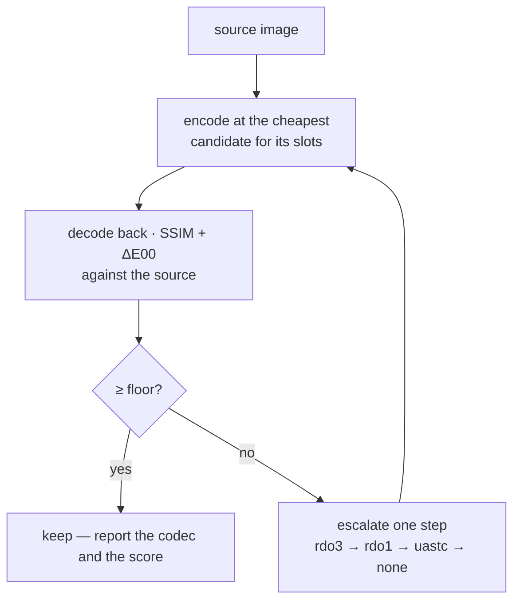

# PRD-351 — Compression never looks worse than a floor

**Status:** READY FOR EXECUTION
**Complexity:** 2 (6-10 files) + 2 (new system) + 1 = **5 → MEDIUM mode**
**Batch:** `docs/PRDs/assets/`
**Depends on:** PRD-349 (the cook must be on before a floor means anything)

---

## 1. Context

**Problem:** The compile step picks a codec from a fixed rule and never looks at the result. It can
therefore be too timid (shipping bytes it did not need to) or too aggressive (shipping an image that
looks wrong) and in neither case does anyone find out.

**What PRD-349's spike established, and why it forces this PRD**

| Finding | Consequence |
|---|---|
| `chooseCodec` picked `uastc` for **all four** of the pack's textures — including `T_pine_bark_diffuse`, because this pack stores cutout alpha in the diffuse map | ETC1S, the cheap codec, **never fires** on this content. Codec selection has no headroom left. |
| `needSupercompression` alone gains **0.0%** | Zstd needs RDO to have restructured the blocks first. |
| Measured quality today: SSIM **0.9689-0.9903**, mean abs err 1.3-4.1/255 | There is real headroom *below* current quality, and no instrument to spend it safely. |

So the only remaining compression lever is **RDO — which is lossy**. Turning it on without a floor
is exactly how assets get nerfed. Turning it on *with* a floor is how they get smaller for free.

**Second problem, upstream and larger:** `sandbox/wildwood/tools/import-landscape-pro.mjs:79-81`

```js
// 4096 source maps are film-sized. 1024 is the web budget, and a tiling ground layer at 1024
maxTextureSize: 1024,
```

The masters are **4096²**. The import discards 15/16 of every texture's pixels *before* the compile
step ever sees them — and then the old pipeline shipped the survivors eleven times over. That
decision was made once, by hand, for reasons that no longer hold once duplication is gone.

---

## 2. Solution

Two independent levers, both measured.

### A. A quality floor with automatic escalation

Encode, measure, and **escalate if the image falls below the floor** — per image, automatically, with
no dev decision anywhere.



The ladder, cheapest first: `etc1s` → `uastc+rdo` (high λ) → `uastc+rdo` (low λ) → `uastc` →
`none`. Every rung is tried in order; the first that clears the floor wins. An image that clears the
floor at a cheap rung never pays for an expensive one — **which is how "as compact as possible" and
"preserve quality" stop being in tension.**

### B. The resolution decision, made deliberately

`maxTextureSize` is the one lever that unambiguously nerfs an asset, and it is currently set by an
inherited constant. With duplication gone, 2048² costs roughly 4× the *distinct* texture bytes — on
a base that is now ~15 MB, not ~259 MB.

| `maxTextureSize` | distinct texture bytes | wildwood load set | verdict |
|---|---|---|---|
| 1024 (today) | ~15 MB | ~35-45 MB | pixels identical to today |
| **2048** | ~60 MB | **~85 MB** | 4× the pixels, still 3.4× smaller than today |
| 4096 (masters) | ~240 MB | ~265 MB | film-res; over a phone's budget at this texture count |

**DECIDED: the default becomes `2048`, per-slot capable.** Rationale — with duplication gone the
cost is ~60 MB of distinct textures against a ~15 MB base, landing wildwood at ~85 MB: still **3.4×
smaller than today while carrying 4× the pixels.** Masks, AO, height and curvature stay at 1024
because the eye does not read them at texel scale. 4096 is rejected as a default: ~265 MB and over a
phone's budget at this texture count, and it remains available per game.

Phase 3 still captures all three ladders — the default is decided, but a decision this visible
should ship with the pictures that justify it.

**Key decisions**

- [ ] SSIM on luma + ΔE00 on colour. The math exists in `threenative-sculpt-mcp/src/math/ssim.js`
      and `color-metrics.js`; port it into `packages/assets`, do not add a dependency.
- [ ] **Pixel metrics never replace semantic image review** — the sculpt MCP's own rule. Every
      landing carries an eyes-on capture alongside the numbers.
- [ ] Default floor: **SSIM ≥ 0.95, ΔE00 ≤ 3.0.** Today's content sits at 0.969-0.990, so the
      default floor is already met — meaning the floor's job is not to reject today's output but to
      *permit RDO to push down toward it*.
- [ ] Escalation is reported, never silent: the build prints how many images landed on each rung.
- [ ] Measuring costs a decode per image per rung. It is cached on the same content-addressed key
      the shared-image store already uses, so a second build pays nothing.

---

## Integration Ledger

| # | New thing | Live caller (`file:line`, non-test) | Replaces | Old path removed? | Negative control |
|---|---|---|---|---|---|
| 1 | `imageQuality()` — SSIM + ΔE00 | `packages/assets/src/passes/model-textures.ts:<encode site>` | nothing — new instrument | feed it identical images → SSIM 1.0; feed it noise → below floor |
| 2 | codec ladder with escalation | `packages/assets/src/passes/model-textures.ts:~448` (`chooseCodec`) | the fixed `chooseCodec` rule | the fixed rule becomes the ladder's first rung, not a second path | set the floor to 1.0 → every image escalates to `none`; set it to 0 → every image stays on rung 1 |
| 3 | `models.textures.floor` config | `packages/core/src/config.ts` | nothing — new | omit it → the default applies and is reported |
| 4 | per-slot `maxSize` | `packages/core/src/config.ts` | the single scalar `maxSize` | scalar still accepted, widened | set 2048 for baseColor → those images are 2048², others unchanged |

**Reachability:** `threenative build` → `compileAssets` → model pass → `model-textures.ts`. No UI.

---

## 3. Execution phases

**Proof subject: the real Landscape Pro textures**, at 4096² masters — not the 1024² downsamples the
old import produced. A floor proved on already-downsampled content proves nothing about the lever
that downsampled it. `sandbox/quarry` (PRD-349) is the game; it re-imports its 6 props at 4096².

---

#### Phase 1 — the instrument

*Outcome:* the build reports a quality score for every image it compresses.

**Files**

- `packages/assets/src/image-quality.ts` — NEW: `ssim()`, `deltaE00()`, `imageQuality()`.
- `packages/assets/src/passes/model-textures.ts` — EDIT: decode back after encoding, score, report.
- `packages/assets/src/report.ts` — EDIT: the score joins the per-texture row.
- `packages/assets/__tests__/image-quality.spec.ts` — NEW.
- `packages/assets/__tests__/model-texture-pass.spec.ts` — EDIT.

**Implementation**

- [ ] Reuse the shipped `basis_transcoder` for the decode — the spike proved it works standalone at
      `cTFRGBA32` (`getWidth`/`getHeight`/`transcodeImage`, not `getImageWidth`).
- [ ] Score only mip 0.
- [ ] **This phase changes no output bytes.** It only measures. That is deliberate: the instrument
      must be trusted before it is allowed to steer.

**Tests required**

| Test file | Test name | Assertion | Negative control (observed red) |
|---|---|---|---|
| `__tests__/image-quality.spec.ts` | `should score an identical pair at 1.0` | `ssim(a,a) === 1` | compare a to noise → far below 1 |
| `__tests__/image-quality.spec.ts` | `should reproduce the spike's measured scores` | bark_normal scores 0.969 ± 0.005 | change the window size → drifts out of tolerance, proving the number is computed not hardcoded |
| `__tests__/model-texture-pass.spec.ts` | `should report a score for every compressed image` | every row carries SSIM | drop the decode → row missing, fails |

**Revert check:** delete the scoring call → the report loses its column and the third test goes red.

---

#### Phase 2 — the ladder

*Outcome:* an image that would look bad is automatically escalated; one that looks fine at a cheaper
rung stays there and gets smaller.

**Files**

- `packages/assets/src/passes/model-textures.ts` — EDIT: `chooseCodec` becomes `codecLadder`.
- `packages/core/src/config.ts` — EDIT: `models.textures.floor`.
- `packages/assets/src/report.ts` — EDIT: the rung histogram.
- `packages/assets/__tests__/model-texture-pass.spec.ts` — EDIT.
- `packages/create-threenative/templates/*/AGENTS.md` — EDIT.

**Implementation**

- [ ] Rungs: `etc1s@150` → `uastc+rdo λ3 +zstd` → `uastc+rdo λ1 +zstd` → `uastc` → `none`.
- [x] **RDO ships behind the floor, with a bounded escape hatch. DECIDED.** It crashed the encoder
      module during the PRD-349 spike, so Phase 2 reproduces the crash first. Rule: **timebox the
      fix to one day.** If it is not reliable by then, the ladder ships as
      `etc1s → uastc → none` with the RDO rungs absent and the reason recorded — the floor and the
      escalation are the architecture; RDO is one rung on it, not the point of it.
- [ ] Skip rungs a slot forbids: a normal map never tries `etc1s`.
- [ ] Report: `34 etc1s · 5 escalated to uastc · 0 uncompressed`.

**Tests required**

| Test file | Test name | Assertion | Negative control |
|---|---|---|---|
| `__tests__/model-texture-pass.spec.ts` | `should escalate an image that fails the floor` | a pathological image lands on a higher rung than rung 1 | floor 0 → stays on rung 1, fails |
| `__tests__/model-texture-pass.spec.ts` | `should keep a clean image on the cheapest rung` | a flat colour image stays `etc1s` | floor 1.0 → escalates to `none`, fails |
| `__tests__/model-texture-pass.spec.ts` | `should never try etc1s for a normal map` | rung 1 skipped for normal slots | allow it → fails |
| `__tests__/model-texture-pass.spec.ts` | `should report the rung histogram` | counts sum to the image count | — |

**Revert check:** pin the ladder to one rung → the first test goes red.

**User verification (MANUAL — visual)**

- Action: render `quarry` at the floor's default and at floor 0 (worst rung everywhere).
- Expected: the default is indistinguishable from source; floor-0 is visibly worse. **If you cannot
  see the difference at floor 0, the floor is not doing anything and the gate is fake.**

---

#### Phase 3 — the resolution decision, priced

*Outcome:* the cost of 1024 / 2048 / 4096 is recorded on the real pack, and per-slot caps exist.

**Files**

- `packages/core/src/config.ts` — EDIT: `maxSize` accepts a per-slot map.
- `packages/assets/src/passes/model-textures.ts` — EDIT: resolve per slot.
- `packages/assets/__tests__/model-texture-pass.spec.ts` — EDIT.
- `sandbox/quarry/` — EDIT: re-import its 6 props at 4096² masters.
- `docs/verification/PRD-351-resolution-ladder.md` — NEW.

**Implementation**

- [ ] Re-import `quarry`'s props with `maxTextureSize: 4096` so the compile sees masters.
- [ ] Compile at 1024, 2048 and 4096. Record bytes, GPU bytes, SSIM and a capture for each.
- [ ] Capture the three at matched camera positions, close enough to read bark detail.
- [x] **The default moves to 2048 in this phase** (decided above), with masks/AO/height/curvature
      pinned at 1024. The three captures ship as the justification, not as an open question.

**Tests required**

| Test | Assertion | Negative control |
|---|---|---|
| `should cap baseColor at 2048 and masks at 1024` | per-slot dimensions honoured | single scalar → all slots equal, fails |
| `should never upscale` | a 512² source stays 512² at cap 2048 | — |

**Evidence to record**

```
quarry, 6 props, masters at 4096:
  cap 1024   distinct tex ___ MB   load ___ MB   SSIM ___   capture: res-1024.png
  cap 2048   distinct tex ___ MB   load ___ MB   SSIM ___   capture: res-2048.png
  cap 4096   distinct tex ___ MB   load ___ MB   SSIM ___   capture: res-4096.png
GPU resident bytes at each, and the phone budget line for comparison.
```

---

## 4. Acceptance criteria

Consumer-scoped.

- [ ] **An image that compresses badly is automatically shipped at a higher-quality rung**, and the
      build says which images those were — with no config from the developer.
- [ ] **An image that compresses cleanly ships at the cheapest rung**, and `quarry`'s total drops
      below PRD-349's figure at unchanged visual quality.
- [ ] **Setting the floor to 0 produces a visibly worse capture.** If it does not, the floor is
      inert and the PRD is not done.
- [ ] **The three resolution ladders are captured side by side**, and 2048 is visibly better than
      1024 on bark and cliff detail at reading distance. If it is not, the default reverts to 1024
      and the capture is the reason.
- [ ] **The default floor rejects nothing in today's content** — 0.9689 is the measured minimum and
      the floor is 0.95 — so this PRD cannot silently degrade an existing game.
- [ ] **Every score in the report is computed**, provable by the ± tolerance test against the
      spike's numbers.

### Integration gates

- [ ] `chooseCodec`'s fixed rule is the ladder's first rung, not a surviving second path
- [ ] Every gate has a negative control observed failing
- [ ] RDO's encoder crash reproduced, and either fixed within the one-day timebox or the rungs
      dropped with the reason recorded
- [ ] Proved on 4096² masters, not on already-downsampled content

## 5. Risks

| Risk | Mitigation |
|---|---|
| RDO crashes the encoder (observed in the PRD-349 spike) | Phase 2 reproduces it first; the ladder ships without RDO rungs if it cannot be made reliable |
| Measuring every rung makes builds slow | Scores cache on the existing content-addressed key; a second build pays nothing. Measure and report the first-build cost. |
| SSIM passes an image a human would reject | The rule stands: pixel metrics never replace semantic review. Every landing carries an eyes-on capture. |
| 2048 blows a phone's memory budget | Phase 3 records GPU resident bytes against the existing `mobile-memory-budget` reference before any default moves |
