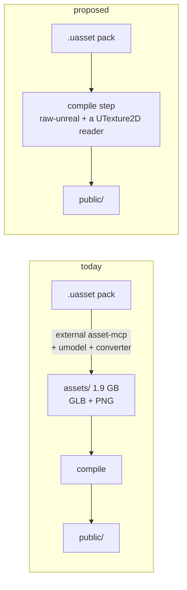

# PRD-352 — Unreal ingest is first-party

**Status:** READY FOR EXECUTION — **all three spike questions answered 2026-09-04**
**Complexity:** 3 (10+ files) + 2 (new module) + 2 (multi-package) = **7 → HIGH mode**
**Batch:** `docs/PRDs/assets/`
**Independent of:** PRD-349/350/351 — this changes ingest (①), those change the cook (②). It wins
zero shipped bytes on its own.

## Execution preflight after PRD-349

349 delivered the canonical cook and [real Quarry browser/native desktop proof](../../verification/PRD-349-the-cook.md).
Reuse its six props and checked-in scenarios, with final example pins at `1bc083d8` as the
historical control. Quarry's authored GLBs are now losslessly decoded out of Meshopt; its cooked
web/desktop asset payload including Basis is **4,569,038 B**. Record the current game/package
revisions before comparing importers and keep identical source resolution and material mappings.

Locate and verify the real Landscape Pro source pack before implementation. The old spike proves
what was read then, not that the source files are available now. Missing source is a named
execution prerequisite, not permission to download it or substitute a synthetic acceptance pack.
The six-animal repair in 349 was loader-equivalent and did not establish a working reimport path;
skeletal ingest remains outside this PRD.

This is build-host plumbing in `packages/assets` and the existing reader packages. Emit through
the current compiler publication/receipt path, including shared images, exclusions, budgets,
containment, atomic writes and watcher recovery. Do not write directly to `public/` or introduce
a parallel cooker. Runtime output must obey 350's gate when available and today's gate otherwise.

---

## 1. Context

**Problem:** Getting an Unreal pack into a ThreeNative game requires an external repository
(`threenative-asset-mcp`), which provisions its own converter toolchain, and lands a lossless PNG
intermediate tree that is larger than the source pack. The engine already owns a `.uasset` reader
and does not use it.

**What exists**

| Package | LOC | Reads | Produces | Gap |
|---|---|---|---|---|
| `@threenative/raw-unreal` | 3,632 | uncooked `.uasset` static meshes — `FMeshDescription` (UE5), `FMeshDescription` UE4.2x, `FRawMesh` | `BufferGeometry` + sections + bounds | **no textures, no materials, no skeletal** (skeletal throws `UAssetError`) |
| `@threenative/ueformat` | 1,348 | `.uemodel` from CUE4Parse/FModel | static + skeletal, skin weights, morphs, sockets | **no textures**; needs CUE4Parse installed |
| `threenative-asset-mcp@0.7.0` (external) | ~10,227 in `src/unreal/` | `.uasset` meshes, textures, materials, skeletal, audio, Paper2D, fonts | GLB + PNG + an import report | **not in this repo**; PNG-only textures; no dedupe |

**Measured, on the wildwood pack**

| | |
|---|---|
| source pack | 3.1 GB, 488 `.uasset`, 4 `.umap`, **uncooked** (no `.pak`/`.utoc`/`.ucas`/`.uexp`/`.ubulk`) |
| the 56 meshes wildwood uses, as `.uasset` | 53.3 MB |
| the 51 textures they bind, as `.uasset` | **700.7 MB** (4096² masters; `T_pine_bark_normal` alone is 38.6 MB) |
| the PNG intermediate the importer wrote | 1.9 GB in `assets/` |

**Current behavior:** a game author runs `tools/import-landscape-pro.mjs`, which imports
`importUnrealDirectory` from `.mcp-tools/node_modules/threenative-asset-mcp/dist/unreal/importer.js`
by absolute path. `raw-unreal` is not in the path at all.

---

## 2. Why this is worth doing, and what it is not

**It is not a size win.** PRD-349's spike settled that: the compile step already takes the imported
GLBs to 90.6% smaller, and it would do the same whatever produced them. Anyone reading this PRD
hoping for bytes should read PRD-349.

**What it actually buys**

1. **No external repository in the ingest path.** Today a first-party build step depends on a
   package from a different repo, resolved by absolute path in a game's own tooling.
2. **No 1.9 GB intermediate.** Reading `.uasset` inside `packages/assets` means the source tree is
   the pack itself; nothing is written twice.
3. **One toolchain instead of two.** The importer provisions `umodel` and an uncooked converter
   (`4.27.2.0+threenative.7`, per wildwood's import report). `raw-unreal` needs neither.
4. **The reader is already written and tested.** 3,632 LOC of self-validating parser, sitting unused
   by the pipeline it was built for.

**What it costs:** a `UTexture2D` reader. The spike below sized it: **small** — the bulk-data walk
and the PNG decode both already exist in this repo.

---

## 3. The historical spike — all three questions answered

### Q1: can `raw-unreal` read this pack? **YES — 61 of 62 static meshes (98.4%).**

wildwood's own note said it could not:

> *"Its static meshes are uncooked UE4 object version 514 — the 4.18-4.24 era… The importer's
> engine-free MeshDescription reader is verified for 517-522 and refuses to guess at an older
> binary layout… So the geometry stays procedural."*

**That note is wrong for `raw-unreal`**, whose README documents exactly this case
(`mesh-description-ue4` for UE4.2x, `raw-mesh` for UE4.6-4.2x). Run against every `SM_*.uasset` in
the pack:

```
OK:   61
FAIL:  1     UNSUPPORTED_STATIC_MESH_LAYOUT (typed refusal, no invented geometry)
```

**Counts match; full geometry equivalence remains an execution gate.** Cross-validated against the external importer's
own `import-report.json` on the 58 models both read:

| | |
|---|---|
| vertex counts matching exactly | **58 / 58** |
| section counts matching the importer's primitive counts | **58 / 58** |

```
SM_BoughGroup01   raw-unreal verts 7101 tris 2367 sections 2  |  importer verts 7101 prims 2
SM_BoughGroup02   raw-unreal verts 3873 tris 1291 sections 2  |  importer verts 3873 prims 2
SM_FarnGroup01    raw-unreal verts  426 tris  142 sections 1  |  importer verts  426 prims 1
```

Two independent readers agree on vertex and section counts. This does not establish identical
positions, normals, UVs, winding, units or transforms; compare those values during execution.

### Q3: how much material graph must be understood? **Less than feared, and the prior art is legible.**

From the same report, across 84 material instances:

| | |
|---|---|
| texture bindings resolved | **182** |
| by exact material parameter | **164 (90%)** |
| by filename heuristic | 18 (10%) |
| bindings the importer could not map | 136 |
| report-level verdict | `degraded` |

90% of bindings resolve from the material parameter itself. The 136 unsupported are largely packed
masks (height/AO/curvature stacks) with no glTF slot to land in — a problem a first-party reader
inherits but does not worsen, and one this PRD can legitimately declare out of scope.

### Q2: what does a `UTexture2D` payload look like? **ANSWERED — `TSF_BGRA8`, PNG-wrapped.**

Parsed from the pack's own texture packages:

| Texture | size | source format | PNG signature | compression setting |
|---|---|---|---|---|
| `T_pine_bark_normal` | 38.6 MB | `TSF_BGRA8` | present | `TC_Normalmap` |
| `T_pine_bark_diffuse` | 35.9 MB | `TSF_BGRA8` | present | `TC_Default` |
| `T_leafs_diffuse` | 3.8 MB | `TSF_BGRA8` | present | `TC_Default` |
| `T_farn_diffuse` | 2.0 MB | `TSF_BGRA8` | present | `TC_Default` |

4096×4096×4 = 67.1 MB raw against 38.6 MB on disk — 57%, consistent with PNG-compressed BGRA8
rather than raw.

**This de-risks the PRD substantially.** A `UTexture2D` reader needs exactly three things, and two
already exist in this repo:

1. the `FByteBulkData` walk — **`raw-unreal/src/bulk-data.ts` already does it**, for the same
   packages;
2. a PNG decode — **`pngjs` is already a dependency of `packages/assets`**;
3. source-format interpretation — verify decoded pixel/channel order against the external
   importer before applying any BGRA→RGBA swizzle; a PNG signature and `TSF_BGRA8` label alone
   do not prove the decoded PNG still needs a channel swap.

The reader is small. The estimate in §2 ("the majority of the work") was wrong; the material
mapping in Q3 is the larger remaining piece.

## 4. The solution



- A new `unrealPass` in `packages/assets/src/passes/`, glob-matching `**/*.uasset` under
  `assets.source`, producing the same in-memory `Document` the model pass already consumes.
- Geometry from `@threenative/raw-unreal`; textures from a new `UTexture2D` reader; material
  bindings from the slot-mapping vocabulary the external importer already proved.
- **Skeletal is explicitly out of the first version** — `raw-unreal` throws on it, and wildwood's
  animals come from a pack the external importer handles. The external path stays supported for
  those until a later PRD closes the gap.

**Decisions, settled**

- [x] **Skeletal goes to `ueformat`, not `raw-unreal`.** `ueformat` already reads skin weights,
      skeleton metadata, morphs and sockets; `raw-unreal` throws on skeletal by design. Extending
      the static reader to skeletal would duplicate a package that exists. Cost: CUE4Parse in the
      path for skeletal only. Not in v1.
- [x] **The material library stays per-pack data, not an engine concept.** Charter rule 2 — it
      decides how things look, so it ships as data a game owns, never as package code. The engine
      owns the *mapping mechanism* (slot ← parameter name), which is exactly the vocabulary the
      external importer already proved at 90% exact.
- [x] **The external importer is kept, not deprecated.** It remains the path for cooked/IoStore
      packs — which `raw-unreal` explicitly refuses — and for skeletal until `ueformat` lands here.
      Two readers with disjoint, documented scopes is not duplication; deleting the one that handles
      what the other refuses would be.

### Execution sequence and integration gates

1. **Freeze the source and control.** Record pack and six-prop hashes, importer revision, current
   first-party reader results and matched-resolution external output. Verify positions, indices,
   normals, UVs, section/material assignment, units and transforms, not only counts. Resolve
   dependencies from the actual package manifests; consumers receive the build integration through
   installed assets/CLI packages, without adding unnecessary reader imports to game runtime code.
2. **Wire ingest into the existing cook.** Classify mesh, texture and material packages rather than
   trying to emit every `.uasset` as a model. Mesh dependencies become cache/watch inputs; editing
   a referenced texture or material invalidates the consuming output. Preserve logical asset
   lookup paths so the existing scene resolves its six props. Refuse unsupported selected inputs
   with typed errors; report excluded or unused source dependencies without copying the entire pack
   into the player's payload. Cover sequential and worker paths, cold/warm caches, deletion and
   failed-import recovery through the canonical receipt publisher.
3. **Prove installed output.** Reuse Quarry's browser and native desktop scenarios on packaged
   dependencies and compare matched captures. Exercise mobile compilation and its compatibility
   validator; claim mobile runtime only when executed. Negative controls: swap decoded colour
   channels, remove a material binding, and remove one shared output, each making its relevant
   assertion fail. Preserve all 349 budget/publication tests and run the repository's required
   gates. Record results in `docs/verification/PRD-352-first-party-ingest.md`, cited by this PRD.

The PNG source decoder and slot mapping are build-time mechanisms. Per-pack appearance choices
stay game-owned data, and package readers do not guess a replacement look for unsupported graphs.

---

## 5. Acceptance criteria

Consumer-scoped, and deliberately narrow for a first version.

- [ ] **A game points `assets.source` at an uncooked Unreal pack directory and `pnpm build`
      produces a playable scene**, with no external MCP package installed and no `umodel` on the
      machine.
- [ ] **`sandbox/quarry`'s 6 props render identically** whether ingested by the external importer or
      by the first-party pass — compared as captures, not as byte counts.
- [ ] **No PNG intermediate tree is written.** The pack is the source; `public/` is the output.
- [ ] **The existing cook owns final output.** Shared images, exclusions, budgets, dependency
      invalidation and atomic publication work on cold, cached and watched Unreal imports.
- [ ] **The reader refuses clearly what it cannot read** — cooked packages, IoStore, Nanite,
      skeletal — with the same typed `UAssetError` discipline `raw-unreal` already has. A wrong
      guess that produces plausible-but-wrong geometry is the failure mode to design against.

### Gates

- [x] Q1 answered: 61/62 meshes, 58/58 cross-validated
- [x] Q3 answered: 90% of bindings resolve by exact material parameter
- [x] Q2 answered: `TSF_BGRA8`, PNG-wrapped; the reader is small
- [ ] Every new exported symbol has a non-test consumer
- [ ] Proved on the real Landscape Pro pack, not a synthesized `.uasset`
- [ ] Quarry passes on browser and native desktop from installed packages; mobile compatibility
      is checked and runtime evidence is reported separately. No inherited iOS waiver is assumed.

## 6. Risks

| Risk | Mitigation |
|---|---|
| ~~`raw-unreal` cannot read version 514~~ | **CLOSED — 61/62 read, 58/58 cross-validated against the external importer** |
| ~~The `UTexture2D` reader is most of the work~~ | **CLOSED — `TSF_BGRA8` PNG-wrapped; bulk-data walk and PNG decode both already in-repo. Material mapping is the larger piece.** |
| Reimplementing material resolution reintroduces a solved problem badly | The external importer's `bindings[].confidence` model is the prior art; borrow the vocabulary rather than invent |
| This PRD is mistaken for a size win and prioritized over PRD-349 | Stated in §2: it wins **zero shipped bytes**. PRD-349 wins them all without it. |
