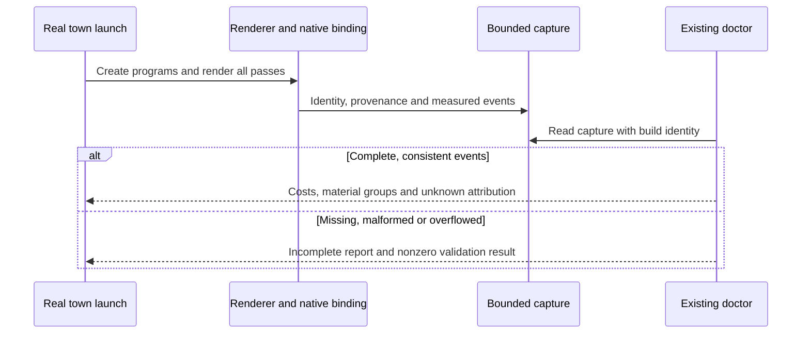

# PRD-367 — Doctor explains shader compilation

**Status:** PROPOSED. **Layer:** engine; renderer/backend observations cannot be implemented
portably by a game. **Complexity:** 3 (10+ files) + 2 (new observation) + 2 (multiple packages)
= **7 → HIGH mode**. **Depends on:** the [batch source and execution contract](README.md).

## Problem and outcome

A slow town launch currently needs a bespoke instrumented APK to explain its 101 pipelines.
An author runs the existing doctor surface against a captured real launch and sees which material
and pass produced each program, how long compilation took, and which work reached first render.
This is internal diagnostic tooling; no new game UI or material optimizer belongs in this PRD.

## Integration ledger

| # | New thing | Live caller / existing anchor | Replaces | Old path disposition | Negative control |
| --- | --- | --- | --- | --- | --- |
| D1 | Bounded compile census | `packages/core/src/renderer.ts`, renderer construction; `packages/core/src/game.ts:887`, warm-up invocation | Bespoke probe hooks | Product collector owns observation; probe remains historical evidence | Disable collector: real launch report must fail as missing |
| D2 | Native compile event fields | `packages/runtime-native/src/webgpu/bindings_pipelines.cpp:1113` and `:1123`, actual async/sync creation | Uncorrelated aggregate timing | Existing timing delegates to shared event identity | Remove one completed event: reconciliation fails |
| D3 | Doctor material/pass summary | `packages/playtest/src/runner/cli.ts:186`, `doctorCommand`; `:211`, scene observation | Machine/scene-only explanation of startup | Extend existing doctor; no second CLI | Feed malformed capture: nonzero exit |

Anchors describe inspected callers, not completed wiring. Add every new export/artifact to the
ledger during implementation and prove it is consumed. Reuse `sceneOverview.js`, the existing perf
reader and core playtest snapshot seam. No global monkey-patch in generated games.

## Contract and decisions

Record a versioned launch capture with build/adapter identity, monotonic clock origin, pipeline
identity, vertex/fragment hashes and UTF-8 byte lengths, pass, material/object provenance where
available, sync/async mode, queue/start/end times, status and first-present boundary. Distinguish
program identity from full render-state pipeline identity. Material names are labels, not keys.
Represent unattributed work explicitly; reconciliation includes it and never guesses provenance.

Main/shadow/PMREM/output totals must reconcile to observed device creations. Sum compile service
durations separately from wall-clock elapsed time: parallel jobs overlap. Count lookups, creations,
failures and unique keys separately. Do not retain full WGSL by default; bounded capture overflow
marks the capture incomplete and invalidates completeness claims. Browser driver time unavailable
means unavailable, not zero; do not present promise latency as native compiler time.

Summarize structural differences (maps, skinning, clipping, graph hash, render state) from observed
inputs; report unknown reasons honestly. Correlate source bytes with compile time by pass and
device, retaining samples and sample counts. Correlation may prioritize an experiment but cannot
prove that smaller source causes faster compilation. No automatic appearance changes.

**Data change:** diagnostic schema only, no database or cooked asset-format migration. Old captures
must be recognized as unsupported/incomplete instead of parsed into a successful empty report.

## Phase 1 — The real town produces a reconciled census

Files: EDIT `packages/core/src/renderer.ts` (install lifecycle observation),
`packages/core/src/playtest.ts` (expose capture), `packages/core/src/game.ts` (startup boundary);
NEW `packages/core/src/pipeline-census.ts` (bounded collector),
`packages/core/__tests__/pipeline-census.spec.ts` (contract tests). Ledger D1.

Use existing backend identities after node generation rather than duplicating Three's graph-key
algorithm. Restore any wrapped methods on teardown and avoid duplicate installation. First prove
the actual town on browser and desktop, including shadows/output and runtime-generated materials.
Small fixtures supplement this proof with shared-value materials and state-only variants.

Test `should reconcile unique programs and pipeline creations when all passes render` and
`should reject completeness when an event is missing`. Revert control: bypass collector installation
in `renderer.ts`; the real scenario's nonempty census assertion fails. Run
`pnpm exec vitest run packages/core/__tests__/pipeline-census.spec.ts` and shared runtime gates.
User verification: launch the town and inspect a nonempty capture with pass totals equal to the
observed creation count. Timing attribution remains open until Phase 2.

## Phase 2 — Native timing belongs to the correct pipeline

Files: EDIT `packages/runtime-native/src/webgpu/bindings_pipelines.cpp` (sync/async timestamps),
`packages/runtime-native/src/webgpu/bindings_pipelines.h` (shared contract),
`packages/runtime-native/tests/async_pipeline_thread_test.cpp` (success/error/lifetime proof),
`packages/playtest/src/runner/perf.ts` (read actual events);
NEW `packages/playtest/__tests__/pipeline-timing.spec.ts` (reconciliation). Ledger D2.

Join stable event IDs across threads and clocks without blocking completion. Preserve rejection,
device teardown and late callback behavior. Exercise actual async and sync paths on the town;
run three thermally qualified Pixel 8 captures for timing and a desktop count cross-check.
Test `should separate queue delay from compile service time when jobs overlap`; drop an event at
the binding emission line as the negative control. Run
`pnpm exec vitest run packages/playtest/__tests__/pipeline-timing.spec.ts`, native gates and the
shared real-game proof. User verification: each reported slow pipeline resolves to its pass and
shader hashes; summed work is labeled separately from elapsed launch time.

## Phase 3 — Doctor answers why this game compiles slowly

Files: EDIT `packages/playtest/src/runner/cli.ts` (capture argument and invocation),
`packages/playtest/src/runner/doctor.ts` (formatted diagnosis),
`packages/playtest/__tests__/doctor.spec.ts` (real command errors),
`packages/create-threenative/src/doctor.ts` (project doctor integration);
NEW `packages/playtest/src/runner/pipeline-summary.ts` (shared aggregation). Ledger D3.

Add a capture input to the existing doctor command and forward it through project doctor; the
implementation must document its exact new flag before use. Preserve today's machine-only mode.
Present top contributors, distinct-program reasons, warm-up coverage and size/time sample analysis
in both text and structured output. Test `should fail when a requested startup capture is malformed`
and `should show material contributors when a real launch capture is supplied`. Remove summary
invocation as the revert control: real command output assertions must fail.
Run `pnpm exec vitest run packages/playtest/__tests__/doctor.spec.ts` and shared gates. User
verification: one doctor invocation reads the town capture without rebuilding an instrumented APK.

## Acceptance and verification evidence

- [ ] Town capture is complete, deduplicated by actual backend identity and correlated to materials
  or explicitly unknown provenance, across browser and native desktop.
- [ ] Pixel 8 timing retains raw observations, thermal/adapter identity, queue versus service time,
  and shader-size correlation; no causal or “irreducible driver cost” overclaim.
- [ ] Doctor text/JSON and project entry point consume the same capture; missing data fails closed.
- [ ] Observation overhead is measured with collector enabled/disabled on identical builds; reject
  always-on detail capture if it measurably changes the launch under study. Keep cheap counters and
  explicit detailed capture where needed.
- [ ] Each phase records command/output/artifact, observed red/green, caller census, independent
  reviewer result and manual timing review under the shared contract. All currently UNVERIFIED.
