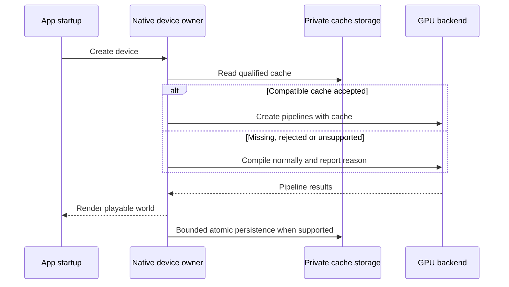

# PRD-368 — Compiled pipelines survive a relaunch

**Status:** PARTIAL — Phase 1A and Phase 1B executed on Linux/Vulkan, 2026-09-09: the host now compiles every pipeline through one device-owned cache. Persistence across restarts, Android, and every timing claim remain open. **Layer:** native engine; only the host can persist backend compiler data.
**Complexity:** 3 (10+ files) + 2 (new cache lifecycle) + 2 (concurrency) = **7 → HIGH mode**.
**Depends on:** [367](PRD-367-doctor-explains-shader-compilation.md) for measured acceptance and
the [shared execution contract](README.md). Dependency feasibility can run first.

## Latest decision and handoff — 2026-09-09

**Continue with a small, version-pinned patch to wgpu-native `v25.0.2.2`, maintained in this
repository.** Keep the existing backend and dependency version. The owner selected solving startup
with minimum maintenance, authorized the bounded patch route, and then paused implementation to
conserve tokens. Do not restart the earlier options discussion or wait for a new upstream API.

The [earlier feasibility probe](../../verification/prd-368-feasibility-2026-09-09.md) correctly found
no public cache API in the shipped binaries. The new prototype exposes cache operations already
present in their pinned Rust wgpu dependency. It changes four upstream files: `ffi/wgpu.h`,
`build.rs`, `src/conv.rs`, and `src/lib.rs`. It adds feature mapping, a reference-counted cache
handle, strict creation/loading, owned serialized bytes/freeing, and chained render/compute
pipeline attachment. This is a maintained dependency patch and reproducible source-build obligation,
not zero maintenance. No patched dependency or persistent cache has been installed into the game.

**Proven:** a linked Linux/Vulkan probe creates and serializes a 13,573-byte cache, imports it in a
new process, and renders byte-identical output with cache attached, reloaded, and disabled. The
unmodified library fails to link the required symbols. **Not proven:** Bayview integration, Android,
async lifetime, corrupt-file recovery, durable storage, or startup savings. The disabled control was
faster than loading the cache on this desktop; do not infer a speedup from the first two timings.
The [canonical evidence](../../verification/runtime-perf-state.md#prd-368-bounded-cache-api-prototype--2026-09-09)
retains the patch, probe, exact commands, hashes and raw results. The local ignored working copy is
`artifacts/startup-measure-reduce/pipeline-cache-spike/` in the PR-165 checkout; reconstruct from the
retained artifacts if that checkout has been removed.

### Phase 1B result — 2026-09-09

The host owns exactly one `WGPUPipelineCache` per device, created in `initBindings` before any
binding is installed and released in `shutdownAsyncPipelineCompiles` after every worker is joined.
All four creation paths supply it: synchronous render, synchronous compute, and both worker
compiles. `ownDescriptor()` still drops `nextInChain`; the worker rebuilds the extension on its own
stack beside the creation call rather than carrying a pointer it does not own.

**Executed** on Linux/Vulkan (NVIDIA RTX 2080) with the patched wgpu-native, evidence in
[`pipeline-cache-host/`](../../verification/startup-measure-reduce-2026-09-09/pipeline-cache-host/):
`threenative-pipeline-cache-api-test` drives four pipelines through the host's own JavaScript
bindings and the device cache grows from its empty 100 bytes to 32,515, with `renderAttached=2`
and `computeAttached=2`. The red — attachment removed while the host still reports a cache — leaves
the cache at 100 bytes and exits 1. `TN_PIPELINE_CACHE=0` is the shipping negative control: same
binary, nothing attached, nothing serialized, rendering unchanged. 35 of 38 native contract tests
pass in this configuration; the three failures (`webgpu-comprehensive`,
`runtime-platform-comprehensive`, `webgpu-bindings-reentrancy`) reproduce identically at the
Phase 1A commit and are pre-existing gaps in a wgpu-configured Linux build, as are the two targets
that do not compile there at all (`wgpu-null-handle`, `rg11b10-renderable`, which include Dawn's
`<webgpu.h>` layout).

Because the cache API exists only in the maintained patch, CMake now defines
`MYSTRAL_WGPU_PIPELINE_CACHE` by reading the installed `wgpu.h`. A stock prebuilt reports
`unsupported` and renders exactly as before, which is what keeps an ordinary `pnpm native:build`
compiling.

**Not proven by this phase:** persistence across process restarts, Android arm64, device loss,
corrupt or unwritable storage, and any startup saving whatsoever. The host reports a cache *mode*
and serialized *bytes*; the backend exposes no per-pipeline hit or miss, so nothing here is
permitted to say a pipeline was reused.

### Next work, in priority order

1. **DONE (Linux only) — Make the patch reproducible and prove a real pipeline.** Review the retained prototype; add the
   canonical patch/source-build path and compiled API regression. Preserve the pin and ABI; build
   Linux Vulkan and Android arm64. System libclang 22 broke bindgen 0.72; the existing NDK libclang
   built the prototype successfully. Pin/document the build toolchain. Run an actual Bayview pipeline
   with matching descriptors, feature enablement, cache attachment and rendered output before claiming
   Phase 1 complete. Keep unsupported backends explicit.
2. **DONE (Linux only) — Attach one device-owned cache to every supported creation path.** Cover sync render, worker
   async render, and compute. `ownDescriptor()` currently strips `nextInChain`: preserve the cache
   extension in owned storage or reconstruct it around the worker call. Retain its handle through
   completion; drain workers before snapshot/device teardown. Test rejection, foreign-device caches,
   concurrent creation, device loss and shutdown. Do not change warm-up scheduling or game materials.
3. **Add bounded, automatic app-private persistence.** Qualify by app/build, shaders, adapter,
   driver, backend and cache ABI. Upstream checks compatibility but does not checksum the payload:
   validate length and an envelope digest before unsafe ingestion. Load strictly; report rejection
   and explicitly create an empty cache on a miss. Atomic replacement, bounded size and unwritable
   storage must preserve launch. Serialize after compilation settles, away from first present.
4. **Measure the actual Pixel game.** Use the same APK for three independent empty/populated pairs
   plus an interleaved cache-disabled control. Keep process-cold and cache-empty distinct. Require
   discharging/cool device conditions; retain first-playable timestamps, compile service/elapsed
   clocks, counts and raw cache outcomes. Targets remain populated compile median ≤25% of empty and
   first-playable median ≤8,000 ms. API import success alone is not a measured cache hit or benefit.
5. **Close only on evidence.** Run the shared runtime/native/game gates, independent review and human
   timing/appearance review. Mark done only after all existing acceptance boxes pass. PRD-369's
   first-install target is separate; this cache primarily addresses compatible repeat launches.

**First action for the next agent:** Phase 2. Reproduce the Phase 1B green with
`pipeline-cache-host/commands.txt` first, so you are building on a cache you watched populate, then
give it bounded app-private storage. The Android arm64 build of the patched dependency is still
owed from Phase 1A and blocks Phase 3; it does not block Phase 2.

## Problem and outcome

The source town pays 8,513 ms to create 101 pipelines. A compatible process restart should reuse
compiled native pipeline data automatically. First launch still compiles; a corrupt or incompatible
cache must never prevent a correct launch. This does not change materials or turn on warm-up.

## Integration ledger

| # | New thing | Live caller / existing anchor | Replaces | Old path disposition | Negative control |
| --- | --- | --- | --- | --- | --- |
| C1 | Pinned native dependency with owned cache API patch | `packages/runtime-native/scripts/download-deps.mjs:55`, dependency selection; `packages/runtime-native/CMakeLists.txt:362`, linking | Current wgpu dependency for the selected backend | One selected pin, no alternate shipping runtime | Link against old headers: required API capability check fails |
| C2 | Per-device cache lifecycle | `packages/runtime-native/src/webgpu/bindings_pipelines.cpp:1113` and `:1123` | Compile without a supplied persistent cache | Both existing creation paths use one shared cache when supported | Bypass attaching cache: warm performance control loses benefit |
| C3 | Durable cache storage/status | `packages/runtime-native/src/webgpu/bindings.cpp`, device lifecycle | No persistent native pipeline artifact | One owner; warm-up metadata cache stays separately labeled | Corrupt bytes: launch succeeds with recorded rejection and rebuild |

The current core `warmUpCacheIdentity` and `warmUpStorage` in `warmup.ts` cache warm-up metadata;
they are not proof of serialized GPU compiler reuse. Do not replace or relabel them as native hits.

## Design and feasibility boundary

The inspected downloader pins `v25.0.2.2`. The source's proposal to “bump wgpu-native” does not prove
that any available release exposes a usable C cache handle. Inspect upstream primary API, headers,
license and the exact binary exports at execution. The selected route is the bounded patch above, with the original version retained. A future upstream
API can replace it after equivalent executed proof. Rust capability alone remains insufficient:
link and execute the patched C API on each claimed target. Linux Vulkan is the prototype target;
Android Vulkan is required next. Do not introduce another graphics backend.

Identity includes app/build and shader content, adapter/device, driver, backend and cache ABI/version.
Use the existing host app-private storage/config seam; never the asset `public/` directory or a
shared unqualified filename. Validate metadata, length and bounds before backend ingestion. Use
atomic replacement, bounded disk use and serialized writes; a crash leaves either the old valid
file or a miss. Missing, incompatible, corrupt or unwritable storage records a reason and compiles
normally. Device/pool shutdown must complete safely without a use-after-free or blocking flush on
first present. Status means actual backend load/store outcomes, not merely “file exists.”

**Data change:** versioned, disposable per-app native cache; no source asset or database migration.
On unsupported backends report unavailable and preserve normal rendering. Browser caching remains
browser-owned. Do not claim D3D12/Metal/iOS reuse without executing those lanes.

## Phase 1A — Reproducible patched dependency and linked API

Files: NEW `patches/wgpu-native@25.0.2.2.patch`; EDIT
`packages/runtime-native/scripts/download-deps.mjs` (pinned source reconstruction/patch/build),
`packages/runtime-native/scripts/verify-wgpu-version-matrix.mjs` (patch and API identity),
`packages/runtime-native/CMakeLists.txt` (contract registration); NEW
`packages/runtime-native/tests/pipeline_cache_api_test.cpp` (compiled round trip). C1; five files.

Start from the retained four-file prototype, preserving attribution/license and reproducible source,
header and patch identities. Prove feature discovery/request, strict empty/imported creation,
render/compute attachment and serialization ownership. The test must also render a pipeline taken
from the actual town, not only the synthetic probe. Unsupported backends report unavailable.
Link against the unpatched library as red, then use the patched artifact as green. Run the compiled
contract, native build/desktop verification and shared gates. This proves API feasibility and
reconstruction; it does not prove durable process restarts or phone timing.

## Phase 1B — Host creation paths consume one live cache

Files: EDIT `packages/runtime-native/src/webgpu/bindings_pipelines.cpp`,
`packages/runtime-native/src/webgpu/bindings_pipelines.h`,
`packages/runtime-native/src/webgpu/bindings_state.h`,
`packages/runtime-native/src/webgpu/bindings.cpp`, and
`packages/runtime-native/tests/async_pipeline_thread_test.cpp`. C2; five files.

Wire one cache owned by the device to existing sync/async render and compute creation. Preserve the
extension through `ownDescriptor()` and keep handles alive while workers compile. Do not persist
from each pipeline call. Execute failures, concurrent requests, teardown and device-loss controls;
remove attachment as red and observe that the actual host no longer populates the supplied cache.
Run the real town on native desktop with complete observed counts and rendered checks, plus native
and shared gates. User verification: the host reports its actual cache mode and renders the town.

## Phase 2 — Process restarts load validated app-private data

Files: EDIT `packages/runtime-native/src/webgpu/bindings.cpp` (device ownership),
`packages/runtime-native/src/webgpu/bindings_pipelines.cpp` (pool lifetime integration),
`packages/runtime-native/CMakeLists.txt` (module/test registration);
NEW `packages/runtime-native/src/webgpu/pipeline_cache.cpp` (bounded storage/lifecycle),
`packages/runtime-native/tests/pipeline_cache_test.cpp` (real filesystem corruption/restart cases).
Ledger C2/C3. Split this phase if declarations or platform storage wiring require additional files.

Wire existing configuration and platform storage before choosing paths. Test `should compile
normally when persisted bytes are corrupt`, `should miss when the driver identity changes`, and
`should preserve a valid cache when a write is interrupted`. Include concurrent completion,
read-only storage, oversized input and process death. Revert control: remove lifecycle load call;
restart integration test must lose the accepted-cache event. Run native/shared gates and real
town restarts. User verification: relaunch, observe hit; replace the exact test cache with corrupt
bytes, relaunch successfully, observe rejection. Never clear unrelated app data for this control.

## Phase 3 — Pixel 8 repeat launches meet the measured bar

Files: EDIT `packages/runtime-native/scripts/measure-cold-start.mjs` (explicit cache-state records),
`packages/playtest/src/runner/perf.ts` (cache outcomes in reports),
`packages/runtime-native/tests/async_pipeline_thread_test.cpp` (regression coverage),
`docs/verification/runtime-perf-state.md` (commands/results);
NEW `packages/playtest/__tests__/pipeline-cache-perf.spec.ts` (fail-closed evaluation). C3.

Use three independent pairs: process-cold/cache-empty launch then process-cold/cache-populated
launch, same APK and qualified thermal conditions. Interleave a cache-disabled control to
distinguish driver warming from application-cache benefit. Retain all samples, medians, complete
pipeline counts and first-playable timestamps. Proposed acceptance: populated-cache compile median
≤25% of matched empty-cache median and populated first-playable median ≤8,000 ms. These are goals,
not predictions. Report first-launch cost and any persistence overhead separately.

Test `should reject a warm-cache claim when only the process was restarted` if cache identity/state
evidence is absent. Run `pnpm exec vitest run packages/playtest/__tests__/pipeline-cache-perf.spec.ts`,
native/shared gates, and the existing measurement script with the resolved game config and
`--launches 3`; record exact commands for cache arms before execution. Human review checks the raw
paired timings and identical rendered result. If API reuse works but the timing bar fails, keep
the PRD partial and record the measured result, without declaring earlier startup PRDs complete.

## Acceptance and verification evidence

- [ ] Cache-capable C API, binary pin and selected platform builds are proven, with no inferred API.
- [ ] Both sync and async creation consume the same qualified cache and teardown is safe.
- [ ] Corrupt/incompatible/missing/unwritable caches preserve launch with honest reason codes.
- [ ] Real Pixel 8 pairs meet the registered compile and playable bars; desktop/browser visuals
  remain correct and unsupported platform claims remain explicitly unverified.
- [ ] Every phase has command/output/artifact, red/green, caller census, independent review and
  manual performance review. The prototype evidence above does not complete these shipping criteria.
