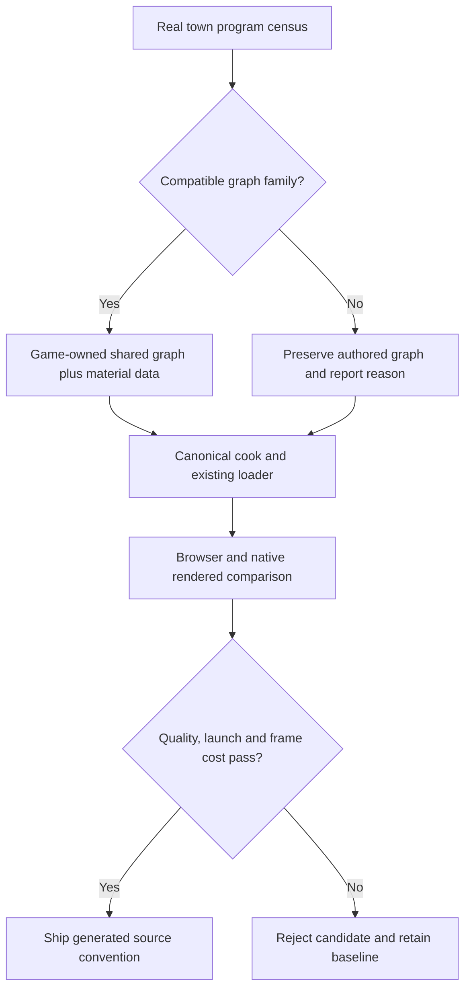

# PRD-369 — Material variation is data, not another shader graph

**Status:** PROPOSED. **Layer:** game/generated template render source, because graph structure,
texture atlases and material assignments decide appearance. **Complexity:** 3 (10+ files across
game and templates) + 2 (new generated material source) + 2 (multiple consumers) = **7 → HIGH mode**.
**Depends on:** [367](PRD-367-doctor-explains-shader-compilation.md) and the
[shared batch contract](README.md). Persistent caching is not a prerequisite.

## Problem and outcome

The measured town creates 96 distinct programs, not merely 96 material values. A cold first install
should create fewer programs by sharing compatible graph structure while retaining authored
material values and visible features. Color-only merging cannot satisfy this PRD: Three already
shares programs for compatible materials that differ only in values.

## Integration ledger

| # | New thing | Live caller / existing anchor | Replaces | Old path disposition | Negative control |
| --- | --- | --- | --- | --- | --- |
| M1 | Game-owned shared material construction | Actual PRD-360 town material creation/assignment, resolved in preflight | Measured duplicate structural families | Replace selected factories in same phase; explicit unsupported materials stay authored | Restore old assignments: real town program-reduction gate fails |
| M2 | Extended generated material source and convention | `packages/create-threenative/templates/starter/src/scenes/Play.ts:65`, existing `createMaterials()` call | Only structural duplication demonstrated by the new census | Extend existing factory; no competing material module | Remove factory integration: scaffold scenario detects missing behavior |
| M3 | Cold-launch and appearance comparison | Existing town playtest scenario and `packages/playtest/src/runner/perf.ts` | Ad hoc material-count claim | Existing runner owns report | Same baseline hash in both arms: comparison refuses |

M1 intentionally has no invented game path: the requested source does not name its material factory.
Resolve and record the existing factory, scene and scenario `file:line` before Phase 1 edits; inability
to recover that production consumer blocks implementation. Do not prove the feature only in starter.

## Design decisions

Use 367's actual program/provenance groups to select compatible opaque/cutout PBR families. Keep
skinning, morphs, clipping, transparency, shadow behavior and special effects explicit. A universal
shader with costly dynamic branches is not automatically a win; compare source size, compilation,
GPU frame time and appearance. Shared material values must not bleed between objects.

Start with shared graph construction and material data supported by ordinary Three.js. Use an atlas
or texture array only when observed sampler/graph differences require it and both targets support
the chosen representation. Preserve UV transforms, wrapping, mip padding, normal-map semantics,
color spaces, alpha tests and per-material roughness/metalness. Keep material choices and mapping in
the game's `src/render/`. No package-level PBR preset, engine-wide material rewrite, new scene format
or asset compiler that silently changes the look. Reuse the canonical cook and its quality floor;
compression, material counts, program counts, payload and GPU residency stay separate metrics.

**Data change:** game-owned material parameters/mapping only; source assets remain recoverable.
No shared package format or database migration. Unsupported material families retain original
render source with an explicit diagnostic, and remain included in whole-game totals.

## Phase 1 — The actual town renders fewer programs on first install

Files (resolve the four game paths in preflight): EDIT existing town material factory, scene
material assignment and real playtest scenario; NEW town `src/render/sharedMaterials.ts`;
EDIT `docs/verification/runtime-perf-state.md`. Ledger M1/M3. At most five files.

Freeze raw baseline and camera checkpoints. Name selected structural families, expected removals
and every excluded feature before changing assignments. Build a small compatible family first
inside the complete town, then measure the complete game with persistent cache disabled. Acceptance
target: ≤64 distinct programs from a reproduced 96-program baseline (at least one-third reduction
if baseline changed), with first-playable median ≤8,000 ms on three qualified Pixel 8 launches.
Fewer programs alone do not prove faster launch; retain per-program sizes and timing.

Scenario assertion `should reduce unique programs when the town uses shared material data` must
fail with the original assignment restored. Add a deliberate wrong material/alpha assignment as
the visual red. Run the existing game scenario on browser/native desktop and qualified Pixel 8;
record exact resolved commands before execution. Full town gameplay, shadows and animated actors
must remain present. User verification: compare fixed daytime/shadow/close-up checkpoints and
play the town; no material loses an authored feature. If this target cannot be met without a visual
tradeoff, record the candidate and keep the PRD partial rather than silently dropping features.

## Phase 2 — A scaffold inherits the proven material convention

Files: EDIT `packages/create-threenative/templates/starter/src/render/materials.ts` (existing editable source),
EDIT `packages/create-threenative/templates/starter/src/scenes/Play.ts` (real use),
`packages/create-threenative/templates/starter/AGENTS.md` (default, override and measurement),
its generated `CLAUDE.md` mirror, and NEW
`packages/create-threenative/__tests__/shared-material-source.spec.ts`. Ledger M2.

The starter already has `createMaterials()` and value-varying standard materials. Preserve that
sharing; replacing those with another wrapper is not a reduction. Port only a reusable structural
pattern proven in Phase 1 and applicable to a real starter material family. If none is applicable,
limit this slice to executable regression coverage and instructions for the existing factory,
recording why no material rewrite is warranted. Retain game-specific parameters in the template.
Document shared graph use by default, a named authored-material override at the same
object and measurement that still includes overridden materials. Do not add unused factories to
unrelated templates. Test `should render independent material values when a scaffold shares graph
structure`; prove assignments through a generated install, not a source-string check. Remove the
`Play.ts` invocation as the revert control. Run `pnpm sync:agents`,
`pnpm exec vitest run packages/create-threenative/__tests__/shared-material-source.spec.ts`,
`pnpm test:templates` and shared full gates. User verification: scaffold, change one object's material
data, observe only that object's appearance change and inspect actual program counts.

## Phase 3 — Quality and performance survive the complete asset flow

Files: EDIT the resolved town material factory (close remaining measured families), its scenario,
`packages/playtest/src/runner/perf.ts` (distinct arm identity validation),
`packages/playtest/__tests__/pipeline-timing.spec.ts` from 367 (comparison regression),
`docs/verification/runtime-perf-state.md`. Ledger M1/M3.

Re-run from source through the existing cook on independently hashed baseline/candidate builds.
Hold resolution, camera, lighting and render settings fixed. Compare payload and GPU residency as
well as compile cost and steady-state median/p95 GPU frame time; reject a candidate with >5% GPU
frame-time regression on repeated matched runs. Use 351's applicable texture floor and register
render-comparison tolerances before viewing results; human review must accept cutout edges,
normals, roughness, shadows and animation. Tests must reject identical-subject comparisons and
missing timing samples. Revert the final factory change and observe the program gate fail again.
Run shared browser/native/game gates and the Phase 1 Pixel acceptance again.

## Acceptance and verification evidence

- [ ] Complete real-town first-install result meets program and playable targets with cache disabled.
- [ ] Quality, gameplay, texture semantics, shadows and animation pass measured and human review.
- [ ] No >5% GPU frame-time regression; compile, payload and residency costs are reported separately.
- [ ] Generated editable source is invoked by a scaffold, includes default/override instructions,
  and adds no package-owned appearance or competing asset publisher.
- [ ] Every phase retains exact game paths, commands, red/green, caller/revert evidence and reviewer
  decision. All implementation evidence currently UNVERIFIED.
