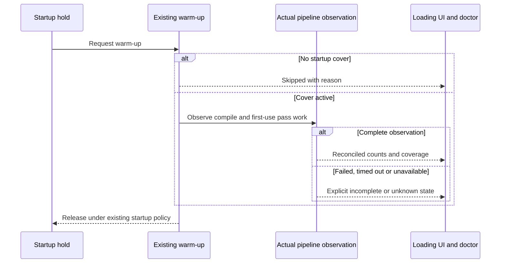

# PRD-370 — Warm-up counts what the GPU creates

**Status:** PARTIAL. **Layer:** engine; honest work accounting and backend identity belong to
the renderer mechanism. **Complexity:** 2 (6–10 files) + 2 (multiple consumers) = **4 → MEDIUM mode**.
**Depends on:** [367](PRD-367-doctor-explains-shader-compilation.md) and the
[shared execution contract](README.md); reconcile PRD-360 source-lane changes first.

## Problem and outcome

The source records a warm-up report of 494 “pipelines” for 101 actual GPU creations. The inspected
`pipelineKey` uses material object identity and incomplete geometry flags. A loading surface and
doctor must distinguish candidate objects from actual programs/pipelines, include late pass work,
and report skipped/incomplete warm-up honestly. This PRD promises truthful accounting, not faster
total startup or a new warm-up scheduling experiment.

## Integration ledger

| # | New thing | Live caller / existing anchor | Replaces | Old path disposition | Negative control |
| --- | --- | --- | --- | --- | --- |
| W1 | Observed pipeline accounting | `packages/core/src/warmup.ts:462`, `pipelineKey`; `packages/core/src/game.ts:887`, warm-up consumer | Material/object heuristic advertised as pipeline count | Delete heuristic as an authoritative count; candidate count labeled separately | Restore material-identity count: shared-program test fails |
| W2 | Reconciled startup coverage report | `packages/core/src/game.ts:854` and `:917`, held/regular warm-up | Success inferred only from walked main list | Existing reports consume 367 observation and first-use coverage | Exclude shadow/output observation: readiness completeness assertion fails |
| W3 | Honest loading and doctor fields | `packages/playtest/src/runner/doctor.ts`, existing formatter; starter `src/render/loading.ts` | Progress conflating queued objects with created pipelines | Existing UI/doctor read defined counts or indeterminate state | Missing observation must not render 100% complete |

## Design decisions

Reuse Three's actual stage/backend keys from 367 after node generation, including vertex/fragment
identity and the backend's render-state inputs. Do not invent another partial hash of blend/depth,
formats, topology, clipping and geometry layout. Before keys exist, work is candidates/unknown,
not a promised exact pipeline total. Never drop an object from needed coverage based solely on the
old heuristic. If exact pre-counting requires doing the compile work, expose indeterminate progress
until observation is available rather than paying for a second speculative walk.

Keep candidate, unique program, unique pipeline, attempted, created, failed, abandoned and late
first-use work separate, with explicit observation boundaries. Cached pipeline reuse and metadata
cache hits are distinct. A skip reason is not completed work. `abandoned:0` means only no abandoned
requests; it does not imply every shadow/output path was compiled. Diagnostics fail closed on
missing data while optional warm-up failure still releases gameplay according to existing startup
policy. Do not introduce a new cover default or change render settings.

**Data change:** evolve existing warm-up report fields with documented compatibility. Audit every
consumer and fixture before removing/renaming `pipelines`; avoid silently changing its units.
Source-lane no-cover logging, `firstUseRender` and concurrency-ceiling docs are recorded as fixed
there, not necessarily merged here. Reuse them if present; verify their regressions in Phase 2.

## Phase 1 — Shared programs and state variants count correctly

Files: EDIT `packages/core/src/warmup.ts` (accounting and candidate selection),
`packages/core/src/game.ts` (consumer), `packages/core/__tests__/warmup.spec.ts` (regressions),
`packages/core/src/pipeline-census.ts` from 367 (shared observer),
`packages/core/__tests__/warmup-default.spec.ts` (default flow). Ledger W1.

Test `should count one observed program when materials differ only in values` and
`should retain distinct pipelines when identical shaders use different render state`. Include
multi-material geometry, skinned/morphed objects and changed target/layout. Baseline mutation is
restoring `pipelineKey` material identity as reported pipelines; both over- and under-count controls
must fail for the relevant reason. Run
`pnpm exec vitest run packages/core/__tests__/warmup.spec.ts packages/core/__tests__/warmup-default.spec.ts`
and shared gates. Drive the actual town on browser/native desktop; reconcile with device creation
events rather than hardcoding the historical 101. User verification: the report shows candidates
and observed pipelines as separate quantities, including state-only variants.

## Phase 2 — Coverage remains honest at first render and in consumers

Files: EDIT `packages/core/src/game.ts` (skip/first-use report integration),
`packages/core/__tests__/startup-ready-bound.spec.ts` (readiness controls),
`packages/playtest/src/runner/doctor.ts` (coverage summary),
`packages/playtest/__tests__/doctor.spec.ts` (unknown/incomplete output),
`packages/create-threenative/templates/starter/src/render/loading.ts` (progress consumer).
Ledger W2/W3. Split if the consumer census identifies additional live callers needing migration.

Exercise no-cover, cover, failed compile, timeout, metadata-cache hit and first-use shadow/output
paths. Where PRD-360's first-use rendering landed, keep its pixel-identical behavior and zero late
creation criterion for the covered scene; do not claim this for intentionally unseen future
materials. Missing instrumentation is unknown and cannot become a successful zero. Introduce a
material after readiness and require it to appear as late work in the existing hitch diagnostics.

Tests `should report skipped when no cover exists`, `should report incomplete when first-use work
is unobserved`, and `should avoid complete progress when pipeline totals are unknown`. Disable
shadow/output observation and observe the real scenario coverage assertion fail. Run
`pnpm exec vitest run packages/core/__tests__/startup-ready-bound.spec.ts packages/playtest/__tests__/doctor.spec.ts`,
`pnpm test:templates`, shared runtime gates and the same town scenario on browser/native desktop.
No physical device required for count-only claims. User verification: a loading surface shows known
progress or an indeterminate state, and doctor explains skip/late/incomplete outcomes.

## Acceptance and verification evidence

- [x] Every live report/progress consumer distinguishes candidates, programs and actual pipelines.
- [x] Shared-value and state-only variants produce the correct observed identities without missed work.
- [ ] Skip, failure, timeout, absent observation and late work cannot masquerade as full coverage.
- [ ] PRD-360 source-lane fixes are reconciled with explicit commit evidence; no duplicate scheduling
  implementation or rejected launch experiment is introduced.
- [ ] Both phases have command/output/artifact, actual red/green, caller census and independent
  review; real browser/native behavior is proven. Phase 1 browser/native captures are now recorded
  in `docs/verification/runtime-perf-state.md`; late first-use, PRD-360 reconciliation and the
  independent Phase 2 review remain open.
