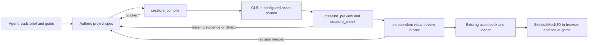

# PRD-372 — Generate animated creatures through the asset MCP

**Status: PROPOSED — 2026-09-09. Implementation has not started.**

**Planning Mode: Principal Architect. Complexity: 9 → HIGH mode.** More than ten implementation
files (+3), a new integration (+2), child-process cancellation and concurrent output writes (+2),
and delivery across the asset MCP and engine repositories (+2). Automated review follows every
phase; creature appearance also requires independent visual review.

**Problem:** an agent can find or convert an existing model through ThreeNative's installed MCP
servers, but cannot use anyCreature's procedural compiler and measurements through those tools.

**Outcome:** an agent authors a creature, compiles and inspects it through MCP, receives usable
previews and actionable failures, and puts the resulting animated GLB in a playable game.

**Proposed integration boundary:** add five `creature_*` tools to the existing
`threenative-asset-mcp`. The server remains usable by any compatible local MCP client; ThreeNative
additionally ships discovery and game integration. This plan assumes the existing asset server is
the intended host. A separately distributed anyCreature server is a different packaging choice,
not a prerequisite for these tools.

**Layer:** asset authoring on the development machine. The external asset MCP owns the compiler
bridge and its dependencies. The engine repository owns installation pins, generated authoring
guidance and game proof. Creature geometry, palette, shading parameters and animation timing are
authored project data. No anyCreature code enters the runtime engine or player's bundle.

## Integration ledger

`A/` means the existing `threenative-asset-mcp` repository, inspected at `0890578` in
`/home/joao/projects/threenative/threenative-asset-mcp`. `E/` means this engine repository.
Engine anchors were inspected during this planning session; re-resolve them at execution because
other work is active in the primary checkout. NEW paths below are proposed, not shipped APIs.

| # | New thing | Live caller / inspected anchor and intended invocation | Replaces | Old path disposition | Negative control |
| --- | --- | --- | --- | --- | --- |
| C1 | Five tools in `A/src/tools/creature.ts` | `A/src/server.ts:163` registers handlers in `createAssetServer`; `A/src/index.ts:38` serves them over stdio | Shell-only access to anyCreature | Existing asset tools retain their distinct jobs; no previous creature handler exists | Remove registration: installed `tools/list` and a real `tools/call` fail |
| C2 | Pinned upstream payload and `A/src/creature/runner.ts` | C1 invokes the pinned `engine/cli.js`, validator and named harness commands | Copying a remote checkout and running setup manually | Generated creature workflow delegates compilation to MCP in phase 6 | Remove the compiler or a transitive file from the packed payload: compile fails explicitly |
| C3 | `A/src/creature/preview.ts` and preview artifacts | C1's `creature_preview` invokes CPU silhouettes or the render harness | Agent-written browser/render scripts | Shared guide uses the same tool for every round | Missing view, blank image or missing browser produces an error, never an approved preview |
| C4 | `A/src/creature/check.ts`, claims and inspection reports | C1's `creature_check` validates actual GLB bytes and invokes claims measurement when requested | Treating compiler exit zero or upstream judge exit zero as complete acceptance | Delivery instructions consume distinct structural, claims and visual results | Unknown claim, empty filtered claims or missing `attack` must fail the corresponding gate |
| C5 | Installed tool snapshot and package pin | `E/packages/core/mcp/assets.mjs:5` launches `MCP_PACKAGES.assets`; `E/packages/core/mcp/servers.mjs:38` supplies the pin | Asset MCP 0.7.0 without creature tools | Both dependency and fallback pin advance together after the package exists | Keep old installed package or remove packaged payload: fresh scaffold cannot complete the creature call |
| C6 | Generated creature workflow | Existing `E/packages/create-threenative/agent-docs/references/finding-assets.md` links it; `E/packages/create-threenative/src/index.ts:662` copies agent files | A custom-creature request having no procedural compiler route | Existing asset discovery remains; creature branch delegates to C1 | Remove the guide from the tarball: cold agent cannot discover the documented route |
| C7 | Consumer scenario and bounded evidence | A fresh scaffold's existing `src/scenes/Play.ts` loads the cooked model and updates `SkeletalMesh3D` | Manual GLB inspection as the final proof | Existing asset cook, loader and animation player stay canonical | Strip skin weights or an animation track: the same browser/native scenario fails |

Fill actual non-test caller lines, invocation evidence and artifact hashes at each implementation
checkpoint. Every new exported helper and generated artifact must fit a ledger row. Registration
alone is insufficient: the packed server must execute the operation from a real MCP client.

## Inspected source and reuse

1. Upstream is [anyCreature 1.3.1, commit
   `44e1abc2c7fe083f19f989c8437c44a141adc7f3`](https://github.com/Ariescar/anyCreature/tree/44e1abc2c7fe083f19f989c8437c44a141adc7f3).
   It is a spec compiler plus an authoring workflow. The calling agent supplies design reasoning;
   the server does not need an LLM account or a text-to-3D service.
2. [`engine/cli.js`](https://github.com/Ariescar/anyCreature/blob/44e1abc2c7fe083f19f989c8437c44a141adc7f3/engine/cli.js)
   takes a JSON filename and GLB filename. It runs mechanical checks, writes a checks sidecar,
   builds skinning/animations and validates the emitted container. It uses CommonJS, mutates the
   parsed spec and writes both diagnostic lines and a final JSON summary to stdout.
3. The [output contract](https://github.com/Ariescar/anyCreature/blob/44e1abc2c7fe083f19f989c8437c44a141adc7f3/docs/OUTPUT_CONTRACT.md)
   describes a self-contained, vertex-colored GLB with metre units, +Y up and +Z forward.
   Its promised three-animation delivery is stronger than the shipped two-animation wolf example.
   The wrapper must inspect actual clips and binding, not infer them from the document or example.
4. [`outline.py`](https://github.com/Ariescar/anyCreature/blob/44e1abc2c7fe083f19f989c8437c44a141adc7f3/harness/outline.py)
   computes silhouettes using Python, NumPy and Pillow. The JS silhouette, hero and claims renderers
   use Chromium. [`judge.mjs`](https://github.com/Ariescar/anyCreature/blob/44e1abc2c7fe083f19f989c8437c44a141adc7f3/harness/judge.mjs)
   filters claims by stage and does not provide the wrapper's required fail-closed guarantee for
   every unsupported claim or missing measurement. Its `--spec` argument means the claims file,
   not the creature's geometry spec.
5. `A/src/server.ts` already uses `@modelcontextprotocol/server`; tool handlers use Zod and
   structured results. `A/src/config.ts` provides validated environment loading and canonical-path
   precedent. Playwright and ZIP handling are installed dependencies. In the engine, capability
   search and detail inspection confirmed `compileAssets`, `modelPass`, `watchAssets`,
   `SkeletalMesh3D`, `AnimationPlayer`, `clipTrackBindings` and `boneLengths` as existing reuse paths.

The upstream README, cards and executable checks are not fully synchronized. For example, current
cards describe CPU silhouettes while the README describes the earlier browser path. Pin source,
test executable behavior and document adaptations instead of promising full harness parity.

## Product contract

The first release covers spec authoring guidance, compilation, round-trip inspection, silhouettes,
hero previews and measurable checks. It includes a complete agent-facing path from brief to game.
Images supplied by the user are interpreted by the calling agent into the brief and spec.

The first release does not include hosted HTTP transport, accounts, an internal LLM orchestrator,
Gobkit publishing, automatic license assignment, a creature editor, grafting tools, automatic LOD
generation or deployment of the game. Compiling one spec is not a promise to generate any possible
anatomy or produce motion the compiler cannot represent.

### The five tools

All envelopes use strict schemas with unknown fields rejected. Paths are project-relative;
operations resolve them against the server's launch directory and validate containment. JSON
schemas describe every argument and result, including conditional requirements.

| Tool | Input | Observable result |
| --- | --- | --- |
| `creature_status` | `{}` | Upstream commit/hash; compiler, Python-silhouette and Chromium-render availability separately; limits and actionable setup instructions. Missing optional tools do not prevent startup or guide access. |
| `creature_guide` | `section: overview\|syntax\|low\|mid\|high\|delivery` | A bounded section of the versioned, adapted guide and source attribution. Syntax documents supported upstream fields; overview gives the next tool call. |
| `creature_compile` | `specPath`, `outputPath`; optional `expectedOutputSha256` | Validated GLB, checks/receipt paths, input/output hashes, actual bounds/counts/clips, diagnostics and duration. Existing different output requires its matching prior hash. |
| `creature_preview` | `glbPath`, `mode: silhouettes\|hero`; optional `previousPreviewId` | PNG content usable by image-capable MCP hosts, project-relative artifact paths, view/backend identity and measured silhouette data. Previous comparison requires matching backend, cameras and resolutions. |
| `creature_check` | `glbPath`, `mode: structural\|claims`; claims mode requires `claimsPath` and `stage: LOW\|MID\|HIGH` | Actual mesh/rig/clip/material inspection, embedded source spec when present, structural errors and explicit per-claim results. It reports visual approval as `notReviewed`. |

`creature_compile` takes an authored spec file so it works with the host's normal file editor and
does not introduce another editing language. Return the pristine embedded spec in structural
inspection within the input/output size budget; if `embed_spec: false`, return `sourceSpec: null`
with the reason. Recompilation requires the authoring file in that case. Never claim reconstruction
of a missing spec from mesh data.

Use the incumbent SDK's negotiated stdio transport and cancellation support. Test with the SDK
client and the engine's scaffold client; do not hardcode a new protocol version or copy the
hand-written transport used by other engine MCP packages. Return `structuredContent` and its
serialized text equivalent; operation failures set `isError: true`. Reserve protocol errors for
invalid protocol requests. See the official [tool result contract](https://modelcontextprotocol.io/specification/2025-06-18/server/tools)
and [stdio requirements](https://modelcontextprotocol.io/specification/2025-06-18/basic/transports).

Status, guide and structural inspection are read-only. Compilation and preview/claims rendering
write local artifacts and must say so in annotations. Set `openWorldHint: false` for these local
operations. Advertised schemas must accept both their success and failure result variants.

### Agent and player flow



```mermaid
sequenceDiagram
    participant Agent
    participant MCP as Existing asset MCP
    participant Compiler as Pinned anyCreature subprocess
    participant Disk as Project files
    Agent->>MCP: creature_compile(specPath, outputPath)
    MCP->>Disk: Read bounded spec; check output ownership
    MCP->>Compiler: Fixed executable and arguments; private staging
    alt Invalid spec, timeout, cancellation or blocking check
        Compiler-->>MCP: Diagnostics / process termination
        MCP-->>Agent: isError with code, cause and retained diagnostic path
    else Valid result
        Compiler-->>MCP: GLB and machine checks
        MCP->>MCP: Re-read bytes; validate output and hashes
        MCP->>Disk: Atomic GLB replacement; receipt finalized last
        MCP-->>Agent: Paths, actual measurements, visual review pending
    end
```

The calling host owns independent visual review and any subagent invocation. The MCP never grades
its own images and never fabricates an independent reviewer. A host without a separate reviewer
can compile and inspect; it delivers with visual review outstanding. The adapted guide preserves
silhouette recognition and comparison with the previous accepted round, but does not inherit
upstream's mandatory customer interview or publishing dialogue. Existing user direction controls
the interaction. No server tool accepts a bare `approved: true` as measured proof.

### Dependency and packaging decisions

Distribute a reviewed, immutable archive of the required upstream source with the asset MCP.
Record the upstream SHA, archive SHA-256, exact file inventory and any packaging-only patches.
Include compiler transitive modules, `VERSION`, reference/calibration files used by compiler
checks, validators, selected preview harness files, guide source and applicable MIT notices.
Preserve the example-copy guard: omitting the reference JSON files silently weakens the CLI.

Use the existing ZIP dependency to read/extract a packaged payload; an archive counts as one
source artifact in the phase file budget, and its complete inventory remains reviewable. Extract
only the trusted, hash-verified inventory into a tool-owned cache with traversal checks and an
explicit CommonJS package boundary. Never execute downloaded setup scripts. Do not fetch `main`
on startup, invoke `npm`/`pip` from a tool call or write into the installed package directory.

The package owns JS renderer dependencies. Pin the required Three.js version and reconcile the
existing Playwright version against the selected harness in a clean installation. Explicitly wire
both Node module resolution and the harness's local HTTP `/node_modules/` asset resolution to those
installed dependencies. An ESM import resolving does not prove the browser's URL resolves. Keep
packaging adaptations narrow and recorded; do not port the geometry or shading compiler.

Python silhouettes are optional: probe an administrator-configured Python interpreter for NumPy
and Pillow, then use `outline.py` when available. Otherwise use the existing JS silhouette path
if Chromium works. Hero and color measurements require Chromium. Report the selected backend;
switching backend invalidates an earlier pixel/IoU comparison. Never present CPU masks as game
performance evidence. The optional Python pipeline needs neither a global pip mutation nor the
rest of upstream's Python workflow.

Upstream's software license is MIT; retain attribution and its third-party notices. Generated
creatures do not automatically become CC0. The existing asset MCP manifest currently says
`UNLICENSED`; this feature preserves its package license and carries upstream attribution
separately. Public upload and license reassignment are outside this plan.

### Files, state and failures

Author specs and claims under `.threenative/creatures/`; compile GLBs into the project's configured
asset source, for example `assets/creatures/wyvern.glb`. Keep receipts, logs, source snapshots and
previews outside the cooked asset source. Do not inherit `ASSET_DOWNLOAD_DIR=./public/assets` as
the creature output default: generated source must enter the existing cook. The agent reads the
game's existing asset configuration and passes an explicit `outputPath`; the MCP remains usable
without importing ThreeNative's configuration packages.

| Concern | Required behavior |
| --- | --- |
| Input | Bounded, well-formed JSON; validate spec shape and cross-references before expensive work. Reject non-finite values, unknown wrapper fields, unknown claim types and executable/URL inputs. Compiler remains authoritative on its mechanical floors. |
| Bounds | Central validated configuration in `A/src/config.ts`; initial operational caps: spec 256 KiB, GLB 32 MiB, diagnostic output 1 MiB, compile 60 s, preview/claims 120 s, one active heavy operation. Report configured caps. These are process safeguards, not recommended art budgets. |
| Paths | Resolve existing ancestors through realpath; reject traversal, symlink escape and output outside the launch root. Recheck destination before commit. No caller-supplied executable, arbitrary command, URL or working directory. |
| Writes | Private staging per invocation, output lock per canonical destination, SHA-based overwrite precondition and atomic GLB publication. If unchanged bytes already exist, return their identity. A stale expected hash returns `OUTPUT_CONFLICT`. Never truncate a previous good GLB on failure. |
| Receipt | Finalize after publishing; bind source bytes, upstream/payload versions, GLB and checks hashes. A missing receipt after interruption is incomplete evidence; re-inspect/rebuild. No multi-file atomicity claim. Old checks cannot certify a new GLB. |
| Process | Spawn fixed argument arrays with shell disabled. Capture both stdout and stderr without forwarding either into the MCP transport. Parse the final compiler summary and re-read output; `checks.json` alone is not success because it is written before later compiler work. |
| Cancellation | A cancelled/timed-out call terminates its subprocess and descendants, closes local servers/browser handles and releases locks. Integrate with existing `A/src/index.ts` shutdown. Additional heavy calls return a retriable `BUSY`; no unbounded queue. |
| Errors | Stable codes including `INVALID_SPEC`, `INVALID_CLAIMS`, `COMPILE_BLOCKED`, `OUTPUT_INVALID`, `OUTPUT_CONFLICT`, `TOOLCHAIN_UNAVAILABLE`, `TIMEOUT`, `CANCELLED`, `BUSY`. Return operation, actionable detail and observed compiler check IDs; do not retry deterministic failures automatically. |

The compiler and GLB checker are not security sandboxes. This is a local data-only tool interface;
process limits and validated paths reduce failure scope. Browser previews bind to loopback and
use an isolated browser context, never the asset provider's authenticated browser profile.

### Acceptance levels

Compilation proves a structurally valid generated asset and preserves upstream warnings. It does
not promise creature recognition, all delivery animations or suitability for a game's frame budget.

Claims mode requires a nonempty validated claim set after stage filtering. Validate each claim's
required fields, referenced materials/views and measured values; missing, null or non-finite
observations fail. Preserve `block` versus `advise`: an advisory is reported, not promoted into a
hard style requirement. An empty or misspelled claim cannot return a passing gate.

HIGH delivery always checks skinning and `idle`, `move`, `attack` against the actual artifact,
including nonempty channels and tracks that bind to the loaded rig. The source example is a
syntax/calibration subject, never the final acceptance creature. `attack_reach` remains an upstream
mechanical check; actual deformation and playback are additionally proved in the game.

## Implementation phases

Every slice edits an existing live caller and touches at most five source files, including test
files. Split before editing if another caller is required. Generated build output is not a second
hand-maintained implementation. Use each repository's actual test layout: `tests/*.test.ts` in A,
package `__tests__/*.spec.ts` in E. NEW symbols below remain module-private unless a caller needs
an export. Estimated engineering effort is 9–14 working days, including packaging and platform
proof; source inspection has not benchmarked the wrapper.

### Phase 1 — An installed client discovers the compiler and its syntax

**Files:** EDIT `A/src/server.ts`, `A/package.json`, `A/tests/mcp-smoke.test.ts`; NEW
`A/src/tools/creature.ts`, `A/vendor/anycreature-1.3.1.zip`. **Ledger:** C1, C2. **Estimate:** 1–2 days.

Register status and guide. Package the pinned source inventory, integrity metadata and attribution;
derive version reporting from the manifest. Status reports which operations are available in this
increment. It must not advertise compilation as working before phase 2. Read guide sections from
the payload without extracting/running code. Update package contents and required dependencies.

**Tests:** extend real-stdio smoke coverage with `should return pinned creature syntax when the
client calls creature_guide` and `should report unavailable tooling when an optional executable is
absent`. Run `npm run typecheck && npm test`, then `npm pack --dry-run` in A. Install a real packed
artifact into a clean test directory and invoke both tools through its bin; source imports do not
satisfy the distribution assertion. **Revert:** remove registration and then the payload entry;
the installed discovery/guide flow must fail for those exact causes. User sees tool availability
and usable syntax with no browser install or credential prompt.

### Phase 2 — The client compiles and revises a real creature

**Files:** EDIT `A/src/tools/creature.ts`, `A/src/config.ts`, `A/src/index.ts`; NEW
`A/src/creature/runner.ts`, `A/tests/creature-compile.integration.test.ts`.
**Ledger:** C1, C2. **Estimate:** 2–3 days.

Wire compile through the fixed CLI, centralized limits, verified extraction, process cleanup,
staging/locking and receipts. Exercise CommonJS isolation and installed dependency resolution.
Keep the last successful GLB intact across errors and cancellation. Store the actual input before
upstream mutates its parsed object. User-visible revision means a changed authored feature yields
a different validated GLB at the intended asset-source path.

**First capability proof subject:** an original winged, two-legged wyvern with a long articulated
tail, a conspicuous jaw/horn silhouette and independently authored `idle`, `move`, `attack` clips.
Author and retain its spec through MCP in a clean scaffold; do not copy wolf joint coordinates.
This is the earliest compiler proof, not deferred to a toy success first. Visual recognition,
three-clip quality and game playback close in phases 3, 4 and 7 respectively.

**Tests:** `should preserve the previous GLB when a revised spec is blocked`; `should reject an
escaped output when a parent is a symlink`; `should terminate the compiler when the call is
cancelled`; `should reject a stale writer when the output hash changes`. Test the difficult spec
through the installed bin, plus upstream green/red calibrations from their legitimate reference
locations. Run `npm run typecheck && npm test`. **Revert:** bypass output validation or pass child
stdout through to MCP; corrupted output or non-protocol stdout must fail existing stdio/compile
assertions. Record red/green for the actual relevant condition.

### Phase 3 — The client sees and compares the generated creature

**Files:** EDIT `A/src/tools/creature.ts`, `A/src/creature/runner.ts`, `A/tests/mcp-smoke.test.ts`;
NEW `A/src/creature/preview.ts`, `A/tests/creature-preview.integration.test.ts`.
**Ledger:** C1, C3. **Estimate:** 1–2 days.

Add CPU silhouettes, browser fallback and hero capture. Preserve backend-native view names and
camera parameters in the receipt; normalize only explicitly mapped output fields. Return all four
silhouettes and readable thumbnails in one response, bounded by an encoded image budget; report
omitted large artifacts by path. Render in a fresh directory so upstream cannot merge stale
metrics. If a previous comparison is requested, require every referenced prior artifact.

**Tests:** `should return four nonblank silhouette views when the wyvern is compiled`; `should
reject comparison when the previous backend differs`; `should report unavailable hero rendering
when Chromium cannot launch`. Run `npm run typecheck && npm test`; exercise the actual Python and
browser paths on provisioned CI machines, with one path deliberately unavailable at a time.
**Revert:** omit one view or blank its image; the real preview check fails. Independently inspect
the wyvern images for its wing, jaw/horn and tail silhouette; retain the review with image hashes.
No human appearance claim is released by image dimensions alone.

### Phase 4 — The client gets trustworthy inspection and claims results

**Files:** EDIT `A/src/tools/creature.ts`, `A/src/creature/runner.ts`, `A/tests/mcp-smoke.test.ts`;
NEW `A/src/creature/check.ts`, `A/tests/creature-check.integration.test.ts`.
**Ledger:** C1, C4. **Estimate:** 1–2 days.

Wire structural inspection and spec extraction to the actual GLB; wire claims measurement to the
pinned judge with validated, nonempty claims. Preserve measured advisories and upstream check
identifiers. Add strict prevalidation/postvalidation around the judge's silent-pass cases. Test
the adapted guide against the actual tool schemas. Inspect all three clips on the wyvern.

**Tests:** `should reject HIGH delivery when attack is missing`; `should reject claims when a type
is unknown or the selected stage is empty`; `should fail a required observation when its metric is
missing`; `should return the original authored spec when it is embedded`. Run
`npm run typecheck && npm test`. **Revert:** remove wrapper claim validation: a misspelled claim
must make the regression test fail even if the upstream judge exits zero. Strip an attack track
from a copy of the real artifact and demonstrate the delivery gate refuses it. A structural pass
still returns `visualReview: notReviewed`.

### Phase 5 — A generated ThreeNative project launches the new tools

**Files:** EDIT `E/packages/core/package.json`, `E/packages/core/mcp/servers.mjs`,
`E/pnpm-lock.yaml`, `E/packages/create-threenative/__tests__/scaffold-mcp.spec.ts`,
`E/packages/create-threenative/asset-mcp-tools.json`. **Ledger:** C5. **Estimate:** 1 day.

Release/integrate the asset MCP first through its authorized release process. Local tarballs can
prove the bridge before publishing; a final engine pin must resolve from the registry. Select the
actual released version, updating direct dependency and fallback together. Capture `tools/list`
from the installed artifact into the existing snapshot; do not hand-type a promised tool list.
Keep the existing asset shim and server entry, so no additional host config or server is needed.

Extend the scaffold test's real stdio path to call status, guide and compile through the installed
core shim. Run the engine gates below plus `pnpm exec vitest run
packages/create-threenative/__tests__/scaffold-mcp.spec.ts`. **Revert:** pin the prior asset package
or omit the vendor payload: the real scaffold call fails. Show a fresh npm and pnpm consumer each
reaching the new handler without dependency hoisting assumptions.

### Phase 6 — A cold agent discovers the complete authoring flow

**Files:** EDIT `E/packages/create-threenative/agent-docs/references/finding-assets.md`,
`E/packages/create-threenative/agent-files/.agents/skills/threenative-assets/SKILL.md`,
`E/packages/create-threenative/agent-files/.claude/skills/threenative-assets/SKILL.md`,
`E/packages/create-threenative/__tests__/scaffold-mcp.spec.ts`; NEW
`E/packages/create-threenative/agent-docs/references/creating-creatures.md`.
**Ledger:** C6. **Estimate:** 1 day.

Link the shared recipe through both existing adapters and the finding-assets route. The recipe
teaches editable spec/claims, tool calls, per-round artifacts, independent visual review, all three
delivery clips and insertion into the configured asset source. It explicitly distinguishes
compile-only availability from complete preview/check availability. Preserve existing discovery
and the reference-image workflow proposed by PRD-371. Run packed-scaffold verification and the
engine gates; prove both hosts receive the recipe through the existing copy path.

**Test:** `should include the creature workflow when a project is scaffolded from tarballs`.
**Revert:** remove the shared page from the tarball and require discovery/link validation to fail.
Give a fresh agent only the creature brief and generated project: it must find and use the five
tools without repository paths or hidden setup instructions.

### Phase 7 — The produced creature plays in browser and native

**Files in the fresh scaffold:** EDIT its existing `src/scenes/Play.ts`; NEW
`.threenative/creatures/wyvern.json`, `.threenative/creatures/wyvern-claims.json`,
`playtests/creature.playtest.json`. **Ledger:** C7.
**Estimate:** 2–3 days. The GLB and run artifacts are generated by the tools, not hand-authored.

Reuse the same wyvern from phase 2. Install packed engine/MCP dependencies as a consumer, compile
to asset source, run the normal cook and load through the existing loader. Use `SkeletalMesh3D`
with required clips `idle`, `move`, `attack`, the body as `strideRoot`, and the existing update
loop. Use measured/spec-authored metre size; do not add a universal scale fix or per-platform rig
workaround. Preview lighting stays separate from the game's authored render source.

The scenario proves visible nonblank creature geometry, expected world size, skin deformation,
idle-to-move-to-attack transitions, nonzero bound tracks and stable bone lengths. Capture a full
movement/attack sequence on browser and native desktop. Removing weights or a clip must fail the
same scenario. Cooked-output checks must preserve appearance and animation; the upstream raw-GLB
checker cannot validate a legitimately compressed cooked file, so use the existing cook validators.

Run the existing runner against both targets using the resolved absolute consumer paths:

```sh
node packages/playtest/dist/runner/cli.js <consumer>/playtests/creature.playtest.json \
  --url http://127.0.0.1:5173 --server-command "pnpm --dir <consumer> dev" --browser-recipe webgpu
node packages/playtest/dist/runner/cli.js <consumer>/playtests/creature.playtest.json \
  --target desktop --executable <native-host> --host-arg run --host-arg <consumer>/dist/game.js
```

Placeholders are invocation templates, not commands claimed to have run. Before execution, resolve
the consumer's actual native build command, host path and bundle path from its installed CLI and
record the resulting commands. Use browser adapter evidence. Test host-side compile on Linux,
macOS and Windows CI; optional preview dependencies report honestly on each. Android/iOS playback
is not claimed by desktop proof: record those targets as unverified unless separately executed.

## Release checks

At each phase, an independent reviewer receives this PRD, the diff, the real transport/game
transcript and artifacts. The reviewer checks the integration ledger, actual consumer behavior,
incumbent disposition and observed negative controls before the next phase starts. Appearance
needs the phase 3 visual review and final game captures in addition to automated checks.

Run `npm run typecheck && npm test` in A after its changes. Engine executable/config/generated
contract changes run `pnpm typecheck && pnpm lint && pnpm test`, `pnpm build`, `pnpm budgets`,
`pnpm test:playtest` and `pnpm test:templates`; native consumer proof also requires its actual host
build and the targeted scenario. The asset MCP's existing provider tests must remain green.
Do not replace full prescribed verification with only the new suites.

Implementation checks have not run. Record concise results under the relevant phase or in the PR;
no separate verification report is required. Retain captures or logs only when needed to support
a substantive result. Do not commit the toolchain cache or arbitrary generated game sources.

### Completion criteria

- [ ] All five tools are discoverable and invoked successfully from a clean installed client;
      compilation works without Python, Chromium, an LLM key or a runtime download.
- [ ] The original wyvern can be edited, recompiled and inspected; malformed input, failed checks,
      timeout, cancellation and conflicting writes produce actionable failures and preserve good output.
- [ ] Preview/claims results name actual observations, advisories and unavailable dependencies;
      empty/unknown claims and missing delivery clips cannot pass, and visual review has real evidence.
- [ ] A fresh ThreeNative agent finds the recipe, uses the normal asset cook and proves the same
      generated creature's three animations on browser and native desktop with feature-specific reds.
- [ ] Both repositories' required gates, package attribution, installed-artifact checks and independent
      checkpoints pass; every ledger row has actual caller evidence and all remaining platform limits
      are explicit. Only then move this PRD to `done/`.

First implementation action: extend the existing asset MCP smoke test with a failing
`creature_guide` call, then build the pinned payload and registration slice in phase 1.
