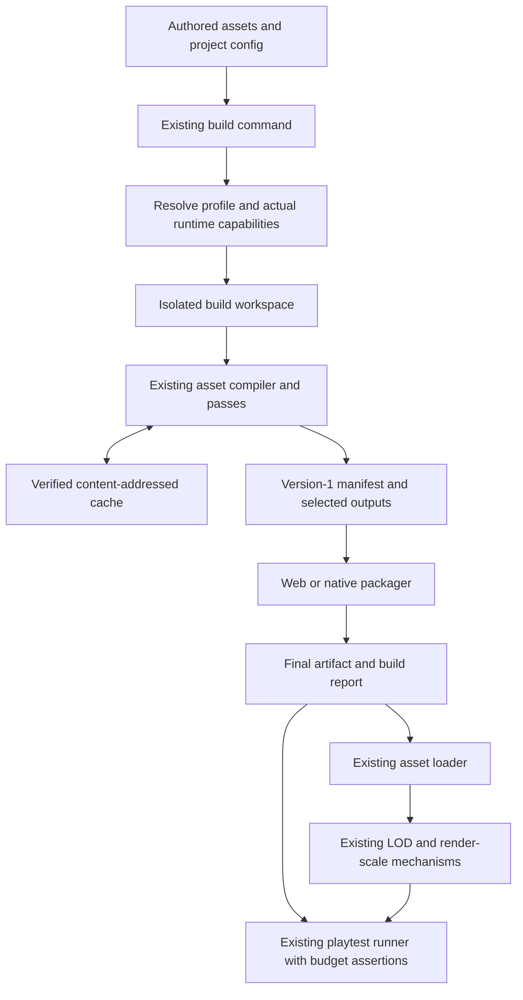
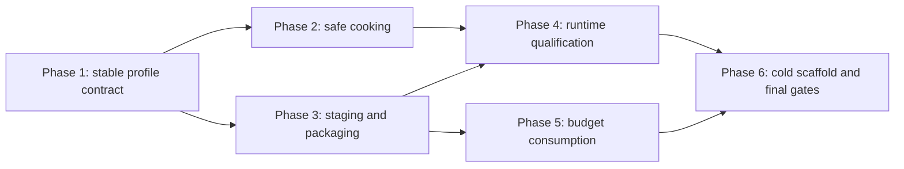

# PRD-448 — Cross-Platform Asset Cooking and Device Budgets

**Status:** PROPOSED  
**Complexity:** 9 (HIGH); risk override: none.  
**Owner:** ThreeNative maintainers; implementation owner to be assigned.  
**Depends on:** Existing `@threenative/assets`, native packaging, and playtest infrastructure. Reuse the PRD-377 discrete-LOD contract; do not reopen or duplicate that PRD.  
**Progress:** 0%; implementation not started.  
**Source snapshot:** `ThreeNativeHQ/threenative`, `main` at `af60e210aa500e504e9370b3657caaf8340f5650`, inspected September 25, 2026.  
**Authorization:** Planning-only scope. Owner explicitly authorized filing this documentation directly on `develop`; this does not authorize implementation, publishing, or deployment.  
**Filing:** `docs/PRDs/assets/PRD-448-cross-platform-asset-cooking-and-device-budgets.md` on `develop`.  
**Verification status:** Source inspection and document validation only. No game, compiler, native build, or device-performance result was executed for this proposal.

## Executive decision

Extend ThreeNative's existing pipeline rather than build a new one:

**One authored asset tree; one compiler; named, project-owned cook profiles; runtime-capability-aware output; isolated packaging; and budgets enforced through the existing build and playtest entry points.**

The game's loading code remains `ctx.assets.model("robots/spider.glb")`. A profile changes the representation packaged behind that logical path, not the gameplay API or the game's identity.

Do not introduce a second cooker, a proprietary scene format, a device-specific asset API, an engine-owned visual preset system, or new `threenative` subcommands. Do not promise that a triangle count guarantees a frame rate.

This PRD delivers the orchestration and enforcement layer. Native compressed-texture decoders, skeletal reduction, automatic HLOD/impostor generation, on-demand content delivery, and console ports are explicitly separate work—not hidden requirements of its first release.

## Context

### Problem

The desired workflow is to author a realistic asset once and produce appropriately sized browser, desktop, and mobile builds without manually maintaining separate games. A developer should be able to answer four different questions:

1. What representation will this build ship, and can its actual runtime decode it?
2. What bytes are in the finished artifact, rather than merely in the source folder?
3. What geometry, rendering work, and memory estimates does a particular scene consume?
4. Does that scene meet the project's declared limits on the device actually tested?

Those questions currently cross several working ThreeNative systems. The missing product is their consistent composition, not the existence of texture compression or LOD itself.

### What the inspected code already provides

“Present” below means observed in source, not independently benchmarked in this planning session.

| Area | Observed implementation | Consequence for this PRD |
|---|---|---|
| Asset compilation | `compileAssets()` walks the source directory, runs passes, and emits content-addressed outputs, a version-1 manifest, and producer-owned bake receipts. [S1] [S2] | Extend it; do not create a parallel compiler or runtime dependency on the receipt. |
| Asset budgets | `assets.budget` supports `uncooked` and `total`; the default uncooked ceiling is **64,000,000 bytes**, while total defaults to `"none"`. Capability-related exemptions affect uncooked accounting. [S3] | Preserve these semantics. Add final-artifact accounting rather than relabeling this as binary size or VRAM. |
| Asset health | Existing targets include material count, triangle count, and maximum texture dimension. Explicit targets can fail the build. [S2] | Reuse the existing validation and reports. |
| Texture processing | Standalone and embedded textures use KTX2/Basis; model images can be shared across assets. The standalone pass's `codec: "none"` returns original input before resizing. [S1] [S4] | Separate an explicitly requested size cap from availability of a runtime compression decoder. |
| Discrete LOD | Error-driven generation, minimum-savings checks, a runtime pixel-error budget, hysteresis, and existing `quality`, `balanced`, and `aggressive` policies. Generated levels share LOD0 vertices through alternative indices. [S5] | Reuse these policies. Fewer rendered triangles do not necessarily mean fewer resident vertices or a smaller download. |
| Virtual geometry and batching | The compiler exposes virtual-geometry processing; core contains clustered meshes/batches; asset tooling exposes atlas and material-deduplication mechanisms. [S1] [S2] [S6] | Do not duplicate these systems or combine them blindly with discrete LOD. |
| Runtime loading | The loader resolves logical paths through a version-1 manifest, wires the existing LOD plugins, and supports no-manifest source fallback. [S7] | Keep the API and version-1 contract. |
| Target-aware builds | `threenative build --target web\|desktop\|android\|ios` already invokes the compiler. Native builds pass decoder information and call packaging scripts. [S8] | Add profile selection to this path, not a new command. |
| Runtime measurement | Frame-budget records include phase timing, per-pass draws/triangles, surface resolution, and optional GPU timing. Native presentation rate is distinguished from loop rate. [S9] | Reuse measurements and preserve their meanings. |
| Test consumption | Playtest has browser/desktop/Android/iOS runners, performance assertions, and a `perf` reader. Missing observations must not pass. [S10] | Add budget consumption here, not a second profiler. |

### Concrete gaps and constraints

**Packaging-path mismatch.** `buildNative()` compiles using resolved asset configuration, but later assigns `const assets = path.join(cwd, "public")`. Merely generating a different output directory will not make the native packager consume it. The resolved asset root must be passed end to end. [S8]

**Shared build state.** Native JavaScript, configuration, and UI staging currently use shared paths under `.threenative/build/`. Asset-output isolation alone would not make concurrent profile builds safe. The complete build must either use separate workspaces or be serialized. [S8]

**Decoder capability is not a platform name.** The compiler accepts separate `ktx2` and `meshopt` capabilities. Android/iOS native hosts lack the relevant WASM decoder path, and a QuickJS desktop host can also lack it. The desktop probe has optimistic fallbacks when a custom binary is absent or unreadable. A release must not mistake “unknown” for proven support. [S1] [S3] [S8]

**Existing LOD policy is already more precise than a percentage ladder.** Preserve error-driven generation. Comments about default activation differ between the compiler interface and the LOD module; characterize the actual consumer behavior on the implementation revision rather than changing that default based on a comment. [S1] [S5]

**The framework does not own the look.** Materials, shadow recipes, lighting, post-processing, and artistic quality tiers belong in generated game source. Template `src/render/` files must not import `@threenative/*`. Build profiles in this proposal are resource/export configuration, not a genre or visual-preset system. [S11] [S12]

## Goals and scope

### Required outcomes

A normal project uses the same source tree and ordinary build command for every supported target. A project may declare named cook profiles and default selections; absent that declaration, existing behavior remains valid. The selected settings reach compilation, packaging, reports, and verification without a game implementing its own asset router.

A build ships only one selected representation for each managed logical asset. It does not accidentally include old outputs from another target, original high-resolution authoring files, or compiler dependencies. It records enough provenance to explain exactly which source/configuration/runtime capabilities produced those bytes.

Resource limits are explicit, measurable, and separately classified as warnings or errors. Runtime budgets are evaluated against a real scenario and its observation capabilities—not inferred from an asset census.

### Included in the first release

Profile resolution; deterministic compiler integration; decoder-free texture resizing when requested; target-safe existing model/audio passes; isolated build staging; selected-output packaging; final-artifact size accounting; integration of declared budgets with existing playtests; and scaffold/documentation updates.

### Deliberately not included

| Deferred capability | Why it is separate |
|---|---|
| Native Basis/KTX2, Meshopt, or Draco decoder implementation | Requires its own native integration, capability discovery, dependency-size accounting, and target execution. This PRD must work without pretending those decoders exist. |
| Native ASTC 6×6/8×8 output or a general GPU-format matrix | Current compiler formats/transcode targets do not establish that contract. An OS label alone is not enough to select a GPU format. |
| Automatic removal of LOD0 or skeletal/facial/bone reduction | Current discrete levels share source vertices; stripping and remapping require additional semantic and memory guarantees. |
| Automatic material/shader substitution or reduced lighting recipes | Artistic policy belongs to the game. |
| New HLOD, impostor, occlusion, or GPU-driven rendering systems | Independent runtime/content features; reuse existing batching and LOD mechanisms here. |
| Asset-pack downloads, CDN delivery, patching, store asset-delivery integration | This release packages local selected content. It does not implement a distribution service. |
| Arbitrary source-asset replacement by profile | Requires an explicit semantic contract for sockets, clips, collisions, and gameplay-visible node identity. Do not implement it as a filename trick. |
| Console targets, iOS device signing, physical-device performance certification | Not established by the inspected build path. iOS acceptance here is simulator packaging/consumption only. |

These exclusions do not remove validation required for the included feature. In particular, browser-only success cannot close the native packaging requirements.

## Solution

### 1. Keep three independent decisions separate

| Decision | Owner | When it is made |
|---|---|---|
| **Build target and runtime capability** | Existing build/native tooling | Before compilation and packaging |
| **Cook profile**: texture limits, declared existing LOD/model/audio options, byte budgets | Project configuration, interpreted by build tooling | Once per build |
| **Runtime selection**: active LOD and drawing-buffer resolution; game-owned visual choices | Existing runtime mechanisms and ordinary game source | During execution |

A desktop build can serve both a desktop PC and a handheld through runtime selection. A browser target can run on a phone; `web` must not be treated as synonymous with a powerful GPU. There is no manufacturer/model lookup table in this design.

Runtime settings cannot recover texture resolution or geometry that was not shipped. Conversely, retaining every high-quality asset for runtime choice can defeat the purpose of a smaller download. This release chooses one cook profile per artifact and leaves multi-profile downloadable content for later.

### 2. Extend the existing config and build command

The following **new configuration and `--profile` flag are proposed**, not available APIs in the inspected revision. Existing fields inside each `assets` overlay retain their existing meanings.

```ts
// Proposed additions to threenative.config.ts; not runnable before implementation.
buildProfiles: {
  defaults: {
    web: "standard",
    desktop: "standard",
    android: "compact",
    ios: "compact",
  },
  profiles: {
    standard: {
      assets: {
        textures: { maxSize: 2048 },
        models: { textures: { maxSize: 2048 } },
        lod: { preset: "balanced" },
      },
    },
    compact: {
      assets: {
        textures: { maxSize: 1024 },
        models: { textures: { maxSize: 1024 } },
        lod: { preset: "aggressive" },
      },
      artifactBudget: {
        packagedAssetBytes: { limit: 500_000_000, severity: "warn" },
      },
    },
  },
}
```

The numbers above are illustrative project choices, not engine defaults or platform-store limits. A game may use different names and values. New scaffolds should show a minimal editable example; they must not require an extensive configuration file before the first build works.

```sh
# Existing target vocabulary; default profile comes from project configuration.
npx threenative build --target android

# Proposed flag on the existing build command, not a new subcommand.
npx threenative build --target desktop --profile compact
```

Resolution rules:

- Explicit `--profile` wins over `buildProfiles.defaults[target]`. With neither, use the legacy asset configuration without a profile overlay.
- Resolve the base asset configuration and selected overlay once. Nested option objects merge field by field; arrays replace. `false`/`"none"` remain explicit sentinels. Do not add profile inheritance in this release.
- A whole-pass `"none"` in the base remains disabled unless the selected overlay explicitly replaces it. A whole-pass `"none"` in the overlay wins. Unknown keys, missing profile names, unsupported fields, and invalid numeric limits fail before encoding begins.
- Profile overlays may change supported resource-processing options, not source/output roots, worker concurrency, gameplay settings, credentials, or runtime capabilities. Source/output/concurrency stay in their existing top-level asset configuration.
- Runtime capabilities constrain the resolved settings last. A profile cannot turn an unavailable decoder on. Existing explicit asset codec overrides remain explicit, with actionable failure where the requested output is incompatible.
- Profile names must be safe single path segments; reject traversal and ambiguous/case-colliding output names. A build's output identity includes target and profile, not profile alone.
- The CLI must consume `--profile` itself instead of forwarding it to Vite. Configuration loading remains centralized; do not introduce ad hoc environment-variable reads in game code.

Public declaration types belong alongside existing types in `packages/core/src/config.ts`; parsing and resolution belong in `packages/create-threenative/src/config.ts`. Compiler dependencies remain Node-only. No new package is justified just for profiles.

### 3. Compile one representation, with safe capability fallbacks

Use the existing `compileAssets()` pass chain, worker pool, configuration fingerprints, and receipts. Build tooling supplies a resolved asset configuration and decoder capabilities; individual passes must not reinterpret the profile name.

**Texture dimensions and texture codec are separate decisions.** When a selected profile explicitly requests a smaller maximum edge, a target without KTX2 support must still receive an appropriately resized PNG/JPEG-compatible representation. Reuse `decodeImageBytes`, `cappedSize`, and the existing resampling machinery where correct. Implement any needed image encoder in `@threenative/assets`, never in the runtime.

A whole-pass `textures: "none"` or `models.textures: "none"` continues to mean preserve authored image bytes. A new profile does not silently defeat that escape hatch. The legacy meaning of a per-image `codec: "none"` must also remain intact; report an explicit conflict rather than quietly applying a destructive resize to an asset that requested preservation.

Color textures, normal maps, alpha-tested foliage, and linear data maps need their appropriate resampling behavior. Preserve dimensions/aspect where not capped, color-space metadata, material-slot bindings, UV sets, and alpha semantics. Never repeatedly resize an already cooked image. Standalone and embedded image handling must agree; shared images must remain deduplicated after processing.

For an unsupported source format or explicit incompatible codec, fail with the asset, target, requested transformation, and remedy. Do not produce a valid-looking manifest pointing to undecodable content. Automatic codec fallback must state the actual output format and its byte/residency implications.

**Geometry uses the existing LOD system.** Preserve the eligibility rules for skinning, morphs, animated nodes, material boundaries, and virtual geometry. Keep measured error and minimum-savings gates; record requested versus achieved reductions. Do not inject a fixed 100/50/20/5 triangle ladder.

Default profiles must not enable base-mesh simplification, remove skeleton joints, or change gameplay-visible nodes. Runtime discrete LOD can reduce submitted indices without changing the canonical mesh used for attachments or collision. A project that explicitly chooses an existing lossy `models.simplify` option is responsible for a representative collision/attachment test; a render-mesh change must not silently change the authoritative physics representation.

**Audio reuses the existing supported codecs and conditioning.** Retain Ogg Vorbis/WAVE compatibility, looping, positional downmix, and declared measurements. Do not substitute the earlier illustrative Opus suggestion for the implemented native decoder contract. [S2]

### 4. Preserve reproducibility and isolate complete builds

Use separate target/profile build workspaces under `.threenative/`, not separate hand-maintained asset trees. The exact internal directory layout is an implementation detail, but every build has its own resolved configuration, asset output, game bundle, UI bundle, and packaging input.



A content fingerprint must cover source bytes, referenced source-image bytes, effective output-changing settings, relevant tool/pass/schema versions, and decoder capability differences that change emitted bytes. A profile's name alone is not a cache key. Identical transformations may share cache entries across profiles; unrelated recipe changes must not invalidate everything.

Keep runtime-only LOD selection settings separate from expensive geometry generation. The existing compiler already carries the runtime half of LOD metadata; a policy-only change should refresh the relevant metadata without pretending a stale policy is a cache hit. Cold builds in independent directories must produce equal managed output bytes under the same pinned toolchain. Timings and host paths belong in operational report fields, not deterministic hashes.

Use an atomic publish boundary for a complete artifact. Failure must not replace the last successful artifact with a mixture of generations. An interrupted build may retain diagnostic staging, but must not advertise it as a successful output.

**Concurrency policy:** isolate files where already supported; serialize any remaining shared compiler/development output through a scoped build lock. Return an actionable busy/failure result rather than interleaving writes. Concurrent builds that would target the same final artifact must not publish over each other. Different final destinations may proceed when their actual mutable inputs are disjoint.

Do not broadly delete `public/`. Respect the compiler's owned output inventory, unmanaged public files, and the dev watcher's ownership. Cache garbage collection and a shared remote cache are out of scope.

### 5. Package the selected dependency closure

The build must thread the resolved asset root to **all** consumers: compiler, native preflight, Vite's public/static inputs, desktop/Android/iOS packagers, runtime manifest root, and reports. Fix the hard-coded native `public/` assumption rather than placing a new pipeline beside it.

For each artifact, include the union of selected manifest entries, their shared-image/lightmap/decoder dependencies, and intentional unmanaged public files. Distinguish compiler ownership from runtime dependency closure: the bake receipt is producer inventory, not a new runtime manifest or proof that every produced file is required at runtime.

Do not infer unused gameplay assets from a TypeScript import scan; assets may be loaded by logical strings or procedural selection. Existing explicit exclusions remain the safe way to omit source assets. Report unmanaged public files and their cost; do not silently delete them. A conflicting unmanaged file and generated logical destination fails with both paths named.

Authoring `.blend`/FBX sources, stale generated hashes, another profile's textures, encoder binaries, and developer debug symbols must not leak into a release simply because a directory copy found them. Intentionally retained symbols are accounted separately and never uploaded or discarded without the project's packaging policy.

Keep `assets.manifest.json` at version 1 for this release, with one selected `output` per entry. Optional provenance metadata may be additive if legacy readers ignore it safely. Do not make a new manifest version or runtime asset wrapper necessary merely to add build profiles.

### 6. Measure binary, content, and runtime cost separately

Produce a proposed **`build.report.json`** beside the final artifact and print a compact summary from the existing build command. This is a build-tool report, not a scene format, and the game must not depend on it to run.

| Reported quantity | Definition |
|---|---|
| `nativeCodeBytes` | Sum of the classified native executable and shipped native libraries for the specific OS/architecture/configuration. Mark embedded content or an inseparable container component explicitly. |
| `scriptBytes` | Shipped game JavaScript; UI JavaScript reported separately. Browser raw/gzip/Brotli sizes retain their existing labels. |
| `packagedAssetBytes` | Unique managed runtime payload files actually selected for packaging, including required auxiliaries. |
| `unmanagedPublicBytes` | Intentional unmanaged files copied into the application, visible rather than silently ignored. |
| `artifactBytes` | Actual size of the produced APK, AAB, archive, executable container, or directory payload; include artifact kind. |
| `uncompressedPayloadBytes` | Sum of file sizes in the produced application payload, not a claim about filesystem allocation or store-specific installed size. |
| `estimatedTextureBytes` | Estimate using decoded dimensions, selected/possible GPU format, mip levels, layers, and faces. State assumptions. Not a measurement of residency. |
| `geometryBytes` | Emitted or loaded buffer bytes with a clear scope. Do not infer memory savings from active triangle counts. |

AAB file size is not a device's Play download size. A universal binary's size is not the size of one architecture slice. Signed release and debug builds must not share the same baseline. Where a platform packager cannot provide a trustworthy breakdown, use `unavailable` with a reason; never fabricate zero or subtract guesses from the artifact total.

The report contains schema version, selected target/profile, runtime identity/capability provenance, source/configuration fingerprints, artifact/manifest hashes, actual measured byte totals, warnings, and separately identified estimates. Do not include absolute source paths, secrets, signing credentials, or machine-specific values in distributable provenance.

`artifactBudget` is a proposed profile field. Its supported metric names, units, and warning/error severity must be closed and validated. Existing `assets.budget` and asset health targets remain independent checks; do not silently raise the 64,000,000-byte uncooked default or reinterpret it as a mobile download budget.

### 7. Enforce runtime budgets through existing observations

Add a proposed `performanceBudget` profile field and a proposed playtest runner flag **`--build-report <path>`**. The report carries the resolved budget; the runner consumes it and adds assertions to its existing performance path. This avoids copying thresholds into several scenarios.

Bind the report to the artifact under test: verify selected manifest/bundle identity through package inspection and the actual loaded consumer path. A stale report, a different profile, or an unverified executable identity must fail before it can certify that artifact. Extend existing diagnostic/bridge payloads only as needed for this provenance; do not expose the bake receipt to gameplay.

Reuse `TN_FRAME_BUDGET`, render-pass samples, the current performance validators, and the native presentation observers. Required semantics:

- Main-view triangles, all-pass submitted triangles, skinned geometry, and stored geometry are different metrics. A shadow pass may submit the same mesh again; it must not inflate a counter labeled “unique visible geometry.”
- Draw counts refer to the documented submission layer and pass scope. They are not simultaneously a count of scene objects and low-level GPU commands.
- CPU callback duration and GPU timestamp duration are separate overlapping measurements, not quantities to add into a made-up frame total.
- Native `presentedFps` is not loop `fps`. A requested presentation-pacing percentile needs actual presentation observations; do not substitute the existing loop interval summary.
- Missing GPU queries, memory observations, or required render-pass samples produce an unavailable metric. A required hard limit without evidence fails. An advisory report may say unverified; it must not say passed.
- Do not accept a performance win obtained by rendering nothing, omitting the UI, or silently dropping below a declared minimum render resolution. Retain resolution, sample count, meaningful rendered-content assertions, and hitch counts beside timing summaries.

Use optional warnings for scene triangles/draws and validated timing limits for release scenarios. Thresholds are project/workload choices. The feature is accepted when it measures and enforces them honestly, not when an arbitrary sample game is made to hit 60 FPS.

Runtime texture-residency estimates must be labeled as estimates. Exact driver/process memory and attribution need platform observers; do not derive VRAM usage from compressed download bytes. On unified-memory hardware, do not add CPU and GPU allocations as though they were disjoint physical pools.

### 8. Keep artistic runtime scaling in the game

Reuse the already implemented LOD pixel-error policy, hysteresis, frame measurements, and automatic render-scale mechanism. Do not add a competing quality controller that oscillates against the existing scaler.

A game's shadows, materials, particles, reflection settings, and vegetation appearance remain ordinary generated source under `src/render/`. Any future settings UI passes plain values from game code; it does not require an engine enum such as `MobileHighSamsung` or imports from `@threenative/*` inside the render source.

This release exposes build provenance and measured limits, not an automatic “make this look like mobile” switch. A user forcing a quality override must still receive actual measurements and a reported reason when the requested representation is not available.

## Compatibility, safety, and failure handling

| Risk | Required behavior |
|---|---|
| Profile setting is ignored | Real CLI test asserts decoded output dimensions and packaged identity, not just a resolved config object. |
| Unknown native decoder support | Resolve a known runtime capability descriptor or use the decoder-free path where valid. An explicit incompatible request fails. Do not infer support from a failed version probe. |
| Malformed/corrupt source or cache | Name the offending asset/cache entry; invalidate and rebuild verified recoverable cache data, otherwise fail. Never publish partially validated outputs. |
| Cross-target contamination | Distinct complete workspaces or a build lock; final manifest and assets must identify the same build. |
| Path traversal or destructive cleanup | Canonicalize paths, reject unsafe profile names and symlink escapes, operate only on owned staging/output paths. |
| Source mutation | Compare source hashes before/after cold, warm, and failed builds. Authored files remain unchanged. |
| Fallback hides broken packaging | A valid manifest with a missing/corrupt selected asset must fail, not quietly succeed by fetching the source version. Preserve the documented no-manifest development fallback. |
| Cooked geometry changes gameplay | Default profiles preserve LOD0, node/clip/skeleton contracts, and authoritative collision representation. |
| Misleading size/performance improvement | Compare the same workload, target, runtime, resolution policy, and build mode; identify estimates and missing observations. |
| Report/schema drift | Version and validate the report, reject unknown required metrics, and test the public runner path with a known violation. |

Migration is additive. Existing projects without `buildProfiles`, direct `compileAssets()` users, ordinary logical-path loaders, and the no-manifest delete-test retain their contracts. The no-manifest fallback does not require release packages to carry authoring sources.

Changing render policy is not a compiler optimization. The bake delete-test compares gameplay semantics and the approved visual tolerance for the **same selected policy**; it is not a demand that an intentionally compact asset look pixel-identical to a different high-quality profile. Do not weaken the existing delete-test to make a new profile pass.

## Integration Ledger

All paths below exist in the inspected tree unless explicitly marked **new**. Implementation may split long files, but must preserve the reachable consumer named here.

| Capability | Reachable consumer/trigger | Replaces or disposition | Evidence |
|---|---|---|---|
| Profile resolution | `packages/create-threenative/src/threenative.ts` → `parseBuildArgs()` / `build()` in `src/build.ts` → `loadConfig()` in `src/config.ts` | Existing no-profile path delegates to the same resolver; no parallel CLI. | E1 / AC-1 |
| Safe target-specific assets | `buildWeb()` / `buildNative()` → `packages/assets/src/compile.ts` → existing texture/model passes | Capability-based compression filtering retained; explicit size transformation no longer depends on a supported runtime compressor. | E2 / AC-2 |
| Reproducibility | `compileAssets()` → pass configuration, shared-image store, worker pool, receipts | Keep one cache/ownership system; audit keys instead of adding a second cache. | E2 / AC-3 |
| Staging and packaging | `src/build.ts` → `packages/runtime-native/scripts/package-{desktop,android,ios}.mjs`; Vite public/static input | Replace fixed/shared build-root assumptions with the actual selected workspace. | E3 / AC-4, AC-5 |
| Artifact budgets | Existing build completion → existing asset report/budget facilities → **new** final-artifact report adapter | Asset `uncooked` budget retained; full artifact sizes become a separate layer. | E3 / AC-6 |
| Ordinary asset consumption | `ctx.assets.model/texture/audio` → `packages/core/src/assets.ts` → existing Three.js loaders and LOD plugins | Keep version-1 manifest and source fallback; no `loadMobileAsset` API. | E4 / AC-7–AC-11 |
| Runtime-budget consumption | Existing playtest CLI → **proposed** `--build-report` → current performance observations and assertions | One measured series and one resolved threshold source; no second profiler. | E5 / AC-12 |
| Cold-project discovery | Existing scaffolder → `packages/create-threenative/templates/*` and generated agent documentation | Minimal editable resource config; visual code stays game-owned. | E6 / Phase 6 |

## Acceptance Criteria

**Lane notation:** `unreachable-now/local` identifies checks intended for an implementation checkout that this planning session does not have. `shared` identifies native qualification through the repository's target lanes, not a claim those lanes have run. All evidence is pending. Native jobs belong to one qualification matrix dependency; each platform verdict remains separate. No human aesthetic sign-off is required to accept this plumbing feature.

- [ ] **AC-1 [unreachable-now/local; actor: implementation agent]:** The public `threenative build` path applies the selected cook profile to the emitted asset representation. **Evidence:** E1, pending.
- [ ] **AC-2 [unreachable-now/local; actor: implementation agent]:** A decoder-free target produces a decodable image satisfying its explicitly requested dimension cap. **Evidence:** E2, pending.
- [ ] **AC-3 [unreachable-now/local; actor: implementation agent]:** Output-changing input changes cannot reuse stale cooked output. **Evidence:** E2, pending.
- [ ] **AC-4 [unreachable-now/local; actor: implementation agent]:** Concurrent or interrupted builds cannot publish a mixed-generation artifact. **Evidence:** E3, pending.
- [ ] **AC-5 [unreachable-now/local; actor: implementation agent]:** The packaged managed payload is exactly the selected dependency closure. **Evidence:** E3, pending.
- [ ] **AC-6 [unreachable-now/local; actor: implementation agent]:** A configured hard artifact-byte limit is enforced against the produced artifact through the build command. **Evidence:** E3, pending.
- [ ] **AC-7 [unreachable-now/local; actor: implementation agent]:** The documented no-manifest source fallback continues to run the same representative game. **Evidence:** E4, pending.
- [ ] **AC-8 [unreachable-now/local; actor: implementation agent on a supported browser adapter]:** A packaged browser fixture renders the selected representation through the ordinary asset-loading API. **Evidence:** E4, pending; GPU/adapter execution not performed here.
- [ ] **AC-9 [shared; actor: native qualification runner]:** The same fixture consumes the selected packaged representation on one explicitly identified supported desktop OS/architecture. **Evidence:** E4, pending; record the actual target, not “all PCs.”
- [ ] **AC-10 [shared; actor: native qualification runner]:** The same fixture consumes the decoder-safe packaged representation on Android. **Evidence:** E4, pending; emulator proves compatibility, not thermal performance.
- [ ] **AC-11 [shared; actor: macOS/iOS qualification runner]:** The same fixture consumes the selected packaged representation in the supported iOS simulator lane. **Evidence:** E4, pending; this does not certify signed physical-device distribution.
- [ ] **AC-12 [unreachable-now/local; actor: implementation agent]:** A declared runtime-budget violation makes the real playtest invocation fail against observations from the identified artifact. **Evidence:** E5, pending.

## Execution Phases

Six phases and 24 required boxes in total: 12 acceptance boxes and 12 phase boxes. Evidence is recorded once under its owning acceptance criterion or phase box and referenced elsewhere. Do not tick any implementation box merely because this plan was written.

#### Phase 1: Resolve a profile through the real build entry point

**Status:** NOT STARTED  
**ACs:** AC-1  
**Files:** `packages/core/src/config.ts`; `packages/create-threenative/src/config.ts`; `packages/create-threenative/src/build.ts`; existing CLI/config tests; a small resolver module only if splitting is warranted.

**Implementation:** Add validated profile types and the optional build flag. Produce one immutable effective configuration. Establish overlay/escape-hatch semantics and capability provenance. Keep both existing commands and no-profile behavior. Characterize the current `assets.lod` default with a consumer test before touching it.

**Verification:** E1 — invoke the actual CLI against a fixture project with two different texture caps. Inspect emitted image dimensions/manifest output identity. Unknown profile/key/flag and conflicting preservation cases must fail clearly. A config-only unit test is insufficient.

- [ ] The compiler receives the public CLI's resolved profile configuration.
- [ ] Unknown profile selection is rejected before asset encoding.

**Checkpoint:** Pending; self-review reachability and configuration precedence. Independent review only when a reviewer is actually available.

#### Phase 2: Cook safe, reproducible target representations

**Status:** NOT STARTED  
**ACs:** AC-2, AC-3  
**Files:** `packages/assets/src/compile.ts`; `passes/texture.ts`; `passes/model-textures.ts`; `passes/shared-images.ts`; `passes/decode-image.ts`; existing texture/model/determinism tests. Reuse `lod/generate.ts` rather than replacing it.

**Implementation:** Add or separate decoder-free resizing from codec encoding. Keep authored-byte preservation explicit. Audit fingerprints for changed dimensions, source dependencies, pass versions, and decoder capabilities. Preserve semantic model content and per-image deduplication. Source hashes must remain unchanged.

**Verification:** E2 — extend existing texture, embedded-image, shared-image, and determinism fixtures. Decode actual output for 4096→1024 caps, alpha/normal/color cases, retained originals, and corrupt data. Compare cold independent directories and warm rebuilds. A changed source or maximum size must change affected output; a runtime-only LOD policy must not force unrelated image encodes.

- [ ] Decoder-free dimension caps affect the actual emitted image bytes.
- [ ] Cache reuse is validated against output-changing dependencies.

**Checkpoint:** Pending; examine source integrity, image semantics, decoder requirements, and exact reused cache identities.

#### Phase 3: Package the selected output atomically

**Status:** NOT STARTED  
**ACs:** AC-4, AC-5, AC-6  
**Files:** `packages/create-threenative/src/build.ts`; `src/compress.ts`; existing native package scripts where their input contract needs changes; `packages/assets/src/report.ts`; **new** `packages/create-threenative/src/build-report.ts` if needed; packaging/build tests.

**Implementation:** Isolate complete staging, not just textures. Pass the selected asset root to preflight and packagers. Build the dependency closure from compiler outputs and actual references. Account for unmanaged public content. Generate the final report from files actually emitted. Validate warning/error budgets and publish only complete successful artifacts.

**Verification:** E3 — package from a non-default output root with a stale alternate-profile texture present elsewhere. Inspect actual artifact entries and byte sums. Inject an encoder/packager failure, overlap conflicting builds, corrupt a cache payload, and set a byte ceiling one byte below the measured result. A safe refusal/serialization is valid for conflicting builds; silent overwrite is not.

- [ ] Packaging consumes the resolved selected asset root.
- [ ] Publication preserves the last successful artifact after a failed build.

**Checkpoint:** Pending; review filesystem ownership, cleanup boundaries, closure completeness, and byte definitions.

#### Phase 4: Prove unchanged loading on each supported runtime lane

**Status:** NOT STARTED  
**ACs:** AC-7–AC-11  
**Files:** `packages/core/src/assets.ts` only where provenance/validation requires it; existing loader tests; `packages/create-threenative/__tests__/scaffold.spec.ts`; `examples/native-smoke/playtests/` and representative fixture assets; native conformance registry only when adding a case.

**Implementation:** Load identical logical paths through `ctx.assets.model/texture/audio`. Ensure the compiled representation is used, not a source fallback masquerading as success. Preserve the existing no-manifest path in its intended development environment. Keep runtime reports honest about unsupported decoders and targets.

**Verification:** E4 — run one production-shaped scenario separately on browser, identified desktop target, Android, and iOS simulator. Assert rendered content, required clips/nodes, shared-image resolution, and selected asset provenance. Make a valid manifest's selected output unavailable and require a load failure. Run the existing bake delete-test in its supported environment.

- [ ] The consumer scenario identifies the representation actually loaded.
- [ ] Removing a manifest-selected asset produces a visible failure rather than a hidden source fallback.

**Checkpoint:** Pending. Native ACs remain open until their own evidence arrives; browser success does not stand in for them.

#### Phase 5: Consume budgets through existing playtests

**Status:** NOT STARTED  
**ACs:** AC-12  
**Files:** Existing `packages/playtest/src/runner/` CLI and performance schema/validator modules, located before editing; `packages/core/src/frame-budget.ts` or existing bridge serialization only for an identified observation gap; **new** report-reader module if needed; existing invalid/vacuous-assertion tests.

**Implementation:** Add `--build-report` to the playtest runner, validate report/artifact identity, and translate the declared budget into existing assertions. Keep warning and hard-limit outcomes separate. Preserve sample counts, native presentation distinctions, resolution policy, and absent-observation failures.

**Verification:** E5 — run the real runner against the identified built fixture. Use a known draw/timing violation, a stale report, a misspelled metric, and a missing required observation. Each must produce a non-passing result for its own reason. A constant mock counter or a standalone budget-comparison helper cannot prove this feature.

- [ ] The public playtest invocation consumes the build's resolved budget.
- [ ] Missing required observations cannot satisfy a hard performance limit.

**Checkpoint:** Pending; review measurement meanings and false-pass risks, especially loop FPS and reduced resolution.

#### Phase 6: Ship the discoverable, backward-compatible workflow

**Status:** NOT STARTED  
**ACs:** Reconcile evidence for AC-1–AC-12; no new duplicate acceptance set.  
**Files:** `packages/create-threenative/templates/*/threenative.config.ts` and generated agent references; `packages/assets/README.md`; appropriate package/architecture docs; capability annotations/generated manifests only for actual new public surfaces; this PRD.

**Implementation:** Make the minimal example visible in a cold scaffold. Document profile selection, current native decoder limits, actual byte definitions, and the separation from game-owned appearance. Preserve the source fallback, no-profile workflow, current command vocabulary, and Node/runtime dependency boundary. All existing callers delegate to one implementation path.

**Verification:** E6 — build and consume a packed-tarball scaffold, not workspace-only imports. Inspect runtime bundles for encoder/compiler dependency leakage. Run required repository gates once for the combined candidate; reuse current valid earlier evidence rather than rerunning equivalent tests for ceremony.

- [ ] A cold scaffold exposes the working profile workflow without custom asset routing.
- [ ] Runtime packages remain free of build-time encoder dependencies.

**Checkpoint:** Pending. Update phase/AC evidence in place. Once implementation is authorized, follow the repository's one-draft-PR-per-PRD workflow against `develop`. Move to `done/` only after every required lane and acceptance claim is verified.

## Verification plan and workload

### Representative fixture

Extend existing scaffold/native-smoke fixtures instead of creating a new harness. The fixture should contain a detailed multi-material static asset, repeated shared textures, 4K color/normal/alpha images, a skinned character with clips and attachment nodes, one audio loop, an explicitly stable collision representation, and intentionally unmanaged public UI content. Use redistributable or generated assets with known provenance.

The scenario must render an actual scene, move the camera across a discrete-LOD transition, animate the character, and resolve shared images from the final packaged paths. This is not satisfied by a triangle with no textures or an empty GLB. Final implementation evidence must record fixture content hashes and which hard requirements the fixture exercises.

For package optimization, compare source-identical cold and warm builds with the same compiler/runtime versions. For runtime measurements, fix the camera path, scene population, random seed, settings, target, adapter, build mode, and measurement window. Include hitches and resolution-floor observations rather than removing inconvenient frames.

Physical mobile testing is required before advertising sustained battery/thermal/FPS targets for a game. It is not needed to pretend that the resource-orchestration feature has an absolute FPS guarantee. Simulator/emulator evidence is explicitly limited to the compatibility properties it exercises.

### Existing commands to reuse

These command names were observed in repository instructions. They are **future verification commands**, not results from this task. Proposed tests/scenarios must be created and registered before referencing them as executed.

```sh
pnpm typecheck && pnpm lint && pnpm test
pnpm budgets
pnpm test:templates
pnpm bake:delete-test --template starter
pnpm prd:progress <filed-prd-path>

pnpm --filter @threenative/playtest build
node packages/playtest/dist/runner/cli.js <scenario>.playtest.json \
  --url http://127.0.0.1:5173 \
  --server-command "<fixture dev command>" \
  --browser-recipe webgpu
```

The existing playtest target vocabulary is `browser|desktop|android|ios`, while the build vocabulary uses `web` rather than `browser`. Native runner arguments must follow the actual target runner; do not invent a command by substituting one word in a browser invocation. Desktop needs an executable, Android a reachable emulator/device, and iOS an appropriate Apple lane. [S10]

Relevant existing unit fixtures include `packages/assets/__tests__/compile.spec.ts`, `budget.spec.ts`, `texture-pass.spec.ts`, `model-texture-pass.spec.ts`, `shared-images.spec.ts`, `lod-generation.spec.ts`, `determinism.spec.ts`, and `bake-receipt.spec.ts`. Extend the smallest existing fixture that catches each distinct risk.

The native matrix in `.github/workflows/native-platforms.yml` is the shared qualification dependency. [S13] At implementation time, use the repository's current selected/full CI rules and record exact job/run IDs. Required jobs that were skipped, cancelled, or never reached assertions do not count as passes. This proposal does not claim that every OS/architecture has been qualified.

### Execution dependency graph



Phases 2 and 3 can progress in parallel after their interfaces stabilize, but shared `build.ts`/compiler changes must have one owner or isolated branches. Start native qualification once the combined inputs are ready. Do not run competing GPU captures or mutate one fixture output directory concurrently.

## Budget policy for projects using this feature

The earlier platform numbers in the conversation are starting hypotheses, not measured ThreeNative limits. Do not hard-code them as framework release gates.

A useful project budget identifies the **target device class, runtime, build mode, render resolution, scenario, sampling window, and metric definition**. File-level limits catch oversized content before packaging; scene-level limits catch expensive combinations; measured frame budgets determine whether the actual workload runs well.

For an initial realistic-game experiment, the following are reasonable **proposed warning thresholds to validate**, not supported-device certifications:

| Cook/runtime experiment | Main-view submitted triangles | All-pass draw submissions | Planning frame interval |
|---|---:|---:|---:|
| Compact mobile, 30 FPS experiment | 0.5–1.0 million | 300–500 | 33.33 ms |
| Handheld, 40 FPS experiment | 1–3 million | 500–1,000 | 25.00 ms |
| Desktop baseline, 60 FPS experiment | 3–6 million | 800–1,500 | 16.67 ms |

The draw and triangle columns have different scopes by design. Record shadow work separately. Do not sum CPU and GPU timing columns, or compare these values across different resolutions/shader costs as though they were equivalent workloads.

For size, start by measuring a **minimal empty project** and a **representative content build** on each target. Track native code, script, and assets separately. Prefer regression warnings against a pinned baseline until a real product/distribution requirement establishes a hard cap. A smaller artifact is not an improvement when it omits a required decoder, UI, or texture.

## Risks and decisions retained for implementation

| Decision | Resolution in this proposal |
|---|---|
| One codebase or one pipeline per device? | One pipeline, target capabilities, and optional project-owned profiles. |
| Rewrite the compiler? | No. Extend the current compiler/manifest/receipt chain. |
| Introduce engine-wide visual quality presets? | No. Reuse existing resource mechanisms; game-owned render source decides appearance. |
| Automatically produce native ASTC now? | No. Use supported output or fail; native decoder work is separate. |
| Strip all high LODs from mobile immediately? | No automatic stripping. First report real byte and buffer costs; preserve current index-sharing/LOD0 contracts. |
| Promise 60 FPS from a triangle budget? | No. Only qualified scenario measurements support that claim. |
| Add a new `cook` command? | No. Extend `build`; extend playtest consumption where needed. |
| Ship all profiles in one release? | No. One selected representation per logical asset in this release. |
| Require a custom game loader? | No. Existing `ctx.assets` calls remain the integration point. |
| Treat a unavailable native lane as optional? | No. Its required acceptance criterion remains open. |

Complexity scoring: 11+ expected implementation files (3), new profile/report orchestration (2), atomic/concurrent build state (2), and native artifact build/qualification boundaries (2). Tests, documentation, and this PRD are excluded from the file score. Reassess only if implementation scope materially changes.

## Source references

All repository links below are pinned to the inspected commit. Implementation should refresh them against `develop` before making changes; a source comment or an old PRD completion claim is not fresh execution evidence.

[S1]: https://github.com/ThreeNativeHQ/threenative/blob/af60e210aa500e504e9370b3657caaf8340f5650/packages/assets/src/compile.ts
[S2]: https://github.com/ThreeNativeHQ/threenative/blob/af60e210aa500e504e9370b3657caaf8340f5650/packages/assets/src/index.ts
[S3]: https://github.com/ThreeNativeHQ/threenative/blob/af60e210aa500e504e9370b3657caaf8340f5650/packages/assets/src/budget.ts
[S4]: https://github.com/ThreeNativeHQ/threenative/blob/af60e210aa500e504e9370b3657caaf8340f5650/packages/assets/src/passes/texture.ts
[S5]: https://github.com/ThreeNativeHQ/threenative/blob/af60e210aa500e504e9370b3657caaf8340f5650/packages/assets/src/lod/generate.ts
[S6]: https://github.com/ThreeNativeHQ/threenative/tree/af60e210aa500e504e9370b3657caaf8340f5650/packages/core/src
[S7]: https://github.com/ThreeNativeHQ/threenative/blob/af60e210aa500e504e9370b3657caaf8340f5650/packages/core/src/assets.ts
[S8]: https://github.com/ThreeNativeHQ/threenative/blob/af60e210aa500e504e9370b3657caaf8340f5650/packages/create-threenative/src/build.ts
[S9]: https://github.com/ThreeNativeHQ/threenative/blob/af60e210aa500e504e9370b3657caaf8340f5650/packages/core/src/frame-budget.ts
[S10]: https://github.com/ThreeNativeHQ/threenative/blob/af60e210aa500e504e9370b3657caaf8340f5650/packages/playtest/AGENTS.md
[S11]: https://github.com/ThreeNativeHQ/threenative/blob/af60e210aa500e504e9370b3657caaf8340f5650/docs/architecture/CHARTER.md
[S12]: https://github.com/ThreeNativeHQ/threenative/blob/af60e210aa500e504e9370b3657caaf8340f5650/packages/create-threenative/AGENTS.md
[S13]: https://github.com/ThreeNativeHQ/threenative/blob/af60e210aa500e504e9370b3657caaf8340f5650/.github/workflows/native-platforms.yml

Additional inspected contracts: `AGENTS.md`, `docs/PRDs/AGENTS.md`, `.claude/skills/prd-lifecycle/SKILL.md`, `packages/core/AGENTS.md`, `packages/create-threenative/src/config.ts`, `packages/assets/README.md`, and `scripts/prd-progress.ts`. Planning format follows the user's Library `SKILL(7).md`, whose declared skill name is `prd-creator`.

## Planning verification record

This document was checked for required headers, repository-compatible phase headings, acceptance/phase checkbox counts, unresolved source-reference labels, and accidentally ticked implementation boxes. These are document checks only. Repository `pnpm` gates, image-output checks, release packaging, playtests, and native-device qualification remain unrun. No implementation acceptance criterion is claimed as completed.

The repository `scripts/prd-progress.ts` was reproduced locally and its Git blob hash verified as `f3ec0a737a5b3bcfa06952a48b523ae56f7fd119` before execution with Node 22.16.0 type stripping. Result: **0/6 phases complete, 0/12 phase boxes ticked, 0/12 acceptance boxes ticked, `prd:0%`**; exit 0. A separate document-structure check confirmed 24 unchecked boxes, 13 defined source-reference labels, and balanced fenced blocks. This validates planning structure, not implementation.