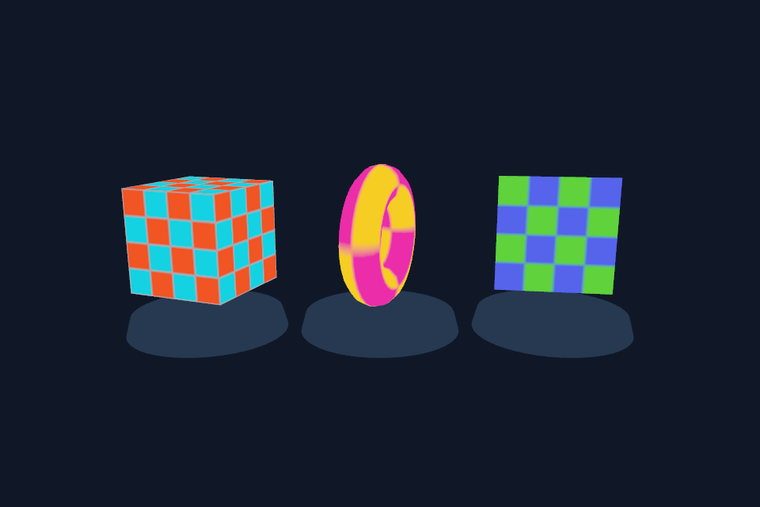

# PRD-VQ-01 — Native asset compatibility follows the selected runtime and actual decoders

**Status:** PARTIAL — 2026-10-02. Bounded desktop/unknown-runtime fail-closed repair implemented and packaged Linux QuickJS fallback rendered on the hosted lane; mobile selected-artifact resolution and compressed-decoder qualification remain open.
**Batch:** [Visual quality execution batch](https://github.com/ThreeNativeHQ/threenative/blob/d9ac5b4e97f6b1383bd163d91619cffa7c6c0ef5/docs/PRDs/batch-2026-10-01-visual-quality/README.md). **Wave:** 0 / correctness.
**Dependencies:** None. This is a build/runtime contract repair, not permission to remove compatibility guards.

## Grounding and intended outcome

[packages/create-threenative/src/build.ts](https://github.com/ThreeNativeHQ/threenative/blob/d72778382b134ef8763f58825cb4d4fd8cc0f6e3/packages/create-threenative/src/build.ts) still rejects compressed assets by mobile target in `assertNativeAssetsCompatible`, while the runtime documentation identifies Android V8 as the default. The source establishes inconsistent capability selection; it does not prove that shipping V8 alone makes the Basis, Meshopt or Draco loading paths work. Workers, bundling, file access, decoder payloads and GPU formats are separate requirements.

**Outcome:** A packaged game either decodes its declared assets on its selected runtime or is refused before publication with an accurate codec-specific reason. Android V8 and QuickJS must not be conflated; desktop QuickJS must not bypass checks simply because it is desktop.

## Design and ownership

Resolve one runtime capability record from the exact selected artifact/cohort before cooking. Thread it through asset cooking, the compatibility guard, native bundling and the runtime loader. Record engine, WASM support, packaged decoder versions and supported texture formats independently. An unknown capability takes an explicit decoder-free path or fails; it is never inferred from the build machine or from a desktop executable used to package Android. Keep QuickJS rollback supported. Do not silently change an authored asset or trust a manifest that disagrees with the packaged bytes.

Reuse `runtimeHasWebAssembly`, `assertNativeAssetsCompatible`, asset compiler decoder options and `packages/runtime-native/scripts/bundle.mjs`. Extend the artifact capability contract only where necessary. No new renderer, codec implementation, or blanket Android whitelist. Preserve current WebGL and decoder-free fallbacks.

## Required behavior

- A table-driven suite covers web, desktop V8, desktop QuickJS, Android V8, Android QuickJS and unknown artifacts, with each codec independently allowed or refused.
- The loader validates actual KTX2 block formats and fallback transcodes. Mesh compression is separately tested; smaller download bytes are not reported as smaller GPU vertex buffers.
- Cook-cache keys include decoder capabilities and cohort identity. Switching engine or codec cannot reuse incompatible output.
- Diagnostics identify the asset, codec, selected artifact and missing capability. Build failure must leave the previous packaged artifact intact.

## Execution phases

The unit proof paths and the desktop fallback scenario now exist. Browser and Android execution remain unrun; the existence of the shared scenario is not passing runtime proof. Reuse an existing equivalent test or scenario after inspecting current code, and update the canonical proof path rather than adding a duplicate. Follow EXECUTE.md for fixture setup, variables, review and repository gates.

### Phase 1 — One capability decision

- [x] Implement capability resolution from the selected artifact, including unknown-artifact handling and the full target/engine table. proof: `pnpm exec vitest run packages/create-threenative/__tests__/vq-native-asset-capabilities.spec.ts`.
  Verified 2026-10-03 at `c29a21031` (merge of `origin/develop` into this branch): `pnpm exec vitest run packages/create-threenative/__tests__/vq-native-asset-capabilities.spec.ts` passed 19/19, exit 0.
  Partial: desktop resolves the packager's actual binary before cooking and hashes its bytes. Failed, absent, unknown and non-V8 probes take the decoder-free path. Android/iOS never probe the desktop packaging executable; their exact artifact/cohort resolution remains open.
- [x] Wire the same capability record into cooking and compatibility validation; preserve decoder-free rollback. proof: `pnpm exec vitest run packages/create-threenative/__tests__/vq-native-asset-capabilities.spec.ts`.
  Verified 2026-10-03 at `c29a21031`: same command passed 19/19, exit 0.

  Partial: the record governs cooking, compatibility guards, and the desktop native-backend bundle path; embedded/shared KTX2 and Meshopt/Draco declarations are refused when unavailable. The existing desktop V8 path is preserved, not newly qualified.

### Phase 2 — The packaged bytes are authoritative

- [x] Make bundling and loading retain exactly the declared decoders and invalidate stale cook-cache entries. proof: `pnpm exec vitest run packages/create-threenative/__tests__/vq-native-asset-capabilities.spec.ts`.
  Verified 2026-10-03 at `c29a21031`: `pnpm exec vitest run packages/create-threenative/__tests__/vq-native-asset-capabilities.spec.ts` passed 19/19, exit 0.
  Partial: cook keys include explicit decoder capabilities and selected desktop runtime SHA-256; QuickJS/unknown desktop bundles use the existing refusing stubs. Decoder versions, KTX2 block-format validation and manifest-versus-payload verification remain open.
- [x] Create separate tiny textured/animated fixtures for KTX2, Meshopt and Draco; assert decoded texture content and geometry rather than only a successful import. proof: `pnpm exec vitest run packages/create-threenative/__tests__/vq-native-asset-capabilities.spec.ts packages/create-threenative/__tests__/vq-native-fixture.spec.ts`.
  Verified 2026-10-03 at `c29a21031`: `pnpm exec vitest run packages/create-threenative/__tests__/vq-native-asset-capabilities.spec.ts packages/create-threenative/__tests__/vq-native-fixture.spec.ts` passed 21/21 (19 + 2), exit 0.
  Partial: generated Meshopt and Draco textured/animated inputs are compared against decoder-free cooked files for exact decoded positions, triangle counts, animation samples and texture pixels. Authored KTX2 is encoded by the existing texture pass and explicitly refused; no packaged KTX2 decode is claimed.

### Phase 3 — Qualify the visible result

- [ ] The unchanged web fixture renders each codec correctly, with named adapter and no loader/GPU diagnostics. proof: `node packages/playtest/dist/runner/cli.js examples/abyss-framework/playtests/vq-native-asset-capabilities.playtest.json --url ${VQ_URL:?} --browser-recipe webgpu`.
- [ ] The packaged Android V8 fixture decodes the admitted codecs on an emulator; unsupported codecs remain explicitly refused and the QuickJS decoder-free fixture still runs. proof: `node packages/playtest/dist/runner/cli.js examples/abyss-framework/playtests/vq-native-asset-capabilities.playtest.json --target android --device ${VQ_ANDROID_DEVICE:?}`.

## Acceptance criteria

- [ ] All admitted codecs are demonstrated through the packaged loader, not merely through WASM availability; all refused combinations retain actionable build errors. proof: the completed Phase 3 scenario outputs, with the named fixture, package/cohort and adapter recorded inline here.
- [ ] The feature preserves its documented inactive/fallback path and releases owned resources after repeated lifecycle transitions. proof: `pnpm exec vitest run packages/create-threenative/__tests__/vq-native-asset-capabilities.spec.ts` plus the Phase 3 lifecycle scenario.

## Performance and promotion

Record encoded bytes, decoded texture/geometry bytes and peak load memory per codec. Enabling a path requires correct pixels and bounded lifetime, not a promised compression ratio. Numerical targets are proposed acceptance targets, not benchmark results. Pin the fixture, metrics and thresholds before changing the implementation; never relax a failing threshold just to mark this PRD complete. Shared abstractions must pass the repository's reuse/LOC admission rule. Appearance remains editable source.

## Blocked on

Physical Android performance and thermals require a named phone and are separate from emulator correctness. Missing codec qualifications must remain individual exclusions.

This local executor has no GPU device, Android SDK/adb or KVM, and Xvfb is unavailable. The hosted Linux ARM64 lane now provides real packaged QuickJS fallback pixels below. Browser and Android decoder correctness remain unrun. The owner's per-PR screenshot requirement is satisfied for this bounded fallback; the PR remains draft because full PRD acceptance and remaining platform gates are open.

## Completion record

Update the phase boxes and this PRD only after the named proof runs. Record actual results inline, including any remaining exclusions. A merged planning or implementation PR alone is not proof that every acceptance criterion passed. Archive according to the parent PRD filing rules when the work is genuinely complete.

### Bounded implementation verification — 2026-10-02

- Mandatory capability MCP search/detail reused `compileAssets`, `resolveBasisTranscoder` and the existing portable loader; no new codec or renderer was added.
- Red/green: 9 failures first demonstrated fail-open unknown engines and desktop codec bypass; 3 more demonstrated stale cache identity and QuickJS decoder inclusion. The final focused rerun passed 40/40 across capability/cache, native-KTX2 and report suites. A separate report regression failed on the false `no WebAssembly` claim and passed after diagnostics named missing qualified decoders (12/12 report tests).
- `pnpm exec vitest run packages/create-threenative/__tests__/build.spec.ts`: 29/29 passed in the combined nearest-lane run. `native-consumer.spec.ts` live caller checks pass 3/3, including exact resolved binary forwarding and preservation of the previous packaged artifact after an authored KTX2 refusal. The template-native and consumer CLI suites pass 16/16 after their packager fixtures follow the new early resolver contract.
- `pnpm --filter @threenative/assets build` and `pnpm --filter create-threenative build`: passed including declaration output and publint. Scoped create-threenative and assets TypeScript checks passed. Root lint passed with warnings; agent mirrors regenerated.
- Aggregate qualification is **not green**: root `pnpm test` stops before tests at tsx IPC `listen EPERM`; root `pnpm typecheck` was killed with exit 137. The broader native consumer lane has two unavailable-`jar` failures, separately reproduced using its unchanged baseline test source. Full build, GPU/native scenarios, decoder memory/lifecycle measurements and actual packaged-loader codec pixels remain unverified.
- All phase and acceptance boxes intentionally remain open. No full Phase 1, Phase 2, native decoder admission, visual result or PRD completion is claimed by this patch.

### Native screenshot qualification lane — 2026-10-02 (qualification in progress)

- `examples/abyss-framework/vq-assets/` is a separate opt-in fixture; the ordinary example is unchanged. It loads two actual cooked GLBs and a PNG through `ctx.assets`, then advances their authored clips with `AnimationPlayer`. The checker colours belong to those assets, not to a drawn diagnostic overlay.
- `node --import tsx scripts/verify-native-asset-capabilities.ts` requires a real QuickJS executable in `THREENATIVE_RUNTIME_BINARY`, builds through the actual desktop resolver/cook/bundle/packager, verifies decoded payload equality, the exact runtime prefix in the packaged executable and the published build-report digest, then proves an authored KTX2 refusal preserves that same package. `runDesktopPlaytest` drives the resulting executable and captures its framebuffer with the existing mailbox transport.
- The `native-assets` lane in `.github/workflows/integration.yml` — the per-feature workflow this PRD first added, folded into the one integration workflow root AGENTS.md now requires — uses the existing Linux ARM64 QuickJS/wgpu source-build lane, checksum-locked native provisioner and normal read-only `pull_request` permissions. Hosted software rasterization is explicitly declared; no hardware-performance claim is permitted. No credentials, guard exemptions or runtime defaults change.
- Local checks: 25/25 focused capability/real-fixture/capture-validator tests passed; fixture and focused verifier TypeScript checks passed; assets and CLI packages rebuilt with declarations/publint. The actual QuickJS fixture bundle was built and contains no `WebAssembly` reference. The scenario validates and workflow YAML parses; CI structure/needs checks pass 141/141. The local native verifier refuses at the explicit missing-runtime requirement before any runtime claim.
- Capture acceptance is fail-closed: native `device.screenshot` provenance, nonempty passed live assertions, named WebGPU adapter, no lost-device/errors, exact 960×640 framebuffer, and both authored checker colours in opaque pixels in each of the three specimen regions. The transparent-RGB negative test failed before the alpha guard and passes with it. A lifecycle test confirms the fixture's owned sRGB texture clone and cached original are each disposed once, including a repeated exit. Published PNGs must be original runner bytes with matching SHA-256 and source/run provenance.
- No new screenshot or hosted-run PASS is claimed in this commit. Full mobile/cohort, packaged-decoder and lifecycle acceptance stays open.

Hosted attempt [36995485869](https://github.com/ThreeNativeHQ/threenative/actions/runs/36995485869), source `8d6cd881ac54b206d82e0ba00167b0e277edb402`, built the actual ARM64 QuickJS/wgpu runtime and packaged the fixture. Exact selected-runtime prefix, decoded payload comparisons and authored-KTX2 refusal/package-preservation checks passed. The native bridge answered ready, but correctly refused the scenario's unavailable `runtime.diagnostics` observer before capturing any frame; no screenshot exists from this attempt. The native-only scenario now records that limitation and instead keeps readiness/no-console-error assertions plus mandatory complete host-console checks for native GPU validation, device loss, JavaScript and loader errors. Five regression cases failed before this observer-contract repair; error-labelled and misleadingly log-labelled failures remain fatal. Runtime engine guards are unchanged.

Hosted attempt [36996645116](https://github.com/ThreeNativeHQ/threenative/actions/runs/36996645116), source `cedacefcab3360d5cc344ef071649f57782ac9b5`, reconfirmed build/package/payload checks but exposed the full admission rule: the **entire diagnostics assertion family is web-only**, independently of its individual booleans. No pixels were captured. A regression now replays the real native handshake through `connectPlaytestBridgeTransport`, not only its capability-name calculator; it failed with the exact hosted observation error, then passed after the scenario was limited to supported startup/resources families. Native console cleanliness and ready/compile-settled checks are mandatory in the verifier instead, with missing readiness, empty console evidence, GPU loss, validation and JavaScript errors all tested to fail. The complete focused set passes 34/34 and verifier types pass. No engine target-admission guard changed.

### Actual packaged native screenshot — 2026-10-02

[Hosted run 36998104447](https://github.com/ThreeNativeHQ/threenative/actions/runs/36998104447) **passed**, executing source `46a759ad885cede29e0fbb2c719ed75151c5baec` on `ubuntu-24.04-arm`. The selected runtime is QuickJS/wgpu, runtime SHA-256 `da16138cc37938a14ce6831476aa58972a0d469ba2172b6a06faf6d1d56c6042`; the packaged game SHA-256 is `e20910ccaf495d5455bcba4fa74299fb6f7dd86718e0802488dbb6970cab883d`.

The original 960×640 native `device.screenshot` was downloaded, ZIP/image digests verified, and visually inspected. The Meshopt-source cube, Draco-source torus and PNG panel all visibly carry their authored textures after decoder-free cooking. Eight live assertions pass, including both loaded/textured models, decoded vertex presence, advancing frames/pose, and actual startup milestones. Native readiness is `ready` with settled compilation; strict host-console checks pass and the report contains no diagnostics. The named adapter is Mesa llvmpipe (LLVM 20.1.2, 128 bits), so this is rendered correctness on a hosted software adapter, not hardware-performance evidence. Authored KTX2 remains refused before publication, preserving the already packaged executable byte-for-byte.

[Provenance and scope](../../verification/vq01/README.md), [machine-readable provenance](../../verification/vq01/provenance.json), and [unchanged runner summary](../../verification/vq01/quickjs-native-summary.json). The PNG SHA-256 is `1ad43cda8e816431b0ab9993066b087c9283351f304ade2c1765eebf8e349c81`. This verifies the bounded desktop QuickJS fallback and screenshot request. It does not tick the unchanged web, Android, actual compressed-decoder or full lifecycle acceptance boxes.
