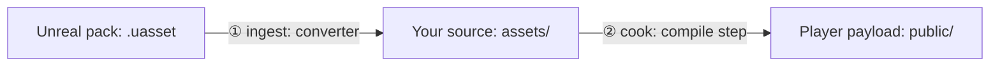

# docs/PRDs/assets

The asset flow: how bytes get **into** a game (ingest) and how they get **to a player** (cook).
Read `/AGENTS.md` and `docs/PRDs/AGENTS.md` first.

## The one distinction these PRDs turn on



`.uasset`→`.glb` conversion and direct `.uasset` loading answer ①. Compression, dedupe and mips are
②. **Every shipped byte is decided in ②.** Confusing the two is what produced a 289 MB scene.

## Order of execution

| PRD | Wins | Depends on |
|---|---|---|
| **[349 — the cook is on by default](../done/PRD-349-the-cook-is-on-by-default.md)** | DONE: Wildwood 304.92 → 51.33 MB, Quarry 29.89 → 4.57 MB; iOS waived | — |
| **[350 — the platform gate knows which passes need a decoder](./PRD-350-the-platform-gate-knows-which-passes-need-a-decoder.md)** | **PARTIAL:** Android cooked run and Wildwood 92.04 MB runtime load-set pass; raw/cooked identity, web/desktop byte identity and negative-control observations remain `UNVERIFIED` | 349 |
| **351 — compression never looks worse than a floor** | quality floor + the 2048² resolution raise | 349 |
| **352 — Unreal ingest is first-party** | **zero shipped bytes** — removes an external repo from the ingest path | none |

**Execute 350 next.** 349 is delivered; 351 can proceed independently of 350, and 352 remains an
independent ingest change. Read each PRD's preflight before implementation.

## Delivered baseline for execution

The final record is [PRD-349's evidence](../../verification/PRD-349-the-cook.md), especially
“Merged-source final gates and distribution”. Executable source: `af8fe783`; final game pins:
`ThreeNativeHQ/examples` commit `1bc083d8`. Re-measure if either source or package pins change.

| Subject / measurement | Delivered result |
| --- | --- |
| Wildwood runtime load set, including HDR and Basis | **304,915,228 → 51,333,420 B**, zero resized textures; complete game test passed |
| Wildwood full manifest including Basis | **297,738,622 B**; different scope from the runtime load set |
| Quarry web and native desktop asset payload including Basis | **4,569,038 B**; real scenarios passed **8/8 per target** |
| Quarry mobile authored payload after source decoding | **30,346,112 B**, six files; Android APK built, no cook savings |
| Native proof limits | No mobile device executed in 349; local iOS packaging waived. Hosted iOS simulator CI later passed, which does not prove the proposed mobile dedupe path |

Quarry's six source GLBs were decoded losslessly out of Meshopt during 349. Keep them as the
decoder-free control; use a separate compressed-input fixture in 350. The accepted 51.33 MB
Wildwood result supersedes the 35–45 MB projection. Asset payload, full manifest, APK size, GPU
residency and network transfer are separate measurements and must never share a baseline.

## Measured evidence, once, so no PRD re-derives it

Historical spike only, from `sandbox/wildwood` at `d535f51`, 2026-09-04. These numbers explain the
original proposal; the delivered baseline above governs execution. Full record:
`docs/verification/PRD-349-assumption-spike.md`.

| | |
|---|---|
| wildwood load set, one scene | **289 MB** |
| — embedded PNG in 56 flora GLBs | 259 MB |
| — of which distinct (39 images, 33.3 MP) | 52.7 MB |
| — pure duplication | **206 MB** |
| — geometry + animation, all 56 models | **5.7 MB (0.5-3.4% of each file)** |
| the same 56 meshes + 51 textures as uncooked `.uasset` | **754 MB** |
| **spike: 6 real pines through the cook** | **55.2 MB → 4.97 MB (−90.6%)**, SSIM 0.969-0.990, 0 resized |

## Findings that changed a plan

- **Explicit `needSupercompression:true` gains 0.0% over omission.** Execution found why:
  `ktx2-encoder@0.6.0` already defaults it to true. Both spike arms used Zstd; the result does
  not show that Zstd needs RDO. The phase stays cut and the existing default is preserved.
- **`chooseCodec` picks `uastc` for everything** in this pack — the diffuse maps carry cutout alpha,
  so ETC1S never fires. Remaining headroom is RDO, which is why 351 exists.
- **349 removed the template cook opt-outs.** Mobile still drops the whole model/texture pass in
  `compile.ts`; splitting decoder-free work from runtime compression remains 350's job.
- **349 replaced the npm encoder with the owned Basis wrapper** in
  `packages/assets/src/ktx2-encoder.ts`, supporting 4096² input with default Zstd preserved.
  351 must reproduce RDO behaviour against this implementation and invalidate its cache keys.
- **`quantize` needs no decoder** — `runtime-native/scripts/bundle.mjs` stubs only Basis, Meshopt
  and Draco.
- **`raw-unreal` read 61/62 meshes** in the historical pack; 58/58 vertex and section counts
  matched the external importer. Full attribute/transform equivalence remains 352's proof gate.
- **Uncooked `.uasset` textures are `TSF_BGRA8`, PNG-wrapped** — so a first-party texture reader is
  small, not the bulk of 352.

## Decisions taken, so they are not relitigated

| Decision | Where | Why |
|---|---|---|
| the `.uasset`→`.glb` converter stays | 349 §1 | geometry is 0.5-3.4% of the bytes; no ingest path touches the other 97% |
| `assets.budget` gates **uncooked** bytes (default 64 MB), not total | 349 §3 | games differ by 100×; the defect is "large **and** uncooked", and an absolute cap cannot express that |
| Compare import caps 1024 / 2048 / 4096; per-slot caps remain explicit | 351 §2B | importer `maxTextureSize` and compiler `maxSize` are different controls; byte and visual results decide the game-owned policy |
| Initial quality floor **SSIM ≥ 0.95, ΔE00 ≤ 3.0** | 351 §2A | validate both metrics on the final encoder and corpus; four SSIM samples do not establish a whole-game quality guarantee |
| RDO ships behind the floor, one-day timebox on its crash | 351 Phase 2 | the floor and the escalation are the architecture; RDO is one rung on it |
| skeletal goes to `ueformat`, not `raw-unreal` | 352 §4 | `ueformat` already reads skin weights and morphs; `raw-unreal` throws on skeletal by design |
| the external importer is **kept**, not deprecated | 352 §4 | it owns cooked/IoStore packs, which `raw-unreal` explicitly refuses — disjoint scopes, not duplication |
| the material library stays per-pack **data** | 352 §4 | charter rule 2: it decides how things look, so a game owns it; the engine owns only the slot←parameter mechanism |

## Still open, and owned

| Question | Owner |
|---|---|
| a browser rendering a cooked GLB end to end — never yet done | 349 Phase 4 (`quarry`), and it must be a real render, not a structural assertion |
| whether wildwood can build for Android *at all* today | ANSWERED by 350 Phase 1: Android build passes; runtime load-set is 92.04 MB |
| Master-source availability, quality metrics and RDO on the owned encoder | 351 preflight; do not infer these from the old spike |
| Real-pack availability and first-party ingest into the canonical cook | 352 preflight and integration gates |

---

## Traps that have already cost someone a day

Use the shipped code and the final 349 evidence when checking these constraints. Historical
failures are not automatically current defects.

### Preserve the compiler behaviour delivered in 349

- **Keep empty/disabled cook and worker paths covered.** An old note inferred a hang from worker
  construction alone. Reproduce any failure through the actual build before assigning a fix.
- **Automatic unaligned textures remain authored bytes.** 349 reports `block-size` and counts
  those bytes against the uncooked budget; an explicitly incompatible codec still refuses.
  Preserve this in both standalone and embedded paths.
- **Publication is canonical and atomic.** Keep receipt ownership, shared-output containment,
  UUID staging, watcher recovery and aggregate budget accounting; do not add a second publisher.
- **Validate the config seam producer→consumer, not each side.** `assets.models.virtual` was once
  accepted by one layer and rejected by the next, and both layers' tests passed. A round trip
  through the real config path is the only test that catches it.

### Runtime proof

- **Use the existing WebGPU playtest recipe and real render assertions.** Quarry already passed
  on browser and native desktop. Reuse its scenarios and wait for scene reveal before captures;
  349's timed Wildwood screenshot once captured the loading curtain.
- **Prefer a numeric probe to a capture.** `playtest doctor` and an assertion beat a screenshot; a
  capture is the last resort, not the first.
- **`vite` needs `--host 127.0.0.1`** on this machine, and a WebGPU run that cannot name its
  adapter may be SwiftShader — use `--browser-recipe webgpu` and check `adapter.info`.

### Bites PRD-352

- **`asset_import_unreal` runs from a prebuilt `sandbox/.mcp-tools/`.** Committing an importer fix
  does not change what agents actually invoke. Rebuild that, or you will test the old binary.
- **A scaffolded game cannot resolve the Unreal packages.** `capabilities.json` advertises
  `raw-unreal`/`ueformat` symbols, and the starter template's `package.json` names neither —
  verified, 0 references. Anything 352 tells a game to import has to arrive through the scaffold.
- **The ground-truth corpus is a separate repo** with `umodel` and the fab packs cached locally, so
  coordinate and vertex claims are measurable rather than argued. Bump `IMPORTER_VERSION` when the
  reader changes.

### Bites any of them, because they all write evidence

- **`docs/verification/` now has a retention policy with a gate** (PRD-323, landed 2026-09-04).
  Evidence is kept by *citation*, not age; there are byte, file-count and **1,000-line-per-file**
  caps in `scripts/check-evidence-budget.ts`; and deleting tracked evidence needs the owner's
  checkpoint. Write the record, keep it under the line cap, and it looks after itself.
- **The retention index restales on every doc edit.** `docs/benchmark/SCREENSHOT-RETENTION.md` is
  generated, and `pnpm budgets` fails when it drifts — which means **pre-push fails**. Run
  `npx tsx scripts/generate-retention-index.ts` as the last step before committing, every time.
  This will bite you more often than anything else on this page.
- **`pnpm budgets` needs a built workspace.** `CAPABILITY_BUILT_IMPORT_MISSING` means "no `dist`",
  not a bad capability. Run `pnpm build` first.
- **`pnpm test` aborts in `packages/runtime-native`** before the ~4,000 root tests run, whenever the
  native contract binaries are unbuilt — normal in a fresh worktree. That is fail-closed behaviour,
  not your regression. Run `npx vitest run` directly to get the root number.
- **`git ls-files` does not tell you what a spec reads.** If you untrack or move anything, verify
  with `git archive HEAD | tar -x` into an empty directory and run the suite *there* — a spec can
  depend on a directory it never names. PRD-323 got this wrong twice, each time costing a CI round
  trip, because everything passed locally where the files were still on disk. Run the same check
  against `origin/main` as a control: 8 files fail in any archive-built tree and are the harness,
  not you.
- **Commit messages go in a file.** Backticks in `git commit -m` are command substitution and will
  silently eat every symbol name. Use `-F`.

### Bites you the first time you rebase

**Rebasing across the PRD-323 Phase 4 commit deletes `docs/benchmark/sweeps/` arm sources from your
working tree**, and `.gitignore` then hides their absence from `git status`. Git removes files it
was tracking when moving between commits either side of the untracking. Recover with:

```sh
git restore --source=origin/main --worktree docs/benchmark/sweeps
```

Related: that tree is now **half tracked**. Measurement artifacts (`proof.json`, `sweep.json`,
`proof-artifacts/`, `captures/`) are the benchmark record and stay in git; generated arm sources are
untracked *except* for the 13 archives a `docs/verification/sweep-*.md` ledger names, because
`sweep-delta.spec.ts` and `sweep-ledger.spec.ts` recompute their measurements from that source.
`scripts/__tests__/sweep-source-negations.spec.ts` keeps the two lists in step — if it goes red, it
tells you which archive and what to add.

### One number on this page is dated on purpose

The measured evidence above is from `sandbox/wildwood` at `d535f51`, a **separate repository** at
`../sandbox`, not a subdirectory. Wildwood has moved since. If you re-measure and get different
bytes, the commit is why — that is drift in the subject, not an error in the record.
