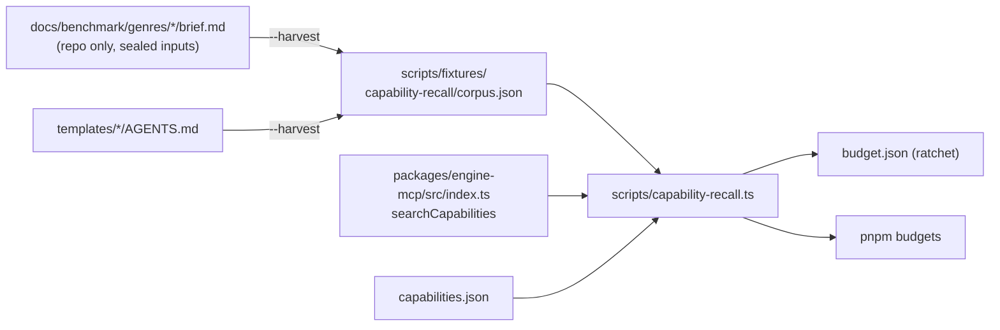
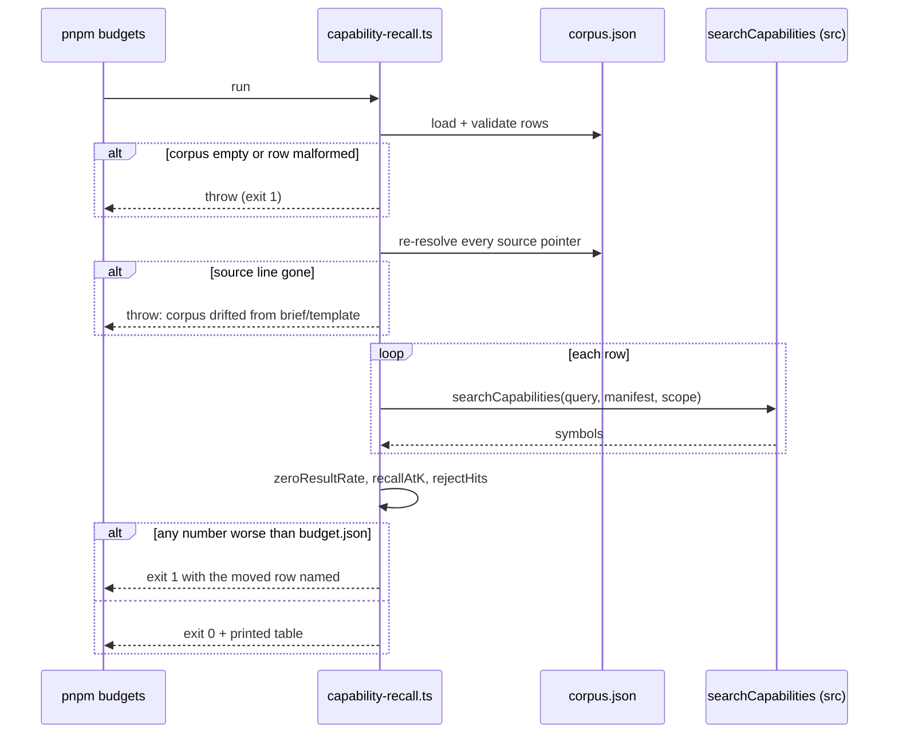

# PRD-297 — Capability recall is a number this repository reports

**Status:** OPEN, filed 2026-08-31 against `77a68bec`. Planning only; the one measurement quoted
below was executed and is recorded at `docs/verification/capability-recall-baseline-2026-08-31.md`.

**Outcome:** `pnpm caps:recall` answers, from a corpus whose every query is traceable to a line
that already exists in this repository, what fraction of real authoring queries reach the right
capability — and `pnpm budgets` fails when that fraction drops. An authoring agent's inability to
find `NavigationAgent3D` stops being an anecdote someone notices in a sweep transcript and becomes
a committed number with a floor.

**Depends on:** nothing. This PRD is the instrument PRD-298, PRD-299, PRD-300 and PRD-301 all
report against, and it is the first thing in `docs/PRDs/authoring/` to execute.

**Complexity: 4 → MEDIUM mode.** +1 (1–5 files), +2 (new gate module), +1 (reads two external
corpora: sealed briefs and template docs).

---

## 1. Context

**Problem:** capability search has ~20 hand-picked regression cases and no measure of recall, so a
24% zero-result rate against this repository's own sealed sweep briefs was invisible.

**Files analysed:**

- `packages/engine-mcp/src/index.ts` — `searchCapabilities` (line 194), `situationScore` (163),
  `tokens` (149), `STOP_WORDS` (161-ish), `MAX_SITUATION_RESULTS = 5`,
  `MAX_COMPLETE_REQUEST_RESULTS = 15`
- `packages/engine-mcp/__tests__/search.spec.ts` — 330 lines, ~20 named cases
- `scripts/build-capability-manifest.ts` — generator; `CAPABILITY_PACKAGE_DIRECTORIES` line 18
- `scripts/check-capability-docs.ts` — the `@situation`/`@example` presence gate in `pnpm budgets`
- `docs/benchmark/genres/*/brief.md` — 7 sealed briefs, 46 mechanic bullets
- `packages/create-threenative/templates/*/AGENTS.md` — 8 files, 404–553 lines each
- `package.json` — `budgets` (line 16) and `build` (line 17) chains
- `scripts/make-sandbox.ts:246-252` — `resolveGenre`, `briefHash`

**Current behaviour:**

- `searchCapabilities` filters `score > 0`, so one shared non-stop-word token produces a result.
- No component of the repository reports aggregate recall or zero-result rate.
- `pnpm budgets` gates that every export **has** `@situation` tags; nothing gates that those tags
  are **findable**.
- The best available corpus of real authoring queries — the sealed briefs — is read by
  `scripts/make-sandbox.ts` and by nothing else.

---

## 2. Solution

**Approach:**

- One repo-only corpus file, `scripts/fixtures/capability-recall/corpus.json`. Every row carries a
  `source` pointer (`brief:fps#4`, `template:defense#Waves and pacing`) that the gate re-resolves;
  a row whose source line no longer exists is a **failure**, not a skip.
- `scripts/capability-recall.ts` imports `searchCapabilities` from **`packages/engine-mcp/src`**,
  not `dist`, so the gate cannot silently measure a stale build.
- Two reported numbers per run: `zeroResultRate` (rows returning nothing) and `recallAtK` (rows
  whose `expect` set intersects the returned symbols). Plus `rejectHits` — rows that returned a
  symbol listed in `reject`, which is how "eight wrong answers" gets a number.
- A committed floor at `scripts/fixtures/capability-recall/budget.json`. The gate fails when any
  number moves the wrong way; improving requires updating the floor in the same commit. Ratchet,
  never a threshold someone can quietly relax — the diff shows it.
- `--harvest` prints candidate queries from briefs and template headings so corpus growth stays
  mechanical. `expect`/`reject` sets stay human-authored; the gate never invents them.

**Architecture:**



**Key decisions:**

- [ ] No new dependency. `tsx`, `node:fs`, and the existing engine-mcp source.
- [ ] Corpus and floor are **never** shipped. They live under `scripts/fixtures/`, which is not in
      any package `files` array, and no phase writes brief text into `capabilities.json`.
- [ ] Fail closed: an empty corpus, an unresolvable `source`, or a malformed row **throws**. An
      empty assertion set reporting green is the v1 harness failure this repository already paid
      for.
- [ ] The gate reports; it does not edit the manifest or the tags.

**Data changes:** two new JSON fixtures. No schema, no migration, no shipped artifact.

---

## 3. Sequence flow



---

## 4. Integration Ledger

| # | New thing | Live caller (`file:line`, non-test) | Replaces | Old path removed? | Negative control |
|---|---|---|---|---|---|
| 1 | `scripts/capability-recall.ts` | `package.json:17` (`budgets` chain) | nothing | n/a, new measurement | deleting one `@situation` line from `AnimationPlayer` and rebuilding the manifest turns its corpus row red |
| 2 | `caps:recall` npm script | `package.json:19` (`scripts` entry) | nothing | n/a | running it with an emptied `corpus.json` must exit non-zero, not report 100% |
| 3 | `corpus.json` | `scripts/capability-recall.ts:92` (`CORPUS_RELATIVE_PATH`) | nothing | n/a | breaking one `source` pointer (renaming a template heading) must fail the gate |
| 4 | `budget.json` floor | `scripts/capability-recall.ts:93` (`BUDGET_RELATIVE_PATH`) | nothing | n/a | hand-lowering one recorded number must fail the gate on the next run |

### Reachability

**How is this reached?** CLI entry point: `pnpm caps:recall`, and the pre-existing `pnpm budgets`
chain that CI already runs (`install → typecheck → lint → test → scaffold-smoke → visuals`).

**Pre-existing file edited to call it:** `package.json`, `budgets` script, line 16.

**Is this user-facing?** No — internal gate. Trigger is CI and the local `pnpm budgets` run.

**Full flow:** an agent edits a `@situation` tag or the search ranking → `pnpm build` regenerates
`capabilities.json` → `pnpm budgets` runs `capability-recall.ts` → a row that used to find its
capability and no longer does is printed by name and the chain exits non-zero.

**What does this replace?** Nothing. `packages/engine-mcp/__tests__/search.spec.ts` stays exactly
as it is — those are case regressions and this is aggregate recall. They are not redundant and
neither is deleted.

---

## 5. Execution phases

#### Phase 1: Corpus and runner — `pnpm caps:recall` prints today's recall and the miss list

**Files (4):**

- `scripts/fixtures/capability-recall/corpus.json` — NEW: rows harvested from 7 briefs (46 bullets)
  and 8 template `AGENTS.md` heading sets, each with `source`, `scope`, `expect`, `reject`
- `scripts/capability-recall.ts` — NEW: loader, validator, `--harvest`, `--json`, reporter
- `package.json` — EDIT: add `"caps:recall": "tsx scripts/capability-recall.ts"`
- `scripts/__tests__/capability-recall.spec.ts` — NEW: validator and scoring unit tests

**Implementation:**

- [ ] Row schema: `{ id, query, scope: "request"|"mechanic", source, expect: string[], reject: string[] }`
- [ ] `expect` symbols must exist in the manifest — an `expect` naming a symbol that was renamed is
      a gate failure, not a miss
- [ ] `source` resolves as `brief:<genre>#<bullet-index>` or `template:<name>#<heading text>`;
      re-read the file and confirm the line is still there
- [ ] Seed the corpus with **every** brief bullet, including the 11 known misses, and at least the
      11 plain-words queries from the baseline record
- [ ] Phase 1 exits 0 and reports; the ratchet arrives in Phase 2 so CI is not red on landing

**Wiring:**

- [ ] Caller edited: `package.json` gains `caps:recall`
- [ ] Registration: npm script only in this phase
- [ ] Old path: n/a
- [ ] Ledger rows filled: #2, #3

**Tests required:**

| Test file | Test name | Assertion | Negative control (must be observed red) |
|---|---|---|---|
| `scripts/__tests__/capability-recall.spec.ts` | `should throw when the corpus is empty` | throws `TN_CAPABILITY_RECALL` | passes vacuously if the guard is deleted — delete it and watch the test fail |
| `scripts/__tests__/capability-recall.spec.ts` | `should throw when a row expects a symbol absent from the manifest` | throws naming the symbol | rename `expect` to a real symbol; test must go green only then |
| `scripts/__tests__/capability-recall.spec.ts` | `should throw when a source pointer no longer resolves` | throws naming the source | point a fixture row at a deleted heading; observed red before the guard exists |
| `scripts/__tests__/capability-recall.spec.ts` | `should count a row as a miss when no expected symbol is returned` | `recallAtK` excludes it | stub search to return the expected symbol; number must move |

**Revert check:** rename `capability-recall.ts` → `pnpm caps:recall` fails to resolve. Weak by
itself; Phase 2 makes it strong by putting the gate inside `pnpm budgets`.

**User verification:**

- Action: `pnpm caps:recall`
- Expected: a table, the miss list, and a printed `zeroResultRate` at or near the recorded 24%.
  Paste it into `docs/verification/capability-recall-baseline-2026-08-31.md` as the first gated
  run.

---

#### Phase 2: Ratchet — `pnpm budgets` fails when recall regresses

**Files (4):**

- `scripts/fixtures/capability-recall/budget.json` — NEW: the Phase 1 numbers, committed
- `scripts/capability-recall.ts` — EDIT: compare against the floor, exit 1 on any regression
- `package.json` — EDIT: insert into the `budgets` chain (line 16) before `check-budgets.ts`
- `docs/verification/capability-recall-baseline-2026-08-31.md` — EDIT: record the gated run

**Implementation:**

- [ ] Floor holds `zeroResultRate` (max), `recallAtK` (min), `rejectHits` (max), and `rowCount` (min)
- [ ] `rowCount` in the floor prevents the cheapest cheat: deleting failing rows to raise recall
- [ ] Regression output names the row ids that moved, not just the aggregate
- [ ] `--update-budget` writes the floor, so improving is one explicit flag and one visible diff

**Wiring:**

- [ ] Caller edited: `package.json:16` `budgets` chain invokes `capability-recall.ts`
- [ ] Registration: runs in CI's existing chain, no new CI job
- [ ] Old path: n/a
- [ ] Ledger rows filled: #1, #4

**Tests required:**

| Test file | Test name | Assertion | Negative control (must be observed red) |
|---|---|---|---|
| `scripts/__tests__/capability-recall.spec.ts` | `should fail when zeroResultRate exceeds the recorded floor` | exit code 1, row ids printed | run against the unmodified floor: must pass, proving the failure came from the regression |
| `scripts/__tests__/capability-recall.spec.ts` | `should fail when rowCount drops below the floor` | throws | delete a corpus row and confirm red; restore and confirm green |
| `scripts/__tests__/capability-recall.spec.ts` | `should pass when every number improves` | exit 0 | required so the ratchet does not block PRD-298/300/301 |

**Revert check:** delete `capability-recall.ts` → `pnpm budgets` fails to complete. **Real
mutation red:** delete the line `@situation stop a walking character's feet from sliding or
spinning` from `packages/core/src/index.ts`, run `pnpm build && pnpm budgets` — the
`AnimationPlayer` foot-slide row must go red and be named. Paste that red and the restored green
in the same commit.

**User verification:**

- Action: delete one `@situation` line, `pnpm build`, `pnpm budgets`
- Expected: non-zero exit naming the affected corpus row. Restore, re-run, green.

---

## 6. Verification plan

1. **Unit:** `scripts/__tests__/capability-recall.spec.ts`, 7 cases above, vitest node env.
2. **Gate proof (pasted, not summarised):**

```sh
pnpm caps:recall                 # table + miss list + numbers
pnpm build && pnpm budgets       # the chain, with the gate inside it
```

3. **Integration proof:**

```sh
# 1. Caller census — the gate has a non-test consumer
grep -n "capability-recall" package.json
# Expected: a hit inside the "budgets" script value, not only in "caps:recall"

# 2. Revert check
git stash -- scripts/capability-recall.ts && pnpm budgets   # Expected: fails
git stash pop

# 3. Shipping check — no corpus content reached a shipped artifact
grep -rn "endless runner\|firing line\|Magazine 30" packages/create-threenative/capabilities.json packages/core/capabilities.json
# Expected: no output
```

4. **Negative controls, each recorded with its observed red:**
   - `zeroResultRate` floor — red when a `@situation` line is deleted
   - `rowCount` floor — red when a corpus row is deleted
   - source-pointer resolution — red when a template heading is renamed
   - empty corpus — red, not a vacuous 100%
   - stale-build control: point `THREENATIVE_CAPABILITIES_MANIFEST` at a hand-edited manifest with
     a removed entry; the gate must read it and go red rather than passing on a cached number

---

## 7. Acceptance criteria

Consumer-scoped. Every one is about what an authoring agent can find, or what a committing agent
is stopped from breaking.

- [ ] A query taken verbatim from a sealed brief that finds its capability today still finds it
      after any later change to tags, ranking, or the manifest — or `pnpm budgets` refuses the
      commit and names the query.
- [ ] The 11 brief bullets that return nothing today are in the corpus **as rows that fail**, so
      PRD-298/299/300/301 each have a number to move rather than an anecdote.
- [ ] Deleting corpus rows cannot improve the reported recall (`rowCount` floor).
- [ ] `pnpm caps:recall` run in a clean checkout reproduces the number in
      `docs/verification/capability-recall-baseline-2026-08-31.md`.
- [ ] No brief text, corpus row, or expected-symbol list appears in either copy of
      `capabilities.json` — grep pasted.

**Integration gates:**

- [ ] Integration Ledger has zero `TBD` cells
- [ ] `capability-recall.ts` has a non-test consumer (`package.json:16`), census pasted
- [ ] Revert check pasted: removing the gate breaks `pnpm budgets`
- [ ] Every gate has an observed red, pasted, including the `@situation` deletion mutation
- [ ] Proved on the real subject: the full 46-bullet sealed-brief corpus, not a hand-picked subset
