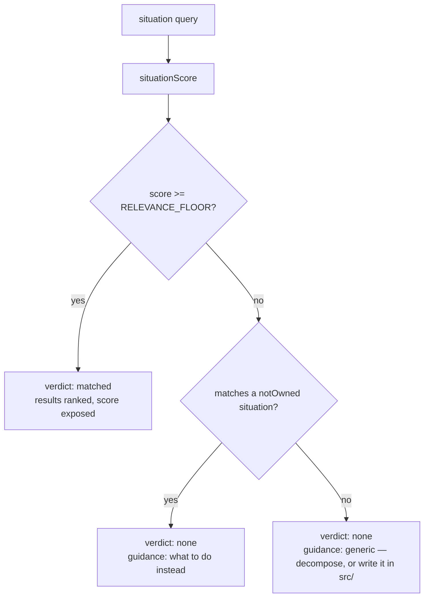

# PRD-298 — Capability search fails closed, and can answer "the engine does not own this"

**Status:** OPEN, filed 2026-08-31 against `77a68bec`. Planning only. The eight-wrong-answers
measurement is executed and recorded at `docs/verification/capability-recall-baseline-2026-08-31.md`.

**Outcome:** an authoring agent that searches for something the engine does not have gets told so,
in the same breath as what to do instead — and stops getting eight coincidental capabilities
ranked as if they were answers. Every other gate in this repository fails closed; capability
search is the one that returns confident noise.

**Depends on:** PRD-297. The relevance floor is *calibrated* against that corpus, not guessed, and
the two numbers this PRD moves (`rejectHits` down, `recallAtK` held) only exist once PRD-297 lands.

**Complexity: 5 → MEDIUM mode.** +2 (6–10 files), +2 (multi-package: `engine-mcp`, `scripts`, both
manifest copies), +1 (manifest schema version bump).

---

## 1. Context

**Problem:** `searchCapabilities` keeps every entry scoring above zero, so one shared token after
stop-word removal is a ranked result; and there is no way for the manifest to say a mechanic is
deliberately not owned.

**Files analysed:**

- `packages/engine-mcp/src/index.ts:194-224` — `searchCapabilities`, the `score > 0` filter
- `packages/engine-mcp/src/index.ts:163-186` — `situationScore`: `overlap / max(len)` plus a
  `phraseBonus` of 1, and an overlap gate of 2 tokens for queries of 4+ tokens
- `packages/engine-mcp/src/index.ts:104-131` — `validateManifest`, which pins every entry field
- `packages/engine-mcp/src/index.ts:339-348` — `initialize`, `serverInfo.version` `0.2.0`,
  `AUTHORING_INSTRUCTIONS`
- `scripts/build-capability-manifest.ts:466-510` — `buildCapabilityManifest`, the
  `.concat(REALISM_EFFECTS_MANIFEST_ENTRIES).concat(RENDER_CHAIN_MANIFEST_ENTRIES)` precedent
- `scripts/build-capability-manifest.ts:19` — `MANIFEST_VERSION = 1`
- `packages/engine-mcp/__tests__/search.spec.ts` — ~20 cases that assert on the array shape

**Current behaviour:**

- `save the player progress` → 8 results (`Area3D`, `PointerEvents3D`, `NavigationAgent3D`,
  `recast`, `CharacterBody3D`, `defineGame`, `Heightfield`, `attachToBone`). None is relevant.
- `spawn waves of enemies` → 15 results including `Buoyancy3D` and `SpectralOcean`.
- The `matchedSituation` field explains *why* a result appeared but carries no score, so an agent
  cannot tell rank 1 from rank 8.
- There is no representation for "not owned". The charter's answer — *write plain Three.js*, or
  `pnpm add` the library — is in `AGENTS.md` prose and nowhere in the tool an agent actually calls.

---

## 2. Solution

**Approach:**

- Add a **relevance floor** to `searchCapabilities`, its value chosen by sweeping candidate
  thresholds over PRD-297's corpus and picking the one that minimises `rejectHits` subject to
  `recallAtK` not dropping. The chosen number and the sweep table go in the PRD's evidence
  section — not a guess, and not a round number picked because it looked tidy.
- Change the tool response from a bare array to `{ verdict, results, guidance }`:
  - `verdict: "matched"` — results above the floor;
  - `verdict: "none"` — nothing above the floor, `results: []`, and `guidance` naming the next
    move (write it in `src/`, read the named template, or the library to `pnpm add`).
- Add a `notOwned` section to the manifest: authored situations the framework deliberately does
  not own, each with its guidance. Bumps `MANIFEST_VERSION` to `2`.
- Bump `serverInfo.version` to `0.3.0` and update `AUTHORING_INSTRUCTIONS` to say that `verdict:
  "none"` is a real, actionable answer rather than a failed search worth rephrasing.

**Architecture:**



**Key decisions:**

- [ ] Response shape becomes an object. This is a breaking change to the tool payload and the
      ~20 assertions in `search.spec.ts` are updated in the same phase — in scope, not follow-up.
- [ ] `notOwned` entries live in `scripts/not-owned-capabilities.ts` and are concatenated by
      `buildCapabilityManifest`, following the existing `RENDER_CHAIN_MANIFEST_ENTRIES` pattern.
      No second manifest file, no hand-maintained parallel list.
- [ ] `validateManifest` in engine-mcp validates `notOwned` with the same strictness as `entries`:
      a malformed row throws at server start, never degrades to an empty section.
- [ ] The floor applies to both scopes. `scope: "request"` keeps its wider `MAX_COMPLETE_REQUEST_
      RESULTS = 15` cap but not a lower bar for relevance.

**Data changes:** `capabilities.json` gains `notOwned` and `version: 2`, in both the
`create-threenative` copy and the `packages/core` mirror. Generated, never hand-edited.

---

## 3. Sequence flow

```mermaid
sequenceDiagram
    participant A as Authoring agent
    participant T as engine_search_capabilities
    participant M as capabilities.json
    A->>T: "save the player progress"
    T->>M: score entries
    M-->>T: best score 0.28 (below floor)
    T->>M: match notOwned situations
    M-->>T: "persist player progress between sessions"
    T-->>A: {verdict:"none", results:[], guidance:"The framework owns no save system. Write it in src/ against your own state shape; `ctx` state is plain objects."}
    A->>A: writes a save module instead of misusing Area3D
```

---

## 4. Integration Ledger

| # | New thing | Live caller (`file:line`, non-test) | Replaces | Old path removed? | Negative control |
|---|---|---|---|---|---|
| 1 | `RELEVANCE_FLOOR` + filter | `packages/engine-mcp/src/index.ts:569` — `searchCapabilities` result filter | the `score > 0` filter at `:196` | **deleted in Phase 1** | restoring `score > 0` makes `save the player progress` return 8 again and fails the new test |
| 2 | `{verdict, results, guidance}` response | `packages/engine-mcp/src/index.ts:683` — `handleToolCall` → `toolText` (`:664`) | bare-array response | replaced in Phase 1 | a client asserting `results.length` on the old shape fails; ~20 spec cases updated |
| 3 | `notOwned` manifest section | `scripts/build-capability-manifest.ts:635` — `buildCapabilityManifest` return | nothing | n/a | removing the section must make `validateManifest` throw for a `version: 2` manifest |
| 4 | `scripts/not-owned-capabilities.ts` | `scripts/build-capability-manifest.ts:8` — imported by `buildCapabilityManifest` | `AGENTS.md` prose that the tool never surfaced | prose stays (it is for humans); the tool now says it too | deleting one row makes its corpus query fall back to generic guidance — visible in `pnpm caps:recall` |
| 5 | `MANIFEST_VERSION = 2` | `scripts/build-capability-manifest.ts:22` — manifest return at `:635` | `= 1` | replaced | a v1 manifest with no `notOwned` must be rejected by the v2 validator, observed red |

### Reachability

**How is this reached?** MCP tool call from an authoring agent's session — `engine_search_
capabilities`, wired by the `.mcp.json` that installing `@threenative/core` writes
(`packages/core/scripts/ensure-mcp.mjs`).

**Pre-existing files edited to call it:** `packages/engine-mcp/src/index.ts` (the filter and the
response are inside the already-live `searchCapabilities`), `scripts/build-capability-manifest.ts`
(the already-live generator).

**Is this user-facing?** Not to a human. The consumer is the authoring agent; the observable
outcome is the JSON it reads.

**Full flow:** agent calls the tool → `handleToolCall:315` → `searchCapabilities` → floor applied
→ `notOwned` consulted → agent receives a verdict it can act on.

**What does this replace?** The `score > 0` filter, deleted in Phase 1. Two filters must not
coexist; that is how the noisy path stays live while the gate goes green.

---

## 5. Execution phases

#### Phase 1: The floor — a query with no good match returns none, not eight

**Files (4):**

- `packages/engine-mcp/src/index.ts` — EDIT: `RELEVANCE_FLOOR`, delete `score > 0`, new response
  object, expose `score`
- `packages/engine-mcp/__tests__/search.spec.ts` — EDIT: ~20 cases to the new shape, plus the
  eight-wrong-answers case as a named regression
- `scripts/fixtures/capability-recall/budget.json` — EDIT: new `rejectHits` and `recallAtK`
- `docs/verification/capability-recall-baseline-2026-08-31.md` — EDIT: the threshold sweep table

**Implementation:**

- [ ] Sweep candidate floors over PRD-297's corpus; record `recallAtK` and `rejectHits` at each
- [ ] Pick the floor from that table; the PRD records the table, not a bare constant
- [ ] Delete the `score > 0` filter in the same edit — never leave both
- [ ] Return `{ verdict, results, guidance }`; each result carries its `score` and `matchedSituation`
- [ ] `AUTHORING_INSTRUCTIONS` and `serverInfo.version → 0.3.0`

**Wiring:**

- [ ] Caller edited: `searchCapabilities` (already live via `handleToolCall:315`)
- [ ] Registration: none needed — the tool is already registered
- [ ] Old path: `score > 0` **deleted**
- [ ] Ledger rows filled: #1, #2

**Tests required:**

| Test file | Test name | Assertion | Negative control (must be observed red) |
|---|---|---|---|
| `search.spec.ts` | `should return no capability for a save-system request` | `verdict === "none"`, `results` empty | restore `score > 0`: returns 8, test red — paste it |
| `search.spec.ts` | `should still rank NavigationAgent3D for walking around a wall` | symbol present, `verdict === "matched"` | set the floor absurdly high: test red, proving the floor is what is being measured |
| `search.spec.ts` | `should expose a score on every result` | every result has a numeric `score` | delete the field: red |
| `scripts/__tests__/capability-recall.spec.ts` | `should record rejectHits below the previous floor` | new number < old | run against the pre-change engine: must fail |

**Revert check:** restore the `score > 0` filter → the save-system test and the `rejectHits` floor
in `pnpm budgets` both go red.

**User verification:**

- Action: `node --input-type=module -e "import {searchCapabilities} from './packages/engine-mcp/dist/index.js'; console.log(JSON.stringify(searchCapabilities('save the player progress','packages/create-threenative/capabilities.json','request'),null,2))"`
- Expected: `verdict: "none"`, empty `results`.

---

#### Phase 2: `notOwned` — the answer says what to do instead

**Files (5):**

- `scripts/not-owned-capabilities.ts` — NEW: authored rows, each `{ id, situations, guidance }`
- `scripts/build-capability-manifest.ts` — EDIT: emit `notOwned`, `MANIFEST_VERSION = 2`
- `packages/engine-mcp/src/index.ts` — EDIT: validate `notOwned`, consult it on `verdict: "none"`
- `packages/engine-mcp/__tests__/search.spec.ts` — EDIT: guidance cases
- `scripts/fixtures/capability-recall/corpus.json` — EDIT: rows for each `notOwned` situation

**Implementation:**

- [ ] Seed rows only from **measured** misses, not imagined ones: save/load, inventory, dialogue,
      networked multiplayer, and any further zero-result row PRD-297 surfaces where the honest
      answer is "not ours"
- [ ] Each row's guidance names a concrete next move — the file to write in, the template to read,
      or the package to `pnpm add` — never "not supported" alone
- [ ] A row whose `situations` overlap a real entry's `@situation` above the floor is a **build
      failure**: the manifest must not claim to both own and not own a mechanic
- [ ] `validateManifest` rejects a `version: 2` manifest with a malformed or missing `notOwned`

**Wiring:**

- [ ] Caller edited: `buildCapabilityManifest:490` concatenates the new source
- [ ] Registration: both manifest copies regenerate under `pnpm build`
- [ ] Old path: n/a — this is the first machine-readable form of guidance that only existed in prose
- [ ] Ledger rows filled: #3, #4, #5

**Tests required:**

| Test file | Test name | Assertion | Negative control (must be observed red) |
|---|---|---|---|
| `search.spec.ts` | `should return save-system guidance naming what to write instead` | `guidance` contains the named path | delete the row: falls back to generic, test red |
| `search.spec.ts` | `should reject a v2 manifest whose notOwned section is malformed` | throws `TN_ENGINE_CAPABILITIES_MANIFEST` | supply a valid section: green only then |
| `scripts/__tests__/build-capability-manifest.spec.ts` | `should fail when a notOwned situation also matches an owned capability` | throws naming both | add an overlapping row on purpose and observe red |
| `scripts/__tests__/capability-recall.spec.ts` | `should count a notOwned answer as an answer, not a miss` | `zeroResultRate` drops | required so the number reflects the agent's experience, not the array length |

**Revert check:** delete `not-owned-capabilities.ts` → `pnpm build` fails at the import, and the
guidance tests go red.

**User verification:**

- Action: `pnpm build && pnpm caps:recall`
- Expected: `zeroResultRate` down, `rejectHits` down, `recallAtK` not below its floor.

---

## 6. Verification plan

1. **Unit:** the 8 cases above, plus the ~20 rewritten `search.spec.ts` cases still passing.
2. **Gate proof (pasted):** `pnpm build && pnpm typecheck && pnpm lint && pnpm test && pnpm budgets`
3. **Integration proof:**

```sh
# 1. The old filter is gone, not coexisting
grep -n "score > 0" packages/engine-mcp/src/index.ts
# Expected: no output

# 2. notOwned reached the shipped artifact, in both copies
node -e "for (const f of ['packages/create-threenative/capabilities.json','packages/core/capabilities.json']) { const m=require('./'+f); console.log(f, m.version, (m.notOwned||[]).length) }"
# Expected: both print version 2 and the same non-zero count

# 3. Revert check
git stash -- packages/engine-mcp/src/index.ts && pnpm test --filter engine-mcp   # Expected: fails
git stash pop
```

4. **Negative controls, each with its observed red:** restored `score > 0`; absurd floor; deleted
   `notOwned` row; malformed `notOwned` section; overlapping owned/not-owned situation.

---

## 7. Acceptance criteria

- [ ] An agent asking the engine to save player progress is told the framework does not own it and
      what to write instead — it is no longer handed `Area3D` and `Heightfield`.
- [ ] Every capability that a sealed-brief query finds today is still found after the floor lands:
      `recallAtK` at or above its PRD-297 floor, pasted.
- [ ] `rejectHits` is strictly lower than the PRD-297 baseline, pasted.
- [ ] A search result an agent reads carries a score, so rank 1 is distinguishable from rank 8.
- [ ] The manifest cannot simultaneously own and disown a mechanic — the build fails if it tries.
- [ ] No brief or corpus text reached either `capabilities.json`; grep pasted.

**Integration gates:**

- [x] Ledger has zero placeholder cells
- [ ] `score > 0` is deleted, grep pasted — no two live filters
- [ ] Revert check pasted
- [ ] Every gate has an observed red
- [ ] Proved on the real subject: the eight-result `save the player progress` query and the full
      corpus, not a synthetic fixture
