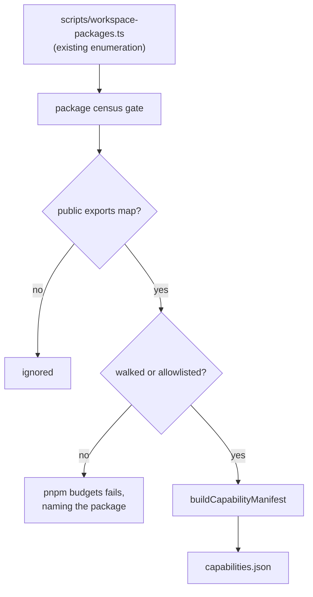
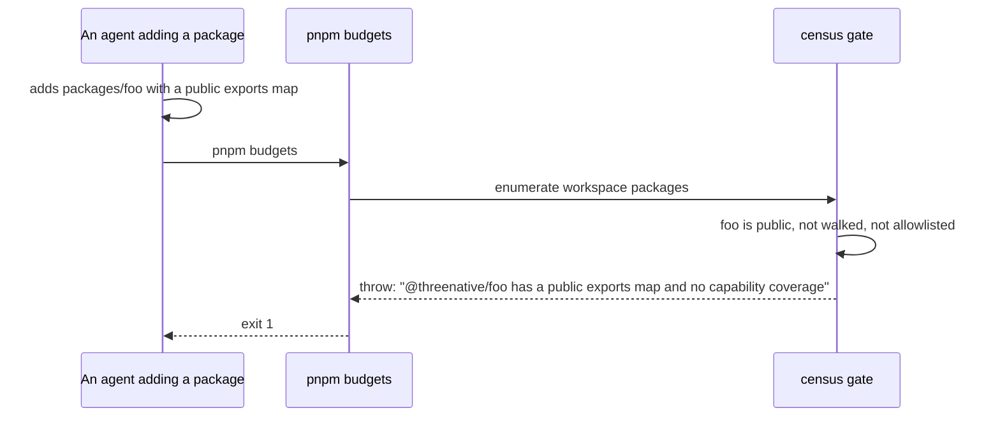

# PRD-301 — Every shipped package is in the manifest, or names why it is not

**Status:** OPEN, filed 2026-08-31 against `77a68bec`. Planning only.

**Outcome:** an agent optimising textures, compiling models, or debugging a blank draw finds
`@threenative/assets` through the same tool it finds everything else — and no future package can
ship a public surface that the capability manifest silently omits.

**Depends on:** PRD-297 for the number. Independent of PRD-298 and PRD-300; it can run beside
either.

**Complexity: 5 → MEDIUM mode.** +2 (6–10 files), +2 (multi-package: `assets`, `scripts`,
`create-threenative`), +1 (a new census gate).

---

## 1. Context

**Problem:** `CAPABILITY_PACKAGE_DIRECTORIES` is a hand-typed array of four names. `assets` is not
one of them, so eleven public functions and every constraint they carry are invisible to the tool
the framework tells agents to use before writing anything.

**Files analysed:**

- `scripts/build-capability-manifest.ts:18` — `const CAPABILITY_PACKAGE_DIRECTORIES = ["core",
  "physics", "playtest", "ui"] as const;`
- `scripts/build-capability-manifest.ts:411-437` — `packageExportCandidates`, which walks only
  those four
- `scripts/build-capability-manifest.ts:439-464` — `validateDocumentation`, the `@situation` gate
- `scripts/check-capability-docs.ts:9-27` — `ICapabilityExport`, whose `packageName` is typed as
  the union `"@threenative/core" | "@threenative/physics"` — a third hand-maintained list
- `scripts/workspace-packages.ts` — the existing workspace enumeration, already run first in
  `pnpm budgets`
- `packages/assets/package.json` — `@threenative/assets@0.3.0`, public, one `.` export
- `packages/assets/src/index.ts` — 11 exported functions (`compileAssets`,
  `resolveBasisTranscoder`, `modelPass`, `lightmapPass`, `texturePass`, `formatModelSizes`,
  `formatTextureSizes`, `parsePng`, `formatHealthReport`, `runHealthReport`, `watchAssets`),
  **zero** `@situation` tags

**Current behaviour:**

- `@threenative/assets` contributes 0 of the manifest's 210 entries.
- `optimize textures for the GPU` returns `SpectralOcean`, `GPUReadback`,
  `ComputeDrivenRegistry`, `createAssetLoader` — nothing from the asset pipeline.
- The BC7 block rule (every source texture divisible by 4; the pipeline reports `0 fail` and
  WebGPU rejects it at draw time) is not expressible anywhere an agent will read it.
- Three separate hand-maintained enumerations of "which packages have capabilities" exist
  (`build-capability-manifest.ts:18`, `check-capability-docs.ts:10`, and its `subpath` union),
  and nothing fails when a new package matches none of them.

---

## 2. Solution

**Approach:**

- Add `assets` to the walked directories, and document its eleven exports with `@situation`,
  `@example` and `@constraint` tags to the same standard the existing gate already enforces.
- Replace the "which packages" question with a **census gate**: derive the candidate set from
  `scripts/workspace-packages.ts`, and fail the build when a non-private workspace package with a
  public `exports` map is neither walked nor allowlisted with a one-line reason. The allowlist
  follows the existing `INTERNAL_ALLOWLIST` convention — empty or multi-line reasons rejected.
- Encode the BC7 rule and the pipeline's other silent-failure modes as `@constraint` lines on the
  passes that own them, so `engine_capability_detail` states them before an agent ships a texture
  the GPU will reject.

**Architecture:**



**Key decisions:**

- [ ] One source of truth for the package set. `CAPABILITY_PACKAGE_DIRECTORIES` becomes derived,
      not typed; the hand-maintained union in `check-capability-docs.ts` is derived with it.
- [ ] `runtime-native` is expected to be allowlisted — it ships a C++ host, not a TypeScript
      authoring surface. The reason is written, not assumed.
- [ ] Assets documentation is authored to the standard already enforced; no tag-quality exception.
- [ ] The gate is a census, not a count. "N packages covered" passes while the wrong N are
      covered; naming the uncovered package is the requirement.

**Data changes:** manifest gains `@threenative/assets` entries. Both copies regenerate.

---

## 3. Sequence flow



---

## 4. Integration Ledger

| # | New thing | Live caller (`file:line`, non-test) | Replaces | Old path removed? | Negative control |
|---|---|---|---|---|---|
| 1 | `assets` walked | `scripts/build-capability-manifest.ts:18` — TBD | the 4-name literal | **literal replaced by the derived set in Phase 2** | remove `assets`: the assets corpus rows go red |
| 2 | `@situation`/`@example`/`@constraint` on 11 assets exports | `packages/assets/src/index.ts` declarations — TBD | nothing | n/a | delete the texture-pass tags: `pnpm build` fails on `validateDocumentation` |
| 3 | package census gate | `package.json:16` `budgets` chain — TBD | three hand-maintained lists | all three derived in Phase 2 | add a fixture package with public exports and no coverage: build must fail |
| 4 | derived `CAPABILITY_PACKAGE_DIRECTORIES` | `packageExportCandidates:413` — TBD | the literal at `:18` | deleted in Phase 2 | pin it back to a literal: the census test goes red |
| 5 | coverage allowlist with reasons | census gate — TBD | implicit omission | replaced | an empty-string reason must fail, as `INTERNAL_ALLOWLIST` already requires |

### Reachability

**How is this reached?** Two entry points: `pnpm build` (regenerates the manifest an agent's MCP
server reads) and `pnpm budgets` (the census gate, already in CI's chain).

**Pre-existing files edited:** `scripts/build-capability-manifest.ts`,
`scripts/check-capability-docs.ts`, `packages/assets/src/index.ts`, `package.json`.

**Is this user-facing?** No. The consumer is the authoring agent, and the second consumer is the
agent adding a package six months from now who would otherwise ship an invisible surface.

**Full flow:** agent asks how to compile textures → `engine_search_capabilities` → `texturePass`
with the BC7 constraint → the agent sizes its source textures to a multiple of 4 instead of
shipping a pipeline that reports `0 fail` and a game that draws nothing.

**What does this replace?** Three hand-maintained package enumerations, all derived in Phase 2.
Leaving any one of them typed alongside a derived set is the drift this PRD exists to end.

---

## 5. Execution phases

#### Phase 1: Assets become findable

**Files (5):**

- `packages/assets/src/index.ts` — EDIT: tags on the 11 exports (or on their declarations)
- `packages/assets/src/passes/texture.ts` — EDIT: the BC7 divisible-by-4 `@constraint`
- `scripts/build-capability-manifest.ts` — EDIT: add `assets` to the walked set
- `scripts/fixtures/capability-recall/corpus.json` — EDIT: asset-pipeline rows
- `scripts/fixtures/capability-recall/budget.json` — EDIT: improved floor

**Implementation:**

- [ ] Every exported function gets a summary, at least one `@situation`, and one `@example` — the
      standard `validateDocumentation` already enforces for the other four packages
- [ ] Constraints authored from things the pipeline gets silently wrong today, starting with the
      BC7 block rule; each `@constraint` states the failure it prevents
- [ ] Corpus rows for the asset-pipeline queries, including `optimize textures for the GPU`, which
      returns four unrelated capabilities today

**Wiring:**

- [ ] Caller edited: `scripts/build-capability-manifest.ts:18`
- [ ] Registration: `pnpm build` writes both manifest copies
- [ ] Old path: n/a in this phase
- [ ] Ledger rows filled: #1, #2

**Tests required:**

| Test file | Test name | Assertion | Negative control (must be observed red) |
|---|---|---|---|
| `packages/engine-mcp/__tests__/search.spec.ts` | `should find the texture pass for a GPU texture-optimisation request` | `texturePass` present | remove `assets` from the walked set, rebuild: red — paste it |
| `search.spec.ts` | `should state the BC7 block constraint in capability detail` | detail contains the divisible-by-4 rule | delete the `@constraint`: red |
| `scripts/__tests__/build-capability-manifest.spec.ts` | `should fail when an assets export has no @situation` | throws naming the export | strip one tag on purpose: observed red |
| `scripts/__tests__/capability-recall.spec.ts` | `should raise recallAtK on the asset-pipeline rows` | number rises | run against the previous manifest: fails |

**Revert check:** remove `"assets"` from the walked set → the two `search.spec.ts` cases and the
`pnpm budgets` recall floor go red.

**User verification:**

- Action: `pnpm build`, then search `optimize textures for the GPU`
- Expected: the asset pipeline, not `SpectralOcean`.

---

#### Phase 2: The census — a package cannot ship an invisible public surface

**Files (5):**

- `scripts/check-capability-docs.ts` — EDIT: derive the package set; the census gate; the reasoned
  allowlist
- `scripts/build-capability-manifest.ts` — EDIT: consume the derived set; delete the literal at :18
- `scripts/workspace-packages.ts` — EDIT (if needed): expose the public/private and `exports` facts
- `scripts/__tests__/check-capability-docs.spec.ts` — NEW/EDIT: census cases
- `package.json` — EDIT: census runs in the `budgets` chain

**Implementation:**

- [ ] Enumerate workspace packages; a package is in scope when it is not `private` and declares an
      `exports` map beyond `./package.json`
- [ ] In-scope and unwalked and unallowlisted → throw, naming the package and both remedies
- [ ] Allowlist entries carry a single-line non-empty reason, rejected otherwise, matching the
      existing `INTERNAL_ALLOWLIST` rule
- [ ] Delete all three hand-typed enumerations in the same phase — a derived set beside a typed one
      is two sources of truth and the drift returns

**Wiring:**

- [ ] Caller edited: `package.json:16` `budgets` chain
- [ ] Registration: existing CI chain, no new job
- [ ] Old path: the literal at `build-capability-manifest.ts:18` and the union at
      `check-capability-docs.ts:10` **deleted**
- [ ] Ledger rows filled: #3, #4, #5

**Tests required:**

| Test file | Test name | Assertion | Negative control (must be observed red) |
|---|---|---|---|
| `scripts/__tests__/check-capability-docs.spec.ts` | `should fail for a public package with no capability coverage` | throws naming the package | add a fixture package: observed red before the gate exists |
| same | `should pass when that package is allowlisted with a reason` | no throw | empty reason: red |
| same | `should reject an empty or multi-line allowlist reason` | throws | single-line reason: green only then |
| same | `should derive the same package set the literal previously named` | derived set ⊇ `{core, physics, playtest, ui, assets}` | pin back to the literal: red |

**Revert check:** restore the literal package list → the derivation test goes red and the census
stops seeing new packages.

**User verification:**

- Action: create a throwaway `packages/zzz-probe` with a public `exports` map, run `pnpm budgets`
- Expected: non-zero exit naming `zzz-probe`. Delete the probe; green.

---

## 6. Verification plan

1. **Unit:** the 8 cases above.
2. **Gate proof (pasted):** `pnpm build && pnpm typecheck && pnpm lint && pnpm test && pnpm budgets`
3. **Integration proof:**

```sh
# 1. Assets reached both shipped copies
node -e "for (const f of ['packages/create-threenative/capabilities.json','packages/core/capabilities.json']) { const m=require('./'+f); console.log(f, m.entries.filter(e=>e.package==='@threenative/assets').length) }"
# Expected: both non-zero and equal

# 2. No hand-typed package list survives
grep -n 'CAPABILITY_PACKAGE_DIRECTORIES = \[' scripts/build-capability-manifest.ts
grep -n '"@threenative/core" | "@threenative/physics"' scripts/check-capability-docs.ts
# Expected: no output from either

# 3. Revert check
git stash -- packages/assets/src && pnpm build   # Expected: fails on validateDocumentation
git stash pop
```

4. **Negative controls with observed reds:** `assets` removed from the walked set; a stripped
   `@situation`; a deleted BC7 `@constraint`; an uncovered fixture package; an empty allowlist
   reason; the literal pinned back.

---

## 7. Acceptance criteria

- [ ] An agent asking how to optimise textures for the GPU is given the asset pipeline, and reads
      the BC7 divisible-by-4 rule before it ships textures the GPU rejects at draw time.
- [ ] `recallAtK` rises on the asset-pipeline corpus rows, pasted from `pnpm caps:recall`.
- [ ] Adding a package with a public export surface and no capability coverage stops the build and
      names the package — demonstrated with a throwaway probe package, output pasted.
- [ ] Exactly one enumeration of capability-bearing packages exists in the tree; the other two are
      deleted, greps pasted.
- [ ] Every allowlisted package carries a written reason, `runtime-native` included.

**Integration gates:**

- [ ] Ledger has zero `TBD` cells
- [ ] Census gate has a non-test consumer (`package.json:16`), grep pasted
- [ ] Revert check pasted
- [ ] Every gate has an observed red
- [ ] Proved on the real subject: `@threenative/assets`, the package that is actually missing —
      not a synthetic fixture package alone
