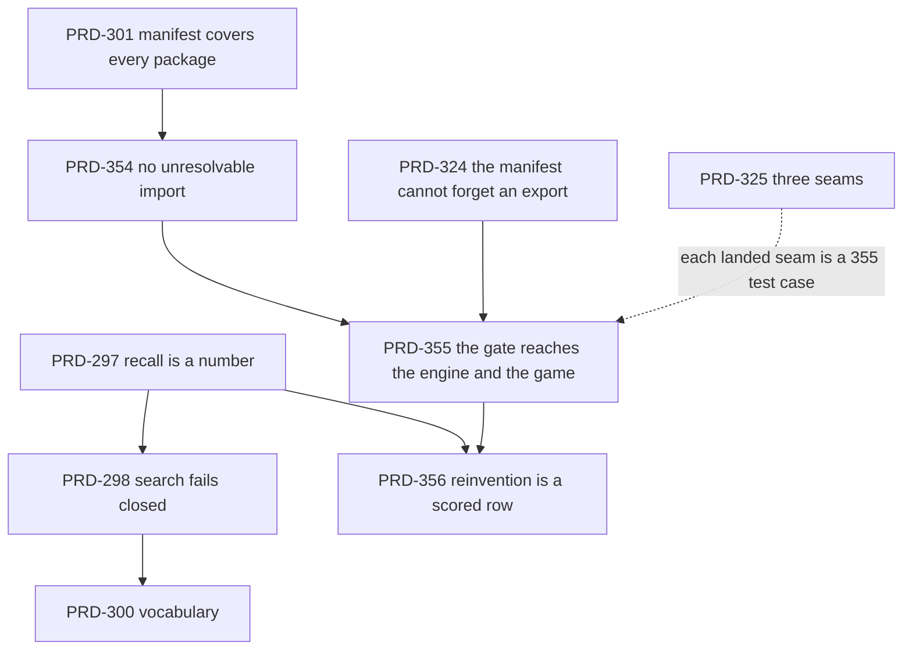

# astra-batch-2026-09-04 — the framework stops depending on the agent to search

**Status: OPEN — filed 2026-09-04 against `dae30759`. Nothing in this batch has been executed.**
**Assignee: astra.** Nine PRDs — three filed here, six pulled in from four other folders.

Every gate in this batch runs on this machine with **no device, no browser session and no human in
the loop**. That is deliberate: it is what makes a batch handable to an agent overnight, and it is
the property `done/batch-2026-09-01` was designed around. Nothing below asks for a Pixel 8, a blind
human judge, or a Fab login.

## The thesis

The framework's stated quality metric is *friction per cold-agent build*, and its answer to that
metric is the capability manifest plus an MCP server that searches it. **Every open correction to
that answer is a better pull** — a wider index (PRD-300), a stricter filter (PRD-298), a recall
number (PRD-297), fuller coverage (PRD-301, PRD-324).

All five assume the agent searches.

The measured failure is that it does not — including in this repository, whose own root
`AGENTS.md` records the case on 2026-09-03:

> a session added 880 colliders, rewrote a loading gate and tuned four render stages without one
> search, because none of it felt like *a system*

And the worst case is not a missing entry. It is a **present** one:

> bayview hand-wrote `src/perf.ts` — 190 lines of ring-buffered percentiles, per-section peaks and
> a spike counter — while `FrameBudget` ships from `packages/core/src/index.ts:268` and **is** in
> the manifest (`capabilities.json:664`).
> — `feature-mining/PRD-325`, §"Not a phase here"

Coverage was not the failure. Recall was not the failure either — the entry was there and findable.
**Nobody looked.** No amount of index quality fixes that, because the index is only read on
purpose.

This batch adds the half that does not need to be read on purpose: the repository already has a
**push** signal that tells a game it re-implemented shipped mechanism, it works, and it is aimed at
1.8% of the engine and at a directory no user has.

## Grounding — five facts, measured today at `dae30759`

**1. The reinvention gate exists and sees one capability in fifty.**

```
$ node -e "const a=require('./packages/create-threenative/capabilities.json').entries;
  const s=a.filter(e=>e.supersedes?.length); console.log(a.length, s.length,
  s.map(e=>e.symbol+' <- '+e.supersedes.join('|')).join('\n'))"
272 5
AudioBus          <- new Audio(
createRandom      <- Math.random(
normaliseToMetres <- new Box3().setFromObject(
prewarm           <- .visible = false
ScenePicker       <- new Raycaster(
```

`scripts/detect-capability-duplicates.ts` (449 lines, PRD-187 Phase 2) fails a build when game
source contains a construct some capability declares `@supersedes`, names the superseding symbol,
and accepts `// engine-override: <reason>` as the escape. It is a good mechanism. **272 of 272
capabilities are `class` or `function`; 5 declare a supersession.** Two structural rules cover the
rest — a hand-rolled A* (`gScore` + one of `cameFrom`/`fScore`/`openSet`/`frontier`) and the
opacity-0 prewarm. That is the whole detector.

`FrameBudget` declares no supersession and matches no structural rule. **The gate could not have
seen bayview's 190 lines.**

**2. It never runs on a user's game.** Its only non-test caller is the repository's own
`pnpm budgets`, over `examples/`:

```
tsx scripts/detect-capability-duplicates.ts examples --strict
```

Not the ten templates. Not a scaffolded project. Not `threenative build`. Not `threenative doctor`.
Not the playtest runner. A user's agent — the primary consumer — never receives the signal at all.

**3. The manifest advertises 27 imports a scaffolded game cannot resolve.**

```
$ node -e "…entries.filter(e=>/raw-unreal|ueformat/.test(e.importPath)).length"
27          # @threenative/raw-unreal 21, @threenative/ueformat 6
```

All ten templates were read. Every one installs `@threenative/core` and `@threenative/physics` as
dependencies, nine add `@threenative/ui`, and **all ten** carry `@threenative/assets` and
`@threenative/playtest` as devDependencies. None installs `raw-unreal` or `ueformat`. Both packages
are public and published (`0.1.0`) — this is a scaffold gap, not a publishing one. An agent that
does the thing this repository tells it to do, and imports `createThreeObject` from the
`importPath` the manifest gave it, gets an unresolved module.

**4. Recall is 24% and unthresholded**, from
`docs/verification/capability-recall-baseline-2026-08-31.md`: 11 of 46 mechanic bullets return
zero; `tower defense game` and `make a platformer with double jump` return zero while both
templates ship; `save the player progress` returns eight, none relevant. PRD-297 and PRD-298 own
this and are unstarted. This batch depends on them and does not duplicate them.

**5. False positives cost forever, and the repository has already paid once.** The old
name-token heuristic in the same script measured **25% precision** (4 findings, 1 true positive, 2
real misses against fps-framework at `46dfa34`) and now survives only behind an advisory `--names`
flag. Its own header says it *"fired on exactly the wrong things"*. Any widening below inherits
that lesson as a gate, not as a caution.

## What this batch is

| PRD | One line | Complexity | Depends on |
|---|---|---|---|
| [PRD-354](./PRD-354-the-manifest-never-names-an-import-a-game-cannot-resolve.md) | The manifest cannot advertise an import a scaffolded game cannot resolve — 27 entries today | 5 → MEDIUM | — |
| [PRD-355](./PRD-355-the-reinvention-gate-sees-one-capability-in-fifty.md) | The reinvention gate reaches the engine it guards, and reaches a user's game | 7 → HIGH | 354 |
| [PRD-356](./PRD-356-reinvention-is-a-scored-row-in-the-paired-sweep.md) | "Did the framework stop a rewrite" becomes a number in the round ledger | 6 → HIGH | 355 |

And these six, **pulled into this folder on 2026-09-04** by owner instruction. `docs/PRDs/AGENTS.md`
says `OPEN` / `PROPOSED` PRDs stay in their owning batch; the owner moved them, so the rule is
satisfied by this folder *becoming* their owning batch rather than by leaving them behind. The
"came from" column is their provenance, not a place to look for them.

| # | PRD | Came from | State | Why it is in the run order |
|---|---|---|---|---|
| 1 | [PRD-297 — recall is a measured number](./PRD-297-capability-recall-is-a-measured-number.md) | `authoring/` | OPEN | The pull-side instrument. PRD-356's score is meaningless beside an unmeasured recall. Half a day. |
| 2 | [PRD-298 — search fails closed](./PRD-298-capability-search-fails-closed.md) | `authoring/` | OPEN | Eight wrong answers is a live defect. Removes harm rather than adding reach. |
| 3 | [PRD-301 — every shipped package is in the manifest](./PRD-301-manifest-covers-every-shipped-package.md) | `authoring/` | OPEN | The inverse of PRD-354: 354 removes entries a game cannot use, 301 adds packages the manifest omits. Run them together or they will fight over the same generator. |
| 4 | [PRD-324 — the manifest cannot forget an export](./PRD-324-the-capability-manifest-cannot-forget-an-export.md) | `agent-leverage/` | PROPOSED, HIGH | The authoring-side gate. PRD-355 Phase 3 makes `@supersedes` a first-class tag; without 324 the tag can go missing between two `budgets` runs exactly as an export can. |
| 5 | [PRD-300 — one capability, many phrasings](./PRD-300-capability-vocabulary-expansion.md) | `authoring/` | OPEN | Runs after 298 so new hits are thresholded rather than added to the noise. |
| 6 | [PRD-325 — three games hand-wrote the same three seams](./PRD-325-three-games-hand-wrote-the-same-three-seams.md) | `feature-mining/` | PROPOSED, HIGH | The supply side. Each seam it lands is a capability PRD-355 must then be able to see — the two PRDs are each other's acceptance test. |

**Two PRDs were deliberately left where they were.**

- [PRD-299 — request decomposition](../authoring/PRD-299-request-decomposition-index.md) stays in
  `authoring/`. It is the fifth member of the discoverability origin batch and the only one still
  **waiting on an owner ruling**, because it sits nearest the charter's closed door on preset and
  genre systems. A batch handed to an agent must not contain work blocked on a person; astra would
  either stall on it or make the ruling itself, and that ruling is not astra's to make.
- [`authoring/ORIGIN-authoring-discoverability-2026-08-31.md`](../authoring/ORIGIN-authoring-discoverability-2026-08-31.md)
  stays as the origin record for 297/298/300/301 — its sequencing argument, its closed-door
  boundary and its sealed-corpus ruling still bind those four PRDs here, and it now links to this
  folder. **Read it before starting any of them.**

## Run order



Two independent lanes. The **pull lane** (297 → 298 → 300) and the **push lane**
(301 + 354 → 355 → 356) share only the manifest generator, and PRD-354 and PRD-301 both edit
`scripts/build-capability-manifest.ts` (615 lines). Land those two in one commit or the second one
rebases onto a generator that no longer matches its Phase 0 measurement.

PRD-356 is last because it is the only PRD here that can report a *movement*: it needs both the
detector widened (355) and the recall number defined (297) before its arms mean anything.

**Start with PRD-297.** It is half a day, it is the hard dependency of four other files here, and
until it exists nothing in this batch can paste a before-number. If astra reads one file before
starting, make it `authoring/ORIGIN-authoring-discoverability-2026-08-31.md`, which is the origin
argument for the four PRDs pulled out of it.

## Closing this batch

Per `docs/PRDs/AGENTS.md`, a dated batch folder moves whole — `git mv docs/PRDs/astra-batch-2026-09-04/
docs/PRDs/done/astra-batch-2026-09-04/` in the commit that closes the last PRD — and never while
any member is `PARTIAL`. A PRD that finishes ahead of its siblings gets archived on its own. A PRD
that **declines** is closed with its decline condition cited and stays in the folder until the
batch closes; three declines is a legitimate outcome for this batch and `done/batch-2026-09-01`
is the precedent — that batch killed three of seven extraction proposals by their own Phase 0
checks and counted it as the result it was designed to allow.

Replace this README's status line with the outcome table when it closes.

## The rule that governs PRD-355, stated once for the whole batch

**The gate may only grow where the supersession is a fact about the code, never a preference.**

`@supersedes new Raycaster(` is a fact: `ScenePicker` wraps that exact construct and the game gets
scene-collapse-correct picking for free. `@supersedes` on `FrameBudget` is *not* a single
construct — there is no one call a hand-rolled percentile ring buffer makes. It needs a structural
rule, and every structural rule costs false positives forever.

So PRD-355 does not get to add rules on judgement. It ships a precision floor measured against a
held-out corpus of real game source, and a rule that cannot clear the floor does not land, however
obviously right it looks. **A gate at 25% precision is worse than no gate**: it teaches every agent
that reads it to add `// engine-override:` without reading the reason, and then the escape hatch is
gone too.

## What this batch does not do

- **It does not touch the closed doors.** No preset, no genre system, no recipe, no IR. PRD-299
  (request decomposition) sits nearest that line, still needs an owner ruling, and is deliberately
  **out** of this batch.
- **It does not add instruction text.** PRD-187 measured that more prose on top of the existing
  seven-layer discovery stack changes nothing, and PRD-324 §1a re-verified the stack ships. Every
  correction here is a mechanism that runs, not a sentence an agent may skip.
- **It does not extract anything into a package.** No new export, no new module in `core` or
  `physics`. PRD-325 owns extraction; this batch owns whether an extraction can be *found* once it
  exists.
- **It does not go near the sealed corpus.** `docs/benchmark/genres/*/brief.md` is a sweep input
  hashed into `briefHash`. PRD-356 reads sweep **arms**, never brief text, and never writes either
  into `capabilities.json`. The ORIGIN note's ruling applies here unchanged and each PRD restates
  it as an acceptance criterion.

## Two hazards astra should read before starting

**1. PRD numbers collide in this tree.** Twenty-plus numbers are used twice; `PRD-324` names both
*"the capability manifest cannot forget an export"* (`agent-leverage/`) and *"an imported rig
instances and poses correctly once"* (`authoring/`), and `PRD-113` is used four times. **Always
cite a PRD by path, never by number alone.** 354–356 were checked free against every `docs/PRDs/`
tree today; check again before filing anything further, because another lane may take them.

**2. This tree moves under you.** `HEAD` was `6abc2583` when this survey started and `dae30759`
when it finished. Commit as you go, and re-measure any number in this README before you paste it
as a Phase 0 red — every one of them is timestamped `2026-09-04` for exactly that reason.

## Found while surveying, not in scope

Filed here so the observation is not lost, and deliberately **not** turned into PRDs — none of them
is high-value enough to spend astra on:

- `CI` on `main` is red at `dae30759`; the single failing job is `supply-chain`. `Native platform
  evidence` on the same commit is **green**, which is worth noting against
  `native/PRD-295`'s "has never been green" title — try the blocked reason before believing it.
- `docs/PRDs/OPPORTUNITY-AREAS.md` still carries a "Re-score pending, 2026-08-17" banner over a
  score table that the same file says is stale. Two-thirds of the rows it ranks are now done.
- The `--names` heuristic in `detect-capability-duplicates.ts` is dead weight at 25% precision. If
  PRD-355 Phase 4's precision floor is built, that flag should be deleted in the same commit rather
  than kept "for its occasional true positive".
