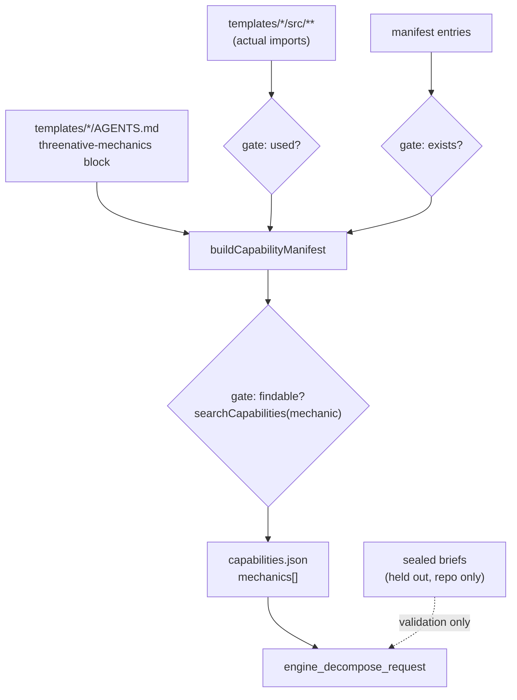

# PRD-299 — A game request decomposes into mechanics before it searches

**Status:** OPEN, filed 2026-08-31 against `77a68bec`. **Blocked on an owner ruling — see §0.**
Planning only.

**Outcome:** an agent handed *"build a tower defense game"* is answered with the mechanics that
request implies, the capabilities that serve each one, the mechanics the framework deliberately
does not own, and the template whose `AGENTS.md` already demonstrates this shape — instead of the
zero results it gets today. The abstractions a specific kind of game needs stop depending on
whether the agent happened to guess the framework's phrasing.

**Depends on:** PRD-297 (the number), PRD-298 (the floor and `notOwned`), PRD-300 (aliases) and
PRD-301 (coverage). It runs **last**: built on a measured, thresholded, fully-covered search rather
than compensating for one.

**Complexity: 7 → HIGH mode.** +3 (10+ files: 8 template docs, the generator, engine-mcp, gates),
+2 (new index and new tool), +2 (multi-package). Mandatory checkpoint after every phase, plus a
manual checkpoint at Phase 1 for the ruling.

---

## 0. The ruling this PRD needs before Phase 1

`docs/architecture/CHARTER.md` closes **a recipe/preset/genre system** with evidence: *"0 of 7
presets ever reproduced their genre. H1–H4 of the recipe benchmark: all fail."* That door stays
closed. This PRD is filed on the claim that a **read-only index over symbols that already exist**
is a different object from a preset, and that claim is the owner's to accept or reject — not the
implementing agent's.

| Closed, and stays closed | What this PRD adds |
| --- | --- |
| A preset that **generates** code for a genre | An index that **returns symbols that already exist** |
| A genre that ships a runtime abstraction | No export, no runtime type, no scaffold flag |
| A recipe the game inherits | A pointer to a template `AGENTS.md` the agent reads, then writes its own game |
| Scaffold-time behaviour | A read-only MCP answer, same tier as `engine_capability_detail` |

**Stop conditions, binding on every phase.** If a phase finds itself adding an exported symbol, a
`create-threenative` flag, a runtime type, or any generated game code, it has crossed the line and
must stop and re-open the ruling. The word "genre" does not appear in the tool name, the response
schema, or any shipped field: the unit is a **request**, decomposed into **mechanics**, and the
mechanics are the plain words the templates already use.

**Manual checkpoint:** the ruling is recorded in this file before Phase 1 begins. An unrecorded
ruling means the PRD stays OPEN and unstarted.

---

## 1. Context

**Problem:** the MCP server's own instructions tell the agent to *"decompose genres first"* and
nothing in the tree helps it decompose. `tower defense game` and `make a platformer with double
jump` return zero capabilities while `templates/defense/` and `templates/platformer/` ship.

**Files analysed:**

- `packages/engine-mcp/src/index.ts:186` — `AUTHORING_INSTRUCTIONS`: *"A genre label alone is not a
  capability query: clarify or decompose it; do not assume a preset."*
- `packages/engine-mcp/src/index.ts:246-280` — `TOOL_DEFINITIONS`, two tools
- `scripts/build-capability-manifest.ts:490-492` — the `.concat(...)` merge point for
  non-source-derived entries
- `packages/create-threenative/templates/*/AGENTS.md` — 8 files, 404–553 lines, `##` headings that
  are already plain-words mechanic names (`Waves and pacing`, `How to write gameplay here`)
- `docs/benchmark/genres/*/brief.md` — 7 sealed briefs, held out (see §2)
- `docs/architecture/CHARTER.md:119` — the closed door

**Current behaviour:**

- The instruction to decompose exists; the means does not.
- A template's `AGENTS.md` is the best per-shape guidance in the tree and is reachable only by
  scaffolding that exact template. An agent adding ThreeNative to an existing project never sees it.
- Nothing verifies that a template's documented mechanics are findable through the capability tool.
  A template can teach a vocabulary the search cannot answer, and today several do.

---

## 2. Solution

**Approach:**

- Each template's `AGENTS.md` gains one fenced `threenative-mechanics` block: plain-words mechanic
  → the capability symbols that serve it in that template. Authored where the guidance already
  lives, shipped with the template as it already ships.
- `buildCapabilityManifest` reads those blocks into a `mechanics` section of `capabilities.json`.
  No second manifest, no hand-maintained parallel list.
- Three build gates make the block unfakeable:
  1. **exists** — every symbol named is in `entries`;
  2. **used** — every symbol named is actually imported by that template's `src/`. A mechanic
     cannot claim a capability the template does not use;
  3. **findable** — `searchCapabilities(<mechanic phrase>)` must return at least one of the
     declared symbols above PRD-298's floor. A template cannot teach vocabulary the tool cannot
     answer. This is the gate that makes the whole batch self-enforcing.
- One new read-only tool, `engine_decompose_request`: request text in; mechanics, their
  capabilities, the `notOwned` mechanics from PRD-298, and the template `AGENTS.md` path out.
- **The sealed briefs are the held-out set.** They are never read to author a block. A repo-only
  gate asserts that each of the 7 briefs decomposes into a non-empty mechanic set with no brief
  text in any shipped artifact. Authoring against them would let a sweep arm read its own brief's
  answers out of the engine it is being scored on.

**Architecture:**



**Key decisions:**

- [ ] The index is built from **templates**, which ship, not from the sealed briefs, which must not.
- [ ] A mechanic is a phrase, not an identifier. No new vocabulary is minted; the words come from
      the template docs that already use them.
- [ ] `notOwned` mechanics appear in the decomposition. *"Tower defense needs saving between
      sessions; the framework does not own that — write it in `src/`."* A decomposition that only
      lists what exists teaches the agent that everything else is missing rather than not-ours.
- [ ] The response names a file to read, never a file to copy.
- [ ] Three gates, all at build time. A `mechanics` block that fails any of them fails `pnpm build`.

**Data changes:** `capabilities.json` gains `mechanics[]` (`{ mechanic, template, templateDoc,
symbols[] }`). Both copies regenerate. `MANIFEST_VERSION` moves to `3` (PRD-298 takes it to `2`).

---

## 3. Sequence flow

```mermaid
sequenceDiagram
    participant A as Authoring agent
    participant D as engine_decompose_request
    participant M as capabilities.json
    participant S as engine_search_capabilities
    A->>D: "build a tower defense game"
    D->>M: match request against mechanics[]
    M-->>D: place towers on a grid; waves and pacing; enemies path to the core; sell and upgrade
    D->>M: notOwned overlap
    M-->>D: persistence between sessions -> not owned
    D-->>A: mechanics + symbols + templates/defense/AGENTS.md + the not-owned note
    A->>S: engine_search_capabilities("enemies path to the core")
    S-->>A: NavigationAgent3D, NavigationRegion3D (verdict matched)
    A->>A: reads templates/defense/AGENTS.md, writes its own game
```

---

## 4. Integration Ledger

| # | New thing | Live caller (`file:line`, non-test) | Replaces | Old path removed? | Negative control |
|---|---|---|---|---|---|
| 1 | `threenative-mechanics` block in `templates/defense/AGENTS.md` | parsed by row 3 — TBD | nothing | n/a | delete the block: `tower defense game` returns to zero and the corpus row goes red |
| 2 | same block in the other 7 templates | parsed by row 3 — TBD | nothing | n/a | one per template, each closing a named corpus row |
| 3 | `scripts/template-mechanics.ts` parser + 3 gates | `buildCapabilityManifest` `scripts/build-capability-manifest.ts:490` — TBD | nothing | n/a | claim a symbol the template never imports: build must fail |
| 4 | `mechanics[]` in the manifest | emitted by row 3 — TBD | nothing | n/a | emit empty: the tool returns nothing and its tests go red |
| 5 | `engine_decompose_request` | `handleToolCall` `packages/engine-mcp/src/index.ts:315` + `TOOL_DEFINITIONS:246` — TBD | nothing | n/a | remove from `TOOL_DEFINITIONS`: the tools/list test goes red |
| 6 | held-out brief decomposition gate | `package.json:16` `budgets` chain — TBD | nothing | n/a | empty a brief's expected decomposition: gate must fail, not skip |

### Reachability

**How is this reached?** MCP tool call, through the `.mcp.json` that installing
`@threenative/core` writes (`packages/core/scripts/ensure-mcp.mjs`) — so a project that added
ThreeNative by hand reaches it too, not only a scaffolded one.

**Pre-existing files edited:** `packages/engine-mcp/src/index.ts` (`TOOL_DEFINITIONS`,
`handleToolCall`, `validateManifest`, `AUTHORING_INSTRUCTIONS`),
`scripts/build-capability-manifest.ts`, all 8 template `AGENTS.md`, `package.json`.

**Is this user-facing?** No human UI. The consumer is the authoring agent; the observable outcome
is the JSON it reads and the template file it then opens.

**Full flow:** agent receives "build a tower defense game" → `engine_decompose_request` →
mechanics, symbols, not-owned notes, `templates/defense/AGENTS.md` → agent searches each mechanic →
agent reads the template doc → agent writes its own game.

**What does this replace?** Nothing is deleted. `AUTHORING_INSTRUCTIONS` is rewritten in place to
point at the new tool rather than telling the agent to decompose unaided — the old wording is
replaced, not left beside the new one.

---

## 5. Execution phases

Phase 1 uses `defense` and `platformer` deliberately: they are the two templates whose genre
queries return **zero** today, which makes them the hardest real subjects available. Proving on
`starter`, which already has three manifest entries, would be a toy proof.

#### Phase 1: Two templates declare their mechanics, and the build refuses a fabricated claim

**Files (5):**

- `packages/create-threenative/templates/defense/AGENTS.md` — EDIT: mechanics block
- `packages/create-threenative/templates/platformer/AGENTS.md` — EDIT: mechanics block
- `scripts/template-mechanics.ts` — NEW: parser + exists/used/findable gates
- `scripts/build-capability-manifest.ts` — EDIT: emit `mechanics[]`, `MANIFEST_VERSION = 3`
- `scripts/__tests__/template-mechanics.spec.ts` — NEW

**Implementation:**

- [ ] Block grammar: one fenced `threenative-mechanics` section, `- <phrase> → Symbol, Symbol`
- [ ] **exists** gate against `entries`
- [ ] **used** gate: parse the template's `src/**` imports; a symbol not imported fails the build
- [ ] **findable** gate: `searchCapabilities(phrase)` must return one declared symbol above the
      PRD-298 floor
- [ ] All three fail the build with the template, the mechanic and the symbol named

**Wiring:**

- [ ] Caller edited: `buildCapabilityManifest:490` concatenates the parsed mechanics
- [ ] Registration: `pnpm build` writes both manifest copies
- [ ] Old path: n/a
- [ ] Ledger rows filled: #1, #3, #4

**Tests required:**

| Test file | Test name | Assertion | Negative control (must be observed red) |
|---|---|---|---|
| `scripts/__tests__/template-mechanics.spec.ts` | `should fail when a mechanic claims a symbol the template never imports` | throws naming template + symbol | claim `SpectralOcean` in `defense`: observed red |
| same | `should fail when a mechanic claims a symbol absent from the manifest` | throws naming the symbol | typo a symbol on purpose: red |
| same | `should fail when a declared mechanic phrase is not findable by search` | throws naming the phrase | write a mechanic in invented vocabulary: red — this is the gate that keeps the batch honest |
| same | `should emit one mechanics row per declared line` | count matches | delete a line: count drops, red |

**Revert check:** delete the `defense` mechanics block → the mechanics-count test and the
`tower defense game` corpus row both go red.

**Automated checkpoint:** `prd-work-reviewer`, with the integration audit, before Phase 2.
**Manual checkpoint:** the §0 ruling is recorded in this file.

---

#### Phase 2: The tool — a game request comes back decomposed

**Files (5):**

- `packages/engine-mcp/src/index.ts` — EDIT: `engine_decompose_request`, `validateManifest` for
  `mechanics`, `TOOL_DEFINITIONS`, `AUTHORING_INSTRUCTIONS`, `serverInfo.version → 0.4.0`
- `packages/engine-mcp/__tests__/search.spec.ts` — EDIT: tool-count and decomposition cases
- `packages/engine-mcp/__tests__/server.spec.ts` — EDIT: `tools/list` now lists three
- `scripts/fixtures/capability-recall/corpus.json` — EDIT: genre-level rows
- `scripts/fixtures/capability-recall/budget.json` — EDIT: new floor

**Implementation:**

- [ ] Input `request: string`; output `{ mechanics[], notOwned[], templates[] }`
- [ ] Fail closed: an empty or non-string request throws; a request matching nothing returns an
      explicit "no mechanic matched, decompose it yourself and search each part" verdict, never `[]`
      with no explanation
- [ ] `validateManifest` rejects a malformed `mechanics` section at server start
- [ ] `AUTHORING_INSTRUCTIONS` rewritten to point at the tool; the old "decompose unaided" wording
      is replaced, not kept alongside

**Wiring:**

- [ ] Caller edited: `handleToolCall:315`, `TOOL_DEFINITIONS:246`
- [ ] Registration: the tool appears in `tools/list`; `ENGINE_MCP_TOOL_NAMES` updated
- [ ] Old path: the superseded instruction wording removed
- [ ] Ledger rows filled: #5

**Tests required:**

| Test file | Test name | Assertion | Negative control (must be observed red) |
|---|---|---|---|
| `search.spec.ts` | `should decompose a tower defense request into placement, waves and pathing` | mechanics + `templates/defense/AGENTS.md` | run against the pre-Phase-1 manifest: red |
| `search.spec.ts` | `should name persistence as not owned in a decomposition` | `notOwned` non-empty | delete the PRD-298 row: red |
| `search.spec.ts` | `should throw on an empty request rather than returning an empty decomposition` | throws | return `[]` instead: red |
| `server.spec.ts` | `should expose exactly the three read-only capability tools` | length 3 | leave it at 2: red |

**Revert check:** remove the tool from `TOOL_DEFINITIONS` → `server.spec.ts` goes red.

**Automated checkpoint:** `prd-work-reviewer` before Phase 3.
**Manual checkpoint:** drive the real transport, not the function — pipe a `tools/call` JSON-RPC
line into the built server and read the returned JSON.

---

#### Phase 3: Three more templates

**Files (4):** `templates/shooter/AGENTS.md`, `templates/racing/AGENTS.md`,
`templates/action-rpg/AGENTS.md` — EDIT; `scripts/fixtures/capability-recall/corpus.json` — EDIT.

**Implementation:** the same block, the same three gates, one corpus row per genre query.
**Wiring:** parsed by the Phase 1 parser; `pnpm build` regenerates. Ledger row #2 (partial).
**Tests:** one `search.spec.ts` decomposition case per template; each red when its block is deleted.
**Revert check:** delete any one block → that genre's corpus row goes red.
**Automated checkpoint:** `prd-work-reviewer` before Phase 4.

---

#### Phase 4: The remaining templates and the held-out brief gate

**Files (5):** `templates/sailing/AGENTS.md`, `templates/minimal/AGENTS.md`,
`templates/starter/AGENTS.md` — EDIT; `scripts/template-mechanics.ts` — EDIT: held-out brief
validation; `package.json` — EDIT: the gate joins the `budgets` chain.

**Implementation:**

- [ ] Every template carries a block; a template without one fails the build (no silent opt-out)
- [ ] Held-out gate: each of the 7 sealed briefs decomposes into a non-empty mechanic set
- [ ] The gate reads brief text at run time and **writes none of it** anywhere
- [ ] A brief that fails is reported as an uncovered request shape, named — not skipped

**Wiring:** `package.json:16`. Ledger rows #2 (complete), #6.

**Tests required:**

| Test file | Test name | Assertion | Negative control (must be observed red) |
|---|---|---|---|
| `scripts/__tests__/template-mechanics.spec.ts` | `should fail when a template has no mechanics block` | throws naming it | remove one block: red |
| same | `should fail when a sealed brief decomposes to nothing` | throws naming the brief | stub an empty mechanics set: red |
| same | `should never write brief text into the manifest` | grep-equivalent assertion over both copies | inject a brief line on purpose: red |

**Revert check:** remove the held-out gate → `pnpm budgets` no longer catches an undecomposable
brief; demonstrate by emptying one template's block and showing the gate is what caught it.

**Automated checkpoint:** `prd-work-reviewer`, final.
**Manual checkpoint:** run one cold-agent build (`pnpm sandbox`) against a genre whose block landed,
and read the transcript for whether the decomposition was called and followed.

---

## 6. Verification plan

1. **Unit:** the 14 cases above, plus every pre-existing engine-mcp case still green.
2. **Gate proof (pasted):** `pnpm build && pnpm typecheck && pnpm lint && pnpm test && pnpm budgets`
3. **Transport proof — drive the real server, not the function:**

```sh
printf '%s\n' '{"jsonrpc":"2.0","id":1,"method":"tools/call","params":{"name":"engine_decompose_request","arguments":{"request":"build a tower defense game"}}}' \
  | node packages/engine-mcp/dist/index.js
# Expected: mechanics, symbols, notOwned, and templates/defense/AGENTS.md
```

4. **Integration proof:**

```sh
# 1. mechanics reached both shipped copies
node -e "for (const f of ['packages/create-threenative/capabilities.json','packages/core/capabilities.json']) { const m=require('./'+f); console.log(f, m.version, (m.mechanics||[]).length) }"
# Expected: both version 3, equal non-zero counts

# 2. No sealed brief text shipped
grep -rn "firing line\|Magazine 30\|endless runner" packages/create-threenative/capabilities.json packages/core/capabilities.json
# Expected: no output

# 3. Charter stop-condition check — no new runtime surface
git diff --stat -- packages/core/src packages/physics/src packages/ui/src
# Expected: no output. This PRD adds no export.

# 4. Revert check
git stash -- packages/create-threenative/templates/defense/AGENTS.md && pnpm build && pnpm budgets
# Expected: fails
git stash pop
```

5. **Negative controls with observed reds:** fabricated symbol claim; symbol absent from the
   manifest; unfindable mechanic phrase; deleted block; missing block; undecomposable brief;
   tool removed from `TOOL_DEFINITIONS`; empty request returning `[]`.

---

## 7. Acceptance criteria

- [ ] An agent handed *"build a tower defense game"* receives the mechanics that request implies,
      the capabilities serving each, what the framework does not own, and the path to
      `templates/defense/AGENTS.md` — the query that returns nothing today.
- [ ] The same holds for *"make a platformer with double jump"*.
- [ ] Every mechanic any template teaches is answerable by `engine_search_capabilities` — the
      **findable** gate makes a template that teaches unsearchable vocabulary fail the build.
- [ ] No template can claim a capability it does not import; demonstrated with a deliberately
      fabricated claim and its pasted red.
- [ ] All 7 sealed briefs decompose into a non-empty mechanic set, and no brief text appears in
      either shipped manifest; grep pasted.
- [ ] The decomposition works in a project that added ThreeNative by hand, not only a scaffolded
      one — proved through the `.mcp.json` that `@threenative/core` writes.
- [ ] `zeroResultRate` on the genre-level corpus rows falls to zero, pasted from `pnpm caps:recall`.

**Charter gates (this PRD is not done with any of these unchecked):**

- [ ] The §0 ruling is recorded in this file with its date and decision
- [ ] `git diff --stat` over `packages/*/src` is empty: no export, no runtime type, no scaffold flag
- [ ] The response names files to read; it generates no game code
- [ ] The word "genre" appears in no shipped field, tool name, or response schema

**Integration gates:**

- [ ] Ledger has zero `TBD` cells
- [ ] `engine_decompose_request` has a non-test consumer (`handleToolCall:315`), census pasted
- [ ] Revert check pasted
- [ ] Every gate has an observed red
- [ ] Proved on the real subject: `defense` and `platformer`, the two templates whose genre queries
      return zero today — not `starter`, which already has manifest entries

## 8. Not in scope

Whether a decomposed request produces a better game is a sweep question. `pnpm sweep:pair` against
a genre whose block landed is the arm that would answer it; it is **not owned by this PRD** and no
criterion above claims it. Filing it is follow-up work.
