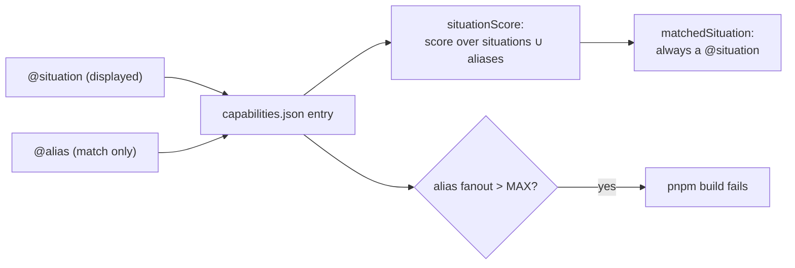

# PRD-300 — One capability, the several ways an agent actually asks for it

**Status:** OPEN, filed 2026-08-31 against `77a68bec`. Planning only.

**Outcome:** `third person camera follow` and `make a platformer with double jump` reach the
capabilities that serve them. A capability stops being findable only through the single phrasing
its author happened to write, and the phrasings that get added are the ones a measured corpus says
are missing — not the ones someone imagined.

**Depends on:** PRD-297 (the miss list is the work list, and the recall number is the acceptance)
and PRD-298 (the relevance floor and `rejectHits` are what stop this PRD from degenerating into
"add words until everything matches everything").

**Complexity: 5 → MEDIUM mode.** +2 (6–10 files), +2 (multi-package: `engine-mcp`, `scripts`,
`core`, `physics`, `ui`, `playtest` sources), +1 (doc-tag grammar change).

---

## 1. Context

**Problem:** matching is token overlap against hand-authored `@situation` phrases — 446 phrases for
210 entries, roughly two per capability — so a capability is reachable only from the wording its
author chose.

**Files analysed:**

- `packages/engine-mcp/src/index.ts:149-161` — `tokens`: lowercase, split on non-alphanumeric,
  drop stop words and 1-char tokens, crude plural stemming (`ies → y`, trailing `s`)
- `packages/engine-mcp/src/index.ts:163-186` — `situationScore`: set-overlap ratio + phrase bonus
- `scripts/build-capability-manifest.ts:210-249` — `parseDocumentation`, the tag regex
  `/^@(situation|constraint|example|override|supersedes)\b/`
- `scripts/build-capability-manifest.ts:439-464` — `validateDocumentation`, which fails the build
  for an export with no `@situation`
- `packages/core/src/index.ts` — 103 `@situation` lines, the largest tag surface

**Current behaviour:**

- `third person camera follow` → zero results, though camera damping and `CameraShake` exist.
- `make a platformer with double jump` → zero results, though `templates/platformer/` ships.
- `pick up an item` → `ClusteredMesh`, a token coincidence.
- `@situation` serves two jobs at once: it is the match key **and** the `matchedSituation` string
  shown back to the agent to explain the hit. Adding ten phrasings to improve matching would
  degrade the explanation and inflate both manifest copies.

---

## 2. Solution

**Approach:**

- Split the two jobs. `@situation` stays the readable, displayed phrase. A new `@alias` tag carries
  short additional match keys that are never displayed as `matchedSituation`.
- **Aliases are borrowed vocabulary only.** Godot node and feature names, Three.js terms, Rapier
  terms, and the plain phrases the corpus proves agents type. No invented framework word ever
  becomes an alias; that is the charter rule, applied to the search index.
- The work list is the miss list. Every alias added must close a corpus row that fails today, and
  the commit pastes the row moving from miss to hit.
- Three anti-cheat gates, because "add words until recall is 100%" is the obvious way to fake this:
  1. an alias appearing in more than `MAX_ALIAS_FANOUT` entries fails the build — a genre word
     like `racing` or `shooter` cannot be smeared across the manifest;
  2. an alias colliding with a PRD-298 `notOwned` situation fails the build;
  3. `rejectHits` from PRD-297 may not rise. Recall bought by precision is not recall.

**Architecture:**



**Key decisions:**

- [ ] One new tag, not a synonym dictionary. A central synonym table is a hand-maintained parallel
      list, and this repository has logged that drift five times. Aliases sit on the declaration
      they describe and are generated out of it like every other tag.
- [ ] `matchedSituation` never returns an alias. The agent always sees a sentence, never a keyword.
- [ ] `tokens()` is left alone unless the corpus shows a tokenisation miss specifically. Changing
      the stemmer moves every score at once and is a separate, riskier change.
- [ ] `validateDocumentation` continues to require `@situation`; `@alias` is optional and additive.

**Data changes:** each manifest entry gains `aliases: string[]`. Both copies regenerate.

---

## 3. Sequence flow

```mermaid
sequenceDiagram
    participant A as Authoring agent
    participant T as engine_search_capabilities
    participant M as capabilities.json
    A->>T: "third person camera follow"
    T->>M: tokens over situations ∪ aliases
    M-->>T: hit via alias "third-person camera"
    T-->>A: verdict matched, matchedSituation = "frame a character from behind without the camera clipping the world"
    Note over T,A: the alias matched; the agent is shown the sentence, not the keyword
```

---

## 4. Integration Ledger

| # | New thing | Live caller (`file:line`, non-test) | Replaces | Old path removed? | Negative control |
|---|---|---|---|---|---|
| 1 | `@alias` in the tag regex | `scripts/build-capability-manifest.ts:220` `parseDocumentation` — TBD | nothing | n/a | remove `alias` from the regex: the tag becomes summary prose and the corpus rows regress |
| 2 | `aliases` on each entry | emitted at `scripts/build-capability-manifest.ts:479` — TBD | nothing | n/a | emit an empty array for all: corpus rows go red |
| 3 | alias matching in `situationScore` | `packages/engine-mcp/src/index.ts:163` — TBD | situations-only matching | superseded in place | score over situations only: the new rows go red |
| 4 | `MAX_ALIAS_FANOUT` gate | `buildCapabilityManifest` — TBD | nothing | n/a | add `@alias racing` to three entries and observe the build fail |
| 5 | authored aliases in package sources | the declarations themselves — TBD | nothing | n/a | each alias closes a named corpus row; deleting it reopens that row |

### Reachability

**How is this reached?** Same MCP tool call as PRD-298. The aliases enter the shipped manifest via
`pnpm build`, which already regenerates both copies.

**Pre-existing files edited:** `scripts/build-capability-manifest.ts`,
`packages/engine-mcp/src/index.ts`, and the package `src/index.ts` files carrying the tags.

**Is this user-facing?** No. The consumer is the authoring agent.

**Full flow:** author adds `@alias` beside an existing `@situation` → `pnpm build` regenerates →
the agent's query matches through the alias → the agent is shown the readable situation.

**What does this replace?** Nothing is deleted. Alias matching is added inside the existing scoring
function rather than beside it — there is no second scorer.

---

## 5. Execution phases

#### Phase 1: The tag — an alias makes a capability findable and never shows up as the explanation

**Files (5):**

- `scripts/build-capability-manifest.ts` — EDIT: regex, `IParsedDocumentation`, emission, fanout gate
- `packages/engine-mcp/src/index.ts` — EDIT: score over situations ∪ aliases; `matchedSituation`
  restricted to situations
- `packages/core/src/index.ts` — EDIT: aliases for the camera and traversal misses only
- `packages/engine-mcp/__tests__/search.spec.ts` — EDIT: the two named misses become passing cases
- `scripts/fixtures/capability-recall/budget.json` — EDIT: improved floor

**Implementation:**

- [ ] Extend the tag regex and the merge/dedupe path exactly as the other tags do
- [ ] `MAX_ALIAS_FANOUT` enforced at build time with the offending alias and entries named
- [ ] Author aliases for the corpus rows this phase claims — camera framing and platformer
      traversal — and no others; unbounded tagging is the next phase's decision, not a free-for-all
- [ ] `matchedSituation` must be a `@situation` even when the alias produced the hit

**Wiring:**

- [ ] Caller edited: `parseDocumentation:220`, `situationScore:163`
- [ ] Registration: `pnpm build` regenerates both manifest copies
- [ ] Old path: none removed — additive inside the live scorer
- [ ] Ledger rows filled: #1, #2, #3, #4

**Tests required:**

| Test file | Test name | Assertion | Negative control (must be observed red) |
|---|---|---|---|
| `search.spec.ts` | `should find camera framing from third-person vocabulary` | verdict matched, expected symbol | delete the alias, rebuild: red — paste it |
| `search.spec.ts` | `should explain an alias hit with a readable situation` | `matchedSituation` is a `@situation` string | return the alias instead: red |
| `scripts/__tests__/build-capability-manifest.spec.ts` | `should fail when one alias spans more than MAX_ALIAS_FANOUT entries` | throws naming the alias | add `@alias racing` to three fixture entries: observed red |
| `scripts/__tests__/capability-recall.spec.ts` | `should hold rejectHits at or below the floor` | number not risen | add a deliberately broad alias: must go red |

**Revert check:** remove `alias` from the tag regex → the two new `search.spec.ts` cases and the
`pnpm budgets` recall floor both go red.

**User verification:**

- Action: `pnpm build && pnpm caps:recall`
- Expected: the two named rows move from miss to hit; `rejectHits` unchanged or lower.

---

#### Phase 2: Close the measured miss list across the remaining packages

**Files (5):**

- `packages/core/src/index.ts` — EDIT: remaining core misses
- `packages/physics/src/**` — EDIT: navigation and body misses
- `packages/ui/src/index.ts` — EDIT: HUD and state misses
- `scripts/fixtures/capability-recall/corpus.json` — EDIT: rows for any phrasing found while working
- `scripts/fixtures/capability-recall/budget.json` — EDIT: the new floor

**Implementation:**

- [ ] Work strictly from `pnpm caps:recall`'s miss list; a row that is honestly not-owned goes to
      PRD-298's `notOwned` instead of getting an alias
- [ ] Every alias traceable to a corpus row in the commit message
- [ ] Stop when the remaining misses are all genuinely unowned mechanics, and say so in the record

**Wiring:**

- [ ] Caller edited: the package `src/index.ts` declarations already feeding the generator
- [ ] Registration: `pnpm build`
- [ ] Old path: n/a
- [ ] Ledger rows filled: #5

**Tests required:**

| Test file | Test name | Assertion | Negative control (must be observed red) |
|---|---|---|---|
| `scripts/__tests__/capability-recall.spec.ts` | `should raise recallAtK above the previous floor` | new > old | run against the previous commit's manifest: must fail |
| `search.spec.ts` | one named case per newly-closed mechanic family | symbol present | delete that family's aliases: red |

**Revert check:** revert the alias commit → `pnpm budgets` fails on the `recallAtK` floor.

**User verification:**

- Action: `pnpm caps:recall --json`
- Expected: the remaining miss rows are all mechanics the framework genuinely does not own, each
  answered by a `notOwned` guidance row rather than silence.

---

## 6. Verification plan

1. **Unit:** the 6 cases above; the ~20 pre-existing `search.spec.ts` cases still green.
2. **Gate proof (pasted):** `pnpm build && pnpm typecheck && pnpm lint && pnpm test && pnpm budgets`
3. **Integration proof:**

```sh
# 1. Aliases reached both shipped copies
node -e "for (const f of ['packages/create-threenative/capabilities.json','packages/core/capabilities.json']) { const m=require('./'+f); console.log(f, m.entries.filter(e=>(e.aliases||[]).length).length, 'entries with aliases') }"
# Expected: both non-zero and equal

# 2. No alias is ever returned as an explanation
node -e "const m=require('./packages/create-threenative/capabilities.json'); const a=new Set(m.entries.flatMap(e=>e.aliases||[])); console.log([...a].length,'aliases')"
# then assert in search.spec.ts that no matchedSituation is a member of that set

# 3. Revert check
git stash -- packages/core/src/index.ts && pnpm build && pnpm budgets   # Expected: fails on recallAtK
git stash pop
```

4. **Negative controls with observed reds:** removed tag regex entry; empty `aliases` emission;
   situations-only scoring; `@alias racing` fanout; broad alias raising `rejectHits`.

---

## 7. Acceptance criteria

- [ ] An agent asking for a third-person camera, or for platformer traversal, reaches the
      capabilities that serve it — the two queries that return nothing today.
- [ ] `recallAtK` is strictly above its PRD-298 floor and `rejectHits` is not above it — both
      pasted from `pnpm caps:recall`.
- [ ] Every hit an agent sees is still explained by a readable sentence; no keyword is ever shown
      as the reason a capability appeared.
- [ ] No single alias can make a genre word match many capabilities — the build refuses it, red
      pasted.
- [ ] Every alias in the diff names the corpus row it closes.
- [ ] No alias is an invented framework word; each is Godot, Three.js, Rapier, or corpus-attested
      plain phrasing.

**Integration gates:**

- [ ] Ledger has zero `TBD` cells
- [ ] Alias matching lives inside the existing scorer — grep shows one scoring function, not two
- [ ] Revert check pasted
- [ ] Every gate has an observed red
- [ ] Proved on the real subject: the corpus miss list, not a fixture
