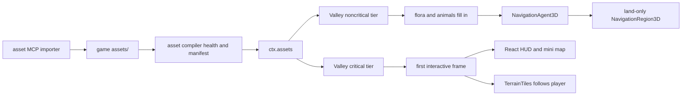

# PRD-315 — Wildwood is the AAA-quality game and engine proof

**Status: PROPOSED, 2026-09-01.** The production subject is
`/home/joao/projects/threenative/sandbox/wildwood`. Engine baseline inspected at
`b14b27b9`; game baseline inspected at `146e172`. The editable source repository for
`threenative-asset-mcp` was not present in this session, so Phase 4 must resolve and pin it before
changing the importer. Never patch the installed copy under `node_modules`.

**Complexity:** +3 touches 10+ files, +2 crosses the engine, the game and the external asset MCP,
+2 carries asynchronous load/navigation/residency state across frames, +1 integrates marketplace
content, +2 adds measured runtime and conversion gates = **10 → HIGH mode**. During execution,
run the `prd-work-reviewer` checkpoint after every phase and repair all HIGH findings before the
next phase.

**Goal:** make Wildwood look, move and perform at an **AAA-quality level**, and make the engine
preserve that quality instead of depending on one game's corrective hacks. Wildwood owns the art
direction — composition, materials, lighting, UI, loading art and detail placement. The engine,
asset pipeline and harness own the portable mechanisms and fail-closed measurements that keep
high-quality source assets high quality: conversion fidelity, fresh compiled bytes, navigation,
bounded terrain residency, frame budgets and cross-platform proof.

## 1. Integration Ledger

Every row names the live consumer before implementation. `→impl` must become a real non-test line
at that row's phase checkpoint. A phase is incomplete while its row has no non-test caller.

| # | Change | Live consumer and reachability | Replaces or removes | Negative control |
|---|---|---|---|---|
| 1 | Codec-aware glTF reader for asset health | `packages/assets/src/health.ts:125→impl`, reached by the existing compile health pass and dev watcher | Bare `NodeIO` that cannot decode `EXT_meshopt_compression` | Remove `meshopt.decoder`; a compressed Wildwood fixture must fail with `TN_ASSETS_MODEL_UNREADABLE` |
| 2 | Critical/noncritical Wildwood load tiers | `sandbox/wildwood/src/scenes/Valley.ts:141→impl`, reached by `Scene.load` then a scene-owned post-enter task | One blocking promise over ground, 52 flora species and six sequential animals | Put animals back in the critical tier; the startup time/byte gate must go red |
| 3 | Loading appearance covers the wait it describes | `sandbox/wildwood/src/scenes/Valley.ts:238→impl` creates it before noncritical work; `src/render/loading.ts:→impl` owns its look | Near-white blank field and a bar created only after the long `load()` finishes | Delay critical terrain by 800 ms; the first captured frame must still be the authored loading view, not white or transparent |
| 4 | Adapter package tests execute their Vitest suites | `packages/raw-unreal/package.json:→impl` and `packages/ueformat/package.json:→impl`, reached by each package's `pnpm test` | Build-plus-publint scripts that report green without running 58 adapter/parser tests | Break winding repair in each adapter; both package test commands must fail |
| 5 | Reproducible animal conversion/fidelity audit | `threenative-asset-mcp/src/unreal/importer.ts:→impl`, invoked by `fab_import_unreal_asset`; production consumer `sandbox/wildwood/tools/fetch-animals.mjs:→impl` | Stale report provenance and game-side percentile triangle deletion | Corrupt one skin index, normal, material group or forward transform; the fresh-pack audit must fail by name |
| 6 | Source-correct animal geometry | `sandbox/wildwood/src/entities/animals/Animal.ts:111→impl` consumes audited GLBs without rewriting indices | `stripJunkTriangles` at `Animal.ts:387`, deleted in Phase 4 | Reintroduce the percentile filter; triangle/material-group identity must fail |
| 7 | Recast-backed animal travel around water | `sandbox/wildwood/src/entities/animals/Animal.ts:→impl`, created by `spawnWildwoodAnimals.ts:→impl` after the valley bakes a land-only region | Straight-line heading integration that knows no water or obstacle | Restore direct position integration; the deterministic lake crossing must fail |
| 8 | Measured model-forward orientation | `Animal.ts:220→impl`, with per-spec authored correction from the audited pack | Six unproven `yawOffset: 0` values | Add 180 degrees to fox correction; displacement/forward dot-product gate must fail |
| 9 | Cartographic HUD and mini map | `sandbox/wildwood/src/ui/Hud.tsx:→impl`, reached from the existing React overlay and 10 Hz published state | Cyan monospace HUD whose own comment explicitly rejects a map | Freeze player coordinates; the moving-map observation must fail while the scene continues moving |
| 10 | Close-range lighting and surface fidelity | `sandbox/wildwood/src/render/lighting.ts:→impl`, called by `Valley.enter` | One 2048² shadow map spread over 220 m without an A/B showing shadows are the asset defect | Restore the 220 m shadow frustum; close-contact shadow score must regress without changing model geometry |
| 11 | Bounded large terrain | `sandbox/wildwood/src/scenes/Valley.ts:→impl` constructs shipped `TerrainTiles` and follows the walker | One always-resident 190 m heightfield; no new engine streamer | Disable `follow`; the 1,024 m route must leave the resident region or exceed its tile budget |
| 12 | At most two evidence-winning marketplace props | `sandbox/wildwood/src/render/landmarks.ts:→impl` places the chosen authored assets | No blanket pack import; rejected candidates leave no bytes | Remove the candidate from the A/B arm; the blinded preference must return to chance or the asset is deleted |

### Reachability and incumbents



The incumbent census is binding:

- `@threenative/assets` already optimizes models and already prepares Meshopt and conditional Draco
  decoders in `packages/assets/src/passes/model.ts`; health alone rebuilt a less-capable reader.
- `@threenative/physics/navigation` already ships `recast`, `NavigationRegion3D`, and
  `NavigationAgent3D`. Wildwood must consume them instead of writing pathfinding.
- `@threenative/core` already ships `clipPoseError`, `clipTrackBindings`, `clipBoneCoverage`,
  `boneContact`, `FrameBudget`, instanced/clustered batches, and `TerrainTiles`.
- `TerrainTiles` streams generated terrain render geometry and its collider under hard tile/byte
  budgets. It does **not** stream arbitrary flora or prop assets. PRD-253's general content
  residency remains blocked on a native consumer; this PRD does not silently recreate it.
- `@threenative/raw-unreal` directly reads only supported uncooked **static** meshes.
  `@threenative/ueformat` parses `.uemodel`, emits skin attributes, and deliberately returns
  `Mesh`/`LOD` with skeleton metadata rather than a bound `SkinnedMesh`. Neither is an animated
  Animal Variety Pack loader today.

## 2. Evidence: what is actually wrong

### 2.1 Startup is both slow and falsely presented

A cold local `?lowtier` run reached `DOMContentLoaded` at 352 ms and
`window.__TN_STARTUP_READY__` at **6,910 ms**. Markers attributed the interval as follows:

| Marker | Time after navigation |
|---|---:|
| ground and maps | 1.13–1.23 s |
| rocks | 2.55 s |
| ferns | 3.72 s |
| shrubs and cliffs | 4.45 s |
| grasses | 4.72 s |
| broadleaf and conifers | 5.47–5.68 s |
| six animals | 5.68–6.33 s |
| valley built and warmup | 6.52–6.60 s |
| HDRI | 6.81 s |

`Valley.load()` blocks entry on ground, every flora species and then six animals. The loading
controller is not created until `Valley.enter()` at line 266, after that blocking work. Its
background is `palette.skyLow` (`0xf0f4ee`) with no image, logo or status. The reported white bar
is therefore two defects: too much critical work and a loading view that starts after the work it
claims to show.

There is also an engine failure upstream of those bytes. Wildwood's dev watcher currently fails
its initial compile at `packages/assets/src/health.ts:125`:

```text
TN_ASSETS_WATCH_FAILED: initial compile failed:
TN_ASSETS_MODEL_UNREADABLE: ... SM_BoughGroup01.glb ...
[EXT_meshopt_compression] Please install extension dependency, "meshopt.decoder".
```

The source pine is 9.2 MB with Meshopt; the stale public copy observed during the failed watcher
run was 37.5 MB, and an older dist copy was 127.3 MB. The source fox is 4.5 MB while the stale
public copy was 19.5 MB. `assets.models: "none"` promises byte-identical copies, so a successful
fresh compile must make source and served hashes identical. Startup work is not allowed to begin
by optimizing around stale output.

### 2.2 The animal symptom has three separate causes

1. **Movement is game-broken.** `Animal.update()` moves directly along a heading and clamps only
   to rectangular world bounds. It has no lake, pond, terrain slope or obstacle input.
2. **Orientation is unproved.** The model uses `heading + yawOffset`; every animal currently sets
   the offset to zero. A comment is not a forward-axis measurement, and the observed backwards fox
   is a failed convention until the movement/forward dot product proves otherwise.
3. **Geometry is mutated after import.** `stripJunkTriangles()` computes a 1st–99th percentile
   world box and deletes any triangle without two vertices inside. That can remove legitimate
   antlers, ears, tails and fur cards and then rebuild material groups. It is a symptom workaround
   capable of creating the deformed deer it was meant to hide.

The importer report is useful but not sufficient. It records importer 45 and converter
`4.27.2.0+threenative.8`, 115 packages, six skeletal exports, zero failures, and 109 attached
ActorX clips. It also reports eight unsupported material inputs, one heuristic binding, four
sidecar textures and three explicit fallback material sections. Current deer models contain
12,588/13,548 vertices; fox contains 11,316. They are not inherently PS1-sized meshes. Material,
normal, alpha, skin, repack or game-side geometry damage remains plausible and must be separated
by A/B evidence.

There is a provenance defect too: the checked-in Wildwood report says importer **45**, while the
installed `threenative-asset-mcp@0.7.0` module inspected in this game exports
`IMPORTER_VERSION = 43`. A report from one implementation and a rerun through another is not a
reproducible proof.

### 2.3 The adapters work inside narrower contracts

The actual Vitest suites, which the package-local `test` scripts currently omit, are green:

```text
packages/raw-unreal: 3 files, 21 tests passed
packages/ueformat:    4 files, 37 tests passed
```

The raw adapter correctly creates indexed `BufferGeometry`, normals, UVs, material groups and
bounds for its supported static formats. The UEFormat adapter validates LODs, coordinate/winding
conversion, tangents, UVs, morphs and four skin weights. It does not bind parsed bones into a
Three.js skeleton or import the Animal pack's uncooked skeletal `.uasset` files. The earlier
decision not to route uncooked Animal Variety Pack data through CUE4Parse/`.uemodel` remains sound:
do not add a second uncooked LOD decoder to reach the same GLB.

### 2.4 “PS1” is not yet a shadow-map diagnosis

The current key light puts 2,048 shadow texels over 220 m: about **10.7 cm per texel** before
projection and filtering. That is too coarse for crisp hoof/contact detail, but it does not explain
missing silhouettes or broken deer geometry. Screenshots also show flat ground repetition,
washed midtones and limited foreground detail. Phase 7 measures importer/repack/model fidelity
first, then tunes the game's lighting, terrain material and post chain. No appearance default moves
into an engine package.

## 3. Product outcome and non-goals

The outcome is a polished Wildwood vertical slice where a player reaches a coherent valley
quickly, reads a naturalistic map, sees correctly shaded animals face their travel direction and
route around water, and can walk a kilometre-scale terrain without repetition, visible residency
failure or unbounded geometry. It must hold up in still frames **and** in motion: close surfaces,
animal deformation, shadow contact, animation transitions, camera travel, streaming and UI are
one quality bar.

### The AAA-quality bar

“AAA” is the target and this PRD makes it falsifiable across six player-visible dimensions:

| Dimension | Wildwood bar | Engine/harness guarantee |
|---|---|---|
| Asset fidelity | Production animals and Landscape Pro retain source silhouette, normals, skinning, material sections, alpha and texture intent through import, repack and serve | Conversion differential fails closed; source/report/tool versions agree; stale or undecodable output cannot run |
| Art direction | Forest loading view, field-map UI, terrain, foliage, animals, landmarks, lighting and post read as one natural world at close, mid and far cameras | Engine owns no look; fixed visual arms and blind comparisons catch regressions |
| Detail hierarchy | Unique foreground detail inside 20 m, readable authored forms from 20–80 m, and stable terrain/forest silhouettes beyond 80 m; obvious tiling, faceting, floating contact and repeated hero props are release failures | Bounded tiles/instance cells, LOD observations and camera-route captures expose pop, repetition and residency |
| Motion and behaviour | No backwards locomotion, foot/ground separation, skin tearing, water walking or obstacle tunnelling in the production route | Clip audits, forward/displacement measurements, contacts and Recast navigation are reusable engine mechanisms |
| Responsiveness | Authored first frame, controllable valley in 2.5 s p95, no post-entry task over 100 ms, no streaming hitch over 50 ms | Startup/resource markers and frame budgets are playtest observations, not console anecdotes |
| Runtime | Quality tier targets 60 fps at its pinned desktop resolution: CPU and GPU p95 each ≤16.7 ms after warmup; fallback tier targets 30 fps at its pinned mobile resolution: p95 ≤33.3 ms; no tier silently changes asset fidelity | Named adapter/device, resolution, quality tier, steady-state window and native target are recorded with every claim |

The visual release review uses the fixed close/mid/far route from Phase 7, the source/reference
turntables from Phase 4, and a blind ten-pair judgment. **At least 8 of 10** judgments must prefer
the final arm over Phase 0, and no individual dimension above may regress. A pretty still frame
cannot compensate for a hitch, backwards fox or broken deer; a fast empty scene cannot compensate
for flat materials or repeated terrain.

This PRD does **not**:

- use “AAA” as an unmeasured adjective or as permission to add unbounded content; the table above
  and §5 define the quality, distance, residency, frame and visual gates;
- add direct uncooked skeletal `.uasset` loading to `@threenative/raw-unreal`;
- bind UEFormat skeletons just to bypass the proven importer;
- move materials, lighting, HUD, map style or loading art into engine packages;
- import more marketplace packs before the current Landscape Pro and Animal packs survive fresh
  conversion, compile and visual A/B gates.

## 4. Execution phases

Each phase touches at most five files, edits at least one pre-existing file, lands red and green in
the same commit, and receives a fresh `prd-work-reviewer` checkpoint.

### Phase 0 — freeze a reproducible Wildwood baseline

**Files (4):**

1. `sandbox/wildwood/tools/run-playtests.mjs` — add a cold-start measurement arm that records
   navigation, first authored loading frame, critical-ready, startup-ready, transferred bytes and
   the largest resources.
2. `sandbox/wildwood/tools/measure-animals.mjs` — report source/served hash, primitives,
   triangles, attributes, skin/clip counts, material groups, normal/tangent validity and posed
   bounds for all six production GLBs.
3. `sandbox/wildwood/src/dev/animals.ts` — publish deterministic movement, model-forward and
   water-overlap observations from the real production subjects.
4. `docs/verification/PRD-315-phase0.md` — pin engine/game/MCP versions, adapter commands,
   WebGPU adapter, viewport, five-run distributions and screenshots.

**Red proof:** the current run must record approximately the observed 6.91 s startup, the report
45/module 43 mismatch, stale served/source hash mismatches if still present, backwards-facing
motion if reproducible, and water intersections. A missing observation fails the phase.

**Stop gate:** if a fresh source/served compile, without any code change, removes the visual animal
defect, importer edits leave scope; the PRD continues with startup, navigation, UI and world work.

### Phase 1 — make compressed source assets compile and serve freshly

**Files (5):**

1. `packages/assets/src/health.ts` — consume the same codec-aware reader contract as the model pass.
2. `packages/assets/src/passes/model.ts` — call the shared reader; preserve lazy Draco loading and
   `MeshoptDecoder.ready` ordering.
3. `packages/assets/src/gltf-io.ts` — new internal reader factory for Meshopt, Draco-on-demand,
   registered extensions and virtual geometry.
4. `packages/assets/__tests__/health.spec.ts` — red/green compressed-input health test.
5. `packages/assets/__tests__/watch.spec.ts` — initial watcher compile over a Meshopt source and
   byte-identical `models: "none"` assertion.

**Consumer acceptance:** starting Wildwood from empty `public/` writes a manifest and served files;
every `models: "none"` source/served SHA-256 pair matches. No stale public asset is accepted as a
fallback. The production `SM_BoughGroup01.glb` is the final subject after the synthetic red test.

### Phase 2 — enter on a useful valley, then fill detail under scene ownership

**Files (5):**

1. `sandbox/wildwood/src/scenes/Valley.ts` — define explicit `critical` and `detail` tiers. Critical
   is the authored loading view, ground maps, terrain/collider, water, one near-camera tree/ground
   species and the proof asset. Detail flora, landmark variants, animals and HDRI continue after
   entry; a scene generation token prevents late attachment after exit and releases loaded assets.
2. `sandbox/wildwood/src/entities/animals/spawnWildwoodAnimals.ts` — load unique animal GLBs in
   parallel and clone placements only after their source resolves.
3. `sandbox/wildwood/src/render/loading.ts` — forest illustration/texture, dark lichen field,
   warm trail mark, honest status text and no near-white full-screen frame.
4. `sandbox/wildwood/tools/run-playtests.mjs` — five cold runs, critical and total byte census.
5. `sandbox/wildwood/playtests/startup.playtest.json` — first-frame, readiness, diagnostics and
   progress assertions.

**Consumer acceptance:** on the Phase 0 machine and named hardware WebGPU adapter, five cold runs
have critical-ready p95 ≤ **2.5 s**, critical transfer ≤ **25 MB**, no blank/white first frame, and
no main-thread stall > **100 ms** after entry. Full detail may continue for at most 8 s, but the
walker, terrain, water, pause and HUD work during it. A rejected detail load names its asset and
does not erase the playable critical tier.

### Phase 3 — make loader adapter tests honest

**Files (4):**

1. `packages/raw-unreal/package.json` — package `test` runs Vitest, build and strict publint.
2. `packages/ueformat/package.json` — same.
3. `packages/raw-unreal/__tests__/three.spec.ts` — assert group/index/bounds identity on the real
   supported pine fixture and rejection of unsupported skeletal/cooked input.
4. `packages/ueformat/__tests__/three.spec.ts` — assert skin attributes and skeleton metadata while
   explicitly proving the returned object is not a bound `SkinnedMesh`.

**Consumer acceptance:** both package-local commands run all 58 current tests. Documentation and
capability constraints continue to say static-only raw UAsset and unbound UEFormat skeletal data.
No Wildwood code changes loader route in this phase.

### Phase 4 — prove and repair the animal conversion chain

**Prerequisite:** clone or locate the editable `threenative-asset-mcp` repository, pin its commit,
and run its own `AGENTS.md` instructions. Reinstall Wildwood from a packed artifact of that exact
commit. The installed module's `IMPORTER_VERSION`, report version and cache key must agree.

**Files (5):**

1. `threenative-asset-mcp/src/unreal/importer.ts` — emit fidelity/provenance fields or repair only
   the transform/material/skin defect demonstrated by Phase 0.
2. `threenative-asset-mcp/src/unreal/cue4parse-adapter.ts` — edit only if the measured defect is in
   the pinned uncooked decoder; do not add the rejected `.uemodel` detour.
3. `threenative-asset-mcp/tests/unreal-import.integration.test.ts` — fresh SK_Fox plus deer production
   regression and a corrupted control.
4. `sandbox/wildwood/tools/measure-animals.mjs` — compare fresh unoptimized import to repacked GLB
   with source identity, silhouette, attributes, material groups and clip pose measurements.
5. `sandbox/wildwood/src/entities/animals/Animal.ts` — delete `stripJunkTriangles`; consume the
   audited model unchanged.

**Required measurements:**

- fresh import retains the report's mesh/skin/clip/material-section counts and finite bounds;
- every index is in range; normals are finite and unit length within 0.02; tangents are finite;
- every skinned vertex has finite normalized weights and valid bone indices;
- repack versus import has identical primitive/material grouping, silhouette IoU ≥ **0.995** over
  eight turntable views, and `clipPoseError` p95 ≤ **0.5°** on the selected idle/walk clips;
- `clipTrackBindings` has zero unresolved tracks and `clipBoneCoverage` does not regress from the
  fresh import;
- fur sections retain alpha mode, double-sidedness and texture binding; unsupported material
  inputs stay explicit in the report rather than silently becoming a wrong PBR slot.

If the importer and repack pass these gates, no importer code is changed. The defect is then in
game material/lighting or the deleted triangle filter, and the verification record says so.

### Phase 5 — animals face travel and route around water

**Files (5):**

1. `sandbox/wildwood/src/game.ts` — install `rapier()` then `recast()` in the documented order.
2. `sandbox/wildwood/src/scenes/Valley.ts` — bake one walkable region from land and obstacles,
   excluding lake and pond footprints plus species body radius.
3. `sandbox/wildwood/src/entities/animals/Animal.ts` — choose wander/flee targets and follow
   `NavigationAgent3D` waypoints; animation speed follows measured travel speed.
4. `sandbox/wildwood/src/entities/animals/spawnWildwoodAnimals.ts` — create/dispose agents with the
   scene and publish species/body-radius/forward diagnostics.
5. `sandbox/wildwood/playtests/animals-navigation.playtest.json` — deterministic three-minute
   crossing, flee and shoreline scenario.

**Consumer acceptance:** ground animals record zero water overlaps over 180 deterministic seconds,
reach three targets on opposite sides of water, never leave navigable land, and have transformed
model-forward · displacement-normal ≥ **0.9** for 95% of samples above 0.1 m/s. The fox's explicit
180-degree mutation fails. Crow flight stays a separate authored movement mode and is not forced
onto the ground navmesh.

### Phase 6 — replace the sci-fi overlay with a field map

**Files (5):**

1. `sandbox/wildwood/src/ui/Hud.tsx` — compact compass, topographic mini map, player heading,
   water, trail and discovered landmarks; undiscovered landmarks do not leak exact positions.
2. `sandbox/wildwood/src/ui/Menu.tsx` — match the same field-journal language.
3. `sandbox/wildwood/src/style.css` — bark/lichen/parchment palette, humanist text, softened panels;
   debug overlay remains clearly separate.
4. `sandbox/wildwood/src/world/landmarks.ts` — expose authored map geometry and discovery metadata,
   not DOM drawing choices.
5. `sandbox/wildwood/native-playtests/react-hud.playtest.json` — web and native overlay visual,
   safe-area, motion and text assertions.

**Consumer acceptance:** player marker moves and rotates from the existing 10 Hz state, water and
trail align with world coordinates within 2 map pixels at the test viewport, only discovered
landmarks are located precisely, no cyan/monospace game panel remains, and native transparent
overlay still exposes the world behind it.

### Phase 7 — isolate asset fidelity from lighting and terrain fidelity

**Files (5):**

1. `sandbox/wildwood/src/render/lighting.ts` — player/camera-centred, texel-stable close shadow
   window with an authored far-light fallback; all values remain game source.
2. `sandbox/wildwood/src/render/terrain.ts` — measured macro variation and close material response,
   without hiding conversion defects in noise.
3. `sandbox/wildwood/src/render/postprocessing.ts` — remove washed highlights or oversharpening only when the
   channel A/B attributes it to post.
4. `sandbox/wildwood/tools/look.mjs` — fixed close/mid/far cameras plus unlit, normal-only,
   base-colour-only, shadow-only and final-lit arms.
5. `sandbox/wildwood/playtests/visual-fidelity.playtest.json` — nonblank, visual, performance and
   diagnostics assertions over the production valley and animal lineup.

**Consumer acceptance:** the close shadow arm resolves a 10 cm hoof/trunk contact without acne or
detachment; p95 render time remains inside the existing declared frame budget; normal-only and
base-colour-only animal arms match Phase 4's reference thresholds; the final eight-view review
beats the Phase 0 baseline in a blind pair without losing the forest's authored palette. If the
unlit silhouette is already faceted, lighting work stops and Phase 4 reopens.

### Phase 8 — grow terrain only after the 190 m valley is healthy

**Files (5):**

1. `sandbox/wildwood/src/scenes/Valley.ts` — replace the monolithic heightfield with shipped
   `TerrainTiles`, follow the walker and dispose it with the scene.
2. `sandbox/wildwood/src/render/terrain.ts` — remain the game-owned sampler and surface source.
3. `sandbox/wildwood/src/world/landmarks.ts` — define a 1,024 m route while retaining the original
   190 m hero valley as the densest cell.
4. `sandbox/wildwood/src/world/foliage-cells.ts` — new game-owned bounded instance-cell scatter;
   this streams placements, not source GLBs or materials.
5. `sandbox/wildwood/playtests/world-streaming.playtest.json` — seam, residency, collision,
   traversal, resources and performance proof.

**Consumer acceptance:** a 1,024 m route is traversable on web and native desktop; terrain has no
visible seam, collision gap or height disagreement; resident tiles never exceed **25** or **32 MB**
of declared terrain data; foliage instance cells remain within a declared count; p95 frame time
and worst streaming hitch remain within the game's existing frame budget and **50 ms** respectively.
This does not claim arbitrary asset residency. If new source GLBs must load/evict by cell, unblock
PRD-253 with this exact native consumer rather than building a Wildwood-only cache.

### Phase 9 — admit new marketplace content only through an A/B stop gate

The asset MCP must be authenticated through its supported Fab session. This authoring session could
not call `fab_list_owned` because its MCP process had no `DBUS_SESSION_BUS_ADDRESS`; no ownership or
download claim is made here.

**Files (at most 5):** one generated hero-rock GLB, one generated story-prop GLB, their existing
provenance/licence record, `sandbox/wildwood/src/render/landmarks.ts`, and
`sandbox/wildwood/playtests/marketplace-props.playtest.json`.

Candidate decision:

- [Environment – Rock Collection 04](https://www.fab.com/listings/a51e61ac-98fa-4c54-ab23-fc533687afb7):
  candidate for one hero rock after LOD/texture/frame proof; the listing has 9.9k–24.9k-triangle
  rocks, 4K maps and no LOD, so the full pack does not enter by default.
- [Free Medieval Environment Props Collection](https://www.fab.com/listings/e1ca7a68-3914-4756-aa15-b7133167b45c):
  candidate for one cart, fence or log landmark if its FBX source clears the same conversion and
  licence path.
- [Procedural Nature Pack Vol. 1](https://www.fab.com/listings/d3a29766-c848-40c5-ad3d-d609b80d224b):
  reject for this revamp. Its value is Unreal blueprints, spline rivers and material systems, not
  portable drop-in meshes; baking it would reopen the pipeline before current assets are healthy.
- [Medieval House](https://www.fab.com/listings/69623e2f-f444-4dfc-a76d-3c7f795152bc):
  reject unless deliberately used as a distant stylized landmark. The listing describes a
  low-poly sample, which conflicts with the reported faceting problem.

Each candidate stays only if a blind pair chooses it over the incumbent in at least 7 of 10 trials,
its texture/triangle cost is in the verification record, and the frame/startup budgets remain
green. Otherwise remove the generated asset and close the arm as declined.

## 5. Release gates

| Gate | Command/evidence | Required result |
|---|---|---|
| Engine assets | `pnpm exec vitest run packages/assets/__tests__/health.spec.ts packages/assets/__tests__/watch.spec.ts` | compressed health and byte-identical none-pass green; corrupt control red |
| Loader adapters | `pnpm --filter @threenative/raw-unreal test && pnpm --filter @threenative/ueformat test` | all real Vitest tests, build and publint run |
| Engine standard | `pnpm typecheck && pnpm lint && pnpm test` | green; paste output, never infer from focused tests |
| Wildwood web | build playtest, then startup, animals, HUD, visual and world scenarios with `--browser-recipe webgpu` | named hardware adapter; all observations present; thresholds above green |
| Wildwood native | the same animal/navigation/HUD/world scenarios with `--target desktop`, plus `pnpm native:verify:desktop` where required | executed desktop evidence; browser green never claims native |

Current environment caveat: web doctor passed. Native doctor did not: the Linux runtime prebuilt URL
returned 404 and Android found JDK 26 where the lane requires JDK 17. Those are verification
blockers, not waivers. Record the repaired runtime/JDK evidence before Phase 8 can close.

After every phase, also run the phase's mutation/negative control, restore the implementation, run
the green gate again, and store both outputs in `docs/verification/PRD-315-phase<N>.md`.

## 6. Definition of done

PRD-315 is done only when:

1. Wildwood cold-start p95 is ≤2.5 s to a controllable, authored valley on the pinned machine and
   the loading view covers every earlier frame.
2. A fresh importer-to-repack-to-served chain is reproducible, report/module versions agree, no
   game code deletes animal triangles, and the measured fidelity gates pass.
3. Ground animals face travel and have zero water overlap in the deterministic three-minute run;
   the field-map HUD passes web and native visual/motion checks.
4. The close/mid/far visual arms attribute and fix the “PS1” symptom without moving appearance into
   engine code or exceeding the declared frame budget.
5. The 1,024 m terrain route passes web and native residency, collision, seam and hitch gates, or
   Phase 8 is explicitly declined with evidence while the preceding user-visible fixes still ship.
