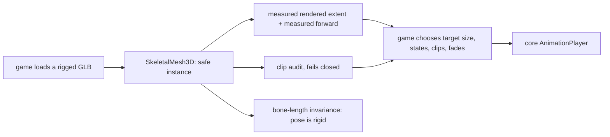

# PRD-324 — an imported rig instances and poses correctly, once

**Status: PARTIAL, 2026-09-04. Phases 0–2 DONE and shipped; Phases 3–7 OPEN.** Consumer census:
[`docs/verification/PRD-324-second-consumer-census.md`](../../verification/PRD-324-second-consumer-census.md).

**The defect that opened this PRD is fixed.** Phases 0–2 landed 2026-09-02 and stand: the pose
defect was found and fixed in the engine loader (`reconcileMirroredClips`, clips z-mirrored against
their own bind), with the instrument (`boneLengths`/`boneLengthDeviations`,
`packages/core/src/bone-lengths.ts`) and the framed harness view. Evidence:
`docs/verification/PRD-324-phase1-phase2.md`. AC0 and AC1 are met.

**AC2 is satisfiable — three independent games already hand-write this surface.** Phases 3–7 were
briefly declined on 2026-09-04 for want of a second consumer and that decline was **wrong**; a
review found the consumers and it is retracted. The census, by workspace (each its own
`package.json` in the `../sandbox` repository):

| Game | Skeleton-safe clone | Bind-pose normalisation | Clip playback |
|---|---|---|---|
| `wildwood` | `Animal.ts:8` | `Animal.ts:167` | `AnimationPlayer` |
| `threenative-hq` | `office/Worker.ts:4`, `office/Visitor.ts:6` | `Worker.ts:71`, `Visitor.ts:76` | `Worker.ts:88`, with `strideRoot` |
| `fps-framework` | `entities/Enemy.ts:1072` | `Enemy.ts:747`, `:962`, `:972`, `Rifle.ts:96` | `AnimationPlayer` |

Not counted: `prd259-bayview-current-20260830` is a dated snapshot of `fps-framework` — same
`"name"` in `package.json` — and `ue-static-import` calls `normaliseToMetres` without a skinned
clone, so it is not this surface's consumer.

**Why the decline was wrong, recorded because the mistake is reusable.** The search was re-run
rather than inherited from PRD-321 — but with PRD-321's *scope*, the ten templates and sixteen
examples, and the sandbox repository was never searched. Re-running a search inside an inherited
boundary inherits the conclusion. The rule that should have caught it is this repository's own:
attempt the blocked reason before believing it, and a scope is part of the reason.

**What Phases 3–7 still need**, unchanged: the surface itself, the migration of at least two of the
three consumers with their private copies deleted, a manifest entry, and native proof. The kill
switch still applies — `count-loc.ts` must score smaller at both call sites, and a
lowest-common-denominator wrapper that fits an animal, an office worker and a soldier only by
deciding nothing is still a decline.

**Original status: PARTIAL, 2026-09-02.** Driven by a live, unsolved rendering defect in
`sandbox/wildwood` at `d64fc78`. Sibling of PRD-321; see §7 for the split.

**Complexity:** +2 proposes new core exports, +2 must hold the rule-3 look boundary, +1 needs a
second consumer, +1 crosses core and the templates, +1 needs web and native proof, +1 opens with an
unsolved defect whose root cause is not yet isolated = **8 → HIGH mode.** A `prd-work-reviewer`
checkpoint after every phase. Phase 0 is not optional and may close this PRD as DECLINED.

## 1. Context

### The defect that opened this

Every animated animal in `sandbox/wildwood` renders with its skeleton folded — spine bent double,
head pointing backwards or buried in the ground, hindquarters displaced from the forelegs. Sizes and
positions are correct; the **pose** is wrong. Zero console errors, zero page errors.

Reproduce (headed only — headless Chromium cannot capture WebGPU on this machine):

```
http://127.0.0.1:5173/dev-animals.html?state=walk&threat=0
```

Full investigation record: **`BUGREPORT-animals-deformed-2026-09-02.md`** in the Wildwood game
repo — which is a **separate git repository** at `../sandbox` relative to this one, not a
subdirectory. Absolute path on the authoring machine:
`/home/joao/projects/threenative/sandbox/wildwood/BUGREPORT-animals-deformed-2026-09-02.md`, at
commit `d64fc78`. It carries the reproduce steps, the disproven theories in full, and the harness
warning. **Read it before Phase 1.**

Engine-side commits this PRD builds on: `0495d86b` (quantized-POSITION widening in the loader),
`9063216c` (skin-aware measurement characterisation test). Game-side: `cf15e9e` (sizing via
`normaliseToMetres`, harness ground), `056e2f3` (clip names, audit wired), `13d1288` (mirror
diagnosis retracted).

**Ignore `BUGREPORT-2026-09-01.md`** sitting beside it in the same directory. That is an earlier
report on the *tree* collapse, written by a weaker model, and several of its findings are wrong or
self-retracted (its own F12 voids every "clean" verdict it recorded). Its conclusion — that the
asset bake was the poison — is disproven: the corruption reproduced with pristine source bytes, and
a numeric source-vs-bake diff across all 57 species found zero differences. The tree bug was the
quantized-`POSITION` clamp, fixed in `0495d86b`, and is unrelated to this PRD.

### Why this is a framework problem, not a Wildwood problem

Getting a rigged glTF onto the screen correctly requires knowing six non-obvious things. Wildwood
got **four of them wrong**, in ~900 lines of hand-written animal code, and every one of them is a
trap any game hits:

| # | The trap | What Wildwood did | Cost |
|---|---|---|---|
| 1 | A plain `.clone(true)` of a skinned model renders as a giant broken copy | used `SkeletonUtils.clone` (correct — it had already been bitten) | — |
| 2 | A skinned vertex renders at `Σ w·(bone.matrixWorld · boneInverse)·position`, **not** `matrixWorld × POSITION` | hand-rolled `percentileSpan()` on the wrong space | every animal measured ~1.96 (the quantisation cube) against a fox skeleton spanning 0.33; the fox rendered at a third size, an ant; the crow measured 1.06 and rendered 0.07 |
| 3 | Clip names must actually exist in the file | spread one animal's clip map into another's, keeping the wrong prefix | doe bound **0 of 10** clips, wolf **1 of 10** — both frozen in bind pose, silently |
| 4 | A track that binds nothing plays the bind pose and reports nothing | wrote `Animal.audit()` and then **never called it** | the defect in row 3 shipped and was invisible for a day |
| 5 | An imported rig's bind pose is not the game's metre scale | `normaliseToMetres` was installed the whole time and unused | see row 2 |
| 6 | Pose application itself | **unsolved — see §2** | the deformation |

Rows 2, 3, 4 and 5 are already fixed in the game (`cf15e9e`, `056e2f3`), but they were fixed **in
Wildwood**, which means the next game rediscovers all four. That is the definition of plumbing every
game repeats and no game should write.

### Naming

The user proposed `AnimatedMesh`. **Recommend against it**, and follow rule 4 (vocabulary is
borrowed, never invented):

- **Godot** has `AnimatedSprite2D`/`AnimatedSprite3D`, which is *flipbook* animation. `AnimatedMesh`
  would read as "a mesh that flips between frames" to anyone coming from Godot. Godot's actual
  vocabulary here is `Skeleton3D` (the node) plus `AnimationPlayer` (which core already borrows).
- **Unreal** has exactly the right noun: **`SkeletalMesh`**, defined against `StaticMesh`. That
  contrast is the one that matters — a mesh that carries a skeleton and clips.
- **three.js** owns the rendering half and calls the object a `SkinnedMesh`.

Repo precedent puts a `3D` suffix on node-shaped classes (`GPUParticles3D`, `Billboard3D`,
`SoftBody3D`, `PathFollow3D`, `SpriteAnimator3D`, `TracerPool3D`, `WaterSurface3D`).

**Proposed: `SkeletalMesh3D`.** Unreal's noun, the repo's suffix, no invented word, and it does not
collide with `SkinnedMesh` (three's own low-level object, which this composes rather than replaces).
If Phase 0 finds the surface is better as free functions than a class, the functions keep the same
noun (`instanceSkeletalMesh`, `measureSkeletalMesh`).

### Files analysed

- `sandbox/wildwood/src/entities/animals/{Animal.ts,animalSpecs.ts,spawnWildwoodAnimals.ts}`
- `sandbox/wildwood/src/dev/animals.ts`, `dev-animals.html`
- `packages/core/src/animation.ts` — existing `AnimationPlayer`, `clipTrackBindings`
- `packages/core/src/scale.ts` — existing `normaliseToMetres`
- `packages/core/src/pose-measure.ts` — existing `posedBounds`, `measureThreePose`
- `packages/core/src/assets.ts` — `widenQuantizedPositions`, landed `0495d86b`

## 2. The unsolved defect — what is established, and what is disproven

**Do not start by forming a theory. Four are already dead.**

**Established, with evidence:**
- The clips are healthy. Animation accessors are byte-identical source-vs-bake; all 803 rotation
  quaternions on `ANIM_DeerStag_Walk` are unit length.
- The bindings are correct. `Animal.audit()` reports **30/30 bound, 0 MISSING** across six animals.
- The rig is healthy. An animal with no clip bound stands correctly shaped.
- `SkeletonUtils.clone` is correct here. The two primitives (`mesh_0`, `mesh_0_1` — body and fur,
  identical vertex counts) get two `Skeleton` wrapper objects but **share all 34/34 bone objects**,
  and every bone is inside that animal's own subtree. Measured, not assumed.

**Therefore: healthy clip + healthy rig + correct binding + correct clone → deformed pose.** The
defect is in how the pose is *applied*.

**Disproven — do NOT re-investigate:**

| # | Theory | How it died |
|---|---|---|
| D1 | The importer left a Z mirror between bind pose and clips | The measurement is real (`T STAG_ bind=[0,0.999,−0.504]` vs `clip0=[0,0.999,+0.504]`) but `(x,y,z,w)→(−x,−y,z,w)` is conjugation by a 180° **yaw**, not a reflection, and clip frame 0 need not equal the bind pose. The exact correction was implemented across all 218 root tracks on all six rigs: **render unchanged.** Reverted. |
| D2 | `stripJunkTriangles` corrupts the mesh | Disabled entirely; deformation unchanged |
| D3 | The asset bake corrupts the animals | Animation and geometry byte-identical source-vs-bake; `assertNoDrift` in `packages/assets/src/passes/model.ts` already self-verifies triangles, vertices, joints, clips and world bounds, and passes honestly |
| D4 | The quantized-`POSITION` clamp that broke the trees | Real engine bug, fixed in `0495d86b`, but widening positions preserves the same numbers and cannot change a pose |
| D5 | `SkeletonUtils.clone` mis-rebinds the two-primitive skin | Bones measured shared 34/34, all in-subtree |

**Remaining live hypotheses, in the order to test them.** Each is a one-line experiment:

1. **`AnimationPlayer`'s `strideRoot`.** `Animal.ts:127` passes `this.object` (the parent `Group`)
   as `strideRoot` while `root` is the clone; `packages/core/src/animation.ts:209` calls
   `getWorldPosition` on it. Drive a raw `THREE.AnimationMixer` on the clone instead. If raw is
   correct, the bug is in core and this PRD's Phase 2 owns it.
2. **Frame 0 vs accumulation.** Pin the mixer to `t = 0` and step manually. Deformed at frame 0 →
   a bind/binding problem. Degrades over time → accumulation in the stride logic.
3. **One primitive at a time.** Hide `mesh_0_1`, then `mesh_0`. If one is correct alone, the two
   `Skeleton` wrappers over shared bones are interacting.
4. **Bone-length invariance.** A rigid skeleton preserves parent→child bone distance under any pose.
   Measure bind lengths against animated lengths per frame; any bone whose length changes names the
   defect without a screenshot. **This is the instrument to build first** — see AC0.

## 3. Why every visual verdict so far was worthless

Two "looks correct" calls in this investigation were wrong and the user caught both. The harness
makes that near-unavoidable:

- `src/dev/animals.ts:73` — camera at `(0, 2.4, 11)` looking at `(0, 0.8, 0)`
- `src/dev/animals.ts:40-47` — `PRODUCTION_PLACEMENTS` spawns at x = 28, 54, −6, 20, 14
- animals then roam a further 30–55 m (the HUD prints `roam`)

Every animal is a few dozen pixels at the edge of frame. **No screenshot taken this way is
evidence.** The harness already ships a negative control — `?corruptAnimalForward=fox`
(`src/dev/animals.ts:125`) — which deliberately yaws the fox rig. Any new view must be shown to
*see* that corruption before a green from it is believed.

## 4. The rule-3 test, applied before anything is written

> Can the game change the appearance completely without editing package code?

| Candidate | Decides how anything looks? | Verdict |
|---|---|---|
| Skeleton-safe instancing of an imported rig | No — the same pixels, correctly | **Mechanism** |
| Measured rendered extent of a skinned rig | No — returns a number | **Mechanism** |
| Clip binding audit that fails closed | No — returns a report | **Mechanism** |
| Bone-length invariance check | No — returns a number | **Mechanism** |
| Which clip plays, when, and how long it fades | Yes | **Stays in the game** |
| Clip names, states, species, sizes, spawn density | Yes, and inventing them breaks rule 4 | **Stays in the game** |

## 5. Integration Ledger

| # | New thing | Live caller | Replaces or rejects | Negative control |
|---|---|---|---|---|
| 1 | Bone-length invariance measurement in core | `packages/core/src/→impl`; the Wildwood harness and a unit fixture | Rejects grading a pose by screenshot, per PRD-314 | Scale one bone in a fixture rig mid-clip; the check must name that bone |
| 2 | `SkeletalMesh3D` — instance an imported rig once, correctly | `sandbox/wildwood/src/entities/animals/Animal.ts:→impl` + a second consumer | Replaces Wildwood's inline `SkeletonUtils.clone` + `normaliseToMetres` + manual bind; rejects re-exporting `SkeletonUtils` verbatim | Swap to plain `.clone(true)`; the skinned-bounds assertion fails |
| 3 | Clip binding audit that **fails closed** | `→impl` | Rejects an audit nothing calls — the exact way defect 3 shipped | Point a spec at a clip name the file lacks; construction must throw, not warn |
| 4 | The pose fix from §2 | `→impl` | — | The bone-length check from row 1 goes red on the pre-fix build |
| 5 | Wildwood rewritten onto the surface, its copy deleted | `Animal.ts` | Rejects two live implementations | Delete the core export; Wildwood fails to build |
| 6 | A second, unrelated consumer | a template or example `→impl` | Rejects a one-consumer abstraction | Only one caller at final review fails this PRD |
| 7 | Capability manifest entries | `capabilities.json` via `pnpm build` | Rejects an export no plain-words search finds | Search "put an animated character in the scene"; a miss fails |



## 6. Phases

**Phase 0 — the decline check.** Name the second consumer and confirm it needs the same pieces. Run
`pnpm tsx scripts/count-loc.ts` on the proposed surface against plain Three.js at **both** call
sites. Not smaller across two real consumers → this PRD closes as DECLINED. Paste the score either
way.

**Phase 1 — the instrument, before the fix.** Build the bone-length invariance check (ledger row 1)
and a single-animal framed harness view (`?only=<id>`, `?roam=0`, camera framed on the animal).
Validate the view against `?corruptAnimalForward=fox` — prove it *sees* a known-broken pose. Paste
the numeric report for the current, broken build.

**Phase 2 — isolate and fix the pose defect.** Work §2's four live hypotheses in order. Name the
layer before writing the fix. Red-green in the same commit.

**Phase 3 — the core surface.** The smallest thing that satisfies Phases 1–2. It returns instances
and numbers; it decides nothing.

**Phase 4 — Wildwood moves over and its copy is deleted.** Not both.

**Phase 5 — the second consumer moves over.**

**Phase 6 — manifest and docs.** Findable by plain-words situation; named in the templates'
`AGENTS.md`, because a convention missing from there does not exist.

**Phase 7 — web and native.** A `--target` playtest or a conformance row, in the same commit.

## 7. Relationship to sibling PRDs — read before starting

- **PRD-321** (*the animal state machine is mechanism; the animals are the game*, same batch) already
  claims the **skeleton-safe clone**, **bind-pose normalisation**, **anatomical forward** and
  **ground-follow**. This PRD does **not** re-propose those. If both are executed, PRD-321 owns the
  clone/scale/forward/ground surface and PRD-324 owns **pose correctness**: the defect in §2, the
  fail-closed clip audit, and the bone-length instrument. **Whichever is picked up first absorbs
  the shared `SkeletalMesh3D` constructor; the second builds on it.** Do not land two.
- **PRD-314** (*a broken retarget is a number, not a screenshot*, DONE) already ships
  `clipPoseError`, `clipTrackBindings`, `clipBoneCoverage` and `boneContact`. Phase 1 must use them
  before writing anything new, and must state what they could not answer.
- **PRD-315** (*Wildwood loads fast and its animals belong in the valley*) is the owning round.

## 8. Acceptance criteria

- [ ] **AC0 — the instrument comes first.** A numeric check that fails on the current broken build
      and names a bone, plus a harness view proven against `?corruptAnimalForward=fox`. Paste both
      outputs. No screenshot-only evidence is accepted anywhere in this PRD.
- [ ] **AC1 — the deformation is fixed, and the fix is red-green.** State which line, reverted, makes
      AC0's check fail, and paste that failure.
- [ ] **AC2 — two real consumers.** At final review the surface has two non-test callers in different
      projects and `count-loc.ts` scores it smaller than plain Three.js at both. One consumer fails
      this PRD.
- [ ] **AC3 — the audit fails closed.** A spec naming a clip the file lacks throws at construction.
      Negative control: Wildwood's pre-fix `DOE_CLIPS` must throw, not warn. (`animalSpecs.ts` before
      `056e2f3` is the fixture — doe bound 0/10.)
- [ ] **AC4 — measurement is skin-aware.** A fixture rig whose bind box and rendered extent differ by
      a known factor measures the rendered extent. Negative control: `matrixWorld × POSITION` reports
      the bind box and fails.
- [ ] **AC5 — Wildwood has no copy left.** `percentileSpan`-shaped hand-rolled measurement and inline
      `SkeletonUtils.clone` are gone from `Animal.ts`.
- [ ] **AC6 — findable.** `engine_search_capabilities` on "put an animated character in the scene"
      and "my imported character renders deformed" both return it.
- [ ] **AC7 — native.** A `--target` playtest or conformance row in the same commit, per the rule
      that a feature working on web only is unfinished.

## 9. Open questions for the executor

1. Is `SkeletalMesh3D` a class or a set of free functions? Phase 0 decides; the noun does not change.
2. Does the fix in Phase 2 belong in `packages/core/src/animation.ts`, in the external
   `threenative-asset-mcp` importer (0.7.0, installed at `sandbox/.mcp-tools` from
   `/tmp/skeletal-pack/threenative-asset-mcp-0.7.0.tgz` — **not in this repo**, so an importer fix
   also needs a re-import), or in the game? Name the layer before writing the fix.
3. Should the clip audit run in production builds or only in dev? Fail-closed says production;
   frame cost says load-time only. It is load-time only either way — say so explicitly.
